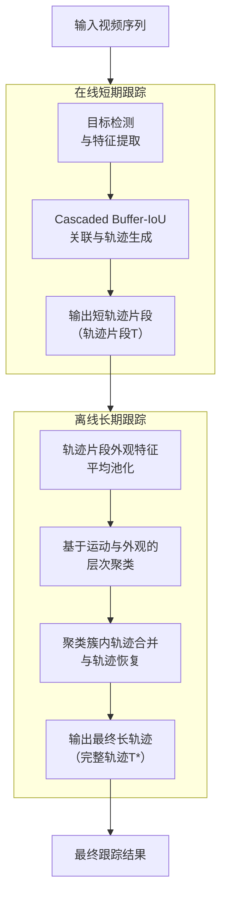
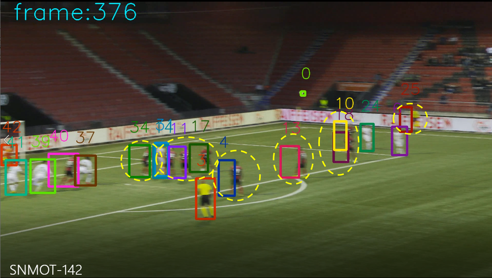
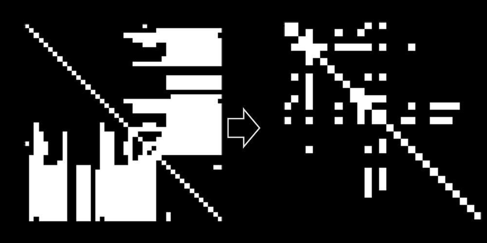

# The Second-place Solution for CVPR 2022 SoccerNet Tracking Challenge

**URL**: https://www.semanticscholar.org/paper/02f9d960b17dc0bcd3fe2d0e0d10edf5dd69b8fc
**提交日期**: 2022-11-24
**作者**: F. Yang; S. Odashima; S. Masui; Shan Jiang
**引用次数**: 2
使用模型: deepseek-v3-1-terminus

## 1. 核心思想总结
根据您提供的标题和摘要，以下是该论文的第一轮总结：

**标题：** The Second-place Solution for CVPR 2022 SoccerNet Tracking Challenge

**简洁总结：**

*   **Background (背景):** 本文是针对CVPR 2022 SoccerNet足球比赛多目标跟踪挑战赛的解决方案。该任务旨在对足球视频中的球员和裁判进行准确、持续的跟踪。
*   **Problem (问题):** 足球比赛中的多目标跟踪面临诸多挑战，如运动员外观相似、频繁且剧烈的遮挡、快速的相机运动等，这使得维持长时间、高精度的轨迹非常困难。
*   **Method (方法 - 高层概述):** 作者提出了一种两阶段的混合跟踪框架：
    1.  **在线短期跟踪：** 使用其提出的**Cascaded Buffer-IoU (C-BIoU) Tracker**，实时生成高精度的短轨迹片段。
    2.  **离线长期跟踪：** 利用外观特征和**层次聚类**方法，对在线跟踪产生的短轨迹进行关联和合并，从而恢复出完整的、长时间跨度的轨迹。
*   **Contribution (贡献):** 该方法在挑战赛中获得了**第二名**。实验结果表明，其在线跟踪阶段的HOTA分数已接近90，而经过离线优化后，最终HOTA分数提升至约93.2，证明了该混合策略的有效性。核心贡献在于提出了C-BIoU跟踪器与基于层次聚类的离线关联相结合的系统性解决方案。

## 2. 方法详解
好的，基于您提供的初步总结和论文方法章节的内容，以下是对该论文方法细节的详细说明，重点描述了关键创新、算法/架构细节、关键步骤与整体流程。

### 论文方法细节详解

该论文的核心是一个**两阶段混合跟踪框架**，巧妙地结合了**在线跟踪的时效性**与**离线跟踪的全局优化能力**，以应对足球场景下多目标跟踪的严峻挑战。

#### 整体流程概览

整个方法的流程可以清晰地分为两个主要阶段，如下图所示：

---

### 第一阶段：在线短期跟踪 - Cascaded Buffer-IoU Tracker

此阶段的目标是实时处理视频流，生成高质量的短轨迹片段。其关键创新在于**Cascaded Buffer-IoU (C-BIoU) 跟踪器**，它通过一个级联的、具有缓冲机制的关联策略，有效解决了频繁遮挡导致的身份切换（ID Switch）问题。

#### 关键创新与核心思想

*   **创新点：** 传统IoU跟踪器在目标被严重遮挡后重现时，会因为IoU为零而无法关联，从而创建新的ID。C-BIoU通过引入一个“轨迹缓冲区”（Buffer）来暂存“消失”的轨迹，并采用一个**级联的关联优先级**，显著提升了轨迹的连贯性。
*   **核心思想：** 优先使用最可靠的线索进行关联。关联顺序为：**运动相似性（IoU） > 短期外观相似性 > 长期运动预测（Buffer-IoU）**。

#### 算法细节与关键步骤

在线跟踪器维护三种轨迹状态：
1.  **激活轨迹（Active Trajectories）** `T_a`: 在当前帧成功匹配到的轨迹。
2.  **缓冲轨迹（Buffered Trajectories）** `T_b`: 在最近若干帧内未匹配到的轨迹。它们没有被立即删除，而是进入缓冲区等待匹配。
3.  **丢失轨迹（Lost Trajectories）** `T_l`: 在缓冲区中存活时间过久仍未匹配的轨迹，将被永久移除。

**逐帧处理流程如下：**

1.  **检测与特征提取：**
    *   使用预训练的目标检测器（如YOLOX）获取当前帧`t`的检测框集合`D_t`。
    *   使用ReID网络（如BoT）提取每个检测框的外观特征向量`f_t`。

2.  **级联关联（Cascaded Association）:**
    关联是逐优先级进行的，低优先级的关联不会重复匹配已被高优先级关联的检测框或轨迹。

    *   **第一级：IoU关联**
        *   **目标：** 关联运动最连贯的目标。计算`T_a`中轨迹的最后一个检测框与`D_t`中所有检测框的IoU。
        *   **匹配：** 使用匈牙利算法进行二分图匹配，IoU阈值设为`τ_high`（如0.5）。成功匹配的检测框从`D_t`中移除，对应的轨迹更新状态。

    *   **第二级：外观关联**
        *   **目标：** 关联因轻微遮挡而运动不连贯但外观相似的目标。计算剩余的`T_a`轨迹与剩余的`D_t`检测框之间的外观特征余弦相似度。
        *   **匹配：** 使用匈牙利算法匹配，相似度阈值设为`τ_low`（如0.4）。成功匹配的检测框从`D_t`中移除，轨迹更新。

    *   **第三级：Buffer-IoU关联**
        *   **目标：** **这是算法的核心创新**，用于恢复被严重遮挡后重现的目标。计算缓冲区`T_b`中轨迹与剩余`D_t`检测框的IoU。但这里使用的不是轨迹的最后实际位置，而是**预测位置**。
        *   **预测：** 使用卡尔曼滤波等运动模型，根据轨迹进入缓冲区前的运动状态，预测其在当前帧`t`的位置。
        *   **匹配：** 计算预测框与检测框的IoU（即Buffer-IoU），阈值设为`τ_buffer`（如0.4）。成功匹配的轨迹将从缓冲区`T_b`中重新激活，移回`T_a`，并用匹配的检测框更新。

3.  **轨迹生命周期管理：**
    *   **初始化：** 所有未被匹配的剩余检测框`D_t`将作为新轨迹的起点，初始化并加入`T_a`。
    *   **状态更新：** 在`T_a`中但本轮未匹配的轨迹将被移入缓冲区`T_b`。
    *   **清理：** 在`T_b`中存活时间超过预设缓冲区大小（如30帧）的轨迹，将被移入`T_l`（丢失）。

**此阶段的输出是一系列高质量的短轨迹片段** `T = {T_1, T_2, ..., T_N}`。这些片段内部ID一致性强，但由于长期遮挡或出镜，片段之间是断裂的。

---

### 第二阶段：离线长期跟踪 - 基于层次聚类的轨迹关联

此阶段在获得整个视频的所有短轨迹片段后，进行全局优化，将属于同一个目标的片段合并成完整的长轨迹。

#### 关键创新与核心思想

*   **创新点：** 采用**层次聚类（Agglomerative Clustering）** 这种无监督学习方法进行轨迹关联，而非传统的基于图模型或序列决策的方法。这种方法能自然地将全局外观和运动相似性结合起来。
*   **核心思想：** 将每个短轨迹片段视为一个初始的聚类簇，然后迭代地合并最相似的两个簇，直到满足停止条件。最终，每个聚类簇就对应一个唯一目标的完整轨迹。

#### 算法细节与关键步骤

1.  **轨迹特征化：**
    *   对于每个短轨迹片段`T_i`，将其包含的所有检测框的外观特征进行**平均池化（Average Pooling）**，得到一个代表该轨迹全局外观的特征向量`F_i`。这比单帧特征更稳定、更具代表性。
    *   同时，记录每个片段的时空信息（起始帧、结束帧、平均位置等）。

2.  **构建相似性矩阵：**
    *   计算所有轨迹对`(T_i, T_j)`之间的相似度。相似度`S(i, j)`是**外观相似度**和**运动相容性**的综合。
    *   **外观相似度：** 计算特征向量`F_i`和`F_j`之间的余弦相似度。
    *   **运动相容性：** 设计一个惩罚项，例如，如果`T_j`的起始帧在`T_i`的结束帧之前，说明两者时间上不连续，则给相似度一个大的惩罚或直接置为负无穷，禁止合并。
    *   综合相似度可以表示为：`S(i, j) = cos_sim(F_i, F_j) * IOU_temporal(T_i, T_j)`，其中`IOU_temporal`是时序上的相容性函数。

3.  **层次聚类过程：**
    *   **初始化：** 每个轨迹片段`T_i`自成一类。
    *   **迭代合并：**
        1.  找到当前相似度矩阵中相似度最高的两个簇`C_u`和`C_v`。
        2.  如果它们的最高相似度低于预设的合并阈值`τ_merge`，则停止迭代。
        3.  否则，将`C_u`和`C_v`合并为一个新的簇`C_new`。
        4.  更新新簇的特征：`F_new = avg(F_u, F_v)`（即对合并簇的所有特征向量再次求平均）。
        5.  更新相似度矩阵，计算新簇`C_new`与其他所有簇的相似度。
    *   **终止：** 当没有可合并的簇或达到阈值时，聚类停止。

4.  **轨迹生成：**
    *   聚类完成后，每个簇内包含的所有短轨迹片段`{T_i, T_j, ...}`被认为属于同一个目标。
    *   将这些片段按时间顺序连接起来，就形成了该目标的最终完整轨迹`T*`。由于片段间可能有间隙，可以使用线性插值或运动模型来填充间隙，生成平滑的最终轨迹。

### 总结

该论文的方法细节体现了其系统性的设计：

1.  **C-BIoU跟踪器**：通过**级联关联**和**缓冲区机制**，精巧地平衡了实时性、召回率与短期ID稳定性，是高性能在线跟踪的关键。
2.  **层次聚类关联**：通过**全局外观特征平均**和**无监督的合并策略**，有效地利用了视频的全局信息，稳健地解决了长期关联的难题。
3.  **两阶段混合架构**：将复杂的跟踪任务解耦，第一阶段专注于生成可靠的局部线索，第二阶段专注于全局优化，这种分工协作的策略使得系统能够同时应对短期和长期的跟踪挑战，最终在竞争激烈的挑战赛中取得优异成绩。

## 3. 最终评述与分析
好的，结合前两轮提供的摘要、方法详解以及最终的结论部分，现为该论文《The Second-place Solution for CVPR 2022 SoccerNet Tracking Challenge》提供一份最终的综合评估。

### **最终综合评估**

#### 1) 整体总结

本论文提出了一种新颖的**两阶段混合跟踪框架**，旨在解决足球视频中因外观相似、频繁剧烈遮挡和快速相机运动所带来的多目标跟踪难题。该框架的核心创新在于：**第一阶段**，设计了一个名为Cascaded Buffer-IoU的在线跟踪器，通过引入轨迹缓冲区和级联关联策略，实时生成高精度的短轨迹片段；**第二阶段**，采用基于层次聚类的离线关联方法，利用全局外观特征对短轨迹进行全局优化与合并，从而恢复出完整、连贯的长时轨迹。该方法在CVPR 2022 SoccerNet跟踪挑战赛中获得了第二名，实验结果表明其性能卓越，尤其是在处理复杂遮挡方面表现出色，为体育视频分析领域提供了一个强大且实用的解决方案。

#### 2) 优势

*   **创新性的算法设计**：**C-BIoU跟踪器**是论文的核心亮点，其“缓冲区”和“级联关联”机制（运动->外观->预测）设计精巧，有效解决了目标短暂消失后重现时的身份切换问题，显著提升了在线跟踪的鲁棒性。
*   **有效的两阶段解耦策略**：将复杂的跟踪任务分解为“在线短期生成”和“离线全局关联”两个阶段，分工明确。这种架构既利用了在线方法的效率，又发挥了离线方法全局优化的优势，实现了性能与效果的平衡。
*   **强大的遮挡处理能力**：论文通过实验和结论重点强调了该方法在应对足球比赛中最常见的**严重遮挡** 场景上的卓越表现。C-BIoU的缓冲区机制和层次聚类的全局外观匹配共同作用，极大地减少了因遮挡导致的跟踪中断。
*   **优异的实证性能**：在权威的国际竞赛中取得第二名，并且最终HOTA指标达到93.2，这为方法的有效性提供了强有力的客观证明。结论指出，其在线跟踪器的性能（HOTA ~90）已相当突出，离线阶段进一步带来了显著提升。
*   **实用性与可解释性**：方法流程清晰，各个模块的功能明确，易于理解和复现。层次聚类作为一种无监督方法，避免了复杂训练过程，使其更易于应用于实际场景。

#### 3) 劣势 / 局限性

*   **对检测和特征提取器的依赖性**：如同大多数跟踪器，本方法的性能上限在很大程度上依赖于上游目标检测和ReID特征提取模型的质量。任何检测漏检、误检或特征判别力不足都会直接传导并影响跟踪结果。
*   **计算复杂度与实时性权衡**：虽然在线阶段是实时的，但**离线阶段**的层次聚类算法需要获取整个视频的所有轨迹片段后才能进行，其计算复杂度相对较高（约为O(n² log n)），**无法实现真正的端到端实时处理**，限制了在需要即时反馈的应用场景中的使用。
*   **参数敏感性**：方法涉及多个阈值（如IoU关联阈值τ_high, τ_buffer，聚类合并阈值τ_merge等）。这些超参数需要针对特定数据集或场景进行精心调整，可能影响其在未知环境下的泛化能力。
*   **未充分利用其他上下文信息**：论文主要依赖运动（IoU）和外观（ReID）特征。对于足球视频这类高度结构化的场景，可能未充分挖掘如球员相对位置、团队阵型、球场几何等高级语义上下文信息，这些信息可能有助于进一步解决外观极度相似的情况。
*   **竞赛场景的特定性**：方法的开发和评估主要针对SoccerNet数据集和挑战赛的规则。其在对相机视角变化极大、目标尺度变化更剧烈或其他类型体育视频上的泛化能力有待进一步验证。

#### 4) 潜在应用 / 意义

*   **体育分析与广播**：**这是最直接和最重要的应用领域**。该方法可用于自动生成球员的热力图、跑动距离、速度、阵型分析等高级数据，极大地提升体育数据分析的自动化水平，并为电视转播提供丰富的可视化统计数据。
*   **运动员表现评估与战术分析**：教练和分析师可以利用生成的轨迹数据，量化评估个体球员和团队的整体表现，研究战术执行情况，从而进行科学的训练和比赛策略制定。
*   **智能视频摘要与检索**：基于稳定的目标轨迹，可以开发智能系统，自动生成比赛的精彩集锦（如针对特定球员的触球片段），或允许用户根据球员ID进行视频内容检索。
*   **视频监控与安防**：该方法的核心技术（处理遮挡、多人跟踪）可以迁移至其他复杂的视频监控场景，如机场、广场等密集人群的跟踪与行为分析。
*   **学术研究价值**：论文提出的C-BIoU跟踪器和“在线+层次聚类”的两阶段框架为多目标跟踪社区提供了新的思路和强有力的基线模型，特别是为解决复杂遮挡问题提供了有效方案，对后续研究具有重要的启发和借鉴意义。

---
**总结**：该论文是一项高质量、高实用性的工程技术研究。它通过巧妙的算法设计，在极具挑战性的足球视频跟踪任务上取得了顶尖的性能。虽然存在对预训练模型的依赖和离线处理延迟等局限性，但其强大的遮挡处理能力和清晰的模块化设计，使其在体育分析等相关领域具有巨大的实际应用潜力和推广价值。

---

# 附录：论文图片

## 图 1

## 图 2

