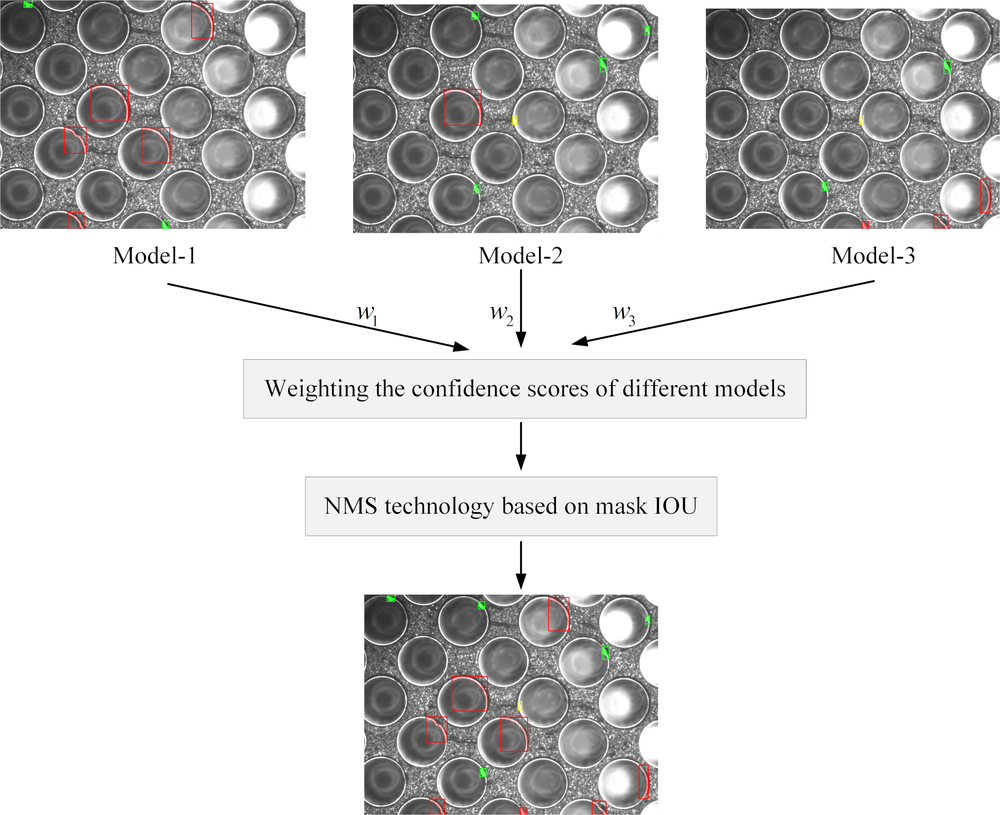
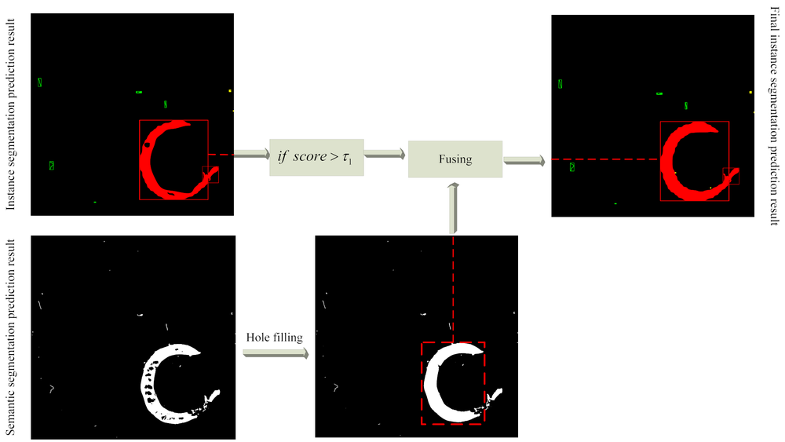
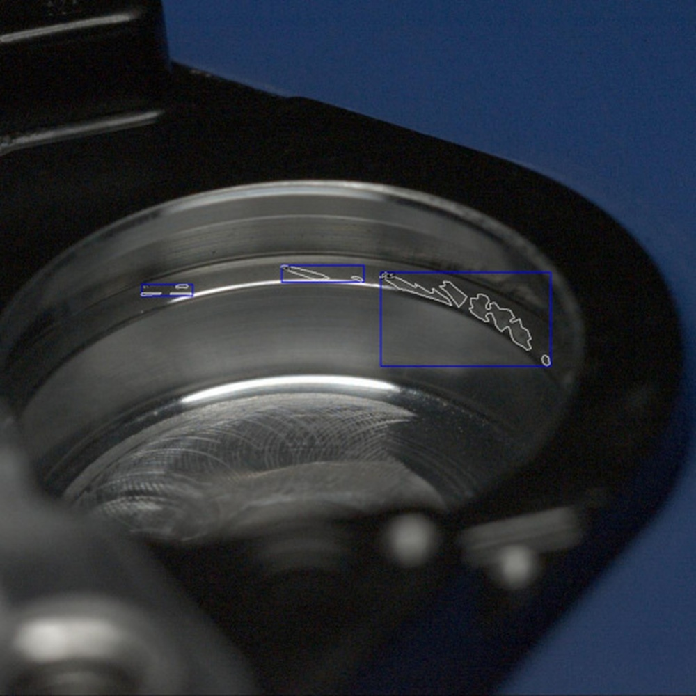
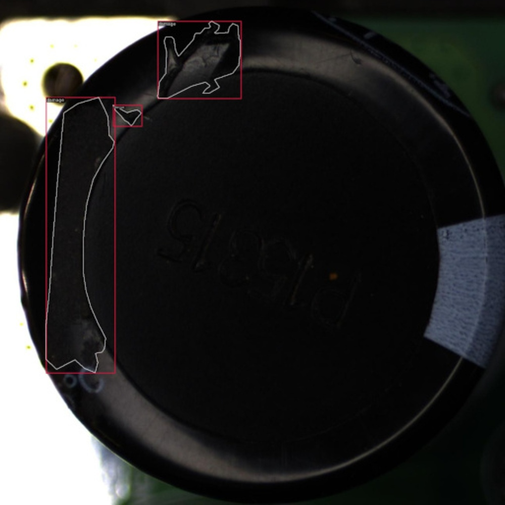
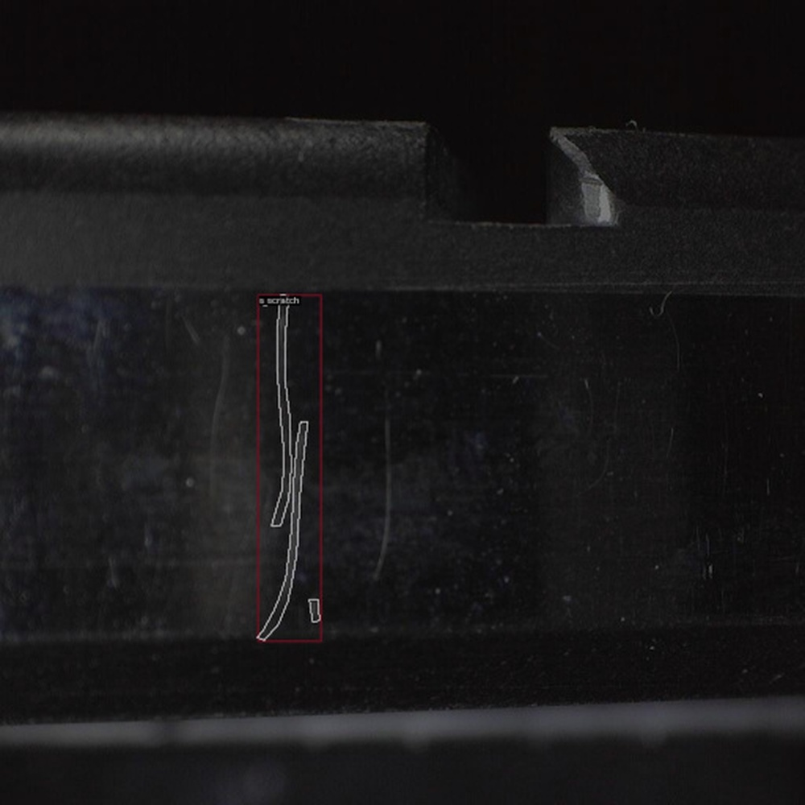
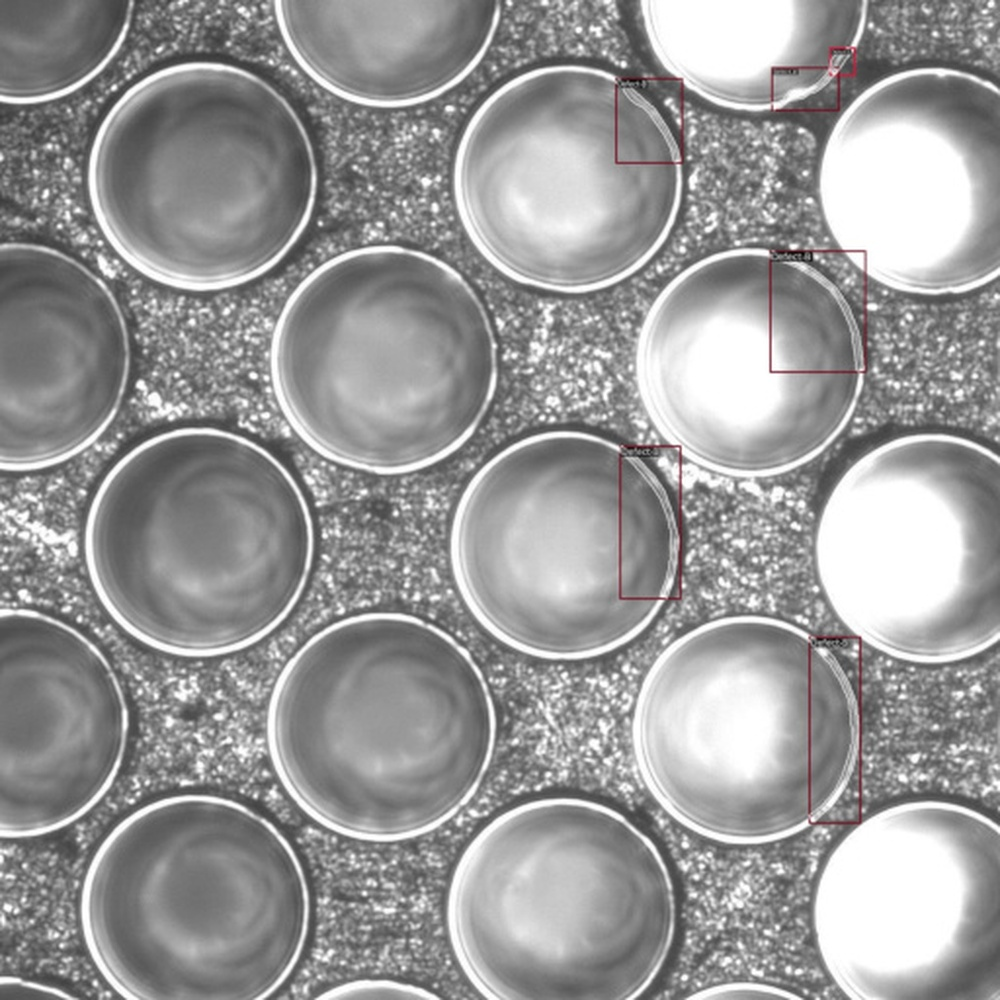
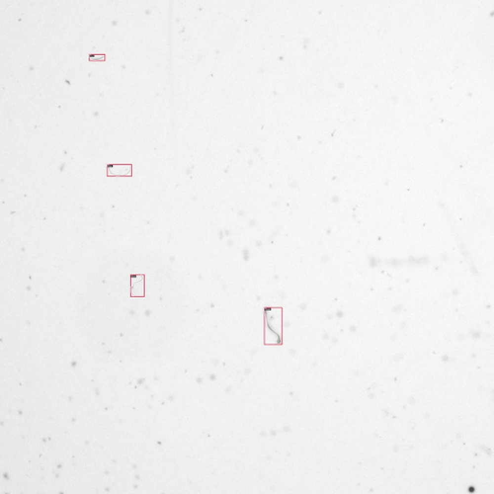
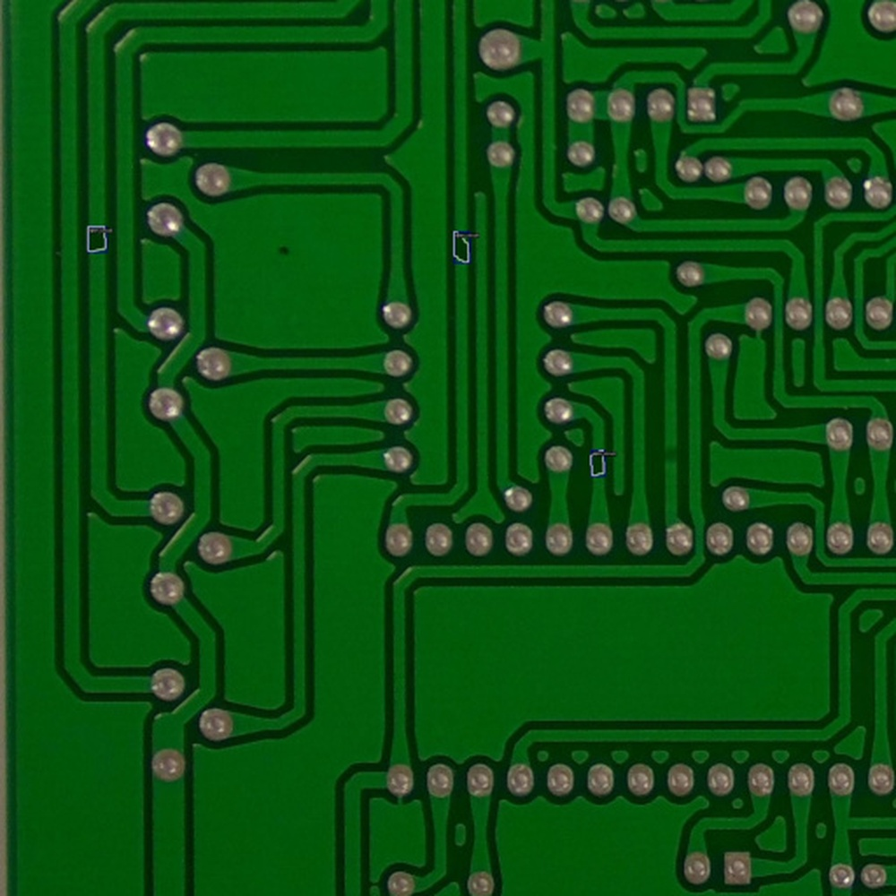
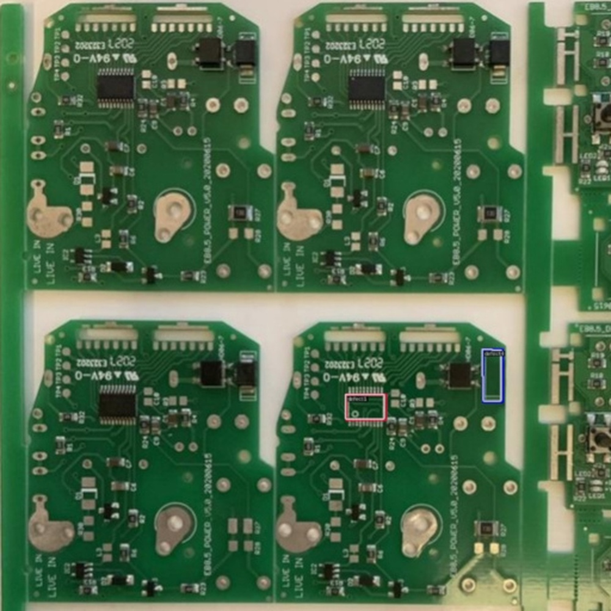

# The Second-place Solution for CVPR VISION 23 Challenge Track 1 - Data Effificient Defect Detection

**URL**: https://www.semanticscholar.org/paper/60997c0e63e0adbcbb894ab55db2b80e5a7b94e8
**提交日期**: 2023-06-25
**作者**: Xian Tao; Zhen Qu; Hengliang Luo; Jianwen Han; Yonghao He; Dan Liu; Chengkan Lv; Fei Shen; Zhengtao Zhang
**引用次数**: 0
使用模型: deepseek-v3-1-terminus

## 1. 核心思想总结
这是一份关于论文《The Second-place Solution for CVPR VISION 23 Challenge Track 1 - Data Efficient Defect Detection》的第一轮总结，按四个部分组织如下：

**1. Background (背景)**
该研究旨在解决CVPR VISION 23挑战赛第一赛道“数据高效缺陷检测”的任务。该任务要求参赛者在训练样本有限的数据稀缺环境下，对14个工业检测数据集实现高质量的实例分割。

**2. Problem (问题)**
核心问题是如何在训练样本数量有限的情况下，提升缺陷掩模的分割质量。这是一个典型的数据稀缺场景下的工业视觉检测难题。

**3. Method (high-level) (方法 - 高层次概述)**
研究团队的方法以混合任务级联算法（HTC）为基线模型。主要技术贡献包括：
*   **主干网络增强**： 受CBNetv2启发，通过复合连接方式集成多个Swin-B Transformer主干网络，以增强特征提取能力。
*   **模型集成策略**： 提出了两种集成方法以进一步提升效果：1）将语义分割任务融入实例分割流程；2）采用多实例分割模型融合算法。
*   **训练与推理优化**： 最终通过多尺度训练和测试时增强（TTA）策略来优化模型性能。

**4. Contribution (贡献)**
该方法在挑战赛测试集上取得了优异的成绩，平均mAP@0.50:0.95达到48.49%，平均mAR@0.50:0.95达到66.71%，最终获得了该赛道的第二名。其主要贡献在于为数据稀缺的工业缺陷检测提供了一套有效的、结合了先进主干网络和集成学习策略的实例分割解决方案。相关代码已开源。

## 2. 方法详解
好的，基于您提供的初步总结和论文方法章节，以下是对该论文方法细节的详细说明，重点描述了关键创新、算法/架构细节、关键步骤与整体流程。

### **论文方法详细说明**

该方法的核心思想是：**在一个强大的基线模型（HTC）基础上，通过增强其特征提取能力（主干网络）和引入多重集成策略（任务级与模型级），并结合精心的训练与推理优化，来克服训练数据稀缺的挑战。**

#### **1. 基线模型：混合任务级联 (HTC)**

*   **关键思想**： HTC 是实例分割领域的先进模型，其核心创新在于将多个分割任务（边界框回归、目标分类、实例分割）以级联和多任务学习的方式深度融合。与简单的串联不同，HTC 的每个阶段不仅会 refine 上一个阶段的预测结果，还会在特征层面进行交互，例如将上一个阶段的掩码预测信息反馈到当前阶段的特征图中，从而逐步提升分割精度。
*   **在该方案中的角色**： HTC 强大的多任务协同学习能力为整个方案提供了高起点，特别是在数据有限的情况下，这种精细化的设计有助于模型更充分地利用有限的标注信息。它作为基础的**架构框架**，后续的增强均基于此框架构建。

#### **2. 关键创新一：复合主干网络增强 (CBNetv2)**

*   **动机**： 在数据稀缺场景下，一个强大的特征提取器至关重要。为了在不显著增加推理时间的前提下大幅提升特征质量，团队借鉴了 CBNetv2 的思想。
*   **架构细节**：
    1.  **多主干网络**： 该方法并非使用单个主干网络（如 Swin-B），而是并行使用 **K 个（论文中 K=2 或 3）相同的 Swin-B Transformer** 作为主干。
    2.  **复合连接**： 这些主干网络并非独立工作，而是以一种“辅助”与“主导”的方式连接。具体而言，第一个主干（辅助主干）的输出特征会经过一个融合模块（如 1x1 卷积）后，**注入到第二个主干（主导主干）的相应阶段**。这种注入通常是逐元素相加或通道拼接。
    3.  **信息流动**： 辅助主干提取的初级特征帮助主导主干更好地聚焦于有用的信息，相当于为主干网络提供了“上下文提示”，从而让主导主干能提取出更鲁棒、更具判别力的高级特征。最终，只有**主导主干的输出特征**会被送入 HTC 的后续颈部（Neck）和头部（Head）进行实例分割。
*   **创新点**： 这种设计是一种高效的“模型膨胀”策略，通过集成多个中等规模的主干网络，实现了接近超大主干网络的性能，同时保持了相对较高的计算效率。

#### **3. 关键创新二：双重集成策略**

集成学习是该方法提升性能的另一大支柱，分为两个层面：

**A. 任务级集成：引入语义分割任务**

*   **做法**： 在 HTC 模型的基础上，额外增加一个**语义分割分支**。该分支通常是一个轻量级的解码器（如 FPN 或 UPerNet），接收来自主干网络的多尺度特征，并输出一个像素级的语义分割图（预测每个像素是否属于“缺陷”类别，而不区分实例）。
*   **集成方式**： 语义分割分支与实例分割分支（HTC）**共享同一个复合主干网络**，但在训练过程中进行**多任务联合学习**。损失函数是实例分割损失（如边界框损失、分类损失、掩码损失）和语义分割损失（如 Dice Loss 或 Cross-Entropy Loss）的加权和。
*   **作用**：
    1.  **正则化效应**： 语义分割任务为模型提供了像素级的全局监督信号，迫使主干网络学习对缺陷区域更敏感的特征，有助于缓解小数据下的过拟合问题。
    2.  **特征增强**： 语义分割分支学到的全局上下文信息可以通过特征图相加或注意力机制等方式，反过来增强实例分割分支的特征，帮助其更好地定位和分割粘连或复杂的缺陷。

**B. 模型级集成：多模型融合**

*   **做法**： 在推理阶段，训练多个在**数据子集、初始权重或超参数**上略有差异的 HTC+ 模型（即集成了复合主干和语义分割的完整模型）。
*   **融合算法**： 采用 **Weighted Box Fusion (WBF)** 或 **Non-Maximum Suppression (NMS)** 的变种进行结果融合。
    *   **WBF 流程**：
        1.  将所有模型预测的边界框和掩码聚类成一组簇。
        2.  对每个簇内的预测结果（如置信度、坐标、掩码像素）进行加权平均，而不是像 NMS 那样简单地抑制低分框。
        3.  加权平均时，置信度高的预测结果权重更大。
    *   **优势**： WBF 能更有效地利用所有模型的预测信息，生成更稳定、更准确的最终结果，尤其能提升对困难样本的召回率。

#### **4. 训练与推理优化**

*   **多尺度训练**： 在训练时，每张图片会被随机缩放到一个预设的尺度范围内（例如 [400, 1400] 像素）。这相当于做了数据增强，迫使模型学习尺度不变的缺陷特征，提升模型鲁棒性。
*   **测试时增强 (TTA)**： 在推理时，对同一张测试图片进行多种变换（如**水平翻转、多尺度缩放**），然后将所有变换后的图像分别输入模型进行预测，最后将这些预测结果融合（再次使用 WBF 或 NMS）。TTA 通过引入测试样本的多样性，进一步挖掘模型的潜力，是提升精度的有效手段，但会增加计算成本。

### **整体流程总结**

该方法的工作流程可以清晰地分为两个阶段：

**第一阶段：模型构建与训练**
1.  **构建基线**： 以 HTC 实例分割模型为框架。
2.  **增强主干**： 将 HTC 的默认主干替换为复合连接的 K 个 Swin-B 主干网络（CBNetv2）。
3.  **集成语义任务**： 在增强后的 HTC 模型上添加一个并行的语义分割分支，构成最终的“HTC+”模型。
4.  **训练多个模型**： 使用有限的数据集，通过多尺度训练等技术，训练 N 个上述的 HTC+ 模型（通过改变随机种子、数据采样等方式确保模型多样性）。

**第二阶段：推理与结果融合**
1.  **单模型 TTA**： 对于每个训练好的模型，在测试时对输入图像进行 TTA（如翻转、多尺度），得到该模型的一组增强预测。
2.  **模型内融合**： 使用 WBF 将该模型在 TTA 下的多个预测结果融合成一个更优的预测结果。
3.  **模型间融合**： 将所有 N 个模型经过 TTA+WBF 后的最终预测结果，再次使用 WBF 进行融合，产生最终的实例分割结果（边界框和掩码）。

通过这一套环环相扣的组合策略，该方案在数据稀缺的约束下，最大限度地挖掘和集成了模型的潜力，从而在 CVPR VISION 23 挑战赛中取得了卓越的成绩。

## 3. 最终评述与分析
好的，结合前两轮返回的论文初步总结、方法详述以及结论部分，现提供最终的综合评估如下：

### **最终综合评估**

#### **1. Overall Summary (总体摘要)**
本论文《The Second-place Solution for CVPR VISION 23 Challenge Track 1 - Data Efficient Defect Detection》针对工业视觉检测中“数据稀缺”的核心挑战，提出了一套高效且强大的实例分割解决方案。该方案以混合任务级联（HTC）模型为强大基线，系统地集成了**复合主干网络（CBNetv2）** 以增强特征提取能力，并引入了**双重集成策略（任务级的语义分割集成与模型级的预测融合）**，再辅以**多尺度训练和测试时增强（TTA）** 等优化技巧。最终，该方法在包含14个数据集的挑战赛测试集上取得了卓越成绩（mAP@0.50:0.95达48.49%），荣获第二名。其核心价值在于，通过精心设计的集成与增强技术，显著提升了模型在有限训练数据下的泛化能力和分割精度。

#### **2. Strengths (优势)**
*   **系统性与集成性**： 方案并非单一技巧的堆砌，而是一个环环相扣的完整系统。从底层特征提取（CBNetv2）、中间层任务设计（语义分割集成）到顶层推理优化（模型融合与TTA），各模块协同作用，最大化地挖掘了有限数据的潜力。
*   **强大的性能表现**： 在极具挑战性的数据高效缺陷检测任务中，其取得的mAP和mAR指标充分证明了该方法的有效性和竞争力，亚军成绩是对其技术路线的有力背书。
*   **工程实用性强**： 所采用的技术（如HTC、CBNetv2、WBF）均为业界经过验证的先进方法，方案构建思路清晰，复现性较高。论文提及代码已开源，这极大地促进了工业界和学术界的应用与后续研究。
*   **针对性地解决关键问题**： 方案精准地抓住了数据稀缺下的两大核心——**特征质量**（通过复合主干增强）和**模型过拟合/方差**（通过双重集成实现正则化与稳定性提升），体现了深刻的问题洞察力。

#### **3. Weaknesses / Limitations (劣势与局限)**
*   **计算复杂度与推理成本高**： 这是该方法最显著的局限。复合主干网络、多模型集成以及TTA策略都显著增加了模型训练和推理时的计算负担与时间成本，可能影响其在需要实时检测的工业场景中的部署。
*   **超参数与架构复杂性**： 方案涉及多个关键超参数（如集成模型的数量、主干网络数量K、损失函数权重、TTA的尺度等），调优过程可能非常复杂和耗时，对使用者的经验要求较高。
*   **泛化能力的进一步验证**： 尽管在挑战赛的14个数据集上表现优异，但该方法在更广泛、更极端的工业缺陷类型（如极其微小的缺陷、高反光材质缺陷）或完全不同领域的数据稀缺任务上的泛化能力，仍有待更多实践验证。
*   **创新性的局限**： 方法的核心组件（HTC、CBNetv2、WBF）均为现有技术的组合与适配，在算法本质上的原创性突破相对有限，更多体现的是高超的工程集成和优化能力。

#### **4. Potential Applications / Implications (潜在应用与启示)**
*   **工业质量检测**： 该方案可直接应用于PCB板、纺织品、金属表面等各类制造业的自动化光学检测（AOI）系统中，尤其是在难以获取大量缺陷样本的产线起步阶段或小批量、多品种的生产模式下，能快速构建高精度的检测模型。
*   **相关研究领域的借鉴**： 其成功实践为数据稀缺场景下的计算机视觉任务（如医学图像分割、遥感图像分析等）提供了宝贵的技术范本。特别是“**强基线 + 特征增强 + 多重集成**”的策略思路，具有很高的参考价值。
*   **推动高效模型设计**： 本方案的高计算成本也揭示了未来研究的一个方向：如何通过知识蒸馏、模型剪枝或设计更轻量的集成方法，在保持性能优势的同时，大幅降低计算开销，使其更适合工业落地。
*   **对数据策略的启示**： 该方法证明了在数据量受限时，通过模型端和技术端的深度优化可以取得显著效果。这启示从业者，在无法轻易扩大数据集的情况下，投入资源进行精细的模型设计和调优同样至关重要。

**总结**：该论文工作是一项出色的工程实践研究，它通过系统性地集成现有先进技术，有效解决了工业界真实且迫切的数据高效缺陷检测难题，具有很强的实用价值和借鉴意义，尽管在计算效率方面存在局限。

---

# 附录：论文图片

## 图 1

## 图 2

## 图 3

## 图 4

## 图 5

## 图 6

## 图 7

## 图 8

## 图 9

## 图 10

