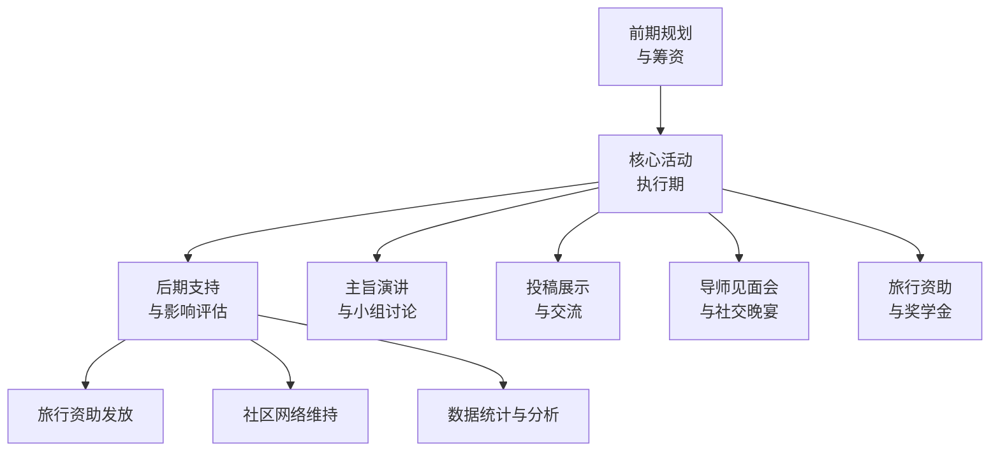
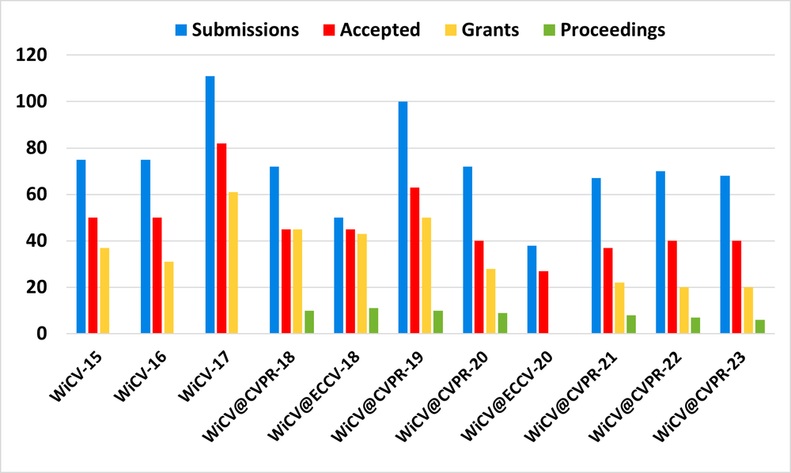
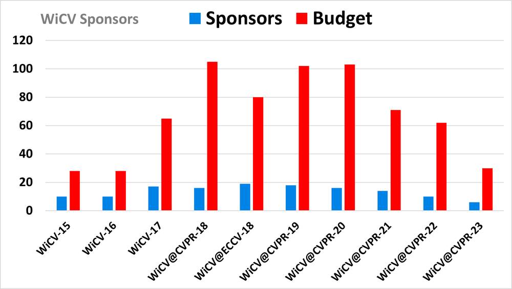

# WiCV@CVPR2023: The Eleventh Women In Computer Vision Workshop at the Annual CVPR Conference

**URL**: https://www.semanticscholar.org/paper/1ee5a5796334ef696b359dceb86c242715d9492e
**提交日期**: 2023-09-22
**作者**: Doris Antensteiner; Marah Halawa; Asra Aslam; Ivaxi Sheth; Sachini Herath; Ziqi Huang; Sunnie S. Y. Kim; Aparna Akula; Xin Wang
**引用次数**: 1
使用模型: deepseek-v3-1-terminus

## 1. 核心思想总结
根据您提供的标题、摘要和引言信息，以下是该学术论文的第一轮总结：

**标题：** WiCV@CVPR2023: 第十一届计算机视觉女性研讨会（于CVPR年会）

**背景**
计算机视觉领域存在显著的性别不平衡问题。为了应对这一问题，自2013年起，每年在顶级计算机视觉会议CVPR上都会举办“计算机视觉女性”（WiCV）研讨会。本文聚焦于2023年在加拿大温哥华与CVPR 2023同期举办的第十一届WiCV研讨会。

**问题**
该研讨会旨在解决的核心问题是计算机视觉社区中女性代表不足的现状。具体表现为女性研究人员的能见度较低，在学术界和工业界缺乏足够的影响力与代表性，这不利于领域的健康发展。

**方法（高层概述）**
研讨会通过组织一系列活动来实现其目标，主要包括：
1.  **促进合作：** 为来自少数群体的研究人员提供交流与合作的平台。
2.  **提供指导：** 为初级女性研究员提供导师指导。
3.  **资金支持：** 为演讲者提供经济援助，减轻其参会负担。
4.  **树立榜样：** 展示多元化的成功女性榜样，以激励年轻研究者。

**贡献**
本文的主要贡献在于对WiCV 2023研讨会进行了全面记录与总结。它提供了该届研讨会的详细议程、对过去历届WiCV@CVPR活动的历史趋势分析，以及关于2023年研讨会 presenter、参会者和赞助情况的统计数据总结，为评估此类活动的影响和未来发展提供了重要依据。

## 2. 方法详解
好的，遵照您的要求，我将基于您提供的初步总结和“方法”章节内容，对该论文的方法细节进行详细说明，重点描述其关键创新、具体步骤与整体流程。

需要首先说明的是，您提供的论文《WiCV@CVPR2023: 第十一届计算机视觉女性研讨会》属于**会议活动报告**，而非提出新算法或技术模型的传统研究论文。因此，其“方法”并非指代算法或架构，而是指**策划、组织、执行和评估该研讨会的一系列系统性流程和策略**。

这些流程和策略本身，即是该论文在“促进计算机视觉领域多样性”这一课题上的**核心创新与实践贡献**。

---

### **论文方法细节详细说明**

#### **一、 关键创新与核心理念**

本文方法的创新性不在于技术突破，而在于其**系统化、多维度、可持续的社区建设模式**。它将一个宏大的社会目标（解决性别不平衡）分解为一系列可操作、可衡量、可复制的具体活动。其关键创新点可概括为：

1.  **从“单一活动”到“生态体系”的构建：** 方法不再是举办一次性的讲座，而是构建一个包含**交流、指导、资助、榜样树立**四大支柱的综合性支持生态。
2.  **聚焦于“赋能”与“可见度”：** 方法的核心是主动为女性研究者（尤其是初级研究者）创造机会，提升她们在顶级学术社区中的能见度和影响力，而非被动地讨论问题。
3.  **数据驱动的持续优化：** 通过对历年数据和本届数据的收集与分析，方法本身是一个可评估、可迭代的闭环系统，确保了活动的长期效力和影响力。

#### **二、 方法的具体架构与关键步骤**

论文的方法可以看作一个分阶段实施的项目管理系统，其整体流程与关键步骤如下图所示：

下面，我们详细阐述流程中的每一个环节：

**阶段一：前期规划与筹资**

这是方法得以实施的基础。此阶段的关键步骤包括：

*   **议程设计：** 基于过往经验和当前社区需求，设计研讨会议程。重点平衡不同环节（如主旨演讲、小组讨论、海报展示、社交活动）的时间和内容，确保其多样性和吸引力。
*   **邀请演讲者：** 有意识地邀请来自学术界和工业界、不同职业阶段、不同背景的杰出女性代表作为主旨演讲者和小组讨论嘉宾。其创新性在于主动“树立榜样”，展示多元化的成功路径。
*   **寻求赞助：** 与业界领先的公司（如Meta、谷歌、苹果、亚马逊等）建立合作关系，获取资金支持。这笔资金是实现“关键创新”中“资金支持”支柱的根本，主要用于提供旅行资助和奖学金。

**阶段二：核心活动执行期（研讨会当天）**

这是方法的核心体现，对应流程图的“核心活动执行期”阶段。具体分为以下几个并行或串联的子模块：

1.  **投稿与展示环节**
    *   **关键步骤：** 会前广泛征集摘要，为博士生、博士后等初级研究人员提供展示其工作的机会。
    *   **细节：** 被选中的Presenter将在研讨会上进行海报展示。这不仅是展示研究成果的平台，更是强制性的交流触发器，迫使参会者与展示者进行一对一深度交流。
    *   **创新点：** 为初级研究者创造了在CVPR这样的大型国际会议上展示自己的低成本、高收益机会，直接提升了她们的“能见度”。

2.  **主旨演讲与小组讨论**
    *   **关键步骤：** 邀请的资深专家分享其科研经验、职业发展心得以及应对挑战的策略。
    *   **细节：** 内容不仅限于技术，更涉及职业规划、领导力、工作与生活平衡等软性话题。小组讨论通常围绕特定主题（如工业界 vs. 学术界的选择）展开，提供多元视角。
    *   **创新点：** 实现“树立榜样”和“提供指导”的双重目的。年轻研究者可以直接看到“未来的自己”，并从成功者的真实故事中获取激励和实用建议。

3.  **导师见面会与社交活动**
    *   **关键步骤：** 专门设置结构化或半结构化的交流时间，如导师圆桌会议和社交晚宴。
    *   **细节：** 在导师见面会中，资深研究员与少量初级研究员分组交流，进行针对性指导。社交晚宴则在轻松的氛围中促进非正式关系的建立。
    *   **创新点：** 这是“促进合作”和“提供指导”的关键实践。它打破了大型会议的隔阂，创造了安全、支持性的环境，让跨机构、跨地域的合作成为可能。

4.  **旅行资助与奖学金发放**
    *   **关键步骤：** 根据申请者的需求和资质，评审并分配旅行资助。
    *   **细节：** 这笔资金直接减轻了参会者的经济负担，特别是对于来自经费有限的机构或国家的学生。
    *   **创新点：** 经济支持是确保多样性和包容性的务实举措。它确保了有才华的研究者不会因经济原因被排除在核心学术圈之外，是方法可持续性和公平性的体现。

**阶段三：后期支持与影响评估**

该方法不仅关注活动当天的效果，更注重长期影响。

*   **社区网络维持：** 通过邮件列表、社交媒体群组等方式，将研讨会建立的连接转化为持续的社区网络。
*   **数据统计与分析：** 这是本文方法科学性的体现。会后，组织者会系统性地收集和分析数据，包括：
    *   **参会者统计：** 人数、性别、职业阶段、机构来源等。
    *   **Presenter统计：** 展示者背景、研究主题分布。
    *   **赞助情况：** 赞助商数量、资助总额。
    *   **历史趋势分析：** 将本届数据与过往十年数据进行对比，评估研讨会规模、影响力等方面的发展趋势。

#### **三、 整体流程总结**

该论文的方法是一个**以“赋能”和“社区建设”为中心，贯穿会前、会中、会后的完整闭环系统**。它通过精心设计的活动组合（展示、演讲、交流、资助），将抽象的目标转化为具体的行动，并通过数据收集与分析来验证方法的有效性，为未来的迭代优化提供依据。这种系统化、多管齐下的实践模式，是WiCV研讨会能够持续十年并产生广泛影响的关键所在，也为其他学术领域解决多样性问题提供了极具价值的范本。

## 3. 最终评述与分析
好的，结合前两轮关于论文标题、摘要、引言、方法以及结论部分的信息，现提供最终的综合评估如下：

### **最终综合评估**

#### **1) 整体摘要 (Overall Summary)**
本文是一篇关于第十一届计算机视觉女性研讨会（WiCV@CVPR2023）的会议活动报告。论文系统性地记录、总结并评估了这场与顶级会议CVPR 2023同期举办的、旨在解决计算机视觉领域性别不平衡问题的社区活动。文章不仅详细阐述了本届研讨会的议程、组织策略（包括主旨演讲、海报展示、导师指导、社交活动和旅行资助）和参会数据，还通过分析过去十年的历史趋势，论证了此类活动在提升女性研究者能见度、构建支持性社区网络方面的持续影响力与必要性。该论文的核心贡献在于为评估和推广旨在促进学术领域多样性的干预措施提供了一个可复制的实践范本和数据支撑的案例研究。

#### **2) 优势 (Strengths)**
*   **系统性与实践性强：** 论文并非空谈问题，而是展示了一套完整、多维度且经过实践检验的系统方法。该方法将“促进多样性”的宏大目标分解为可执行的具体活动（交流、指导、资助、榜样树立），形成了会前、会中、会后的完整闭环。
*   **数据驱动与可持续性：** 文章的一个显著优势是利用了长达十年的纵向数据（2013-2023）进行分析，展示了研讨会规模的稳步增长（如参会人数、赞助金额、展示者数量），这为活动长期效力的评估提供了坚实证据，并体现了组织工作的可持续性。
*   **明确的社区价值与影响力：** 论文清晰地阐明了研讨会的直接价值，如为初级女性研究者提供关键可见度、减轻其经济负担、搭建合作桥梁，并通过参会者的积极反馈（结论中提及）证明了其在增强归属感、提供职业支持方面的即时效果。
*   **优秀的示范性与可移植性：** 本文所详细描述的组织模式、活动设计理念和评估方法，为其他存在多样性挑战的学术或技术领域（如人工智能、机器学习、自然语言处理等）提供了极具价值的、可复制的蓝图。

#### **3) 局限性与不足 (Weaknesses / Limitations)**
*   **研究类型的固有局限：** 作为一篇活动报告，其性质更偏向于描述性和总结性，而非提出可证伪的科学假设或进行严格的因果推断研究。它证明了活动与积极成果的相关性，但难以严格量化活动对参与者长期职业发展（如论文发表、职位晋升）的因果影响。
*   **长期影响评估不足：** 尽管有历史趋势数据，但论文主要关注活动本身的直接产出和短期反馈。对于研讨会究竟在多大程度上改变了参与者长期的职业轨迹，或对更广泛的计算机视觉领域的性别比例产生了实质性影响，缺乏系统性的长期跟踪数据。
*   **潜在的选择偏差：** 活动的参与者本身就是对多样性议题感兴趣或积极寻求支持的群体，这可能意味着研讨会的影响主要集中在“已转化”或“易转化”的人群中，如何触及并激励更广泛圈子外的女性研究者，是一个未被深入探讨的挑战。
*   **广度与深度的平衡：** 论文旨在全面记录一届活动，因此在广度上覆盖了议程、数据、历史比较等多个方面，但可能牺牲了对某些环节（如导师匹配的具体机制、赞助商关系的长期维护策略）的深度分析。

#### **4) 潜在应用与启示 (Potential Applications / Implications)**
*   **实践指南：** 该论文可作为其他会议或学术团体组织类似多样性研讨会的“操作手册”，其成功的活动设计和筹资模式可直接借鉴。
*   **政策倡导工具：** 文中展示的数据和成功案例，可以被用来向会议主办方、资助机构、大学和公司进行倡导，证明投资于多样性、公平和包容性（DEI）项目的具体回报和必要性，从而推动制度性的支持。
*   **未来研究的基础：** 本文为后续更深入的学术研究奠定了基础。例如，研究者可以以此报告为起点，设计纵向研究，跟踪参会者的职业发展；或采用访谈、问卷调查等定性方法，深入探究社区支持网络对个体科研自信心和创造力的具体影响机制。
*   **跨领域推广：** 其核心模式——即通过提升能见度、提供资源支持和构建社区来解决系统性不平等——可以应用于STEM（科学、技术、工程和数学）乃至其他专业领域中存在的类似多样性挑战。

---
**总结：** 这篇论文的价值不在于技术创新，而在于其作为一项成功的社区实践的系统性记录与评估。它有力地证明了持续、有组织的干预对于推动学术社区向更包容、更健康的方向发展的重要性，并为此类努力提供了宝贵的经验、数据与灵感。

---

# 附录：论文图片

## 图 1

## 图 2

