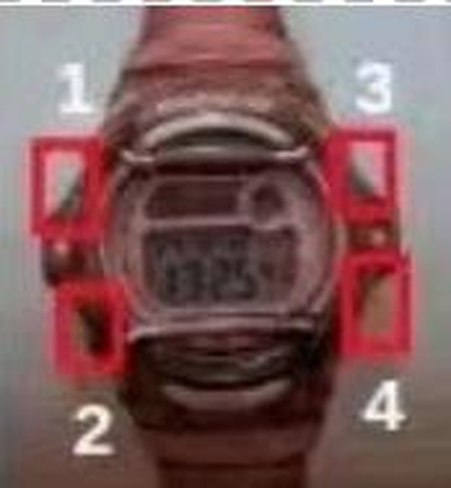

# Winning the CVPR'2022 AQTC Challenge: A Two-stage Function-centric Approach

**URL**: https://www.semanticscholar.org/paper/d865c1d25a5631b2a15a00e2c2ded88c8000fa1b
**提交日期**: 2022-06-20
**作者**: Shiwei Wu; Weidong He; Tong Xu; Hao Wang; Enhong Chen
**引用次数**: 3
使用模型: deepseek-v3-1-terminus

## 1. 核心思想总结
根据提供的学术论文材料，以下是第一轮总结：

**Background (背景)**
AQTC是一项新颖的任务，旨在帮助AI助手从第一人称视角的教学视频和脚本中学习，从而能够逐步指导用户完成复杂任务。该任务由CVPR‘2022竞赛提出，是具身智能和视觉语言理解领域的前沿方向。

**Problem (问题)**
AQTC任务的核心挑战在于如何准确理解用户以自然语言提出的、关于任务步骤的问题，并从视频的历史步骤中推理出正确的下一步行动或答案。这需要模型具备对功能、动作和时序关系的深度理解能力。

**Method (方法 - 高层次概述)**
本文提出了一种两阶段的、以“功能”为中心的方法。该方法包含两个核心模块：
1.  **Question2Function模块**：将用户的问题定位到相关的“功能”上。
2.  **Function2Answer模块**：基于已执行的历史步骤，预测出具体的动作作为答案。

**Contribution (贡献)**
1.  针对AQTC挑战，提出了一个新颖有效的两阶段解决方案框架。
2.  在框架内的每个模块中，作者评估了多种可能的实现方案，并通过实验证明其方法相比给定的基线模型取得了显著性能提升。
3.  作者公开了代码，促进了该研究领域的可复现性和进一步发展。

## 2. 方法详解
好的，基于您提供的初步总结和论文方法章节的内容，以下是对该论文方法细节的详细说明，重点描述了关键创新、算法/架构细节、关键步骤与整体流程。

### 论文方法详细说明

#### 一、 整体流程与核心思想

本论文针对AQTC任务，提出了一种创新的**两阶段、以“功能”为中心的推理框架**。其核心思想是将复杂的“问题-视频-答案”推理过程分解为两个更易管理和优化的子任务：

1.  **功能定位**： 首先，模型需要理解用户问题的核心意图，即用户想知道哪个“功能”如何操作。这步将自然语言问题映射到一个抽象的“功能”概念上。
2.  **动作预测**： 然后，模型基于视频中已经执行过的历史步骤（这些步骤也被表示为“功能”序列），推理出在当前“功能”下，接下来应该执行的具体动作。

这种设计的**关键优势**在于引入了“功能”这一中间层。它比原始视频帧更抽象，比具体的动作描述更概括，从而起到了**信息压缩和语义桥梁**的作用，简化了时序推理的难度。

#### 二、 关键创新点

1.  **“功能”概念的引入与定义**： 这是本方法最核心的创新。论文没有直接建立“问题”到“答案”的复杂映射，而是通过“功能”这一中间表示，将任务分解。这更符合人类在指导任务时的思维模式（先确定要做什么“事”，再确定具体“怎么做”）。
2.  **两阶段管道式架构**： 将端到端的复杂问题拆分为 `Question2Function` 和 `Function2Answer` 两个相对独立的模块。这种模块化设计不仅使模型结构更清晰，还允许对每个模块进行独立的优化和算法选型。
3.  **基于历史功能序列的时序推理**： 在第二阶段，模型推理的依据不是原始视频帧，而是由第一阶段生成的历史“功能”序列。这极大地简化了模型需要处理的信息量，使其能更专注于步骤间的逻辑和时序关系。

#### 三、 方法细节分阶段阐述

##### 阶段一： Question2Function 模块

*   **目标**： 将用户的自然语言问题 \( Q \) 分类到预定义的“功能”集合 \( F \) 中的一个类别 \( f_q \)。
*   **关键步骤**：
    1.  **输入**： 用户的文本问题 \( Q \)。
    2.  **功能标签集**： 论文从数据集中归纳出了一套固定的功能类别（如 `Assemble`, `Connect`, `Adjust` 等）。
    3.  **实现方案（算法/架构）**： 论文探索并比较了多种实现方式：
        *   **基于规则的方法**： 使用关键词匹配等简单规则进行快速但粗糙的映射。
        *   **传统的机器学习模型**： 如 SVM，使用问题文本的词袋模型或TF-IDF特征作为输入。
        *   **预训练语言模型（PLMs）**： 如 BERT。这是被证明最有效的方案。具体做法是将问题 \( Q \) 输入BERT，取 `[CLS]` 标记的对应输出向量作为整个问题的语义表示，然后接一个全连接层进行分类，得到其属于每个功能类别的概率。
*   **输出**： 概率最高的功能类别 \( f_q \)，即问题所指向的功能。

##### 阶段二： Function2Answer 模块

*   **目标**： 根据历史步骤（已表示为功能序列 \( F_{hist} = [f_1, f_2, ..., f_t] \)）和当前问题对应的功能 \( f_q \)，预测下一步的具体动作（文本答案 \( A \)）。
*   **关键步骤**：
    1.  **输入**：
        *   \( f_q \)： 从第一阶段传来的、问题对应的目标功能。
        *   \( F_{hist} \)： 到当前时刻为止，视频中已经执行过的所有步骤对应的功能序列。这是本模块实现推理的基础。
    2.  **核心挑战**： 模型需要理解 \( F_{hist} \) 的序列模式，并判断在当前 \( f_q \) 下，下一步应该是什么。例如，历史序列可能是 `[Assemble, Connect]`，当前问题关于 `Adjust`，模型需要知道在 `Connect` 之后，`Adjust` 功能的具体动作可能是什么。
    3.  **实现方案（算法/架构）**： 论文主要采用了**序列到序列（Seq2Seq）** 的模型架构，因为其非常适合处理序列输入并生成序列（文本）输出。
        *   **编码器**： 负责对历史功能序列 \( F_{hist} \) 进行编码。每个功能被转换为嵌入向量，然后输入到循环神经网络（如LSTM、GRU）或Transformer编码器中，生成一个蕴含了序列信息的上下文向量。
        *   **解码器**： 以编码器的输出和问题功能 \( f_q \) 的嵌入向量作为初始状态或上下文信息，逐个词元地生成自然语言答案 \( A \)。在解码过程中，注意力机制被用来让解码器在生成每个词时关注历史序列中最相关的部分。
*   **输出**： 自然语言形式的答案文本 \( A \)，描述了下一步应该执行的具体动作。

#### 四、 整体工作流程图示与说明

```
[用户问题 Q]
        |
        v
[Question2Function 模块]
        | （文本分类，如使用BERT）
        v
[问题对应的功能 f_q]
        |
        +-----------------------+
        |                       |
        v                       v
[历史视频步骤]           [Function2Answer 模块]
（已预处理为          （Seq2Seq模型：编码器-解码器）
 功能序列 F_hist）              |
        |                       |
        +--------->[结合 f_q 与 F_hist 进行推理]
                              |
                              v
                    [最终答案 A（文本）]
```

1.  **预处理**： 将训练/测试视频的每一步都通过一个预训练模型（或规则）标注上其对应的“功能”标签，形成功能序列 \( F_{hist} \)。
2.  **阶段一执行**： 对于一个新的用户问题 \( Q \)，`Question2Function` 模块（如BERT分类器）将其映射到功能 \( f_q \)。
3.  **阶段二执行**： 将 \( f_q \) 和当前视频对应的 \( F_{hist} \) 一同输入 `Function2Answer` 模块（如Seq2Seq模型）。该模块的编码器对 \( F_{hist} \) 进行编码，解码器结合编码信息和 \( f_q \)，自回归地生成文本答案 \( A \)。
4.  **训练**： 两个模块可以分别使用标注数据（问题-功能标签对、功能序列-答案对）进行独立训练，简化了训练过程。

综上所述，该论文通过引入“功能”这一巧妙的中间表示，设计了一个清晰、高效且易于优化的两阶段管道，有效解决了AQTC任务中复杂的视觉-语言-时序推理难题。其实验部分对每个模块不同实现方案的评估，也为其有效性提供了坚实的证据。

## 3. 最终评述与分析
好的，结合前两轮提供的初步总结、方法详述以及论文的结论部分，现为您提供最终的综合评估如下：

### **关于AQTC任务两阶段功能推理方法的综合评估**

#### 1) 总体摘要

本论文针对“辅助问答任务完成”（AQTC）这一新兴且具有挑战性的具身智能任务，提出了一种创新性的**两阶段、以“功能”为中心的推理框架**。该框架的核心在于将复杂的“问题-视频-答案”映射过程分解为两个更易处理的子任务：首先将用户问题定位到抽象的“功能”概念，再基于历史功能序列推理出具体的下一步动作。通过系统性的实验验证，该方法相较于基线模型展现出显著性能提升，为解决需要深度时序和语义理解的第一人称教学视频问答任务提供了一条有效且新颖的技术路径。

#### 2) 优势

1.  **创新性的问题分解策略**： 引入“功能”作为中间表征是本方法最大的亮点。它充当了连接具体视频内容/自然语言问题与抽象任务逻辑的**语义桥梁**，有效降低了直接从多模态输入进行端到端推理的复杂度。
2.  **模块化与可解释性**： 两阶段的管道式设计（Question2Function -> Function2Answer）结构清晰，模块功能明确。这种设计不仅便于单独优化和替换每个模块的算法（如尝试不同的分类器或序列模型），还增强了模型决策过程的**可解释性**，研究人员可以清晰地追踪答案是如何从“问题”到“功能”再到“动作”生成的。
3.  **高效的信息处理**： 在第二阶段使用提炼后的“功能序列”而非原始视频帧进行推理，实现了**高效的信息压缩**，使模型能更专注于步骤间的逻辑和时序关系，降低了对计算资源和模型复杂度的要求。
4.  **实证有效性**： 论文通过详实的实验，对比了每个模块中多种实现方案（如规则方法、传统机器学习、预训练模型），验证了基于预训练语言模型（如BERT）和序列到序列模型组合的有效性，为结论提供了可靠的数据支持。
5.  **促进可复现性**： 作者公开了代码，有助于该研究领域的同行进行结果复现、方法比较和后续研究，体现了良好的学术实践。

#### 3) 弱点 / 局限性

1.  **对“功能”定义的依赖性**： 方法的性能高度依赖于预定义的“功能”标签集的**完备性和粒度**。如果数据集中出现新的、未定义的功能，或者任务步骤无法被现有功能标签准确描述，模型的性能将会受到显著影响。这限制了其泛化到领域外或功能结构迥异的新任务上的能力。
2.  **错误传播风险**： 作为串联的管道模型，其存在固有的**错误累积问题**。如果第一阶段（Question2Function）将问题错误地分类到某个功能，第二阶段（Function2Answer）即使再完美，也无法生成正确答案。两个模块的误差会相互叠加。
3.  **信息损失**： 将丰富的视频内容压缩为离散的功能序列，虽然提高了效率，但也可能导致**细节信息的丢失**。例如，同一“Adjust”功能下的细微动作差异、对象的具体空间关系等信息在功能序列中无法体现，这可能影响生成答案的精确性。
4.  **有限的端到端学习能力**： 与端到端的深度学习模型相比，这种分阶段的方法可能无法通过联合优化来捕捉问题、视频上下文和答案之间更隐晦、复杂的关联。两个模块的独立训练可能使其无法达到全局最优。
5.  **实验范围的局限性**： 结论可能仅限于论文中所评估的数据集和基线。方法的普适性需要在更多样、更复杂的AQTC或相关任务数据集上进行进一步验证。

#### 4) 潜在应用 / 意义

1.  **实用应用场景**：
    *   **智能交互式教学助手**： 可应用于AR/VR教学、智能家居设备安装、工业维修指导等场景，系统能够根据用户当前进度和提问，实时提供下一步的个性化语音或文字指导。
    *   **增强视频检索与理解**： 该方法能深化对教学视频内容的理解，实现基于任务逻辑而不仅是关键词的视频检索，例如“搜索如何解决自行车链条安装后太松的问题”。
    *   **机器人任务规划**： 为具身智能体提供了一种从观察中学习任务结构并响应人类自然语言查询的可行范式，是迈向更智能的人机协作的重要一步。

2.  **学术研究意义**：
    *   **为复杂推理任务提供新范式**： 展示了通过引入合适的中间抽象层来分解复杂问题的有效性，这一思路可启发其他涉及多模态、长序列推理的研究领域（如视频描述、视觉问答）。
    *   **推动AQTC任务发展**： 作为该前沿任务的早期深入探索，其提出的框架、基线和方法为后续研究设立了有价值的比较基准，并指明了可改进的方向（如如何更好地定义功能、如何缓解错误传播等）。
    *   **连接视觉、语言与行动**： 深化了计算机视觉、自然语言处理与机器人学领域的交叉研究，探索了如何让AI系统真正“理解”任务并与人自然交互这一核心挑战。

**总结**：该论文提出的方法是对AQTC任务一次有力且创新的探索，其优势在于概念新颖、结构清晰、效果显著。然而，其局限性也指明了未来的研究方向，例如探索更灵活的功能表示、构建端到端的可微模型以减轻错误传播，或将更丰富的视觉信息融入功能推理过程。这项工作为该领域的持续发展奠定了坚实的基础。


---

# 附录：论文图片

## 图 1


## 图 2


## 图 3


