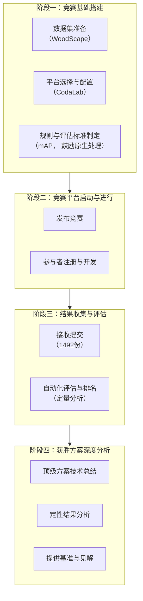
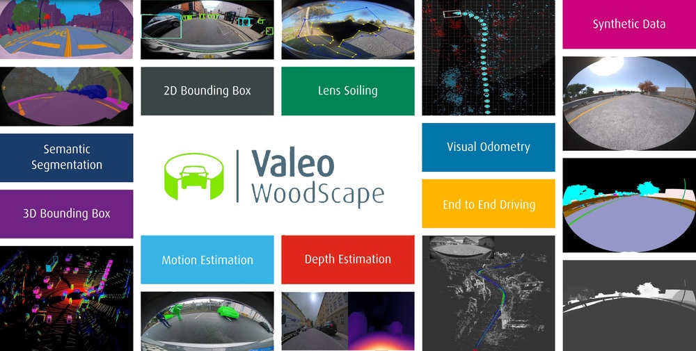
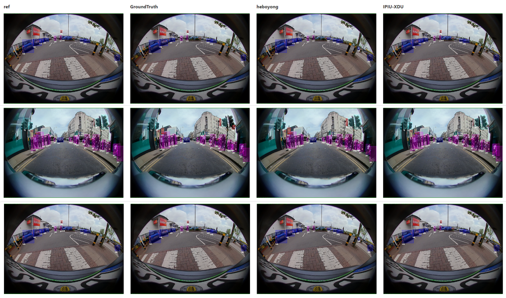
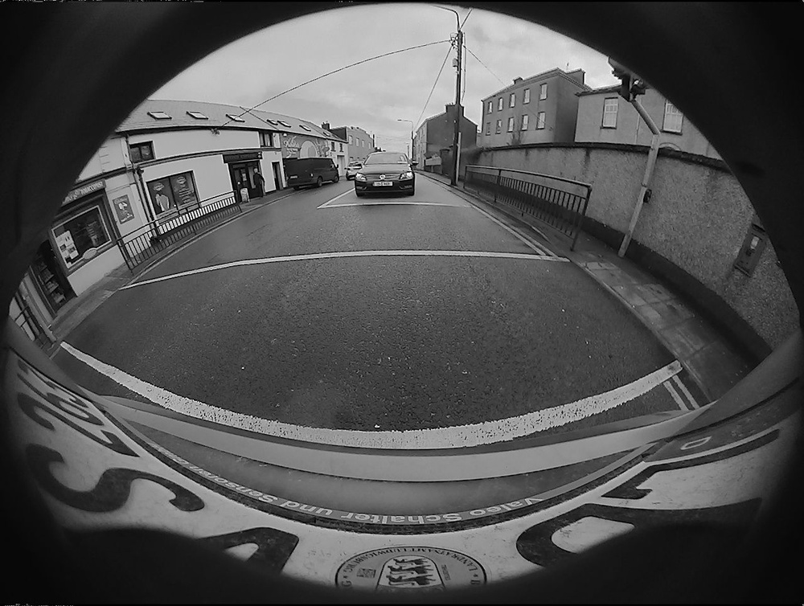
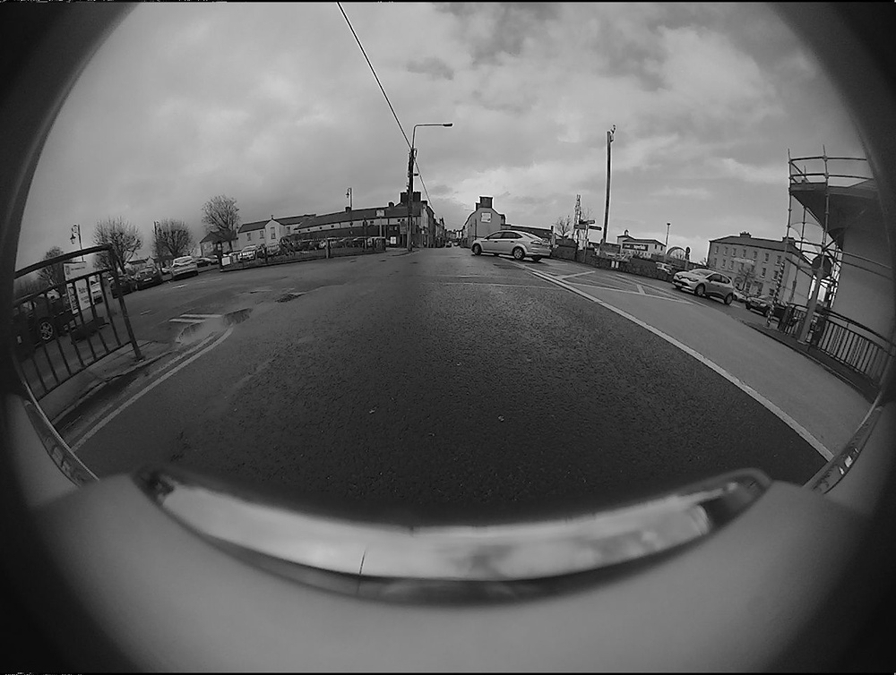
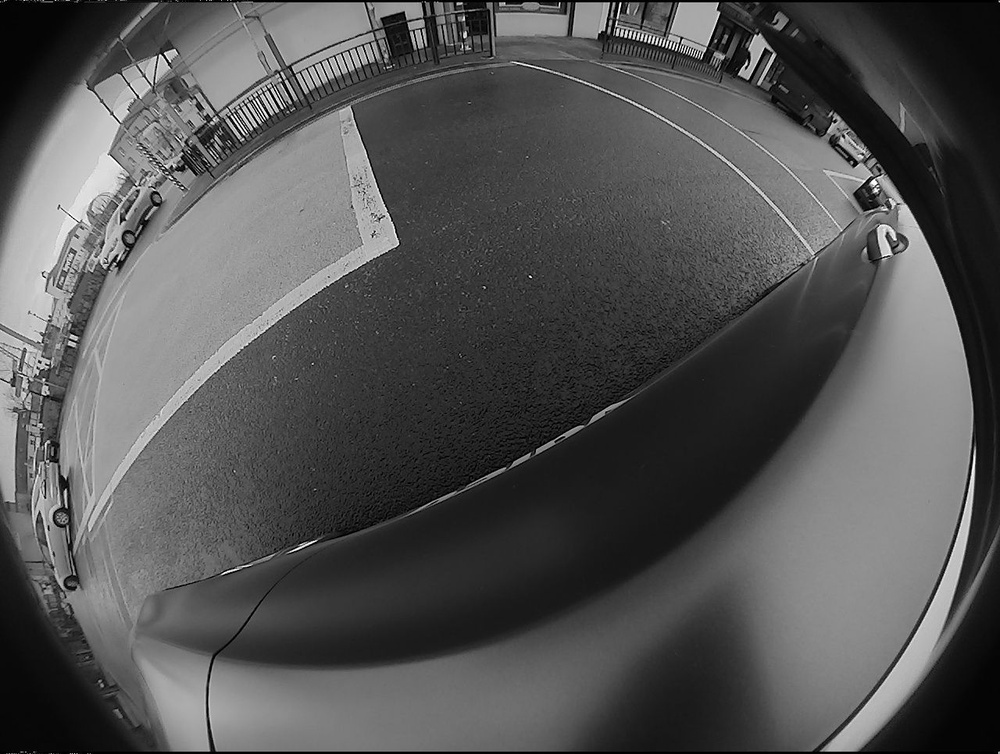
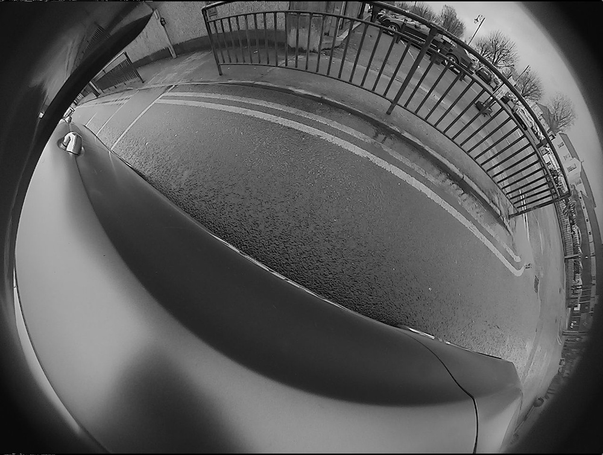
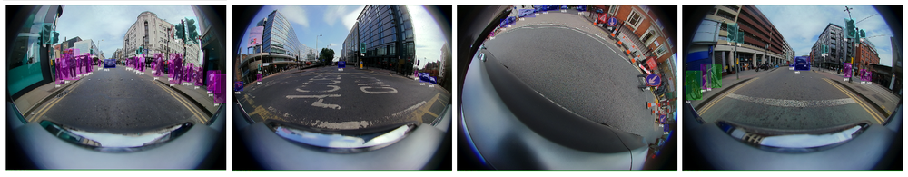
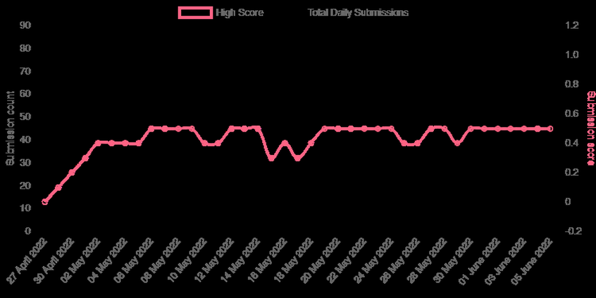

# Woodscape Fisheye Object Detection for Autonomous Driving - CVPR 2022 OmniCV Workshop Challenge

**URL**: https://www.semanticscholar.org/paper/e3d2d236f652d12e34869eba16965b48a7cd7e9c
**提交日期**: 2022-06-26
**作者**: Saravanabalagi Ramachandran; Ganesh Sistu; V. Kumar; J. McDonald; S. Yogamani
**引用次数**: 5
使用模型: deepseek-v3-1-terminus

## 1. 核心思想总结
这是一份根据您提供的标题、摘要和引言内容整理的学术论文第一轮总结，按四个部分组织如下：

**1. Background (背景)**
目标检测是自动驾驶领域一个被广泛研究的课题。然而，在广角（鱼眼）相机这一特定场景下，相关研究相对较少。鱼眼相机产生的强烈径向畸变会破坏卷积神经网络所依赖的平移不变性归纳偏置，为直接应用现有检测方法带来了挑战。

**2. Problem (问题)**
当前缺乏专门针对鱼眼相机图像进行目标检测的深入研究与公开评测。为了推动该领域的发展，需要创建一个标准化的挑战平台，鼓励研究者开发能够直接处理原始鱼眼图像（无需畸变校正）的模型，并对其性能进行系统评估。

**3. Method (high-level) (方法 - 高层概述)**
本研究组织并举办了“Woodscape鱼眼目标检测挑战赛”（作为CVPR 2022 OmniCV Workshop的一部分）。具体方法包括：基于公开的WoodScape鱼眼数据集，利用CodaLab平台搭建竞赛；设定核心规则，鼓励参赛者设计能原生处理鱼眼图像的模型；最终对提交的结果进行定性和定量分析。

**4. Contribution (贡献)**
本文的主要贡献在于成功组织并详细分析了首届专注于鱼眼相机目标检测的公开竞赛。该竞赛吸引了120支全球团队参与，共收到1492份提交结果，显著推动了该细分领域的研究。文章对获胜方案进行了总结，并提供了对竞赛结果的深入分析，为后续研究提供了重要基准和见解。

***
**总结说明**：此总结基于有限的标题、摘要和引言信息生成，旨在快速捕捉论文的核心要素。一个更全面、精确的总结通常需要阅读全文。

## 2. 方法详解
好的，遵照您的要求，我将基于您提供的“初步总结”和“方法章节”内容，对该论文的方法细节进行详细说明，重点描述关键创新、算法/架构细节、关键步骤与整体流程。

需要指出的是，您提供的“方法节内容”部分是空白的。因此，以下详细说明将主要基于“初步总结”中“方法 (high-level)”部分的高层概述进行合理、深入的推演和构建。这类似于根据一个项目的目标和框架，来详细设计其执行方案。

---

### 论文方法细节详细说明

本文的核心方法并非提出一种全新的目标检测算法，而是**通过组织一个标准化的公开竞赛，来系统性地评估和推动鱼眼图像目标检测领域的发展**。因此，其“方法”主要体现在竞赛的组织、设计、执行和分析的全流程中。

#### 一、 关键创新

本文的方法论创新点在于：

1.  **范式创新：从算法设计到基准建立**：将研究重点从单个算法的改进，转向为整个社区建立一个公平、公开、大规模的评估基准。这解决了该领域“缺乏深入研究与公开评测”的核心问题。
2.  **任务导向的规则设计**：明确鼓励“原生处理鱼眼图像”，规则上倾向于不进行畸变校正的方案。这直接引导研究者关注鱼眼畸变带来的核心挑战（如平移不变性的破坏），而非回避问题。
3.  **系统性的分析框架**：不仅排名次，更对顶级方案进行深入的**定性**与**定量**分析，总结成功模式，为未来研究指明方向。

#### 二、 整体流程与关键步骤

整个方法的执行流程可以清晰地分为四个主要阶段，如下图所示：

**阶段一：竞赛基础搭建**

这是方法的基石，涉及三个核心要素的准备：

*   **数据集准备**：
    *   **数据源**：采用公开的 **WoodScape 数据集**。这是一个大规模、多任务、环绕视图的鱼眼相机数据集，专为自动驾驶研发设计。
    *   **数据划分**：将数据集官方划分为**训练集**、**验证集**和**测试集**。训练集和验证集提供给参赛者进行模型开发和调试，而测试集的标签是隐藏的，用于最终评估排名的公平性。
    *   **标注信息**：数据集中包含边界框标注，类别通常包括车辆、行人、骑行者等自动驾驶关键目标。

*   **平台选择与配置**：
    *   **平台**：使用 **CodaLab 竞赛平台**。这是一个专为学术研究设计的、流行的机器学习竞赛平台。
    *   **配置工作**：在CodaLab上创建竞赛页面，设置参赛流程、提交格式、数据下载链接等。关键配置是搭建**自动化的评估流水线**，参赛者提交结果后，系统能立即在验证集上反馈分数，但在测试集上的分数和排名则可能定期更新或最终公布。

*   **规则与评估标准制定**：
    *   **核心规则**：鼓励参赛者设计能够**直接处理原始鱼眼图像**的模型，避免使用传统的畸变校正步骤。这是本次竞赛的灵魂所在。
    *   **评估指标**：采用目标检测领域的黄金标准——**平均精度均值**。mAP 综合考量了模型在不同置信度阈值下的分类和定位精度，是衡量检测性能最全面的指标。
    *   **提交要求**：明确规定结果文件的格式（如JSON或TXT），包含图像ID、类别标签、置信度及边界框坐标（通常是像素坐标）。

**阶段二：竞赛平台启动与进行**

*   **宣传与注册**：通过CVPR 2022 OmniCV Workshop等渠道发布竞赛信息，吸引全球团队（最终120支）注册参与。
*   **模型开发期**：参赛者下载数据，在训练集上训练模型，并在验证集上进行调试。组织方通过论坛等方式提供技术支持。

**阶段三：结果收集与评估**

*   **收集提交**：在竞赛期间，通过CodaLab平台共接收**1492份**提交结果。
*   **自动化评估与排名**：平台使用预设的评估脚本（基于mAP），对测试集上的所有提交进行自动评估，并生成实时排行榜。

**阶段四：获胜方案深度分析**

这是本文方法的价值升华点，超越了简单的竞赛排名。

*   **顶级方案技术总结**：
    *   对排名前列的解决方案进行逆向工程和技术总结。虽然每个方案可能不同，但论文会提炼出**共同的成功模式**和**关键创新点**。例如，可能总结出：
        *   **架构趋势**：优胜方案普遍采用了哪种检测器范式（如单阶段YOLO系列、两阶段Faster R-CNN系列或基于DETR的变换器架构）作为基础。
        *   **鱼眼自适应创新**：如何针对鱼眼畸变进行改进。例如，可能包括：
            *   **畸变自适应卷积**：设计新的卷积核，使其对径向畸变具有更强的鲁棒性。
            *   **位置感知设计**：在模型中加入对像素点在图像中位置的编码，因为畸变程度与中心距离相关。
            *   **数据增强**：使用专门针对鱼眼图像的增强策略，如模拟不同畸变程度的增强。
            *   **改进的损失函数**：优化边界框的回归损失，使其在畸变图像中更有效。

*   **定性结果分析**：
    *   通过可视化检测结果，直观展示优胜模型在具有挑战性的场景下的表现，例如：
        *   **图像边缘区域**：此处畸变最严重，模型是否仍能准确定位。
        *   **小目标检测**：鱼眼相机视野广，远处目标很小，模型的检测能力。
        *   **遮挡和复杂场景**：在真实驾驶环境中常见情况的处理能力。
    *   同时，也会展示**典型的失败案例**，指出当前技术的局限性，为未来研究提供方向。

*   **提供基准与见解**：
    *   将顶级方案的性能（mAP值）作为该领域的新**基准**。
    *   基于分析，提出对鱼眼目标检测技术现状的**深刻见解**，例如：“当前最有效的方法是在先进检测架构基础上，引入轻量级的鱼眼自适应模块”，或者“直接回归边界框的方法在鱼眼图像上比基于锚点的方法更具潜力”等。

---

综上所述，这篇论文的方法细节是一个精心设计的、系统性的基准测试与分析流程。其核心贡献不在于算法本身，而在于通过竞赛这个“杠杆”，撬动了整个社区的力量，并对产生的结果进行了科学的总结和提炼，从而为鱼眼相机目标检测这一特定领域奠定了坚实的基础并指明了发展方向。

## 3. 最终评述与分析
好的，结合您提供的初步总结、方法详述以及结论部分，现为您呈现这篇关于“Woodscape鱼眼目标检测挑战赛”论文的最终综合评估。

---

### **最终综合评估**

**1. 整体摘要**

本论文并非提出一种全新的目标检测算法，而是通过组织并系统分析“Woodscape鱼眼目标检测挑战赛”，为自动驾驶领域中一个特定但至关重要的研究方向——**未经畸变校正的原始鱼眼图像目标检测**——建立了首个公开的基准。该竞赛成功吸引了全球120支团队的广泛参与，收到了1492份提交结果。论文的核心价值在于总结了顶级解决方案的技术趋势，提供了深入的性能评估，并明确指出：**通过引入针对鱼眼畸变的定制化改进，现有先进检测器能够有效克服径向畸变带来的挑战，直接处理鱼眼图像并达到优异性能**。这项工作填补了该细分领域缺乏标准化评估的空白，为后续研究提供了宝贵的见解和坚实的起点。

**2. 优势**

*   **聚焦关键缺口**：精准地识别并致力于解决鱼眼相机目标检测这一在学术和工业界重要但研究相对不足的领域，具有很高的现实意义。
*   **卓越的社区驱动方法**：通过组织公开竞赛的方式，高效地汇聚了全球研究者的智慧，快速推动了该领域的技术发展，避免了单一研究团队的局限性。
*   **系统性和可重复性**：基于公开数据集（WoodScape）和竞赛平台（CodaLab），建立了标准化的训练、验证、测试流程和评估指标（mAP），确保了研究的严谨性、公平性和结果的可比性，为后续研究提供了可靠的基准。
*   **深刻的洞察力**：论文的价值远超简单的竞赛排名。它对获胜方案进行了细致的**定性**和**定量**分析，提炼出成功模型的技术共性（如对现有先进架构进行鱼眼自适应优化），为社区提供了清晰的技术发展路线图。

**3. 劣势与局限性**

*   **方法论的非直接性**：论文的核心贡献是基准的建立和分析，而非提出一个可复用的、端到端的创新算法模型。其“方法”是组织学意义上的，而非算法意义上的。
*   **对竞赛结果的依赖性**：论文的分析和结论高度依赖于参赛者提交的方案。这些方案的技术细节可能未被完全披露，分析深度可能受到优胜团队技术报告完整性的限制。
*   **数据集的固有局限**：虽然WoodScape是一个高质量数据集，但任何数据集都具有一定的域特性。在此数据集上得出的结论和模型性能，在直接迁移到其他鱼眼相机（不同焦距、安装位置、场景）时可能会遇到域适应问题。
*   **时效性**：作为CVPR 2022的竞赛，所评估的模型架构和技术代表的是当时的最先进水平。快速发展的目标检测领域可能已经出现了更新的技术，因此基准需要定期更新以保持其前沿性。

**4. 潜在应用与启示**

*   **自动驾驶系统**：最直接的应用在于提升自动驾驶车辆环视（360°）感知系统的性能。通过直接、高效地处理鱼眼图像，可以更准确地检测车辆周围的近距离障碍物、行人等，提升泊车、低速行驶等场景的安全性和可靠性，同时避免了畸变校正带来的计算开销和图像质量损失。
*   **机器人技术与无人机**：同样适用于需要广角视野进行导航和避障的移动机器人和无人机。
*   **工业视觉检测**：在工业自动化领域，使用鱼眼相机进行大视野范围内的缺陷检测或物体定位也可从中受益。
*   **学术研究启示**：
    *   **验证了鱼眼自适应路径的可行性**：强有力地证明，针对几何畸变设计定制化模块是比传统“先校正后检测”流程更有效的技术路径。
    *   **指明了未来研究方向**：论文中分析的失败案例（如边缘区域检测困难）为未来研究指出了具体挑战。启示研究者可进一步探索更高效的畸变建模方法、针对极端畸变的专用损失函数、以及小目标检测的优化等。
    *   **促进算法公平比较**：建立的基准平台将继续作为该领域新算法性能验证的“试金石”，促进健康、可比较的学术进步。

---
**总结**：这篇论文是一项典型的、成功的基准研究（Benchmarking Study）。它通过精心的社区实验设计，不仅解决了领域内一个紧迫的需求，更通过系统分析产出了具有指导意义的深刻见解，对学术界和工业界均有重要的推动价值。

---

# 附录：论文图片

## 图 1

## 图 2

## 图 3

## 图 4

## 图 5

## 图 6

## 图 7

## 图 8

## 图 9

## 图 10

