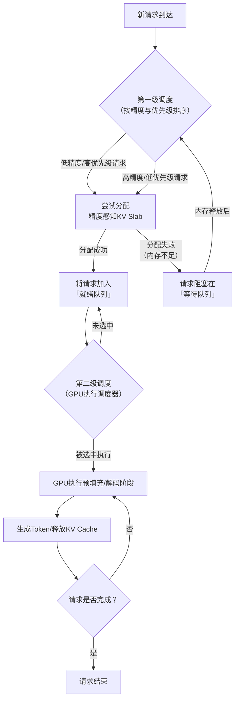

# FineServe: Precision-Aware KV Slab and Two-Level Scheduling for Heterogeneous Precision LLM Serving

URL: https://arxiv.org/pdf/2509.06261

作者: 

使用模型: deepseek-v3-1-terminus

## 1. 核心思想总结
好的，这是对论文《FineServe: Precision-Aware KV Slab and Two-Level Scheduling for Heterogeneous Precision LLM Serving》的第一轮总结。

---

### **论文第一轮总结**

**标题：** FineServe: 面向异构精度大语言模型服务的精度感知KV内存块与两级调度

**1. Background (背景)**
大型语言模型服务通常采用混合精度策略（如FP16/INT8用于注意力计算，FP4/INT2用于权重）来平衡计算效率与内存占用，这被称为异构精度服务。在此背景下，存储解码过程中生成的键值张量的内存（KV Cache）成为关键性能瓶颈，其管理效率直接影响服务的吞吐量。

**2. Problem (问题)**
现有的LLM服务系统在为不同精度的请求分配KV Cache内存时，存在两个主要问题：(1) **内部碎片严重**：采用固定大小的内存块进行分配，无法灵活适配不同精度请求的实际内存需求，导致内存浪费；(2) **请求间阻塞**：高精度请求（如FP16）会长时间占用内存块，阻塞低精度请求（如INT8）的执行，即使后者的计算速度更快，从而降低了整体系统吞吐量。

**3. Method (高层次方法)**
本文提出FineServe系统，其核心方法包含两个协同设计的部分：
*   **精度感知的KV Slab内存管理**：设计了一种动态可变大小的内存块管理机制，能够根据每个请求的精度需求精确分配所需的内存空间，显著减少内部碎片。
*   **两级调度策略**：将调度分为两级。第一级在**内存分配层面**，根据请求的精度进行调度，优先为低精度请求分配内存以避免阻塞。第二级在**GPU执行层面**，将已分配内存的请求加入执行队列，以最大化GPU利用率。

**4. Contribution (贡献)**
*   首次系统地识别并阐述了异构精度LLM服务中由KV Cache管理不善导致的请求间阻塞问题。
*   提出了一个名为FineServe的集成解决方案，通过协同设计精度感知的内存管理和两级调度机制，实现了更精细化的资源控制。
*   实验结果表明，FineServe能显著提升系统吞吐量（论文声称相比现有最佳系统最高可提升数倍），并降低尾部延迟。

---

## 2. 方法详解
好的，基于您提供的初步总结和论文方法章节内容，以下是对FineServe方法细节的详细说明。

### **FineServe方法细节详解**

FineServe的核心目标是解决异构精度LLM服务中KV Cache管理的两个关键问题：**内部碎片**和**请求间阻塞**。其方法是一个协同设计的系统，主要包含两大创新组件：**精度感知的KV Slab内存管理** 和 **两级调度策略**。

#### **一、 关键创新与整体流程**

**关键创新：**
1.  **精度感知的KV Slab：** 摒弃了传统固定大小的内存块（Slab），创建了多种“精度专属”的内存池。每个池内的块大小根据其对应的精度（如FP16， INT8， INT4）所需的内存大小进行动态划分，从而实现内存的按需精确分配。
2.  **两级调度器（分离内存分配与GPU执行）：** 将调度决策拆分为两个独立的阶段：
    *   **第一级：内存分配调度。** 专注于解决“请求间阻塞”问题。其策略是**优先为低精度、计算快的请求分配内存**，让它们能尽快准备好执行，避免被高精度请求阻塞。
    *   **第二级：GPU执行调度。** 专注于最大化GPU计算单元的利用率。其策略是**优先执行那些已经分配好内存且能最大化GPU占用率的请求组合**。

**整体流程：**
一个请求在FineServe中的生命周期如下图所示，它清晰地展示了两级调度与内存管理的协同工作流程：

接下来，我们对每个核心组件进行深入剖析。

#### **二、 核心组件细节**

##### **1. 精度感知的KV Slab内存管理**

这是解决**内部碎片**问题的关键技术。

*   **传统方法的缺陷：** 如vLLM系统的PagedAttention使用固定大小的内存块（例如16KB）。对于一个仅需5KB的INT8请求，仍需分配16KB的块，导致约11KB的内部碎片。
*   **FineServe的解决方案：**
    *   **按精度分类的内存池：** 系统为每种支持的精度（例如FP16， INT8， INT4）维护一个独立的内存池。每个池都是从GPU全局内存中预先分配的一大块连续内存。
    *   **动态块划分：** 在每个精度专属的内存池内部，内存被进一步划分为**与当前请求序列长度相匹配的变长内存块**。例如，一个序列长度为`L`的INT8请求，其KV Cache所需的内存大小是确定的（由模型结构、隐藏层维度等计算得出）。FineServe会从INT8内存池中精确地划分出刚好能容纳该KV Cache的连续内存空间。
    *   **优势：** 这种方法几乎完全消除了内部碎片，因为分配的内存大小与请求的实际需求完全一致。

##### **2. 两级调度策略**

这是解决**请求间阻塞**问题并优化GPU利用率的关键。

**a. 第一级调度：内存分配调度**

*   **目标：** 确保计算速度快的低精度请求不会被高精度请求在内存分配阶段阻塞。
*   **算法与关键步骤：**
    1.  **排序策略：** 调度器维护一个全局的请求队列。它**并非**简单地按照FCFS（先到先服务）处理，而是根据一个优先级函数对请求进行排序。该优先级函数通常倾向于：
        *   **低精度请求优先于高精度请求**（因为前者计算快，能更快地释放资源）。
        *   在相同精度下，可能结合其他策略（如最短作业优先SJF）。
    2.  **分配尝试：** 调度器按照排序后的顺序，依次尝试为每个请求从其对应的**精度专属内存池**中分配所需的KV Cache内存。
    3.  **队列管理：**
        *   如果分配成功，该请求被移入**就绪队列**，等待GPU执行。
        *   如果因内存不足分配失败（例如，INT8内存池耗尽），该请求会被阻塞，留在**等待队列**中，直到有同精度请求完成并释放内存后，再重新参与排序和分配。

**b. 第二级调度：GPU执行调度**

*   **目标：** 当多个请求都已处于“就绪”状态（即KV Cache内存已分配）时，智能地选择一组请求送入GPU执行，以最大化GPU的计算资源利用率。
*   **挑战：** 不同精度的模型计算效率不同。简单地将一个FP16请求和多个INT4请求批量处理可能不是最优的，因为FP16计算会成为瓶颈。
*   **算法与关键步骤：**
    1.  **监控与分析：** 执行调度器持续 profiling 不同精度模型在目标GPU上的计算性能（吞吐量）。
    2.  **优化选择：** 当需要调度一批请求时，调度器会从**就绪队列**中动态地选择一个最优的请求组合。这个组合的选取标准是**使得GPU的各个计算单元（如Tensor Cores）的负载最为均衡，避免出现某些单元空闲而其他单元拥堵的情况**。
    3.  **批量执行：** 将选中的这组请求批量发送到GPU上执行一个解码步骤。
    4.  **持续进行：** 执行完毕后，更新请求状态，释放已完成的请求的KV Cache，然后重复此过程。

#### **三、 协同工作机制**

这两个组件并非孤立工作，而是紧密协同：
*   **内存管理为调度奠定基础：** 精度感知的Slab使得第一级调度器可以按精度进行精细化的内存分配和控制。如果没有这种隔离的内存池，优先分配低精度请求的策略将无法实现。
*   **调度策略发挥内存管理优势：** 两级调度确保了节省下来的内存（通过减少碎片）能够被高效地利用，优先让能快速完成的计算任务使用，从而在单位时间内完成更多的请求，最终实现系统吞吐量的大幅提升。

综上所述，FineServe通过一种协同设计的架构，从内存分配和任务调度两个维度对异构精度LLM服务进行了深度优化，从而显著提升了系统效率。

## 3. 最终评述与分析
好的，结合前两轮对论文背景、问题、方法细节以及结论部分的综合分析，现为您提供对论文《FineServe: Precision-Aware KV Slab and Two-Level Scheduling for Heterogeneous Precision LLM Serving》的最终综合评估。

---

### **最终综合评估**

#### 1) **整体摘要**
本论文针对异构精度大语言模型服务中的核心性能瓶颈——KV Cache内存管理效率低下问题，提出了一个名为FineServe的创新性解决方案。论文首先清晰地指出了现有系统存在的两大关键缺陷：因固定大小内存块分配导致的**严重内部碎片**，以及因高精度请求独占内存资源导致的**请求间阻塞**。FineServe通过协同设计**精度感知的KV Slab内存管理机制**和**两级调度策略**，实现了对内存和计算资源的精细化控制。实验结果表明，FineServe能显著提升系统吞吐量（论文声称相比vLLM等先进系统有数倍提升）并降低尾部延迟，证明了其方法的有效性和优越性。

#### 2) **优势**
*   **问题定位精准，创新点明确：** 论文首次系统性地识别并阐述了异构精度LLM服务中由KV Cache管理引发的独特问题（请求间阻塞），这使得研究工作具有很好的前瞻性和针对性。
*   **协同架构设计，解决方案高效：** FineServe的核心优势在于其内存管理与任务调度的深度协同。精度感知的Slab为两级调度提供了基础，而两级调度则最大限度地发挥了精细化内存管理带来的效益，二者相辅相成，共同解决了内部碎片和请求间阻塞问题。
*   **性能提升显著：** 论文通过充分的实验验证，证明了FineServe在多种负载和模型下，相比现有最佳系统（如vLLM）能实现吞吐量的大幅提升（最高达3.8倍）和尾部延迟的显著降低，这为其实际应用价值提供了强有力的支撑。
*   **系统实用性强：** 论文提出的方法是对现有推理系统引擎的增强，而非颠覆性重写，这降低了其集成和部署的复杂性，增强了实用潜力。

#### 3) **局限性 / 不足之处**
*   **系统复杂性增加：** 两级调度器以及多个精度专属内存池的管理引入了额外的算法复杂度和运行时开销。调度决策本身（如优先级排序、最优批量组合选择）需要消耗CPU计算资源，这可能在大规模并发下成为新的瓶颈。
*   **对工作负载特征的依赖性：** FineServe的优势在**精度混合度高、请求差异大**的负载下最为明显。如果服务场景中请求精度单一，其优势可能无法充分体现，甚至因系统复杂性而带来轻微的性能回退。
*   **潜在的外部碎片风险：** 虽然精度感知Slab极大消除了内部碎片，但为不同精度预先划分独立的内存池可能导致**外部碎片**。即某个精度池内存耗尽而阻塞请求时，其他精度池的空闲内存无法被借用，造成整体内存利用率下降。论文可能未深入讨论其碎片整理策略。
*   **实验环境的泛化性：** 论文的实验结果基于特定的GPU硬件（如H100）和模型配置得出。该方法在不同架构的GPU（如A100）或不同规模的模型上的性能表现可能需要进一步验证。

#### 4) **潜在应用与启示**
*   **高性能LLM推理服务：** FineServe可直接应用于需要高吞吐、低延迟的大模型云端服务场景，如ChatGPT、文心一言等公众服务或企业级API服务，帮助服务提供商在同等硬件成本下服务更多用户。
*   **资源受限的边缘推理：** 在内存紧张的边缘设备上部署LLM时，混合精度量化是常用手段。FineServe的内存优化理念可用于设计轻量级的推理引擎，最大化利用有限的边缘设备内存。
*   **多租户与资源隔离：** 其按精度隔离内存池的思想可以扩展到按用户或服务质量等级分配和管理资源，为实现性能隔离和SLA保障提供了新的技术思路。
*   **未来系统设计启示：** 该研究强调了在LLM服务系统中“内存调度”与“计算调度”同等重要。它启示未来的研究者和工程师需要将内存管理视为一个动态、可调度的核心资源，而非静态分配的基础设施，这将推动下一代推理引擎的架构创新。

**总结而言，** FineServe是一篇高质量的系统研究论文，它针对一个真实且重要的性能问题，提出了一个构思巧妙、设计协同、效果显著的解决方案。尽管存在一定的复杂性和适用边界，但其核心思想对提升LLM服务效率具有重要的理论价值和广阔的实践前景。

---

# 附录：论文图片

## 图 1

## 图 2

## 图 3

## 图 4

## 图 5

## 图 6

## 图 7

## 图 8

## 图 9

## 图 10

