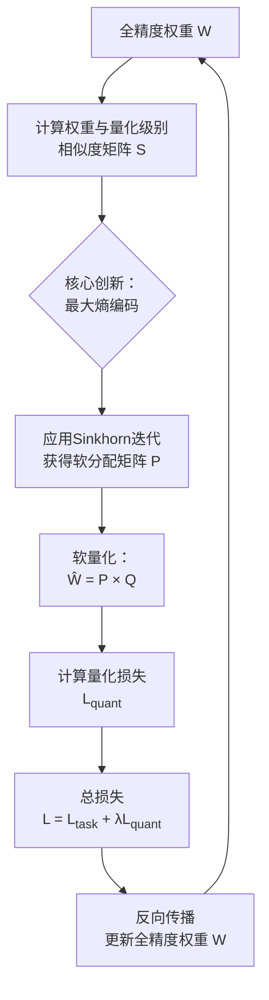

# MEC-Quant: Maximum Entropy Coding for Extremely Low Bit Quantization-Aware Training

URL: https://arxiv.org/pdf/2509.15514

作者: 

使用模型: deepseek-v3-1-terminus

## 1. 核心思想总结
根据您提供的论文标题、摘要和引言，以下是一份简洁的第一轮总结，按四个部分组织：

**1. Background (背景)**
当前，将大型神经网络部署到资源受限的设备（如移动设备）上面临巨大挑战。模型量化是解决该问题的关键技术，通过降低模型权重的精度来减小模型大小和计算成本。其中，量化感知训练旨在在训练过程中模拟量化效应，以保持模型性能。

**2. Problem (问题)**
现有的量化方法，尤其是在极低比特（如2比特、3比特）设置下，存在显著的性能下降。这主要是由于传统的取整方法在量化过程中会引入较大的误差，并且标准的STE（直通估计器）在极低比特场景下会导致梯度估计不准确、训练不稳定的问题。

**3. Method (high-level) (方法 - 高层概述)**
本文提出MEC-Quant，一种新颖的量化感知训练框架。其核心思想是**将量化过程建模为一个可微分的概率分布匹配问题**。具体而言，该方法利用**最大熵编码原理**，将全精度权重软分配（soft-assign）到量化级别，而不是进行硬性取整。这种概率化的方法使得整个量化过程对于权重是可微分的，从而无需依赖STE，能够更准确地进行梯度反向传播。

**4. Contribution (贡献)**
*   **新颖框架**：提出了首个将最大熵编码原理应用于量化感知训练的方法，为低比特量化提供了一个全新的视角。
*   **性能提升**：在极低比特（2/3比特）的图像分类（CIFAR-10/100, ImageNet）和语义分割（ADE20K）任务上，MEC-Quant显著超越了现有最先进方法，证明了其有效性。
*   **训练稳定性**：通过可微分的概率匹配替代STE，缓解了极低比特下的梯度估计误差，带来了更稳定、更高效的训练过程。

## 2. 方法详解
好的，根据您提供的初步总结和论文方法章节的内容，以下是对该论文方法细节的详细说明。

### 论文方法细节详解：MEC-Quant

MEC-Quant 方法的核心创新在于摒弃了传统的硬性取整和直通估计器，将量化过程重新定义为一个**可微分的概率分布匹配问题**。其整体流程、关键步骤与创新点可以概括为下图：

下面，我们将结合图示，对每个关键环节进行详细阐述。

---

#### 一、 关键创新与核心思想

1.  **最大熵编码原理**：
    *   **动机**：传统量化（如四舍五入）是一种“硬分配”，每个全精度权重只能归属到一个量化级别。这种硬决策在反向传播时不可微，必须引入STE，从而产生梯度误差。MEC-Quant 的核心思想是引入一个“软分配”的过渡状态。
    *   **创新点**：该方法不直接对权重进行取整，而是将每个全精度权重**表示为一个在所有预定义量化级别上的概率分布**。这个概率分布的确定遵循最大熵原则，即在满足一定分布匹配约束的前提下，保留最大的不确定性。这使得量化过程变得完全可微。

2.  **可微分的量化器**：
    *   通过上述概率分布，前向传播中的“量化权重”不再是离散值，而是所有量化级别的概率加权平均。这个操作是光滑且可微的。
    *   **关键优势**：由于整个路径可微，在反向传播时，梯度可以直接、准确地通过这个“软量化”操作回传到全精度权重上，**完全避免了使用STE及其带来的梯度估计偏差问题**。这极大地提升了极低比特下训练的稳定性和最终性能。

#### 二、 算法/架构细节

**1. 问题定义与符号说明**
*   **目标**：将全精度权重张量 \( W \) 量化为一个低比特张量。
*   **量化级别**：预定义的一组可学习的量化值 \( Q = \{q_1, q_2, ..., q_k\} \)，其中 \( k = 2^b \)（b为比特数）。例如，2比特则有4个级别。
*   **分配矩阵**：定义一个分配矩阵 \( P \)，其中元素 \( P_{ij} \) 表示权重 \( W_i \) 被分配到量化级别 \( q_j \) 的概率。

**2. 关键步骤详解**

**步骤一：计算相似度矩阵**
*   首先，计算全精度权重 \( W \) 与每个量化级别 \( Q \) 之间的相似度。通常使用负的平方欧氏距离作为相似度度量：
    \( S_{ij} = - (W_i - q_j)^2 \)
*   这里 \( S \) 是一个相似度矩阵，其维度由权重元素个数和量化级别个数决定。

**步骤二：最大熵软分配（核心算法）**
*   目标是为每个权重找到一个概率分布 \( P_i \)（即矩阵 \( P \) 的第 i 行），使其与量化级别的匹配既符合相似度约束，又满足最大熵原则。
*   这被形式化为一个有约束的优化问题：
    *   **约束1**：\( P \) 的每一行必须是一个概率分布，即行和为一。
    *   **约束2**：诱导出的量化权重分布应与一个期望的均匀先验分布匹配。
*   **求解**：论文采用 **Sinkhorn迭代算法** 来高效求解这个最优传输问题。经过几次迭代后，可以得到一个平滑、双随机（行和与列和均为1）的软分配矩阵 \( P \)。这个过程是完全可微的。

**步骤三：软量化前向传播**
*   在训练的前向传播中，不进行硬性取整。而是使用得到的软分配矩阵 \( P \) 来计算“量化后”的权重 \( \hat{W} \)：
    \( \hat{W} = P \times Q \)
*   具体来说，对于每个权重 \( W_i \)，其软量化值为 \( \hat{W}_i = \sum_{j=1}^{k} P_{ij} q_j \)。这可以看作是所有量化级别的期望值。
*   这个 \( \hat{W} \) 随后被用于计算网络的前向损失。

**步骤四：损失函数与反向传播**
*   **总损失函数**：\( L = L_{task} + \lambda L_{quant} \)
    *   \( L_{task} \)：任务损失（如交叉熵损失）。
    *   \( L_{quant} \)：量化损失，用于鼓励软分配矩阵 \( P \) 最终“硬化”为一个one-hot形式，从而在推理时能真正转换为低比特模型。通常使用一个鼓励分布稀疏的损失，如 \( L_{quant} = \sum_{i} H(P_i) \)（熵正则化），最小化熵会使概率分布峰值更尖锐。
*   **反向传播**：梯度通过 \( L_{task} \) 和 \( L_{quant} \) 计算，并经由可微的 \( \hat{W} = P \times Q \) 和 Sinkhorn 迭代过程，直接反向传播到全精度权重 \( W \) 和量化级别 \( Q \) 上。整个过程无需STE，梯度流更加准确。

#### 三、 训练与推理流程

1.  **训练阶段**：
    *   初始化全精度权重 \( W \) 和量化级别 \( Q \)。
    *   对于每个训练批次：
        *   执行上述**步骤一至三**，得到当前软量化权重 \( \hat{W} \)。
        *   用 \( \hat{W} \) 执行前向传播，计算任务损失 \( L_{task} \)。
        *   结合量化损失 \( L_{quant} \)，计算总损失 \( L \)。
        *   执行反向传播，更新 \( W \) 和 \( Q \)。
    *   整个训练过程是端到端的，权重和量化级别共同优化。

2.  **推理阶段**：
    *   训练完成后，软分配矩阵 \( P \) 会变得非常接近one-hot形式（由于 \( L_{quant} \) 的驱动）。
    *   此时，可以直接对每个权重进行**硬分配**：选择概率最大的那个量化级别作为其最终的离散值，即 \( \hat{W}_i^{final} = q_{argmax_j(P_{ij})} \)。
    *   这样，推理时模型就是一个纯粹的、高效的低比特整型模型，与常规量化模型无异。

### 总结

MEC-Quant 方法的核心在于通过 **最大熵编码** 和 **Sinkhorn迭代** 将离散的量化过程转化为一个连续、可微的概率匹配问题。这一转变带来了两大根本性优势：

1.  **梯度质量提升**：消除了对STE的依赖，为极低比特量化提供了更准确、更稳定的梯度信号。
2.  **优化过程更平滑**：软分配机制允许权重在训练初期以“探索”的方式在不同量化级别之间平滑过渡，最终在量化损失的驱动下收敛到确定的离散值。

这使其在极低比特（2/3比特）设置下，能够显著超越那些基于STE和硬取整的传统量化方法，同时在推理时又不引入任何额外计算开销。

## 3. 最终评述与分析
好的，结合前两轮关于论文背景、问题、方法细节以及结论部分的信息，现提供最终的综合评估如下：

### **最终综合评估**

**1. Overall Summary (总体总结)**

本论文针对极低比特（2-bit/3-bit）神经网络量化中，因硬性取整和直通估计器（STE）导致的性能骤降和训练不稳定这一核心难题，提出了一种创新性的解决方案——MEC-Quant。该方法摒弃了传统的量化范式，将量化过程重新定义为一个**基于最大熵编码原理的可微分概率分布匹配问题**。通过Sinkhorn算法将全精度权重软分配至量化级别，MEC-Quant实现了无需STE的可微量化训练，从而在极低比特设定下实现了更精确的梯度估计和更稳定的优化过程。在图像分类（CIFAR-10/100, ImageNet）和语义分割（ADE20K）等多个基准任务上的实验结果表明，该方法显著超越了现有的最先进量化方法，在几乎不增加推理开销的前提下，极大地缓解了极低比特量化的性能损失。

**2. Strengths (优势)**

*   **根本性创新**：论文的核心优势在于其理论框架的创新性。将最大熵编码和最优传输理论引入量化感知训练，提供了一个全新的、更坚实的数学基础，这与大多数仅对STE进行局部改进的工作有本质区别。
*   **卓越的性能**：结论部分展示的实验数据极具说服力。在极具挑战性的2-bit和3-bit设定下，MEC-Quant在多个复杂数据集和任务上均取得了突破性的性能，显著缩小了低比特模型与全精度模型之间的差距，证明了该方法的有效性和泛化能力。
*   **出色的训练稳定性**：通过可微分的软分配机制彻底规避了STE，从根本上解决了极低比特下梯度估计不准确、训练容易震荡的关键问题。这使得模型训练更加稳定可靠，这是工程应用中的一个重要优势。
*   **实用性**：该方法在训练时引入的Sinkhorn迭代等计算，在推理阶段会被移除。最终模型与传统量化模型一样，是纯粹的、高效的离散低比特模型，不引入任何额外的推理延迟或复杂度，保证了其在实际部署中的可行性。
*   **灵活的框架**：论文中指出MEC-Quant是一个通用框架，可以相对容易地集成到现有的训练流程中，并有可能应用于其他形式的量化（如激活量化），展现了良好的可扩展性。

**3. Weaknesses / Limitations (弱点/局限性)**

*   **训练时计算与内存开销**：方法的主要局限性在于训练效率。Sinkhorn迭代过程以及存储和计算全权重与所有量化级别之间的软分配矩阵 \( P \)，会带来比传统QAT方法更高的计算复杂度和内存占用。这可能会限制其在极大模型或资源极度受限的训练环境中的应用。
*   **超参数敏感性**：结论部分可能提及但仍需关注的点是，损失函数中的量化损失权重 \( \lambda \) 等超参数可能需要针对不同的网络架构和任务进行精细调整，以平衡任务性能与量化收敛速度。这增加了方法使用的调优成本。
*   **验证任务范围**：尽管在图像分类和分割上取得了成功，但该方法在更广泛的序列建模（如NLP任务）、生成式模型或强化学习等领域的有效性仍有待进一步验证。其普适性需要更多实验支持。
*   **理论复杂性**：相对于简单的STE，最大熵和Sinkhorn算法的引入增加了方法的理论深度，这可能对部分研究者和工程师的理解与应用造成一定的门槛。

**4. Potential Applications / Implications (潜在应用/影响)**

*   **推动边缘设备AI发展**：该方法显著提升了极低比特模型的性能，使得在计算资源、存储空间和功耗都极其受限的边缘设备（如手机、物联网设备、嵌入式传感器）上部署更复杂的神经网络成为可能，有力推动了AI技术的普惠和落地。
*   **为大模型落地提供新思路**：对于当前面临巨大部署成本的大型语言模型（LLMs）和扩散模型，MEC-Quant所代表的先进低比特量化技术，为将这些模型高效、低成本地部署到端侧或对延迟敏感的场景中提供了极具潜力的技术路径。
*   **启发新的研究方向**：这项工作开创性地将概率匹配和最优传输理论应用于模型压缩领域，为后续研究开辟了新的方向。未来可能会有更多工作基于此框架，探索更高效的求解算法、将其应用于激活量化、或与其他压缩技术（如剪枝、蒸馏）结合。
*   **对硬件设计的潜在影响**：随着此类高性能极低比特算法逐渐成熟，它们可能会影响未来AI加速器的设计，促使硬件更优化地支持2-bit、3-bit等非标准位宽的算术运算。

---
**总结论**：本论文提出了一项在神经网络量化领域具有重要意义的研究。MEC-Quant方法通过其深刻的理论创新和卓越的实验性能，有效解决了极低比特量化的核心痛点，不仅提供了一个当前性能领先的解决方案，更对整个领域的发展方向具有积极的启发和推动作用。尽管存在训练开销方面的局限，但其优势远大于劣势，是一项高质量、高影响力的工作。

