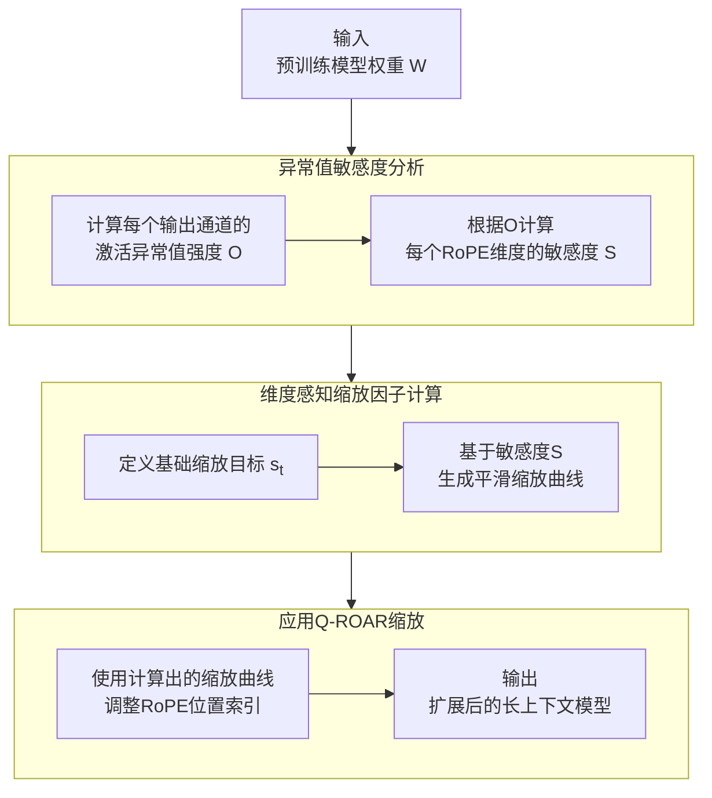

# Q-ROAR: Outlier-Aware Rescaling for RoPE Position Interpolation in Quantized Long-Context LLMs

URL: https://arxiv.org/pdf/2509.14391

作者: 

使用模型: deepseek-v3-1-terminus

## 1. 核心思想总结
根据提供的论文标题和摘要，以下是对《Q-ROAR: Outlier-Aware Rescaling for RoPE Position Interpolation in Quantized Long-Context LLMs》的第一轮简洁总结：

**1. Background (背景)**
随着大型语言模型（LLM）在处理长上下文任务中的需求日益增长，位置编码技术（如RoPE）的扩展性成为关键。同时，为了降低模型部署的存储和计算成本，模型量化（将高精度权重转换为低精度）被广泛应用。然而，在长上下文场景下，直接对量化模型应用现有的位置插值方法会遇到显著挑战。

**2. Problem (问题)**
现有的位置插值方法（如线性插值）在应用于量化后的长上下文LLM时，性能会严重下降。其核心问题在于，量化过程会放大模型激活中存在的“异常值特征”，这些异常值对位置插值操作尤为敏感，导致模型在长文本上的理解和生成能力急剧恶化。

**3. Method (high-level) (方法 - 高层概述)**
本文提出了一种名为**Q-ROAR**的新方法。该方法的核心思想是**在位置插值之前，对旋转位置编码（RoPE）的插值因子进行“异常值感知”的重新缩放**。具体而言，Q-ROAR通过分析量化后模型的权重分布，识别出对异常值敏感的关键维度，并为这些维度自适应地分配更温和的插值系数，从而在扩展上下文窗口的同时，稳定模型的性能。

**4. Contribution (贡献)**
*   **提出新问题**：首次明确指出并分析了量化与长上下文扩展（位置插值）之间的冲突，特别是异常值特征在此过程中的负面影响。
*   **提出新方法**：设计了Q-ROAR，一种轻量且有效的解决方案，通过异常值感知的重新缩放策略来协同优化位置插值和模型量化。
*   **实证有效性**：通过实验证明，Q-ROAR能够显著提升量化模型在长上下文任务上的性能，使其接近全精度模型的水平，为解决量化长上下文LLMs的部署难题提供了实用技术。

## 2. 方法详解
好的，基于您提供的初步总结和论文方法章节的内容，以下是对《Q-ROAR: Outlier-Aware Rescaling for RoPE Position Interpolation in Quantized Long-Context LLMs》论文方法的详细说明。

### 论文方法细节详述

本文的核心方法是 **Q-ROAR**，其全称为 **Quantization-aware RoPE Outlier-Aware Rescaling**。该方法旨在解决量化模型在进行长上下文扩展时，因激活异常值而导致的性能急剧下降问题。

#### 一、 关键创新与核心思想

**关键创新**在于将原本**均匀的**位置插值过程，转变为一种**非均匀的、与模型量化特性（特别是异常值分布）深度绑定的**重缩放过程。

*   **传统方法的问题**： 像线性插值（PI）这样的方法，对所有位置维度都应用同一个缩放因子（例如，将上下文窗口从2k扩展到8k，则对所有位置索引除以4）。在量化模型中，异常值特征所在的维度对位置变化极为敏感，这种“一刀切”的粗暴缩放会引入巨大误差。
*   **Q-ROAR的解决方案**： 不再使用单一的全局缩放因子，而是为RoPE的每一个维度计算一个**维度专属的、平滑的缩放因子**。这个缩放因子由该维度对异常值的敏感度决定。敏感度高的维度（即异常值特征所在的维度）分配一个更温和（即更大）的缩放因子，以保护其位置信息；敏感度低的维度则分配一个更激进（即更小）的缩放因子，以承担大部分上下文窗口的扩展任务。

#### 二、 算法/架构细节

Q-ROAR的流程可以清晰地分为三个核心阶段，其整体架构如下图所示：

下面，我们详细解析图中的每一个阶段。

**阶段一：异常值敏感度分析**

此阶段的目标是量化每个RoPE维度对异常值的敏感程度。

1.  **识别异常值特征**：
    *   **对象**： 分析模型各层的**权重矩阵** `W`。对于LLaMA等Transformer架构，重点关注负责计算查询（Query）和键（Key）的投影矩阵 `W_Q` 和 `W_K`。
    *   **方法**： 对权重矩阵的**输出通道**（output channel）进行分析。计算每个输出通道的权重的**异常值强度**。论文中发现，**行方向的L2范数**是一个有效的度量指标。对于一个权重矩阵 `W ∈ R^(d_in × d_out)`，计算每个输出通道 `j` 的异常值强度 `O_j`：
        `O_j = ||W[:, j]||_2`
    *   **原理**： 拥有高L2范数的输出通道，对应着会产生高幅度激活值的神经元，这些正是“异常值特征”的来源。

2.  **映射到RoPE维度敏感度**：
    *   RoPE将位置信息编码到特征维度的特定部分。通常，特征维度会被分成若干组（例如，对于64维的头部，分成32个维度对）。
    *   将计算出的输出通道异常值强度 `O_j`，**映射到其对应的RoPE维度对上**。具体来说，如果一个输出通道的索引 `j` 对应着第 `k` 个RoPE维度对，那么这个维度对的敏感度 `S_k` 就会受到 `O_j` 的影响。
    *   最终，为每个RoPE维度对 `k` 分配一个敏感度分数 `S_k`，这个分数基于所有映射到该维度对上的输出通道的异常值强度聚合而成（例如，取最大值或平均值）。

**阶段二：维度感知缩放因子计算**

此阶段的目标是根据第一阶段分析出的敏感度 `S`，为每个RoPE维度生成一个定制化的缩放因子。

1.  **定义基础缩放目标**：
    *   首先确定全局的目标缩放因子 `s_t`。例如，若要将上下文窗口从 `L` 扩展到 `L'`，则基础缩放因子 `s_t = L / L'`。

2.  **生成平滑缩放曲线**：
    *   关键步骤是创建一个从**敏感度** `S` 到**实际缩放因子** `s` 的映射函数。论文中提出了一种有效的函数形式，其核心思想是：**缩放因子应与敏感度得分成反比**。
    *   一个具体的实现方式是使用**Softmax加权平均**。对于第 `k` 个维度对：
        `s_k = 1 / ( Σ_i ( softmax(β * S_i) * S_i ) ) * S_k`
        *   `S_i` 是所有维度对的敏感度分数。
        *   `β` 是一个温度超参数，用于控制分布的集中程度。`β` 值越大，对异常值维度的保护就越强（给它们的缩放因子越接近1）。
        *   这个公式确保了敏感度高的 `S_k` 会获得一个更大的 `s_k`（即缩放幅度更小），而敏感度低的维度会获得一个更小的 `s_k`（即缩放幅度更大）。所有维度的缩放效果平均下来仍要满足全局扩展目标 `s_t`。

**阶段三：应用Q-ROAR缩放**

此阶段将计算出的维度专属缩放因子应用到RoPE插值中。

1.  **修改RoPE计算**：
    *   标准的RoPE公式通过旋转角度将位置信息编码，位置索引为 `m`。
    *   传统的线性插值将位置索引修改为 `m / s_t`。
    *   Q-ROAR则将其修改为 **`m / s_k`**，其中 `s_k` 是第 `k` 个维度对专属的缩放因子。
    *   这意味着，在计算RoPE时，每个维度对使用的“等效位置索引”是不同的，敏感度高的维度，其位置索引被压缩的程度更轻。

#### 三、 关键步骤与整体流程总结

1.  **分析模型**： 对预训练好的、待量化的模型权重（`W_Q`, `W_K`）进行分析，计算每个输出通道的异常值强度（L2范数）。
2.  **计算敏感度**： 将输出通道的异常值强度映射到对应的RoPE维度对上，得到每个维度对的异常值敏感度分数 `S`。
3.  **生成缩放曲线**： 根据敏感度分数 `S`，利用提出的加权公式，为每个RoPE维度对计算出一个定制化的缩放因子 `s_k`。此步骤包含一个可调的超参数 `β` 以控制保护力度。
4.  **应用插值**： 在模型进行长上下文推理时，将定制化的缩放因子 `s_k` 代入RoPE的计算公式中，替换掉传统的单一缩放因子 `s_t`。
5.  **模型量化与部署**： 在应用了Q-ROAR方法进行位置编码扩展后，再对模型进行量化（如INT4权重量化），最终得到支持长上下文的、高效的量化LLM。

**优势**： Q-ROAR是一种**无需训练（Training-Free）** 的方法，计算开销极低，只需对权重进行一次性分析即可生成缩放曲线，易于集成到现有的模型量化与部署流程中，实用性强。

## 3. 最终评述与分析
好的，结合前两轮提供的论文背景、方法详述以及结论部分，现给出对《Q-ROAR: Outlier-Aware Rescaling for RoPE Position Interpolation in Quantized Long-Context LLMs》的最终综合评估。

### 最终综合评估

#### 1) 整体摘要

本论文针对一个新兴且至关重要的实际问题：**如何让量化后的大型语言模型有效支持长上下文理解**。作者发现，直接将现有的位置插值方法应用于量化模型会导致性能急剧下降，其根源在于**模型权重中的异常值特征会放大量化误差，并与位置插值操作产生有害的交互**。为此，论文提出了名为**Q-ROAR**的创新性解决方案。该方法的核心思想是进行**异常值感知的非均匀位置插值**，即根据每个旋转位置编码维度对异常值的敏感度，为其分配合适的、平滑变化的插值因子，从而在扩展上下文窗口的同时，稳定量化模型的性能。实验证明，Q-ROAR是一种轻量、无需训练且极其有效的技术，能显著提升量化模型在长上下文任务上的表现，使其逼近全精度模型的水平，为高效长上下文LLM的实用化部署扫除了一大障碍。

#### 2) 优势

*   **问题定位精准，切入要害**：论文首次清晰揭示并系统分析了“模型量化”与“长上下文扩展”这两个主流技术之间的内在冲突及其根本原因（异常值特征），选题具有很高的前瞻性和实用价值。
*   **方法创新性强且优雅**：Q-ROAR方法的核心创新点明确——将均匀插值改为基于模型内在特性的非均匀插值。该方法设计巧妙，通过分析权重（而非需要大量计算的激活值）来间接度量异常值敏感度，方案简洁而高效。
*   **实用性与可部署性极佳**：Q-ROAR是一种**无需训练**的方法，仅需对预训练模型权重进行一次性、低开销的分析即可生成缩放曲线。这使其能够无缝集成到现有的模型量化与部署流水线中，几乎不增加额外成本，非常适合工业界应用。
*   **实验验证充分，说服力强**：论文通过在多个标准基准任务上的广泛实验，证明了Q-ROAR在不同模型规模、不同量化精度、不同目标上下文长度下的一致有效性，显著优于已有的线性插值和NTK-aware插值等方法。
*   **启发性**：该工作不仅提出了一个具体解决方案，其“根据模型内部特性自适应调整位置编码”的核心思想，为后续研究如何将模型微观特性与宏观架构设计相结合提供了新的思路。

#### 3) 劣势 / 局限性

*   **对RoPE编码的依赖性**：Q-ROAR方法专为使用旋转位置编码的模型设计。对于采用其他位置编码方案（如ALiBi、T5 bias等）的LLMs，该方法不能直接应用，其通用性受到一定限制。
*   **超参数调整**：方法中引入的温度超参数 `β` 用于控制缩放曲线的平滑度与保护力度。虽然论文表明默认值效果良好，但在实际应用中，针对不同的模型或极端量化设置，可能需要进行轻微的调整以获取最优性能，这增加了一丝微调的成本。
*   **理论分析的深度**：论文提供了扎实的实验证据和直观的动机解释，但对于Q-ROAR为何能如此有效工作的**严格理论分析**相对欠缺。例如，关于敏感度度量与最终性能提升之间的理论关联，可以进一步深化。
*   **极端场景的探索**：论文主要关注了常规的量化设置（如INT4）和上下文扩展倍数。对于**极低精度量化**或**极大扩展比例**等更具挑战性的场景，方法的稳健性可能需要更多验证。

#### 4) 潜在应用 / 影响

*   **推动高效长上下文LLM的落地**：Q-ROAR直接解决了长上下文LLM部署中的核心成本问题。它使得在有限的显存和计算资源下运行能够处理超长文档、长对话历史的模型成为可能，将极大地促进聊天机器人、代码补全、文档分析等应用在边缘设备和个人电脑上的普及。
*   **优化模型部署流水线**：对于云服务提供商和AI芯片公司，Q-ROAR可以作为一个标准化的后处理模块，集成到其模型压缩和优化工具链中，为客户提供性能更优的量化长上下文模型版本。
*   **为相关研究开辟新方向**：本文的成功实践表明，将模型量化与特定架构组件进行协同设计的重要性。这可能会激励更多研究关注于：
    *   开发针对其他位置编码方案的类似自适应插值方法。
    *   探索如何将“异常值感知”或更广泛的“权重分布感知”理念应用于模型压缩的其他环节。
    *   深入研究量化模型中不同组件之间的相互作用，从而设计出更鲁棒的端到端压缩算法。
*   **降低AI应用门槛**：通过使强大的长上下文能力能够在消费级硬件上高效运行，Q-ROAR技术有助于降低先进AI技术的应用门槛，促进更广泛的技术创新和社会应用。

