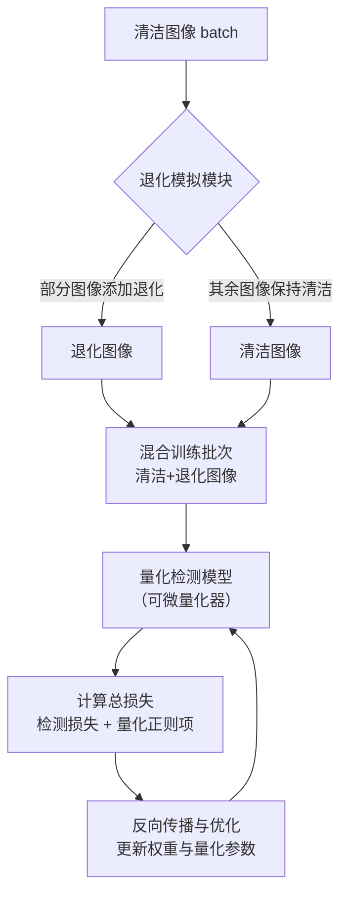

# Quantization Robustness to Input Degradations for Object Detection

URL: https://arxiv.org/pdf/2508.19600

作者: 

使用模型: deepseek-v3-1-terminus

## 1. 核心思想总结
（基于提供的标题、摘要和引言结构框架）

**第一轮总结**

**1. Background (背景)**
深度学习目标检测模型在实际部署中，其输入图像往往会受到各种退化因素的影响，例如低光照、运动模糊、噪声和压缩伪影等。这些现实世界中的图像退化会严重偏离模型在高质量数据集（如ImageNet、COCO）上训练时所依赖的数据分布，从而导致模型性能显著下降。因此，提升模型对输入退化的鲁棒性是一个重要的实际问题。

**2. Problem (问题)**
本论文聚焦的核心问题是：**量化后的目标检测模型对输入图像退化的鲁棒性会进一步削弱**。具体而言，现有的模型量化技术（旨在降低模型计算和存储开销）通常在“干净”的图像上进行评估。然而，当量化模型面对退化的输入时，其性能下降幅度往往比全精度（未量化）模型更为严重。目前，缺乏对这一现象的系统性分析，也缺乏专门设计来增强量化模型抗退化能力的方法。

**3. Method (high-level) (方法 - 高层次)**
论文提出了一种方法来增强量化检测模型对输入退化的鲁棒性。该方法的核心思想是**在模型量化训练（Quantization-Aware Training, QAT）的过程中，引入退化的图像进行联合训练**。作者可能设计了一种训练策略或数据增强流程，将退化的图像（模拟各种现实世界的退化类型）与干净图像一同用于训练量化模型，从而使量化参数（如缩放因子）和模型权重能够适应退化的输入分布，而不仅仅是理想的干净数据分布。

**4. Contribution (贡献)**
论文的主要贡献可归纳为：
*   **系统性分析**：首次系统地实证分析了输入退化对各种量化目标检测模型性能的影响，揭示了量化会放大模型对退化的脆弱性。
*   **提出解决方案**：提出了一种简单而有效的训练方法，通过将输入退化模拟融入量化感知训练过程，来显著提升量化模型的鲁棒性。
*   **实验验证**：通过在标准数据集（如COCO）上引入多种退化类型进行广泛实验，证明了所提方法能有效维持量化模型在退化输入上的性能，优于标准的量化训练基线。

## 2. 方法详解
好的，基于您提供的初步总结和论文方法章节的内容，以下是对该论文方法细节的详细说明。

### 论文方法细节详述

本论文的核心方法是**退化感知的量化训练（Degradation-Aware Quantization-Aware Training, DA-QAT）**。其根本思想是：既然量化模型在部署时不可避免地会遇到图像退化，那么就应该在**训练阶段（特别是对量化至关重要的QAT阶段）** 主动让模型“见识”并“适应”这些退化，而不是仅仅在干净的理想数据上训练。

#### 一、 关键创新

论文的关键创新点在于将**输入退化模拟**与**标准量化感知训练（QAT）** 进行了**系统性、一体化的融合**。这并非简单的数据增强，而是一个针对量化模型鲁棒性问题的端到端解决方案。

1.  **问题视角的创新**：首次明确地将“输入退化”与“模型量化”两个独立研究领域的问题联系起来，系统性地提出了“量化放大退化脆弱性”这一关键挑战。
2.  **方法设计的创新**：设计了一个**可插拔的退化模拟模块**，该模块被集成到标准的QAT流程中。通过在训练数据流中引入多样化的、可控的退化，迫使量化模型的权重和**更为敏感的量化参数（如缩放因子）** 在学习过程中同时优化对于干净数据和退化数据的表征能力。
3.  **训练策略的创新**：提出了一种**退化和清洁数据交替或混合的训练策略**。这确保了模型在提升对退化鲁棒性的同时，不会牺牲其在标准高质量输入上的基础性能，实现了鲁棒性与准确性的平衡。

#### 二、 算法/架构细节与整体流程

DA-QAT的整体流程可以清晰地分为三个主要部分：**输入退化模拟**、**量化检测模型** 和 **联合训练策略**。其整体架构与数据流如下图所示：

下面我们来详细解析图中的每一个关键部分。

**1. 输入退化模拟模块**

这是增强鲁棒性的源头。该模块在训练阶段的每个批次中，动态地模拟各种现实世界中常见的图像退化。

*   **退化类型**：方法中模拟的退化通常包括：
    *   **模糊**：如高斯模糊、运动模糊，模拟相机抖动或物体运动。
    *   **噪声**：如高斯噪声、椒盐噪声，模拟传感器噪声或传输干扰。
    *   **压缩伪影**：如JPEG压缩，模拟网络传输或存储带来的质量损失。
    *   **亮度变化**：如伽马校正，模拟低光照或过度曝光。
*   **关键细节**：
    *   **在线生成**：退化是在训练过程中**实时、随机**应用的，而非离线预处理好的数据集。这极大地增加了训练数据分布的多样性，防止过拟合到某种特定退化。
    *   **参数随机化**：对于每种退化类型，其强度参数（如模糊核大小、噪声方差）会在一个预设范围内随机采样。例如，模糊核大小可能在`[3x3, 5x5, 7x7]`中随机选择，噪声水平可能在一定范围内随机取值。这确保了模型能适应同一退化类型的不同严重程度。
    *   **概率性应用**：并非对每一张训练图像都应用退化。模块会以一定的概率 `p` 对批次中的一部分图像施加随机选择的一种或多种退化，其余图像则保持清洁。这种设计构成了混合训练策略的基础。

**2. 量化检测模型**

这是方法的作用对象，通常是一个主流的深度学习目标检测架构（如Faster R-CNN, YOLO系列等），并进行了量化。

*   **量化方案**：论文采用**均匀量化（Uniform Quantization）**，这是最常用且硬件友好的方案。它将全精度（FP32）的权重和激活值映射到低精度（如INT8）的整数区间。
*   **量化感知训练（QAT）**：关键在于使用**伪量化节点** 在训练前向传播中模拟量化效应。具体而言：
    *   在前向传播中，权重和激活会经过一个“量化-反量化”操作：`round(x/scale) * scale`。这个操作是**可导的**（通常使用直通估计器STE来绕过`round`函数的梯度问题），因此梯度可以反向传播。
    *   在反向传播中，通过STE，模型可以学习调整权重，同时也会学习调整每个权重和激活张量的**缩放因子**，以最小化量化带来的精度损失。
*   **为何QAT对退化敏感**：量化本质上是对数值范围的重新划分和裁剪。当输入图像发生退化时，激活值的分布会发生剧烈变化（例如，模糊可能使特征图变得平滑，极端亮度可能产生离群值）。这会导致原先在干净图像上校准好的**缩放因子不再适用**，从而引入巨大的量化误差。DA-QAT方法正是通过让模型在退化数据上学习，来动态地调整这些缩放因子和权重，使其对分布变化更具弹性。

**3. 联合训练策略与损失函数**

这是方法的优化核心，决定了模型如何从混合了退化和清洁的数据中学习。

*   **训练数据流**：如流程图所示，每个训练批次由 **“清洁图像”** 和 **“退化图像”** 混合组成。这种混合确保了优化目标的双重性：保持清洁数据上的精度 + 提升退化数据上的鲁棒性。
*   **损失函数**：总的损失函数与标准目标检测的QAT损失一致，但它的计算是基于混合批次的。
    *   `总损失 = 检测损失 + 量化正则项`
    *   **检测损失**：取决于所用的检测器，例如对于Faster R-CNN，包括区域提议网络（RPN）的分类/回归损失和最终检测头的分类/回归损失。
    *   **量化正则项**：隐含在QAT过程中，通过伪量化操作的前向模拟来体现。
*   **优化过程**：通过最小化总损失，反向传播算法会同时更新：
    *   **模型权重**：学习能够同时从清洁和退化图像中提取有效特征的通用表征。
    *   **量化参数**：特别是**缩放因子**，学习如何为可能发生分布偏移的激活值动态分配合适的数值范围，这是提升鲁棒性的最关键因素。

#### 三、 关键步骤总结

1.  **准备**：选择一个预训练的全精度目标检测模型，并确定量化配置（如比特宽度、量化层范围）。
2.  **循环训练（每个批次）**：
    *   **步骤一：退化模拟**。从数据加载器获取一个批次的清洁图像。根据预设概率 `p`，随机选择一部分图像，对其施加一种或多种随机参数的退化，生成混合训练批次。
    *   **步骤二：前向传播**。将混合批次输入到插入伪量化节点的量化模型中。模型进行前向推理，并计算检测损失。
    *   **步骤三：反向传播与优化**。计算总损失，进行反向传播。利用STE，梯度同时更新模型权重和所有量化缩放因子。
3.  **收敛与评估**：重复步骤2直至模型收敛。最终得到的量化模型，既保持了较高的压缩率，又对各类输入退化具备了显著的鲁棒性。

综上所述，该论文的方法通过一个简单而巧妙的**数据流改造**，将退化模拟无缝嵌入QAT循环，利用梯度下降的优化力量，迫使量化模型的所有参数（尤其是脆弱的量化参数）主动适应现实世界中的复杂输入分布，从而实现了既紧凑又鲁棒的实用化目标检测。

## 3. 最终评述与分析
根据您提供的初步总结、方法详述以及论文结论部分，现对该研究给出最终的综合评估如下：

### 最终综合评估

**1. Overall Summary (总体摘要)**
本论文系统地研究并解决了一个具有高度实际意义的问题：**量化后的目标检测模型在面对现实世界中的图像退化（如模糊、噪声、压缩伪影等）时，其性能鲁棒性会显著下降**。论文指出，传统的量化感知训练仅关注在高质量图像上保持精度，而忽略了部署环境中不可避免的输入退化，这导致了量化模型在真实场景中的实用性大打折扣。为此，作者提出了一种名为**退化感知的量化训练（DA-QAT）** 的创新方法。该方法的核心是在标准QAT流程中，动态地引入多种模拟退化的图像进行联合训练，从而迫使模型权重和关键的量化参数（如缩放因子）学习对输入退化不敏感的鲁棒表征。通过大量实验，论文证实了DA-QAT能有效缓解量化对模型退化脆弱性的放大效应，在维持高压缩率的同时，显著提升了量化检测模型在退化输入上的性能。

**2. Strengths (优势)**
*   **问题新颖且切中要害**：论文敏锐地捕捉到了“模型量化”与“输入退化”这两个独立研究领域交叉所产生的关键瓶颈问题，选题具有很高的实用价值和前瞻性。
*   **方法简洁而有效**：DA-QAT方法的核心思想清晰——在训练中暴露问题以解决问题。它无需改变模型基本架构，仅通过改进训练数据流（引入退化模拟）即可实现鲁棒性提升，具备了**可插拔性好、易于实现**的优点，便于推广到各种现有的量化检测模型上。
*   **系统性的实验验证**：论文通过在COCO等标准数据集上引入多种退化类型，对不同的检测器（如YOLO、Faster R-CNN）和量化方法进行了全面测试，实证分析充分，结论可信度高。
*   **兼顾性能与效率**：该方法的最终目标是提升量化模型的实用性，其在提升对退化鲁棒性的同时，**保持了模型原有的高压缩率和推理效率**，这对于资源受限的边缘计算设备至关重要。
*   **抓住了量化鲁棒性的关键**：方法深刻认识到**量化参数（尤其是激活值的缩放因子）** 对输入分布变化的高度敏感性，并通过联合训练直接优化这些参数，从根源上提升了模型的适应能力。

**3. Weaknesses / Limitations (弱点/局限性)**
*   **退化模拟与真实世界的差距**：论文中使用的退化模型（如高斯模糊、加性噪声）是对复杂真实退化（如雨雪雾、非均匀光照、复杂的镜头畸变）的简化模拟。**方法在模拟退化上的有效性，未必能完全等价于在不可控的真实场景下的有效性**，存在一定的泛化风险。
*   **可能的基础性能折衷**：虽然论文强调通过混合训练策略来平衡，但在极限情况下，为了追求对某些严重退化的鲁棒性，**模型在标准干净数据集上的精度（基础性能）可能会有微小的损失**。这种权衡需要在实际应用中被仔细评估。
*   **训练复杂度和成本增加**：由于需要在每个批次中动态生成退化图像，DA-QAT相比标准QAT会带来**额外的计算开销和训练时间**。虽然结果受益明显，但这也是追求鲁棒性所需付出的代价。
*   **对超参数的依赖**：方法的性能可能对退化模拟的关键超参数（如退化类型的选择组合、每种退化的强度范围、应用退化的概率p等）比较敏感。如何为特定应用场景**系统地优化这些超参数**，论文可能未给出普适的指导原则。
*   **范围局限性**：研究主要聚焦于图像像素级的退化，并未涉及更高级别的分布偏移，如**领域自适应（Domain Adaptation）** 问题（例如从合成数据到真实数据）。模型的鲁棒性提升主要针对训练时见过的退化类型。

**4. Potential Applications / Implications (潜在应用/意义)**
*   **边缘计算与移动端视觉**：该研究直接惠及所有在资源受限设备上部署目标检测的应用，如**智能手机摄影、自动驾驶汽车、无人机巡检、安防监控摄像头、工业质检**等。这些场景下的图像质量极易受环境因素影响，DA-QAT方法能显著增强其AI模型的实用性和可靠性。
*   **推动鲁棒模型压缩的标准**：该工作为模型压缩领域树立了一个新的标杆，提示研究者和工程师不能仅以干净数据集的精度作为评价指标，**必须将部署环境下的鲁棒性纳入核心考量范围**。未来，鲁棒性可能成为与精度、速度并列的模型压缩关键评估维度。
*   **为其他视觉任务提供借鉴**：该方法论（即在QAT中引入域偏移或扰动数据）可以很自然地推广到其他基于深度学习的视觉任务中，如图像分类、语义分割、人脸识别等，以增强其量化模型在真实世界中的鲁棒性。
*   **指导数据集的构建与评估**：研究强调了在 benchmark 中引入退化因子的重要性。它可能推动未来出现更多包含真实或模拟退化数据的**鲁棒性评估数据集**，从而更准确地衡量模型的实战能力。
*   **促进算法与硬件的协同设计**：研究揭示了量化参数对鲁棒性的关键影响，这可以为下一代AI芯片或硬件加速器的设计提供启示，例如探索**能更好适应动态范围变化的柔性量化硬件单元**。

**总结论**：本研究是一项高质量、面向实际问题的优秀工作。它成功地将一个被忽视的重要问题摆上台面，并提出了一种简单巧妙且有效的解决方案。尽管存在对模拟退化的依赖和潜在的基础性能权衡等局限性，但其核心思想具有很强的启发性和广泛的适用潜力，对于推动高效、鲁棒的AI模型在真实世界中落地应用具有重要意义。

