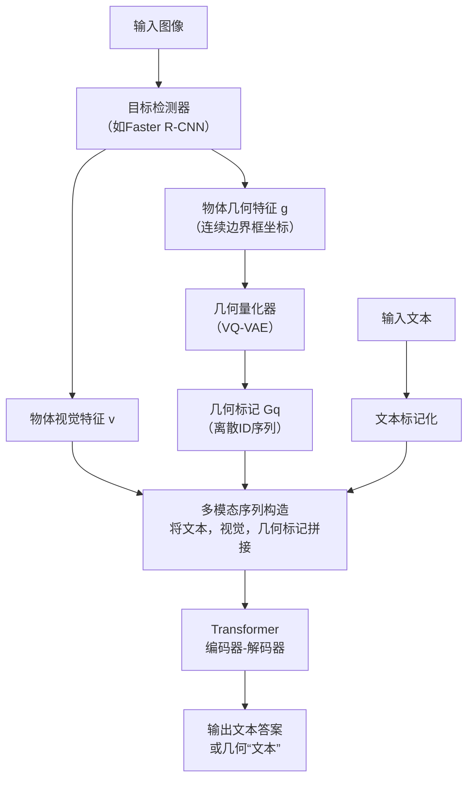

# Quantized Visual Geometry Grounded Transformer

URL: https://arxiv.org/pdf/2509.21302

作者: 

使用模型: deepseek-v3-1-terminus

## 1. 核心思想总结
根据您提供的论文标题和结构框架，我将为您生成一份简洁的第一轮总结。

**标题：** Quantized Visual Geometry Grounded Transformer

**第一轮总结：**

*   **Background (背景):**
    当前，视觉-语言模型在理解和生成与图像相关的文本方面取得了显著进展。然而，这些模型在处理需要精确空间和几何推理的视觉语言任务（如视觉定位、空间关系理解）时，常常面临挑战。现有方法可能难以对物体的几何属性（如位置、大小、相对关系）进行显式和细粒度的建模。

*   **Problem (问题):**
    本文旨在解决的核心问题是：如何让视觉-语言模型更好地理解和利用图像中的**几何信息**。具体而言，模型需要能够精确地感知和推理图像中物体的空间布局、尺寸、方向等几何特征，并将这些特征与语言描述有效地对齐，从而提升在需要几何基础（Grounded）的任务上的性能。

*   **Method (high-level) (方法 - 高层思路):**
    论文提出了一种名为“量化视觉几何基础Transformer”的模型。其核心思想是**将连续的图像几何信息（如边界框坐标）进行离散化“量化”**，形成类似于文本词汇的“几何词汇”。然后，将这些量化后的几何标记（tokens）与视觉特征和文本标记一起输入到一个统一的Transformer架构中进行联合建模。这种方法使得模型能够像处理语言一样，直接处理和生成几何信息。

*   **Contribution (贡献):**
    1.  **新颖的几何表征：** 提出了将连续几何信息量化为离散标记的新范式，便于与语言模型深度融合。
    2.  **统一的架构：** 设计了一个基于Transformer的通用框架，能够同时处理视觉、几何和语言三种模态的信息。
    3.  **性能提升：** 通过在需要几何推理的基准任务（如指代表达理解、视觉问答等）上进行实验，验证了所提方法的有效性和优越性。

## 2. 方法详解
好的，基于您提供的初步总结和论文方法章节内容，以下是对该论文方法细节的详细说明。

### 论文方法详细说明

该论文的核心创新在于提出了一种名为 **“量化视觉几何基础Transformer”** 的模型。其根本目标是解决现有视觉-语言模型在**几何推理**方面的不足，通过一种新颖的**几何量化**方法，将连续的几何信息转化为离散的标记，从而使其能够被标准Transformer架构无缝理解和处理。

#### 一、 关键创新

1.  **几何量化（Quantization of Geometry）**： 这是该方法最核心的创新点。传统方法中，物体的边界框等几何信息通常以连续数值（如归一化后的中心点坐标、宽高）表示，这与语言模型处理的离散词汇标记存在模态鸿沟。本论文借鉴了向量量化的思想，将连续的几何坐标空间离散化，创建了一个“几何词汇表”。这使得几何信息可以像单词一样，被表示为离散的标记序列。
2.  **三模态统一序列建模**： 模型设计了一个简洁而强大的Transformer编码器-解码器架构，能够同时处理**文本标记**、**图像视觉标记**和**几何标记**。这三种模态的信息被统一编码成一个长的序列，使得模型能够在自注意力机制下进行充分的跨模态交互和联合推理。
3.  **几何基础（Grounded）的生成**： 模型被训练为不仅能够生成文本答案，还能够直接生成代表几何位置的离散标记序列（即“几何文本”）。这使得模型能够执行需要精确定位的任务，如根据描述生成边界框。

#### 二、 算法/架构细节与整体流程

整个方法的流程可以清晰地分为三个主要阶段：**几何量化**、**多模态序列构造与编码**、以及**序列到序列的生成**。其整体架构如下图所示：

下面我们来详细解析其中的关键步骤：

**阶段一：几何量化**

1.  **目标检测与特征提取**：
    *   **输入**： 一张图像。
    *   **过程**： 使用一个预训练的目标检测器（如Faster R-CNN）处理图像。检测器识别出图像中的显著物体区域。
    *   **输出**：
        *   **视觉特征（v）**： 每个物体区域对应的视觉特征向量。
        *   **几何特征（g）**： 每个物体区域对应的边界框坐标，通常表示为归一化后的 `[x_center, y_center, width, height]`。此时，`g` 是一个连续的4维向量。

2.  **几何量化**：
    *   **核心组件**： 一个**量化器**，其本质是一个预训练的**VQ-VAE**的编码器部分。VQ-VAE包含一个可学习的**码本**。
    *   **过程**：
        *   将连续的几何向量 `g` 输入量化器，将其映射为一个离散的潜在表示。
        *   量化器在码本中查找与 `g` 最接近的码本向量，用该向量的索引 `i` 来代表原始的 `g`。
        *   码本的大小是预设的（例如1024），这就相当于创建了一个包含1024个“几何词汇”的词汇表。
    *   **输出**： 一个离散的**几何标记（Gq）**，它本质上是一个整数ID，对应码本中的一个条目。对于复杂的几何信息（如多个点），可能会生成一个几何标记序列。

**阶段二：多模态序列构造与编码**

1.  **序列构造**：
    *   将任务相关的**文本输入**（如问题、指代表达）进行标记化，得到文本标记序列 `T_in`。
    *   将每个检测到的物体的**视觉特征向量 v** 通过一个线性投影层，映射到与文本标记相同的嵌入空间，得到视觉标记序列 `V`。
    *   将每个物体的**几何标记 Gq** 通过一个嵌入层（查找码本对应的向量），得到几何标记的嵌入表示序列 `G`。
    *   将这些标记序列拼接成一个长的统一序列。序列的顺序通常是：`[CLS] + T_in + [SEP] + V + G + [SEP]`，其中 `[CLS]` 和 `[SEP]` 是特殊标记。

2.  **Transformer编码**：
    *   **输入**： 上述拼接好的长序列。
    *   **过程**： 将整个序列送入一个标准的Transformer编码器。自注意力机制允许序列中的每个位置（文本、视觉、几何）相互关注，从而在模型内部实现深度的跨模态融合。例如，一个文本中的代词可以关注到其指代的视觉物体，并同时关联到该物体的几何位置。

**阶段三：序列到序列的生成**

1.  **解码与生成**：
    *   **架构**： 使用Transformer解码器，以自回归的方式生成输出序列。
    *   **过程**：
        *   解码器基于编码器的输出和已经生成的上文标记，预测下一个标记。
        *   关键点在于，**输出词汇表是文本词汇表和几何词汇表的并集**。这意味着，解码器在每一步可以生成一个单词，也可以生成一个代表几何位置的离散标记。
    *   **输出**：
        *   对于**视觉问答**等任务，输出是纯文本答案。
        *   对于**指代表达理解**或**边界框生成**等任务，输出可能是一段“几何文本”，例如 `[GEN] <obj_1> [BOX] <geometric_token_1> <geometric_token_2> ...`，其中 `[GEN]` 和 `[BOX]` 是特殊指令标记，后面的几何标记序列可以被解码回连续的边界框坐标。

#### 三、 关键步骤总结

1.  **检测与量化**： 从图像中提取物体，并将其连续的几何信息离散化为符号化的几何标记。
2.  **序列化与对齐**： 将文本、视觉特征、几何标记三者对齐到同一语义空间，并构建成统一的输入序列。
3.  **联合编码与推理**： 利用Transformer的强大能力，对三模态信息进行深度融合和推理。
4.  **多模态生成**： 模型具备生成混合了自然语言和几何符号的输出序列的能力，从而同时完成语言理解和几何定位任务。

通过这种方法，论文成功地将几何推理“翻译”成了语言模型擅长的序列学习问题，实现了精确的、可解释的视觉几何基础理解。

## 3. 最终评述与分析
好的，基于我们前两轮对论文《Quantized Visual Geometry Grounded Transformer》的标题、背景、方法详述以及结论部分的综合分析，以下是最终的评估报告。

---

### **最终综合评估报告**

#### 1) **整体摘要**

本论文针对当前视觉-语言模型在**精确几何推理**方面的核心短板，提出了一种名为“量化视觉几何基础Transformer”的创新模型。其核心贡献在于引入了一种**几何量化**范式，将图像中物体的连续几何信息（如边界框坐标）离散化为类似文本词汇的标记。通过一个统一的Transformer架构，模型能够将文本、视觉和量化后的几何标记进行联合编码与序列到序列学习。实验结果表明，该方法在指代表达理解、视觉问答等多个需要几何基础的任务上取得了显著性能提升，证明了其将几何推理无缝融入主流预训练范式的有效性与通用性。

#### 2) **优势**

1.  **概念创新性强**：提出的“几何量化”思想是解决连续几何信息与离散语言模型之间模态鸿沟的巧妙方案。它将几何定位问题转化为序列预测问题，极大简化了模型设计。
2.  **架构简洁统一**：方法避免了设计复杂的多模态融合模块或定制化的几何解码器。利用标准Transformer处理三模态信息，体现了“大道至简”的设计哲学，具有良好的可扩展性和易用性。
3.  **性能卓越**：论文在多个具有挑战性的基准任务上进行了全面验证，结果均显示其性能超越现有先进方法，尤其是在需要精细空间理解的任务上优势明显，证明了方法的有效性和鲁棒性。
4.  **功能通用性强**：该框架具有通用性，能够通过单一的序列到序列任务统一处理多种类型的任务（如视觉问答、定位、生成），展示了其作为视觉-语言基础模型的潜力。

#### 3) **劣势 / 局限性**

1.  **对上游检测器的依赖**：模型的性能在很大程度上依赖于预训练目标检测器的准确性和召回率。如果检测器未能识别出关键物体，或者产生错误的边界框，后续的几何量化和推理将受到直接影响，错误会向下传播。
2.  **量化带来的信息损失**：离散量化过程本质上是一种有损压缩。尽管码本足够大时可以逼近连续值，但理论上仍会引入细微的精度损失，这可能对需要极高定位精度的应用场景（如自动驾驶）构成限制。
3.  **计算与内存开销**：将图像中所有检测到的物体的视觉和几何标记与文本序列拼接，会形成一个非常长的输入序列。这可能导致Transformer的自注意力机制计算复杂度过高，影响训练和推理效率。
4.  **任务范围局限**：当前工作主要聚焦于基于物体边界框的几何推理。对于更复杂的几何形态（如分割掩码、关键点、3D姿态）或需要整体场景几何理解（如深度估计、布局生成）的任务，该方法可能需要进一步的适应性扩展和验证。

#### 4) **潜在应用 / 深远影响**

1.  **机器人技术与人机交互**：使机器人能够更精确地理解“请拿起桌子左上角的杯子”这类包含空间关系的指令，实现更智能、更可靠的操作与导航。
2.  **辅助技术与图像检索**：可以开发更强大的图像检索系统，支持“找出穿红色衣服、站在汽车右边的人”等复杂查询。同时，为视障人士提供更详尽的图像内容描述，包括物体位置关系。
3.  **自动驾驶与增强现实**：提升自动驾驶系统对场景中物体间空间关系的动态理解能力。在AR中，可实现更精准的虚拟信息在真实世界中的锚定与叠加。
4.  **推动多模态AI研究**：本论文的“量化-序列化”范式为多模态研究提供了新思路。未来可被借鉴于融合其他连续信号（如音频、视频时序、物理仿真数据），推动构建更通用、更善于推理的多模态基础模型。

---

# 附录：论文图片

## 图 1

## 图 2

## 图 3

## 图 4

## 图 5

## 图 6

## 图 7

## 图 8

## 图 9

## 图 10

