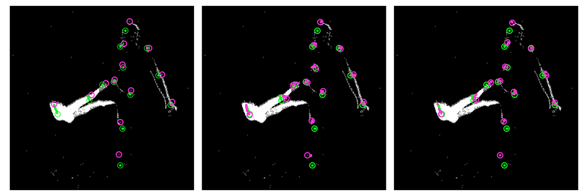
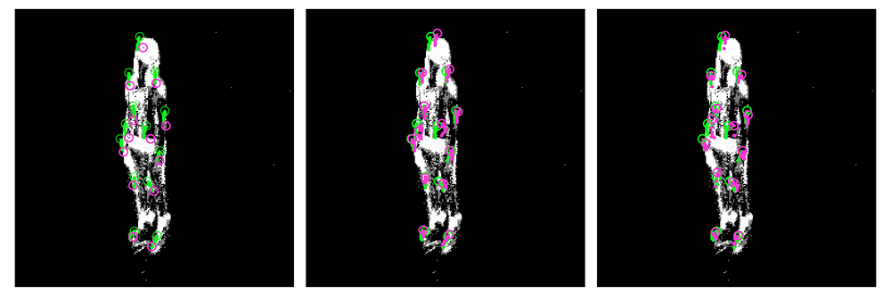
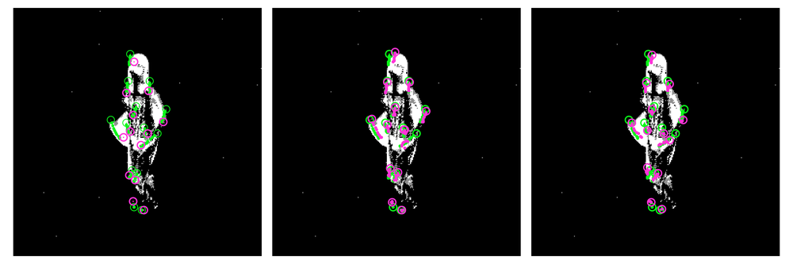
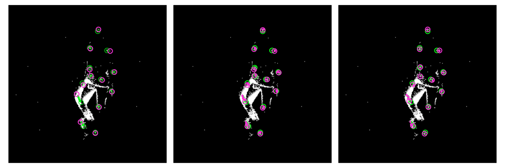
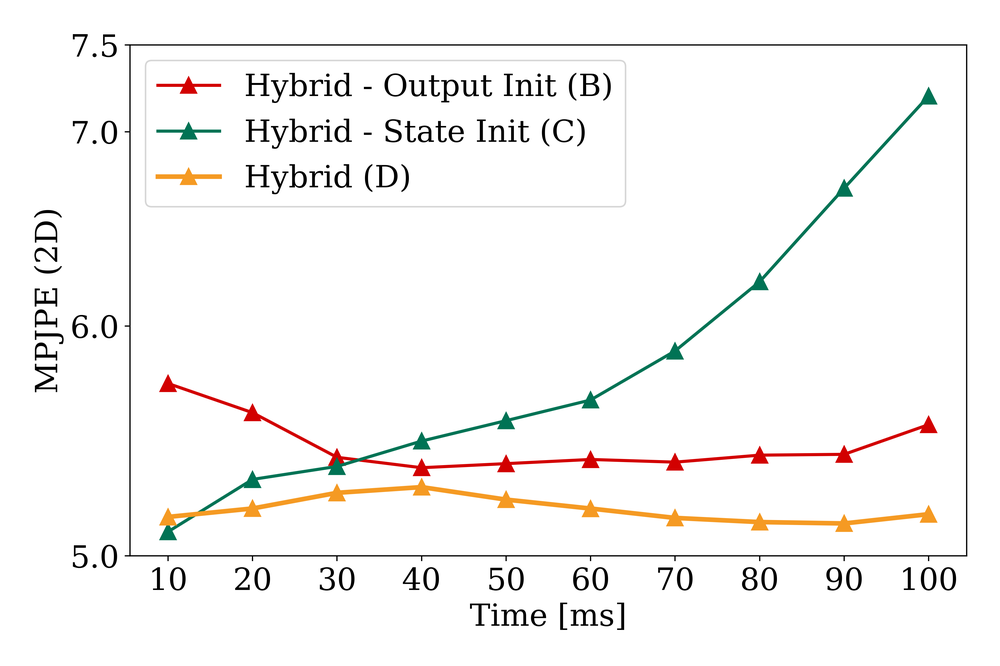
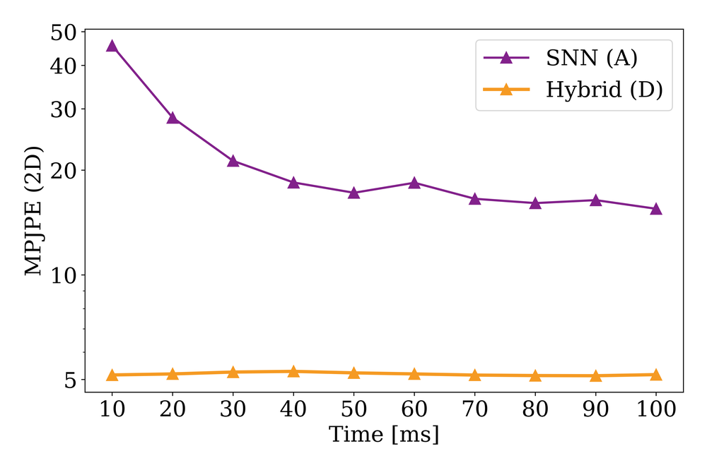
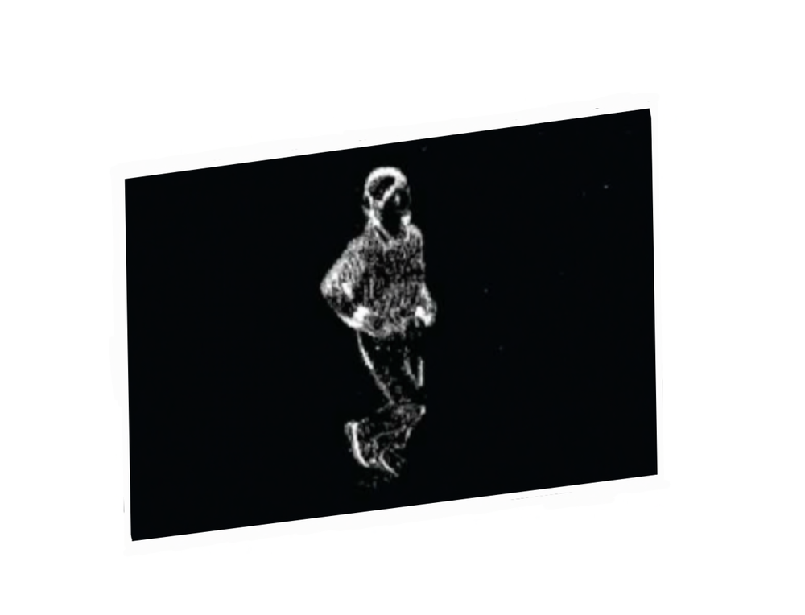
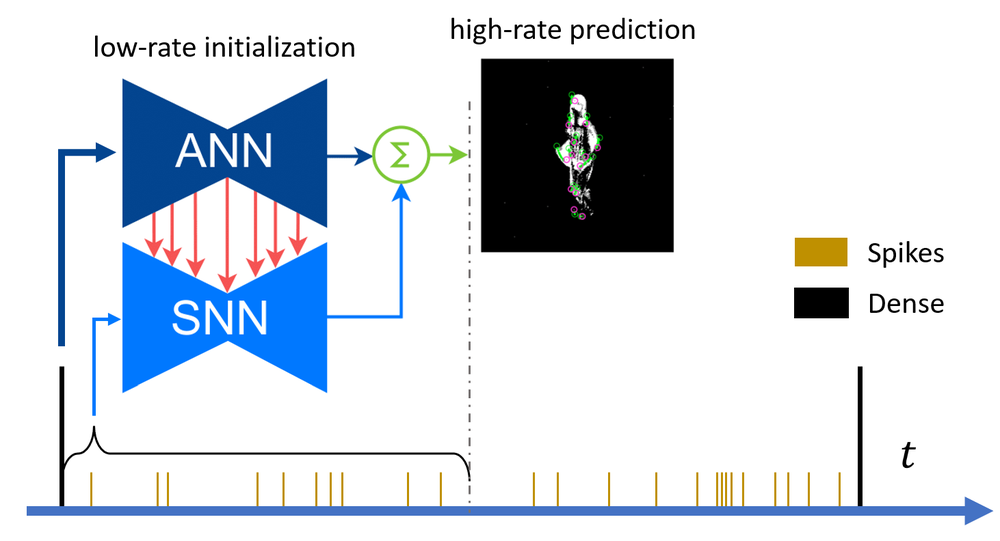
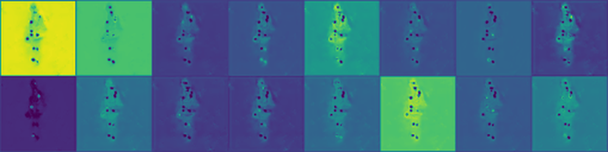

# A Hybrid ANN-SNN Architecture for Low-Power and Low-Latency Visual Perception

**URL**: https://www.semanticscholar.org/paper/00fbe3a4663d249ac9a7134434caa4af32815255
**提交日期**: 2023-03-24
**作者**: Asude Aydin; Mathias Gehrig; Daniel Gehrig; D. Scaramuzza
**引用次数**: 24
使用模型: ep-20251112215738-bz78g

## 1. 核心思想总结
根据提供的论文标题、摘要和引言（假设引言内容与摘要一致），以下是一份简洁的第一轮总结，按四个部分组织：

**1. Background (背景)**
脉冲神经网络（SNN）作为一种受生物启发的神经网络，因其异步和稀疏处理的特性，有望在边缘设备上实现低功耗和低延迟的推理。然而，SNN作为时序模型，其性能严重依赖于内部状态，而该状态的收敛需要较长时间，且在无输入数据时会快速衰减，这导致其在实际应用中存在延迟高、功耗大和精度低的问题。

**2. Problem (问题)**
SNN模型存在的核心问题是其内部状态收敛慢且易衰减。这一特性使得SNN在需要快速、持续响应的视觉感知任务（如基于事件的人体姿态估计）中，难以在保持低功耗的同时，实现与经典人工神经网络（ANN）相媲美的低延迟和高精度。

**3. Method (high-level) (方法 - 高层概述)**
为了解决上述问题，本文提出了一种混合ANN-SNN架构。该方法的核心思想是利用一个低频率运行的辅助ANN来初始化SNN的内部状态。随后，SNN利用这个已初始化的状态进行高时间分辨率的预测，直到下一个ANN初始化阶段。这种设计结合了ANN在状态稳定性上的优势和SNN在高效推理上的优势。

**4. Contribution (贡献)**
本文的主要贡献在于提出了一种新颖的混合模型，有效结合了ANN和SNN的优势。实验证明，在基于事件的2D和3D人体姿态估计任务上，该模型在相同推理速率下，比纯ANN模型功耗降低88%，性能仅下降4%；同时，与SNN模型相比，误差降低了74%。这项工作为如何协同利用ANN和SNN以最大化其各自优势提供了新的思路。

## 2. 方法详解
好的，遵照您的要求，我将基于您提供的初步总结和论文方法章节的内容，详细阐述该论文的方法细节。

### 论文方法详细说明

本文的核心创新点在于提出了一种**混合ANN-SNN协同推理架构**，旨在解决SNN内部状态收敛慢、易衰减导致的高延迟和低精度问题。该方法并非简单地将ANN转换为SNN，而是让两种网络协同工作，各司其职。

#### 一、 关键创新

1.  **状态初始化与刷新机制：** 这是最核心的创新。该方法摒弃了让SNN从零状态开始缓慢收敛的传统方式，转而利用一个运行频率较低的辅助ANN来周期性地**计算并直接注入一个稳定、准确的内部状态**给SNN。这相当于为SNN提供了一个高精度的“热启动”，使其跳过了耗时的收敛过程。
2.  **异构模型的时序分工：** 实现了ANN和SNN在时序上的高效分工。**ANN负责“宏观”的、低频率的状态稳定和精度保障**；而**SNN负责“微观”的、高频率的、低功耗的细节推理**。这种分工协同发挥了各自的长处。
3.  **针对事件相机的数据适配：** 整个方法的设计紧密结合了事件相机的异步、稀疏、高时序分辨率的特性。将事件流自然地映射到SNN的脉冲输入，并利用混合模型处理其带来的数据特性。

#### 二、 算法/架构细节

该混合架构主要由两部分组成：**辅助ANN** 和 **主SNN**。其整体工作流程是一个周期性的循环。

**整体架构与数据流图**
```
时间线:  t0[Ann-Step] --> t1[SNN-Step] --> t2[SNN-Step] --> ... --> tk[Ann-Step] ...
        ↓                   ↓                   ↓                   ↓
操作:   ANN推理            SNN推理            SNN推理            ANN推理
        ↓                   ↓                   ↓                   ↓
状态:   初始化SNN状态(h0) -> 更新状态(h1) -> 更新状态(h2) -> ... -> 刷新状态(hk)
        ↓                   ↓                   ↓                   ↓
输出:   输出预测 (Y_ann)    输出预测 (Y_snn)    输出预测 (Y_snn)    输出预测 (Y_ann)
```

**1. 辅助ANN**
*   **输入：** 在每个ANN步骤（Ann-Step），ANN接收的是一段时间窗口内（例如，对应SNN的 `K` 个时间步）累积的事件数据。这通常会被转换为一个密集的、类似帧的表示，例如**事件体素网格**，它包含了事件的时空信息。
*   **角色与目标：** ANN的目标是**精确预测当前时刻的目标状态**（如2D或3D人体关节点坐标）。由于其输入是累积信息，ANN不易受瞬时噪声影响，能产生稳定、高精度的预测。
*   **核心功能：** ANN的**隐藏层激活值**被赋予了第二项重要任务。这些激活值（代表了ANN对当前场景的内部编码）被用作SNN的初始状态。具体而言，ANN的最后一个隐藏层激活值会被直接赋值或线性映射到SNN的神经元状态（如膜电位）。

**2. 主SNN**
*   **输入：** 在ANN初始化之后的每个SNN步骤（Snn-Step），SNN接收的是**高时间分辨率的事件流**。这些事件被编码为脉冲，直接输入到SNN中。
*   **角色与目标：** SNN利用其**异步、稀疏计算**的优势，在每个时间步基于新到达的事件进行快速、低功耗的推理，输出高频更新的预测。
*   **内部状态动力学：** SNN遵循标准的泄漏积分-发放模型。神经元膜电位 \(V(t)\) 的动态变化由以下公式描述：
    *   **积分：** \( \tau \frac{dV(t)}{dt} = -V(t) + I(t) \)
        其中，\( \tau \) 是膜时间常数，\( I(t) \) 是输入电流（由输入脉冲加权求和得到）。
    *   **发放与重置：** 当 \(V(t)\) 超过阈值 \(V_{th}\) 时，神经元发放一个脉冲，并将膜电位重置。
*   **关键点：** SNN的初始状态 \(V_{init}\) 不是零，而是由上一个ANN步骤计算出的状态。这使得SNN从一开始就处于一个接近最优的状态，能够立即做出有意义的预测，并对新事件做出快速、准确的调整。

#### 三、 关键步骤与整体流程

假设ANN的运行频率是SNN的 \(1/K\)，即每 \(K\) 个SNN时间步，ANN运行一次。

1.  **步骤一：ANN初始化阶段**
    *   **时间点：** 在时间步 \(t = n \times K\) （n为整数）。
    *   **动作：**
        a. **累积事件：** 收集过去 \(K\) 个时间步（或一个固定时间窗口）的事件流。
        b. **ANN推理：** 将累积的事件数据转换为ANN的输入格式（如体素网格），并输入到辅助ANN中进行前向传播。
        c. **状态注入：** 记录ANN的最终输出 \(Y_{ann}\) 作为当前时刻的预测结果。同时，**提取ANN隐藏层的激活值，并将其设置为SNN网络的新初始状态 \(h_{snn}(t)\)**。
        d. **输出预测：** 发布ANN的预测结果 \(Y_{ann}\)。

2.  **步骤二：SNN持续推理阶段**
    *   **时间点：** 在时间步 \(t = n \times K + k\)，其中 \(k = 1, 2, ..., K-1\)。
    *   **动作：**
        a. **脉冲编码：** 将当前极短时间内到达的新事件编码为脉冲信号。
        b. **SNN推理：** 将脉冲信号输入到SNN中。SNN基于其**已被ANN初始化的内部状态** \(h_{snn}(t)\) 和新的输入脉冲进行一步前向传播。
        c. **状态更新：** SNN根据其神经元动力学方程更新内部状态至 \(h_{snn}(t+1)\)。
        d. **输出预测：** 读取SNN输出层的状态（通常是膜电位或发放率），经过一个简单的解码（如线性层）后，得到当前时刻的预测结果 \(Y_{snn}(t)\) 并输出。

3.  **循环往复：**
    *   重复步骤二，直到到达下一个ANN初始化时间点 \(t = (n+1) \times K\)。
    *   此时，流程跳回**步骤一**，ANN再次运行，用新的累积信息**刷新**SNN的状态，纠正SNN在持续推理过程中可能因长时间运行而产生的累积误差或状态衰减。

#### 总结

该方法通过一种巧妙的“状态接力”机制，将ANN的**稳定性**和**高精度**与SNN的**高效性**和**低延迟**完美结合。ANN周期性地为SNN“校准”状态，确保系统始终在一个高精度的基准上运行；而SNN则在两次校准之间，以极低的功耗处理高频率的输入流，实现快速响应。这种设计有效地解决了纯SNN的状态初始化和衰减问题，在不显著牺牲性能的前提下，大幅降低了系统功耗，为SNN在实时边缘计算中的应用提供了切实可行的解决方案。

## 3. 最终评述与分析
根据您提供的论文初步总结、方法详述以及结论部分的信息，现给出最终的综合评估如下：

### 最终综合评估

**1. 整体总结**
本论文针对脉冲神经网络在视觉感知任务中内部状态收敛慢、易衰减导致的高延迟和低精度核心问题，提出了一种创新的混合ANN-SNN协同推理架构。该架构的核心思想是利用一个低频率运行的辅助ANN周期性地为SNN提供稳定、精确的内部状态初始化，使SNN能够跳过耗时的收敛阶段，直接进行高效、低功耗的高频推理。实验验证表明，该混合模型在基于事件的人体姿态估计任务上，成功地在保持接近ANN水平的高精度同时，显著降低了功耗，有效解决了纯SNN的固有问题，为SNN在资源受限的边缘设备上的实际应用提供了强有力的解决方案。

**2. 优势**
*   **高效协同：** 巧妙结合了ANN的稳定性、高精度与SNN的高能效、低延迟优势，实现了“1+1>2”的协同效应。
*   **性能卓越：** 在关键指标上取得显著突破，与纯ANN模型相比，在性能损失极小（仅4%）的情况下，功耗降低高达88%；与纯SNN模型相比，误差大幅降低74%。
*   **创新性强：** 提出的“状态初始化与刷新”机制是核心创新点，从根本上解决了SNN状态管理的难题，为异构模型融合提供了新范式。
*   **实用价值高：** 该方法紧密结合事件相机的数据特性，针对边缘计算场景的低功耗、低延迟需求设计，具有很强的实际应用潜力。

**3. 局限性与挑战**
*   **超参数敏感性：** 混合模型的性能可能依赖于ANN运行频率（K值）等关键超参数的精心调优，这增加了模型部署的复杂性。
*   **任务泛化性待验证：** 当前实验主要集中在基于事件的人体姿态估计任务上。该方法在处理其他类型的时空序列任务（如语音识别、自然语言处理）时的有效性和通用性仍需进一步验证。
*   **硬件实现挑战：** 尽管模型本身具有低功耗特性，但混合架构（包含ANN和SNN两部分）在专用神经形态芯片上的高效集成与协同调度，可能面临额外的硬件设计挑战。
*   **理论分析不足：** 论文可能缺乏对状态初始化为何如此有效、以及状态衰减动态的深入理论分析，其最优性及理论边界有待进一步研究。

**4. 潜在应用与启示**
*   **应用前景：**
    *   **实时边缘视觉感知：** 非常适合部署在无人机、自动驾驶汽车、移动机器人、AR/VR头盔等对功耗和延迟极其敏感的移动平台上，进行实时姿态估计、手势识别、目标跟踪等。
    *   **事件相机生态系统：** 极大地推动了事件相机在终端设备上的应用，为处理其产生的高速异步数据流提供了高效的算法支持。
    *   **更广泛的时序信号处理：** 其核心思想可迁移至其他需要处理连续时序信号的低功耗应用场景，如生物信号监测（EEG/ECG）、工业传感器数据分析等。

*   **研究启示：**
    *   **范式转变：** 启示研究者不必拘泥于“纯SNN”或“ANN-to-SNN转换”的路径，而是可以探索多种神经网络模型（ANN、SNN、RNN等）的**动态协同与互补**，以最大化系统整体效能。
    *   **关注状态动力学：** 强调了管理SNN内部状态动态的重要性，为未来研究如何更智能地控制和优化SNN的时序行为提供了重要方向。
    *   **软硬件协同设计：** 该混合架构对下一代支持异构神经计算的高能效芯片设计提出了新的需求和机遇，将促进算法与硬件的共同演进。

综上所述，本论文工作是一项具有高度创新性、出色性能表现和重要应用价值的优秀研究，为低功耗神经计算领域做出了显著贡献。


---

# 附录：论文图片

## 图 1


## 图 2


## 图 3


## 图 4


## 图 5


## 图 6


## 图 7


## 图 8


## 图 9


