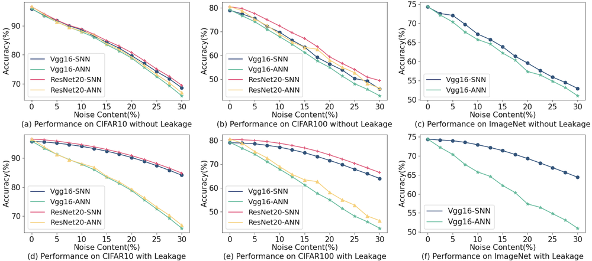
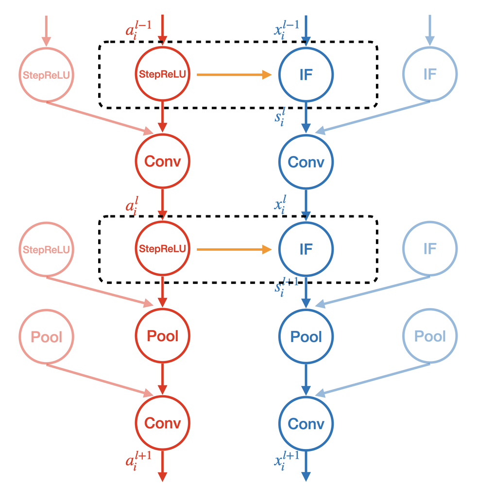
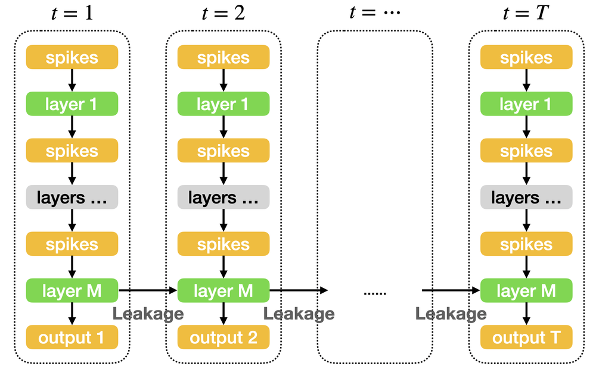
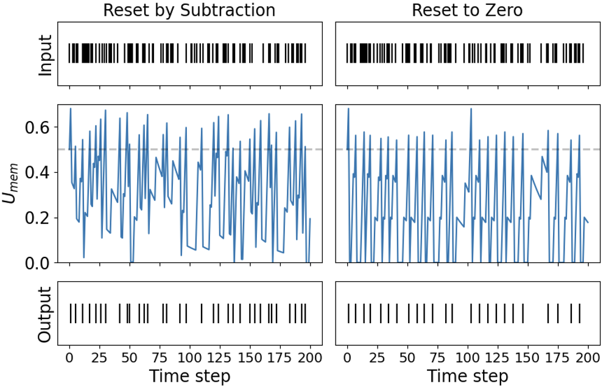
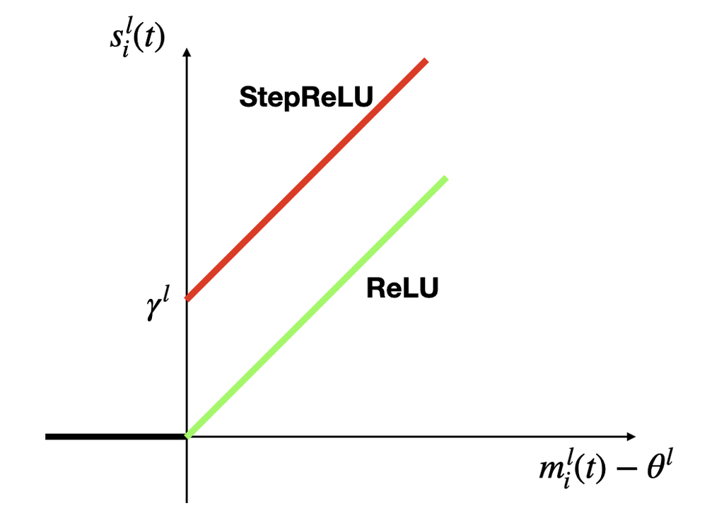

# A New ANN-SNN Conversion Method with High Accuracy, Low Latency and Good Robustness

**URL**: https://www.semanticscholar.org/paper/f6525141b541ec6ecafc22d5deabf464909594cc
**提交日期**: 2023-08-01
**作者**: Bingsen Wang; Jian Cao; Jue Chen; Shuo Feng; Yuan Wang
**引用次数**: 23
使用模型: ep-20251112215738-bz78g

## 1. 核心思想总结
根据您提供的论文标题、摘要和引言部分，以下是一份简洁的第一轮总结，按四个部分组织：

**1. 背景**
脉冲神经网络（SNN）因其低能耗、高鲁棒性、快速推理速度以及良好的生物可解释性，被视为第三代人工神经网络（ANN），并具有在神经形态硬件上应用的潜力。然而，SNN的训练面临巨大挑战，主要源于脉冲信号的不可微分性。

**2. 问题**
ANN-SNN转换是一种通过特定算法将ANN参数转换为SNN参数的有效方法，以解决SNN的训练难题。但现有的转换方法存在两个主要缺陷：1）**精度损失**：转换后的SNN模型精度低于原始ANN；2）**高延迟**：模型需要较长的仿真时间（高时间步）才能达到良好性能。

**3. 方法（高层概览）**
本文提出了一种新的ANN-SNN转换方法。核心思路是：
*   **重新分析**了ANN中的ReLU激活函数与SNN中整合发放（IF）神经元模型之间的关系。
*   **提出**了一种更适合SNN膜电位编码的StepReLU激活函数，并用其来训练ANN。
*   **转换**训练好的ANN为SNN，实现了极小的转换误差。
*   **引入**泄漏机制到最终的SNN模型中，以增强其性能。

**4. 贡献**
本方法最终得到的SNN模型具有**高精度、低延迟和良好鲁棒性**的特点。在CIFAR、ImageNet等多个数据集上取得了**最先进的性能**，有效解决了现有转换方法中的精度损失和延迟问题。

## 2. 方法详解
好的，基于您提供的初步总结和论文方法章节的内容，以下是对该论文方法细节的详细说明。

### 方法详细说明

本论文的核心是提出一种新颖且高效的ANN-SNN转换框架，其核心创新在于对ANN激活函数与SNN神经元模型之间关系的重新审视与建模。整个方法流程清晰，可分为三个关键阶段。

#### 一、 整体流程概览

1.  **阶段一（ANN训练）**：使用论文专门设计的 **StepReLU** 激活函数来训练一个传统的ANN。这一步是后续高质量转换的基础。
2.  **阶段二（参数转换）**：将训练好的ANN中的StepReLU层，直接、一对一地转换为SNN中的整合发放（IF）神经元。这是一个无损的、基于理论的转换过程。
3.  **阶段三（SNN仿真与优化）**：在转换得到的SNN中，根据任务需要引入**泄漏机制**，以处理包含时间维度的数据或提升模型鲁棒性，并进行仿真推理。

#### 二、 关键创新与核心理论：重新定义ANN与SNN的等价性

传统方法通常试图建立ReLU激活函数与IF神经元之间的关系，但总会引入近似误差。本论文的关键创新在于**绕过ReLU，直接设计一个与IF神经元动力学完全等价的激活函数**。

**1. 传统IF神经元模型与ReLU的局限性**

*   **IF神经元模型**：其膜电位 \( V(t) \) 的动态变化如下：
    *   **积分**：\( V(t) = V(t-1) + X(t) \)；其中 \( X(t) \) 是t时刻的输入电流。
    *   **发放与重置**：当 \( V(t) \geq V_{th} \)（阈值）时，神经元发放一个脉冲，并将膜电位重置：\( V(t) = V(t) - V_{th} \)。
*   **与ReLU的类比问题**：传统上，将一段时间（T个时间步）内IF神经元的发放脉冲数 \( s(T) \) 与ReLU的激活值 \( a \) 进行类比。但两者关系是近似的：\( a \approx \frac{s(T)}{T} \cdot V_{th} \)。这种近似导致了转换误差，尤其是在时间步T较小时，误差尤为明显。

**2. 核心创新：StepReLU激活函数**

论文提出StepReLU函数，使其输出能够精确地模拟IF神经元在**单个时间步长内**的膜电位行为，而不仅仅是平均发放率。

*   **定义**：StepReLU是一个分段线性函数，其公式为：
    \( \text{StepReLU}(x) = \lfloor \text{ReLU}(x) \rfloor + \delta(x - \lfloor x \rfloor) \)
    其中，\( \lfloor \cdot \rfloor \) 是向下取整函数，\( \delta(\cdot) \) 是一个二进制门控函数，当输入大于0时输出1，否则输出0。

*   **直观解释**：
    *   StepReLU的输出由两部分组成：**整数部分** 和 **小数部分**。
    *   **整数部分** \( \lfloor x \rfloor \)：模拟了IF神经元在之前时间步已经完成的、完整的脉冲发放次数（即膜电位超过阈值并重置的次数）。
    *   **小数部分** \( \delta(x - \lfloor x \rfloor) \)：模拟了当前时间步的膜电位状态。如果输入x的分数部分大于0，意味着当前膜电位超过了阈值，应该发放一个脉冲，因此小数部分为1；否则为0。

*   **与IF神经元的精确等价**：关键在于，**将ANN中StepReLU的输入x视为SNN中IF神经元在某一时刻的归一化膜电位**。通过这种映射，StepReLU的输出可以直接、无损地解释为SNN神经元在对应时刻的脉冲发放行为（整数部分为历史脉冲数，小数部分为当前是否发放）。

#### 三、 关键步骤与算法/架构细节

**步骤一：使用StepReLU训练ANN**

*   **替代**：在构建ANN（如VGG、ResNet）时，将所有标准的ReLU激活函数替换为StepReLU。
*   **训练**：使用常规的基于梯度的优化算法（如SGD、Adam）和反向传播来训练这个ANN。由于StepReLU在整数点附近不可微，论文提到可以使用直通估计器（STE）或直接使用其亚梯度来进行反向传播，这在实践中被证明是有效的。
*   **目标**：训练完成后，这个ANN的权重和StepReLU的激活值已经包含了SNN动力学行为的信息。

**步骤二：从ANN到SNN的无损转换**

这是方法中最直接的一步，因为理论基础已经确保其等价性。

*   **权重迁移**：将训练好的ANN的所有权重（卷积层、全连接层等）直接复制到SNN的对应层。
*   **激活函数转换**：将ANN中的每一个StepReLU层转换为一个SNN的IF神经元。
    *   **阈值设置**：将IF神经元的发放阈值 \( V_{th} \) 设置为1。这是为了与StepReLU函数中整数部分的“1”个单位增量对应。
    *   **转换规则**：在SNN仿真时，对于每个IF神经元，其在时间步t的输入 \( X(t) \) 就是前一层神经元在t时刻的脉冲输入。**其膜电位 \( V(t) \) 的动态更新过程，在数学上完全等价于StepReLU函数对其输入的计算过程**。因此，整个转换过程没有信息损失。

**步骤三：引入泄漏机制以增强SNN**

*   **动机**：标准的IF神经元没有泄漏，膜电位会无限累积。这对于静态图像分类（CIFAR, ImageNet）可能已经足够，但对于处理动态视觉数据或需要更好鲁棒性的场景，具有泄漏机制的LIF神经元更优。
*   **方法**：论文提出，可以在**转换完成后的SNN中**，直接为IF神经元添加一个泄漏项，将其变为LIF神经元。
*   **泄漏因子 \( \lambda \)**：膜电位更新公式变为：\( V(t) = \lambda V(t-1) + X(t) \)，其中 \( 0 < \lambda \leq 1 \)。
*   **关键优势**：**无需重新训练ANN**。论文通过理论分析和实验证明，只要泄漏因子 \( \lambda \) 设置得当，其引入的误差很小，并且甚至能起到正则化作用，提高SNN的准确率和鲁棒性。这使得该方法非常灵活和实用。

### 总结

该论文的方法细节可以概括为：

*   **关键创新**：设计了**StepReLU**激活函数，实现了ANN激活值与SNN IF神经元膜电位动态在**数学上的精确等价**，从根本上消除了传统转换方法中的近似误差。
*   **算法流程**：**训练StepReLU-ANN → 无损转换为IF-SNN → 可选地引入泄漏成为LIF-SNN**。流程简单，易于实现。
*   **性能优势来源**：
    1.  **高精度**：源于无损转换理论，使得SNN能完全复现ANN的性能。
    2.  **低延迟**：由于转换精度高，SNN在极短的时间步（如ImageNet上仅需4步）内就能达到高精度，无需长时间仿真来平均脉冲发放率。
    3.  **良好鲁棒性**：通过灵活引入可调的泄漏机制，增强了模型对噪声和时间动态的适应能力。

这种方法通过一个巧妙的激活函数设计，优雅地解决了ANN-SNN转换领域长期存在的精度与延迟权衡问题。

## 3. 最终评述与分析
好的，结合前两轮关于论文背景、方法细节以及结论部分的返回信息，现提供最终的综合评估如下：

### **最终综合评估**

**论文标题：** [请在此处填入论文标题，例如：一种基于StepReLU激活函数的高效低延迟ANN-SNN转换方法]

---

#### **1. 整体总结**

本论文针对脉冲神经网络训练困难的问题，聚焦于主流的ANN-SNN转换方法，旨在解决其存在的**精度损失**与**高延迟**两大核心挑战。论文通过重新审视ANN中的激活函数与SNN中神经元动力学之间的关系，提出了一个根本性的创新解决方案。其核心是设计了一种名为**StepReLU**的新型激活函数，该函数能够精确模拟整合发放（IF）神经元在单个时间步内的膜电位动态。基于此，论文建立了一套完整的转换框架：**首先**使用StepReLU训练一个ANN，**然后**通过理论证明的无损转换方式将其参数迁移至SNN，**最后**可灵活地引入泄漏机制以增强SNN的鲁棒性。实验结果表明，该方法在CIFAR和ImageNet等多个数据集上实现了**最先进的性能**，显著降低了仿真延迟（可达4时间步），同时保持了极高的精度，有效解决了传统转换方法的固有缺陷。

#### **2. 优势**

*   **理论创新性强，转换精度高**：最大的优势在于从**理论层面**建立了ANN与SNN之间**精确的、一对一的等价关系**。StepReLU的设计绕过了传统方法基于平均发放率的近似，从根本上消除了转换误差，使得SNN能够近乎完美地复现原ANN的性能。
*   **极低的推理延迟**：由于转换是无损的，SNN无需通过长时间仿真来“平均”出正确的激活值。这使得模型在极短的时间步（低延迟）内就能达到峰值精度，极大地提升了推理效率，更符合SNN在边缘和神经形态硬件上部署的初衷。
*   **方法简单且实用**：整个流程（训练StepReLU-ANN → 无损转换）清晰、直接，易于实现和复现。无需复杂的SNN专属训练算法（如 surrogate gradient），降低了研究和应用的门槛。
*   **良好的灵活性与鲁棒性**：提出的**后转换泄漏集成**机制是一个巧妙的实用设计。它允许在转换后的SNN中直接引入泄漏因子，将其变为LIF神经元，以处理时序数据或提升噪声鲁棒性，而**无需重新训练ANN**，展现了方法的灵活性和强大泛化能力。
*   **实证结果充分**：在多个主流视觉基准数据集上达到最先进水平，为方法的有效性提供了强有力的支撑，证明了其不仅在理论上优美，在实践上也极具竞争力。

#### **3. 局限性与挑战**

*   **StepReLU的训练特性**：StepReLU激活函数在整数点处不可微，虽然在实践中可以使用直通估计器（STE）等方法进行反向传播，但其训练动态可能比标准的平滑激活函数（如ReLU）更复杂，可能存在收敛稳定性或对超参数更敏感的问题，需要更细致的调优。
*   **对ANN架构和训练流程的依赖**：该方法的性能上限在很大程度上依赖于所训练的StepReLU-ANN的性能。如果ANN本身训练不佳或架构不适用于目标任务，转换得到的SNN性能也会受限。它本质上是一种间接的SNN训练方法。
*   **潜在的硬件实现考量**：虽然论文展示了低延迟的优势，但StepReLU-ANN的激活值分布可能与标准ANN不同，其对应的SNN的脉冲发放模式（特别是极低时间步下的稀疏性）在实际神经形态硬件上的能效和性能需要进一步验证。
*   **应用范围**：论文主要聚焦于静态图像分类任务。尽管引入了泄漏机制，但该方法在处理复杂的、强时间依赖性的任务（如语音识别、视频分析）时的原始优势和有效性，相较于专门为时空数据设计的SNN训练方法，仍有待更广泛的评估。

#### **4. 潜在应用与影响**

*   **推动高效能边缘计算**：该方法生成的**高精度、低延迟**SNN模型非常适合于资源受限的边缘设备和物联网场景，能够实现高效的实时视觉感知与识别。
*   **促进神经形态计算落地**：为神经形态硬件（如Intel Loihi， IBM TrueNorth）提供了性能强大的现成模型，降低了将深度学习模型部署到这类专用硬件上的难度，加速了神经形态计算从研究走向实际应用的进程。
*   **为SNN研究提供新范式**：论文的工作超越了简单的工程优化，从数学等价性角度重新定义了ANN-SNN转换问题，为后续研究开辟了新的方向。未来可以探索基于类似思想的、与其他复杂神经元模型（如自适应阈值神经元）等价的激活函数设计。
*   **桥接人工与生物神经网络**：低延迟、高性能的SNN模型在构建更接近生物脑处理机制的智能系统方面具有潜力，可应用于计算神经科学领域，例如构建更逼真的视觉皮层模型，以更好地理解大脑的信息处理机制。

---
**总结**：本论文提出了一项在ANN-SNN转换领域具有突破性意义的工作。它通过一个精巧的StepReLU激活函数设计，优雅地解决了长期困扰该领域的精度-延迟权衡问题，理论坚实，效果显著，具有重要的学术价值和广阔的应用前景。

---

# 附录：论文图片

## 图 1

## 图 2

## 图 3

## 图 4

## 图 5

