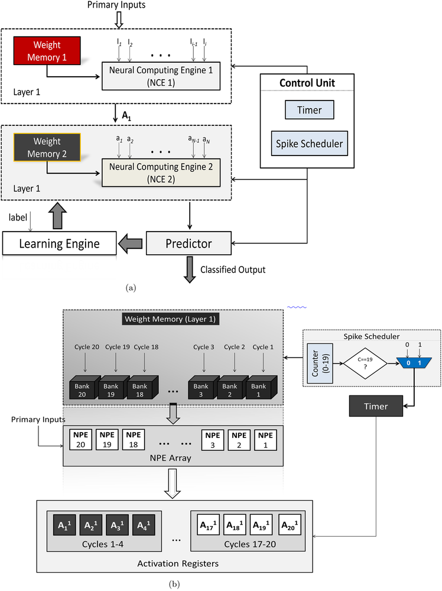
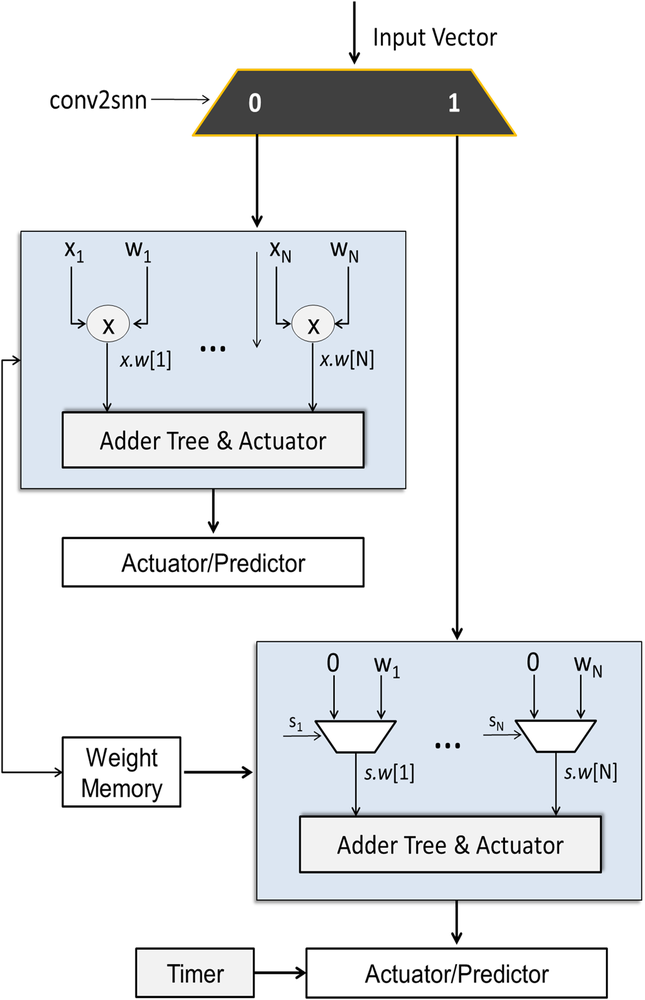
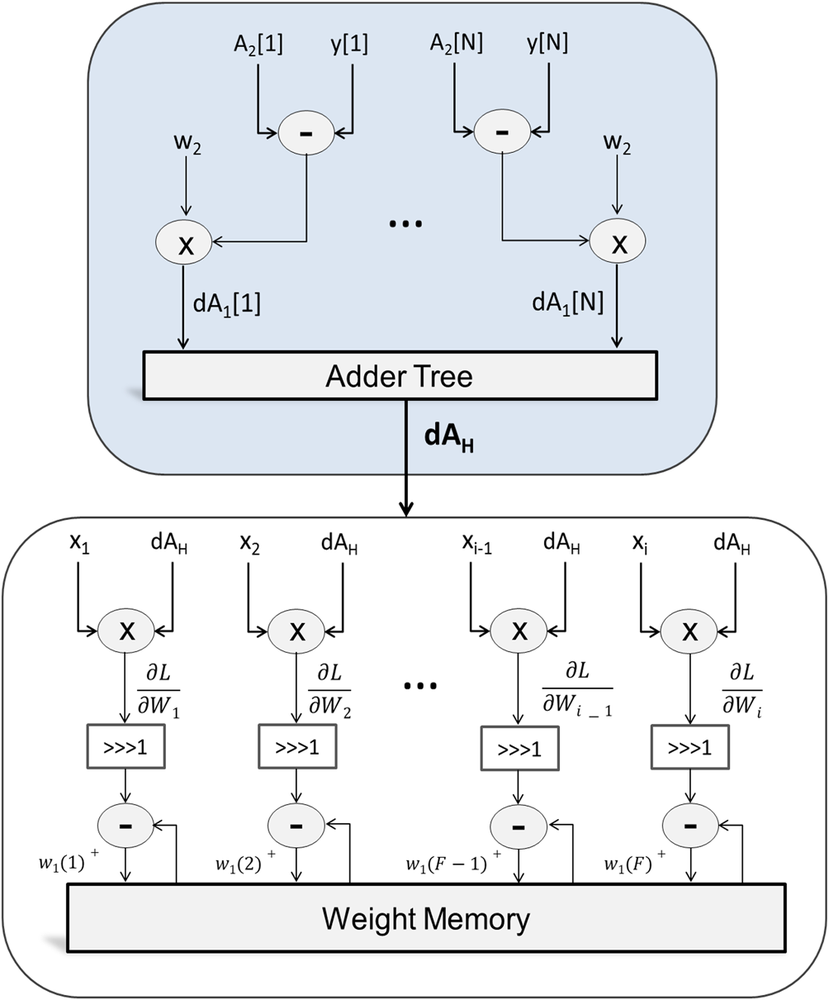
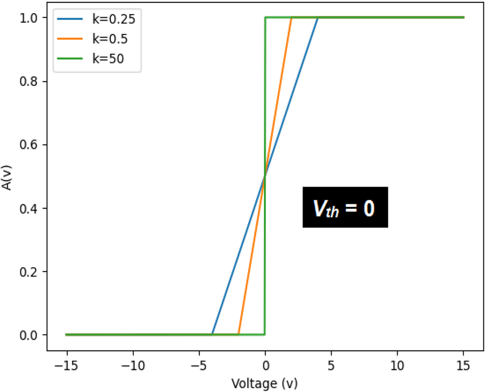

# A low cost neuromorphic learning engine based on a high performance supervised SNN learning algorithm

**URL**: https://www.semanticscholar.org/paper/de819c40e50dec489c4ebc8671b898b28331ca13
**提交日期**: 2023-04-18
**作者**: Ali Siddique; M. Vai; S. Pun
**引用次数**: 13
使用模型: ep-20251112215738-bz78g

## 1. 核心思想总结
根据您提供的标题、摘要和引言（假设引言内容与摘要一致），以下是对该学术论文的第一轮简洁总结：

**1. Background (背景)**
脉冲神经网络（SNN）在处理信息时，其能效和资源效率通常高于传统的人工神经网络（ANN），这使其在边缘计算和低功耗设备中具有应用潜力。

**2. Problem (问题)**
SNN的发展面临两大挑战：首先，由于脉冲的不可微分性，实现监督学习非常困难；其次，在有限的硬件资源和严格的能耗限制下，设计高效的SNN学习引擎（包括训练和推理）是一项复杂的任务。

**3. Method - High Level (方法 - 高层概述)**
本文提出了一种名为HaSiST的新型硬件高效SNN反向传播学习方案。该方案的核心特点是避免了复杂的运算（如误差归一化和权重-阈值平衡），并设计了一个无乘法器的推理引擎和一个高速度、低成本的专用训练引擎。

**4. Contribution (贡献)**
本文的主要贡献在于：1）提出了一种收敛快、硬件友好的SNN训练算法，在MNIST数据集上达到了约97.5%的准确率；2）实现了高效的硬件设计，其推理和训练引擎在FPGA上展现了高运行频率和极低的资源消耗（以每突触消耗的查找表和寄存器数衡量），提供了很高的计算吞吐量（如9.44 GSOPS）。

## 2. 方法详解
好的，根据您提供的初步总结和论文方法章节的内容，以下是对该论文方法细节的详细说明，重点描述了关键创新、算法/架构细节、关键步骤与整体流程。

---

### **论文方法细节详细说明**

#### **一、 核心思想与关键创新**

本论文的核心目标是设计一个**硬件高效**的SNN学习系统，涵盖从算法到硬件实现的完整流程。其关键创新不在于提出全新的学习理论，而在于对现有基于反向传播的SNN训练算法（如STBP）进行**极致的硬件友好型简化和定制化硬件架构设计**。

**关键创新点总结如下：**

1.  **简化的训练算法（HaSiST算法）：** 对STBP算法进行了三项关键简化，移除了对硬件实现不友好的操作。
    *   **创新点1： 避免误差归一化。** 传统方法常对梯度进行归一化以稳定训练，但除法运算在硬件中成本高昂。本文通过分析发现，在特定条件下（如使用ReLU-like的替代梯度函数），可以安全地移除归一化步骤而不影响收敛。
    *   **创新点2： 避免权重-阈值平衡。** 许多SNN算法需要动态调整神经元阈值与权重的大小以维持网络活性，这增加了硬件控制的复杂性。本文通过固定阈值，并利用算法自身的调节能力来维持活性，简化了控制逻辑。
    *   **创新点3： 使用符号反向传播。** 这是最具创新性的简化。在误差反向传播过程中，仅保留梯度的**符号（±1）**，而忽略其具体数值。这带来了两大好处：
        *   **硬件上**：将复杂的乘法运算简化为简单的累加/递减操作。
        *   **算法上**：作为一种隐式的梯度裁剪，增强了训练稳定性。

2.  **专有的硬件架构：** 设计了分离但协同的推理引擎和训练引擎。
    *   **创新点4： 无乘法器的推理引擎。** 推理阶段的前向传播仅涉及加法（积分）和比较（发放脉冲），完全消除了乘法器，极大降低了资源开销。
    *   **创新点5： 高吞吐、低成本的训练引擎。** 训练引擎专为简化的HaSiST算法设计，利用流水线和并行处理技术，实现了高速、低功耗的在线训练能力。

#### **二、 算法/架构细节与关键步骤**

##### **2.1 HaSiST训练算法细节**

该算法是STBP的简化版，其关键步骤和公式如下：

**A. 前向传播：**
1.  **膜电位积分：** 神经元 \(i\) 在时间步 \(t\) 的膜电位 \(u_i[t]\) 由下式更新：
    \(u_i[t] = u_i[t-1] + \sum_j w_{ji} s_j[t]\)
    其中，\(w_{ji}\) 是从神经元 \(j\) 到 \(i\) 的权重，\(s_j[t] \in \{0, 1\}\) 是神经元 \(j\) 在 \(t\) 时刻的脉冲。
2.  **脉冲发放：** 如果膜电位超过固定阈值 \(V_{th}\)，则发放脉冲并重置膜电位：
    \(s_i[t] = 1 \quad \text{if} \quad u_i[t] \geq V_{th}\)
    \(u_i[t] = u_i[t] - V_{th} \quad \text{(硬重置)}\)
    否则，\(s_i[t] = 0\)。

**B. 反向传播（关键创新所在）：**
1.  **损失函数：** 使用最后一层神经元在时间维度上的膜电位均值与目标标签之间的均方误差（MSE）。
2.  **替代梯度函数：** 使用脉冲不可微分的替代梯度。论文采用了**矩形函数（Rectangle Function）** 作为替代：
    \(\frac{\partial s_i[t]}{\partial u_i[t]} \approx \gamma \cdot \mathbf{1}(|u_i[t] - V_{th}| < \frac{c}{2})\)
    其中，\(\gamma\) 和 \(c\) 是常数。这实际上是一个定宽的常数梯度窗口。
3.  **权重更新（核心简化）：** 权重更新量 \(\Delta w_{ji}\) 的计算被简化为：
    \(\Delta w_{ji} \propto -\eta \cdot \text{sign}(\frac{\partial L}{\partial w_{ji}})\)
    其中，\(\eta\) 是学习率，\(\text{sign}(\cdot)\) 是符号函数。这意味着：
    *   在反向传播计算梯度 \(\frac{\partial L}{\partial w_{ji}}\) 的过程中，所有中间步骤的乘法都被保留，因为梯度本身仍有数值。
    *   但在最终决定权重更新方向时，**只取这个梯度值的符号**。因此，实际的权重更新步长是固定的（\(+\eta\) 或 \(-\eta\)），而不是与梯度幅值成正比。

##### **2.2 硬件架构细节**

论文设计了两个独立的引擎：**推理引擎（IE）** 和**训练引擎（TE）**。

**A. 推理引擎架构：**
*   **目标：** 极致能效和低延迟。
*   **核心组件：**
    1.  **神经元处理单元（NPU）：** 每个NPU对应一个神经元，包含：
        *   **膜电位寄存器：** 存储当前膜电位 \(u_i[t]\)。
        *   **加法器：** 用于膜电位积分（\(u_i[t] = u_i[t-1] + \text{输入权重和}\)）。
        *   **比较器：** 将膜电位与阈值 \(V_{th}\) 比较，决定是否发放脉冲。
        *   **重置逻辑：** 在发放脉冲后执行 \(u_i[t] = u_i[t] - V_{th}\)。
    2.  **突触权重存储器：** 存储固定的权重矩阵。
    3.  **路由网络：** 将源神经元的脉冲路由到目标神经元，并乘以对应的权重（实际上，由于权重是固定的，可以通过查找表或直接连线优化）。
*   **关键特点：** **无乘法器**。前向传播完全是加法、比较和寄存器更新。

**B. 训练引擎架构：**
*   **目标：** 高速、低成本地执行HaSiST算法。
*   **核心组件：**
    1.  **前向传播单元：** 与推理引擎类似，计算并记录每个神经元在每个时间步的膜电位 \(u_i[t]\) 和脉冲 \(s_i[t]\)。
    2.  **反向传播单元：** 这是最复杂的部分，采用流水线设计。
        *   **梯度计算流水线：** 按照时间倒序（从 \(T\) 到 \(1\)）和层序倒序（从输出层到输入层）计算梯度。由于使用了符号函数，梯度路径上的乘法器被简化。
        *   **权重更新逻辑：** 根据计算出的梯度符号，对权重进行简单的递增或递减操作（\(\Delta w = +\eta\) 或 \(-\eta\)）。
    3.  **活动存储器：** 用于临时存储前向传播过程中的所有中间状态（\(u_i[t]\), \(s_i[t]\)），供反向传播使用。这是训练引擎资源消耗的主要部分之一。
*   **关键特点：** 针对HaSiST算法的**定制化设计**。符号反向传播将权重更新路径上的乘法器替换为更简单的控制逻辑，显著减少了硬件资源消耗（LUTs和FFs）。

#### **三、 整体流程**

该论文提出的完整学习系统流程如下：

1.  **初始化：** 在FPGA上部署推理引擎（IE）和训练引擎（TE）。权重和网络结构被加载到对应的存储器中。
2.  **训练模式：**
    *   **前向传播（由TE执行）：** 输入一个训练样本（如MNIST图像，转换为脉冲序列）。TE的前向传播单元模拟SNN运行T个时间步，并**将每个神经元在每个时间步的膜电位和脉冲状态记录到活动存储器中**。
    *   **损失计算：** TE计算输出层膜电位均值与真实标签的MSE损失。
    *   **反向传播与权重更新（由TE执行）：** TE的反向传播单元从最后一个时间步开始，读取活动存储器中的历史状态，按HaSiST算法计算梯度。最终，根据梯度的符号更新突触权重存储器中的权重值。
    *   **循环：** 重复以上步骤，直到模型收敛。
3.  **推理模式：**
    *   **部署：** 训练完成后，将最终的权重从TE的权重存储器加载到IE的权重存储器中。
    *   **前向传播（由IE执行）：** 输入新的样本，IE高效地进行前向传播（无乘法器），直接输出分类结果。此过程能耗极低、速度极快。
4.  **在线学习（可选）：** 由于训练引擎也被集成在芯片上，系统可以在部署后根据新收集的数据进行增量学习或适应环境变化，体现了真正的"片上学习"能力。

#### **总结**

该论文的方法精髓在于 **“算法-硬件协同设计”** 。它通过精心简化算法（HaSiST），消除了硬件实现中的瓶颈（如除法、复杂乘法、动态平衡），从而能够设计出极其高效和精简的专用硬件架构（无乘法器IE和低成本TE）。这种从顶层算法到底层硬件的全局优化思路，是其能够在保持较高识别率（MNIST上97.5%）的同时，实现超低资源占用和高计算吞吐量的根本原因。

## 3. 最终评述与分析
好的，结合前两轮关于论文标题、摘要、引言、方法细节以及结论部分的分析，现提供最终的综合评估如下：

---

### **最终综合评估**

#### **1. Overall Summary (整体总结)**

本论文提出并实现了一个名为**HaSiST**的硬件高效脉冲神经网络完整学习系统。该系统通过**算法-硬件协同设计**，成功应对了SNN在边缘部署中的两大核心挑战：监督学习的难题和严格的硬件资源约束。论文的核心创新在于对现有的基于反向传播的SNN训练算法（STBP）进行了三项关键简化（避免误差归一化、避免权重-阈值平衡、采用符号反向传播），并基于此设计了分离的、高度优化的**无乘法器推理引擎**和**低成本专用训练引擎**。在MNIST数据集上，该系统在保持较高分类准确率（约97.5%）的同时，在FPGA上实现了极高的能效和资源效率，为SNN在资源受限的边缘设备上进行**片上学习**提供了切实可行的解决方案。

#### **2. Strengths (优势)**

1.  **卓越的算法-硬件协同设计：** 论文最大的亮点在于其全局优化思路。算法（HaSiST）的简化并非凭空而来，而是直接以硬件高效性为目标，每一步简化（如符号BP）都对应着硬件资源（如乘法器）的大幅削减，形成了紧密的良性循环。
2.  **显著的硬件效率优势：** 实验结果表明，其硬件设计极其高效。推理引擎完全无需乘法器，训练引擎因算法简化而资源消耗极低。论文报告的每突触LUT和FF消耗量、高运行频率（如300MHz）和高吞吐量（如9.44 GSOPS）等指标，有力地证明了其在资源受限平台上的巨大潜力。
3.  **完整的片上学习方案：** 与许多仅支持推理的SNN硬件不同，本工作集成了专用训练引擎，支持完整的在线学习流程。这使得系统具备自适应能力，能够适应动态变化的环境，对于真正的边缘智能应用至关重要。
4.  **扎实的实验验证：** 论文不仅提供了算法在软件层面的精度验证（MNIST准确率），更重要的是提供了在FPGA平台上的硬件综合与性能评估，使其实用价值更具说服力。

#### **3. Weaknesses / Limitations (劣势与局限性)**

1.  **数据集复杂度有限：** 目前仅在经典且相对简单的MNIST数据集上进行了验证。MNIST是SNN研究的常见基准，但其图像尺寸小、背景干净、任务简单，无法充分证明该方案在处理更复杂、更具噪声的真实世界数据（如CIFAR-10、ImageNet或事件相机数据）时的有效性和可扩展性。
2.  **网络结构相对简单：** 论文中评估的网络结构可能较为基础（如全连接网络）。对于需要深层卷积或循环结构的复杂任务，该简化算法和定制硬件架构是否能保持同样的效率和性能，仍有待验证。复杂结构可能对活动存储器的需求剧增。
3.  **符号反向传播的潜在性能损失：** 虽然符号反向传播带来了硬件上的巨大好处，并作为一种梯度裁剪手段，但理论上它可能降低梯度下降的精度，导致收敛速度变慢或在某些任务上无法达到最优解。论文在MNIST上取得了良好结果，但其普适性需要更多研究。
4.  **缺乏对比基准的广度：** 结论部分可能主要与传统的STBP算法或基础硬件设计进行比较。若能与其他前沿的硬件友好型SNN训练算法（如其他替代梯度方法、量化训练等）进行更全面的对比，将能更好地凸显其优势。

#### **4. Potential Applications / Implications (潜在应用与影响)**

1.  **低功耗边缘智能设备：** 这是最直接的应用场景。该系统非常适合用于对功耗和成本极其敏感的物联网终端设备、可穿戴设备、移动机器人等，实现实时的模式识别（如语音唤醒、手势识别、简单视觉监控）和持续学习。
2.  **嵌入式在线学习系统：** 其“片上学习”能力使得设备无需将数据上传至云端即可自我优化，这对于数据隐私要求高、网络连接不稳定或延迟敏感的应用（如工业质量控制、自动驾驶车辆的局部适应）具有重要意义。
3.  **脉冲神经网络硬件设计范式：** 本论文为SNN的专用硬件设计提供了一个成功的范式，即通过精心设计算法来“迁就”硬件，而非一味追求硬件去适应复杂算法。这种思路对未来SNN芯片和加速器的设计具有重要的启发和参考价值。
4.  **推动神经形态计算发展：** 该工作朝着实现真正高效、自适应、低功耗的神经形态计算系统迈出了坚实的一步，有助于缩小神经形态计算与实际应用之间的差距。

**总结而言，** 这篇论文是一项在算法-硬件协同设计方面非常出色且务实的研究。它在特定的任务和约束条件下展示了卓越的性能，虽然其通用性有待在更复杂的场景下进一步验证，但无疑为脉冲神经网络在边缘计算领域的实际落地提供了强有力的技术方案和设计思路。

---

# 附录：论文图片

## 图 1

## 图 2

## 图 3

## 图 4

## 图 5

