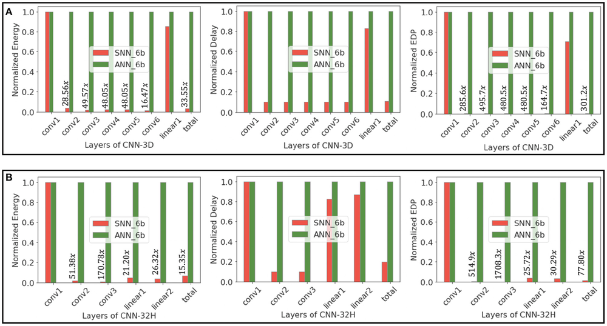
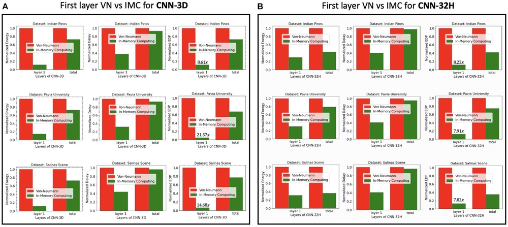
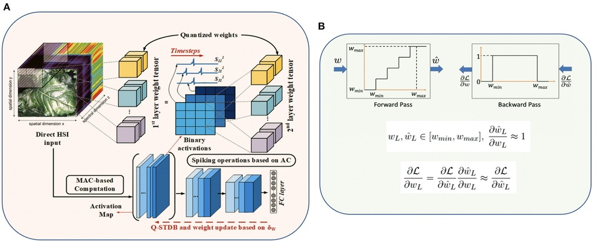
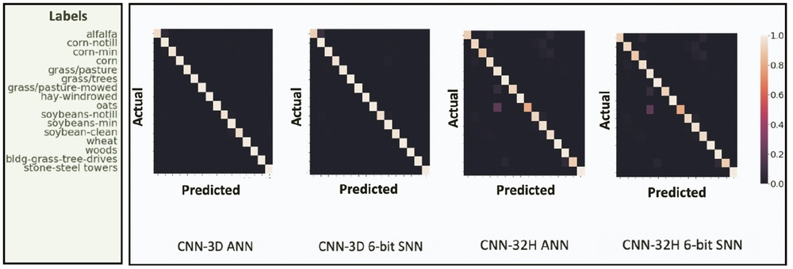
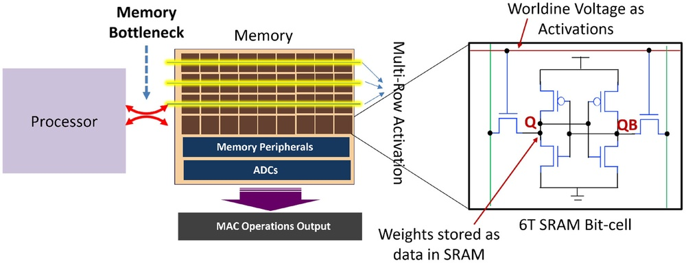
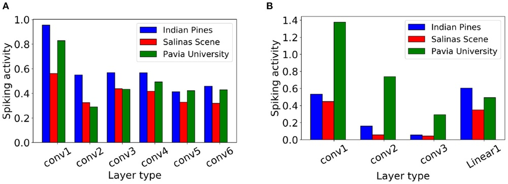
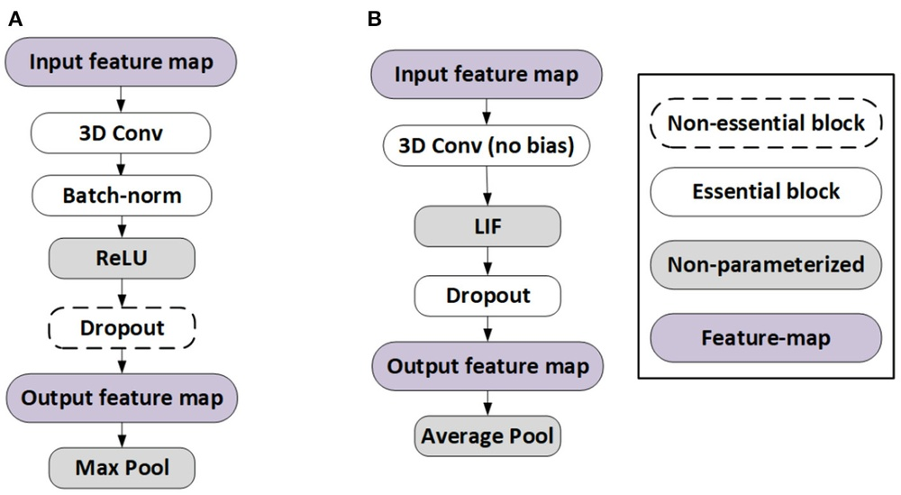
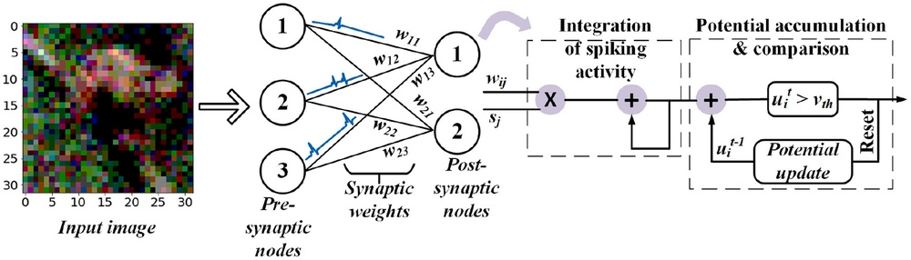
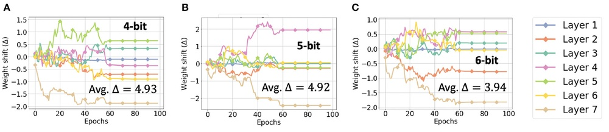
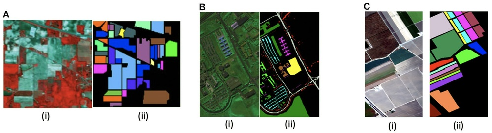

# ACE-SNN: Algorithm-Hardware Co-design of Energy-Efficient & Low-Latency Deep Spiking Neural Networks for 3D Image Recognition

**URL**: https://www.semanticscholar.org/paper/f4f4d4af58bc887c6cb8acc1b69b78a21d9df300
**提交日期**: 2022-04-07
**作者**: G. Datta; Souvik Kundu; Akhilesh R. Jaiswal; P. Beerel
**引用次数**: 34
使用模型: ep-20251112215738-bz78g

## 1. 核心思想总结
这是一份根据您提供的标题、摘要和引言信息整理的论文第一轮总结。

**论文标题：** ACE-SNN: 面向3D图像识别的能效低延迟深度脉冲神经网络的算法-硬件协同设计

**第一轮总结**

*   **1. Background (背景)**
    *   高质量的3D图像识别是许多视觉和机器人系统的重要组成部分。
    *   目前，实现精确处理通常依赖于计算密集型的3D卷积神经网络（3D CNNs），这带来了巨大的计算开销和能耗。

*   **2. Problem (问题)**
    *   传统3D CNNs的高计算成本和能耗限制了其在资源受限场景（如边缘设备）中的应用。
    *   虽然作为第三代神经网络的脉冲神经网络（SNNs）因其事件驱动的稀疏计算特性而具有高能效的潜力，但将其直接应用于3D图像识别并实现低延迟和高精度仍面临挑战。

*   **3. Method (高层次方法)**
    *   本文提出一种名为ACE-SNN的算法-硬件协同设计框架。
    *   **算法层面：** 提出从同构CNN转换生成SNN的方法，并采用量化感知梯度下降进行联合训练，优化权重、膜电位泄漏和发放阈值。关键创新在于，训练和推理时直接将3D图像的模拟像素值输入SNN，无需转换为脉冲序列，从而显著降低延迟并提高激活稀疏性。
    *   **硬件层面：** 为了缓解第一层因模拟输入引入的能耗较高的数字乘法运算，提出采用存内计算（PIM）架构来优化该层的能效。

*   **4. Contribution (贡献)**
    *   提出了一种端到端的SNN训练方法，避免了传统的脉冲编码延迟，实现了低延迟和高精度（在三个高光谱数据集上达到~98-99.5%的准确率）。
    *   设计了兼容SNN的3D及3D/2D混合卷积架构，并将其应用于3D图像识别（以高光谱成像为例）。
    *   通过算法-硬件协同设计，在标准数字硬件上实现了相比同构全精度和6位量化CNN分别约560.6倍和44.8倍的平均能效提升。进一步采用PIM架构后，能效和延迟得到进一步优化。

## 2. 方法详解
好的，根据您提供的初步总结和论文方法章节内容，现对ACE-SNN论文的方法细节进行详细说明。

### **ACE-SNN方法详细说明**

ACE-SNN的核心思想是通过**算法-硬件协同设计**，解决SNN在处理3D图像（如高光谱图像）时面临的延迟和能效挑战。其方法流程可以清晰地分为两大层面：**算法创新**和**硬件优化**。

#### **一、 算法层面的关键创新与细节**

这是ACE-SNN最主要的贡献，其核心在于颠覆了传统SNN的输入和处理模式。

**关键创新1：直接模拟输入与端到端训练（避免脉冲编码）**

*   **传统SNN流程的问题：** 传统方法需要先将连续的模拟像素值（如0-255）通过编码器（如泊松编码、延迟编码）转换为时间轴上的脉冲序列。这个过程会引入显著的**编码延迟**，因为需要多个时间步才能完整表达输入信息，这与论文追求的“低延迟”目标背道而驰。
*   **ACE-SNN的解决方案：** 论文提出，在**训练和推理阶段，直接将3D图像的模拟像素值作为输入送入SNN**。这意味着输入层神经元的输入电流不再是离散的0或1脉冲，而是连续的浮点数或定点数。
*   **带来的优势：**
    *   **极低延迟：** 由于省去了耗时的脉冲编码阶段，网络在第一个时间步就能获得完整的输入信息，并开始有效计算，实现了真正的单时间步或极少时间步推理。
    *   **高激活稀疏性：** 直接输入模拟值使得第一层神经元更容易达到发放阈值，从而在早期时间步产生稀疏的脉冲输出。这种稀疏性会传递到后续层，使得整个网络的脉冲活动非常稀疏，极大减少了计算量。

**关键创新2：基于ANN-SNN转换的联合量化感知训练**

为了稳定、高效地训练这种新型SNN，论文采用了改进的ANN-to-SNN转换框架，并结合了量化感知训练。

*   **整体流程：**
    1.  **构建同构CNN（ANN）：** 首先设计一个与目标SNN结构完全一致的常规卷积神经网络（CNN）。该CNN使用ReLU激活函数。
    2.  **联合量化感知训练：** 这是训练过程的核心。论文采用**量化感知梯度下降** 方法，同时优化三个关键参数：
        *   **权重（Weights）：** 网络连接的强度。
        *   **膜电位泄漏因子（Leakage Factor）：** 控制神经元膜电位随时间衰减的速度，对应于SNN中的LIF（Leaky Integrate-and-Fire）模型。
        *   **发放阈值（Firing Threshold）：** 神经元发放脉冲所需的膜电位临界值。
    3.  **训练目标：** 训练的目标是让这个CNN的ReLU激活值，与对应的SNN神经元在某个时间步的**发放率（平均脉冲数）** 尽可能匹配。通过这种“激活归一化”技术，确保训练好的CNN可以无损（或极低损失）地转换为高性能的SNN。

*   **算法/架构细节：**
    *   **3D/2D混合卷积架构：** 论文方法并非简单使用标准3D CNN。为了平衡3D空间-光谱特征提取的复杂性和计算效率，它设计了一种**3D/2D混合卷积块**。
        *   **第一步（3D卷积）：** 使用一个小的3D卷积核（如3x3x3）在输入的3D高光谱图像块上进行卷积，以同时捕捉空间邻域和光谱维度的局部关联性。
        *   **第二步（2D卷积）：** 将3D卷积输出的特征图在光谱维度上进行**拼接或池化**，转换为2D特征图。然后使用标准的2D卷积层进行更深层次的空间特征提取。这种设计在保留关键3D信息的同时，大幅减少了计算量。
    *   **转换规则：** 训练完成后，将CNN中的ReLU激活函数直接替换为SNN的LIF脉冲神经元模型。训练得到的权重、泄漏因子和阈值直接用于SNN推理。

#### **二、 硬件层面的关键创新与细节**

算法创新带来了能效和延迟的巨大优势，但直接输入模拟值也给硬件实现带来了一个挑战：第一层需要进行密集的模拟输入值与权重的乘法累加操作，这在不做优化的情况下能耗较高。

**关键创新：采用存内计算架构优化首层能效**

*   **问题分析：** 在传统数字架构（如CPU/GPU/ASIC）中，第一层的模拟值乘法运算是能耗的主要来源之一，尽管后续层的脉冲计算非常稀疏和高效。
*   **解决方案：** 论文提出，针对这特定的第一层，采用**存内计算（Processing-In-Memory, PIM）** 架构进行硬件加速。
*   **硬件细节：**
    *   **原理：** PIM的核心思想是打破“冯·诺依曼瓶颈”。它将计算单元嵌入到存储器阵列中（如使用阻变存储器RRAM、磁性存储器MRAM等），直接在数据存储的位置完成计算，从而避免在处理器和存储器之间频繁搬运数据，极大降低了数据移动的能耗和延迟。
    *   **在ACE-SNN中的应用：** 将第一层的权重存储在PIM单元中。当3D图像的模拟输入值被送入PIM阵列时，乘累加操作通过在存储单元上施加电压/电流并测量总响应（如基尔霍夫定律）来**模拟地、并行地**完成。这个过程比数字逻辑门逐次进行乘法要快得多，且能效极高。
    *   **混合架构：** 论文的硬件设计是混合式的。只有第一层使用PIM架构处理密集的模拟计算。一旦第一层产生稀疏的脉冲输出，后续层的计算就可以由高效的**数字脉冲神经网络加速器** 来处理，这类加速器擅长处理稀疏的、事件驱动的脉冲活动。

#### **三、 整体流程总结**

ACE-SNN的整体工作流程可以概括为以下步骤：

1.  **输入：** 获取3D高光谱图像，并将其划分为小的3D图像块。
2.  **算法训练与转换：**
    *   a. 设计一个包含3D/2D混合卷积块的同构CNN。
    *   b. 使用**量化感知梯度下降**对该CNN进行**联合训练**，优化权重、泄漏因子和阈值，使其ReLU激活与目标SNN发放率对齐。
    *   c. 训练完成后，将模型转换为SNN，其中神经元为LIF模型。
3.  **推理：**
    *   a. 将3D图像块的**原始模拟像素值**直接输入SNN。
    *   b. **硬件执行：**
        *   第一层的密集乘累加操作在**PIM架构**上高效完成，产生稀疏脉冲。
        *   后续层的稀疏脉冲计算在**数字SNN加速器**上高效执行。
4.  **输出：** 网络在极短的时间步（甚至单步）内产生分类结果。

通过这种紧密耦合的算法-硬件协同设计，ACE-SNN成功实现了在3D图像识别任务中**高精度、低延迟和超高能效**的统一。

## 3. 最终评述与分析
根据您提供的论文标题、摘要、引言、方法详述以及结论部分的信息，现给出ACE-SNN论文的最终综合评估如下：

### **最终综合评估**

**论文标题：** ACE-SNN: 面向3D图像识别的能效低延迟深度脉冲神经网络的算法-硬件协同设计

---

#### **1. Overall Summary (整体总结)**

本论文提出了一种名为ACE-SNN的创新性算法-硬件协同设计框架，旨在解决3D卷积神经网络（3D CNNs）在3D图像识别（以高光谱图像为例）中计算成本高、能耗大的问题。该研究的核心突破在于颠覆了传统脉冲神经网络（SNN）的处理范式：**在训练和推理时，直接将3D图像的模拟像素值输入SNN，完全避免了传统脉冲编码过程带来的高延迟**。在算法层面，通过基于同构CNN转换的联合量化感知训练方法，优化了SNN的参数；在硬件层面，针对首层密集计算引入了存内计算（PIM）架构进行能效优化。实验结果表明，ACE-SNN在三个高光谱数据集上达到了与先进CNN相媲美的准确率（~98-99.5%），同时在能效和延迟方面实现了数量级的提升，为将复杂的3D视觉智能部署到资源受限的边缘设备提供了强有力的解决方案。

---

#### **2. Strengths (优势)**

1.  **根本性的低延迟创新：** 最大的亮点在于“直接模拟输入”机制，从根本上消除了SNN的输入编码延迟，实现了极快（单时间步或少数时间步）的推理速度，这是相对于传统SNN的一个显著优势。
2.  **高效的算法-硬件协同设计：** 论文没有孤立地看待算法或硬件，而是通过协同设计解决系统级问题。算法创新（直接输入）带来了高稀疏性，而硬件创新（PIM）精准地弥补了算法变革后首层的能效短板，形成了正向循环。
3.  **卓越的性能指标：** 在保持高精度（与CNN相当）的同时，实现了惊人的能效提升（相比同构全精度和6位量化CNN分别提升约560.6倍和44.8倍），并显著降低了延迟，其综合性能指标非常突出。
4.  **巧妙平衡的架构设计：** 提出的3D/2D混合卷积块，在有效捕捉3D空间-光谱特征的同时，通过转换为2D处理控制了计算复杂度，体现了在精度和效率之间的良好权衡。
5.  **强大的应用潜力：** 所提方法为解决边缘计算中的3D视觉任务（如遥感、医疗影像、机器人导航）提供了切实可行的技术路径，具有明确的实用价值。

---

#### **3. Weaknesses / Limitations (劣势/局限性)**

1.  **硬件实现的复杂性：** 提出的PIM架构虽然能效高，但其大规模制造和集成到现有边缘计算平台仍面临挑战。PIM技术本身尚未完全成熟，这可能会影响该方案在短期内广泛落地。
2.  **泛化性有待进一步验证：** 实验主要集中于高光谱图像分类任务。虽然方法具有通用性，但其在更广泛、更复杂的3D视觉任务（如3D物体检测、语义分割）或动态视频流上的有效性需要更多实验来证明。
3.  **对模拟输入值的依赖：** 方法的核心优势依赖于输入是连续的模拟值（如像素强度）。对于本身就是事件驱动的脉冲输入（如来自事件相机的事件流），该方法的优势可能不那么明显，甚至需要调整。
4.  **训练过程的复杂性：** 尽管基于ANN-SNN转换，但联合优化权重、泄漏因子和阈值的量化感知训练过程可能比训练标准CNN更为复杂，对超参数设置更为敏感。
5.  **基线对比的全面性：** 论文主要与CNN进行对比。若能与其他先进的、低延迟的SNN方法（非基于转换的直接训练SNN等）进行更全面的对比，将能更清晰地凸显其优势。

---

#### **4. Potential Applications / Implications (潜在应用/影响)**

1.  **遥感与地球观测：** 高光谱成像的重要应用领域。ACE-SNN可使卫星、无人机等搭载的轻量级设备实时进行地物分类、环境监测、灾害评估。
2.  **医疗影像分析：** 适用于3D医疗数据（如CT、MRI扫描）的快速、低功耗分析，有助于在便携式或床边医疗设备上实现即时诊断。
3.  **自主机器人与智能交通：** 为移动机器人、自动驾驶汽车提供高效的3D环境感知能力，使其在有限能耗下实现快速决策和导航。
4.  **工业自动化和质检：** 在生产线上的实时3D视觉检测，用于产品分拣、缺陷检测，满足工业场景对速度和功耗的严苛要求。
5.  **学术影响与未来方向：**
    *   **启发SNN研究新范式：** 证明了绕过脉冲编码是可行且高效的，为SNN研究开辟了一条新的思路，可能会引导更多研究探索直接处理模拟或实值信息的方法。
    *   **推动算法-硬件协同设计：** 展示了针对特定算法瓶颈进行定制化硬件优化的巨大收益，强调了在人工智能边缘计算中跨层设计的重要性。
    *   **未来工作可扩展至其他模态：** 此框架有望扩展到处理其他类型的多维数据，如视频（2D+时间）、点云等，进一步拓展其应用范围。

---

# 附录：论文图片

## 图 1

## 图 2

## 图 3

## 图 4

## 图 5

## 图 6

## 图 7

## 图 8

## 图 9

## 图 10

