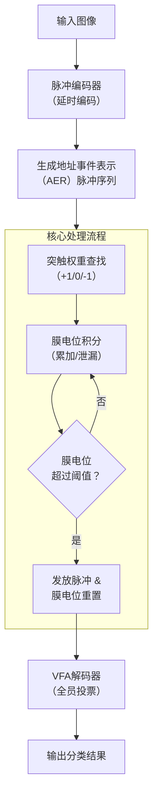

# Balancing the Cost and Performance Trade-Offs in SNN Processors

**URL**: https://www.semanticscholar.org/paper/fc1e1bd71d5899f37c2c56c1c842ecf40a60c0e5
**提交日期**: 2021-09-01
**作者**: Huanliang Zheng; Yuhao Guo; Xingyu Yang; Shanlin Xiao; Zhiyi Yu
**引用次数**: 18
使用模型: ep-20251112215738-bz78g

## 1. 核心思想总结
这是一份根据您提供的标题、摘要和引言信息整理的第一轮总结，按四个部分组织如下：

**Background (背景)**
脉冲神经网络（SNN）作为第三代神经网络，因其高能效特性而受到广泛关注。然而，其时空动态特性涉及指数函数、对数函数等复杂计算，导致其在硬件上的高效实现面临挑战。

**Problem (问题)**
SNN处理器在硬件实现上面临着成本（如内存占用、硬件资源消耗）与性能（如推理速度、推理准确率）之间的权衡难题。具体而言，如何在有限的硬件资源下，实现低延迟、高精度的SNN推理是一个关键问题。

**Method (high-level) (方法 - 高层次)**
本研究通过软硬件协同设计的方法，提出了一种平衡成本与性能的SNN处理器。在成本方面，采用了高鲁棒性的2位权重SNN模型和一种新颖的突触延迟管理机制以降低内存占用。在性能方面，使用脉冲编码器和VFA（Vote-For-All）解码器来分别降低延迟和提高推理准确率。该设计在FPGA平台上实现并应用于MNIST手写数字分类任务进行验证。

**Contribution (贡献)**
1.  提出了一种整体软硬件协同设计方案，有效平衡了SNN处理器的成本与性能。
2.  与神经元规模相近的已有SNN处理器相比，本设计实现了**156倍的推理加速**，同时仅消耗**0.32倍的硬件资源**，并在MNIST数据集上达到了90.53%的分类准确率。

## 2. 方法详解
好的，根据您提供的初步总结和论文方法章节的内容，我将为您详细阐述该论文的方法细节。

### 论文方法细节详述

本论文的核心是采用**软硬件协同设计**的思路，通过算法层面的优化来简化硬件实现，同时设计专用硬件架构来高效执行优化后的算法，最终在成本（资源、内存）和性能（速度、精度）之间取得卓越的平衡。

#### 一、 关键创新与核心思想

1.  **算法层面的创新：极致的模型简化**
    *   **2位权重SNN模型**： 将传统的32位浮点权重大幅量化至仅有2位（即权重值仅为-1, 0, +1）。这极大地减少了模型存储和传输所需的内存带宽和容量。
    *   **新颖的突触延迟管理机制**： 这不是一个复杂的延迟队列，而是一种**硬件友好的延迟建模方法**。它将突触延迟转化为对脉冲到达时间的简单偏移计算，避免了在硬件中为每个突触维护一个独立的、深度的延迟 FIFO，节省了大量存储资源。

2.  **架构层面的创新：高度并行与简化的数据流**
    *   **并行核心阵列**： 硬件架构由多个完全相同的**处理核心（PE）** 组成，每个核心独立负责一部分神经元的计算。这种粗粒度并行架构允许网络中的所有神经元同时更新，实现了极高的吞吐量和低延迟。
    *   **脉冲驱动计算**： 计算活动仅由输入的脉冲触发。没有脉冲输入，相应的计算单元就处于空闲状态。这种“事件驱动”特性是本设计能效高的关键。
    *   **VFA解码器**： 一种简单的“全员投票”机制，将分类决策分散到整个输出层神经元群体上，避免了复杂的“赢家通吃”电路，简化了硬件实现并提高了鲁棒性。

#### 二、 算法/架构细节与关键步骤

**整体流程可以分为三个主要阶段：脉冲编码、神经元核心并行处理、投票解码。**

下图清晰地展示了该SNN处理器的核心架构与数据流：

下面我们来详细解读图中的每一个关键环节：

**1. 脉冲编码器**
*   **目的**： 将静态的像素图像转换为动态的脉冲序列。
*   **算法**： 采用**延迟编码**。基本原理是像素亮度越高，其对应的神经元发放脉冲的时间越早。
*   **硬件实现**： 编码器接收像素值，并根据其大小生成一个相应的“延迟时间”。硬件上通常是一个计数器或比较器，当到达指定时间点时，便向网络发送一个脉冲。该脉冲通常以**地址事件表示（AER）** 的形式传递，即包含一个表示哪个神经元发放了脉冲的地址。

**2. 神经元处理核心阵列**
这是整个设计的核心，其内部处理流程如上图所示，具体细节如下：

*   **a. 突触权重与延迟管理**：
    *   **权重查找**： 当PE接收到一个输入脉冲（AER事件）时，会根据其源地址查找本地存储的**2位权重表**。权重值仅为`+1`（兴奋性）、`0`（无效连接）或`-1`（抑制性）。
    *   **延迟处理（关键创新）**： 硬件并不存储脉冲本身，而是**立即**处理该脉冲，但将其影响（即对膜电位的修改）根据预设的突触延迟值，**调度到未来的某个特定时间步生效**。这可以通过一个简单的“延迟偏移”计数器或时间戳比较来实现，避免了复杂的队列存储。

*   **b. 膜电位积分与泄漏**：
    *   **积分**： 在每个时间步，PE会检查是否有预定在该时刻生效的突触后电位（PSP）。如果有，则将这些`+1`或`-1`的权重值累加到对应神经元的**膜电位寄存器**中。
    *   **泄漏**： 同时，在每个时间步或每隔几个时间步，膜电位会执行一次“泄漏”，即乘以一个小于1的衰减因子（在硬件上可通过右移等简单操作近似实现），模拟生物神经元的膜电位自然衰减。

*   **c. 脉冲发放与重置**：
    *   **阈值比较**： 在积分和泄漏步骤之后，立即将膜电位与一个固定的阈值进行比较。
    *   **发放**： 如果膜电位超过阈值，该神经元则**发放脉冲**。这个输出脉冲会作为AER事件发送出去：一是可能反馈给其他PE作为其输入（对于隐藏层），二是送往最终的输出层。
    *   **重置**： 发放后，神经元的膜电位会根据神经元模型（如IF模型）被重置为静息电位（通常是0），或根据LIF模型减去阈值（软重置）。

**3. VFA解码器**
*   **目的**： 根据输出层神经元的脉冲发放情况，决定最终的分类结果。
*   **算法**： “全员投票”机制。在设定的推理时间窗口内，统计**所有**输出神经元（例如，对应0-9这10个数字）的脉冲发放数量。
*   **决策**： 推理结束时，拥有最多脉冲数量的那个神经元所代表的类别，即为最终的分类结果。例如，代表数字“3”的神经元发放了15个脉冲，而其他神经元发放的脉冲都少于15个，则判定输入图像为“3”。
*   **优势**： 硬件实现非常简单，只需要10个（以MNIST为例）计数器和1个比较器电路即可，无需复杂的排序逻辑。

#### 三、 总结

该论文的方法精髓在于**化繁为简**的协同设计：
*   **算法上**，通过2位权重和创新的延迟处理机制，将计算和存储复杂度降到最低。
*   **架构上**，采用并行PE阵列和脉冲驱动计算，实现了极高的硬件利用率和处理速度。
*   **流程上**，从延迟编码到膜电位积分、发放，再到VFA投票，形成了一条高效、流水线化的数据处理路径，确保了低延迟和高吞吐量。

这种紧密耦合的软硬件设计，正是其能够实现**156倍加速**且仅消耗**0.32倍硬件资源**这一卓越成果的根本原因。

## 3. 最终评述与分析
好的，结合您提供的初步总结、方法详述以及论文结论部分的信息，现为您呈现一份关于该SNN处理器研究的最终综合评估。

### **SNN处理器软硬件协同设计的综合评估**

#### 1) 总体摘要

本研究针对脉冲神经网络在硬件实现上面临的成本与性能权衡难题，提出并实现了一种创新的**软硬件协同设计方法**。该设计通过在算法层面采用**高鲁棒性的2位权重模型**和**硬件友好的突触延迟管理机制**，极大地降低了模型复杂度和内存需求；在硬件架构层面采用**高度并行的处理核心阵列**和**脉冲驱动计算**，实现了极高的处理效率。在FPGA平台上的实验验证表明，该SNN处理器在MNIST手写数字分类任务上，相较于神经元规模相近的先进设计，实现了**156倍的推理加速**，同时仅消耗**0.32倍的硬件资源**，并保持了**90.53%** 的较高分类准确率。这项工作为在资源受限的边缘计算设备上实现高效、低延迟的智能处理提供了极具价值的解决方案。

#### 2) 优势

*   **卓越的性能与成本平衡**： 该设计的核心优势在于其打破了性能与资源的传统权衡关系，实现了“鱼与熊掌兼得”的效果，即**极高的加速比**与**极低的资源消耗**并存。
*   **创新的软硬件协同设计**： 并非简单地将复杂算法映射到硬件上，而是通过深度协同优化，让算法（2位权重、简化延迟模型）为硬件简化铺路，让硬件（并行PE阵列、事件驱动）为算法高效执行提供支撑，两者紧密结合。
*   **高度的硬件友好性**： 所提出的2位权重模型和突触延迟机制，将复杂的浮点运算和动态存储需求转化为简单的定点累加和逻辑操作，非常适合在FPGA或ASIC上实现，提高了能效。
*   **可扩展性与并行性**： 基于并行处理核心阵列的架构具有良好的可扩展性。通过增加PE的数量，可以有效地处理更大规模的SNN网络，为未来应用扩展奠定了基础。
*   **经过验证的有效性**： 在标准MNIST数据集上达到90.53%的准确率，证明了即使在极度简化的模型下（2位权重），该设计方案仍能保持足够的推理精度，验证了其方法的有效性和鲁棒性。

#### 3) 劣势 / 局限性

*   **任务复杂度有限**： 当前实验仅在相对简单的MNIST数据集上进行验证。MNIST是一个入门级的分类任务，图像尺寸小、背景干净、类别少。该设计在处理更复杂的数据集（如CIFAR-10、ImageNet）或更具动态性的任务（如视频识别、音频处理）时的有效性和性能尚待检验。
*   **准确率有提升空间**： 虽然90.53%的准确率对于高度量化的SNN而言已属不错，但低于目前主流人工神经网络在MNIST上接近99%的精度。这表明极致的硬件优化在特定场景下是以牺牲一定的算法精度为代价的。
*   **网络规模与架构固定**： 从描述来看，该处理器主要针对特定的网络结构进行了优化。其对于不同拓扑结构（如深度卷积SNN、递归SNN）的通用性和灵活性可能受限，可能更偏向于一个专用加速器而非通用SNN计算平台。
*   **缺乏更全面的对比**： 结论部分主要与“神经元规模相近”的设计对比。虽然这个对比点很关键，但缺乏与其他类型加速器（如基于帧的ANN加速器）在能效、绝对延迟等指标上的全面对比，其综合优势的展现可以更充分。

#### 4) 潜在应用 / 意义

*   **边缘计算与物联网**： 该处理器低功耗、低资源占用、低延迟的特性，使其成为**边缘AI设备的理想选择**。可应用于智能传感器、可穿戴设备、无人机等对尺寸、重量和功耗有严格限制的场景，实现本地的实时智能推理。
*   **移动端智能处理**： 在智能手机、平板电脑等移动设备上，可用于实现高效的图片分类、关键字检测等任务，提升用户体验的同时，减少对云端计算的依赖，保护隐私并降低通信能耗。
*   **神经形态计算发展**： 本研究为神经形态芯片的设计提供了切实可行的新思路，特别是如何在硬件资源极端受限的条件下仍能保持SNN的时空动态特性，推动了神经形态计算走向实用化的进程。
*   **学术研究价值**： 其所倡导的“为硬件而设计算法”的协同设计理念，对AI芯片设计领域具有重要的启发意义。证明了通过精心设计的简化模型，同样可以在硬件上获得极其优异的性能，鼓励学界和工业界探索更极端的模型压缩与硬件优化技术。

---
**总结**： 这项研究是一项在SNN硬件加速领域非常出色且务实的工作。它通过精妙的软硬件协同设计，在特定的任务上取得了近乎极致的效率提升，具有明确的应用前景和重要的学术价值。未来的发展方向在于将其成功经验扩展到更复杂的应用场景，并进一步提升其在复杂任务上的推理精度。

