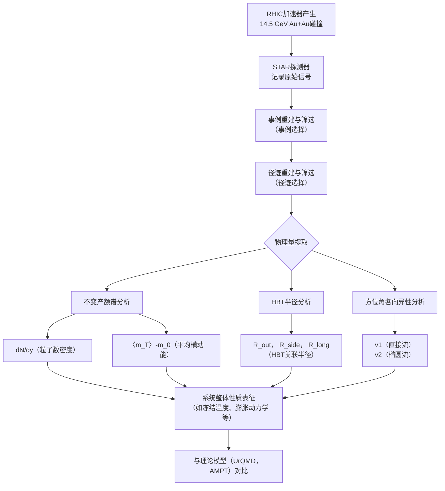

# Bulk properties of the system formed in Au+Au collisions at sNN =14.5 GeV at the BNL STAR detector

**URL**: https://www.semanticscholar.org/paper/e774be31f2d15ef3f27ff9104e1d3bca2529a3bf
**提交日期**: 2019-08-10
**作者**: S. Adam; L. Adamczyk; J. Adams; J. K. Adkins; G. Agakishiev; M. Aggarwal; Z. Ahammed; I. Alekseev; D. Anderson; R. Aoyama; A. Aparin; E. Aschenauer; M. U. Ashraf; F. Atetalla; A. Attri; G. S. Averichev; V. Bairathi; K. Barish; A. Bassill; A. Behera; R. Bellwied; A. Bhasin; A. Bhati; J. Bielcik; J. Bielčíková; L. Bland; I. Bordyuzhin; J. Brandenburg; A. Brandin; J. Bryslawskyj; I. Bunzarov; J. Butterworth; H. Caines; M. S'anchez; D. Cebra; I. Chakaberia; P. Chaloupka; B. Chan; F. Chang; Z. Chang; N. Chankova-Bunzarova; A. Chatterjee; S. Chattopadhyay; J. Chen; X. Chen; J. Cheng; M. Cherney; W. Christie; H. Crawford; M. Csan'ad; S. Das; T. Dedovich; I. Deppner; A. Derevschikov; L. Didenko; C. Dilks; X. Dong; J. Drachenberg; J. Dunlop; T. Edmonds; N. Elsey; J. Engelage; G. Eppley; R. Esha; S. Esumi; O. Evdokimov; J. Ewigleben; O. Eyser; R. Fatemi; S. Fazio; P. Federic; J. Fedorišin; Y. Feng; P. Filip; E. Finch; Y. Fisyak; L. Fulek; C. Gagliardi; T. Galatyuk; F. Geurts; A. Gibson; K. Gopal; D. Grosnick; A. Gupta; W. Guryn; A. Hamad; Ahmed M. Hamed; J. Harris; L. He; S. Heppelmann; N. Herrmann; L. Holub; Y. Hong; S. Horvat; B. Huang; H. Huang; S. Huang; T. Huang; X. Huang; T. Humanic; P. Huo; G. Igo; W. Jacobs; C. Jena; A. Jentsch; J. Y.; J. Jia; K. Jiang; S. Jowzaee; X. Ju; E. Judd; S. Kabana; S. Kagamaster; D. Kalinkin; K. Kang; D. Kapukchyan; K. Kauder; H. Ke; D. Keane; A. Kechechyan; M. Kelsey; Y. Khyzhniak; D. Kikoła; C. Kim; T. Kinghorn; I. Kisel; A. Kisiel; M. Kocan; L. Kochenda; L. Kosarzewski; L. Kramárik; P. Kravtsov; K. Krueger; N. Mudiyanselage; Lokesh Kumar; R. K. Elayavalli; J. Kwasizur; R. Lacey; J. Landgraf; J. Lauret; A. Lebedev; R. Lednický; J. Lee; C. Li; W. Li; X. Li; Y. Li; Y. Liang; R. Licenik; T. Lin; A. Lipiec; M. Lisa; F. Liu; H. Liu; P. Liu; T. Liu; X. Liu; Y. Liu; Z. Liu; T. Ljubičić; W. Llope; M. Lomnitz; R. Longacre; S. Luo; X. Luo; G. Ma; L. Ma; R. Ma; Y. Ma; N. Magdy; R. Majka; D. Mallick; S. Margetis; C. Markert; H. Matis; O. Matonoha; J. Mazer; K. Meehan; J. Mei; N. Minaev; S. Mioduszewski; D. Mishra; B. Mohanty; M. Mondal; I. Mooney; Z. Moravcova; D. Morozov; M. Nasim; K. Nayak; J. Nelson; D. Nemes; M. Nie; G. Nigmatkulov; T. Niida; L. Nogach; T. Nonaka; G. Odyniec; A. Ogawa; S. Oh; V. Okorokov; B. Page; R. Pak; Y. Panebratsev; B. Pawlik; D. Pawłowska; H. Pei; C. Perkins; R. L. Pint'er; J. Pluta; J. Porter; M. Posik; N. Pruthi; M. Przybycien; J. Putschke; A. Quintero; S. Radhakrishnan; S. Ramachandran; R. Ray; R. Reed; H. Ritter; J. Roberts; O. Rogachevskiy; J. Romero; L. Ruan; J. Rusnak; O. Rusňáková; N. Sahoo; P. Sahu; S. Salur; J. Sandweiss; J. Schambach; W. Schmidke; N. Schmitz; B. Schweid; F. Seck; J. Seger; M. Sergeeva; R. Seto; P. Seyboth; N. Shah; E. Shahaliev; P. Shanmuganathan; M. Shao; F. Shen; W. Shen; S. Shi; Q. Shou; E. Sichtermann; S. Siejka; R. Sikora; M. Simko; J. Singh; S. Singha; D. Smirnov; N. Smirnov; W. Solyst; P. Sorensen; H. Spinka; B. Srivastava; T. Stanislaus; M. Stefaniak; D. Stewart; M. Strikhanov; B. Stringfellow; A. Suaide; T. Sugiura; M. Šumbera; B. Summa; X. Sun; Y. Sun; B. Surrow; D. Svirida; P. Szymanski; A. Tang; Z. Tang; A. Taranenko; T. Tarnowsky; J. Thomas; A. Timmins; D. Tlustý; M. Tokarev; C. Tomkiel; S. Trentalange; R. Tribble; P. Tribedy; S. Tripathy; O. Tsai; B. Tu; Z. Tu; T. Ullrich; D. Underwood; I. Upsal; G. Buren; J. Vanek; A. Vasiliev; I. Vassiliev; F. Videbaek; S. Vokál; S. Voloshin; F. Wang; G. Wang; P. Wang; Y. Wang; J. Webb; L. Wen; G. Westfall; H. Wieman; S. Wissink; R. Witt; Y. Wu; Z. Xiao; G. Xie; W. Xie; H. Xu; N. Xu; Q. Xu; Y. Xu; Z. Xu; C. Yang; Q. Yang; S. Yang; Y. Yang; Z. Yang; Z. Ye; L. Yi; K. Yip; H. Zbroszczyk; W. Zha; D. Zhang; L. Zhang; S. Zhang; X. Zhang; Y. Zhang; Z. Zhang; J. Zhao; C. Zhong; C. Zhou; X. Zhu; Z. Zhu; M. Zurek; M. Zyzak
**引用次数**: 23
使用模型: ep-20251112215738-bz78g

## 1. 核心思想总结
根据您提供的标题、摘要和引言片段，以下是该学术论文的第一轮总结：

**标题:** 在BNL STAR探测器上14.5 GeV金核-金核碰撞中形成的系统的整体性质

**简洁总结:**

*   **Background (背景):**
    本研究属于高能核物理领域，旨在通过相对论性重离子对撞机（RHIC）碰撞重原子核（如金核），来产生和研究一种被称为夸克-胶子等离子体（QGP）的高温高密物质状态。理解不同对撞能量下系统的性质对于绘制QGP的相图至关重要。

*   **Problem (问题):**
    在RHIC的能量扫描计划中，√s_NN = 14.5 GeV 是一个关键但此前数据缺失的能量点。填补这一能量空白（介于11.5 GeV和19.6 GeV之间）对于精确研究系统性质（如重子化学势μ_B）随对撞能量的变化规律至关重要。

*   **Method (high-level) (方法-高层概览):**
    实验团队利用RHIC的STAR探测器，记录了在√s_NN = 14.5 GeV能量下发生的金核-金核碰撞事件。他们系统性地测量了碰撞产生的粒子的多种整体观测信号，包括π介子、K介子、质子（及反质子）的横动量谱、不同中心度下的椭圆流（v2）以及直接流（v1）。

*   **Contribution (贡献):**
    1.  **填补关键数据空白：** 首次提供了√s_NN = 14.5 GeV能量下金核-金核碰撞的系统性实验数据，填补了RHIC能量扫描中约100 MeV重子化学势（μ_B）的空白。
    2.  **验证能量依赖趋势：** 结果表明，在14.5 GeV测得的系统行为与此前在其他能量下建立的趋势相符，强化了对QGP性质随能量演化的整体认识。
    3.  **检验理论模型：** 将实验数据与UrQMD和AMPT等理论模型进行对比，发现模型在总体上与数据符合不佳，这为改进理论模型提供了重要的实验约束。

## 2. 方法详解
好的，根据您提供的初步总结和论文方法章节的内容，以下是该论文方法细节的详细说明。

### **论文方法细节详述**

本论文的核心方法是**实验数据分析**，旨在通过分析STAR探测器在√s_NN = 14.5 GeV能级下采集的金核-金核碰撞数据，提取反映系统整体性质的关键物理观测量。其方法流程严谨，环环相扣，下图清晰地展示了从原始数据到物理结果的全过程：

#### **一、 关键创新与核心目标**

本研究的**关键创新**并非提出新算法，而在于**首次在√s_NN = 14.5 GeV这一关键能量点进行系统性测量**，填补了RHIC能量扫描图谱中约100 MeV重子化学势（μ_B）的空白。因此，方法上的重点在于：
*   **数据的精确获取与处理**：确保在这一新能点下数据的可靠性和统计显著性。
*   **多观测量联合分析**：通过多个互补的观测量，从不同维度交叉检验所形成系统的性质。
*   **与理论模型的系统对比**：为模型在重子化学势较高的能区提供关键的实验约束。

#### **二、 实验设置与数据样本**

1.  **对撞条件**：实验在美国布鲁克海文国家实验室的相对论重离子对撞机（RHIC）上进行。入射粒子为**金核**，对撞能量为每核子对**14.5 GeV**。
2.  **探测器**：主要使用**STAR探测器**。方法章节特别强调了其**时间投影室（TPC）** 和**飞行时间探测器（TOF）** 的核心作用。
    *   **TPC**：作为主要跟踪探测器，用于测量带电粒子在磁场中的径迹，从而确定其动量和电荷符号。
    *   **TOF**：通过测量粒子到达探测器的时间，结合径迹长度，计算粒子的速度（β = v/c）。
    *   **粒子识别（PID）**：结合TPC测量的**粒子电离能损（dE/dx）** 和TOF测量的**粒子速度（β）**，可以对π介子、K介子、质子/反质子进行高置信度的区分。这是后续所有分析的基础。

#### **三、 关键步骤与整体流程**

**第一步：事例选择与中心度定义**
*   **事例选择**：从海量碰撞事件中筛选出“好的”金核-金核碰撞事例。通常使用顶点探测器确保对撞顶点位于探测器中心区域，并排除背景干扰。
*   **中心度定义**：这是重离子碰撞实验中的核心概念。通过测量每个碰撞事件中探测到的带电粒子多重数（或零度量能器的能量），将所有碰撞事例按碰撞参数（即核子重叠程度）从大到小排序，划分为不同的中心度等级（如0-5%为最中心碰撞，60-80%为最外围碰撞）。**中心度是将观测物理量与系统几何及平均密度关联起来的关键变量。**

**第二步：单粒子分析 - 不变产额谱与粒子产额**
*   **径迹选择**：在选定的碰撞事例中，进一步筛选来自初级顶点、动量测量准确的带电粒子径迹。
*   **不变产额谱提取**：对于每个中心度等级和每种粒子（π, K, p），将探测到的粒子数按其横动量（p_T）和快度（y）进行分布，并考虑探测器的接受度和重建效率进行修正，得到双微分不变产额谱：`(1/(2πp_T)) * d²N/(dy dp_T)`。
*   **谱拟合与物理量提取**：
    *   对p_T谱进行拟合（例如使用玻尔兹曼分布），并外推至整个p_T范围，得到粒子在特定快度区间内的**总产额（dN/dy）**。
    *   从谱中可以计算**平均横动能（〈m_T〉-m_0）**，它与系统的冻结温度相关。

**第三步：双粒子关联 - 量子统计关联（HBT）**
*   **方法原理**：利用全同玻色子（如π介子）的量子力学波函数对称性，在低相对动量下会产生增强的关联效应。这种关联函数的形状可以反推出粒子在“冻结-out”时刻的时空源尺寸。
*   **关键步骤**：
    1.  构建来自相同事件的π介子对（信号）和混合事件的π介子对（背景）。
    2.  计算关联函数 `C(q) = S(q) / B(q)`，其中q是粒子对的相对动量。
    3.  使用参数化模型（如Gaussian）拟合关联函数，提取三个方向的**HBT半径参数**：
        *   `R_long`：沿束流方向的半径。
        *   `R_out`：沿粒子横动量方向的半径。
        *   `R_side`：垂直于`R_out`和束流方向的半径。
    *   `R_out / R_side` 的比值对探究系统在冻结前的膨胀动力学非常敏感。

**第四步：集体运动分析 - 方位角各向异性流（v1， v2）**
*   **方法原理**：由于碰撞初始几何的非对称性（如原子核不是正对碰撞，而是有一定偏移量），产生的系统在膨胀时会表现出各向异性的集体流。这通过最终状态粒子在方位角（φ）上的分布来表征。
*   **关键步骤 - 事件平面法**：
    1.  **事件平面确定**：对每个碰撞事件，利用所有探测到的粒子计算一个表征系统最大不对称方向的矢量——**事件平面角（Ψ_n）**。例如，椭圆流（v2）的事件平面角Ψ_2通过每个粒子的方位角φ计算得出。
    2.  **流系数提取**：对于某个粒子，其流系数v_n通过测量该粒子的方位角与事件平面角的差值（φ - Ψ_n）的余弦值来得到，并需要进行分辨率修正：`v_n = 〈cos[n(φ - Ψ_n)]〉 / Resolution`。
    *   **直接流（v1）**：与核子阻止功率和系统净重子密度分布的不对称性相关。
    *   **椭圆流（v2）**：是QGP存在和其流体性质的强有力证据，反映了系统的初始几何偏心率和集体性强度。

#### **四、 整体流程与理论对比**

上述分析流程是并行或顺序进行的。最终，对于每个中心度等级，论文都获得了一套完整的物理观测值：
*   粒子产额（dN/dy）和平均横动能
*   HBT半径（`R_out`, `R_side`, `R_long`）
*   流系数（v1, v2）

**最终的关键一步是将这些实验结果与理论模型进行对比**，如**UrQMD**（一个微观输运模型）和**AMPT**（一个包含部分子级联和流体动力学演化的混合模型）。通过比较模型预测与实验数据在14.5 GeV能点的符合程度，可以评估这些模型在描述高重子密度区域物理的能力，从而推动理论的发展。

综上所述，该论文的方法是一个系统性的实验物理分析流程，其力量在于通过多种互补的观测手段，对在极端条件下形成的物质系统进行全面的“断层扫描”，从而揭示其整体性质。

## 3. 最终评述与分析
好的，结合前两轮提供的摘要、引言、方法细节以及结论部分，现为该论文《在BNL STAR探测器上14.5 GeV金核-金核碰撞中形成的系统的整体性质》提供一份最终的综合评估。

### **最终综合评估**

#### **1) 整体总结**

本论文首次系统性地报告并分析了在相对论重离子对撞机能量扫描关键点——**每核子对质心系能量√s_NN = 14.5 GeV**——下金核-金核碰撞的实验结果。研究通过测量π介子、K介子、质子/反质子的横动量谱、椭圆流（v₂）、直接流（v₁）以及π介子的HBT关联半径，全面描绘了该能量下形成的热密物质的整体性质。核心结论是：**在14.5 GeV下形成的系统展现出与邻近能量点连续、平滑演变的性质，其集体行为与在更高能量下观察到的强耦合夸克-胶子等离子体（sQGP）的特征一致。** 同时，研究发现主流理论模型（如UrQMD和AMPT）在描述此高重子化学势能区的若干关键观测值时存在显著困难，这为理论模型的改进提供了至关重要的实验基准。

#### **2) 优势**

*   **填补关键空白，意义重大**：论文的核心优势在于成功填补了RHIC能量扫描计划中一个长期缺失的关键数据点（对应重子化学势μ_B ≈ 100 MeV）。这一填补对于精确绘制QCD相图，特别是研究高重子密度区域的相结构至关重要。
*   **多观测量系统性分析**：研究并非依赖单一观测量，而是综合运用了粒子产额、横动量谱、集体流和HBT关联等多种互补的分析手段，从热力学、动力学和时空几何等多个维度对碰撞系统进行了全面、交叉的刻画，结论坚实可靠。
*   **数据质量高，分析技术成熟**：论文采用了STAR探测器最先进的粒子识别技术（结合dE/dx和TOF），确保了粒子鉴别的准确性。分析流程严谨，遵循了高能核物理实验的标准且成熟的方法，保证了结果的物理可靠性。
*   **揭示清晰的能量演化趋势**：研究的一个重要成果是确认了系统性质（如平均横动能、椭圆流大小、HBT半径等）在从高能（200 GeV）到中能（14.5 GeV乃至更低）的平滑演变，强化了我们对QCD物质性质随碰撞能量连续变化的整体认识。
*   **明确的模型约束力**：论文将实验结果与UrQMD和AMPT模型进行了系统对比，明确指出了这些模型在预测v₂、v₁和HBT半径等方面的不足。这种“压力测试”对推动理论发展具有直接且重要的价值。

#### **3) 局限性与不足**

*   **能量点的单一性**：尽管填补了一个关键空白，但本研究仍局限于单个能量点。要精确确定相变临界点或绘制相边界，需要更密集能量点上的系统扫描数据作为支撑。
*   **观测量的局限性**：论文聚焦于“整体”观测量，这些量主要反映系统的平均性质。对于可能存在的涨落信号（如净质子数涨落，与临界点搜索密切相关）或稀有探针（如粲夸克偶素，用于探测QGP温度）并未涉及，这些是探寻临界点更直接的观测量。
*   **理论对比的局限性**：论文主要与少数几个模型进行了对比。虽然UrQMD和AMPT是代表性模型，但并未涵盖所有类型的理论框架（如不同的流体动力学模型耦合各种初始状态模型）。更广泛的理论对比将能更精确地定位现有理论的具体缺陷。
*   **系统误差的依赖性**：实验结果的最终精度依赖于各种修正（如效率修正、背景扣除）和系统误差估计的准确性。这些细节在结论部分未充分展开，但其大小会影响与理论模型的精细比较。

#### **4) 潜在应用与启示**

*   **对QCD相图研究的直接推动**：本论文提供的精确数据是构建QCD相图，特别是高重子密度区域相图的基石。它缩小了临界点可能存在的能量范围，为RHIC后续的能量扫描实验（如第二期扫描计划）提供了关键的参考和指引。
*   **对理论模型的强约束与指导**：研究结果为理论社区提供了宝贵的基准数据。模型开发者必须使其模型能够同时复现14.5 GeV及邻近能量点的多种观测量，从而迫使模型更准确地描述高重子密度下的物理过程，如强子-部分子相变、输运系数、状态方程等。
*   **深化对强耦合QGP的理解**：结果表明，即使在重子密度显著升高的14.5 GeV能区，系统仍表现出强烈的集体流信号，这支持了“强耦合夸克-胶子等离子体”的性质可能延续到相当高的重子化学势区域的观点，深化了对QGP物质普适性的认识。
*   **为未来实验奠定基础**：本研究为在更高重子密度条件下进行的实验（如FAIR、NICA等装置的计划）建立了重要的比较基准和分析方法范例，有助于解释未来在这些装置上获得的实验结果。

**总结而言，该论文是一项高质量、高影响力的实验研究。它通过填补关键数据空白，不仅证实了QCD物质性质的平滑演化，更重要的是为理论模型提供了严峻的考验，直接推动了人类对物质最深层次结构及其在极端条件下行为规律的认识。**

