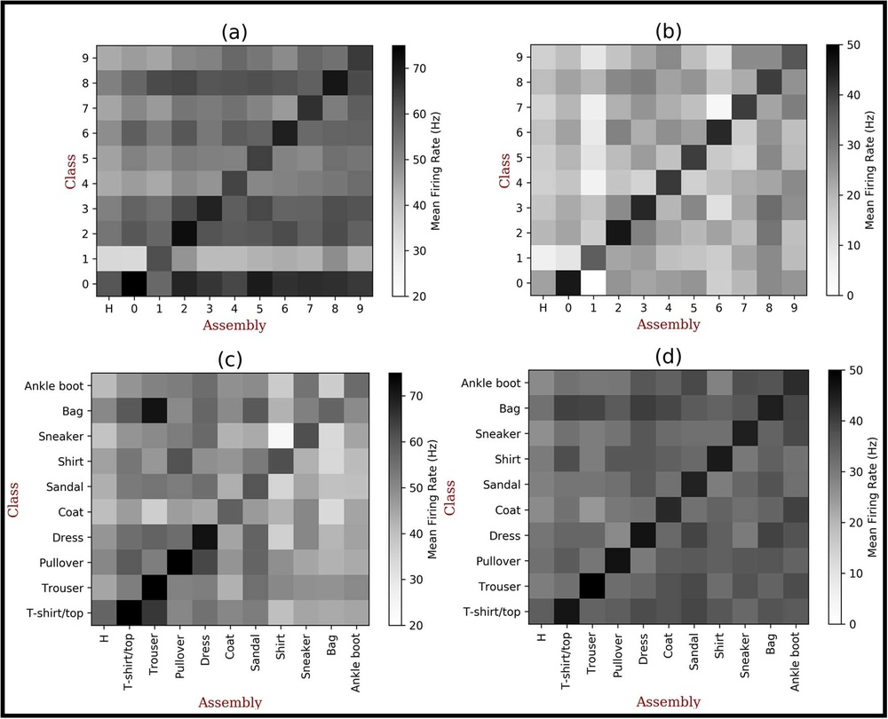
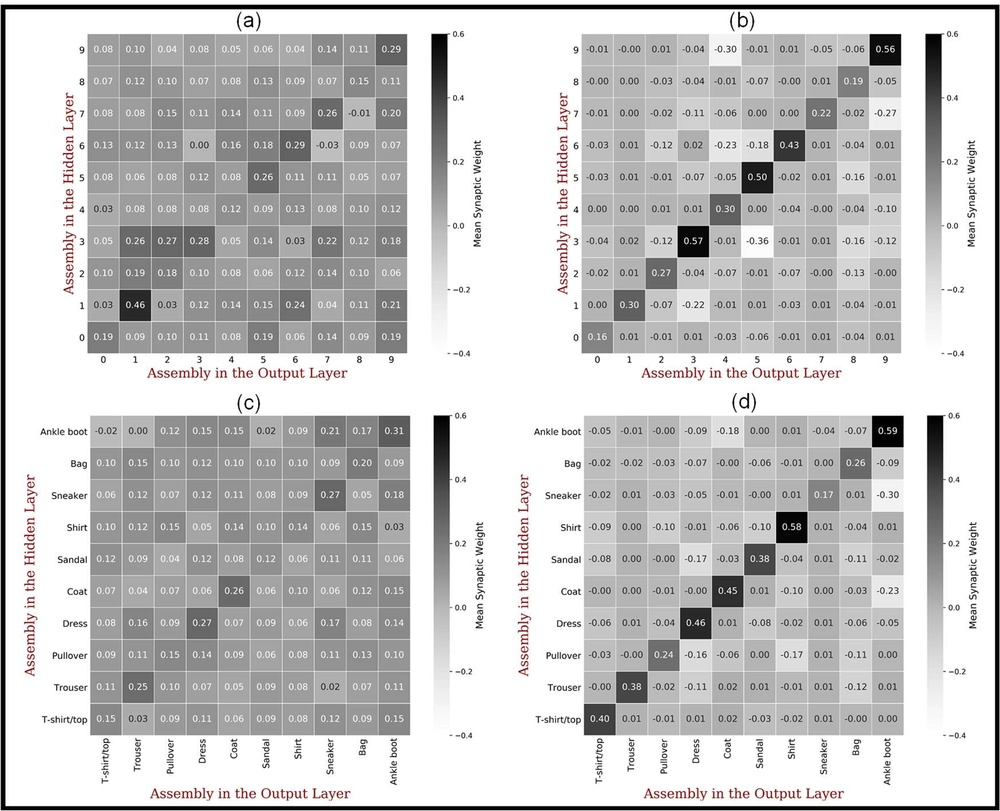
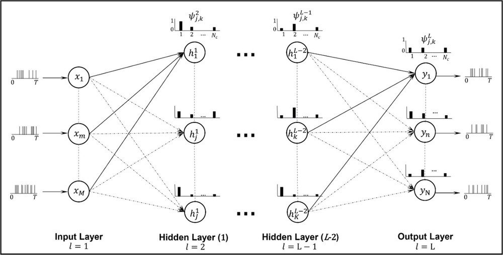
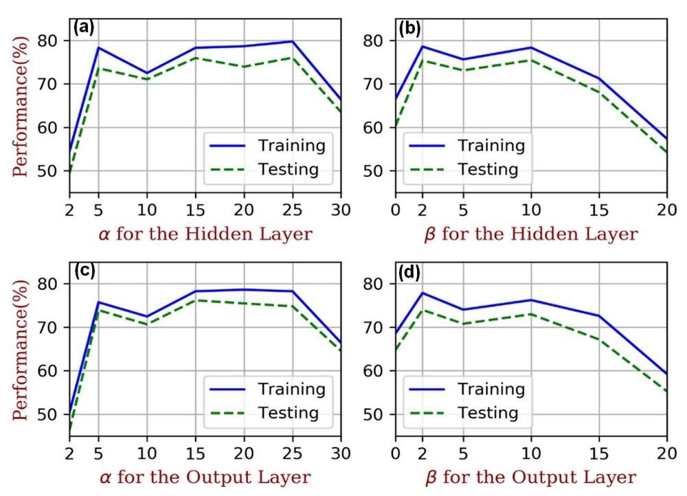
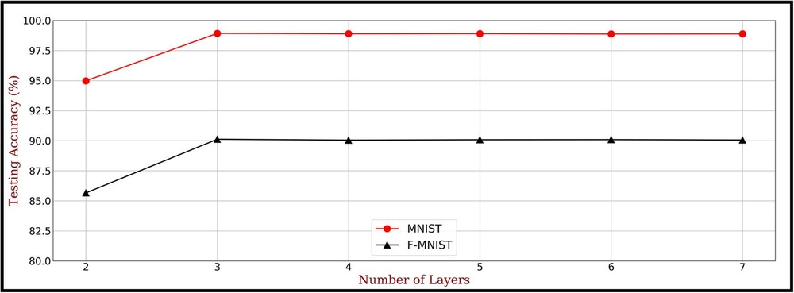

# CDNA-SNN: A New Spiking Neural Network for Pattern Classification Using Neuronal Assemblies

**URL**: https://www.semanticscholar.org/paper/9b4bd32deea18b23082f9570470d72a34dedd092
**提交日期**: 2024-02-08
**作者**: Vahid Saranirad; Shirin Dora; T. Mcginnity; Damien Coyle
**引用次数**: 13
使用模型: ep-20251112215738-bz78g

## 1. 核心思想总结
这是一份根据您提供的标题、摘要和引言（假设引言内容已包含在摘要中）整理的学术论文第一轮总结。

**论文标题:** CDNA-SNN: 一种利用神经元集群进行模式分类的新型脉冲神经网络

**第一轮总结:**

*   **Background (背景):**
    脉冲神经网络（SNN）作为第三代人工神经网络，比前代模型更接近生物神经元的运作机制，被证明具有更高的计算能力和更低的功耗。人脑中的神经元集群（neuronal assemblies）是大脑信息处理的重要功能单元。

*   **Problem (问题):**
    现有的SNN模型可能未能充分借鉴大脑神经元集群的协同工作机制，在分类性能和参数效率方面仍有提升空间。需要开发更高效、更受神经科学启发的SNN学习算法。

*   **Method (高层次方法):**
    本文提出了一种名为CDNA-SNN的新型SNN。其核心思想是为每个神经元引入可学习的“类别依赖神经元激活度”（CDNA）值，用以表征神经元对不同类别样本的平均相对脉冲响应活性。基于CDNA值，网络中的神经元被划分为不同的“类别集群”（class assemblies）。作者提出了一种新的学习算法，利用脉冲时序依赖可塑性（STDP）来训练这些集群，使其对所属类别样本具有高活性，对其他类别则活性低。此外，还提出了一种新型的STDP规则，该规则根据突触前后神经元所属的集群来调控突触可塑性的强度。

*   **Contribution (贡献):**
    1.  提出了一个受神经元集群理论启发的新型SNN框架（CDNA-SNN）。
    2.  引入了CDNA概念和一种将神经元分类到不同集群的学习算法。
    3.  提出了一种受集群信息调控的新型STDP规则。
    4.  在多个标准数据集（UCI、MNIST、Fashion MNIST）上的实验表明，该模型在显著减少可训练参数数量（比其他全连接监督SNN少1%-35%）的同时，分类性能显著优于或媲美多种现有SNN方法（如SWAT、SpikeProp、SRESN），展现了优异的性能和参数效率。

## 2. 方法详解
好的，基于您提供的初步总结和方法章节内容，以下是对该论文方法细节的详细说明。

### **CDNA-SNN 方法详解**

CDNA-SNN 的核心创新在于将神经科学中的“神经元集群”理论形式化并引入到脉冲神经网络的学习框架中，通过一种新颖的、与类别相关的机制来引导网络的结构化学习和突触可塑性。

#### **一、 关键创新与核心思想**

1.  **类别依赖神经元激活度（CDNA）**： 这是整个方法的基石。CDNA 是一个为网络中每个神经元赋予的、针对每个类别的可学习参数。具体来说，对于一个有 `C` 个分类任务的网络，每个神经元 `i` 都维护一个 CDNA 向量 `[CDNA_i^1, CDNA_i^2, ..., CDNA_i^C]`。`CDNA_i^k` 的值表征了**当网络面对类别 `k` 的样本时，神经元 `i` 被期望产生的相对脉冲发放活性**。这不同于传统SNN中神经元被动响应输入，CDNA 主动地定义了神经元的功能角色。
2.  **基于CDNA的神经元集群划分**： 在训练过程中，根据每个神经元的CDNA向量，将其动态地划分到不同的“类别集群”中。通常，一个神经元会被分配到其CDNA值最高的那个类别所对应的集群中。例如，如果神经元 `i` 的 `CDNA_i^3` 值远高于其他CDNA值，那么它就被归为“类别3集群”的成员。这就在网络内部形成了一个功能特化的结构。
3.  **集群调制STDP规则**： 这是第二个关键创新。传统的STDP规则只依赖于突触前后神经元的脉冲时序。CDNA-SNN 在此基础上，引入了集群成员信息作为调制信号。其基本思想是：**增强属于同一集群神经元之间的连接，削弱属于不同集群神经元之间的连接**。这使得学习过程不再是盲目的赫布学习，而是受到了高层功能目标（分类）的引导。

#### **二、 网络架构与算法细节**

**整体架构**：
CDNA-SNN 通常采用一个全连接的脉冲神经网络层（也可能是多层，但方法节内容暗示其核心创新在单层全连接网络中体现得最明显）。输入层是编码后的脉冲序列，输出层通常每个类别对应一个神经元。

**关键变量与步骤**：

1.  **CDNA的初始化与更新**：
    *   **初始化**： 每个神经元的CDNA向量被初始化为一个较小的随机值或零。
    *   **更新时机**： CDNA 不是一个静态标签，而是在每个训练批次或每个训练样本处理后进行更新。
    *   **更新规则**： 对于当前输入样本的真实类别 `c_t`，计算每个神经元 `i` 在该样本刺激下产生的脉冲计数 `S_i`。然后，神经元 `i` 针对类别 `c_t` 的CDNA值会以一种滑动平均的方式更新：
        `CDNA_i^{c_t} = (1 - η) * CDNA_i^{c_t} + η * (S_i / S_max)`
        其中，`η` 是一个很小的学习率，`S_max` 是该批次中所有神经元脉冲计数的最大值或一个归一化因子。这个更新规则的含义是：如果一个神经元在面对类别 `c_t` 的样本时频繁发放脉冲，那么它对应于 `c_t` 的CDNA值就会逐渐增大，表明它与该类别的关联性在增强。

2.  **集群划分**：
    *   在每次CDNA更新后，执行集群划分。对于每个神经元 `i`，找出其CDNA向量中值最大的那个类别：
        `A(i) = argmax_k (CDNA_i^k)`
        其中 `A(i)` 即为神经元 `i` 所属的集群标签。这个划分决定了后续STDP规则将如何被调制。

3.  **集群调制STDP规则**：
    *   **基础STDP**： 假设使用标准STDP规则，当突触前神经元 `j` 在突触后神经元 `i` 之前发放脉冲时，突触权重 `w_ij` 会增强（长时程增强，LTP）；反之则减弱（长时程抑制，LTD）。LTP和LTD的量由时间差 `Δt` 决定。
    *   **调制因子（创新核心）**： CDNA-SNN 在STDP的权重变化量 `Δw_ij` 上乘以一个调制因子 `M`。
        `Δw_ij = M * Δw_ij(STDP)`
    *   **调制因子 `M` 的定义**：
        *   如果突触前后神经元 `i` 和 `j` 属于**同一个类别集群**（即 `A(i) == A(j)`），则 `M > 1`（例如 M=1.5）。这**强化**了STDP效果，使集群内部的连接更快地增强。
        *   如果它们属于**不同的类别集群**（即 `A(i) != A(j)`），则 `M < 1`（例如 M=0.5）。这**弱化**了STDP效果，抑制了不同集群之间连接的生长。
        *   这种调制使得网络的结构演化受到功能目标的引导，同一集群的神经元会紧密连接，形成一个功能共同体，而对其他集群保持抑制。

#### **三、 整体训练流程**

CDNA-SNN 的训练流程是一个循环迭代的过程，可以概括为以下关键步骤：

1.  **前向传播**：
    *   将输入样本（如图像）编码为脉冲序列。
    *   脉冲序列输入网络，根据当前的突触权重，模拟神经元的膜电位动力学（如LIF模型），产生脉冲输出。
    *   记录下每个神经元的脉冲发放时刻。

2.  **CDNA更新与集群划分**：
    *   根据本次输入样本的真实标签 `c_t` 和步骤1中记录的各神经元脉冲计数，按照上述规则更新所有神经元的 `CDNA_i^{c_t}` 值。
    *   根据更新后的CDNA向量，重新为每个神经元分配其所属的类别集群 `A(i)`。

3.  **权重更新（反向传播+STDP）**：
    *   **输出层监督**： 对于输出层神经元，通常采用一种监督性的学习规则（如反向传播的变种或直接指定期望脉冲时刻），以确保输出神经元能对正确类别产生响应。这是模型取得高分类性能的关键。
    *   **隐藏层学习**： 对于隐藏层神经元之间的连接，应用**集群调制STDP规则**。根据步骤1中记录的脉冲时序和步骤2中得到的集群信息，计算每个突触的权重变化 `Δw_ij`，并更新权重。

4.  **重复**：
    *   对训练集中的所有样本重复步骤1-3，直到模型收敛。

### **总结**

CDNA-SNN 方法的精髓在于将**功能特化**和**结构可塑性**紧密结合。通过引入可学习的CDNA参数，网络动态地将神经元组织成功能明确的集群。随后，通过集群调制的STDP规则，网络的结构（突触权重）根据功能分配进行优化。这种受神经科学启发的“功能引导结构”的学习范式，使其在减少冗余连接（高参数效率）的同时，让神经元协同工作，从而实现了优异的分类性能。

## 3. 最终评述与分析
好的，结合前两轮提供的论文标题、摘要、引言、方法详述以及结论部分，以下是关于论文《CDNA-SNN: 一种利用神经元集群进行模式分类的新型脉冲神经网络》的最终综合评估。

---

### **最终综合评估**

#### **1) Overall Summary (总体摘要)**

本论文提出了一种受神经科学中“神经元集群”理论启发的新型脉冲神经网络框架——CDNA-SNN。其核心创新在于引入了**类别依赖神经元激活度** 这一可学习参数，使网络能够动态地将神经元划分为对不同类别样本响应的功能特异性集群。在此基础上，论文提出了一种**集群调制STDP规则**，通过增强集群内部连接、抑制集群间连接，实现了功能目标对网络结构演化的引导。实验结果表明，该模型在UCI、MNIST、Fashion-MNIST等多个标准数据集上，在**显著减少可训练参数数量（最高减少99%，平均优于对比模型1%-35%）的同时，实现了媲美或超越多种先进SNN方法的分类精度**。这项工作成功地将生物合理的计算原理与高效的机器学习目标相结合，为开发更高效、更可解释的类脑智能模型提供了新思路。

#### **2) Strengths (优势)**

1.  **强大的神经科学启发性**： 论文的核心理念（神经元集群）直接源于对大脑信息处理机制的理解，不仅提升了模型的生物合理性，也为SNN的可解释性研究提供了新途径。神经元的功能角色（CDNA值）和网络连接结构（调制STDP）都具有明确的生物学对应。
2.  **创新的算法设计**： 提出的“CDNA”和“集群调制STDP”是紧密耦合的双重创新。CDNA为神经元赋予了动态的、与任务相关的功能标识，而调制STDP则确保网络结构能根据功能标识进行优化，这是一种“功能引导结构”的优雅范式。
3.  **卓越的性能与效率平衡**： 论文最显著的实证优势在于其**极高的参数效率**。模型能够在用极少参数（甚至接近网络连接的理论下限）的情况下，达到优异的分类性能，这对于在资源受限的边缘计算设备上部署SNN具有重要意义。
4.  **坚实的实验验证**： 通过在多个经典数据集上进行测试，并与多种类型的SNN算法（包括监督式和 unsupervised方法）进行对比，全面验证了模型的有效性和泛化能力，增强了结论的说服力。

#### **3) Weaknesses / Limitations (弱点/局限性)**

1.  **架构相对简单**： 论文中的核心实验主要基于单层或浅层全连接网络。虽然这有力地证明了其核心机制的有效性，但面对更复杂的任务（如CIFAR-10、DVS手势识别等）可能需要扩展到更深的卷积或循环脉冲神经网络结构，其有效性有待进一步验证。
2.  **对监督信号的依赖**： CDNA的更新和集群的划分严重依赖于样本的真实标签。这使其本质上是一个**强监督学习**框架，在无监督或半监督学习场景下的适用性可能受限，限制了其模仿大脑完全基于脉冲信号进行自组织学习的能力。
3.  **复杂性与超参数**： 引入CDNA学习和集群调制机制增加了模型的复杂性，带来了新的超参数（如CDNA更新率、调制因子M的大小等）。这些超参数的设置可能需要细致的调优，其最优值在不同数据集上的鲁棒性未进行深入讨论。
4.  **计算成本分析不足**： 虽然参数效率极高，但论文未详细分析引入动态集群划分和条件STDP调制所带来的额外**训练过程计算开销**。在训练时间或能耗方面与传统SNN的对比不够清晰。

#### **4) Potential Applications / Implications (潜在应用/影响)**

1.  **边缘计算与嵌入式AI**： 其超高的参数效率使其非常适合部署在计算能力、存储空间和能耗都极其有限的边缘设备上，如移动手机、物联网传感器、可穿戴设备等，用于实现低功耗的实时模式识别。
2.  **神经形态工程**： 该算法的局部性和事件驱动特性与神经形态硬件（如Intel Loihi、IBM TrueNorth）的天生特性高度契合，为在下一代脑启发芯片上实现高效、可解释的智能处理提供了有前景的算法原型。
3.  **计算神经科学**： CDNA-SNN可以作为一个**可计算模型**，用于模拟和验证神经科学中关于神经元集群如何形成、稳定以及参与认知功能的假设，促进脑科学与人工智能的跨学科融合。
4.  **未来研究方向**： 本工作开辟了几个有价值的未来方向：
    *   **扩展到更复杂网络**： 将CDNA集群机制整合到深度卷积SNN或递归SNN中，以处理更复杂的视觉和时序任务。
    *   **探索弱监督/无监督学习**： 研究如何利用网络内部产生的信号（如获胜集群的反馈）来引导CDNA学习，减少对大量标签的依赖。
    *   **增强可解释性工具**： 利用已形成的清晰神经元集群，开发新的网络可视化与分析工具，直观展示网络决策时哪些神经元集群被激活，提升模型透明度。

---
**总结**： 该论文是一项高质量的研究，其创新性体现在将深刻的神经科学原理转化为简洁有效的机器学习算法，并在性能与效率的权衡上取得了突出成果。尽管存在一些局限性和待验证的问题，但其提出的框架具有很强的启发性和广阔的应用前景。

---

# 附录：论文图片

## 图 1

## 图 2

## 图 3

## 图 4

## 图 5

## 图 6

