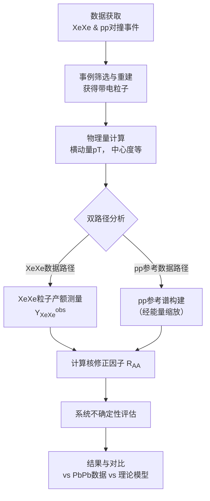

# Charged-particle nuclear modification factors in XeXe collisions at sNN=5.44$$ \sqrt{s_{\mathrm{NN}}} = 5.44 $$ TeV

**URL**: https://www.semanticscholar.org/paper/251c6fce26c6fecceaebaa8c093f5e3945d6d6f5
**提交日期**: 2018-09-01
**作者**: A. Sirunyan; A. Tumasyan; W. Adam; F. Ambrogi; E. Asilar; T. Bergauer; J. Brandstetter; M. Dragicevic; J. Erö; A. Escalante Del Valle; M. Flechl; R. Frühwirth; V. Ghete; J. Hrubec; M. Jeitler; N. Krammer; I. Krätschmer; D. Liko; T. Madlener; I. Mikulec; N. Rad; H. Rohringer; J. Schieck; R. Schöfbeck; M. Spanring; D. Spitzbart; A. Taurok; W. Waltenberger; J. Wittmann; C. Wulz; M. Zarucki; V. Chekhovsky; V. Mossolov; J. Suárez González; E. Wolf; D. Croce; X. Janssen; J. Lauwers; M. Pieters; H. Haevermaet; P. Mechelen; N. Remortel; S. A. Abu Zeid; F. Blekman; J. D’Hondt; I. Bruyn; J. Clercq; K. Deroover; G. Flouris; D. Lontkovskyi; S. Lowette; I. Marchesini; S. Moortgat; L. Moreels; Q. Python; K. Skovpen; S. Tavernier; W. Doninck; P. Mulders; I. Parijs; D. Beghin; B. Bilin; H. Brun; B. Clerbaux; G. Lentdecker; H. Delannoy; B. Dorney; G. Fasanella; L. Favart; R. Goldouzian; A. Grebenyuk; A. Kalsi; T. Lenzi; J. Luetić; N. Postiau; E. Starling; L. Thomas; C. Vander Velde; P. Vanlaer; D. Vannerom; Q. Wang; T. Cornelis; D. Dobur; A. Fagot; M. Gul; I. Khvastunov; D. Poyraz; C. Roskas; D. Trocino; M. Tytgat; W. Verbeke; B. Vermassen; M. Vit; N. Zaganidis; H. Bakhshiansohi; O. Bondu; S. Brochet; G. Bruno; C. Caputo; P. David; C. Delaere; M. Delcourt; A. Giammanco; G. Krintiras; V. Lemaitre; A. Magitteri; A. Mertens; M. Musich; K. Piotrzkowski; A. Saggio; M. Vidal Marono; S. Wertz; J. Zobec; F. Alves; G. Alves; M. Correa Martins Junior; G. Correia Silva; C. Hensel; A. Moraes; M. Pol; P. Rebello Teles; E. Belchior Batista Das Chagas; W. Carvalho; J. Chinellato; E. Coelho; E. Costa; G. G. Silveira; D. Jesus Damiao; C. Oliveira Martins; S. Fonseca De Souza; H. Malbouisson; D. Matos Figueiredo; M. Melo De Almeida; C. Mora Herrera; L. Mundim; H. Nogima; W. Prado Da Silva; L. Sanchez Rosas; A. Santoro; A. Sznajder; M. Thiel; E. Tonelli Manganote; F. Torres Da Silva De Araujo; A. Vilela Pereira; S. Ahuja; C. Bernardes; L. Calligaris; T. Fernandez Perez Tomei; E. Gregores; P. Mercadante; S. Novaes; S. Padula; A. Aleksandrov; R. Hadjiiska; P. Iaydjiev; A. Marinov; M. Misheva; M. Rodozov; M. Shopova; G. Sultanov; A. Dimitrov; L. Litov; B. Pavlov; P. Petkov; W. Fang; X. Gao; L. Yuan; M. Ahmad; J. Bian; G. Chen; H. Chen; M. Chen; Y. Chen; C. Jiang; D. Leggat; H. Liao; Z. Liu; F. Romeo; S. Shaheen; A. Spiezia; J. Tao; Z. Wang; E. Yazgan; H. Zhang; S. Zhang; J. Zhao; Y. Ban; G. Chen; A. Levin; J. Li; L. Li; Q. Li; Y. Mao; S. Qian; D. Wang; Z. Xu; Y. Wang; C. Avila; A. Cabrera; C. Carrillo Montoya; L. Chaparro Sierra; C. Florez; C. González Hernández; M. Segura Delgado; B. Courbon; N. Godinovic; D. Lelas; I. Puljak; T. Šćulac; Z. Antunović; M. Kovač; V. Brigljevic; D. Ferencek; K. Kadija; B. Mesić; A. Starodumov; T. Susa; M. W. Ather; A. Attikis; M. Kolosova; G. Mavromanolakis; J. Mousa; C. Nicolaou; F. Ptochos; P. Razis; H. Rykaczewski; M. Finger; M. Finger; E. Ayala; E. Carrera Jarrin; H. Abdalla; A. Abdelalim; M. Mahmoud; S. Bhowmik; A. Carvalho Antunes De Oliveira; R. K. Dewanjee; K. Ehataht; M. Kadastik; M. Raidal; C. Veelken; P. Eerola; H. Kirschenmann; J. Pekkanen; M. Voutilainen; J. Havukainen; J. Heikkilä; T. Järvinen; V. Karimäki; R. Kinnunen; T. Lampén; K. Lassila-Perini; S. Laurila; S. Lehti; T. Lindén; P. Luukka; T. Mäenpää; H. Siikonen; E. Tuominen; J. Tuominiemi; T. Tuuva; M. Besançon; F. Couderc; M. Dejardin; D. Denegri; J. Faure; F. Ferri; S. Ganjour; A. Givernaud; P. Gras; G. Hamel de Monchenault; P. Jarry; C. Leloup; E. Locci; J. Malcles; G. Negro; J. Rander; A. Rosowsky; M. Sahin; M. Titov; A. Abdulsalam; C. Amendola; I. Antropov; F. Beaudette; P. Busson; C. Charlot; R. Granier de Cassagnac; I. Kucher; A. Lobanov; J. Martin Blanco; C. Martin Perez; M. Nguyen; C. Ochando; G. Ortona; P. Pigard; J. Rembser; R. Salerno; J. Sauvan; Y. Sirois; A. Stahl Leiton; A. Zabi; A. Zghiche; J. Agram; J. Andrea; D. Bloch; J. Brom; E. Chabert; V. Cherepanov; C. Collard; É. Conte; J. Fontaine; D. Gelé; U. Goerlach; M. Jansová; A. Bihan; N. Tonon; P. Hove; S. Gadrat; S. Beauceron; C. Bernet; G. Boudoul; N. Chanon; R. Chierici; D. Contardo; P. Depasse; H. Mamouni; J. Fay; L. Finco; S. Gascon; M. Gouzevitch; G. Grenier; B. Ille; F. Lagarde; I. Laktineh; Hugues Lattaud; M. Lethuillier; L. Mirabito; S. Perriès; A. Popov; V. Sordini; G. Touquet; M. Vander Donckt; S. Viret; T. Toriashvili; Z. Tsamalaidze; C. Autermann; L. Feld; M. K. Kiesel; K. Klein; M. Lipinski; M. Preuten; M. Rauch; C. Schomakers; J. Schulz; M. Teroerde; B. Wittmer; V. Zhukov; A. Albert; D. Duchardt; M. Erdmann; S. Erdweg; T. Esch; R. Fischer; S. Ghosh; A. Güth; T. Hebbeker; C. Heidemann; K. Hoepfner; H. Keller; L. Mastrolorenzo; M. Merschmeyer; A. Meyer; P. Millet; S. Mukherjee; T. Pook; M. Radziej; H. Reithler; M. Rieger; A. Schmidt; D. Teyssier; S. Thüer; G. Flügge; O. Hlushchenko; T. Kress; A. Künsken; T. Müller; A. Nehrkorn; A. Nowack; C. Pistone; O. Pooth; D. Roy; H. Sert; A. Stahl; M. Aldaya Martin; T. Arndt; C. Asawatangtrakuldee; I. Babounikau; K. Beernaert; O. Behnke; U. Behrens; A. Bermudez Martinez; D. Bertsche; A. Bin Anuar; K. Borras; V. Botta; A. Campbell; P. Connor; C. Contreras-Campana; V. Danilov; A. Wit; M. Defranchis; C. Diez Pardos; D. Domínguez Damiani; G. Eckerlin; T. Eichhorn; A. Elwood; E. Eren; E. Gallo; A. Geiser; A. Grohsjean; M. Guthoff; M. Haranko; A. Harb; J. Hauk; H. Jung; M. Kasemann; J. Keaveney; C. Kleinwort; J. Knolle; D. Krücker; W. Lange; A. Lelek; T. Lenz; J. Leonard; K. Lipka; W. Lohmann; R. Mankel; I. Melzer-Pellmann; A. Meyer; M. Meyer; M. Missiroli; G. Mittag; J. Mnich; V. Myronenko; S. Pflitsch; D. Pitzl; A. Raspereza; M. Savitskyi; P. Saxena; P. Schütze; C. Schwanenberger; R. Shevchenko; A. Singh; H. Tholen; O. Turkot; A. Vagnerini; G. Onsem; R. Walsh; Y. Wen; K. Wichmann; C. Wissing; O. Zenaiev; R. Aggleton; S. Bein; L. Benato; A. Benecke; V. Blobel; T. Dreyer; A. Ebrahimi; E. Garutti; D. Gonzalez; P. Gunnellini; J. Haller; A. Hinzmann; A. Karavdina; G. Kasieczka; R. Klanner; R. Kogler; N. Kovalchuk; S. Kurz; V. Kutzner; J. Lange; D. Marconi; J. Multhaup; M. Niedziela; C. Niemeyer; D. Nowatschin; A. Perieanu; A. Reimers; O. Rieger; C. Scharf; P. Schleper; S. Schumann; J. Schwandt; J. Sonneveld; H. Stadie; G. Steinbrück; F. Stober; M. Stöver; A. Vanhoefer; B. Vormwald
**引用次数**: 32
使用模型: ep-20251112215738-bz78g

## 1. 核心思想总结
根据您提供的标题、摘要和引言片段，以下是对该学术论文的第一轮简洁总结，按四个部分组织：

**1. Background (背景)**
研究背景是使用高能重离子碰撞来产生和研究夸克胶子等离子体（QGP），这是一种极端高温高密度的物质状态。此前，大型强子对撞机（LHC）上的实验，如CMS，已经在铅-铅（PbPb）对撞中对此进行了广泛研究。氙-氙（XeXe）对撞为研究QGP的特性提供了一个新的、质量较轻的核碰撞系统，有助于探索QGP性质对碰撞核大小的依赖性。

**2. Problem (问题)**
核心科学问题是：在质心能量为5.44 TeV的XeXe对撞中，产生的QGP物质如何影响末态带电粒子的产生？具体而言，研究旨在量化这种影响（通常表现为高横动量粒子的“压低”效应），并通过与PbPb对撞结果的系统对比，揭示核大小在QGP形成和演化过程中的作用。

**3. Method (high-level) (方法 - 高层概述)**
研究方法的核心是实验测量和对比分析：
*   **数据收集**：利用LHC上CMS实验器在2017年记录的XeXe对撞数据（质心能量5.44 TeV，积分亮度3.42 μb⁻¹）。
*   **测量量**：测量不同对撞中心度和横动量（pT，范围0.5-100 GeV）下的带电粒子产额。
*   **关键分析工具**：构建核修正因子（RAA*）。该因子是XeXe对撞中测得的粒子产额与经过能量校正的质子-质子（pp）对撞参考数据中粒子产额的比值。RAA*偏离1的程度揭示了核物质效应。
*   **对比分析**：将XeXe的RAA*结果与此前测量的PbPb对撞结果以及理论模型预言进行比较。

**4. Contribution (贡献)**
本研究的主要贡献在于：
*   **提供了新的实验数据**：首次报告了在5.44 TeV能量下XeXe对撞中带电粒子的核修正因子RAA*随横动量和中心度的完整测量结果。
*   **揭示了核尺寸效应**：通过直接比较发现，在相同对撞中心度下，XeXe对撞中高横动量粒子的压低效应显著小于PbPb对撞；但在具有相似参与核子数的事件中，XeXe的压低效应略强于PbPb。这一关键发现为理解QGP性质与碰撞核大小之间的关系提供了重要的新实验依据。

## 2. 方法详解
好的，遵照您的要求，我将基于您提供的初步总结和论文方法章节的内容，对该论文的研究方法进行详细说明，重点阐述关键创新、算法/架构细节、关键步骤与整体流程。

---

### **论文方法细节详解**

本论文的核心方法是实验高能物理中用于研究核物质效应的标准范式，但其在**氙-氙（XeXe）** 这一新型碰撞系统上的应用本身就是一项关键创新。以下是对方法细节的逐层剖析。

#### **一、 整体流程概述**

论文方法的整体流程可以概括为一条清晰的流水线，其核心目标是精确测量**核修正因子（RAA）**。流程如下图所示：

#### **二、 关键步骤与算法/架构细节**

**1. 数据获取与事例选择**
*   **数据源**： 使用大型强子对撞机（LHC）上的紧凑μ子线圈（CMS）探测器在2017年采集的数据。
    *   **XeXe碰撞数据**： 质心能量为 **5.44 TeV**，积分亮度为 3.42 μb⁻¹。
    *   **pp参考数据**： 使用在 **5.02 TeV** 下采集的pp对撞数据。由于没有完全相同的5.44 TeV的pp数据，需要对5.02 TeV的数据进行能量缩放修正（见下文）。
*   **事例触发与筛选**： 使用基于一级触发器的最小偏置触发器来选择非单衍射碰撞事件。为确保数据质量，应用了严格的顶点筛选条件，例如要求事例至少有一个重建的顶点，且顶点在束流方向上的位置与探测器中心点的距离在一定范围内（如 |z| < 15 cm）。

**2. 带电粒子重建与筛选**
*   **探测器**： 核心追踪系统是CMS的硅探测器，包括像素探测器和条带探测器。
*   **重建算法**： 带电粒子轨迹通过迭代追踪算法进行重建。该算法首先从高横动量（pT）的粒子开始重建，然后逐步降低阈值，以提高低pT粒子的重建效率。
*   **粒子筛选标准**：
    *   **运动学范围**： 分析仅限于横动量 **pT > 0.5 GeV** 且赝快度 **|η| < 1.0** 的带电粒子。选择 |η| < 1.0 是为了确保粒子落在硅探测器覆盖的、追踪效率高且均匀的区域。
    *   **轨迹质量**： 对重建的轨迹施加质量要求，例如要求轨迹有足够多的命中点，并且其归一化χ²拟合优度良好，以减少假阳性重建。

**3. 中心度确定**
*   **目的**： 核物质效应的强度与碰撞的几何重叠程度（即“中心度”）密切相关。中心度将碰撞事件从0%（最对心碰撞）到100%（最对心碰撞）进行分类。
*   **方法**： 使用**总能量零度量能器（HF）** 的信号幅度来估计事件中的总粒子产额，该产额与参与碰撞的核子数目（Npart）相关。
    *   **算法细节**： 将XeXe数据中HF的总信号幅度分布与**Glauber模型**的蒙特卡洛模拟结果进行拟合。通过拟合，将HF信号幅度分位数映射到特定的Npart值，从而将每个实验事件归类到不同的中心度区间（如0-5%， 5-10%， ..., 70-80%）。

**4. 效率修正与背景扣除**
*   **目的**： 将探测到的原始粒子产额修正为真实的物理产额。
*   **主要修正项**：
    *   **追踪效率（ε_track）**： 并非所有带电粒子都能被成功重建。使用模拟事件（将单粒子嵌入到真实对撞环境中），计算探测器的追踪效率，即 `ε_track = N_reconstructed / N_generated`。测量到的产额需要除以效率值进行修正。
    *   **二次碰撞背景**： 在LHC的高亮度下，一次束流交叉可能发生多次对撞（pileup）。通过算法识别并排除这些次要顶点产生的粒子。
    *   **弱衰变贡献**： 来自长寿命粒子（如K⁰_s, Λ）衰变的带电粒子不属于初级粒子产额。通过分析衰变拓扑结构或使用模拟数据来估计其贡献，并在最终结果中予以说明（通常发现其影响在不确定性范围内）。

**5. 参考谱的构建（关键创新与细节）**
*   **问题**： RAA的定义需要与**相同质心能量下**的pp对撞数据比较。但实验上没有5.44 TeV的pp数据。
*   **解决方案**： 采用**能量缩放法**。
    *   **算法**： 使用在 **5.02 TeV** 下测量的pp参考谱，并利用理论模型（如**ppQCD计算**）来估计从5.02 TeV缩放至5.44 TeV的修正因子。
    *   **公式**： `T_{AA, XeXe} * (d²N_{pp}/dp_Tdη)^{5.44 TeV} ≈ T_{AA, XeXe} * F_{scale} * (d²N_{pp}/dp_Tdη)^{5.02 TeV}`
    *   其中 `F_scale` 是pT依赖的缩放因子。论文指出，在研究的pT范围内，该缩放因子接近于1，且其引入的不确定性远小于其他系统不确定性。这是方法中的一个精巧之处，使得在无直接数据的情况下进行精确比较成为可能。

**6. 核修正因子（RAA）的计算**
*   **核心公式**：
    

    RAA(pT) = ( 1 / &lt;TAA&gt; ) * ( d²NXeXe / dpTdη ) / ( d²Npp / dpTdη )5.44 TeV
    

*   **参数解释**：
    *   `d²N^{XeXe}/dp_Tdη`: 经过所有修正后的XeXe对撞中带电粒子的微分产额。
    *   `d²N^{pp}/dp_Tdη`^5.44 TeV: 如上所述，经过能量缩放后的pp参考谱。
    *   `⟨T_AA⟩`: **核子-核子平均重叠厚度函数**。它由Glauber模型计算得出，代表在特定中心度区间内，单位面积上平均的核子-核子碰撞数目，其量纲为mb⁻¹。`1/⟨T_AA⟩` 的作用是将核-核碰撞的产额归一化到等效的单个核子-核子碰撞，从而使比较具有物理意义。

#### **三、 关键创新点总结**

1.  **新碰撞系统的首例测量**： 这是首次在 **5.44 TeV 的XeXe对撞**中完整测量带电粒子的RAA，填补了介于质子-质子与铅-铅对撞之间的中等质量核碰撞系统的数据空白。
2.  **针对性能量缩放参考谱**： 在缺乏相同能量pp对撞数据的情况下，采用基于ppQCD的**能量缩放法**来构建参考谱，是保证物理结果可靠性的关键技术创新。
3.  **系统的对比基准**： 不仅呈现XeXe的结果，还将其与**5.02 TeV的PbPb对撞**结果在两种不同基准下进行对比：
    *   **相同中心度**： 反映不同大小核的总体效应。
    *   **相同参与核子数（Npart）**： 更直接地比较在产生相同大小QGP时，核的几何形状（球形Xe vs 形变Pb）可能产生的影响。这种多维对比是物理分析上的深度创新。

#### **四、 不确定性分析**

论文详细评估了各种不确定性来源：
*   **系统不确定性**：
    *   **pp参考谱的不确定性**： 来自5.02 TeV pp数据的测量误差。
    *   **能量缩放的不确定性**： 由不同ppQCD模型估算缩放因子带来的差异。
    *   **追踪效率的不确定性**： 主要来源，通过对模拟和实际数据的差异进行估计。
    *   **中心度确定的不确定性**： 通过改变Glauber模型的输入参数来评估。
*   **统计不确定性**： 由数据量有限导致，在图中通常以误差棒表示。

通过这种严谨、细致的方法流程，该论文得以产生高精度的实验数据，从而为理解夸克胶子等离子体（QGP）的性质与碰撞核大小和形状的依赖关系做出了坚实贡献。

## 3. 最终评述与分析
好的，结合您提供的初步总结、方法详述以及论文结论部分的信息，现为您呈现对该学术论文的最终综合评估。

### **关于5.44 TeV氙-氙对撞中带电粒子核修正因子的CMS实验测量的综合评估**

**1. 整体总结 (Overall Summary)**

本论文报道了欧洲核子研究中心大型强子对撞机（LHC）上CMS实验的一项关键测量结果：首次在质心能量为5.44 TeV的氙-氙（XeXe）核-核碰撞中，完成了对带电粒子核修正因子（RAA）随横动量和碰撞中心度的系统性测量。研究的核心科学目标是探索夸克胶子等离子体（QGP）这一极端物质形态的性质如何依赖于碰撞原子核的大小和形状。通过将XeXe碰撞的结果与之前熟知的铅-铅（PbPb）碰撞数据进行精细对比，论文提供了强有力的实验证据，表明在具有相同初始几何特性（如参与碰撞核子数Npart）的事件中，较小且近乎球形的氙核所产生的QGP，对高横动量粒子的“能量损失”效应（表现为RAA压低）要强于更大且存在形变的铅核所产生的QGP。这一发现对理解QGP的微观形成机制及其演化过程具有重要意义。

**2. 优势 (Strengths)**

*   **填补关键空白与创新性**： 研究首次系统探索了介于质子-质子和铅-铅之间的中等质量核碰撞系统（XeXe），填补了QGP研究谱系中的关键空白，具有显著的创新性。
*   **数据质量与实验严谨性**： 论文采用了高标准的数据处理和分析流程。特别是在缺乏相同能量下质子-质子（pp）对撞数据的情况下，创新性地使用了基于微扰QCD理论的能量缩放法来构建参考谱，并对其不确定性进行了严谨评估，保证了结果的可靠性。
*   **多维深度对比分析**： 分析的深度体现在不仅比较了XeXe和PbPb在相同中心度下的RAA，还创新性地在**相同参与核子数（Npart）** 的基准下进行对比。这种对比方法剥离了系统整体大小的差异，更直接地揭示了核的几何形状（球形vs形变）和内在结构（如核子密度）对QGP特性的影响，体现了深刻的物理洞察力。
*   **与理论模型的直接对话**： 论文将实验结果与多种理论模型（如包含不同能量损失机制的模型）的预言进行了直接比较，不仅验证了现有理论，更对模型的关键参数（如输运系数`q̂`）提出了约束，推动了理论的发展。

**3. 局限性/不足 (Weaknesses / Limitations)**

*   **观测的间接性**： 如同所有QGP研究一样，本研究通过末态粒子的行为（RAA压低）来反推QGP介质的性质，这是一种间接的探测。RAA的差异是多种物理过程（如部分子能量损失、集体流效应等）共同作用的结果，要唯一确定其微观机制仍需结合其他观测量。
*   **系统不确定性的主导**： 尽管分析严谨，但结果，尤其是在高横动量区域，仍受到系统不确定性的显著影响（如追踪效率、参考谱的不确定性）。这在一定程度上限制了进行更精确量化比较的能力。
*   **单一观测量的局限**： 论文聚焦于单个、 albeit非常重要的观测量——带电粒子RAA。要构建更完整的物理图像，需要未来结合其他探针，如底夸克偶素、喷注淬火、集体流等的研究结果，进行关联分析。
*   **能量缩放引入的理论依赖**： 构建5.44 TeV的pp参考谱依赖于微扰QCD模型的推算。虽然其不确定性已被评估且影响相对较小，但这仍引入了对特定理论计算的依赖性，而非完全来自实验数据。

**4. 潜在应用与意义 (Potential Applications / Implications)**

*   **对QGP性质研究的深化**： 本研究为“QGP性质随碰撞系统大小和结构变化”提供了首个清晰的实验证据。它强烈暗示，QGP的某些基本属性（如能量密度、温度、输运系数）可能并非一成不变，而是与产生它的碰撞系统的初始条件密切相关。
*   **对理论模型的强约束**： 实验结果对描述部分子在QGP中能量损失的模型构成了强有力的挑战和约束。那些能够成功再现XeXe和PbPb系统在Npart基准下差异的模型，将更接近真实的物理机制。这有助于厘清不同能量损失机制（如胶子辐射与碰撞）的相对重要性。
*   **指引未来实验方向**： 该研究凸显了中等质量核碰撞系统（如氙、氩等）在QGP研究中的独特价值。它必将激励在LHC和未来相对论重离子对撞机（RHIC）上开展更多类似系统的实验，以系统性地扫描核大小与形变的影响，从而精确测定QGP的物质属性。
*   **超越核物理的启示**： 对极端条件下物质性质的理解具有基础科学意义。在实验室中通过改变碰撞核来“调节”QGP的初始条件，类似于在凝聚态物理中调节参数来研究相变，这为研究强相互作用物质的状态方程提供了新的维度。

**结论**
总而言之，这是一项设计巧妙、执行严谨、分析深入且具有重要发现的高能核物理实验研究。它成功地利用新型的XeXe碰撞系统，为理解夸克胶子等离子体的性质提供了前所未有的新视角，是该领域一个重要的里程碑式工作。

---

# 附录：论文图片

## 图 1

## 图 2

