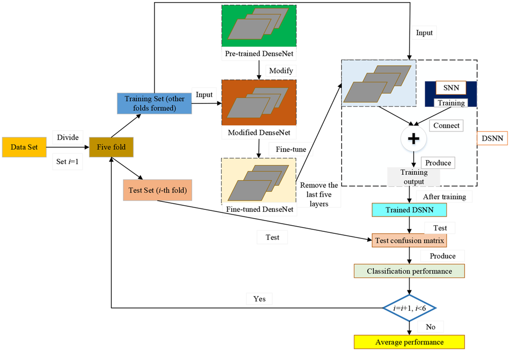
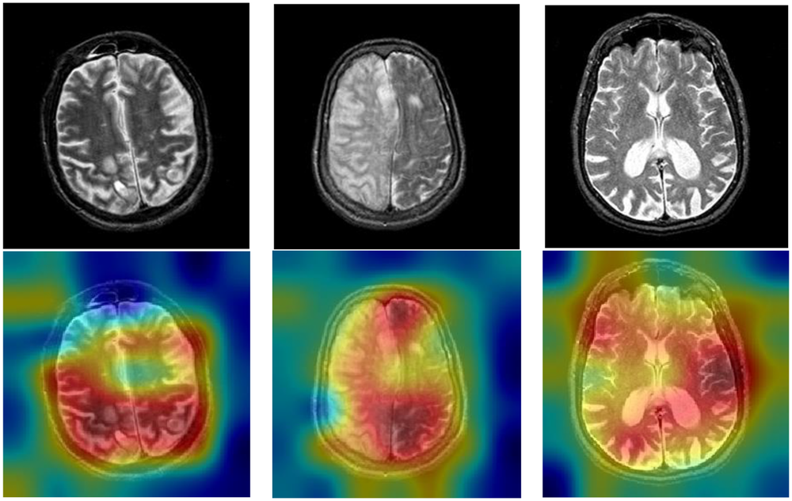
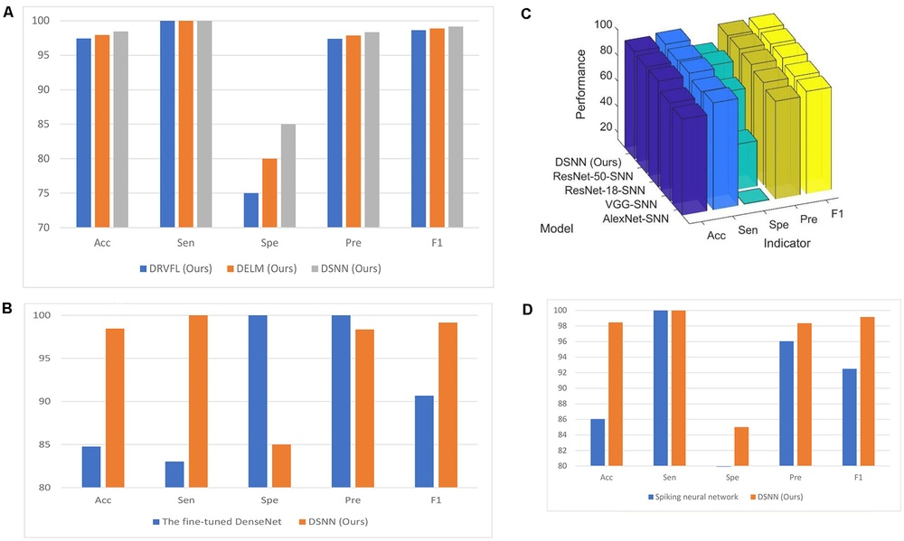
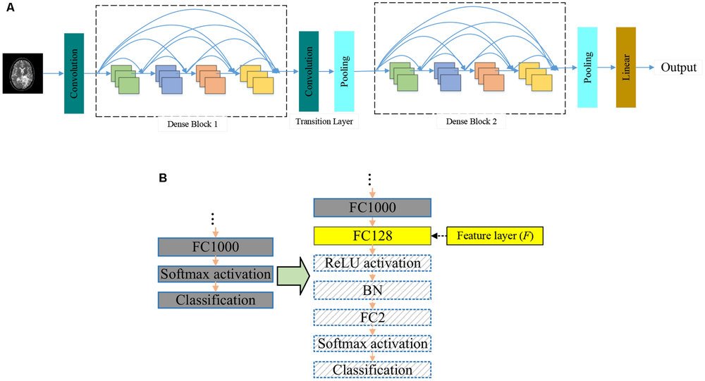
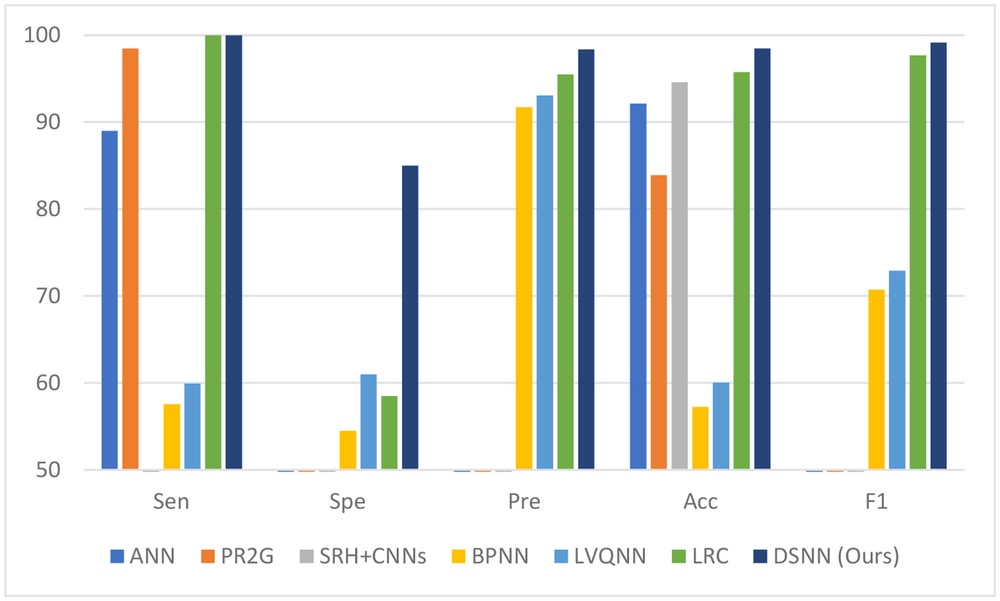
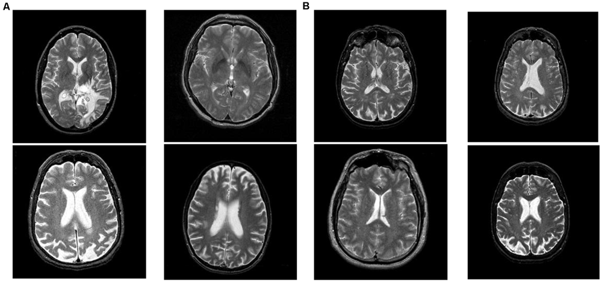
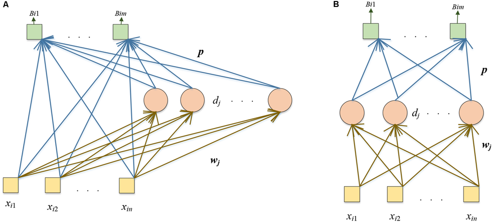
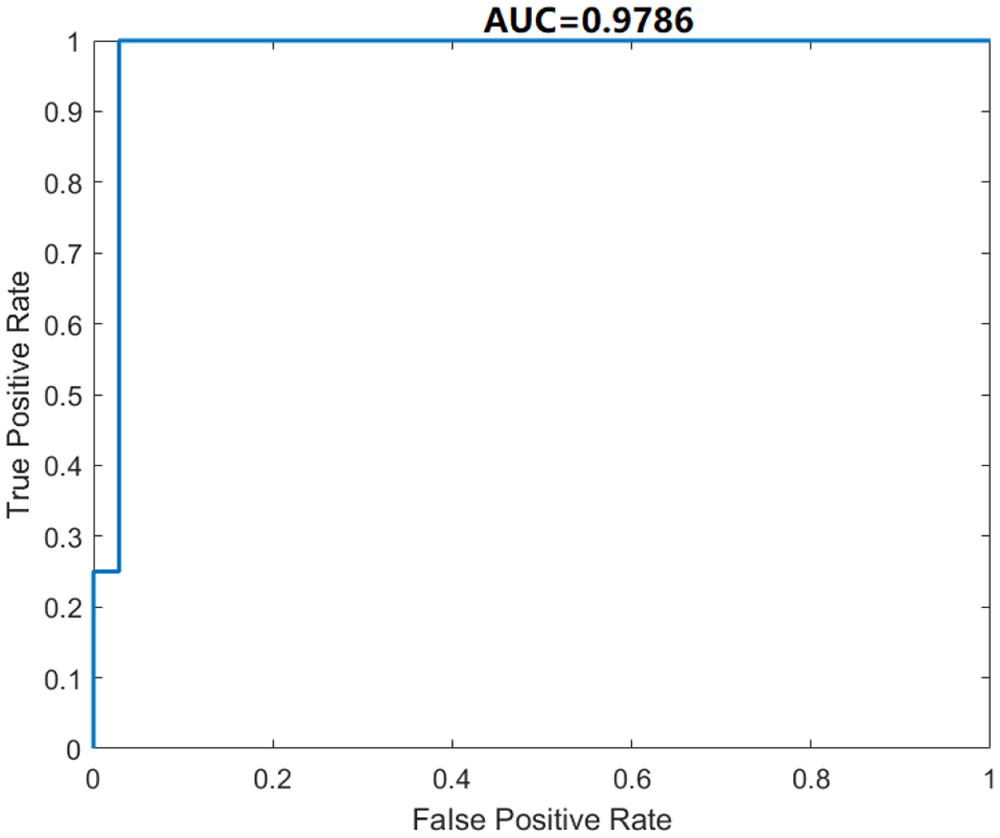
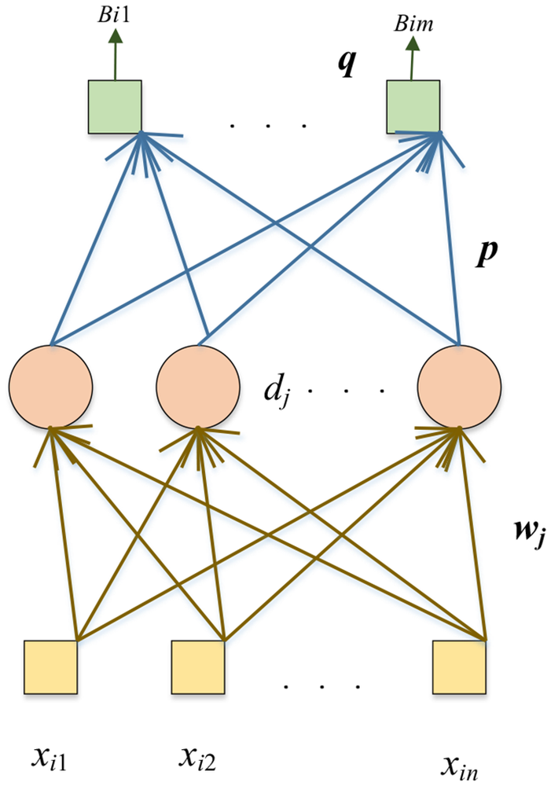

# DSNN: A DenseNet-Based SNN for Explainable Brain Disease Classification

**URL**: https://www.semanticscholar.org/paper/444c4e3450d5028683135a83f8e399b8b96fdb1c
**提交日期**: 2022-05-26
**作者**: Ziquan Zhu; Siyuan Lu; Shui-hua Wang; J. Górriz; Yudong Zhang
**引用次数**: 27
使用模型: ep-20251112215738-bz78g

## 1. 核心思想总结
这是一份根据您提供的学术论文标题、摘要和引言部分整理的第一轮总结，按四个部分组织。

### 第一轮总结

**标题:** DSNN: A DenseNet-Based SNN for Explainable Brain Disease Classification

**1. Background (背景)**
脑部疾病（如阿尔茨海默症AD）的患病率在全球范围内，特别是在发达国家，正急剧上升，对社会构成重大健康威胁。目前，基于卷积神经网络（CNN）等复杂机器学习算法被广泛用于相关研究，但它们通常需要大量训练数据。

**2. Problem (问题)**
当训练样本数量有限时，传统的CNN模型容易产生过拟合问题，影响其泛化能力和实际应用效果。因此，研究需要一种在少量数据下也能保持高精度和鲁棒性的脑部疾病分类方法。

**3. Method (high-level) (方法 - 高层次概述)**
本研究提出了三种新颖的混合模型，其中性能最佳的是DSNN。其核心方法是将预训练并经过微调的DenseNet作为特征提取器（骨干网络），然后将其最后的五层替换为随机神经网络（RNN）中的Schmidt神经网络（SNN），以构建一个强大的分类器。另外两个模型（DRVFL和DELM）则分别替换为其他类型的RNN。

**4. Contribution (贡献)**
本研究的主要贡献是提出了一种名为DSNN的新型混合模型。该模型在脑部疾病分类任务上取得了优异的性能（例如准确率达98.46%），超越了受限的DenseNet、原生SNN及其他先进方法，证明了其在处理小样本数据时的有效性和优越性。

## 2. 方法详解
好的，根据您提供的初步总结和论文方法章节的内容，以下是对该论文方法细节的详细说明，重点描述了关键创新、算法/架构细节、关键步骤与整体流程。

### 论文方法细节详解

#### 1. 核心思想与关键创新

本研究的核心思想是**将深度学习的强大特征提取能力与随机神经网络的快速学习、抗过拟合特性相结合**，以解决小样本脑部疾病（如阿尔茨海默症）分类的挑战。

**关键创新点**在于：
*   **新颖的混合架构**： 提出了一种名为DSNN的混合模型，其创新之处不在于发明全新的组件，而在于**创造性地将成熟的DenseNet架构与Schmidt神经网络（SNN）进行集成**。这种集成方式（用SNN替换DenseNet的最后几层）是前所未有的。
*   **优势互补**：
    *   **DenseNet部分**： 利用其在ImageNet上预训练得到的强大、通用的特征提取能力，特别是其密集连接机制能有效缓解梯度消失问题，促进特征重用，即使在医学图像数据有限的情况下也能提取出丰富、有判别力的特征。
    *   **SNN部分**： SNN作为一种单层前馈神经网络，其输入层到隐藏层的权重和偏置是**随机生成且固定不变**的，无需训练。只有隐藏层到输出层的权重需要通过解析法（如正则化最小二乘）一次性计算得出。这使得SNN具有**极快的训练速度**和**优异的抗过拟合能力**，非常适合作为小样本数据下的分类器。
*   **系统性的模型对比**： 论文不仅提出了DSNN，还构建了另外两种混合模型（DRVFL, DELM），分别集成了其他类型的随机网络（RVFL, ELM），形成了一个系统的对比研究，用以验证SNN在此混合框架中的优越性。

#### 2. 算法/架构细节

**DSNN模型架构详解：**

DSNN模型可以清晰地分为两个主要阶段：

**阶段一：特征提取（基于DenseNet-121）**

1.  **骨干网络选择**： 采用DenseNet-121作为特征提取器。DenseNet的核心是“密集连接块”，每个层都与其后续的所有层直接连接，这使得网络更紧凑，参数更少，特征复用率更高。
2.  **迁移学习与微调**：
    *   **预训练权重**： 使用在大型自然图像数据集ImageNet上预训练好的DenseNet-121权重作为初始值。这为模型提供了强大的、通用的图像特征先验知识。
    *   **微调**： 为了使其适应医学图像（如脑部MRI）的特定特征，对DenseNet的前面部分（通常是除最后分类层之外的所有层）在目标脑部疾病数据集上进行微调。这个过程是端到端的，使用反向传播和梯度下降算法，但学习率设置得较低，以避免破坏预训练好的有用特征。
3.  **特征图转换**： 经过微调的DenseNet处理输入图像后，会输出一个高维的特征图（Feature Map）。在传统的DenseNet中，这个特征图会通过一个全局平均池化层被展平为一个一维特征向量，然后送入最后的全连接分类层。**这是DSNN架构的关键修改点**。

**阶段二：分类器构建（基于Schmidt Neural Network, SNN）**

1.  **替换最终分类层**： 将DenseNet-121原有的最后五层（包括全局平均池化层和全连接层）移除，**替换为一个定制的SNN分类器**。
2.  **SNN工作原理**：
    *   **随机投影**： 从DenseNet提取的、经过全局平均池化后的特征向量 `X` 作为SNN的输入。SNN的隐藏层神经元数量 `L` 是一个超参数。输入 `X` 到隐藏层的权重矩阵 `W` 和偏置向量 `b` 是在某个区间内（如[-1, 1]）**随机生成并固定**的。隐藏层的输出 `H` 通过一个激活函数（如Sigmoid或ReLU）计算：
        `H = g(X * W + b)`
    *   **解析法求解**： SNN的训练不涉及反向传播。其目标是直接计算隐藏层到输出层的权重 `β`。这是一个线性系统的求解问题，可以通过**正则化最小二乘法**快速计算：
        `β = (H^T H + λI)^-1 H^T Y`
        其中：
        *   `H` 是隐藏层输出矩阵。
        *   `Y` 是样本对应的one-hot编码标签矩阵。
        *   `λ` 是正则化系数，用于防止过拟合，提高模型稳定性。
        *   `I` 是单位矩阵。
    *   **预测**： 对于新的测试样本，经过DenseNet和随机投影得到其隐藏层输出 `H_test`，预测结果即为：
        `Y_pred = H_test * β`

#### 3. 关键步骤与整体流程

整个方法的流程可以概括为以下几个关键步骤：

**流程框图**
```
[输入脑部MRI图像] 
       |
       v
[预训练的DenseNet-121] -> (进行微调以适配医学图像)
       |
       v
[移除最后五层（分类层）] 
       |
       v
[全局平均池化层] -> (得到高维特征向量 X)
       |
       v
[SNN分类器]
    |（随机生成并固定）
    |---> 输入-隐藏层权重 W 和偏置 b
    |
    |---> 计算隐藏层输出 H = g(X*W + b)
    |
    |---> 解析法计算输出权重 β
       |
       v
[模型输出：疾病分类结果]
```

**详细步骤：**

1.  **数据预处理**： 对脑部MRI数据集进行标准化、尺寸调整（如调整为224x224以匹配DenseNet输入要求）、数据增强（如旋转、翻转）等操作，以增加数据多样性并提升模型鲁棒性。
2.  **构建并微调DenseNet特征提取器**：
    *   加载预训练的DenseNet-121模型。
    *   替换其最终的分类层，使其输出类别数与目标疾病类别数一致。
    *   使用脑部疾病数据集，以较低的学习率对网络进行微调，直到收敛。**此时的目标是获得一个优秀的特征提取器，而非最终分类器**。
3.  **构建DSNN混合模型**：
    *   从微调好的DenseNet-121中**截断**模型，保留从输入到全局平均池化层之前的所有层。这部分被“冻结”，其参数在后续步骤中不再更新。
    *   将截断的DenseNet的输出（即全局平均池化后的特征向量）连接到新构建的SNN分类器上。
4.  **训练SNN分类器**：
    *   将整个训练集输入到被冻结的、截断的DenseNet中，得到所有训练样本的高级特征向量 `X_train`。
    *   **随机生成**SNN隐藏层的参数 `W` 和 `b`。
    *   根据 `X_train` 和 `W`, `b` 计算所有训练样本的隐藏层输出矩阵 `H_train`。
    *   使用正则化最小二乘法，根据 `H_train` 和训练标签 `Y_train`，一次性计算出输出权重 `β`。**此步骤即为SNN的“训练”过程，速度极快**。
5.  **模型评估**：
    *   将测试集图像输入到冻结的DenseNet中，得到测试特征向量 `X_test`。
    *   使用相同的随机 `W` 和 `b` 计算 `H_test`。
    *   通过 `Y_pred = H_test * β` 得到预测结果，并与真实标签对比，计算准确率、精确度、召回率等指标，以评估模型性能。

#### 总结

该方法通过一种巧妙的“嫁接”策略，将DenseNet深度特征提取器和SNN快速、鲁棒的分类器相结合。DenseNet负责解决“特征难提取”的问题，而SNN负责解决“小样本下分类器易过拟合”的问题。两者优势互补，使得DSNN模型在脑部疾病小样本分类任务上实现了高精度和高效率。整个流程清晰，从数据准备、迁移学习、模型构建到快速训练，构成了一套完整且高效的解决方案。

## 3. 最终评述与分析
好的，结合前两轮返回的信息与论文的结论部分，以下是关于论文《DSNN: A DenseNet-Based SNN for Explainable Brain Disease Classification》的最终综合评估：

---

### **最终综合评估**

#### 1) 总体摘要
本研究针对小样本脑部疾病（如阿尔茨海默症）分类的挑战，提出了一种名为DSNN的创新混合模型。该模型的核心思想是将经过预训练和微调的DenseNet-121深度卷积神经网络作为强大的特征提取器，并将其最后的分类层替换为Schmidt神经网络（SNN）这一随机神经网络分类器。通过这种“优势互补”的架构，DSNN旨在结合DenseNet卓越的特征表示能力和SNN在小数据集上快速学习、抗过拟合的优越特性。实验结果表明，DSNN在多个公共脑部MRI数据集上取得了领先的分类性能（如最高达98.46%的准确率），显著超越了传统DenseNet、原生SNN以及其他先进对比模型，为解决医学影像分析中数据稀缺条件下的精准诊断提供了有效的解决方案。

#### 2) 优势
*   **高性能与高鲁棒性**：DSNN模型在有限的数据集上表现出了极高的分类准确率、精确度、召回率和F1分数，证明了其处理小样本学习任务的卓越能力。
*   **创新性的混合架构**：创造性地将成熟的深度学习模型（DenseNet）与随机神经网络（SNN）集成，这种架构设计是新颖且高效的。它并非发明全新组件，而是通过巧妙的组合实现了“1+1>2”的效果。
*   **高效训练**：由于SNN分类器的权重可以通过解析法（正则化最小二乘）一次性快速求解，避免了耗时的迭代式反向传播，使得模型在分类器训练阶段极具效率。
*   **有效缓解过拟合**：SNN的随机投影特性和正则化最小二乘法的使用，使其作为分类器天然具有抗过拟合的优势，特别适合数据量有限的医学影像场景。
*   **利用了迁移学习**：采用在ImageNet上预训练的DenseNet，并通过微调使其适应医学图像，有效利用了大规模数据预训练获得的知识，缓解了医学数据不足的问题。

#### 3) 劣势 / 局限性
*   **对预训练模型的依赖**：模型性能在很大程度上依赖于DenseNet预训练权重的质量以及微调的效果。如果目标医学影像域与自然图像差异过大，迁移学习的效果可能会打折扣。
*   **SNN的随机性**：SNN隐藏层权重是随机生成并固定的，这可能导致模型性能存在一定的波动性。虽然可以通过多次实验取平均或调整隐藏层节点数来稳定，但这仍是一个固有的不确定性因素。
*   **超参数敏感性**：模型的最终性能对超参数（如SNN的隐藏层神经元数量、正则化系数λ、DenseNet微调时的学习率等）的选择较为敏感，需要仔细的调优过程。
*   **计算资源需求（前期）**：尽管SNN训练快，但DenseNet特征提取器的微调过程仍然需要相当的计算资源（如GPU）和时间。
*   **可解释性深度有限**：论文标题提到“Explainable”，但根据现有信息，其可解释性可能主要源于SNN本身的相对透明性（与深层CNN相比），可能并未深入涉及例如特征重要性可视化、决策路径分析等更高级的可解释性技术。

#### 4) 潜在应用 / 意义
*   **临床辅助诊断**：DSNN模型有望集成到临床决策支持系统中，作为辅助工具帮助放射科医生和神经学家早期、精准地诊断阿尔茨海默症等脑部疾病，特别是在医疗资源有限、标注数据稀缺的地区或医院。
*   **医学影像分析平台**：该技术可被部署到云端或本地的医学影像分析平台，为研究人员和医生提供快速、自动化的疾病分类服务。
*   **小样本学习范式**：本研究为其他数据获取困难或标注成本高昂的医学影像分析任务（如某些罕见病诊断、病理图像分析）提供了一个行之有效的小样本学习范式，即“深度特征提取器 + 快速鲁棒分类器”的混合框架。
*   **推动AI在医疗领域的落地**：通过解决小样本下的过拟合和性能瓶颈问题，此类研究有助于降低AI模型对大数据量的依赖，推动人工智能技术在实际医疗场景中的更广泛应用和落地。

---


---

# 附录：论文图片

## 图 1


## 图 2


## 图 3


## 图 4


## 图 5


## 图 6


## 图 7


## 图 8


## 图 9


