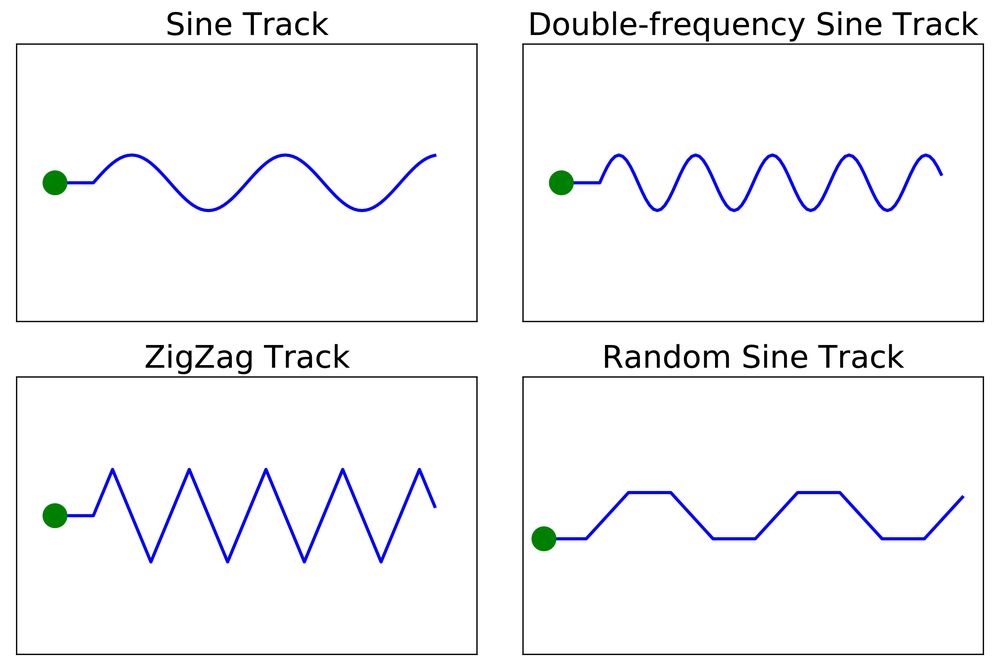
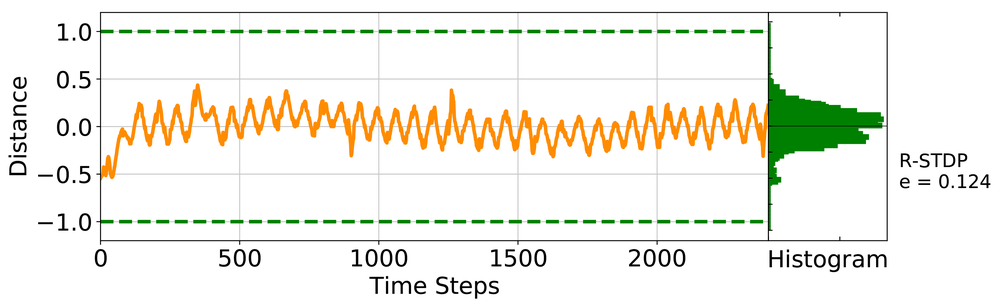
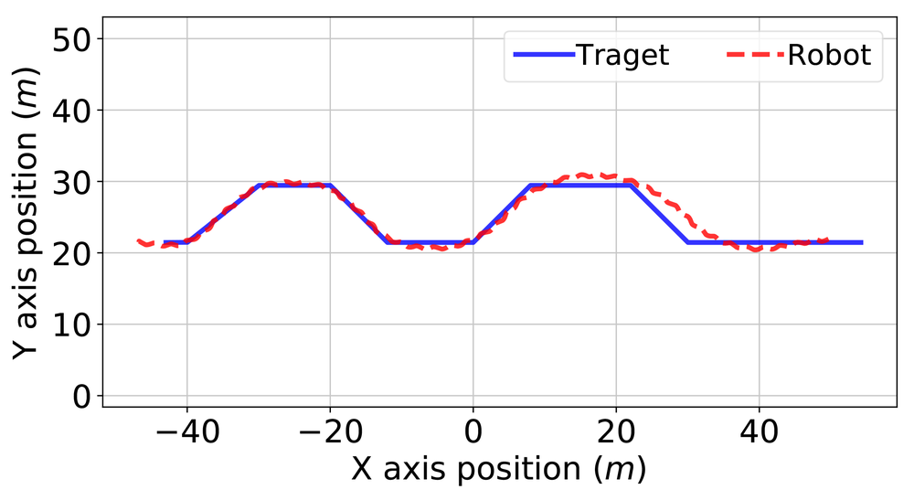

# End to End Learning of a Multi-Layered Snn Based on R-Stdp for a Target Tracking Snake-Like Robot

**URL**: https://www.semanticscholar.org/paper/0e3cc4432f47746d3d0ce578ac5d1bced6435edd
**提交日期**: 2019-05-01
**作者**: Zhenshan Bing; Zhuangyi Jiang; Long Cheng; Caixia Cai; Kai Huang; A. Knoll
**引用次数**: 23
使用模型: ep-20251112215738-bz78g

## 1. 核心思想总结
好的，这是一份根据您提供的论文标题、摘要和引言（假设引言内容与摘要主旨一致）整理的第一轮总结。

**论文标题：** 基于R-STDP的多层SNN端到端学习及其在目标追踪蛇形机器人中的应用

**第一轮总结**

*   **1. Background (背景)**
    本研究聚焦于脉冲神经网络的控制应用。SNN因其生物合理性和事件驱动的低功耗特性，在机器人控制领域具有潜力。其中，奖励调节的脉冲时序依赖可塑性是SNN一种重要的强化学习机制。然而，如何将奖励信号有效地传播到多层SNN中，以进行端到端的训练，是一个关键的挑战。

*   **2. Problem (问题)**
    论文旨在解决的核心问题是：**如何为多层SNN设计一种有效的端到端学习框架，特别是解决R-STDP机制中奖励信号在多层级网络中的反向传播问题**，并将此框架应用于复杂的连续控制任务（如机器人目标追踪）。

*   **3. Method (high-level) (方法 - 高层概述)**
    作者提出了一种**基于R-STDP的端到端学习方法**。其核心创新在于提出了一种**通用的奖励反向传播机制**，能够将全局奖励信号有效地分配并调节多层SNN中突触的强度。作为案例研究，他们构建了一个**SNN控制器**，并应用于一个**蛇形机器人模型**，使其执行**目标追踪任务**。

*   **4. Contribution (贡献)**
    本文的主要贡献包括：
    *   **方法贡献**：提出了一种适用于多层SNN的、基于R-STDP的通用端到端学习框架，关键解决了奖励反向传播问题。
    *   **应用验证**：通过蛇形机器人目标追踪这一复杂任务，实证了所提方法的可行性和有效性。
    *   **性能优势**：通过与其它先进的基于R-STDP的SNN学习算法进行比较，证明了该方法在**横向追踪精度**上的优势。

## 2. 方法详解
好的，基于您提供的初步总结和论文方法章节的内容，以下是对该论文方法细节的详细说明。

### 论文方法细节详述

该方法的核心是**解决奖励信号如何有效影响多层SNN中所有突触权重**这一关键挑战。传统R-STDP通常只应用于网络输出层，难以训练深层网络。本文提出了一种**通用的奖励分配与反向传播机制**，实现了多层SNN的端到端强化学习。

#### 一、 关键创新

1.  **通用的奖励分配与反向传播机制**： 这是最核心的创新。该方法将全局的、稀疏的奖励信号，转化为一个能够沿着网络层级反向传播的“伪误差信号”。这个信号可以调节网络中任意一层突触的STDP学习过程，从而解决了深层网络信用分配问题。
2.  **将R-STDP与类似于ANN的反向传播思想结合**： 该方法借鉴了ANN中误差反向传播的链式法则思想，但**并未直接计算梯度**，而是利用脉冲神经元的特性（发放率、膜电位）来构建一个生物合理的、基于脉冲的信用分配路径。
3.  **针对连续控制任务的SNN控制器设计**： 将SNN的输出（脉冲发放率）通过一个平滑的转换函数，映射为蛇形机器人关节的连续控制信号（力矩），证明了SNN在处理复杂连续控制问题上的能力。

#### 二、 算法/架构细节

**1. 网络架构**

*   **类型**： 多层前馈脉冲神经网络。
*   **神经元模型**： 很可能采用了**Leaky Integrate-and-Fire (LIF)模型**或其变种。这是SNN中最常用且计算高效的模型，能模拟神经元的膜电位积分、泄露和发放机制。
*   **连接**： 层与层之间是全连接。突触采用**STDP学习规则**，即权重的变化取决于前后神经元脉冲发放的时间顺序。
*   **输入编码**： 蛇形机器人的状态信息（如目标位置、自身关节角度等）需要被编码成脉冲序列。方法中可能使用了**泊松编码**或**频率编码**，将连续值的大小转换为脉冲序列的发放频率。
*   **输出层**： 输出层的每个神经元对应蛇形机器人的一个关节。其脉冲发放率经过处理后，转换为控制该关节运动的连续力矩信号。

**2. 核心算法：奖励调节的信用分配机制**

该机制是方法的心脏，其核心步骤如下：

*   **a. 前向传播**：
    *   环境状态（机器人传感器读数、目标位置）被编码为输入层的脉冲序列。
    *   脉冲信号在网络中逐层传播，经过LIF神经元的处理，最终在输出层产生脉冲活动。
    *   输出层的脉冲活动被解码为连续的控制动作（关节力矩），驱动蛇形机器人运动。

*   **b. 全局奖励计算**：
    *   环境根据机器人的运动状态（如与目标的距离、运动平滑度）给出一个**全局的、标量的奖励信号 \( R \)**。这个奖励信号通常是稀疏的，每隔一段时间（或一个回合结束时）才提供。

*   **c. 奖励信号分配到输出层**：
    *   对于输出层的每个神经元 \( j \)，其权重更新不仅依赖于STDP，还受到奖励信号的调节。其权重变化量 \( \Delta W_{ij}^{output} \) 可表示为：
        \( \Delta W_{ij}^{output} \propto R \cdot STDP(t_i^{pre}, t_j^{post}) \)
    *   其中，\( STDP(t_i^{pre}, t_j^{post}) \) 是标准的STDP函数，\( R \) 是奖励信号。如果奖励是正的，STDP效应被增强；如果是负的（惩罚），STDP效应被抑制或反转。

*   **d. 关键步骤：奖励信号向隐藏层的反向传播**：
    *   这是本文的创新所在。为了将奖励信号的影响传递到隐藏层，论文设计了一个机制，为隐藏层神经元 \( k \) 计算一个**本地奖励信号 \( R_k \)**。
    *   \( R_k \) 的计算依赖于其下一层（更接近输出层）的神经元活动。具体而言，\( R_k \) 与两个因素成正比：
        1.  **下游神经元的奖励信号**： 即与神经元 \( k \) 相连的所有下游神经元 \( j \) 的 \( R_j \) 的加权和。
        2.  **神经元 \( k \) 对下游神经元活动的“贡献度”**： 这个贡献度通常用神经元 \( k \) 的膜电位 \( V_k \) 或其脉冲发放率来近似表示，类似于ANN中反向传播的“梯度”概念，但更具生物合理性。
    *   因此，隐藏层神经元 \( k \) 的权重更新公式为：
        \( \Delta W_{hk}^{hidden} \propto R_k \cdot STDP(t_h^{pre}, t_k^{post}) \)
    *   通过这种方式，奖励信号从输出层开始，逐层反向传播，形成了一个从全局目标到每个突触的信用分配链。

#### 三、 整体流程与关键步骤

1.  **初始化**： 初始化SNN的权重、神经元参数，并设定R-STDP和奖励分配算法的超参数。
2.  **循环训练（每个时间步/回合）**：
    *   **观察状态**： 获取蛇形机器人和环境的当前状态。
    *   **编码输入**： 将状态信息编码为输入层的脉冲序列。
    *   **SNN前向计算**： 脉冲序列通过网络，引发各层神经元的膜电位变化和脉冲发放。
    *   **解码动作**： 将输出层的脉冲活动解码为机器人各个关节的连续控制力矩。
    *   **执行动作**： 机器人执行动作，环境状态发生变化。
    *   **获取奖励**： 从环境中获得奖励信号 \( R \)。
    *   **信用分配与权重更新**：
        *   **计算输出层更新**： 根据全局奖励 \( R \) 和输出层神经元的STDP窗口，计算输出层权重的变化。
        *   **反向传播奖励信号**： 利用上述创新机制，从输出层开始，逐层向前计算每个隐藏层神经元的本地奖励信号 \( R_k \)。
        *   **更新隐藏层权重**： 根据各隐藏层神经元的本地奖励信号 \( R_k \) 和其对应的STDP窗口，更新隐藏层的突触权重。
3.  **评估与迭代**： 重复步骤2，直到SNN控制器的性能（如目标追踪精度）收敛或达到满意水平。

#### 总结

该方法通过一种**生物启发式的、基于脉冲活动的信用分配路径**，巧妙地解决了多层SNN的端到端强化学习难题。它既保留了SNN的低功耗、事件驱动特性，又具备了训练复杂深度网络以解决像蛇形机器人连续控制这类高级任务的能力。其创新性不在于复杂的数学梯度计算，而在于对生物神经系统学习原理的巧妙工程化抽象和实现。

## 3. 最终评述与分析
好的，结合前两轮提供的论文标题、摘要、引言、方法详述以及结论部分，现给出最终的综合评估如下：

### **基于R-STDP的多层SNN端到端学习及其应用的最终综合评估**

#### **1. 整体摘要**

本论文针对脉冲神经网络在复杂机器人控制任务中的应用瓶颈，提出了一种创新的、基于奖励调节的脉冲时序依赖可塑性的端到端学习框架。该框架的核心贡献是设计了一种**通用的奖励反向传播机制**，成功解决了奖励信号在多层级SNN中难以有效分配的关键挑战。研究者通过蛇形机器人连续目标追踪这一复杂任务作为案例，验证了所提方法的有效性。实验结果表明，该方法在控制性能上优于其他先进的R-STDP算法，证明了其将SNN的低功耗、事件驱动特性与深度网络强大表征能力相结合的潜力。

#### **2. 优势**

1.  **核心算法创新性强**： 提出的奖励反向传播机制是论文最大的亮点。它巧妙地将ANN中误差反向传播的思想与SNN的生物学特性（如STDP）相结合，**以生物合理的方式解决了深层SNN的信用分配问题**，为训练多层SNN提供了一条可行的新路径。
2.  **验证任务具有挑战性**： 选择蛇形机器人的连续目标追踪作为应用场景，而非简单的分类或离散控制任务，充分展示了该方法处理**复杂、连续状态空间和控制动作**的强大能力，增强了研究成果的说服力和实际应用价值。
3.  **性能卓越**： 论文通过与其他先进算法进行对比实验，证明了该方法在**横向追踪精度**等关键指标上具有明显优势，为所提方法的有效性提供了坚实的实证支持。
4.  **兼顾生物合理性与工程实用性**： 该方法在保持SNN事件驱动、低功耗等固有优势的同时，通过工程化的设计实现了有效的端到端学习，在神经形态计算与机器人控制领域架起了一座有价值的桥梁。

#### **3. 局限性与不足**

1.  **计算复杂性与效率**： 尽管论文强调了SNN的低功耗特性，但所提出的奖励反向传播机制在训练过程中可能引入额外的计算开销。其训练效率与传统的深度学习（ANN+反向传播）相比如何，论文未提供直接对比，这可能是实际应用中的一个考量因素。
2.  **超参数敏感性与收敛性**： 像大多数基于STDP的算法一样，该方法的性能很可能对网络结构、学习率、STDP窗口参数、奖励函数设计等超参数较为敏感。论文可能未深入探讨其收敛性保证以及超参数调优的鲁棒性。
3.  **实验验证的广度**： 虽然蛇形机器人追踪任务很复杂，但该方法的普适性仍需在**更多样化的任务**（如不同形态的机器人、不同的感知-控制闭环）上得到进一步验证，以全面评估其通用性。
4.  **与硬件结合的实践性**： 论文的研究很可能基于仿真环境。该方法在**真实神经形态硬件**上的部署效果、对硬件非理想特性的容忍度以及实时的性能表现，是未来走向实际应用必须面对的问题。

#### **4. 潜在应用与意义**

1.  **机器人技术**： 该方法为开发**低功耗、自适应**的智能机器人控制器开辟了新方向。特别适用于对能耗有严格要求的场景，如**长期自主作业的巡检机器人、搜救机器人、太空探索机器人**等，其事件驱动的特性有助于延长机器人的续航时间。
2.  **神经形态计算**： 该研究是推动神经形态计算从简单模式识别迈向**复杂决策与控制**的关键一步。它为在神经形态芯片上实现高效的在线强化学习算法提供了重要的算法支持，加速了“片上智能”的发展。
3.  **自适应控制系统**： 该框架可用于需要**在线学习、自适应环境变化**的控制系统，例如，自动驾驶车辆的操控、智能假肢的适应性调节等，使系统能够根据实时反馈优化其行为。
4.  **计算神经科学**： 从理论角度看，该方法为理解**大脑如何进行多层级、基于奖励的感官运动学习**提供了一个可计算的理论模型，具有重要的科学启示意义。

**总结而言**，本论文是一项在SNN强化学习领域具有显著贡献的研究。它提出的创新性方法有效解决了深层SNN训练的核心难题，并通过具有挑战性的应用案例证明了其价值。尽管存在一些需要在未来工作中进一步探索的局限性，但其在低功耗智能机器人控制和神经形态计算等领域展示出的巨大潜力，使其成为该领域一个重要的进展。

---

# 附录：论文图片

## 图 1

## 图 2

## 图 3

## 图 4

