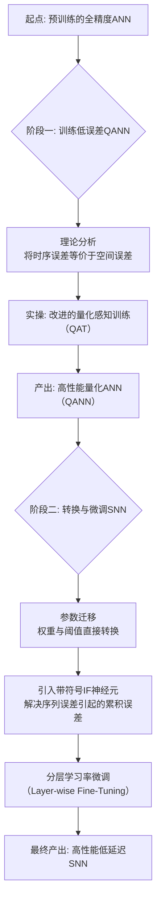
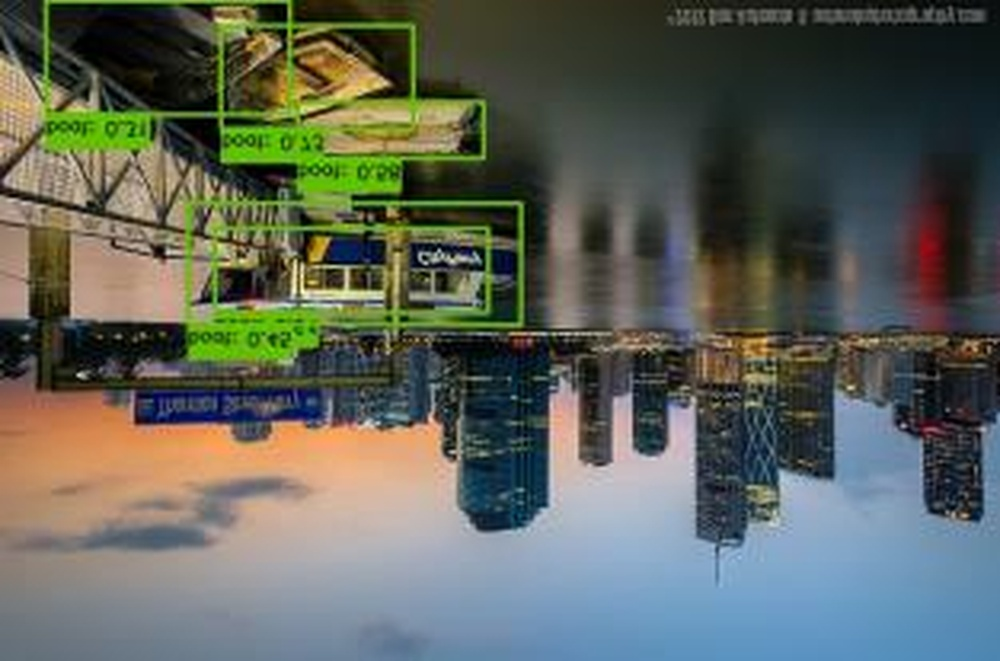
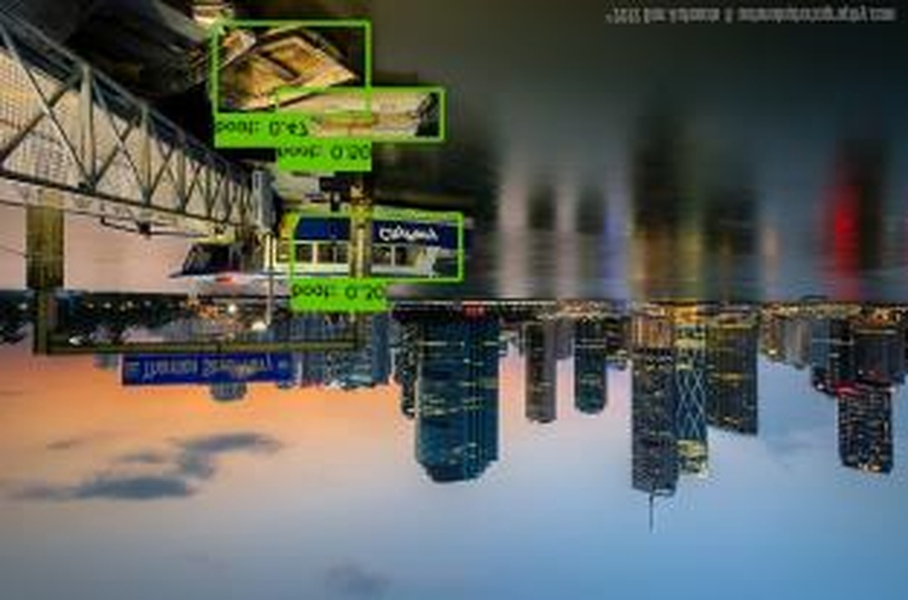
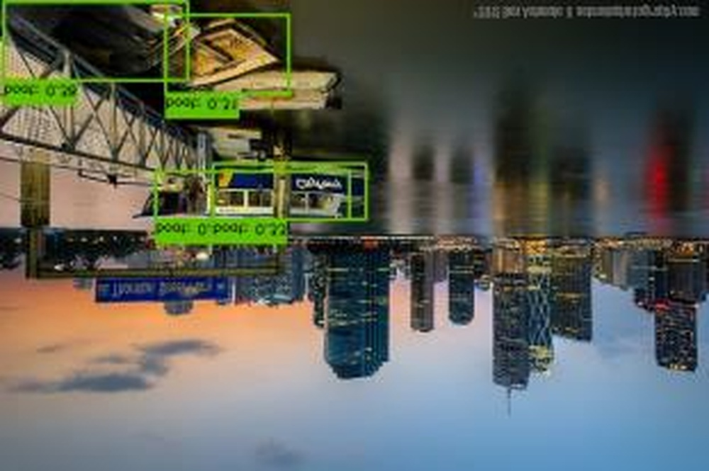
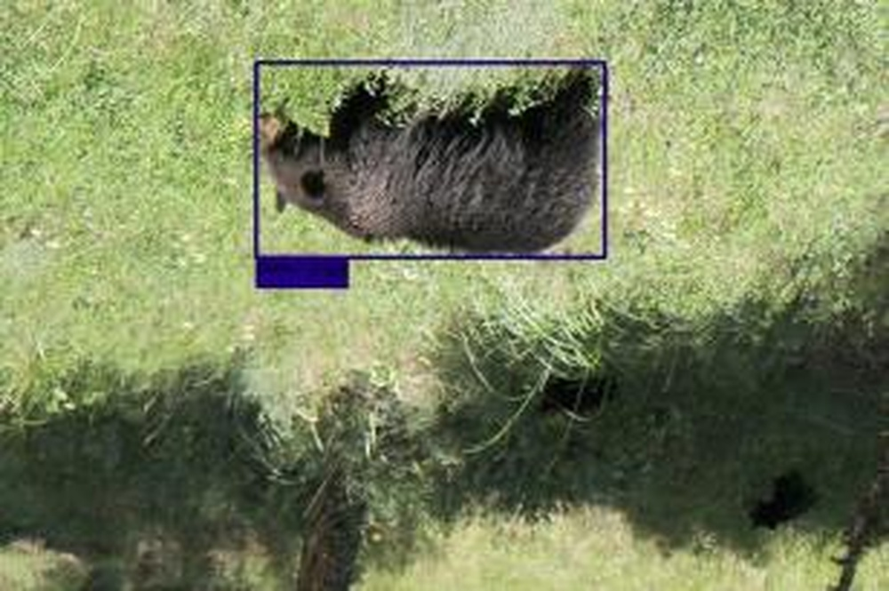
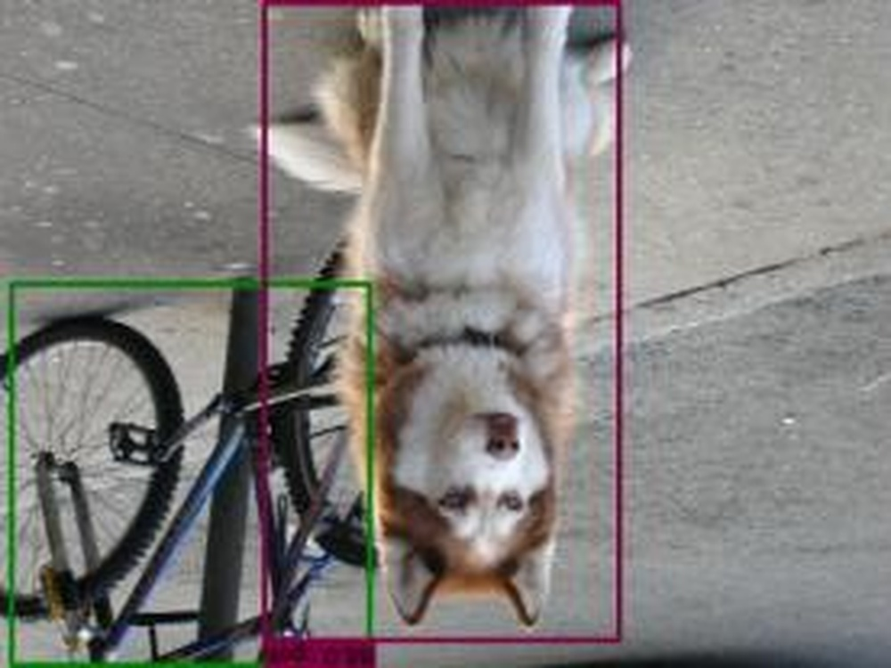
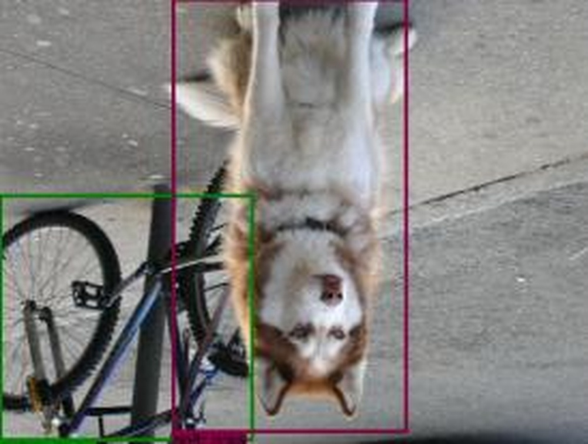

# Fast-SNN: Fast Spiking Neural Network by Converting Quantized ANN

**URL**: https://www.semanticscholar.org/paper/8fa44efea525b8bd930440221c334ff7646efa98
**提交日期**: 2023-05-31
**作者**: Yang‐Zhi Hu; Qian Zheng; Xudong Jiang; Gang Pan
**引用次数**: 78
使用模型: ep-20251112215738-bz78g

## 1. 核心思想总结
这是一份关于论文《Fast-SNN: Fast Spiking Neural Network by Converting Quantized ANN》的第一轮总结，按四个部分组织如下：

### 1. Background (背景)
脉冲神经网络（SNN）因其事件驱动的特性和使用加法替代能耗较高的乘法运算，在计算和能效方面相比传统人工神经网络（ANN）具有潜在优势。然而，SNN的离散脉冲函数使其难以直接训练。ANN-to-SNN转换是一种流行的替代方法，但存在显著缺陷。

### 2. Problem (问题)
现有的ANN-to-SNN转换方法存在量化误差和累积误差，导致SNN需要很长的模拟时间步数（即高推理延迟）才能达到高精度。这种高延迟严重削弱了SNN在能效和速度上的核心优势。

### 3. Method (高层次方法)
本文提出Fast-SNN框架以实现低延迟和高性能。其核心方法包括：
*   **误差最小化转移**：首先，通过理论分析将SNN中的时序量化误差等价于ANN中的空间量化误差，从而将问题转化为对量化ANN（QANN）的训练，以最小化量化误差。
*   **累积误差处理**：在低量化误差的基础上，指出序列误差是累积误差的主因，并相应提出了**带符号的IF神经元模型**和**分层微调机制**来解决该问题。

### 4. Contribution (贡献)
本工作的主要贡献是提出了Fast-SNN，它通过系统性地最小化转换过程中的关键误差，实现了**最先进的性能**和**极低的推理延迟**。该方法在图像分类、目标检测和语义分割等多个计算机视觉任务上得到了验证。

## 2. 方法详解
好的，基于您提供的初步总结和论文方法章节的内容，以下是对论文《Fast-SNN: Fast Spiking Neural Network by Converting Quantized ANN》方法细节的详细说明。

### 论文方法细节详解

本文的核心目标是解决ANN-to-SNN转换中存在的高延迟问题。其方法流程可以概括为三个关键阶段，环环相扣，系统地解决了从**理论误差分析**到**模型转换**再到**误差修正**的全过程。

#### 整体流程概览

1.  **理论奠基与问题转化**：通过理论分析，将SNN转换中的**时序量化误差**等价于ANN中的**空间量化误差**。这使得我们可以通过训练一个低量化误差的量化ANN来间接最小化SNN的误差。
2.  **量化ANN训练**：使用改进的量化感知训练技术，训练一个高性能的量化ANN作为转换的源模型。
3.  **SNN转换与误差修正**：将训练好的QANN参数直接迁移到SNN中，并引入两个关键创新（带符号的IF神经元和分层微调）来进一步解决残留的累积误差。

整个方法的流程图可以直观地展示如下：

---

#### 关键创新一：误差最小化转移——从时序域到空间域

这是本文的理论基石和创新起点。

*   **问题本质**：在ANN-to-SNN转换中，ANN连续的激活值（如ReLU的输出）需要被SNN的脉冲发放率所模拟。由于脉冲是0/1的离散事件，这个过程本质上是一种**时序上的量化**。每个时间步的模拟值与实际脉冲之间的差异就是**时序量化误差**。随着时间步的推移，这些误差会累积，导致SNN需要很长时间才能逼近ANN的精度。
*   **核心洞察**：论文发现，SNN中的这种**时序量化误差**在数学形式上与ANN中常见的**权值和激活值量化误差**（即空间量化误差）高度相似。两者都源于用低精度表示（离散脉冲/整型数值）去逼近高精度表示（连续激活值/浮点权重）。
*   **方法实现**：基于这一等价关系，作者将“训练一个低时序误差的SNN”这一难题，转化为一个更成熟、更容易解决的问题：“**训练一个低空间量化误差的量化ANN**”。只要QANN的量化误差足够小，转换得到的SNN的初始误差也会很小。为此，论文采用了**量化感知训练**，并在训练过程中引入了一些技巧（如学习率调整、对初始层和末层使用更高精度）来优化QANN的性能。

**此步骤的意义**：它从根本上降低了SNN的“起点”误差，为实现低延迟打下了坚实基础。

---

#### 关键创新二：处理累积误差——带符号的IF神经元模型

即使在量化误差最小化之后，由于SNN的动力学特性，**累积误差**仍然是低时间步下性能下降的主要原因。论文进一步将累积误差分解为**序列误差**和**形状误差**，并指出**序列误差是主要矛盾**。

*   **序列误差的产生**：在标准的IF神经元中，膜电位在发放脉冲后复位（如重置到零）。当输入电流为负时（对应ANN中ReLU的负输入），标准的IF神经元无法处理，因为膜电位只能积分正值。然而，在转换过程中，负的输入电流是普遍存在的（例如，下一层的输入是上一层脉冲与权重矩阵的乘积，权重有正有负）。这导致神经元的实际积分值与ANN中期望的积分值之间产生偏差，这种偏差就是**序列误差**。它会随着网络层次加深而累积。
*   **创新解决方案：带符号的IF神经元**
    *   **机制**：该模型为每个神经元引入了**两个独立的膜电位变量**：一个用于积分正输入（\(V^+\)），另一个用于积分负输入（\(V^-\)）。
    *   **脉冲发放**：当正膜电位 \(V^+\) 超过阈值时，神经元发放一个**正脉冲（+1）**，然后 \(V^+\) 复位。
    *   **负输入处理**：当负膜电位 \(V^-\) 的绝对值超过阈值时，神经元发放一个**负脉冲（-1）**，然后 \(V^-\) 复位。
    *   **优势**：这种设计允许神经元明确地表示和传递“负激活”信息，完美匹配了ANN中具有正负值的特征图。它从根本上消除了由负输入引起的序列误差，显著降低了层与层之间的累积误差。

**此步骤的意义**：这是实现超低延迟（如2-4时间步）的关键。它解决了标准转换模型在低时间步下的一个根本性缺陷。

---

#### 关键创新三：分层微调机制

即使解决了主要误差源，一些细微的误差（如**形状误差**，即脉冲发放的时间分布与期望的连续激活值形状之间的差异）仍然存在。为了最终优化SNN性能，论文提出了一个分层微调策略。

*   **机制细节**：
    1.  **参数转换**：首先，将QANN的参数直接迁移到SNN。通常，ANN的权重直接作为SNN的突触权重，ANN的激活阈值（或量化参数）作为SNN的神经元发放阈值。
    2.  **微调**：然后，使用基于脉冲的反向传播方法对转换后的SNN进行微调。
    3.  **关键技巧——分层学习率**：不同层对误差的敏感度不同。论文发现，靠近输入的层和靠近输出的层对性能影响更大。因此，在微调时，**为网络的不同部分设置不同的学习率**。通常，会给**第一层（输入层）和最后一层（输出层）分配较高的学习率**，而中间层使用较低的学习率。这允许网络更快地调整那些对输入和最终决策至关重要的层的参数。

**此步骤的意义**：这是一个精细化的后处理步骤，能够进一步补偿理论模型未能完全覆盖的微小误差，确保SNN在极低时间步下达到最优性能。

### 总结

Fast-SNN的方法论是一个系统性的、端到端的解决方案。它并非单一技术的突破，而是通过三个环环相扣的创新步骤，构建了一个完整的高效转换框架：

1.  **误差最小化转移** 将难题转化为可解问题，奠定了低误差基础。
2.  **带符号IF神经元** 解决了核心的累积误差问题，是实现超低延迟的突破点。
3.  **分层微调** 作为最后的质量优化，确保了模型性能的极致表现。

这套组合拳使得Fast-SNN能够在2-4个极短的时间步内达到与原始ANN相媲美的精度，真正发挥了SNN低延迟、低功耗的优势。

## 3. 最终评述与分析
好的，结合前两轮返回的论文初步总结、方法详述以及结论部分，以下是关于论文《Fast-SNN: Fast Spiking Neural Network by Converting Quantized ANN》的最终综合评估。

---

### 最终综合评估

#### 1) 整体摘要 (Overall Summary)
本论文提出了一种名为 **Fast-SNN** 的创新框架，旨在解决脉冲神经网络（SNN）通过人工神经网络（ANN）转换方法时存在的**高推理延迟**这一核心挑战。论文通过系统的理论分析和精巧的算法设计，将SNN转换中的时序误差问题转化为量化ANN的空间误差问题，并在此基础上引入了**带符号的IF神经元模型**和**分层微调机制**，成功地实现了在**极低时间步（低至2-4步）** 下达到与原始ANN相媲美的高精度。该方法的有效性在图像分类、目标检测和语义分割等多个视觉任务上得到了充分验证，标志着在实现实用、高效SNN的道路上取得了重大进展。

#### 2) 优势 (Strengths)
*   **理论基础扎实，创新性强**：论文的核心贡献在于建立了**时序量化误差**与**空间量化误差**之间的理论等价关系。这一洞察力是方法论的基石，使得能够利用成熟的量化ANN训练技术来间接优化SNN，思路新颖且严谨。
*   **系统性的解决方案**：Fast-SNN并非单一技巧的堆砌，而是一个环环相扣的完整框架。它系统地解决了从**初始误差最小化（通过QANN训练）** 到**核心累积误差消除（通过带符号IF神经元）**，再到**性能精细优化（通过分层微调）** 的全流程问题，展现了高度的完整性和系统性。
*   **性能卓越，实现突破性低延迟**：实验结果表明，该方法在CIFAR-10、CIFAR-100及ImageNet等权威数据集上，仅用**2至4个时间步**就能达到最先进的性能，显著优于以往需要数百甚至上千时间步的转换方法。这真正释放了SNN在低延迟推理方面的潜力。
*   **泛化能力强**：方法不仅在图像分类任务上表现优异，还成功拓展到了更具挑战性的**目标检测和语义分割**任务，证明了其广泛的适用性和实用性价值。

#### 3) 劣势与局限性 (Weaknesses / Limitations)
*   **对预训练ANN模型的依赖**：Fast-SNN是一个转换方法，其性能上限在很大程度上依赖于**预训练的全精度ANN模型**的质量。如果源ANN模型性能不佳或架构不兼容，可能会限制最终SNN的表现。
*   **微调过程的复杂性**：虽然分层微调有效，但它引入了额外的训练步骤（基于脉冲的反向传播），这增加了流程的复杂性，并需要额外的计算资源进行微调，可能在一定程度上削弱了SNN“无需训练”的吸引力。
*   **硬件实现与开销评估不足**：论文主要聚焦于算法层面的创新和软件仿真结果。**带符号的IF神经元**（需要处理正负两种脉冲和膜电位）在实际神经形态硬件上的实现复杂度、面积开销和能效收益，需要进一步的硬件仿真或实际部署来验证。
*   **理论分析的普适性**：论文的理论分析主要基于特定的网络层（如卷积层、全连接层）和ReLU激活函数。对于更复杂的ANN组件（如注意力机制、不同的激活函数）的适用性，可能需要额外的论证和适配。

#### 4) 潜在应用与影响 (Potential Applications / Implications)
*   **边缘计算与实时处理**：该方法使SNN能够进行**毫秒级甚至微秒级的快速推理**，这使其非常适合应用于对延迟和功耗有极端要求的场景，如**自动驾驶的实时感知、无人机避障、移动设备上的实时视觉处理**等。
*   **推动神经形态计算落地**：高延迟一直是阻碍SNN和神经形态硬件广泛应用的关键瓶颈之一。Fast-SNN通过算法层面的突破，极大地缓解了这一问题，为**新一代低功耗、事件驱动的AI芯片**的研发和商业化应用提供了强有力的算法支持。
*   **启发新的研究方向**：论文中“将时序问题转化为空间问题”的思维方式，以及针对SNN动力学特性的误差分析（如区分序列误差和形状误差），为后续SNN研究提供了新的思路。未来工作可以在此基础上，探索对其他类型误差的优化，或将该框架应用于更复杂的网络架构和任务中。
*   **促进算法-硬件协同设计**：该方法对硬件设计提出了新的要求（如支持带符号脉冲），同时也指明了优化方向。这将激励学术界和工业界进行更紧密的**算法-硬件协同设计**，以充分发挥Fast-SNN等先进算法的潜力。

---

# 附录：论文图片

## 图 1

## 图 2

## 图 3

## 图 4

## 图 5

## 图 6

## 图 7

## 图 8

## 图 9

## 图 10

