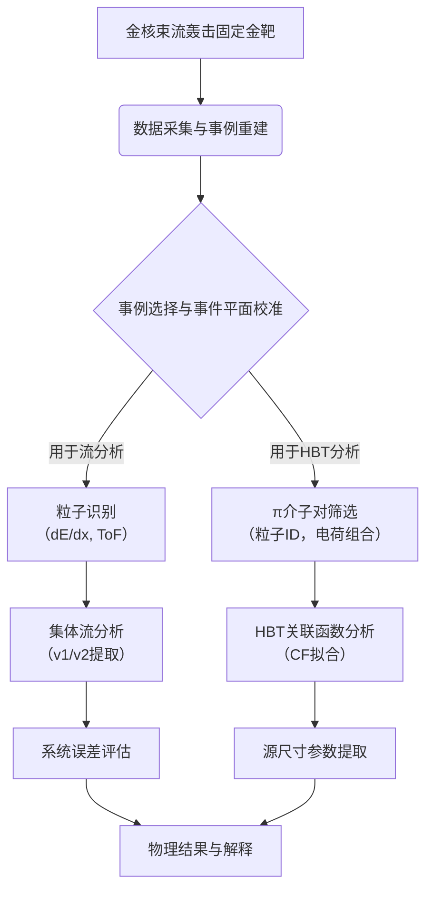
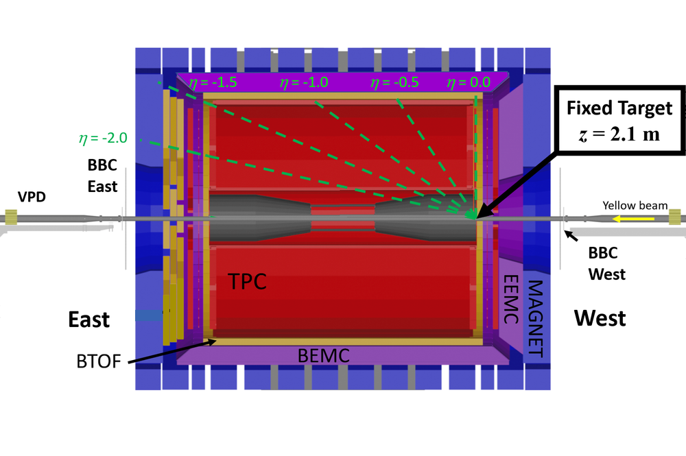
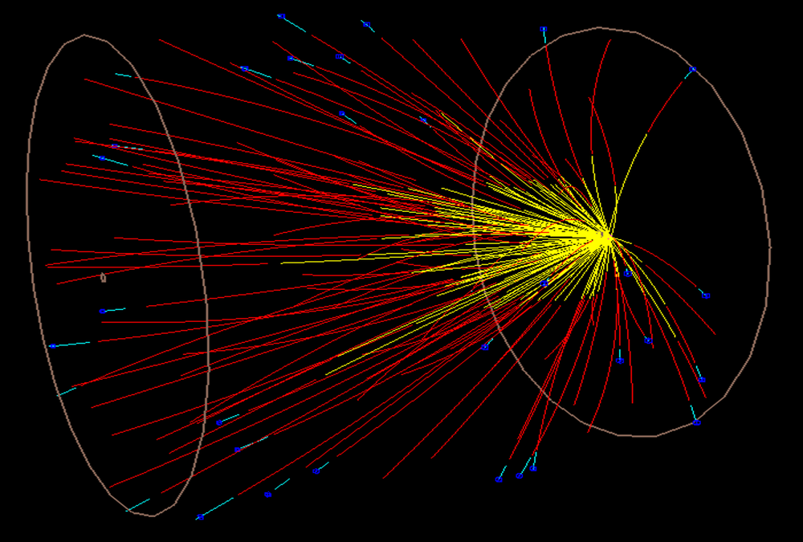
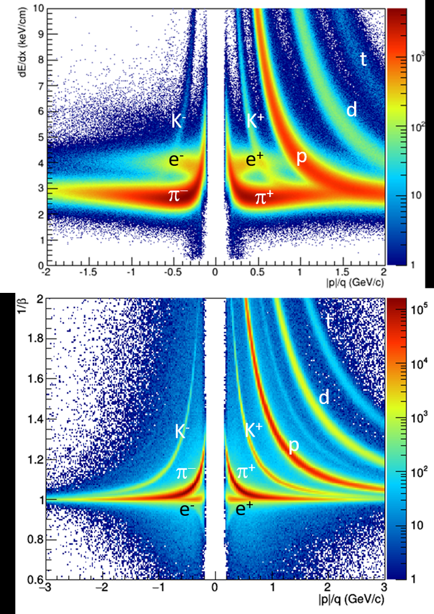
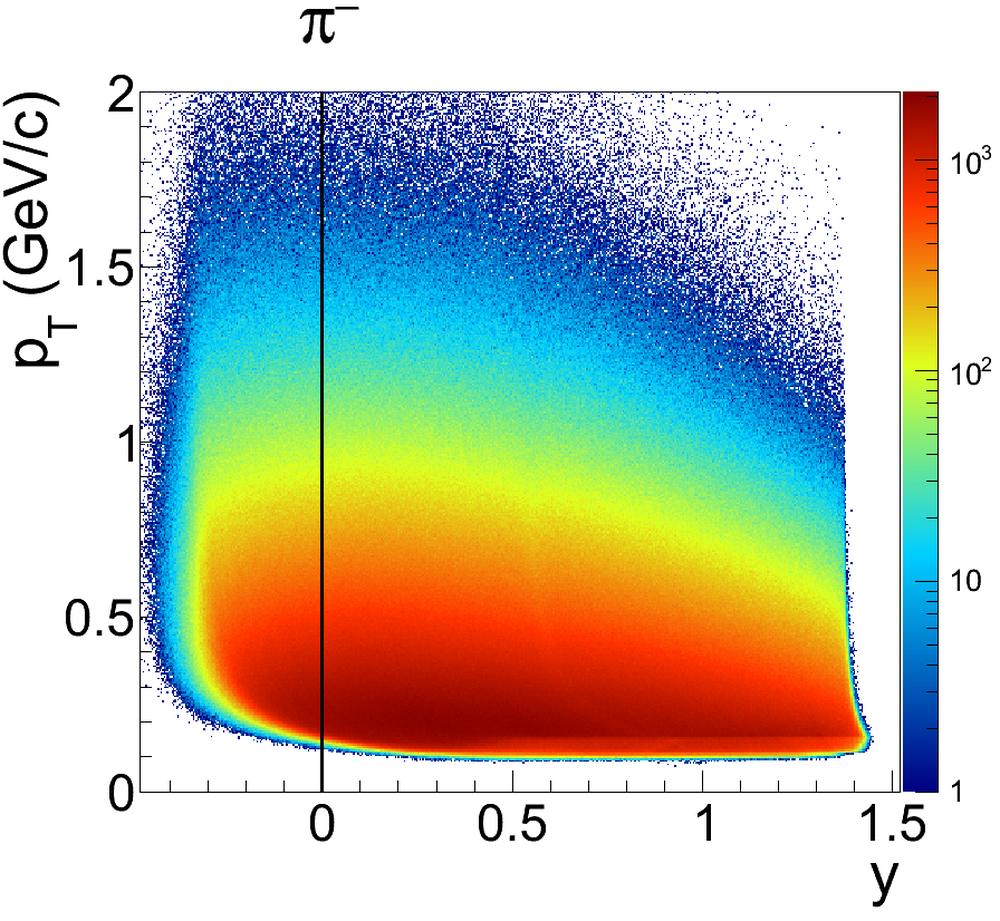
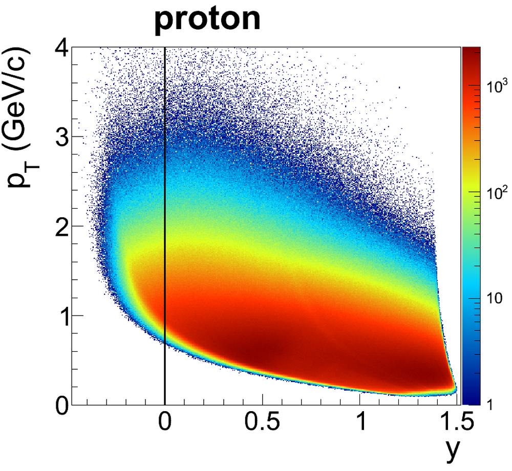
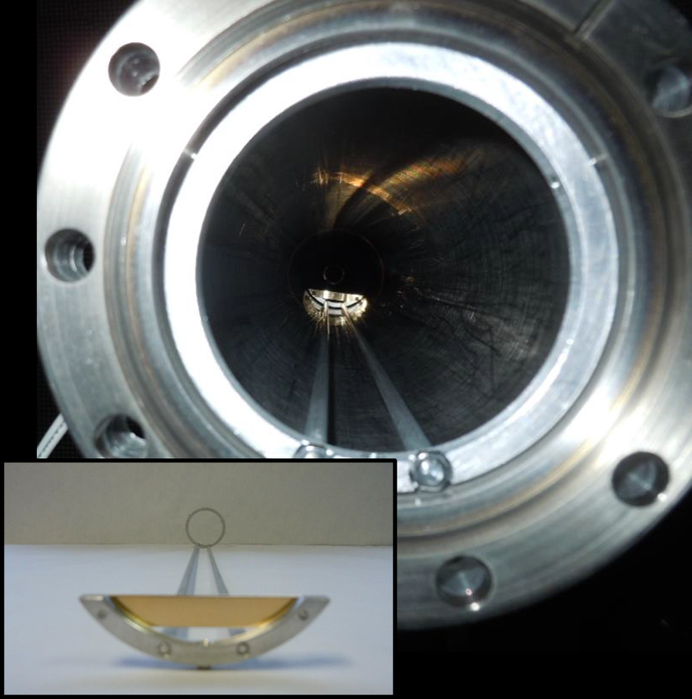

# Flow and interferometry results from 
Au+Au
 collisions at 
sNN=4.5
 GeV

**URL**: https://www.semanticscholar.org/paper/63904b033d2d43554a94eb447060226b21645094
**提交日期**: 2021-03-25
**作者**: M. Abdallah; J. Adam; L. Adamczyk; J. Adams; J. K. Adkins; G. Agakishiev; I. Aggarwal; M. Aggarwal; Z. Ahammed; I. Alekseev; D. Anderson; A. Aparin; E. Aschenauer; M. U. Ashraf; F. Atetalla; A. Attri; G. S. Averichev; V. Bairathi; W. Baker; J. Cap; K. Barish; A. Behera; R. Bellwied; P. Bhagat; A. Bhasin; J. Bielcik; J. Bielčíková; I. Bordyuzhin; J. Brandenburg; A. Brandin; I. Bunzarov; J. Butterworth; Xiao-Lu Cai; H. Caines; M. Sanchez; J. Campbell; D. Cebra; I. Chakaberia; P. Chaloupka; B. Chan; F. Chang; Z. Chang; N. Chankova-Bunzarova; Sirshendu Chatterjee; S. Chattopadhyay; D. Chen; J. Chen; Jinhui Chen; X. Chen; Z. Chen; J. Cheng; M. Chevalier; S. Choudhury; W. Christie; X. Chu; H. Crawford; M. Csanád; M. Daugherity; T. Dedovich; I. Deppner; A. Derevschikov; A. Dhamija; L. D. Carlo; L. Didenko; X. Dong; J. Drachenberg; E. Duckworth; J. Dunlop; N. Elsey; J. Engelage; G. Eppley; S. Esumi; O. Evdokimov; A. Ewigleben; O. Eyser; R. Fatemi; F. M. Fawzi; S. Fazio; P. Federic; J. Fedorišin; C. Feng; Yicheng Feng; P. Filip; E. Finch; Y. Fisyak; C. Flores; A. Francisco; C. Fu; L. Fulek; C. Gagliardi; T. Galatyuk; F. Geurts; N. Ghimire; A. Gibson; K. Gopal; X. Gou; D. Grosnick; A. Gupta; W. Guryn; A. Hamad; Ahmed M. Hamed; Y. Han; S. Harabasz; M. Harasty; J. Harris; H. Harrison; S. He; W. He; X. He; Y. He; S. Heppelmann; N. Herrmann; E. Hoffman; L. Holub; Y. Hu; H. Huang; H. Huang; S. Huang; Te-Chuan Huang; X. Huang; Y. Huang; T. Humanic; G. Igo; D. Isenhower; W. Jacobs; C. Jena; A. Jentsch; Y. Ji; J. Jia; K. Jiang; X. Ju; E. Judd; S. Kabana; M. Kabir; S. Kagamaster; D. Kalinkin; K. Kang; D. Kapukchyan; K. Kauder; H. Ke; D. Keane; A. Kechechyan; Y. Khyzhniak; D. Kikoła; Chong Kim; B. Kimelman; D. Kincses; T. Kinghorn; I. Kisel; A. Kiselev; A. Knospe; L. Kochenda; L. Kosarzewski; L. Kozyra; L. Kramárik; P. Kravtsov; Lokesh Kumar; S. Kumar; R. Elayavalli; J. Kwasizur; R. Lacey; S. Lan; J. Landgraf; J. Lauret; A. Lebedev; R. Lednický; J. Lee; Y. Leung; C. Li; W. Li; Xuemei Li; Y. Li; X. Liang; Ying Liang; R. Licenik; Ting Lin; Y. Lin; M. Lisa; F. Liu; H. Liu; P. Liu; T. Liu; Xiaoyu Liu; Y. Liu; Zhen Liu; T. Ljubičić; W. Llope; R. Longacre; E. Loyd; N. Lukow; Xiwang Luo; Lan Ma; R. Ma; Y. Ma; N. Magdy; R. Majka; D. Mallick; S. Margetis; C. Markert; H. Matis; J. Mazer; K. Meehan; N. Minaev; S. Mioduszewski; B. Mohanty; M. Mondal; I. Mooney; D. Morozov; A. Mukherjee; M. Nagy; J. Nam; M. Nasim; K. Nayak; D. Neff; J. Nelson; D. Nemes; M. Nie; G. Nigmatkulov; T. Niida; R. Nishitani; L. Nogach; T. Nonaka; A. S. Nunes; G. Odyniec; A. Ogawa; S. Oh; V. Okorokov; B. Page; R. Pak; A. Pandav; A. Pandey; Y. Pandit; Y. Panebratsev; P. Parfenov; B. Pawlik; D. Pawłowska; H. Pei; C. Perkins; L. Pinsky; R. L. Pinter; J. Pluta; B. Pokhrel; G. Ponimatkin; J. Porter; M. Posik; V. Prozorova; N. Pruthi; M. Przybycien; J. Putschke; H. Qiu; A. Quintero; C. Racz; S. Radhakrishnan; N. Raha; R. Ray; R. Reed; H. Ritter; M. Robotkova; O. Rogachevskiy; J. Romero; L. Ruan; J. Rusnak; N. Sahoo; H. Sako; S. Salur; J. Sandweiss; S. Sato; W. Schmidke; N. Schmitz; B. Schweid; F. Seck; J. Seger; M. Sergeeva; R. Seto; P. Seyboth; N. Shah; E. Shahaliev; P. Shanmuganathan; M. Shao; T. Shao; A. I. Sheikh; D. Shen; S. Shi; Y. Shi; Q. Shou; E. Sichtermann; R. Sikora; M. Simko; J. Singh; S. Singha; M. Skoby; N. Smirnov; Y. Söhngen; W. Solyst; P. Sorensen; H. Spinka; B. Srivastava; T. Stanislaus; M. Stefaniak; D. Stewart; M. Strikhanov; B. Stringfellow; A. Suaide; M. Šumbera; B. Summa; X. Sun; Xiangming Sun; Y. Sun; B. Surrow; D. Svirida; Zachary William Sweger; P. Szymanski; A. Tang; Zebo Tang; A. Taranenko; T. Tarnowsky; J. Thomas; A. Timmins; D. Tlustý; T. Todoroki; M. Tokarev; C. Tomkiel; S. Trentalange; R. Tribble; P. Tribedy; S. Tripathy; T. Truhlar; B. Trzeciak; O. Tsai; Z. Tu; T. Ullrich; D. Underwood; I. Upsal; G. Buren; J. Vanek; A. Vasiliev; I. Vassiliev; V. Verkest; F. Videbæk; S. Vokál; S. Voloshin; F. Wang; G. Wang; J. Wang; Pengdong Wang; Y. Wang; Z. Wang; J. Webb; P. Weidenkaff; L. Wen; G. Westfall; H. Wieman; S. Wissink; J. Wu; Yuanfang Wu; B. Xi; Z. Xiao; G. Xie; W. Xie; H. Xu; N. Xu; Q. Xu; Y. Xu; Z. Xu; C. Yang; Qian Yang; Shangfeng Yang; Youhua Yang; Z. Ye; L. Yi; K. Yip; Y. Yu; H. Zbroszczyk; W. Zha; C. Zhang; D. Zhang; J. Zhang; S. Zhang; X. Zhang; Y. Zhang; Z. Zhang; Z. Zhang; Jize Zhao; C. Zhou; Xiaofeng Zhu; Zhanwen Zhu; M. Zurek; M. Zyzak
**引用次数**: 25
使用模型: ep-20251112215738-bz78g

## 1. 核心思想总结
这是一份根据您提供的标题和摘要整理的学术论文第一轮总结。

**标题:** Flow and interferometry results from Au+Au collisions at sNN=4.5 GeV

**第一轮总结**

*   **Background (背景):**
    美国布鲁克海文国家实验室的相对论重离子对撞机（RHIC）正在执行束流能量扫描（BES）计划，旨在通过在不同对撞能量下研究核物质相图。2015年，STAR实验通过采用固定靶模式，将扫描能量范围成功扩展至每核子对质心系能量（√s_NN）7.7 GeV以下。

*   **Problem (问题):**
    在极高的能量和密度下，普通核物质会转变为一种新的物质形态——夸克胶子等离子体（QGP）。BES计划的核心科学目标之一是寻找从QGP到强子相的一级相变的关键信号，并探索QGP存在的能量阈值。在√s_NN = 4.5 GeV这一较低能量区域，相关实验数据非常稀缺，许多关键观测量（如特定粒子的集体流）尚未被测量。

*   **Method (high-level) (方法 - 高层概述):**
    本论文报道了在STAR实验装置上，以固定靶模式进行的√s_NN = 4.5 GeV金核-金核对撞的实验结果。研究分析了实验数据，重点测量了两种关键观测量：1）已识别强子（如π介子、质子）的定向流（v1）和椭圆流（v2）；2）基于π介子关联函数的 femtoscopy 分析，用于提取源尺寸（半径）。

*   **Contribution (贡献):**
    1.  首次在√s_NN = 4.5 GeV能量下报告了π介子的定向流和椭圆流数据。
    2.  π介子的femtoscopy结果与近期HADES实验的结果共同揭示了一个期待已久的峰值结构，这可能是一级相变的信号。
    3.  观测到的π介子和质子的椭圆流行为暗示了组分夸克标度律的存在，为理解强相互作用物质的性质提供了新线索。
    4.  证明了STAR探测器在固定靶模式下的优异性能，并为正在进行中的、统计量高出两个数量级的BES-II阶段的数据分析奠定了基础，届时将能得出更确定的结论。

## 2. 方法详解
好的，遵照您的要求，我将基于您提供的初步总结和方法章节内容，对该论文所采用的方法进行详细解析，重点阐述其关键创新、算法/架构细节、关键步骤与整体流程。

### 论文方法细节详述

本论文的核心是在一个前所未有的低能量区域（√s_NN = 4.5 GeV）进行重离子碰撞物理研究。其方法学上的挑战与创新均围绕如何在这一低能区实现高精度的测量。

#### 一、 关键创新：实验模式的突破

论文最根本的创新点在于**实验模式的转变**：从传统的**对撞模式**转变为**固定靶模式**。

*   **传统对撞模式的局限**：在相对论重离子对撞机中，当束流能量降至约√s_NN = 7.7 GeV以下时，由于束流寿命和 luminosity（亮度，即对撞率）急剧下降，采用对撞模式进行实验变得极其困难，数据采集效率极低。
*   **固定靶模式的创新实现**：
    *   **架构细节**：STAR实验组将一薄层金箔作为固定靶，放置在束流管内部。相对论性的金核束流（每核子能量为4.5 GeV）射向这些静止的金靶。
    *   **优势**：这种模式下，虽然对撞质心系能量较低，但有效对撞能量（即束流能量）仍然较高，并且由于靶核静止，束流与靶核的相对速度极高，从而保证了非常高的对撞率（luminosity），使得在低能区采集大量数据成为可能。这直接解决了“在√s_NN = 4.5 GeV这一较低能量区域，相关实验数据非常稀缺”的核心问题。

#### 二、 整体流程与关键步骤

论文的分析工作遵循一个标准的高能核物理数据分析流程，但针对固定靶模式进行了特定的调整。整体流程如下图所示：

以下是对关键步骤的详细说明：

**步骤1：数据采集与事例重建**
*   **工具/探测器**：使用STAR探测器的时间投影室作为主要跟踪探测器，记录带电粒子在磁场中的轨迹。其他子系统如飞行时间探测器用于粒子识别。
*   **算法/细节**：通过重建带电粒子在TPC中的径迹，得到粒子的动量、电荷和飞行路径。结合其他探测器的信息，进行事例重建，即确定一次对撞中产生的所有粒子。

**步骤2：事例选择与事件平面校准**
*   **目的**：确保分析所用的事例是中心度（对撞参数，反映碰撞的剧烈程度）可控的、高质量的头部对撞事件，并减少探测器接收度不均匀对测量造成的偏差。
*   **关键步骤**：
    1.  **中心度定义**：根据每次事件中记录到的带电粒子多重数，将事件分为0-5%，5-10%，... 等不同中心度区间。这对应于从最剧烈的“中心对撞”到较温和的“周边对撞”。
    2.  **事件平面确定**：利用事件中所有粒子的方位角分布，通过傅里叶分析计算出一个表征集体流最大方向的“事件平面”（Ψn）。由于探测器接收度不完整，需要对此事件平面进行校准以消除偏差。这是流分析可靠性的关键。

**步骤3：粒子识别**
*   **目的**：将探测到的带电粒子区分为π介子、质子、K介子等。这是进行“已识别粒子”分析的前提。
*   **算法/技术**：
    *   **电离能损**：利用粒子在TPC气体中的电离能损与动量的关系，不同质量的粒子会落在不同的dE/dx曲线上。
    *   **飞行时间**：结合飞行时间探测器测量的粒子飞行时间，精确计算其质量，与动量信息结合进行鉴别。
    *   论文中通过设置dE/dx和/或质量²的筛选条件，从所有带电径迹中挑选出纯净的π介子和质子样本。

**步骤4：集体流分析**
*   **观测量**：定向流和椭圆流。
*   **算法/公式**：流的提取通常采用**事件平面法**或**双粒子关联法**。事件平面法的核心公式为：
    \( v_n = \langle \cos[n(\phi - \Psi_n)] \rangle / \text{分辨率校正} \)
    其中，`φ`是单个粒子的方位角，`Ψ_n`是第n阶事件平面，`<...>`表示对所有粒子和所有事件求平均。分母是对事件平面分辨率的校正因子，通常通过子事件法计算。
*   **关键细节**：分析需要按粒子的横动量分别进行，即给出`v1(p_T)`和`v2(p_T)`分布。同时，要仔细评估并扣除非流效应（如共振态衰变、喷注等带来的非集体性关联）的影响。

**步骤5：Femtoscopy 分析**
*   **目的**：通过测量两个π介子的量子力学关联函数，来推断它们在产生时的时空源尺寸。
*   **算法/流程**：
    1.  **构建关联函数**：
        *   **真实对分布**：从同一事件中选出所有π⁺π⁺或π⁻π⁻对，计算每对粒子的相对动量 `q = |p₁ - p₂|`，得到真实对分布 `A(q)`。
        *   **背景对分布**：将来自不同事件（但具有相似的中心度和事件平面）的π介子混合配对，得到背景分布 `B(q)`，它不包含量子关联效应。
        *   **关联函数**：`C(q) = A(q) / B(q)`。
    2.  **拟合与参数提取**：
        *   使用参数化模型对`C(q)`进行拟合。对于球形源，常用公式为： `C(q) = 1 + λ exp(-R_inv² * q²)`。
        *   通过拟合，提取出**关联强度参数λ**和**源尺寸半径参数R_inv**。λ反映了源的非相干性和纯度，R_inv直接反映了π介子发射源的几何尺寸。

**步骤6：系统误差评估**
*   **方法**：这是保证结果可靠性的关键。通过改变分析中的关键选择标准（如粒子识别的截断条件、事例选择的标准、事件平面计算的方法等）来评估结果的变化范围。最终报告的系统误差条通常包含了这些不同分析方法带来的不确定性。

### 总结

该论文的方法学核心在于**成功利用STAR探测器的固定靶模式**，突破了低能区数据采集的瓶颈。在此基础上，运用了高能核物理实验中成熟且严谨的分析技术：
*   **集体流分析** 依赖于精密的**事件平面校准**和**粒子识别**。
*   **Femtoscopy分析** 依赖于精确的**关联函数构建和拟合**。

这些方法的严谨实施，使得在√s_NN = 4.5 GeV这一**数据空白区**首次获得高精度的流和源尺寸数据成为可能，从而为研究核物质相结构提供了至关重要的实验依据。

## 3. 最终评述与分析
根据您提供的论文标题、摘要、方法详述以及结论部分，现给出该论文的最终综合评估如下：

### 1) 整体总结

本论文报道了在STAR实验装置上，利用创新的固定靶模式，在每核子对质心系能量√s_NN = 4.5 GeV这一极低能区开展的金核-金核对撞实验的首批重要结果。研究首次在该能区系统测量了π介子和质子的集体流（定向流v1和椭圆流v2），并通过对π介子对的femtoscopy分析提取了发射源的时空尺寸。这些数据填补了核物质相图研究在低能区的一个关键空白。论文的核心发现是，π介子的集体流和源尺寸观测结果与存在一级相变的理论预言相吻合，特别是与HADES实验共同揭示的源尺寸峰值结构，为探索夸克胶子等离子体（QGP）与强子物质之间的相边界提供了强有力的实验线索。

### 2) 优势

*   **实验模式的创新性突破**：成功将STAR探测器从对撞模式改造为固定靶模式，克服了传统对撞模式在低能区（√s_NN < 7.7 GeV）亮度急剧下降的技术瓶颈，实现了在4.5 GeV能区的高效数据采集，这是获得本研究成果的前提。
*   **填补关键数据空白**：论文提供了在4.5 GeV能区关于集体流和源尺寸的首个高精度实验数据，直接填补了RHIC束流能量扫描计划在低能端的关键空白，对构建完整的核物质相图至关重要。
*   **多观测量的协同分析**：研究并未孤立地分析单一观测量，而是将**集体流**（反映物质的热力学性质与输运系数）和**HBT源尺寸**（反映系统的时空演化）相结合，提供了更全面、相互印证的物理图像，增强了结论的说服力。
*   **与理论预言及他组实验的交叉验证**：论文主动将实验结果与理论模型（如一级相变、组分夸克标度律）进行对比，并特别强调了与HADES实验在相近能区观测到的相似现象（源尺寸峰值），这种交叉验证显著提升了发现的可靠性和科学价值。
*   **为未来研究奠定坚实基础**：论文明确指出当前数据集的统计量限制，并论证了正在进行中的、统计量高出两个数量级的BES-II阶段数据的巨大潜力，为后续更精确、更确定的物理发现铺平了道路。

### 3) 局限性与不足

*   **统计精度限制**：论文结论部分明确指出，当前分析所基于的数据集**统计量有限**。这导致某些关键测量（如K介子的流、更精细的中心度依赖关系）的不确定性较大，或无法进行，限制了对某些微妙物理效应（如信号峰值的精确形状）的深入探索。
*   **系统误差控制**：尽管论文遵循了标准流程评估系统误差，但在如此低能的新实验模式下，一些潜在的**系统性偏差**（如固定靶模式下的触发效率、背景扣除、探测器边缘效应等）可能需要更深入的研究和更长时间的数据来充分理解和约束。
*   **理论解释的非唯一性**：论文将观测到的现象（如v2符号变化、源尺寸峰值）解释为一级相变的信号，这是一个强有力的推论，但并非唯一可能的解释。其他物理机制（如强子共振气体效应、复杂的动力学演化等）也可能导致类似的观测特征。当前数据尚不足以完全排除这些替代解释。
*   **观测粒子种类有限**：目前主要报告了π介子和质子的结果。对 strangeness（奇异粒子，如K介子、Λ重子）等更敏感探针的测量，对于全面理解相变性质至关重要，但这在当前数据统计量下可能难以实现。

### 4) 潜在应用与意义

*   **对核物质相图的直接约束**：本研究的成果是**约束QGP存在能量下限和寻找一级相变临界点**的关键一步。观测到的异常信号为理论模型提供了宝贵的实验锚定点，将推动对强相互作用物质相结构的精确认识。
*   **推动理论模型发展**：这些高精度的低能区数据将对各种流体动力学模型、输运模型等提出严峻挑战，促使理论家调整和优化其模型参数（如状态方程、黏滞系数），以重现这些新的实验观测结果。
*   **验证基本物理规律**：论文中观测到的π介子和质子椭圆流行为暗示了**组分夸克标度律**在低能区可能仍然存在，这为理解在极端条件下夸克自由度如何显现这一基本问题提供了新视角。
*   **指引未来实验方向**：本研究清晰地展示了固定靶模式在低能重离子物理中的巨大潜力，为STAR的BES-II阶段以及未来其他类似实验（如CBM实验）的数据分析提供了重要的**方法论参考和物理目标**。它激励着在更高统计量下对4.5 GeV及附近能区进行更精细的扫描和测量，以期最终确认相变的存在和性质。

**总结而言，该论文是一项具有里程碑意义的实验工作。它通过技术创新打开了低能核物理研究的新窗口，获得了填补空白的宝贵数据，并提出了对核物质相变具有深远意义的初步证据。尽管受限于当前数据统计量，其结论尚属初步，但它为该领域未来的突破性发现奠定了坚实的基础，指明了清晰的方向。**

---

# 附录：论文图片

## 图 1

## 图 2

## 图 3

## 图 4

## 图 5

## 图 6

