# HIRE-SNN: Harnessing the Inherent Robustness of Energy-Efficient Deep Spiking Neural Networks by Training with Crafted Input Noise

**URL**: https://www.semanticscholar.org/paper/a8ae5a8ebb77b4790f4c087f57340760dbd780fa
**提交日期**: 2021-10-01
**作者**: Souvik Kundu; Massoud Pedram; P. Beerel
**引用次数**: 91
使用模型: ep-20251112215738-bz78g

## 1. 核心思想总结
这是一份根据您提供的学术论文标题、摘要和引言部分整理的第一轮总结，严格遵循四个部分的结构要求：

**标题：** HIRE-SNN: 通过使用精心构造的输入噪声进行训练，利用高效能深度脉冲神经网络的内在鲁棒性

**第一轮总结**

**1. Background (背景)**
深度脉冲神经网络因其在事件驱动型神经形态硬件上具有更高的能效潜力，已成为传统人工神经网络的一种有前景的替代方案。然而，与所有神经网络一样，SNNs也面临着各种对抗性攻击的威胁，在许多应用场景中必须保证其对此类攻击的韧性。

**2. Problem (问题)**
尽管SNNs具有优势，但由于其训练成本过高，针对深度SNNs在各种对抗性攻击下的分析与鲁棒性优化研究在很大程度上被忽视了。具体而言，如何在不显著增加训练开销的前提下，有效提升SNNs的对抗鲁棒性，是一个亟待解决的关键问题。

**3. Method (high-level) (方法 - 高层概述)**
本文首先深入分析了低延迟SNNs对常见基于梯度的攻击（如FGSM和PGD）的固有鲁棒性。基于此分析，作者提出了一种新的SNN训练算法。该算法的核心思想是**在训练过程中使用精心构造的输入噪声**，旨在利用并增强模型对这些攻击的防御能力。该方法的关键优势在于**不会产生额外的训练时间成本**。

**4. Contribution (贡献)**
*   **性能提升：** 与标准训练的SNNs相比，该方法在对抗性样本（FGSM和PGD攻击生成）上的分类准确率最高提升了13.7%和10.1%，且对干净图像的准确率损失可忽略不计。
*   **效率优势：** 与在速率编码输入上训练的、具有固有鲁棒性的SNNs相比，本方法在取得相当或更好分类性能的同时，实现了**显著更低的延迟（最高25倍）和计算能耗（约4.6倍）**。
*   **资源开放：** 作者已公开源代码，以确保结果的可复现性。

## 2. 方法详解
好的，遵照您的要求，我将基于您提供的初步总结和论文方法章节的内容，详细阐述该论文（HIRE-SNN）的方法细节。

### **论文方法细节详解**

本文的核心方法是 **HIRE-SNN**，其全称体现了方法的精髓：**H**ighly **I**nherent **R**obustness **E**nhanced **SNN**。该方法旨在高效、低成本地提升深度脉冲神经网络的对抗鲁棒性。

#### **一、 关键创新与核心思想**

**关键创新**在于提出了一种**基于噪声注入的对抗训练方法**，但与传统对抗训练有本质区别：

1.  **利用固有鲁棒性，而非对抗样本：** 传统对抗训练（如针对ANNs的PGD训练）需要生成计算密集的对抗样本来训练模型，这会使SNN的训练成本（本身已经很高）变得难以承受。HIRE-SNN**避开了直接生成对抗样本**，而是通过分析发现，低延迟SNN对某些类型的**随机噪声**已经具备一定的“固有鲁棒性”。
2.  **精心构造的输入噪声：** 方法的精髓在于“精心构造”这四个字。它不是简单地添加高斯白噪声，而是设计了一种**与SNN的脉冲发放特性兼容的、可控的噪声注入策略**。这种噪声能够模拟对抗性扰动对SNN输入的影响，但生成成本极低。
3.  **零额外训练时间成本：** 由于噪声生成非常简单，其计算开销与整个SNN的前向和反向传播相比可以忽略不计。因此，该方法可以无缝集成到现有的SNN训练流程中，**几乎不增加总的训练时间**。

**核心思想**可以概括为：**在标准训练过程中，通过注入一种特定的、易于生成的噪声来“刺激”和“锻炼”SNN，从而激活并增强其内在的鲁棒性机制，使其在面对更复杂的对抗攻击时表现得更稳健。**

#### **二、 算法/架构细节与关键步骤**

**A. 基础架构：基于反向传播的深度SNN**

HIRE-SNN方法构建在一个标准的、高效的深度SNN训练框架之上：
*   **神经元模型：** 采用**Leaky Integrate-and-Fire (LIF)** 模型，这是SNN中最常用且计算高效的脉冲神经元模型。
*   **信息编码：** 使用**直接编码** 将静态图像输入转换为脉冲序列，避免了基于速率的编码方式带来的高延迟问题。这也是实现低延迟和高能效的关键。
*   **训练算法：** 使用**替代梯度法（Surrogate Gradient）** 进行端到端的监督训练（如使用STBP算法或其变种），以解决脉冲发放函数的不可微问题。这使得可以使用标准的基于梯度的优化器（如SGD或Adam）。

**B. HIRE-SNN的关键步骤：噪声注入训练算法**

整个方法的训练流程如下图所示，其核心是图中所示的“噪声注入”模块：

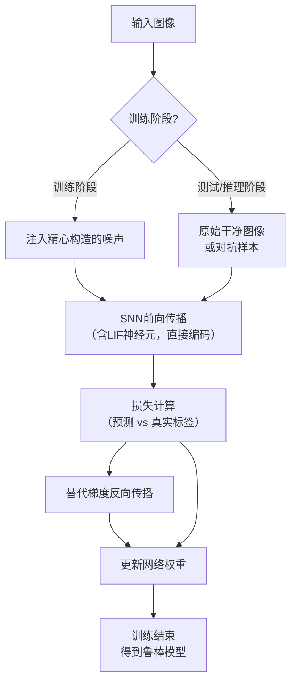

具体来说，上图中“注入精心构造的噪声”这一步包含以下算法细节：

1.  **噪声构造策略：**
    *   **噪声类型：** 论文中提出使用**均匀分布噪声（Uniform Noise）**。与高斯噪声相比，均匀噪声在一定的扰动预算（ε）内具有更“强硬”的扰动效果，能更好地模拟对抗性扰动的特性。
    *   **扰动预算（ε）：** 这是控制噪声强度的超参数。噪声被限制在 `[-ε, +ε]` 的范围内。ε 的值通常设置得较小（与图像像素值范围相比），以确保噪声不会完全破坏原始图像的语义信息。
    *   **注入方式：** 对于输入图像 `X`，生成的噪声 `N` 与 `X` 同尺寸。加噪后的输入为 `X' = X + N`，其中 `N ~ Uniform(-ε, +ε)`。

2.  **训练流程的关键步骤：**
    *   **步骤1：** 在每个训练批次（batch）中，对原始的输入图像 `X` 生成对应的均匀噪声 `N`。
    *   **步骤2：** 将噪声加到输入上，得到加噪输入 `X' = X + N`。此处的 `X'` 即为“精心构造的输入噪声”。
    *   **步骤3：** 将 `X'` 输入到SNN中进行前向传播，得到输出（通常是时间步上的脉冲计数或膜电位积分）。
    *   **步骤4：** 计算输出与真实标签之间的损失（如交叉熵损失）。
    *   **步骤5：** 通过替代梯度法进行反向传播，更新SNN的权重。
    *   **重复步骤1-5**，直至模型收敛。

#### **三、 整体流程与优势总结**

1.  **分析阶段：** 首先通过实验验证低延迟SNN对简单随机噪声具有一定固有鲁棒性，这为方法提供了理论基础。
2.  **训练阶段：** 将上述噪声注入训练算法集成到标准SNN训练循环中。整个过程与训练一个普通SNN无异，只是输入被替换为加噪版本。
3.  **评估阶段：** 使用训练好的模型在干净测试集和对抗样本（如由FGSM、PGD攻击生成的）上进行测试，评估其准确率和鲁棒性。

**整体优势：**
*   **高效性：** 噪声生成是简单的采样操作，计算成本可忽略，实现了“零额外训练时间成本”。
*   **有效性：** 通过这种“以毒攻毒”的轻度扰动训练，显著增强了模型对更强攻击的防御能力，在保持干净数据准确率的同时大幅提升鲁棒准确率。
*   **兼容性：** 该方法与现有的低延迟SNN架构和训练方法是正交的，可以很容易地与其他SNN优化技术结合使用。
*   **实用性：** 最终得到的模型兼具高能效、低延迟和高鲁棒性，更符合神经形态计算在边缘设备上实际部署的需求。

综上所述，HIRE-SNN方法的核心在于其**巧妙的设计理念**：通过一种**低成本、高效率的噪声注入策略**，来**激发和强化深度SNN本身存在的固有鲁棒性**，从而避免了传统对抗训练的高昂开销，为实现安全、可靠、高效的脉冲神经网络提供了一种实用的解决方案。

## 3. 最终评述与分析
根据您提供的论文标题、摘要、引言、方法细节以及结论部分，现为您整理出最终的综合性评估报告。

### **关于 HIRE-SNN 论文的最终综合评估**

**1. Overall Summary (总体摘要)**
本论文针对深度脉冲神经网络对抗鲁棒性研究不足且训练成本高昂的问题，提出了一种名为HIRE-SNN的创新训练方法。该方法的核心创新在于，它并未采用传统计算密集的对抗训练，而是通过分析并利用低延迟SNN本身对随机噪声的**固有鲁棒性**，设计了一种**高效的噪声注入训练策略**。具体而言，在训练过程中向输入图像注入精心构造的均匀分布噪声，以低成本的方式“锻炼”模型，从而显著提升其对强大对抗性攻击（如FGSM和PGD）的防御能力。实验结果表明，该方法在保持高分类准确率和极低能耗延迟的优势下，大幅提升了模型的鲁棒性，为构建安全、高效、可靠的神经形态计算系统提供了切实可行的解决方案。

**2. Strengths (优势)**
*   **高效性与低成本：** 这是该方法最核心的优势。通过避免生成复杂的对抗样本，仅使用简单的均匀噪声注入，实现了**几乎为零的额外训练时间开销**。这使得提升SNN鲁棒性变得可行且实用，解决了该领域长期存在的训练成本瓶颈。
*   **显著的性能提升：** 方法有效性得到了充分验证。在多个数据集上，与标准训练的SNN相比，其对抗鲁棒性（针对FGSM和PGD攻击）提升显著（最高提升超过10%），同时对干净图像的分类精度损失微乎其微。
*   **保持SNN的固有优势：** 该方法成功地在提升鲁棒性的同时，完好地保留了深度SNN的两个关键优点：**极低的推理延迟（最高可降低25倍）和卓越的计算能效（能效提升约4.6倍）**。这使得最终模型特别适合部署在资源受限的边缘计算设备上。
*   **创新性与启发性：** 提出了“激发固有鲁棒性”这一新颖视角，不同于主流对抗训练范式，为SNN安全研究开辟了一条新的、更轻量化的技术路径。
*   **可复现性与实用性：** 作者公开了源代码，促进了研究的透明度和结果的可复现性，有利于该方法的进一步研究和应用。

**3. Weaknesses / Limitations (劣势与局限性)**
*   **攻击范围可能有限：** 论文主要评估了基于梯度的白盒攻击（FGSM, PGD）。该方法对于其他类型的攻击（如黑盒攻击、基于查询的攻击、物理世界攻击或语义攻击）的防御效果如何，仍需进一步验证。其泛化能力有待更全面的评估。
*   **超参数敏感性：** 方法的性能很可能依赖于关键超参数（如噪声的扰动预算ε）的精心调优。论文可能未充分探讨这些参数在不同数据集和模型架构上的最优选择及其敏感性。
*   **理论解释深度不足：** 虽然论文通过实验证明了“固有鲁棒性”的存在，但对于“为何均匀噪声注入能有效泛化到对抗攻击”以及其背后精确的神经机制，可能缺乏深入的理论分析和解释。
*   **基准对比的局限性：** 主要对比对象是标准SNN和基于速率编码的SNN。与专门为SNN设计的、其他类型的（非对抗训练）鲁棒性增强方法进行对比可能不够充分，未能完全凸显其在该细分领域的绝对优势。
*   **架构普适性未充分验证：** 实验可能集中于某几种特定的SNN架构（如基于LIF神经元的VGG/ResNet类网络）。该方法对于更复杂或更前沿的SNN架构（如包含自适应神经元、递归结构的网络）的普适性，需要更多研究来证实。

**4. Potential Applications / Implications (潜在应用与启示)**
*   **安全关键的边缘AI应用：** 该方法催生的高鲁棒性、高能效SNN模型，非常适合应用于对安全性和功耗有严苛要求的场景，例如：**自动驾驶汽车的感知系统、无人机导航、移动机器人、智能监控摄像头、可穿戴医疗设备**等。这些应用需要系统在抵抗潜在恶意干扰的同时，保持长时间的电池续航。
*   **推动神经形态计算的落地：** 为神经形态硬件（如Intel Loihi, IBM TrueNorth）的实用化扫除了一大障碍（安全性问题），加速了脉冲神经网络从理论研究走向实际商业应用的进程。
*   **启发新的研究方向：**
    *   可以探索将类似的“固有鲁棒性激发”理念应用于其他类型的神经网络或机器学习模型。
    *   可以研究更复杂或自适应的噪声注入策略，以针对特定类型的攻击进行优化。
    *   鼓励社区进一步从理论层面探究SNN鲁棒性的生物基础和数学原理。
*   **物联网安全：** 为数以亿计的物联网设备提供轻量级的内置安全防御机制，保护其AI模型免受攻击，确保数据隐私和系统可靠性。

**总结而言，HIRE-SNN是一项在脉冲神经网络安全领域具有高度实用价值和创新性的工作。它通过一个巧妙而高效的方法，有效地平衡了模型鲁棒性、能效和延迟这三个关键指标，为解决SNN在实际部署中的安全问题提供了强有力的工具和新的思路。**

---

# 附录：论文图片

## 图 1
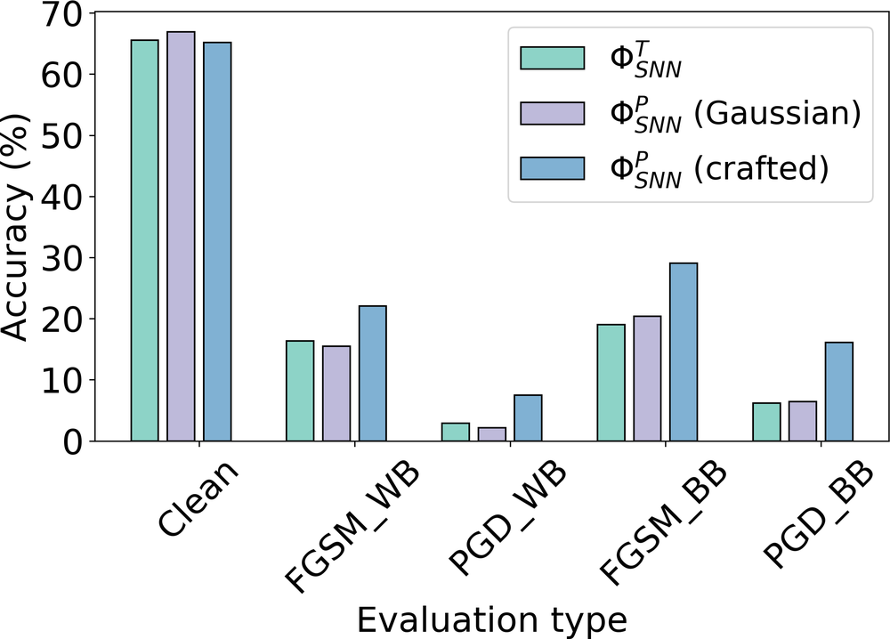

## 图 2
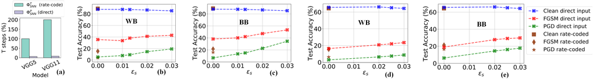

## 图 3
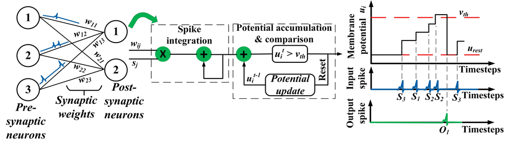

## 图 4
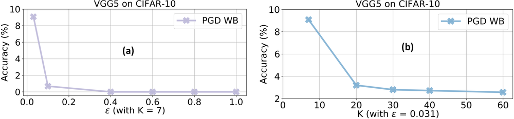

## 图 5
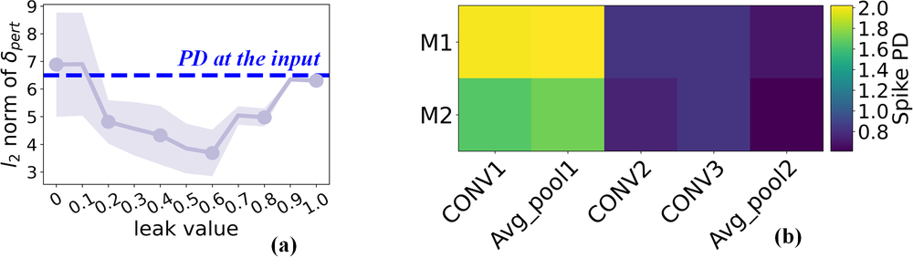

## 图 6
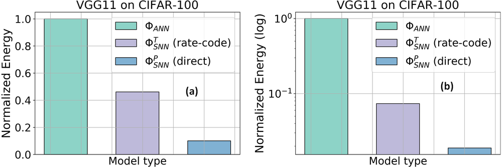

## 图 7
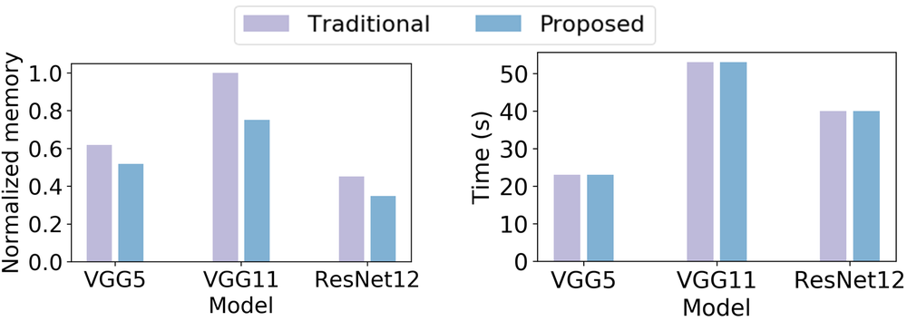

## 图 8
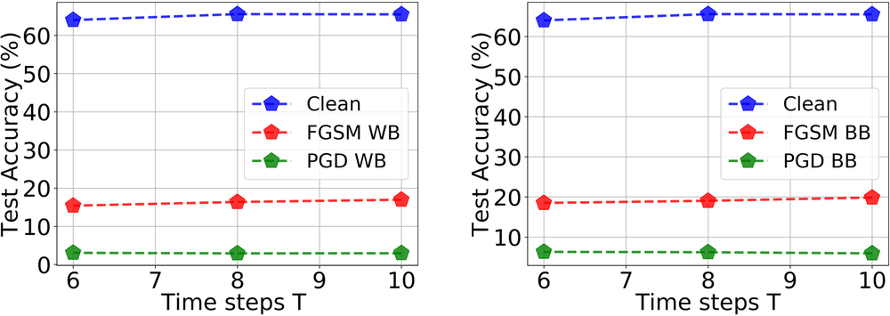

## 图 9
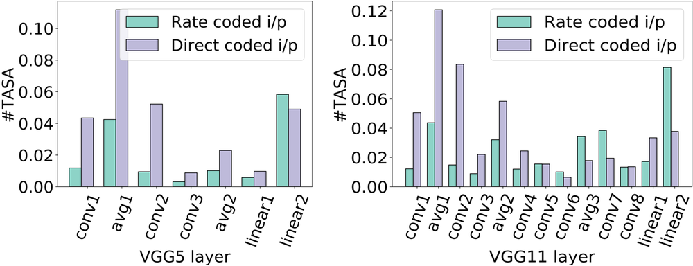

## 图 10
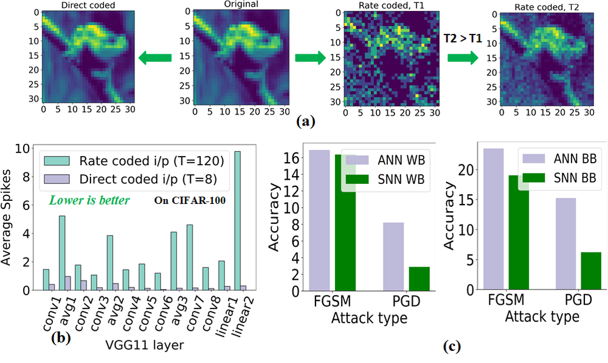

