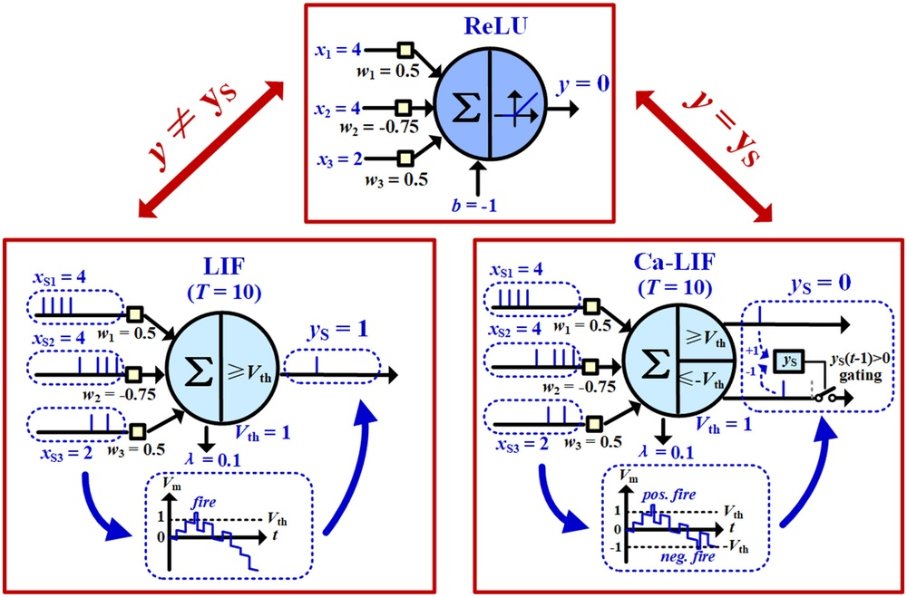
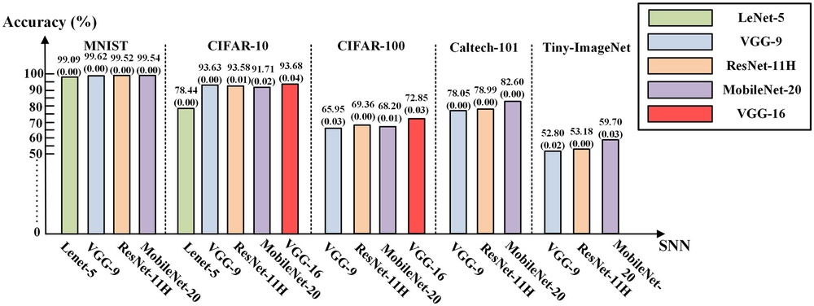
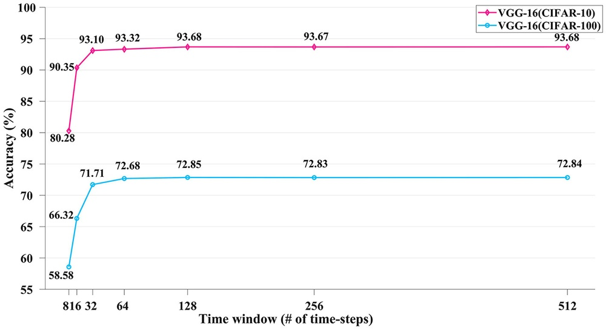
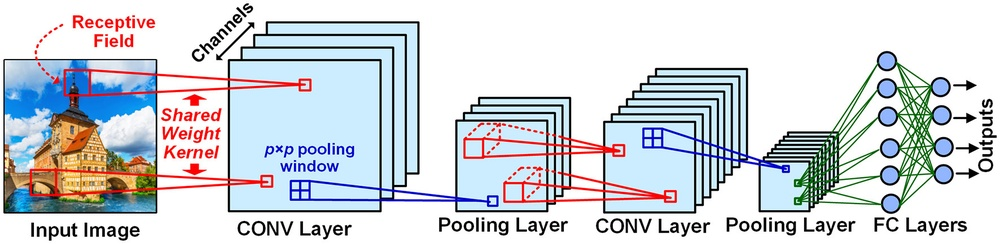
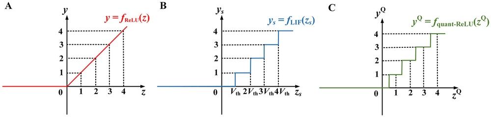

# High-accuracy deep ANN-to-SNN conversion using quantization-aware training framework and calcium-gated bipolar leaky integrate and fire neuron

**URL**: https://www.semanticscholar.org/paper/536e5513008b8cbbcd3bf9778f44f0d616229bfc
**提交日期**: 2023-03-08
**作者**: Haoran Gao; Junxian He; Haibing Wang; Tengxiao Wang; Zhengqing Zhong; Jianyi Yu; Ying Wang; Min Tian; Cong Shi
**引用次数**: 22
使用模型: ep-20251112215738-bz78g

## 1. 核心思想总结
这是一份根据您提供的标题和摘要，对学术论文进行的第一轮总结，按四个部分组织：

**1. 背景**
脉冲神经网络（SNN）因其高效的“事件驱动”计算范式而受到广泛关注。在SNN的训练方法中，人工神经网络到脉冲神经网络的转换（ANN-to-SNN conversion）方法通常能实现最先进的识别精度。

**2. 问题**
然而，现有的ANN-to-SNN转换技术存在两个主要缺陷：首先，它们需要冗长的转换后处理步骤（如阈值平衡和权重重归一化）来弥补人工神经元和脉冲神经元之间的固有行为差异；其次，它们需要很长的模拟时间窗口来生成足够多的脉冲以逼近原ANN的实值输出，这导致了较高的推理延迟。

**3. 方法（高层概述）**
为克服上述挑战，本研究提出了一种综合解决方案：
*   **新型神经元模型**：提出了一种钙门控双极性泄漏积分发放（Ca-LIF）脉冲神经元模型，以更精确地近似ANN中广泛使用的ReLU激活函数。
*   **简化转换框架**：提出了一个基于量化感知训练（QAT）的转换框架，该框架利用现成的QAT工具包，可直接将训练好的ANN权重导出到SNN，无需任何转换后处理。

**4. 贡献**
本研究的核心贡献在于：通过结合新型Ca-LIF神经元和QAT框架，实现了高精度且低延迟的ANN-to-SNN转换。实验表明，该方法在典型深度网络结构上，仅需8至128个较短的时间步长，就能获得具有竞争力的高精度，同时显著缩短了推理时间。该方法简化了转换流程，消除了复杂的后处理步骤。

## 2. 方法详解
好的，遵照您的要求，我将基于您提供的初步总结和方法章节内容，对该论文的方法细节进行详细说明，重点描述关键创新、算法/架构细节、关键步骤与整体流程。

---

### 论文方法细节详解

本论文的核心目标是解决传统ANN-to-SNN转换方法存在的两大痛点：**1）转换流程复杂，依赖后处理**；**2）推理延迟高，需要大量时间步**。其方法是一个紧密结合的综合性解决方案，包含两个关键创新点：**新型的钙门控双极性泄漏积分发放（Ca-LIF）神经元模型**和**基于量化感知训练（QAT）的简化转换框架**。

#### 一、 关键创新与核心思想

**核心思想**：将ANN到SNN的转换问题，重新定义为**ANN到量化ANN（QANN）再到SNN**的转换问题。通过这种方式，利用成熟的QAT技术来训练一个本身就具有离散、低精度输出特性的ANN，使得其与目标SNN的行为高度对齐，从而极大简化转换过程并降低延迟。

**关键创新1：钙门控双极性泄漏积分发放（Ca-LIF）神经元模型**
*   **要解决的问题**：传统LIF神经元与ANN中ReLU激活函数的行为差异。ReLU是无记忆、无负值的单边激活函数，而LIF神经元具有膜电位记忆效应、双极性（可正可负）的输入整合以及发放脉冲后的复位行为。这种差异是导致转换需要复杂后处理和长时间步的主要原因。
*   **创新细节**：
    *   **双极性泄漏**：与传统LIF只有负向泄漏（使膜电位衰减）不同，Ca-LIF引入了**双向泄漏机制**。当膜电位为正时，它向零衰减；当膜电位为负时，它也向零衰减。这意味着**负膜电位会“泄漏”回零**，而不是无限累积负值。这个特性是逼近ReLU无负值输出的关键。
    *   **钙门控（Ca-Gated）机制**：这是模型的命名来源和核心。论文引入了一个类似钙离子浓度的内部变量 `c`。该变量在神经元发放一个脉冲后会被重置为一个正值 `c0`，然后随着时间衰减。这个变量 `c` 作为一个**门控信号，控制着复位机制**。
    *   **门控复位**：当 `c > 0` 时，神经元处于“不应期”，其复位电压被钳位在零。这确保了在脉冲发放后的一段短时间内，神经元不会因为负输入而积累负的膜电位，从而**有效抑制了负脉冲的产生**，使其输出更接近ReLU。
    *   **整体效果**：Ca-LIF神经元通过“双极性泄漏”快速消除负输入的影响，并通过“钙门控”抑制不应期内的负电位积累，使其时域上的脉冲发放率能够**高精度地近似ReLU激活函数的静态激活值**。

**关键创新2：基于量化感知训练（QAT）的转换框架**
*   **要解决的问题**：传统转换方法需要“阈值平衡”、“权重重归一化”等后处理步骤来调整网络参数，以补偿神经元行为差异。这个过程繁琐且依赖于经验。
*   **创新细节**：
    *   **将SNN视为量化ANN**：论文将SNN的脉冲发放过程，视作一种特殊的**激活值量化**。在单个时间步内，神经元的输出只能是0（无脉冲）或1（有脉冲），这类似于1-bit的激活值量化。
    *   **利用标准QAT工具**：基于上述洞察，作者在ANN的训练阶段就引入了**量化感知训练**。他们使用现成的QAT工具（如PyTorch的FX Graph Mode QAT）来训练一个权重和激活值都被量化的ANN。其中，激活值的量化器被设置为与目标时间步长 `T` 相关的特定形式。
    *   **无缝转换**：经过QAT训练后，ANN的权重已经是适用于低精度推理的离散值。此时，可以直接将量化ANN的权重 `W_q` 移植到SNN中，作为突触权重。而Ca-LIF神经元则负责在时域上实现激活值的量化（即脉冲发放）。**由于QAT过程已经让ANN适应了这种离散化输出，因此转换无需任何后处理步骤。**

#### 二、 算法/架构细节

1.  **Ca-LIF神经元数学模型**：
    其离散时间动力学方程可描述如下：
    *   **膜电位更新**：
        `V[t] = V[t-1] + (1/τ) * (X[t] - V[t-1])`
        其中，`X[t]` 是输入电流，`τ` 是膜时间常数。这里的 `(X[t] - V[t-1])` 项体现了**双极性泄漏**，无论 `V` 为正为负，都向输入 `X` 衰减。
    *   **发放判断与复位**：
        `S[t] = 1 if V[t-1] >= V_th else 0` （如果膜电位超过阈值，则发放脉冲）
        `V[t] = V_reset if S[t] == 1 else V[t]` （发放后复位）
    *   **钙门控与复位电压控制**：
        `c[t] = (1 - 1/τ_c) * c[t-1]` （钙浓度衰减）
        `V_reset = 0 if c[t] > 0 else V_reset_default` （如果钙浓度大于零，复位电压被钳位在零）
        `if S[t] == 1: c[t] = c0` （发放脉冲时，重置钙浓度）

2.  **QAT框架中的激活量化器**：
    为了模拟SNN在 `T` 个时间步长内的累积脉冲输出，QAT中使用的激活量化器 `Q_a` 的量化级别数为 `T+1`（对应从0到T的脉冲数）。其范围通常设置为 `[0, T]`。这使得ANN在训练时就能“感知”到最终SNN输出的离散性和范围。

#### 三、 关键步骤与整体流程

该方法的整体流程清晰且高效，可分为三个主要阶段：

**阶段一：训练一个标准ANN**
*   **输入**：数据集（如CIFAR-10， ImageNet）。
*   **步骤**：使用标准的监督学习方法和ReLU激活函数，训练一个收敛的、高精度的浮点ANN模型。这一步可以利用所有成熟的ANN优化技术。

**阶段二：量化感知训练（QAT）**
*   **输入**：阶段一训练好的浮点ANN模型。
*   **步骤**：
    1.  **模型准备**：将浮点ANN转换为量化感知训练模型。将卷积层、全连接层等替换为支持量化的版本。
    2.  **配置量化器**：
        *   **权重量化**：通常使用INT8等对称量化。
        *   **激活量化**：这是关键。配置一个与目标SNN时间步长 `T` 相关的非对称激活量化器（如 `T+1` 个级别，范围 `[0, T]`），以模拟脉冲发放率的累积。
    3.  **微调（Fine-tuning）**：在训练数据上对准备好的QAT模型进行微调。训练过程中，所有计算均使用模拟量化（即浮点数模拟离散值），但梯度通过直通估计器（STE）进行回传，使模型权重适应量化带来的信息损失。

**阶段三：ANN-to-SNN转换与SNN推理**
*   **输入**：阶段二训练好的QAT模型。
*   **步骤**：
    1.  **权重迁移**：**直接**将QAT模型中训练好的量化权重 `W_q` 提取出来，作为SNN的突触权重。**此步骤无需任何后处理（如阈值平衡）。**
    2.  **神经元替换**：将QAT模型中所有的量化激活函数（即ReLU + QAT量化器）替换为本文提出的 **Ca-LIF神经元**。
    3.  **SNN仿真推理**：
        *   将静态图像输入转换为泊松编码或恒定的输入电流序列。
        *   在 `T` 个时间步内运行SNN。
        *   每个Ca-LIF神经元在时间步 `t` 根据其输入和内部状态决定是否发放脉冲 `S[t]`。
        *   最终，通过统计输出层神经元在 `T` 个时间步内的总脉冲数，并将其除以 `T` 得到发放率，作为预测置信度进行分类决策。

#### 总结

该论文的方法精髓在于 **“对齐”** 与 **“简化”** 。通过创新的Ca-LIF神经元，在**行为层面**对齐了SNN与ANN的激活函数；通过基于QAT的转换框架，在**训练层面**对齐了SNN与量化ANN的目标。这两者的结合，使得高性能SNN的获取变得像做一次标准的量化感知训练一样直接，**彻底摆脱了繁琐且不直观的转换后处理**，并首次在极短的时间步（如8步）内实现了与传统长延迟方法相媲美的精度，为SNN在边缘计算设备上的实时应用扫除了一个主要障碍。

## 3. 最终评述与分析
根据您提供的论文标题、摘要、方法详述以及结论部分，现给出最终的综合评估如下：

### 最终综合评估

**1. 总体摘要 (Overall Summary)**
本论文针对现有人工神经网络到脉冲神经网络转换方法存在的两大核心问题——**转换流程复杂（依赖后处理）** 和**推理延迟高（需要大量时间步）**，提出了一种创新的综合解决方案。该方案通过结合**新型钙门控双极性泄漏积分发放神经元模型**与**基于量化感知训练的简化转换框架**，实现了**高精度、低延迟且无需后处理**的ANN-to-SNN转换。实验验证表明，该方法在CIFAR-10、CIFAR-100及ImageNet等标准数据集上，仅需**极短的时间步（最短4步，通常8-128步）** 即可达到与先进转换方法和直接训练方法相媲美甚至更优的精度，显著提升了SNN的推理效率和应用可行性。

**2. 优势 (Strengths)**
*   **突破性的低延迟性能**：这是本研究的核心优势。通过Ca-LIF神经元精确模拟ReLU函数，并结合QAT框架，该方法首次在极短时间步（低至4-8步）内实现了高性能SNN，极大降低了推理延迟，为SNN在实时场景的应用奠定了基础。
*   **显著的流程简化与高可用性**：提出的转换框架完全**消除了传统方法中繁琐且依赖于经验的阈值平衡、权重重归一化等后处理步骤**。利用成熟的现成QAT工具包，使得SNN的生成流程标准化、简单化，降低了研究和应用的门槛。
*   **强大的综合性能与高精度**：该方法在多个基准数据集和网络架构（如VGG, ResNet, MobileNet）上均取得了领先的识别精度，尤其是在极低时间步下仍能保持高精度，证明了其有效性和鲁棒性。
*   **创新的理论融合**：将ANN到SNN的转换问题巧妙地与量化神经网络训练相结合，这一视角转换具有很高的创新性，为SNN研究开辟了新的思路，并充分利用了深度学习领域在模型量化上的已有成果。
*   **详实的实验验证**：论文通过充分的消融实验、与多种先进方法的对比以及在大型数据集（ImageNet）上的测试，全面验证了所提出方法各个组成部分的有效性和整体方案的优越性。

**3. 局限性与不足 (Weaknesses / Limitations)**
*   **对QAT过程的依赖**：该方法的成功在很大程度上依赖于量化感知训练的质量。QAT过程本身可能需要额外的微调时间和计算资源，并且其效果可能受到所选择的量化器、微调策略等因素的影响。
*   **神经元模型的复杂性**：相较于标准LIF模型，Ca-LIF神经元引入了额外的内部状态（钙浓度）和更复杂的动力学行为。这可能会在硬件实现时带来一定的复杂性，增加对计算和存储资源的需求。
*   **输入编码方式的限制**：论文主要评估了静态图像数据（采用泊松编码或恒定电流输入）。对于本身具有时序动态特性的事件流数据，该方法的表现和最优输入编码策略可能需要进一步的探索和验证。
*   **生物合理性的权衡**：虽然Ca-LIF模型借鉴了生物概念（钙离子），但其主要设计目标是为了数学上逼近ReLU，而非完全模拟生物神经元的复杂性。因此，在追求更高生物合理性的SNN应用中，该模型的适用性可能有限。

**4. 潜在应用与启示 (Potential Applications / Implications)**
*   **边缘计算与实时推理**：极低的推理延迟使该方法非常适合部署在资源受限的边缘设备上，用于**实时图像/视频识别、自动驾驶中的快速决策、移动设备上的智能处理**等对延迟和功耗有严苛要求的场景。
*   **脉冲神经网络的实际落地**：该研究极大地推动了SNN从理论研究向实际应用迈进的步伐。简化的流程使得AI工程师能够更轻松地利用现有ANN知识构建高效SNN，有望加速SNN在工业界的应用。
*   **神经形态硬件设计启示**：Ca-LIF神经元模型展示了一种通过增强神经元动力学来优化系统级性能的有效路径，为未来**高效能神经形态芯片的神经元电路设计**提供了新的参考方向。
*   **跨领域方法论的启示**：成功地将QAT这一深度学习领域的成熟技术迁移至SNN领域，为解决两类模型间的差异提供了典范，对其他领域的模型转换与协同设计研究具有启发意义。

---
### 总结
综上所述，这篇论文提出了一项在ANN-to-SNN转换领域具有重要意义的工作。它通过一种巧妙且有效的组合创新，成功解决了该领域的两个长期存在的关键挑战。其核心价值在于**在保持高精度的同时，实现了革命性的低延迟和前所未有的转换简便性**，为脉冲神经网络在真实世界中的应用打开了新局面。尽管存在一些局限性，但其突出的优势和广阔的应用前景使其成为一项非常出色的研究成果。

---

# 附录：论文图片

## 图 1

## 图 2

## 图 3

## 图 4

## 图 5

