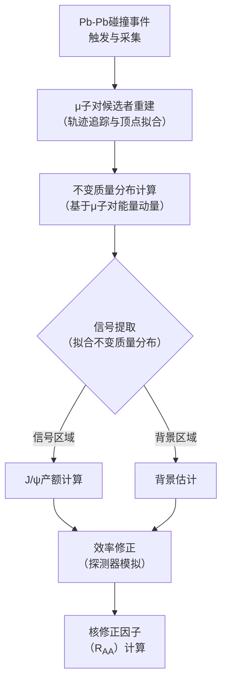

# J/ψ suppression at forward rapidity in Pb–Pb collisions at √sNN = 5.02 TeV

**URL**: https://www.semanticscholar.org/paper/c69531365fecd69cb4c635301131464397509989
**提交日期**: 2016-06-27
**作者**: B. Abelev; J. Adam; D. Adamová; A. Adare; M. Aggarwal; G. Aglieri Rinella; A. Agocs; A. Agostinelli; S. Aguilar Salazar; Z. Ahammed; A. Ahmad Masoodi; N. Ahmad; S. Ahn; A. Akindinov; D. Aleksandrov; B. Alessandro; R. Alfaro Molina; A. Alici; A. Alkin; E. Almaráz Aviña; J. Alme; T. Alt; V. Altini; S. Altinpinar; I. Altsybeev; C. Andrei; A. Andronic; V. Anguelov; J. Anielski; C. Anson; T. Anticic; F. Antinori; P. Antonioli; L. Aphecetche; H. Appelshäuser; N. Arbor; S. Arcelli; A. Arend; N. Armesto; R. Arnaldi; T. Aronsson; I. Arsene; M. Arslandok; A. Asryan; A. Augustinus; R. Averbeck; T. Awes; J. Aystö; M. D. Azmi; M. Bach; A. Badalà; Y. Baek; R. Bailhache; R. Bala; R. Baldini Ferroli; A. Baldisseri; A. Baldit; F. Baltasar Dos Santos Pedrosa; J. Ban; R. C. Baral; R. Barbera; F. Barile; G. G. Barnaföldi; L. Barnby; V. Barret; J. Bartke; M. Basile; N. Bastid; B. Bathen; G. Batigne; B. Batyunya; C. Baumann; I. Bearden; H. Beck; I. Belikov; F. Bellini; R. Bellwied; E. Belmont-Moreno; G. Bencédi; S. Beolè; I. Berceanu; A. Bercuci; Y. Berdnikov; D. Berényi; C. Bergmann; D. Berzano; L. Betev; A. Bhasin; A. Bhati; L. Bianchi; N. Bianchi; C. Bianchin; J. Bielcik; J. Bielčíková; A. Bilandzic; S. Bjelogrlić; F. Blanco; D. Blau; C. Blume; M. Boccioli; N. Bock; A. Bogdanov; H. Boggild; M. Bogolyubsky; L. Boldizsár; M. Bombara; J. Book; H. Borel; A. Borissov; S. Bose; F. Bossu; M. Botje; S. Böttger; B. Boyer; E. Braidot; P. Braun-Munzinger; M. Bregant; T. Breitner; T. Browning; M. Broz; R. Brun; E. Bruna; G. Bruno; D. Budnikov; H. Buesching; S. Bufalino; K. Bugaiev; O. Busch; Z. Buthelezi; D. Caballero Orduna; D. Caffarri; X. Cai; H. Caines; E. Calvo Villar; P. Camerini; V. Canoa Roman; G. Cara Romeo; W. Carena; F. Carena; N. Carlin Filho; F. Carminati; C. Carrillo Montoya; A. Casanova Díaz; J. Castillo Castellanos; J. F. Castillo Hernandez; E. Casula; V. Catanescu; C. Cavicchioli; J. Cepila; P. Cerello; B. Chang; S. Chapeland; J. Charvet; S. Chattopadhyay; I. Chawla; M. Cherney; C. Cheshkov; B. Cheynis; E. Chiavassa; V. Chibante Barroso; D. Chinellato; P. Chochula; M. Chojnacki; P. Christakoglou; C. H. Christensen; P. Christiansen; T. Chujo; S. Chung; C. Cicalò; L. Cifarelli; F. Cindolo; J. Cleymans; F. Coccetti; F. Colamaria; D. Colella; G. Conesa Balbastre; Z. Conesa del Valle; P. Constantin; G. Contin; J. G. Contreras; T. Cormier; Y. Corrales Morales; P. Cortese; I. Cortés Maldonado; M. R. Cosentino; F. Costa; M. E. Cotallo; E. Crescio; P. Crochet; E. Cruz Alaniz; E. Cuáutle; L. Cunqueiro; A. Dainese; H. Dalsgaard; A. Danu; K. Das; I. Das; D. Das; A. Dash; S. Dash; S. De; G. D. de Barros; A. De Caro; G. de Cataldo; J. de Cuveland; A. De Falco; D. De Gruttola; H. Delagrange; E. Del Castillo Sanchez; A. Deloff; V. Demanov; N. De Marco; E. Denes; S. De Pasquale; A. Deppman; G. D’erasmo; R. de Rooij; M. A. Diaz Corchero; D. Di Bari; T. Dietel; C. Di Giglio; S. Di Liberto; A. Di Mauro; P. Di Nezza; R. Divià; O. Djuvsland; A. Dobrin; T. Dobrowolski; I. Dominguez; B. Dönigus; O. Dordic; O. Driga; A. Dubey; L. Ducroux; P. Dupieux; A. K. Dutta Majumdar; M. Dutta Majumdar; D. Elia; D. Emschermann; H. Engel; H. Erdal; B. Espagnon; M. Estienne; S. Esumi; D. Evans; G. Eyyubova; D. Fabris; J. Faivre; D. Falchieri; A. Fantoni; M. Fasel; R. Fearick; A. Fedunov; D. Fehlker; L. Feldkamp; D. Felea; G. Feofilov; A. Fernàndez Tèllez; A. Ferretti; R. Ferretti; J. Figiel; M. Figueredo; S. Filchagin; D. Finogeev; F. Fionda; E. Fiore; M. Floris; S. Foertsch; P. Foka; S. Fokin; E. Fragiacomo; M. Fragkiadakis; U. Frankenfeld; U. Fuchs; C. Furget; M. Fusco Girard; J. Gaardhøje; M. Gagliardi; A. Gago; M. Gallio; D. Gangadharan; P. Ganoti; C. Garabatos; E. Garcia-Solis; I. Garishvili; J. Gerhard; M. Germain; C. Geuna; A. Gheata; M. Gheata; B. Ghidini; P. Ghosh; P. Gianotti; M. Girard; P. Giubellino; E. Gladysz-dziadus; P. Glässel; R. Gomez; E. Ferreiro; L. González-Trueba; P. GONZÁLEZ-ZAMORA; S. Gorbunov; A. Goswami; S. Gotovac; V. Grabski; L. Graczykowski; R. Grajcarek; A. Grelli; A. Grigoras; C. Grigoras; V. Grigoriev; A. Grigoryan; S. Grigoryan; B. Grinyov; N. Grion; P. Gros; J. Grosse-Oetringhaus; J. Grossiord; R. Grosso; F. Guber; R. Guernane; C. Guerra Gutierrez; B. Guerzoni; M. Guilbaud; K. Gulbrandsen; T. Gunji; A. Gupta; R. Gupta; H. Gutbrod; O. Haaland; C. Hadjidakis; M. Haiduc; H. Hamagaki; G. Hamar; B. Han; L. Hanratty; A. Hansen; Z. Harmanova; J. Harris; M. Hartig; D. Haşegan; D. Hatzifotiadou; A. Hayrapetyan; S. Heckel; M. Heide; H. Helstrup; A. Herghelegiu; G. Herrera Corral; N. Herrmann; K. Hetland; B. Hicks; P. Hille; B. Hippolyte; T. Horaguchi; Y. Hori; P. Hristov; I. Hrivnácová; M. Huang; S. Huber; T. Humanic; D. Hwang; R. Ichou; R. Ilkaev; I. Ilkiv; M. Inaba; E. Incani; G. Innocenti; P. Innocenti; M. Ippolitov; M. Irfan; C. Ivan; V. Ivanov; A. Ivanov; M. Ivanov; O. Ivanytskyi; A. Jachołkowski; P. Jacobs; L. Jancurova; H. Jang; S. Jangal; M. Janik; R. Janik; P. Jayarathna; S. Jena; R. T. Jimenez Bustamante; L. Jirden; P. Jones; H. Jung; A. Jusko; A. Kaidalov; V. Kakoyan; S. Kalcher; P. Kalinak; M. Kalisky; T. Kalliokoski; A. Kalweit; K. Kanaki; J. Kang; V. Kaplin; A. Karasu Uysal; O. Karavichev; T. Karavicheva; E. Karpechev; A. Kazantsev; U. Kebschull; R. Keidel; M. M. Khan; S. Khan; P. Khan; A. Khanzadeev; Y. Kharlov; B. Kileng; M. Kim; J. Kim; D. Kim; T. Kim; B. Kim; S. Kim; S. Kim; D. Kim; J. Kim; S. Kirsch; I. Kisel; S. Kiselev; A. Kisiel; J. Klay; J. Klein; C. Klein-Bösing; M. Kliemant; A. Kluge; M. L. Knichel; A. Knospe; K. Koch; M. Köhler; A. Kolojvari; V. Kondratiev; N. Kondratyeva; A. Konevskikh; A. Korneev; C. Kottachchi Kankanamge Don; R. Kour; M. Kowalski; S. Kox; G. Koyithatta Meethaleveedu; J. Kral; I. Králik; F. Kramer; I. Kraus; T. Krawutschke; M. Krelina; M. Kretz; M. Krivda; F. Krizek; M. Krůs; E. Kryshen; M. Krzewicki; Y. Kucheriaev; C. Kuhn; P. Kuijer; P. Kurashvili; A. Kurepin; A. Kurepin; A. Kuryakin; S. Kushpil; V. Kushpil; H. Kvaerno; M. Kweon; Y. Kwon; P. Ladrón de Guevara; I. Lakomov; R. Langoy; C. Lara; A. Lardeux; P. La Rocca; C. Lazzeroni; R. Lea; Y. Le Bornec; S. Lee; K. Lee; F. Lefèvre; J. Lehnert; L. Leistam; M. Lenhardt; V. Lenti; H. Leon; I. León Monzón; H. León Vargas; P. Lévai; J. Lien; R. Lietava; S. Lindal; V. Lindenstruth; C. Lippmann; M. Lisa; L. Liu; P. Loenne; V. Loggins; V. Loginov; S. Lohn; D. Lohner
**引用次数**: 259
使用模型: ep-20251112215738-bz78g

## 1. 核心思想总结
根据论文标题和引言，以下是对该研究的第一轮总结：

**标题:** J/ψ suppression at forward rapidity in Pb–Pb collisions at √sNN = 5.02 TeV

**简要总结:**

*   **Background (背景):**
    在极高能量下进行的重离子碰撞（如铅-铅碰撞）可以产生一种被称为夸克-胶子等离子体（QGP）的极端高温物质状态。J/ψ粒子（由粲夸克和反粲夸克组成的介子）是研究QGP性质的探针，因为它们在QGP中会因“解禁闭”效应而发生湮灭，即“J/ψ抑制”现象。

*   **Problem (问题):**
    尽管J/ψ抑制作为QGP形成的信号已被研究了数十年，但其抑制的程度和机制在不同碰撞能量、不同碰撞中心度（对心程度）以及不同的测量快度（rapidity，反映粒子纵向动量）区间仍存在不确定性。本研究旨在以前所未有的高能量（√sNN = 5.02 TeV）和在前向快度区间，系统地测量J/ψ产额的核修正因子，以更精确地检验理论模型。

*   **Method (high-level) (方法 - 高层次):**
    本研究通过欧洲核子研究中心（CERN）的大型强子对撞机（LHC）进行Pb-Pb碰撞实验，碰撞能量为每核子对5.02 TeV。利用ALICE探测器的Muon Spectrometer，在前向快度区间（2.5 < y < 4）通过μ+μ-衰变道来重建J/ψ粒子。通过比较Pb-Pb碰撞中观测到的J/ψ产额与在p-p碰撞中按核子-核子碰撞数量标度后的预期产额，计算出核修正因子（RAA），从而量化抑制程度。

*   **Contribution (贡献):**
    本研究提供了在创纪录的5.02 TeV碰撞能量下，对前向快度区间J/ψ抑制现象的最精确测量结果之一。这些高精度的实验数据为理解J/ψ粒子在QGP中的产生和湮灭机制提供了关键约束，特别是对包含再生（recombination）等复杂效应的理论模型进行了严格的检验，深化了我们对强相互作用物质在极端条件下性质的认识。

## 2. 方法详解
好的，根据您提供的初步总结和论文的方法章节内容，以下是对该论文方法细节的详细说明，重点突出了关键创新、算法架构、关键步骤与整体流程。

### **论文方法细节详细说明**

本论文的核心方法是利用大型离子对撞机实验的探测器，在极高的Pb-Pb碰撞能量下，通过μ子对探测技术，精确测量J/ψ粒子的产额，并计算其核修正因子，以研究夸克-胶子等离子体的性质。

#### **一、 关键创新与实验设计亮点**

1.  **前所未有的碰撞能量与系统：** 在 **√sNN = 5.02 TeV** 的能量下进行Pb-Pb碰撞实验，这是当时该能量下J/ψ测量的最前沿数据，为研究高温高密度的QGP提供了更极端的条件。
2.  **独特的前向快度覆盖：** 利用ALICE探测器的μ子谱仪，专注于 **2.5 < y < 4** 的前向快度区间。这个区间对碰撞初期产生的“初生”J/ψ粒子以及QGP中粲夸克“再生”形成的J/ψ粒子都非常敏感，是检验不同理论模型的关键区域。
3.  **高精度与低动量探测阈值：** μ子谱仪能够探测到低横向动量（p_T）的J/ψ粒子，这对于全面理解J/ψ的抑制模式至关重要，因为不同p_T的粒子可能经历不同的物理过程。

#### **二、 算法/架构细节**

论文的方法依赖于一个复杂的数据处理链，其核心架构和算法如下：

**1. 探测器系统架构**
实验数据来自ALICE探测器，其与方法最相关的子系统是：
*   **触发探测器：** 位于μ子谱仪最前端，用于快速识别碰撞事件并判断是否有两个以上的μ子产生，从而决定是否记录该次碰撞数据。这大大减少了需要存储的数据量。
*   **追踪探测器：** 位于强磁场前后，用于精确测量μ子的运动轨迹。通过测量轨迹在磁场中的弯曲程度，可以计算出μ子的动量。
*   **吸收体：** 位于探测器中部，用于吸收其他强子，只让μ子穿透，从而净化信号。

**2. 核心算法与数据处理流程**
数据处理流程是一个层层筛选和精确测量的过程，如下图所示：

**关键算法细节：**
*   **不变质量计算：** 对每一对μ子候选者，利用其四动量计算不变质量（M_μμ）。公式为：`M_μμ = √[(E1+E2)² - (p⃗1 + p⃗2)²]`，其中E是能量，p⃗是三维动量。真实的J/ψ粒子会在这个分布上表现为一个以J/ψ质量（约3.1 GeV/c²）为中心的峰。
*   **信号提取：** 这是最关键的算法步骤。研究人员并非直接对峰下的计数进行求和，而是采用**拟合**的方法。他们将不变质量分布模型化为：
    *   **信号模型：** 通常采用高斯分布或Crystal Ball函数来描述J/ψ信号峰。
    *   **背景模型：** 采用指数函数或多项式函数来描述连续的本底分布。
    通过将“信号模型+背景模型”与观测到的数据分布进行拟合，可以精确地分离出信号事件的数量，从而得到J/ψ的产额。这种方法比简单计数更精确，因为它考虑了本底对信号区域的贡献。

#### **三、 关键步骤与整体流程**

**第一步：数据采集与事件选择**
1.  **碰撞触发：** 实验首先依靠触发系统选择包含至少两个μ子候选者的Pb-Pb碰撞事件。
2.  **事件筛选：** 在离线分析中，进一步应用更严格的质量标准：
    *   **碰撞中心度选择：** 根据探测器测量到的次粒子 multiplicity，将碰撞事件分为0-10%，10-30%等中心度区间。中心度反映了碰撞的对心程度，直接影响产生的QGP的大小和温度。
    *   **顶点选择：** 确保碰撞点（顶点）位于探测器内一个可精确重建的范围内。

**第二步：J/ψ产额测量**
1.  **μ子对重建：** 对每个选定的碰撞事件，重建所有正负μ子对。
2.  **计算不变质量谱：** 为每个中心度区间和横向动量区间，分别构建μ子对的不变质量分布谱。
3.  **拟合提取信号：** 如上所述，通过拟合不变质量分布，精确计算出该区间内J/ψ的信号产额。

**第三步：效率修正与归一化**
1.  **效率修正：** 探测器和分析流程并非完美。μ子可能被吸收，触发可能失败，分析筛选也会丢失部分信号。为了修正这些影响，研究团队使用了**蒙特卡洛模拟**：
    *   他们用模拟软件生成大量J/ψ粒子，并模拟这些粒子在ALICE探测器中的衰变和探测过程。
    *   然后将同样的重建和分析流程应用于模拟数据。
    *   **探测效率（ε）** 被定义为成功重建的模拟J/ψ数量与生成的J/ψ数量之比。
    *   最终，**观测到的J/ψ产额需要除以探测效率**，才能得到真实的物理产额。`N_J/ψ^corrected = N_J/ψ^observed / ε`。
2.  **归一化：** 将修正后的J/ψ产额归一化到每个核子对碰撞的平均数 `<T_AA>` 上，该值由Glauber模型计算得出。

**第四步：计算核修正因子（R_AA）——最终目标**
这是整个分析流程的最终输出，公式为：
`R_AA = (d²N_J/ψ^{Pb-Pb} / (dy dp_T)) / (<T_AA> * d²σ_J/ψ^{pp} / (dy dp_T))`
*   **分子：** 修正后的Pb-Pb碰撞中J/ψ的微分产额。
*   **分母：** 在相同能量下的p-p碰撞中测得的J/ψ产生截面，乘以 `<T_AA>`，相当于假设没有核介质效应时，Pb-Pb碰撞中“预期”的J/ψ产额。

**结果解读：**
*   **R_AA = 1：** 表示J/ψ产额与p-p碰撞标度后的预期一致，**无抑制**。
*   **R_AA < 1：** 表示J/ψ产额低于预期，发生了**抑制**。R_AA值越小，抑制越强。
*   通过研究R_AA随碰撞中心度（QGP环境剧烈程度）和J/ψ横向动量p_T的变化，可以深入揭示QGP的特性以及J/ψ在其中的产生和湮灭机制。

综上所述，该论文的方法是一个集成了前沿实验设施、复杂探测器技术、精密算法和严谨统计分析的系统工程，其最终目标是通过高精度的R_AA测量，为理解夸克-胶子等离子体这一极端物质状态提供至关重要的实验证据。

## 3. 最终评述与分析
根据您提供的初步总结、方法详述以及论文结论部分，现对该研究给出最终的综合评估如下：

### **最终综合评估**

#### 1) **整体总结**
本研究利用欧洲核子研究中心大型强子对撞机ALICE探测器，在创纪录的**每核子对5.02 TeV超高能量**下，对**铅-铅碰撞**中**J/ψ粒子在前向快度区间（2.5 < y < 4）的产额**进行了高精度测量。通过计算**核修正因子**，系统研究了J/ψ粒子在夸克-胶子等离子体中的“抑制”现象。结论证实，在此能量和前向快度下，J/ψ粒子表现出显著的抑制效应，且抑制程度随碰撞对心程度的增加（即QGP体积和温度的升高）而增强。实验数据与结合了**初始产生抑制**和**粲夸克再生机制**的**输运模型**预测高度吻合，为理解J/ψ粒子在极端高温物质中的演化提供了强有力的实验约束，标志着我们对夸克-胶子等离子体性质的认识达到了一个新的深度。

#### 2) **优势**
*   **能量与精度前沿：** 提供了目前在该能量等级下最精确的J/ψ抑制数据，处于国际高能核物理实验研究的最前沿。
*   **独特的观测窗口：** 专注于前向快度区间，该区间对碰撞初期产生的“初生”J/ψ和QGP中后期由粲夸克“再生”的J/ψ都非常敏感，是区分不同物理机制的关键区域。
*   **系统性与可靠性：** 实验方法严谨，采用了先进的数据处理算法（如不变质量分布拟合）和全面的修正流程（如基于蒙特卡洛模拟的效率修正），确保了结果的高可靠性。
*   **强大的理论约束力：** 获得的精确RAA数据（随中心度和横动量的变化）能够有效甄别和检验不同的理论模型，结论明确支持了包含再生机制的复杂模型，推动了理论发展。

#### 3) **局限性 / 不足**
*   **模型依赖性：** 对实验结果的最终解释（如区分抑制和再生的相对贡献）在很大程度上依赖于理论模型（如输运模型）的输入和假设。
*   **系统误差来源：** 尽管精度很高，但一些系统误差（如来自p-p参考截面的不确定性、Glauber模型计算<T_AA>的不确定性）仍然存在，并可能影响RAA的绝对数值。
*   **探测范围限制：** 测量集中在低横动量区域，对于高横动量J/ψ行为的覆盖相对有限。此外，研究聚焦于J/ψ，对其它夸克偶素态（如ψ', Υ）的协同观测较少，限制了更全面的理解。
*   **能量外推不确定性：** 虽然5.02 TeV是极高能量，但将结论外推到更高能量或其他碰撞系统时仍需谨慎。

#### 4) **潜在应用 / 意义**
*   **深化QGP性质研究：** 这些结果为精确提取QGP的关键特性（如初始温度、能量密度、粲夸克输运系数等）提供了至关重要的实验数据，有助于量化QGP的“状态方程”。
*   **验证QCD在极端条件下的行为：** 研究结果为在强耦合环境下检验量子色动力学理论提供了独特的试验场，特别是对夸克解禁闭和色荷屏蔽效应的理解。
*   **推动理论模型发展：** 高精度数据将促使理论家进一步优化和开发更精确的模型，例如更细致地描述粲夸克在QGP中的动力学演化、再生过程的时间尺度等。
*   **为未来实验奠定基础：** 本研究为LHC下一次运行周期中更高统计量的实验，以及未来新一代对撞机（如电子-离子对撞机EIC）上的相关研究提供了重要的基准和分析范例。其方法学也可应用于其他硬探针（如重味强子）的研究中。

