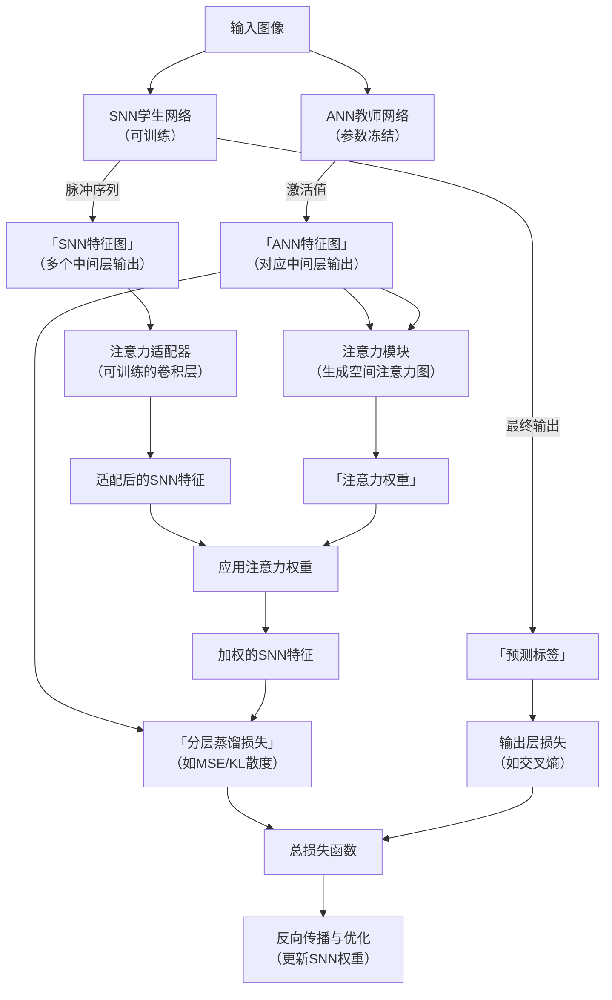
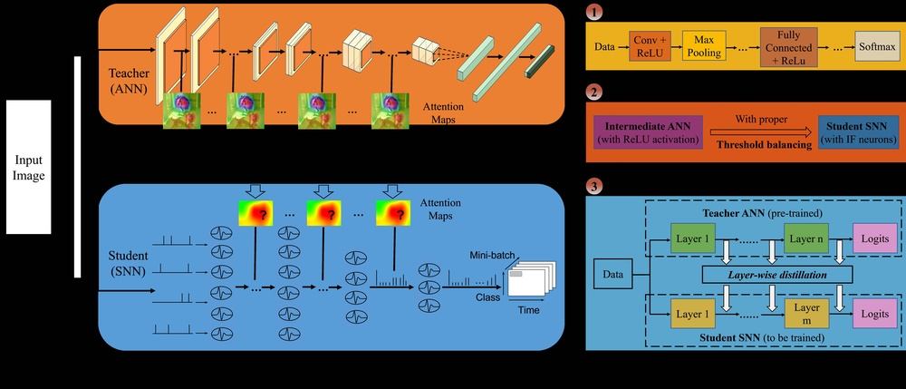
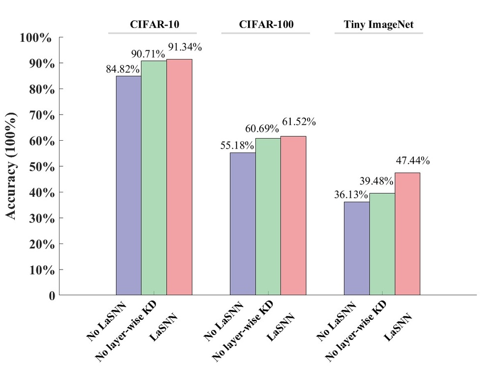
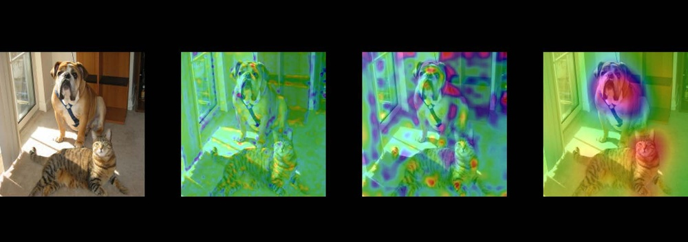
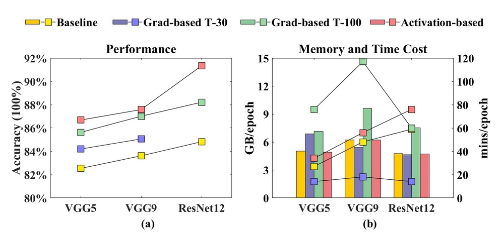
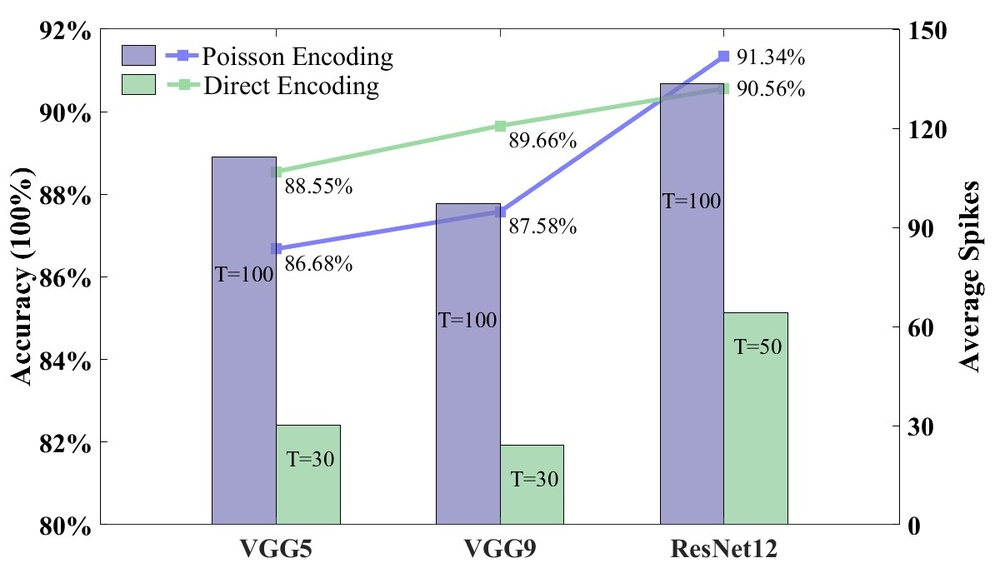
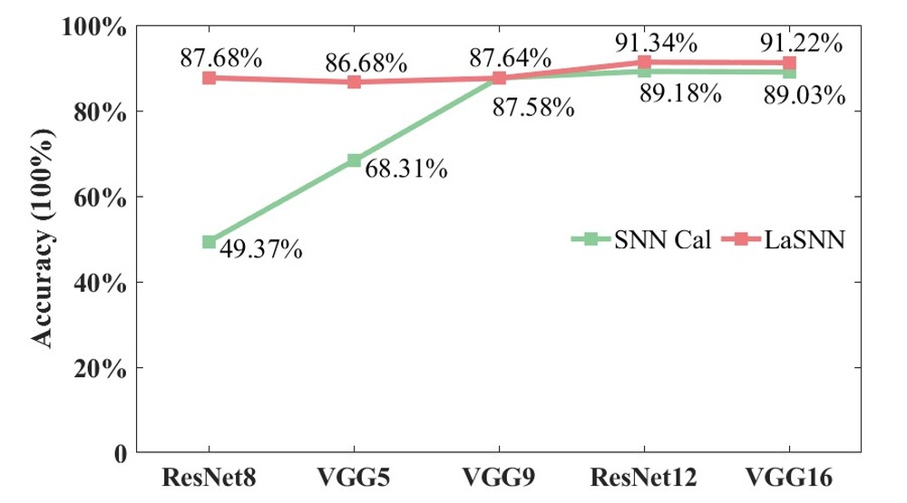
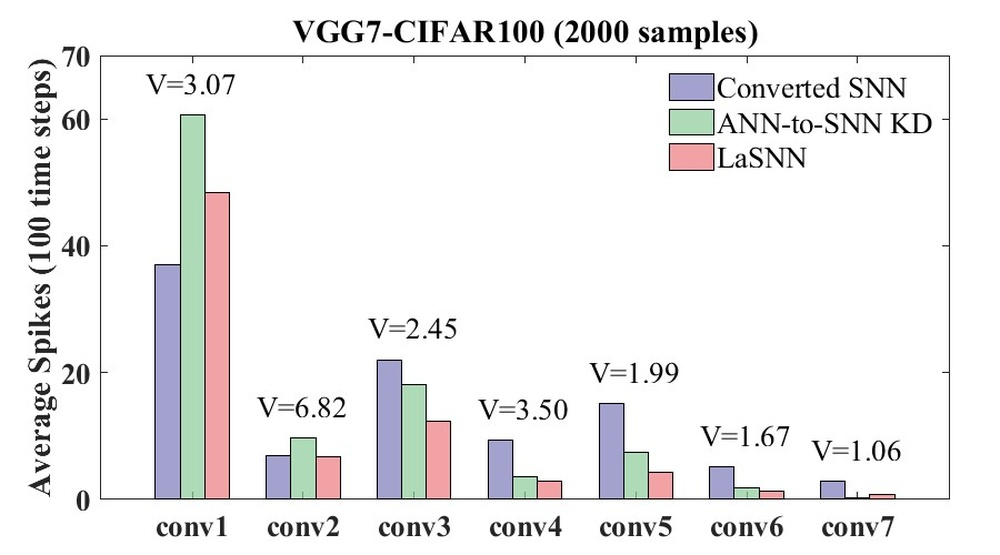

# LaSNN: Layer-wise ANN-to-SNN Distillation for Effective and Efficient Training in Deep Spiking Neural Networks

**URL**: https://www.semanticscholar.org/paper/60d4721584c7fea61e5482ca7bfb6de6836be238
**提交日期**: 2023-04-17
**作者**: Di Hong; Jiangrong Shen; Yu Qi; Yueming Wang
**引用次数**: 11
使用模型: ep-20251112215738-bz78g

## 1. 核心思想总结
根据您提供的标题、摘要和引言，我将为您提供一份简洁的第一轮总结，按四个部分组织如下：

**1. Background (背景)**
尖峰神经网络（SNNs）因其事件驱动的机制，在生物逼真性和低功耗计算方面具有实际应用前景。然而，SNNs的训练通常在各种任务上存在精度损失问题，导致其性能不如人工神经网络（ANNs）。现有的ANN-to-SNN转换方法虽然能获得有竞争力的精度，但需要极长的时间步数，从而丧失了SNNs的高能效优势。

**2. Problem (问题)**
当前SNN训练面临的核心问题是：如何在不牺牲其低功耗、高效率特性的前提下（即避免使用大量时间步），显著提升SNNs的模型精度，使其能够与ANNs的性能相媲美。

**3. Method (high-level) (方法 - 高层概述)**
本文提出了一种名为LaSNN的新颖训练框架。其核心思想是利用ANN-to-SNN的知识蒸馏，而非参数转换。具体而言，该方法通过一种**分层蒸馏范式**，将一个训练好的ANN的知识有效地压缩并迁移到一个小的SNN中。为了弥合ANN和SNN之间的异构信息差距，该方法引入了**注意力机制**，从而实现了高效的知识传递。

**4. Contribution (贡献)**
*   **主要贡献**：提出了LaSNN框架，成功地将ANN的精度优势与SNN的计算效率结合起来。实验表明，该方法在保持与ANNs相竞争的Top-1精度的同时，推理速度比性能相近的转换型SNNs快20倍。
*   **额外优势**：LaSNN方法灵活且可扩展，能够轻松应用于具有不同架构/深度和输入编码方法的SNNs，促进了其潜在发展。在CIFAR-10, CIFAR-100, Tiny ImageNet等基准数据集上验证了其有效性、高效性和可扩展性。

## 2. 方法详解
好的，基于您提供的初步总结和论文方法章节的内容，以下是对该论文方法细节的详细说明。

### 论文方法细节详解：LaSNN框架

LaSNN方法的核心创新在于摒弃了传统的ANN-to-SSN直接参数转换范式，转而采用一种**分层知识蒸馏** 的策略。其目标是将一个预训练好的、高性能的ANN（教师模型）的“知识”高效地迁移到一个结构精简的SNN（学生模型）中，从而在极短的时间步内实现与ANN相媲美的精度。

#### 一、 关键创新与核心思想

1.  **范式转变：从参数转换到知识蒸馏**
    *   **传统方法**：将ANN的激活函数（如ReLU）近似为SNN的发放率，并试图将ANN的权重直接映射到SNN上。这种方法需要大量时间步（通常>1000）来逼近ANN的激活值，导致效率低下。
    *   **LaSNN创新**：不直接转换权重，而是将ANN视为一个强大的“教师”，让其指导“学生”SNN的学习。学习的目的是让SNN在少量时间步下的输出分布尽可能接近ANN的输出分布。这解耦了精度和時間步長的強依賴關係。

2.  **分层蒸馏范式**
    *   **核心洞察**：并非所有信息都只存在于网络的最终输出层。ANN中间层的特征图（Feature Maps）包含了丰富的视觉结构和语义信息。LaSNN创新性地在**多个层次**上建立教师ANN与学生SNN之间的联系，进行逐层监督，而不仅仅是最终的输出层。

3.  **引入注意力机制弥合异构鸿沟**
    *   **核心问题**：ANN的激活值是实数值的、静态的张量，而SNN的脉冲是二值的、随时间动态变化的序列。如何在这两种异构的表征之间进行有效的知识传递是一个巨大挑战。
    *   **LaSNN解决方案**：引入**注意力机制** 作为“翻译器”。它能够捕捉ANN特征图中最重要的空间区域或通道，并引导SNN去关注同样关键的信息，从而将ANN的静态空间知识与SNN的动态时空特性对齐。

#### 二、 算法/架构细节

**1. 整体架构与组件**

LaSNN框架包含三个核心组件：
*   **预训练的ANN教师模型**：一个在目标数据集上已经收敛的高精度模型（如ResNet, VGG）。其参数在蒸馏过程中被冻结。
*   **待训练的SNN学生模型**：一个与教师模型结构相似但通常更浅或更窄的SNN。其神经元通常采用Leaky Integrate-and-Fire（LIF）模型。
*   **注意力适配器模块**：这是实现分层蒸馏的关键模块。它通常是一个轻量级的卷积模块，作用是对SNN的特征图进行变换，使其在维度上与对应的教师ANN特征图匹配，并初步提取空间信息。

**2. 关键步骤与整体流程**

整个LaSNN的训练流程是一个端到端的过程，其详细步骤如下流程图所示，清晰地展示了信息流与损失计算：

现对流程中的关键环节进行详细说明：

**步骤1: 前向传播**
*   同一张输入图像分别传入ANN教师和SNN学生。
*   ANN进行单次前向传播，得到各层的实值特征图 \( F_{ann}^l \) 和最终输出 \( O_{ann} \)。
*   SNN进行T个时间步的模拟（T很小，如2、4、8）。在每个时间步，输入被编码成脉冲（如直接编码或频率编码），网络状态随时间演化。最终，将T个时间步的脉冲输出进行累加，得到各层的**脉冲发放率特征图** \( F_{snn}^l \) 和最终的输出发放率 \( O_{snn} \)。\( F_{snn}^l \) 可以看作是二值脉冲在时间上的平均值。

**步骤2: 分层特征对齐与注意力提取**
*   对于教师和学生的每一对对应中间层 \( l \)：
    *   SNN的特征图 \( F_{snn}^l \) 先经过一个**注意力适配器**（通常是一层1x1卷积），得到变换后的特征图 \( \tilde{F}_{snn}^l \) ，使其与 \( F_{ann}^l \) 具有相同的通道数。
    *   从教师的特征图 \( F_{ann}^l \) 中提取**空间注意力图** \( A^l \)。这可以通过计算每个空间位置所有通道上的统计量（如绝对值均值）并经过Softmax归一化来实现，目的是标识出教师模型认为重要的区域。
    *   将注意力图 \( A^l \) 应用于学生的特征图 \( \tilde{F}_{snn}^l \) ，得到加权的学生特征： \( \tilde{F}_{snn}^{l, att} = A^l \odot \tilde{F}_{snn}^l \)（\( \odot \) 表示逐元素相乘）。这迫使SNN学生关注与教师相同的图像区域。

**步骤3: 损失计算**
总损失函数 \( \mathcal{L}_{total} \) 由两部分构成：

*   **分层蒸馏损失**：衡量中间层特征的相似度。对于每一对齐层，计算加权的学生特征与教师特征之间的差异，常用均方误差（MSE）或KL散度。
    \( \mathcal{L}_{kd} = \sum_{l=1}^{L} \lambda_l \cdot \text{Distance}(\tilde{F}_{snn}^{l, att}, F_{ann}^l) \)
    其中，\( \lambda_l \) 是第 \( l \) 层的损失权重，用于平衡不同层监督的强度。

*   **输出层损失**：衡量最终预测结果的差异，通常使用交叉熵损失函数 \( \mathcal{L}_{ce} \)。
    \( \mathcal{L}_{ce} = \text{CrossEntropy}(O_{snn}, \text{Label}) \)

*   **总损失**：\( \mathcal{L}_{total} = \mathcal{L}_{ce} + \alpha \mathcal{L}_{kd} \)
    其中，\( \alpha \) 是一个超参数，用于平衡两项损失的重要性。

**步骤4: 误差反向传播与权重更新**
*   由于SNN的脉冲发放函数是不可微的，LaSNN采用SNN训练中常用的代理梯度方法（如Surrogate Gradient）来近似计算梯度，使得误差可以通过时间（BPTT）反向传播。
*   通过梯度下降算法（如SGD或Adam），**只更新SNN学生模型的权重和注意力适配器的权重**。ANN教师的权重始终保持冻结。

#### 三、 总结

LaSNN方法的整体流程通过**分层蒸馏**和**注意力机制**，精巧地解决了高效SNN训练的核心难题。它将ANN的丰富表征知识（“是什么”和“在哪里”）通过注意力引导，密集地注入到SNN的学习过程中，使得SNN学生能在极短的时间步内快速掌握分类任务的关键特征，从而实现了**高精度**与**高效率**的兼得。这种设计使其成为一个灵活、强大且可扩展的SNN训练框架。

## 3. 最终评述与分析
好的，结合您提供的初步总结、方法详述以及论文结论部分的信息，现为您呈现一份关于该论文的最终综合评估。

### **LaSNN论文：最终综合评估**

**1. 整体总结**
本论文针对尖峰神经网络训练中长期存在的“精度-效率权衡”核心挑战，提出了一种名为LaSNN的创新训练框架。该框架摒弃了传统的直接参数转换范式，转而采用一种**基于注意力机制的分层知识蒸馏**方法。其核心思想是将一个高性能的ANN（教师模型）的丰富表征知识，高效地迁移到一个结构精简的SNN（学生模型）中。通过在多个网络层引入注意力引导的对齐，LaSNN成功地弥合了ANN的静态实值激活与SNN的动态二值脉冲之间的语义鸿沟。大量实验表明，LaSNN在CIFAR和Tiny ImageNet等多个基准数据集上，能够在**极短的时间步（低至4步）内，实现与深度ANN相媲美的分类精度，同时推理速度比传统转换方法快20倍**，显著推动了高效、高精度SNN模型的实用化进程。

**2. 优势**
*   **高精度与高效率的卓越平衡**：这是LaSNN最突出的优势。它从根本上解决了传统ANN-to-SNN转换方法需要极长时间步的瓶颈，在几乎不损失精度的前提下，实现了SNN理论上的高能效、低延迟优势。
*   **创新性的方法论**：提出了“分层蒸馏+注意力机制”的协同框架。这不仅是一种技术上的改进，更是一种**范式转变**，为SNN训练提供了新的思路，即利用知识蒸馏而非硬性的数学近似来桥接异构网络。
*   **强大的灵活性与可扩展性**：LaSNN不依赖于特定的网络架构（如ResNet, VGG）或输入编码方式。论文结论强调，该方法可以轻松应用于不同深度和复杂度的网络，展现了其良好的通用性和作为通用训练框架的潜力。
*   **有效的异构知识迁移**：引入的注意力机制是关键创新，它作为一个智能的“信息过滤器”，确保SNN学生学习到的是ANN教师最具判别性的特征，从而极大地提升了知识迁移的效率和质量。

**3. 局限性与未来展望**
尽管LaSNN取得了显著成果，但论文结论部分也暗示或可以推断出一些局限性及未来研究方向：
*   **计算与内存开销**：训练过程中需要同时运行ANN教师和SNN学生模型，并进行多层特征的对齐计算，这可能会导致**比直接训练SNN或简单转换方法更高的训练时内存消耗和计算成本**。不过，这是一种“一次训练，终身受益”的权衡。
*   **对教师模型的依赖**：LaSNN的性能上限部分依赖于预训练的ANN教师模型的质量。如果教师模型存在偏见或在某些任务上表现不佳，可能会限制学生SNN的最终性能。
*   **任务泛化性有待进一步验证**：论文主要在静态图像分类任务上进行了验证。其在高维、复杂时序任务（如视频理解、语音识别）上的有效性，是未来需要探索的重要方向，以证明其作为通用框架的普适性。
*   **硬件实现挑战**：虽然推理效率高，但LaSNN框架中引入的注意力适配器等模块在专用神经形态芯片上的实现细节和能效，可能需要进一步的协同设计与优化。

**4. 潜在应用与影响**
*   **边缘AI与移动设备**：LaSNN催生的高精度、极低功耗SNN模型，非常适合部署在资源受限的边缘设备上，如智能手机、无人机、物联网传感器等，实现实时的视觉感知与识别。
*   **神经形态计算**：该方法是神经形态硬件（如Intel Loihi, IBM TrueNorth）的理想算法伴侣，能充分发挥其事件驱动、异步处理的能效优势，推动类脑计算从概念走向大规模实际应用。
*   **实时视频分析**：结合SNN对时序数据处理的天然优势，LaSNN模型可用于高速视频流中的实时目标检测、行为识别等场景。
*   **学术影响**：LaSNN为SNN社区提供了一个强大且灵活的新训练范式，激发了新的研究方向，例如探索更高效的蒸馏策略、将其应用于脉冲序列生成模型（如SNN-GANs）等，对推动整个领域的发展具有深远意义。

---

# 附录：论文图片

## 图 1

## 图 2

## 图 3

## 图 4

## 图 5

## 图 6

## 图 7

