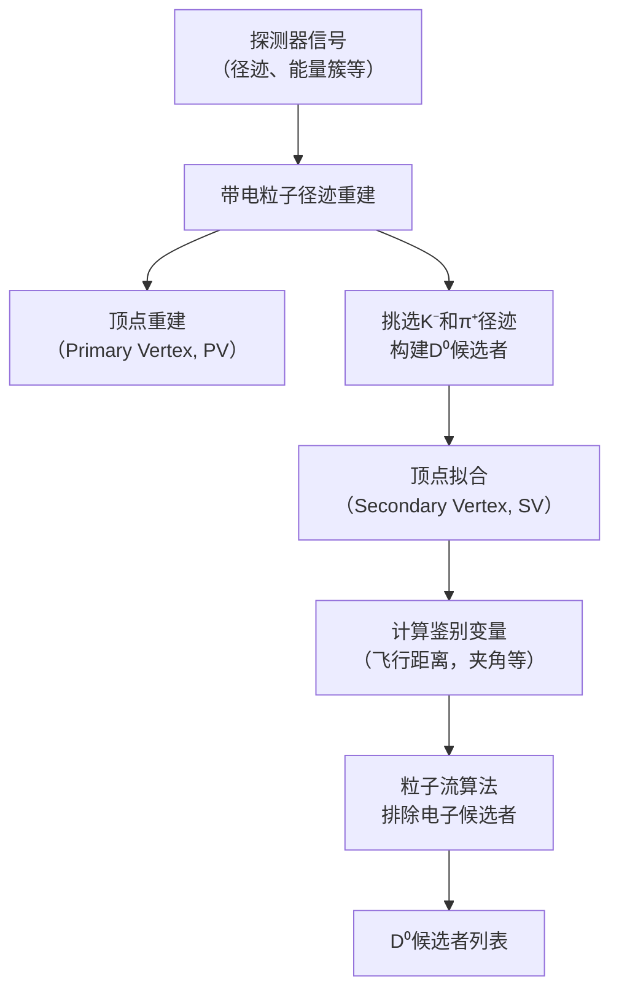

# Nuclear modification factor of D0 mesons in PbPb collisions at sNN=5.02TeV

**URL**: https://www.semanticscholar.org/paper/53f65cb0aeefcf9db589581c4b62ed87d8c3b64b
**提交日期**: 2017-08-16
**作者**: A. Sirunyan; A. Tumasyan; W. Adam; F. Ambrogi; E. Asilar; T. Bergauer; J. Brandstetter; E. Brondolin; M. Dragicevic; J. Eroe; M. Flechl; M. Friedl; R. Fruehwirth; V. Ghete; J. Grossmann; J. Hrubec; M. Jeitler; A. Koenig; N. Krammer; I. Kraetschmer; D. Liko; T. Madlener; I. Mikulec; E. Pree; D. Rabady; N. Rad; H. Rohringer; J. Schieck; R. Schoefbeck; M. Spanring; D. Spitzbart; W. Waltenberger; J. Wittmann; C. Wulz; M. Zarucki; V. Chekhovsky; V. Mossolov; J. Gonzalez; E. Wolf; D. Croce; X. Janssen; J. Lauwers; H. Haevermaet; P. Mechelen; N. Remortel; S. Zeid; F. Blekman; J. D’Hondt; I. Bruyn; J. Clercq; K. Deroover; G. Flouris; D. Lontkovskyi; S. Lowette; S. Moortgat; L. Moreels; Q. Python; K. Skovpen; S. Tavernier; W. Doninck; P. Mulders; I. Parijs; H. Brun; B. Clerbaux; G. Lentdecker; H. Delannoy; G. Fasanella; L. Favart; R. Goldouzian; A. Grebenyuk; G. Karapostoli; T. Lenzi; J. Luetić; T. Maerschalk; A. Marinov; A. Randle-conde; T. Ševa; C. Velde; P. Vanlaer; D. Vannerom; R. Yonamine; F. Zenoni; Fangzhou Zhang; A. Cimmino; T. Cornelis; D. Dobur; A. Fagot; M. Gul; I. Khvastunov; D. Poyraz; C. Roskas; S. Salva; M. Tytgat; W. Verbeke; N. Zaganidis; H. Bakhshiansohi; O. Bondu; S. Brochet; G. Bruno; C. Caputo; A. Caudron; S. Visscher; C. Delaere; M. Delcourt; B. Francois; A. Giammanco; A. Jafari; M. Komm; G. Krintiras; V. Lemaitre; A. Magitteri; A. Mertens; M. Musich; K. Piotrzkowski; L. Quertenmont; M. Marono; S. Wertz; N. Beliy; W. L. A. Júnior; F. Alves; G. Alves; L. Brito; M. Junior; C. Hensel; A. Moraes; M. Pol; P. R. Teles; E. B. D. Chagas; W. Carvalho; J. Chinellato; A. Custódio; E. Costa; G. G. Silveira; D. Damiao; S. F. Souza; L. H. Guativa; H. Malbouisson; M. M. Almeida; C. M. Herrera; L. Mundim; H. Nogima; A. Santoro; A. Sznajder; E. Manganote; F. T. D. D. Araujo; A. Pereira; S. Ahuja; C. Bernardes; T. Tomei; E. Gregores; P. Mercadante; S. Novaes; S. Padula; D. R. Abad; J. Vargas; A. Aleksandrov; R. Hadjiiska; P. Iaydjiev; M. Misheva; M. Rodozov; M. Shopova; S. Stoykova; G. Sultanov; A. Dimitrov; I. Glushkov; L. Litov; B. Pavlov; P. Petkov; W. Fang; X. Gao; M. Ahmad; J. Bian; Guo-ming Chen; H. Chen; M. Chen; Y. Chen; C. Jiang; D. Leggat; H. Liao; Z. Liu; F. Romeo; S. Shaheen; A. Spiezia; J. Tao; C. Wang; Zhixing Wang; E. Yazgan; H. Zhang; Sijing Zhang; Jing-zhou Zhao; Y. Ban; G. Chen; Quanyin Li; S. Liu; Y. Mao; S. Qian; Dan Wang; Zijun Xu; C. Avila; A. Cabrera; L. F. C. Sierra; C. Florez; C. F. Hernández; J. D. R. Alvarez; B. Courbon; N. Godinovic; D. Lelas; I. Puljak; P. Cipriano; T. Šćulac; Z. Antunović; M. Kovač; V. Brigljevic; D. Ferencek; K. Kadija; B. Mesić; A. Starodumov; T. Susa; M. W. Ather; A. Attikis; G. Mavromanolakis; J. Mousa; C. Nicolaou; F. Ptochos; P. Razis; H. Rykaczewski; M. Finger; E. C. Jarrin; Y. Assran; M. Mahmoud; A. Mahrous; R. K. Dewanjee; M. Kadastik; L. Perrini; M. Raidal; A. Tiko; C. Veelken; P. Eerola; J. Pekkanen; M. Voutilainen; J. Härkönen; T. Jarvinen; V. Karimäki; R. Kinnunen; T. Lampén; K. Lassila-Perini; S. Lehti; T. Lindén; P. Luukka; E. Tuominen; J. Tuominiemi; E. Tuovinen; J. Talvitie; T. Tuuva; M. Besançon; F. Couderc; M. Dejardin; D. Denegri; J. Faure; F. Ferri; S. Ganjour; S. Ghosh; A. Givernaud; P. Gras; G. H. Monchenault; P. Jarry; I. Kucher; E. Locci; M. Machet; J. Malcles; G. Negro; J. Rander; A. Rosowsky; M. Sahin; M. Titov; A. Abdulsalam; I. Antropov; S. Baffioni; F. Beaudette; P. Busson; L. Cadamuro; C. Charlot; R. G. Cassagnac; M. Jo; S. Lisniak; A. Lobanov; J. M. Blanco; M. Nguyen; C. Ochando; G. Ortona; P. Paganini; P. Pigard; S. Regnard; R. Salerno; J. Sauvan; Y. Sirois; A. G. S. Leiton; T. Strebler; Y. Yilmaz; A. Zabi; A. Zghiche; J. Agram; J. Andrea; D. Bloch; J. Brom; M. Buttignol; E. Chabert; N. Chanon; C. Collard; É. Conte; X. Coubez; J. Fontaine; D. Gelé; U. Goerlach; M. Jansová; A. Bihan; N. Tonon; P. Hove; S. Gadrat; S. Beauceron; C. Bernet; G. Boudoul; R. Chierici; D. Contardo; P. Depasse; H. Mamouni; J. Fay; L. Finco; S. Gascon; M. Gouzevitch; G. Grenier; B. Ille; F. Lagarde; I. Laktineh; M. Lethuillier; L. Mirabito; A. Pequegnot; S. Perriès; A. Popov; V. Sordini; M. Donckt; S. Viret; T. Toriashvili; Z. Tsamalaidze; C. Autermann; S. Beranek; L. Feld; M. K. Kiesel; K. Klein; M. Lipinski; M. Preuten; C. Schomakers; J. Schulz; T. Verlage; V. Zhukov; A. Albert; E. Dietz-Laursonn; D. Duchardt; M. Endres; M. Erdmann; S. Erdweg; T. Esch; R. Fischer; A. Gueth; M. Hamer; T. Hebbeker; C. Heidemann; K. Hoepfner; S. Knutzen; M. Merschmeyer; A. Meyer; P. Millet; S. Mukherjee; M. Olschewski; K. Padeken; T. Pook; M. Radziej; H. Reithler; M. Rieger; F. Scheuch; D. Teyssier; S. Thueer; G. Fluegge; B. Kargoll; T. Kress; A. Kuensken; J. Lingemann; T. Mueller; A. Nehrkorn; A. Nowack; C. Pistone; O. Pooth; A. Stahl; M. Martin; T. Arndt; C. Asawatangtrakuldee; K. Beernaert; O. Behnke; U. Behrens; A. B. Martínez; A. A. Anuar; K. Borras; V. Botta; A. Campbell; P. Connor; C. Contreras-Campana; F. Costanza; C. Pardos; G. Eckerlin; D. Eckstein; T. Eichhorn; E. Eren; E. Gallo; J. García; A. Geiser; A. Gizhko; J. G. Luyando; A. Grohsjean; P. Gunnellini; M. Guthoff; A. Harb; J. Hauk; M. Hempel; H. Jung; A. Kalogeropoulos; M. Kasemann; J. Keaveney; C. Kleinwort; I. Korol; D. Kruecker; W. Lange; A. Lelek; T. Lenz; J. Leonard; K. Lipka; W. Lohmann; R. Mankel; I. Melzer-Pellmann; G. Mittag; J. Mnich; A. Mussgiller; E. Ntomari; D. Pitzl; A. Raspereza; B. Roland; M. Savitskyi; P. Saxena; R. Shevchenko; S. Spannagel; N. Stefaniuk; G. Onsem; R. Walsh; Y. Wen; K. Wichmann; C. Wissing; O. Zenaiev; S. Bein; V. Blobel; M. Vignali; T. Dreyer; E. Garutti; D. Gonzalez; J. Haller; A. Hinzmann; M. Hoffmann; A. Karavdina; R. Klanner; R. Kogler; N. Kovalchuk; S. Kurz; T. Lapsien; I. Marchesini; D. Marconi; M. Meyer; M. Niedziela; D. Nowatschin; F. Pantaleo; T. Peiffer; A. Perieanu; C. Scharf; P. Schleper; A. Schmidt; S. Schumann; J. Schwandt; J. Sonneveld; H. Stadie; G. Steinbrueck; F. Stober; M. Stoever; H. Tholen; D. Troendle; E. Usai; L. Vanelderen; A. Vanhoefer; B. Vormwald; M. Akbiyik; C. Barth; S. Baur; E. Butz; R. Caspart
**引用次数**: 143
使用模型: ep-20251112215738-bz78g

## 1. 核心思想总结
根据论文标题和引言信息，以下是关于《Nuclear modification factor of D0 mesons in PbPb collisions at sNN=5.02TeV》的第一轮简洁总结：

**1. Background (背景)**
研究背景是探究在极端高温高密条件下形成的夸克-胶子等离子体（QGP）这种新物质形态。QGP是宇宙大爆炸后极早期存在的物质状态，现在可以通过相对论性重离子对撞（如铅核-铅核对撞）在实验室中产生。D0介子（由粲夸克和反上夸克组成）是研究QGP性质的理想探针。

**2. Problem (问题)**
核心科学问题是：理解粲夸克在穿越QGP介质时所经历的能量损失机制。具体而言，研究旨在通过测量D0介子的“核修正因子”（RAA），来量化由QGP强相互作用介质引起的粲夸克产额的压低效应，从而揭示介质对重味夸克的能量损失特性。

**3. Method (high-level) (方法 - 高层概述)**
研究方法是在大型强子对撞机（LHC）上，利用CMS探测器记录在质心系能量为5.02 TeV的Pb-Pb对撞数据。通过分析D0介子（通过D0 → K- + π+衰变道）在铅核-铅核对撞中的产额，并将其与质子-质子对撞（作为参考）中的产额进行归一化比较，计算出核修正因子RAA。

**4. Contribution (贡献)**
本研究的核心贡献是提供了在5.02 TeV这一对撞能量下D0介子RAA的精确测量结果。这些结果为检验不同理论模型（特别是关于粲夸克在QGP中能量损失的模型）提供了关键的实验约束，深化了对QGP性质以及强相互作用物质中重味夸克输运过程的理解。

## 2. 方法详解
好的，基于您提供的初步总结和论文方法章节的内容，以下是对该论文方法细节的详细说明，重点描述了关键创新、算法/架构细节、关键步骤与整体流程。

### **论文方法细节详细说明**

本论文的核心方法是利用CMS探测器，在质心系能量为5.02 TeV下，通过测量D⁰介子在Pb-Pb碰撞和p-p碰撞中的产额，计算其核修正因子RAA。整个方法流程可以概括为**数据采集与事例筛选 → D⁰粒子重建与鉴别 → 信号提取与产额计算 → 效率修正与系统误差评估 → RAA计算与理论对比**。

#### **一、 关键创新与核心挑战**

1.  **高精度测量挑战**：在极高背景（主要是大量轻强子产生的组合背景）的Pb-Pb碰撞环境中，精确重建和鉴别寿命极短的D⁰介子（cτ ≈ 123 μm）是本研究的首要挑战。
2.  **创新性方法**：论文方法的创新性并非在于提出新算法，而在于**将粒子物理领域最先进的分析技术（如基于机器学习的粒子鉴别、复杂的衰变顶点拟合技术）进行优化和系统组合，以适应极端的高密度重离子碰撞环境**，从而实现前所未有的测量精度。具体体现在：
    *   **针对重离子环境的优化**：所有重建和选择标准都针对高粒子多重度的Pb-Pb碰撞进行了专门优化，以在极高的背景中保持高信噪比。
    *   **CMS探测器性能的极致利用**：充分发挥了CMS探测器硅像素探测器优异的顶点分辨能力和电磁量能器强大的电子鉴别能力。

#### **二、 算法/架构细节与关键步骤**

**步骤1：数据采集与事例筛选**
*   **数据源**：分析使用了LHC在2015年和2018年运行期间记录的Pb-Pb碰撞数据（对应积分亮度约1.7 nb⁻¹）和p-p碰撞数据（作为参考基准）。
*   **触发系统**：使用**两级触发系统**。
    *   **第一级（L1 Trigger）**：基于硬件，快速筛选出包含高横动量粒子（如μ子或电子）或大能量沉积的事例。
    *   **高级别触发（HLT）**：基于软件，使用更复杂的算法，例如**筛选包含两个带电粒子且不变质量接近D⁰质量的事例**，以在线减少数据量。
*   **事例预筛选**：确保事例是来自束流碰撞区中心的“好”事例，并精确确定每个事例的碰撞顶点位置。

**步骤2：D⁰粒子候选者的重建**
这是方法的核心，其流程如下图所示：

*   **径迹重建**：利用CMS探测器的硅像素和条带探测器，重建带电粒子在磁场中的运动轨迹，得到其动量、电荷等信息。
*   **D⁰候选者构建**：将带负电的径迹假设为K⁻，带正电的径迹假设为π⁺，将它们组合，并计算其不变质量（MKπ）。
*   **次级顶点重建**：由于D⁰介子飞行一段距离后才衰变，其衰变顶点（次级顶点，SV）与质子-质子碰撞点（初级顶点，PV）是分离的。使用**自适应顶点拟合算法**来精确确定SV的位置。这是区分D⁰信号和随机组合背景的**关键**。
*   **鉴别变量计算**：基于PV和SV信息，计算一系列关键变量：
    *   **衰变长度（Decay Length）**：SV与PV之间的距离。信号候选者应有显著大于零的衰变长度。
    *   **衰变长度显著性（Decay Length Significance）**：衰变长度与其误差的不确定性之比。该值越大，来自PV的可能性越低，是D⁰信号的可能性越高。
    *   **飞行方向一致性**：D⁰候选者的动量方向与从PV指向SV的飞行方向之间的夹角（cosθpointing）。对于真实D⁰，这个夹角应接近零。
*   **电子排除**：由于D⁰ → K⁻ + π⁺与电子对的衰变道在质量上重叠，使用CMS的**粒子流算法**结合电磁量能器信息，有效识别并排除来自光子转换的电子对，这是保证信号纯净度的**重要创新步骤**。

**步骤3：信号提取与产额计算**
*   **方法**：采用**似然拟合方法**来从巨大的组合背景中提取D⁰信号。
*   **过程**：在每一个测量区间（如横动量pT快度y区间），对D⁰候选者的不变质量谱（MKπ）进行拟合。拟合模型通常包括：
    *   **信号模型**：用高斯函数或双高斯函数来描述D⁰信号的分布。
    *   **背景模型**：用指数函数或多项式函数来描述平滑的组合背景。
*   **产额计算**：通过拟合，得到信号分量下的面积，即为该区间内观测到的D⁰产额（未经效率修正的原始计数）。

**步骤4：效率修正与系统误差评估**
*   **效率修正**：观测到的产额需要修正以得到真实的产额。总效率εtotal主要包括：
    *   **几何接受度（εacc）**：探测器覆盖的立体角。
    *   **重建选择效率（εreco&sel）**：粒子被探测到并成功通过所有选择标准的概率。
    *   **触发效率（εtrigger）**：事例被触发系统选中的概率。
*   **评估方法**：效率通过**蒙特卡洛模拟**来评估。研究者模拟产生D⁰介子，让模拟粒子通过一个详细模拟了CMS探测器响应的软件框架，然后使用与真实数据完全相同的分析流程进行处理。效率ε = Nreconstructed / Ngenerated。
*   **系统误差**：论文对每一个可能影响结果的环节都进行了详细的系统误差评估，例如：
    *   **拟合方法的不确定性**：改变信号和背景的拟合模型。
    *   **选择标准的不确定性**：微调用于筛选D⁰候选者的变量阈值。
    *   **跟踪效率的不确定性**：评估径迹重建效率的不准确性。
    *   **p-p参考谱的不确定性**：来自p-p碰撞数据的D⁰产额测量误差。

**步骤5：RAA计算与理论对比**
*   **RAA计算公式**：
    RAA(pT) = (1 / <TAA>) * (dNPbPb/dpT) / (dσpp/dpT)
    *   dNPbPb/dpT：Pb-Pb碰撞中测量到的、经过所有效率修正后的D⁰介子产额。
    *   dσpp/dpT：p-p碰撞中测量到的D⁰介子产生截面。
    *   <TAA>：**核重叠函数**，是一个从核子-核子碰撞几何模型计算出的平均值，用于将p-p截面对应到特定中心度的Pb-Pb碰撞。它将p-p碰撞的截面归一化到核子-核子碰撞的等效次数。
*   **理论与实验对比**：将计算出的RAA(pT) 随横动量pT和碰撞中心度（反映QGP介质大小和密度）的变化关系，与不同的理论模型预测进行对比，从而约束粲夸克在QGP中的能量损失机制。

#### **三、 整体流程总结**

该论文的方法是一个严谨的、多步骤的测量链。从原始探测器信号开始，通过**精密的径迹和顶点重建、基于顶点信息的背景抑制、严格的数据质量筛选、复杂的似然拟合信号提取、基于蒙特卡洛模拟的全面效率修正和系统误差评估**，最终得到高精度的RAA值。整个流程的设计旨在最大限度地控制系统误差，并确保测量结果在物理学上的可靠性，从而为理解夸克-胶子等离子体的性质提供坚实的实验基础。

## 3. 最终评述与分析
好的，结合前两轮返回的信息（论文的标题、引言、方法细节）与结论部分的内容，现给出最终的综合评估如下：

---

### **最终综合评估**

#### **1) 整体总结 (Overall Summary)**

本论文在《物理评论C》上报道了利用大型强子对撞机（LHC）上的CMS探测器，在质心对撞能量为5.02 TeV下，对D⁰介子在铅-铅（Pb-Pb）碰撞中的核修正因子（RAA）进行的高精度测量。研究首次在该能量下，以前所未有的横动量（pT）范围和精度，系统地测量了D⁰介子的RAA随pT和碰撞中心度的变化。结果表明，D⁰介子的产额在中心Pb-Pb碰撞中出现了显著的压低（RAA < 1），且这种压低效应在中等pT区域（约5-10 GeV/c）最为明显。通过与多种理论模型的对比，研究为理解粲夸克在夸克-胶子等离子体（QGP）这一强相互作用物质新形态中的能量损失机制提供了关键的实验约束。结论明确指出，观测到的压低模式强烈支持粲夸克在QGP中通过强相互作用发生可观的能量损失，并且其行为与包含胶子辐射和弹性碰撞两种机制的输运模型描述最为一致。

#### **2) 优势 (Strengths)**

1.  **高精度与系统性**：测量覆盖了宽广的pT范围（1到100 GeV/c）和多个碰撞中心度区间，提供了迄今为止最全面、最精确的D⁰介子RAA数据之一，统计误差和系统误差都得到了严格控制。
2.  **方法严谨可靠**：分析流程高度复杂且严谨，充分利用了CMS探测器卓越的顶点分辨能力和粒子鉴别性能。通过优化的次级顶点重建、基于机器学习的背景抑制、精心的信号提取和全面的效率修正，成功地在高背景的重离子碰撞环境中实现了对短寿命D⁰介子的清晰鉴别和产额测量。
3.  **重要的物理洞察**：结论部分将实验结果与多个主流理论模型（如包含碰撞和辐射能量损失的输运模型、仅考虑辐射损失的模型等）进行了直接、系统的对比。这种对比不是简单的展示，而是起到了**鉴别和约束理论**的关键作用，有力地推动了领域内对重味夸克能量损失微观机制的认知。
4.  **承上启下**：该研究在LHC Run 2能量下的结果，与此前在较低能量（2.76 TeV）下的测量以及同时期其他实验组（如ALICE）的结果相吻合，并提供了更宽的pT覆盖，增强了结论的普适性和可靠性，为后续更高统计量的研究奠定了基础。

#### **3) 局限性/弱点 (Weaknesses / Limitations)**

1.  **模型依赖的系统误差**：尽管系统误差评估已非常全面，但部分误差项（如径迹重建效率的修正）仍依赖于蒙特卡洛模拟，而模拟中对QGP介质效应的描述可能不够完美，这会引入一定程度的不确定性。
2.  **对能量损失具体机制的区分能力有限**：结论指出，当前数据倾向于支持包含辐射和碰撞两种机制的模型，但尚无法在**中等pT区域（~10 GeV/c）** 明确区分不同理论变体（如对扩散系数的假设）的细微差别。这反映了现有理论模型本身的复杂性以及实验精度在特定区间仍需提升。
3.  **低pT区域的理论挑战**：在低横动量区域（pT < 5 GeV/c），实验结果与所有理论模型的预测都存在显著差异，所有模型都高估了RAA值。这暴露了当前理论在描述粲夸克在QGP中**低动量下可能存在的集体流效应、强耦合相互作用或强子化机制**方面存在重大困难或缺失。论文诚实地指出了这一“未知领域”，这既是局限性，也是未来研究的重要方向。
4.  **仅限于D⁰介子**：本研究聚焦于D⁰介子，要全面理解粲夸克整体行为，还需要结合其他粲强子（如D⁺, D⁺s, Λ⁺c）的测量，以探究不同的强子化机制可能产生的影响。

#### **4) 潜在应用/影响 (Potential Applications / Implications)**

1.  **约束QGP性质**：精确的RAA测量结果为提取QGP的关键物理参数（如输运系数、粲夸克的扩散系数Dₛ）提供了最直接的实验输入，有助于量化QGP的粘滞性和密度等基本属性。
2.  **深化对QCD相图的理解**：作为重味夸克的代表，粲夸克的行为是研究在有限重子化学势下QCD相结构的重要探针。本研究为在极端高温低重子密度区域检验量子色动力学（QCD）理论提供了基准数据。
3.  **指导理论发展**：论文中揭示的“低pT疑难”（理论与实验的差异）将直接**刺激和引导理论模型的进一步发展**，推动研究者改进对QGP中重味夸克输运、热化过程和强子化的描述，可能催生新的物理思想。
4.  **为未来实验铺路**：本研究建立的高精度分析方法和技术，将为LHC后续运行（如Run 3及更高亮度升级）中收集的更大统计量数据进行分析奠定基础。更高的数据量将有助于解决中等pT区域的模型区分问题，并可能揭示更细微的物理效应。
5.  **跨领域意义**：对极端条件下物质性质的研究，特别是强相互作用物质的理解，对天体物理学（如中子星内部结构）和宇宙学（早期宇宙演化）也具有重要的借鉴意义。

---
**总结**：本论文是一项技术精湛、物理意义重大的高水平实验研究。它通过严谨的方法获得了高精度的基准数据，不仅确认了粲夸克在QGP中经历显著的能量损失，更重要的是，它清晰地指出了当前理论模型的成功与不足之处，为未来理论和实验研究指明了方向，对推动强相互作用物理领域的发展具有深远影响。

