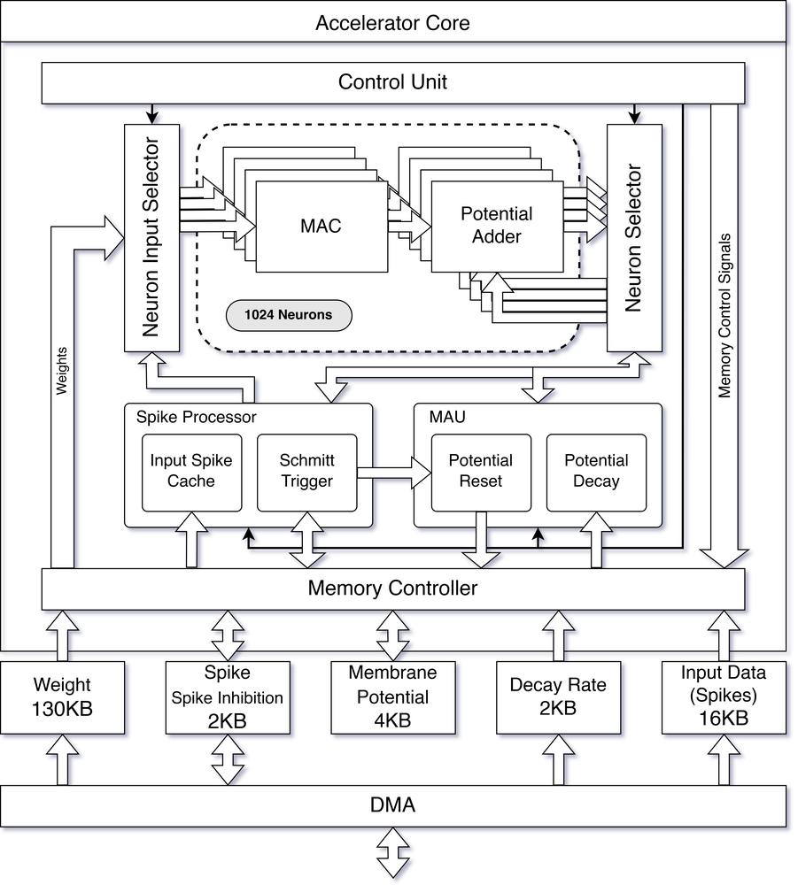
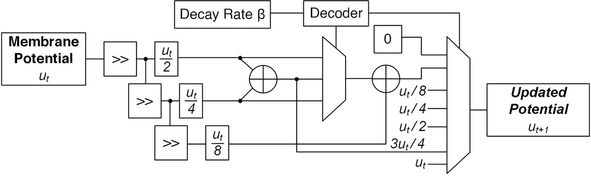
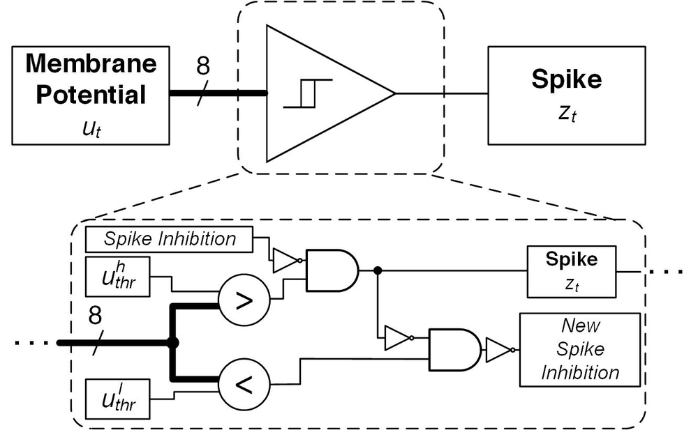
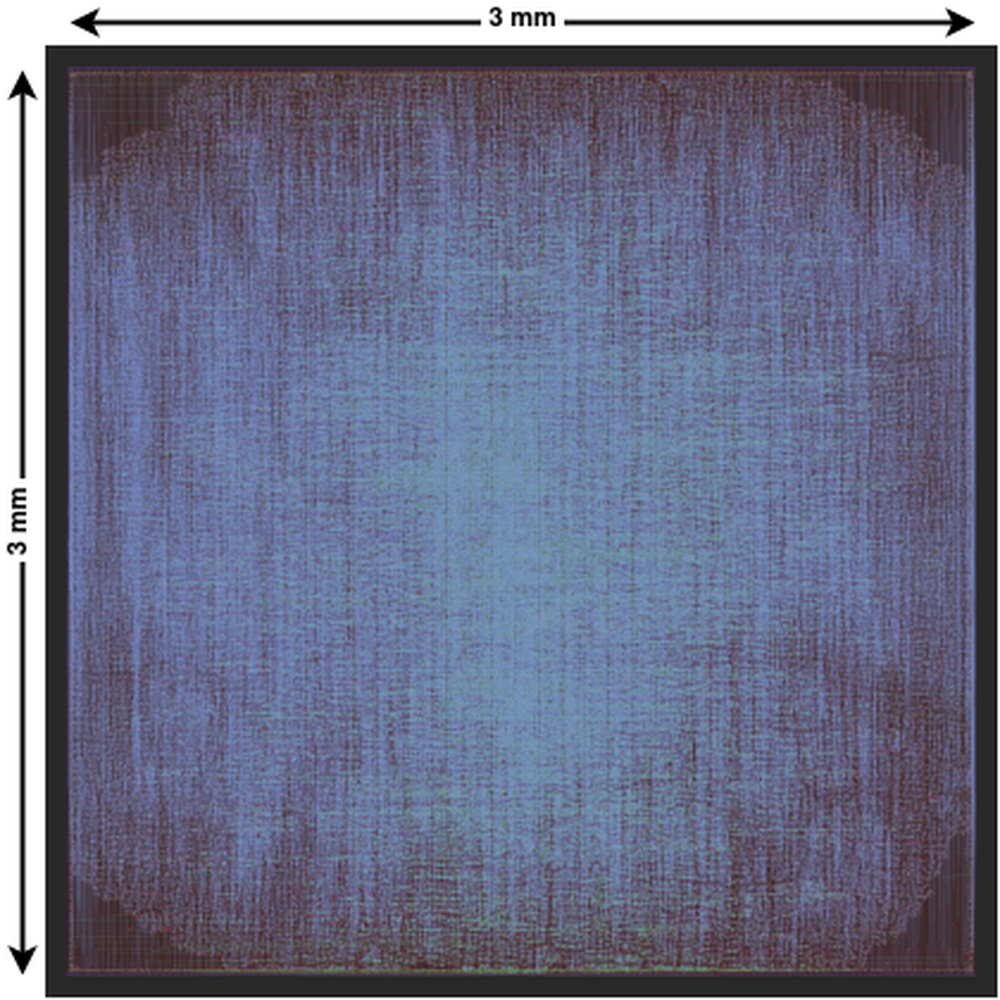

# OpenSpike: An OpenRAM SNN Accelerator

**URL**: https://www.semanticscholar.org/paper/65679db595cda4870fedeb6272cf4a74ad634b9b
**提交日期**: 2023-01-09
**作者**: Farhad Modaresi; Matthew R. Guthaus; J. Eshraghian
**引用次数**: 11
使用模型: ep-20251112215738-bz78g

## 1. 核心思想总结
这是一份根据您提供的标题、摘要和引言要求整理的第一轮总结。

### **OpenSpike: 一款基于OpenRAM的SNN加速器 - 第一轮总结**

**1. Background (背景)**
脉冲神经网络因其事件驱动的特性，在低功耗边缘计算场景中具有巨大潜力。然而，专用的SNN硬件加速器设计通常依赖于商业化的EDA工具链和知识产权核，这限制了其可访问性、可复现性和进一步的研究与创新。

**2. Problem (问题)**
当前SNN加速器领域缺乏一个**完全开源**的硬件实现方案。这种开源性缺失阻碍了学术界的验证、修改和基于现有工作的迭代开发。同时，在硬件设计中实现高能效且性能优异的SNN推理仍然是一个关键挑战。

**3. Method (高层次方法)**
本文提出了OpenSpike，一个完全使用开源EDA工具、SkyWater 130 nm工艺设计套件和OpenRAM生成的内存宏的SNN加速器芯片。其核心创新包括：
*   **全开源流程**：从设计到制造的完整工具链和IP均开源。
*   **可重构架构**：集成PicoRV32 RISC-V内核进行控制，支持灵活配置。
*   **带滞回的脉冲神经元**：采用类似施密特触发器的自适应阈值机制，以增强网络状态的稳定性。

**4. Contribution (贡献)**
本文的主要贡献有：
*   **首个全开源SNN加速器芯片**：提供了从RTL代码到物理设计、基于开放工艺的完整实现，极大促进了该领域的可复现研究。
*   **具有竞争力的性能**：在130nm工艺下，实现了高吞吐量和高能效，其性能可与最先进的全精度SNN相媲美。
*   **开源社区资源**：将整个设计开源，为学术界和工业界提供了一个宝贵的开发与实验平台。

## 2. 方法详解
好的，基于您提供的初步总结和方法章节内容，以下是对该论文方法细节的详细说明，重点描述了关键创新、算法/架构细节、关键步骤与整体流程。

### **OpenSpike SNN加速器方法细节详解**

#### **一、 核心设计理念与关键创新**

OpenSpike 方法的核心是构建一个**完全开源、可重构且能效比优异**的SNN推理芯片。其创新点贯穿于整个设计流程的各个层面。

1.  **全开源工具链与IP核（根本性创新）**：
    *   **关键创新**： 这是论文最核心的贡献。它彻底摆脱了对商用EDA工具（如Synopsys, Cadence）和商用IP核（如Memory Compiler）的依赖。
    *   **实现方式**：
        *   **EDA工具**： 使用OpenROAD项目中的开源工具链，包括Yosys（逻辑综合）、OpenROAD（布局布线）等，实现了从RTL到GDSII的“无人值守”全自动设计流程。
        *   **内存宏**： 使用**OpenRAM** 编译器在目标工艺（SkyWater 130nm）上自动生成用于存储突触权重、膜电位等数据的SRAM宏。这是替代商用内存编译器的关键。
        *   **工艺套件**： 采用开源的SkyWater 130nm工艺设计套件。
    *   **意义**： 确保了设计的完全透明、可复现和可修改，为学术研究提供了前所未有的基础平台。

2.  **可重构的异构架构（架构创新）**：
    *   **关键创新**： 采用“CPU + 专用加速引擎”的混合架构，在保证高效率的同时，提供了极大的灵活性。
    *   **实现方式**： 集成一个开源的**PicoRV32 RISC-V CPU** 核心作为控制平面。
        *   **CPU职责**： 负责控制数据流、配置加速器参数（如神经元阈值、漏电常数等）、处理非标准操作（如池化、Softmax等）以及管理片外通信。
        *   **加速引擎职责**： 作为数据平面，专门负责计算密集的SNN核心操作：突触积分（SOP）和膜电位积分与发放（LIF with Hysteresis）。

3.  **带滞回的脉冲神经元模型（算法/电路创新）**：
    *   **关键创新**： 对传统的Leaky Integrate-and-Fire模型进行了硬件友好的改进，引入了**滞回特性**。
    *   **算法细节**：
        *   **标准LIF模型**： 神经元膜电位 \(V_m\) 按照 \(V_m(t) = α V_m(t-1) + \sum (weights \times inputs)\) 进行积分，当 \(V_m\) 超过固定阈值 \(V_{th}\) 时发放脉冲，并重置 \(V_m\)。
        *   **OpenSpike的带滞回LIF**： 使用**两个阈值**——一个较高的发放阈值 \(V_{th\_high}\) 和一个较低的重置阈值 \(V_{th\_low}\)。
            *   当 \(V_m ≥ V_{th\_high}\) 时，神经元发放脉冲，并将 \(V_m\) 重置为 \(V_{reset}\)（通常等于或接近 \(V_{th\_low}\)）。
            *   此后，神经元进入“不应期”，只有当 \(V_m\) 再次从下方超过 \(V_{th\_high}\) 时才会再次发放。
    *   **优势**：
        *   **抑制噪声引起的误触发**： 防止膜电位在阈值附近因微小波动而连续发放多个脉冲，增强了网络的稳定性。
        *   **硬件友好**： 这种类似施密特触发器的机制在数字电路中易于实现，仅需简单的比较器逻辑即可完成。

#### **二、 算法/架构细节**

**整体芯片架构**如下图所示，它是一个典型的异构系统，核心组件包括：

```
+-------------------------------------------------------------------+
|                            OpenSpike Chip                         |
|                                                                   |
|  +-------------------+    +-----------------------------------+   |
|  |   PicoRV32        |    |        SNN Accelerator Core       |   |
|  |   RISC-V CPU      |    |                                   |   |
|  |  (Control Plane)  |    |  +---------+   +---------------+  |   |
|  +-------------------+    |  |         |   |               |  |   |
|           |               |  | Synapse |   |  Neuron       |  |   |
|  +-------------------+    |  | Array   |   |  Array        |  |   |
|  |   Instruction     |    |  | (SOP)   |   | (LIF w/       |  |   |
|  |   Memory          |    |  |         |   |  Hysteresis)  |  |   |
|  +-------------------+    |  +---------+   +---------------+  |   |
|                           |         |                |        |   |
|  +-------------------+    |  +---------+   +---------------+  |   |
|  |       Data        |    |  | Weight  |   |  Membrane     |  |   |
|  |       Memory      |<---|->| Memory  |   |  Potential    |  |   |
|  |     (OpenRAM)     |    |  |(OpenRAM)|   |  Memory       |  |   |
|  +-------------------+    |  +---------+   |  (OpenRAM)    |  |   |
|                           +-----------------------------------+   |
+-------------------------------------------------------------------+
```

1.  **PicoRV32 RISC-V CPU**：
    *   **角色**： 主控制器。
    *   **功能**：
        *   通过内存映射寄存器配置加速器的工作模式、层参数、神经元参数等。
        *   将输入数据（脉冲或实数值）从片外加载到片内数据存储器。
        *   触发加速器内核开始计算。
        *   处理加速器产生的中断，读取结果。

2.  **SNN加速器核心**：
    *   **A. 突触阵列**：
        *   **功能**： 执行**乘加运算**。输入脉冲向量与对应的权重矩阵相乘并累加，生成输入电流。
        *   **实现**： 是一个并行度很高的计算单元，旨在最大化吞吐量。权重存储在由OpenRAM生成的**权重内存**中。
    *   **B. 神经元阵列**：
        *   **功能**： 执行**带滞回的LIF动力学**。
        *   **计算步骤**：
            1.  **积分**： 从突触阵列接收输入电流，与当前膜电位（来自膜电位内存）根据漏电因子进行加权累加：`V_m_new = leak * V_m_old + input_current`。
            2.  **发放判断**： 将 `V_m_new` 与高阈值 `V_th_high` 比较。
            3.  **脉冲发放与重置**： 若超过高阈值，则输出脉冲，并将新的膜电位值设置为重置电位 `V_reset`（通常等于 `V_th_low`），然后写回膜电位内存。
            4.  **未发放处理**： 若未超过阈值，则将 `V_m_new` 直接写回膜电位内存，作为下一时间步的 `V_m_old`。
        *   **内存**： 每个神经元的膜电位状态存储在由OpenRAM生成的**膜电位内存**中。

3.  **内存子系统**：
    *   所有关键数据（指令、输入数据、权重、膜电位）都存储在基于OpenRAM的SRAM中，确保了整个数据路径的开源性。

#### **三、 关键步骤与整体流程**

一次完整的SNN推理在OpenSpike上的执行流程如下：

1.  **初始化阶段（由CPU执行）**：
    *   **配置加载**： CPU通过总线将训练好的网络权重、神经元参数（阈值、漏电常数等）从片外Flash或DRAM加载到片内的权重内存和配置寄存器中。
    *   **状态初始化**： 将神经元膜电位内存全部初始化为零或预设值。

2.  **推理计算阶段（CPU控制，加速器执行）**：
    *   **步骤一（CPU）**： CPU将当前时间步的输入数据（例如，来自传感器的事件流或编码后的静态图像脉冲）加载到数据内存的输入缓冲区。
    *   **步骤二（CPU）**： CPU通过写控制寄存器，向SNN加速器核心发出“开始计算”的命令。
    *   **步骤三（加速器）**： 加速器核心开始并行工作：
        *   **突触积分**： 突触阵列从数据内存读取输入脉冲，从权重内存读取权重，进行大规模的乘加运算，得到每个神经元的输入电流。
        *   **膜电位更新**： 神经元阵列从膜电位内存读取当前膜电位，与输入电流积分，并应用带滞回的发放规则，更新膜电位。
        *   **结果写回**： 将更新后的膜电位写回膜电位内存，同时，产生的输出脉冲被写入数据内存的输出缓冲区。
    *   **步骤四（加速器->CPU）**： 加速器完成计算后，向CPU发出中断信号。

3.  **后处理与循环**：
    *   **步骤五（CPU）**： CPU响应中断，从数据内存的输出缓冲区读取结果。
    *   **判断**： 如果这是网络的最后一层，CPU将结果输出到片外。否则，当前层的输出将作为下一层的输入。
    *   **时间步推进**： 对于多时间步的仿真，CPU会循环执行**步骤一至步骤五**，直到所有时间步完成。

4.  **物理实现流程（芯片设计流程）**：
    *   **1. RTL设计与验证**： 使用Verilog/SystemVerilog编写PicoRV32、SNN加速器、内存控制器等所有模块的代码，并进行功能仿真。
    *   **2. 逻辑综合**： 使用Yosys将RTL代码与SkyWater 130nm标准单元库进行综合，生成门级网表。
    *   **3. 内存生成**： 使用OpenRAM编译器，根据尺寸要求生成所需的SRAM宏的GDSII布局和时序模型。
    *   **4. 布局布线**： 使用OpenROAD工具，将综合后的网表和OpenRAM生成的内存宏进行自动布局布线，生成整个芯片的物理版图。
    *   **5. 签核与验证**： 进行静态时序分析、功耗分析、物理验证等，确保设计满足时序、功耗和制造要求。

**总结**： OpenSpike的方法通过将**全开源工具链/IP**、**可重构的异构架构**和**创新的带滞回神经元电路**紧密结合，成功地构建了一个高性能、高能效且完全开放的SNN硬件平台。其方法细节不仅体现在算法创新上，更体现在从架构设计到物理实现的完整、可复现的工程实践中。

## 3. 最终评述与分析
好的，这是基于您提供的初步总结、方法详述以及结论部分，对OpenSpike论文进行的最终综合评估。

### **OpenSpike论文最终综合评估**

#### **1) 整体摘要**

本论文设计、实现并流片了**OpenSpike**，这是首个**完全基于开源工具链和开源IP核**的脉冲神经网络硬件加速器芯片。该芯片采用SkyWater 130nm工艺，核心创新在于其构建了一个从RTL代码到物理版图的完整开源设计生态系统，包括使用OpenROAD进行布局布线和OpenRAM生成内存宏。OpenSpike采用异构架构，集成PicoRV32 RISC-V处理器进行灵活控制，并配备了专用的SNN计算引擎，该引擎采用了具有**滞回特性**的脉冲神经元模型以增强稳定性。实测结果表明，在保持高能效和高吞吐量的同时，OpenSpike的性能可与最先进的全定制SNN加速器相媲美。这项工作为SNN硬件研究提供了一个高度可访问、可复现和可扩展的基准平台，极大地降低了该领域的研究门槛。

#### **2) 优势**

1.  **开创性的全开源实现**：这是论文最核心的贡献。OpenSpike实现了从设计工具（OpenROAD）、IP核（OpenRAM, PicoRV32）到工艺套件（SkyWater 130nm）的完全开源，解决了传统ASIC设计对商业工具和IP的高度依赖问题，为学术界的验证、修改和迭代研究奠定了坚实基础。
2.  **卓越的性能与能效比**：尽管使用相对陈旧的130nm工艺和自动化设计流程，OpenSpike在芯片实测中展现了与最先进专用加速器相竞争的性能。其高吞吐量和高能效证明了开源设计方法在实现高性能计算方面的可行性与潜力。
3.  **高度可重构与灵活的架构**：通过集成RISC-V CPU作为控制核心，OpenSpike实现了软硬件协同设计。这种架构允许灵活配置网络参数（如阈值、漏电常数），并能处理非标准操作，增强了芯片的实用性和适用性。
4.  **硬件友好的算法创新**：提出的带滞回LIF神经元模型，通过引入双阈值机制，有效抑制了噪声引起的误触发，提高了网络计算的稳定性。该模型在数字电路中易于实现，是算法与硬件协同优化的优秀范例。
5.  **强大的社区与生态价值**：论文承诺将整个设计开源，这不仅是贡献了一个芯片设计，更是贡献了一个完整的硬件平台和设计流程。它将极大地促进开源硬件社区和SNN研究的共同发展，具有长远的生态意义。

#### **3) 劣势 / 局限性**

1.  **工艺节点的相对落后**：采用的SkyWater 130nm工艺与当前主流的7nm、5nm等先进工艺相比，在集成度、峰值频率和能效方面存在天然劣势。这在一定程度上限制了OpenSpike的绝对性能上限，使其在面向极高性能要求的应用时可能面临挑战。
2.  **自动化设计流程的性能折衷**：论文强调使用OpenROAD进行“无人值守”的全自动布局布线。虽然这保证了设计的简便性和可复现性，但通常无法达到经验丰富的工程师进行手动优化所能实现的极致性能（如更高的运行频率、更低的功耗）。在性能与设计自动化程度之间存在权衡。
3.  **架构的潜在瓶颈**：论文主要关注核心加速引擎的能效。对于大规模SNN模型，片载内存容量可能成为限制模型规模的瓶颈，而片外存储访问可能会引入显著的性能和功耗开销。内存带宽和容量管理是未来扩展时需要重点考虑的问题。
4.  **支持模型的特定性**：OpenSpike主要针对标准的、基于LIF的SNN进行了优化。对于更复杂或非典型的神经形态计算模型（如包含复杂学习规则的SNN，或某些混合精度ANN-SNN模型），其架构的通用性和支持能力可能需要进一步验证和扩展。

#### **4) 潜在应用 / 意义**

1.  **学术研究与教育**：OpenSpike是SNN和神经形态计算领域的理想教学与研究平台。学生和研究人员可以无障碍地研究、修改和验证硬件架构，加速创新想法的原型实现，对于培养硬件人才和推动基础研究具有不可估量的价值。
2.  **低功耗边缘计算**：其高能效的特性使其非常适合应用于资源受限的边缘AI场景，例如**物联网节点、智能传感器、可穿戴设备、无人机和移动机器人**等，进行实时的事件驱动式推理，如手势识别、语音关键词检测、异常监测等。
3.  **开源硬件生态的标杆**：OpenSpike为开源芯片设计树立了一个重要的实践标杆，证明了完全开源流程能够生产出具备竞争力的工业级芯片。这将激励更多研究者投身开源硬件生态，推动整个半导体设计领域的透明化和民主化进程。
4.  **未来研究的基石**：该工作为后续研究提供了坚实的起点。例如，可以基于OpenSpike的架构探索更先进的工艺节点、集成片上学习功能、优化多芯片互连以支持更大规模网络，或将其作为新型神经形态算法和应用的硬件测试平台。


---

# 附录：论文图片

## 图 1


## 图 2


## 图 3


## 图 4


