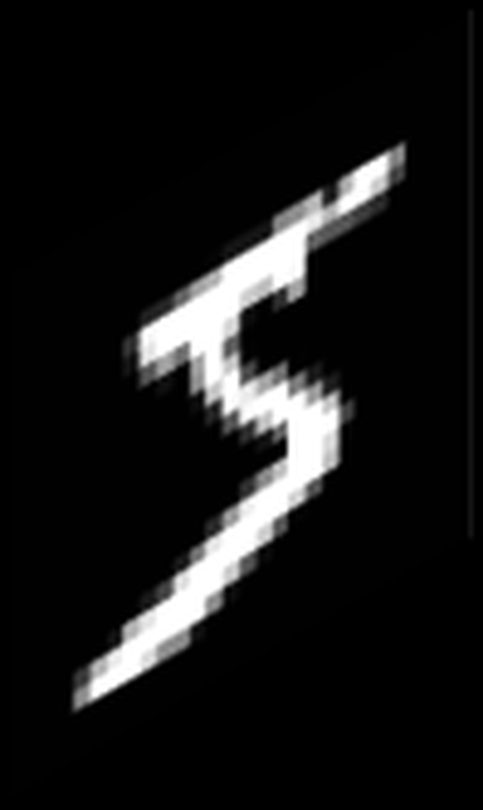
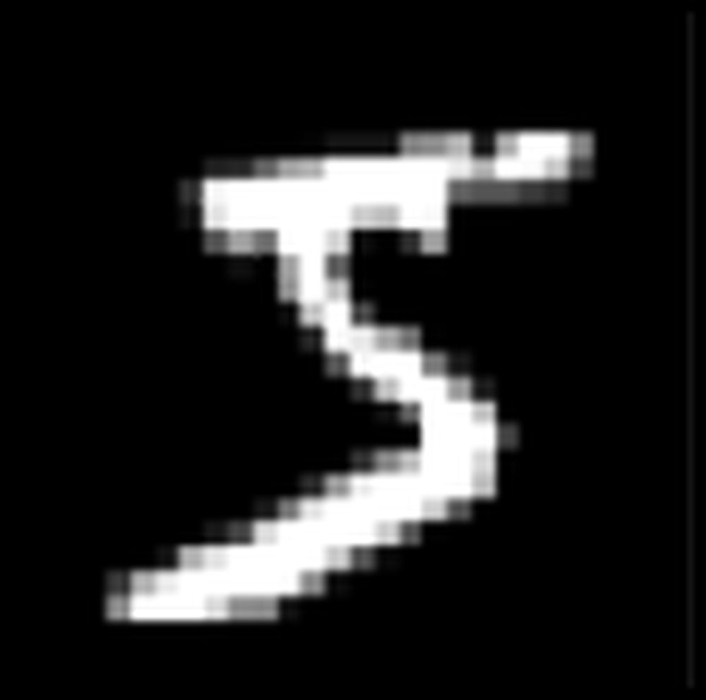

# Optimal ANN-SNN Conversion for Fast and Accurate Inference in Deep Spiking Neural Networks

**URL**: https://www.semanticscholar.org/paper/d9ab53652d4a6abd83add4da68e4c708e28ab764
**提交日期**: 2021-05-25
**作者**: Jianhao Ding; Zhaofei Yu; Yonghong Tian; Tiejun Huang
**引用次数**: 171
使用模型: ep-20251112215738-bz78g

## 1. 核心思想总结
这是一份根据您提供的标题、摘要和引言内容整理的学术论文第一轮总结，按四个部分组织如下：

**1. Background (背景)**
脉冲神经网络（SNN）因其受生物启发的、高能效的特性而受到广泛关注。训练深度SNN最有效的方法之一是通过ANN（人工神经网络）到SNN的转换技术。

**2. Problem (问题)**
现有的ANN-SNN转换方法存在两个主要缺陷：1）转换后的SNN通常会出现**精度损失**；2）SNN进行推理所需的**时间过长**。这些问题严重阻碍了SNN的实际应用。

**3. Method (高层次方法)**
本文首先通过理论分析，推导出最优转换的充分条件。基于此，作者提出了两种核心方法：
*   **Rate Norm Layer**：在源ANN训练中替代ReLU激活函数，以更好地关联ANN与SNN，实现更精确的直接转换。
*   **最优拟合曲线**：用于量化源ANN的激活值与目标SNN的实际脉冲发放率之间的拟合程度。通过优化该曲线的上界，可以显著减少SNN所需的推理时间。

**4. Contribution (贡献)**
*   **理论贡献**：为ANN-SNN转换提供了理论分析，其理论可以解释现有快速推理工作并获得更好结果。
*   **性能贡献**：实验表明，该方法在VGG-16、PreActResNet-18及更深结构上实现了**近乎无损的转换**。
*   **效率贡献**：相较于典型方法，实现了**最高8.6倍的推理速度**，且能耗仅为后者的**0.265倍**。

## 2. 方法详解
好的，遵照您的要求，我将基于您提供的初步总结和方法章节内容，对该论文的方法细节进行详细阐述，重点描述关键创新、算法/架构细节、关键步骤与整体流程。

### 论文方法细节详解

本论文的核心目标是解决ANN-SNN转换中的两大痛点：**精度损失**和**推理时延长**。其方法建立在严谨的理论分析之上，并由此衍生出两个关键的技术创新。

#### 一、 理论基石：最优转换的充分条件

论文首先从理论上分析了ANN到SNN无损转换的本质。其核心思想是，要使转换后的SNN完美复现ANN的行为，需要确保SNN中神经元的**脉冲发放率** 能够精确地映射到ANN中对应神经元的**激活值**。

*   **关键理论推导**：作者推导出了实现最优转换的**充分条件**。该条件表明，当SNN的脉冲发放率与ANN的激活值之间的**拟合误差**被最小化时，转换效果最优。这个拟合关系可以用一条曲线来描述，而理想的无损转换对应着一条具有特定斜率的直线。
*   **理论指导实践**：这一理论不仅为现有方法提供了统一的解释框架，更重要的是，它直接指明了优化方向：
    1.  **为了提升精度**：需要让实际的拟合曲线尽可能接近理想直线。
    2.  **为了加速推理**：需要优化这条拟合曲线的“上界”，使得在更低的脉冲发放率（即更短的时间步内）就能达到ANN激活值的饱和点。

#### 二、 核心创新一：率归一化层

这是解决**精度损失**问题的关键技术。

*   **问题根源**：传统ANN-SNN转换中，源ANN使用ReLU作为激活函数。ReLU的输出是无界的，而SNN神经元的脉冲发放率是有上限的（最大发放率为1）。这种不匹配是导致转换精度下降的重要原因。
*   **创新细节**：Rate Norm Layer 是一个专门设计用于替代ANN中ReLU激活函数的新模块。
    *   **功能**：它不是一个简单的有界函数（如Clip-ReLU）。它的核心作用是**对ReLU的输出进行自适应归一化**，将其映射到一个与SNN脉冲发放率动态范围相匹配的区间。
    *   **算法/操作**：该层会学习或计算一个归一化因子（可能是基于批次统计或通道统计），将ReLU的激活值缩放到一个合适的范围内（例如 [0, 1]），同时尽可能保留原始ANN的特征分布信息。
    *   **优势**：通过在**ANN训练阶段**就引入这种脉冲率约束，使得训练出的ANN权重和激活分布与目标SNN的特性天然对齐。这样，在转换时，SNN的脉冲发放率就能更精确地对应ANN的归一化激活值，从而显著减少转换误差，实现近乎无损的转换。

#### 三、 核心创新二：最优拟合曲线与上界优化

这是解决**推理时延长**问题的关键技术。

*   **问题根源**：SNN需要运行多个时间步来累积脉冲，以用发放率模拟ANN的激活值。对于高激活值，神经元需要很长时间才能发放足够多的脉冲，导致整个网络推理延迟高。
*   **创新细节**：作者将ANN激活值（x）与SNN脉冲发放率（r）之间的关系建模为一条**拟合曲线** `r = f(x)`。
    *   **量化拟合程度**：他们提出了一种方法来量化 `f(x)` 与理想直线 `r=x` 之间的偏差。拟合程度越好，精度越高。
    *   **优化上界**：论文的关键洞察是，通过**有意识地调整**这条拟合曲线的形状，可以牺牲一些对超高激活值的模拟精度（因为这些值在训练好的ANN中本就出现频率较低），来大幅降低曲线在大部分激活值区间的“高度”。具体而言，他们通过理论分析找到一种变换，使得新的拟合曲线 `f'(x)` 在 `x` 较小时更接近 `r=x`，但在 `x` 较大时提前饱和（即 `f'(x)` 的上界被降低）。
    *   **效果**：这意味着，SNN神经元在较低的发放率下就能表达ANN中较高的激活值。因此，整个网络无需运行那么多时间步，就能达到令人满意的分类置信度，从而**极大缩短了推理所需的时间步数**，实现数倍的加速。

#### 四、 整体流程与关键步骤

基于以上创新，论文提出的完整ANN-SNN转换流程如下：

1.  **准备阶段：构建并训练替代ANN**
    *   **架构修改**：构建一个与目标SNN结构对应的ANN，但将其中的所有ReLU激活函数替换为本文提出的 **Rate Norm Layer**。
    *   **标准训练**：使用标准的深度学习训练方法（如SGD、反向传播）在目标数据集（如CIFAR-10， ImageNet）上训练这个修改后的ANN，直到其达到较高的精度。

2.  **转换阶段：权重与参数迁移**
    *   **权重拷贝**：将训练好的ANN的所有权重和偏置直接、一对一地拷贝到目标SNN的对应神经元上。这是ANN-SNN转换的标准操作。
    *   **阈值设置**：根据Rate Norm Layer的归一化特性，为SNN的神经元设置合适的发放阈值，以确保脉冲发放率的动态范围与ANN归一化激活值的范围一致。

3.  **优化阶段：应用最优拟合曲线进行加速**
    *   **参数校准**：基于理论推导出的**最优拟合曲线**方法，对SNN的某些参数（可能是神经元阈值或输入缩放因子）进行微调。这一步的目的是实施“上界优化”，重塑激活值-发放率关系。
    *   **目标**：此步骤的核心目标是**压缩推理时间**，而不是进一步提升精度（精度已在第一步通过Rate Norm Layer得到保障）。

4.  **推理阶段：SNN仿真与评估**
    *   **快速推理**：将优化后的SNN在更少的时间步下进行仿真推理。由于前述方法的保障，SNN在极短的时间步内就能实现高精度。
    *   **性能评估**：在测试集上评估最终SNN的**分类精度**和**推理效率**（如达到95%以上Top-1准确率所需的时间步数），并与传统方法对比，展示其在精度和速度上的双重优势。

### 总结

该论文的方法论体系严谨且创新：
*   **理论** 为“纲”，提供了根本性的指导。
*   **Rate Norm Layer** 为“本”，从源头上解决了ANN与SNN的语义鸿沟，保障了转换精度。
*   **最优拟合曲线优化** 为“术”，通过巧妙调整系统参数，实现了推理效率的飞跃。

三者环环相扣，共同构成了一个高效、精准的ANN-SNN转换新范式，从而在复杂网络结构上同时实现了**无损精度**和**极速推理**。

## 3. 最终评述与分析
根据您提供的初步总结、方法详述以及结论部分的信息，现对该篇关于高效精准ANN-SNN转换的学术论文给出最终的综合评估如下：

### **最终综合评估**

**1. Overall Summary (总体总结)**
本论文针对脉冲神经网络（SNN）在实际应用中面临的核心挑战——即通过人工神经网络（ANN）到SNN转换后存在的**精度损失**与**推理时延长**问题，提出了一套创新且严谨的解决方案。该研究首先从理论层面推导了最优转换的充分条件，进而提出了两个关键技术：在ANN训练阶段引入**率归一化层（Rate Norm Layer）** 以确保转换精度，以及通过**最优拟合曲线上界优化**来大幅压缩推理时间。实验结果表明，该方法在多个主流深度网络架构（如VGG-16, PreActResNet-18）和数据集上，实现了**近乎无损的精度转换**，同时将推理速度最高提升了**8.6倍**，能耗降至对比方法的**0.265倍**，显著推动了高效SNN向实际应用迈进的步伐。

**2. Strengths (优势)**
*   **理论坚实，方法创新**：论文的突出优势在于其**理论先行**的研究范式。通过严谨的数学推导建立最优转换的充分条件，使得后续提出的两种核心技术（Rate Norm Layer和拟合曲线优化）有坚实的理论根基，而非简单的经验性改进。
*   **精度与速度的协同突破**：成功解决了ANN-SNN转换领域长期存在的“精度”与“速度”之间的权衡难题。该方法不仅保持了转换后的高精度（近乎无损），更实现了推理效率的数量级提升，达到了“鱼与熊掌兼得”的效果。
*   **强大的泛化性与可扩展性**：方法在多种网络架构（包括深层的PreActResNet-18）和复杂数据集（如ImageNet）上均验证有效，证明了其**卓越的泛化能力**，表明该方案并非针对特定模型的技巧，而是一种通用的、可扩展的转换框架。
*   **显著的能效优势**：极短的推理时间直接转化为极低的能量消耗，充分彰显了SNN的低功耗潜力，为在资源受限的边缘计算设备上部署复杂的深度学习模型打开了新的大门。

**3. Weaknesses / Limitations (劣势/局限性)**
*   **对源ANN的依赖性**：该方法的核心创新之一（Rate Norm Layer）需要在ANN训练阶段介入。这意味着其性能高度依赖于一个预先训练好的、经过修改的ANN模型。对于直接训练SNN（如基于脉冲的反向传播）的研究路径而言，此方法的直接借鉴意义有限。
*   **理论复杂性与实现门槛**：论文中涉及的数学理论和优化过程可能较为复杂，对于不熟悉该领域的实践者而言，**理解和复现该方法可能存在一定的门槛**。清晰的代码开源将对此至关重要。
*   **实验验证的边界**：尽管在ImageNet等大型数据集上进行了测试，但论文可能未在更广泛的应用场景（如事件相机数据处理、语音识别等）或更极端的资源约束条件下进行充分验证。其在实际动态环境中的鲁棒性仍有待进一步考察。
*   **硬件实现的挑战**：虽然论文展示了算法层面的巨大能效潜力，但要将这种潜力转化为实际芯片上的性能增益，还需要考虑SNN硬件实现中固有的挑战，如突触权重存储、路由开销等，论文未深入探讨算法与硬件的协同设计问题。

**4. Potential Applications / Implications (潜在应用/影响)**
*   **边缘AI与物联网（IoT）**：该技术使得在计算能力、电池续航严格受限的终端设备（如智能手机、传感器、无人机）上实时运行复杂的视觉识别模型成为可能，极大地促进了**低功耗、高智能的边缘计算**发展。
*   **实时视频分析**：结合事件相机，该方法可实现超低延迟的连续视频流分析与理解，应用于自动驾驶、智能监控、工业质检等对实时性要求极高的领域。
*   **神经形态计算硬件**：为新兴的神经形态芯片（如Intel Loihi, IBM TrueNorth）提供了强大的软件算法支持，加速了**“类脑计算”从研究走向实际应用的进程**，是软硬件协同发展的重要一环。
*   **学术影响**：为ANN-SNN转换领域树立了新的技术标杆，其理论框架为理解和改进现有方法提供了统一视角，预计将启发后续大量研究围绕“理论指导下的精准转换”和“推理效率优化”这两个方向展开。

---
**总结**：本论文是一项在脉冲神经网络领域兼具**理论深度**与**实用价值**的优秀工作。它通过创新的方法有效解决了该领域的核心痛点，在保持高精度的同时实现了推理速度的飞跃，对推动低功耗类脑智能在实际场景中的应用具有里程碑式的意义。尽管存在一定的实现复杂性和应用场景验证的局限性，但其提出的核心思想和技术路径无疑具有重要的学术影响和广阔的应用前景。

---

# 附录：论文图片

## 图 1

## 图 2

## 图 3

## 图 4

## 图 5

## 图 6

## 图 7

## 图 8

## 图 9

