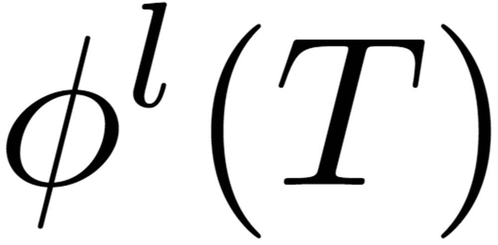
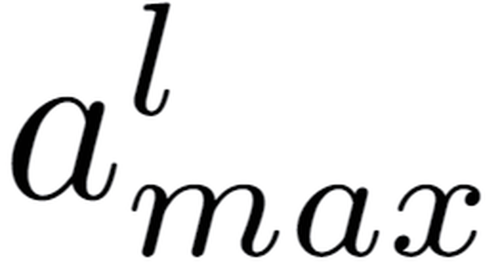
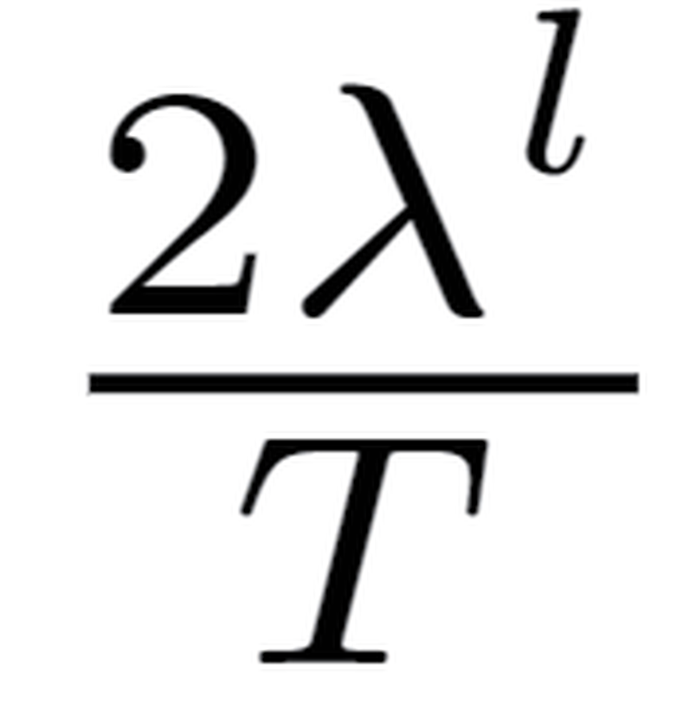
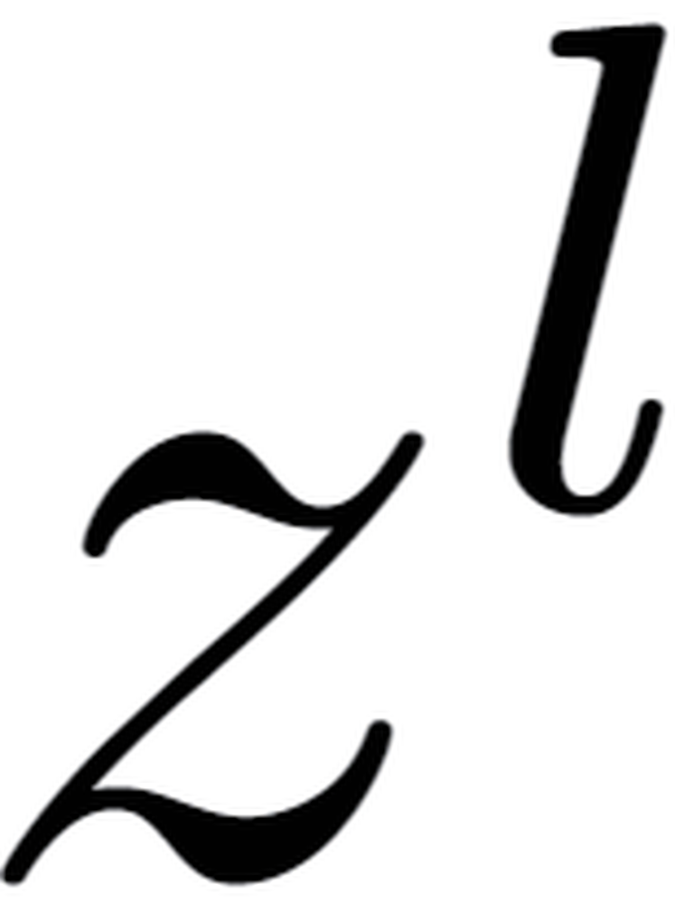
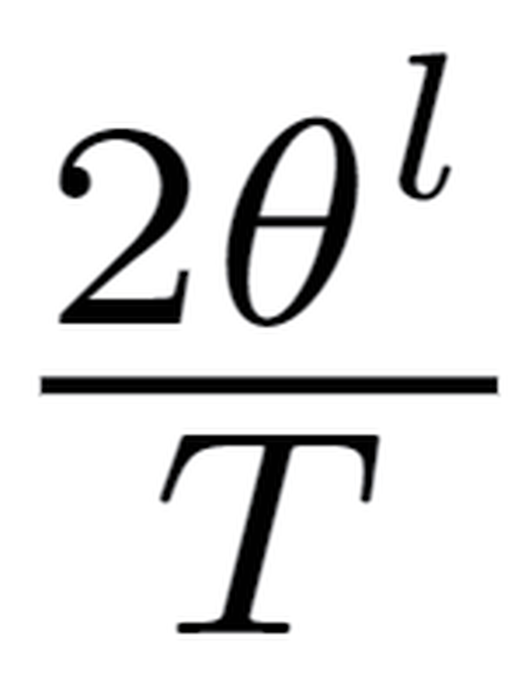
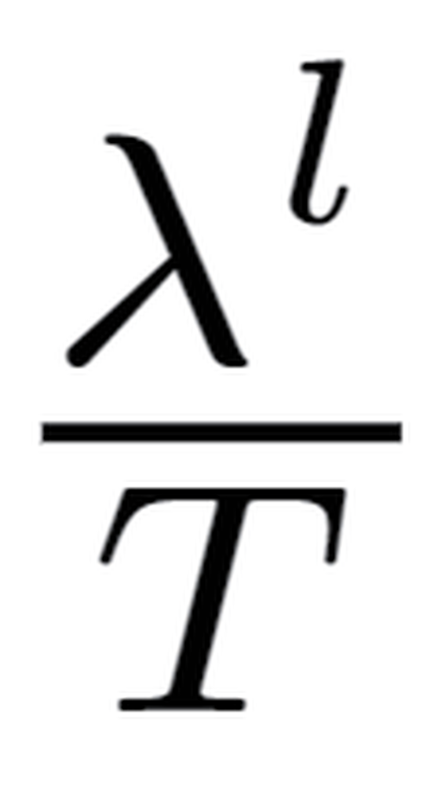
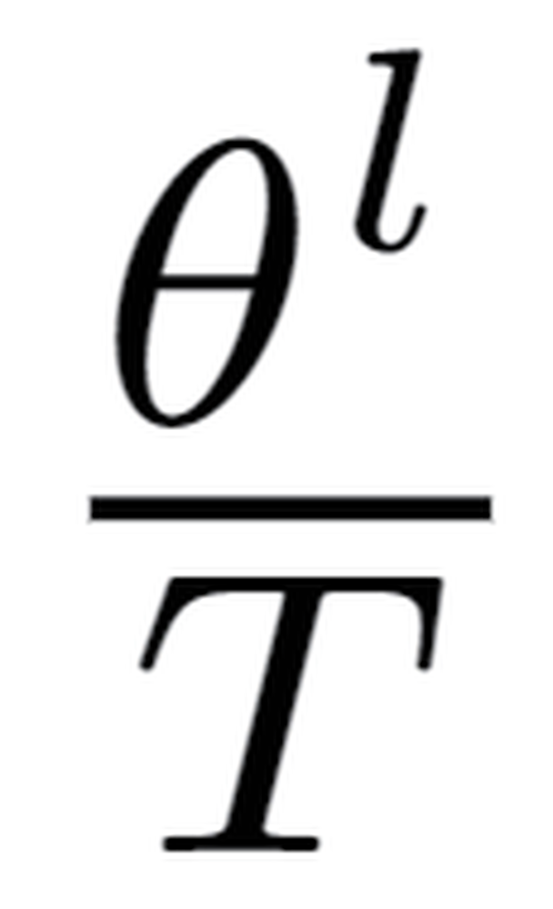
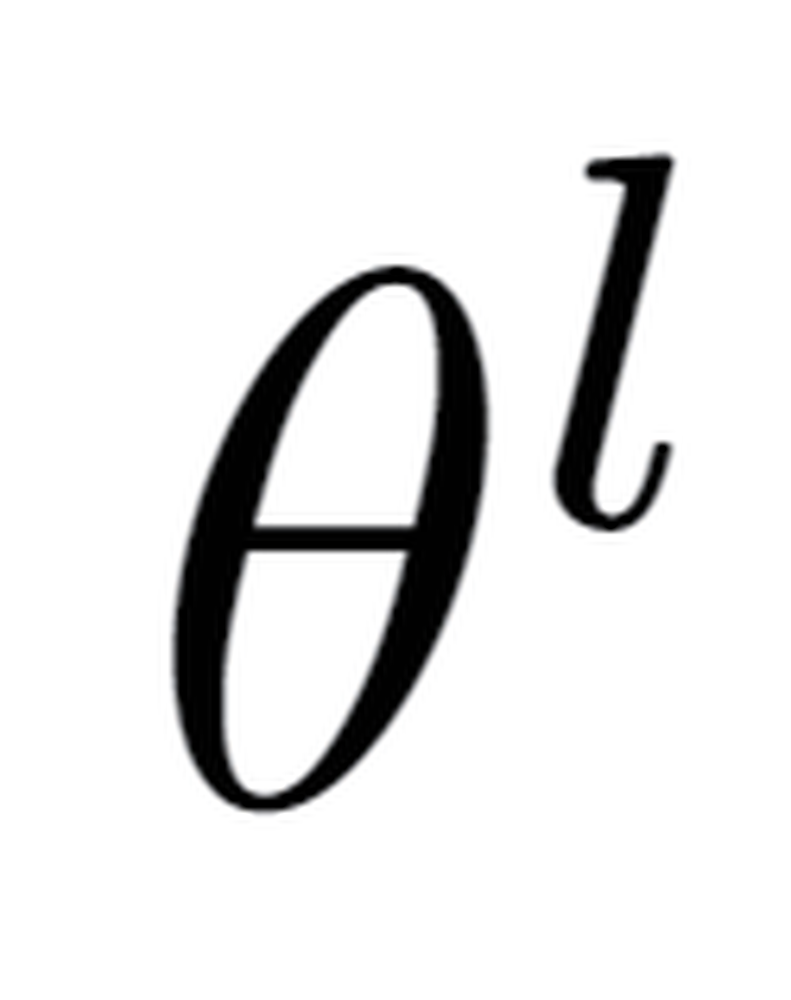
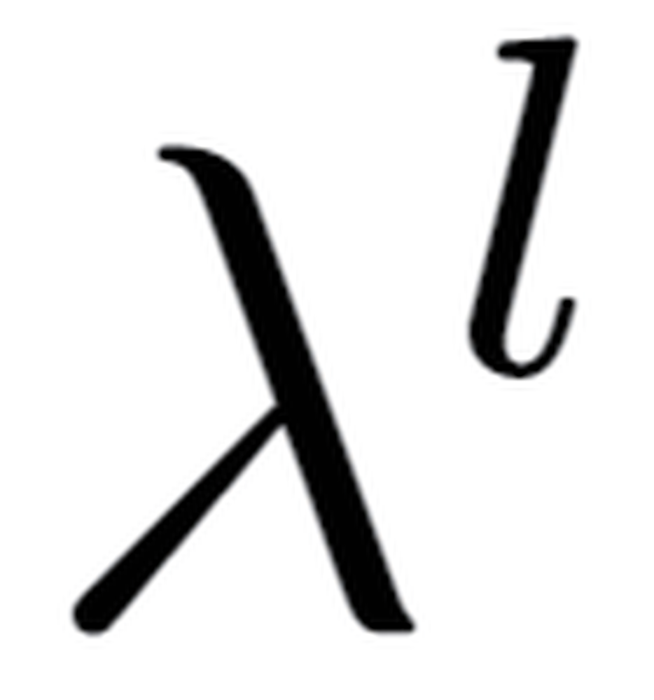

# Optimal ANN-SNN Conversion for High-accuracy and Ultra-low-latency Spiking Neural Networks

**URL**: https://www.semanticscholar.org/paper/5682daa63e1ffa2153384ba40a4a204b2bdc5446
**提交日期**: 2023-03-08
**作者**: Tong Bu; Wei Fang; Jianhao Ding; Penglin Dai; Zhaofei Yu; Tiejun Huang
**引用次数**: 234
使用模型: ep-20251112215738-bz78g

## 1. 核心思想总结
根据您提供的标题、摘要和引言内容，以下是该学术论文的第一轮总结，按四个部分组织：

**1. 背景**
尖峰神经网络（SNN）因其在神经形态硬件上具有低功耗和快速推理的独特优势而受到广泛关注。ANN-SNN转换作为获取深度SNN最有效的方法，已能在大型数据集上实现与人工神经网络（ANN）相媲美的性能。

**2. 问题**
尽管ANN-SNN转换取得了成功，但其存在一个关键瓶颈：为了匹配SNN的发放率与ANN的激活值，通常需要很长的时间步长。这导致转换后的SNN在短时间步长下会出现严重的性能下降问题，从而阻碍了SNN的实际应用。

**3. 方法（高层概览）**
本文首先从理论上分析了ANN-SNN的转换误差，并推导出SNN的估计激活函数。基于此，作者提出了一种新的**量化-截断-移位（Quantization Clip-Floor-Shift, QCFS）激活函数**，用以替代源ANN中常用的ReLU激活函数。该方法能更好地逼近SNN的激活函数，从而在理论上实现SNN与ANN之间期望转换误差为零。

**4. 贡献**
本研究的核心贡献在于提出了一种最优的ANN-SNN转换方法，首次实现了**高性能（高精度）与超低延迟（仅需4个时间步长）** 的SNN。实验在CIFAR-10/100和ImageNet数据集上验证了该方法的有效性，其在准确率和时间步长方面均优于最先进的ANN-SNN转换方法和直接训练的SNN。

## 2. 方法详解
好的，遵照您的要求，我将基于您提供的初步总结和论文方法章节内容，详细阐述该论文的方法细节。

### 论文方法详细说明

本文的核心目标是解决ANN-SNN转换中因**时间步长过短导致性能严重下降**的瓶颈问题。其方法并非直接改进SNN的仿真过程，而是通过**优化源ANN的构建方式**，从根源上减小转换误差。整个方法的逻辑链条清晰，可分为理论分析、关键创新、实现步骤三个层面。

---

#### 一、 理论分析：转换误差的根源

方法的起点是对传统ANN-SNN转换误差的深入理论分析。这是整个工作的基石。

1.  **传统转换原理回顾**： 标准的ANN-SNN转换基于一个核心等价性：在足够长的时间步长（T）下，SNN中神经元的**发放率（firing rate）** 可以无限逼近源ANN中对应神经元的**归一化激活值（activation value）**。这通常通过将ANN的激活值归一化到[0,1]区间（对应SNN的最大发放率1），并设置SNN神经元的阈值与之匹配来实现。
2.  **关键问题识别**： 论文指出，当时间步长T很短时，SNN神经元的**状态（膜电位）** 离散化程度变高，其可能的发放模式非常有限（例如，T=4时，一个神经元最多只能发放0,1,2,3,4次）。这导致SNN的实际激活函数（即输入-发放率关系）与源ANN中使用的连续激活函数（如ReLU）存在显著差异。
3.  **推导SNN的估计激活函数**： 作者通过理论建模，推导出在有限时间步长T下，SNN所对应的等效激活函数。这个函数不再是平滑的ReLU，而是一个**带有量化效应的、非连续的阶梯状函数**。正是这种**函数形式的不匹配**，导致了短时间步长下的巨大转换误差。

#### 二、 关键创新：QCFS激活函数

基于上述分析，论文的核心创新点不是去修改SNN，而是设计一种新的ANN激活函数，使其在形态上**预先匹配**短时步SNN的量化激活函数。这就是**量化-截断-移位激活函数**。

1.  **设计目标**：
    *   **逼近SNN行为**： 新激活函数的形态必须与推导出的SNN估计激活函数高度相似。
    *   **保持ANN可训练性**： 该函数必须能够替代ReLU，在ANN的训练过程中能够进行有效的反向传播。
    *   **实现零误差转换**： 在理想条件下，使用此函数训练的ANN转换到SNN时，理论转换误差应为零。

2.  **QCFS函数形式**：
    QCFS函数对输入 \( x \) 的操作可以清晰地分解为三个步骤，其数学表达式和图形如下图所示（请想象一个阶梯状的、向右平移了0.5个单位的截断ReLU）：

    *   **（Q）uantization 量化**： 首先，对连续的输入进行量化。具体而言，将输入 \( x \) 乘以时间步长 \( T \)，然后向下取整，再除以 \( T \)。这一步将连续的输入映射到离散的集合 {0, 1/T, 2/T, ..., 1}。这模拟了SNN在T个时间步内最多只能发放T次脉冲的量化特性。
        `x_quantized = floor(x * T) / T`

    *   **（C）lip-Floor 截断-下取整**： 接着，对量化后的值进行截断。由于SNN的发放率不能超过1（100%），因此需要将值限制在[0,1]区间。这通常通过一个`clip`函数实现：`clip(x, 0, 1)`。但“Clip-Floor”这个名称更强调了其与量化（取整）步骤的紧密结合，共同构成一个**均匀量化器**。

    *   **（S）hift 移位**： 这是最精妙且关键的一步。为了完美匹配SNN的发放阈值行为，作者将整个激活函数向右平移了 \( 0.5 / T \)（即半个量化步长）。这意味着，SNN神经元在膜电位达到半个阈值时就开始有发放概率，而不是从阈值开始。这个微小的移位极大地改善了在极低时间步长（如T=2,4）下的性能。
        `QCFS(x) = clip(floor((x + 0.5/T) * T) / T, 0, 1)`

    **综合效果**： QCFS函数是一个**阶梯状、有界、右移**的激活函数。它的输出本身就是离散化的，直接对应了SNN在T个时间步长下所有可能的发放率。

#### 三、 整体流程与关键步骤

基于QCFS激活函数，论文提出的最优ANN-SNN转换流程如下：

1.  **步骤一：训练QCFS-ANN**
    *   **确定目标时间步长（T）**： 在训练源ANN之前，首先确定目标SNN需要运行的**目标时间步长（T）**，例如T=4。这个T将作为QCFS激活函数的一个**超参数**。
    *   **构建ANN架构**： 选择一个标准的网络架构（如VGG、ResNet），但将其中的所有ReLU（或其他）激活函数替换为**QCFS激活函数**。
    *   **训练ANN**： 使用常规的深度学习方法和数据集（如CIFAR-10， ImageNet）训练这个特殊的ANN。由于QCFS函数在零点不可导，在反向传播时，作者使用了其直通估计器（Straight-Through Estimator, STE），即近似认为其导数为1，这在量化网络训练中是常见且有效的做法。

2.  **步骤二：无损转换到SNN**
    *   **权重与阈值迁移**： 训练完成后，将QCFS-ANN的权重和批归一化（BatchNorm）层参数直接迁移到SNN架构中。
    *   **设置SNN参数**：
        *   神经元阈值 \( V_{th} \) 设置为1。
        *   根据QCFS函数的移位特性，SNN神经元的**初始膜电位**被设置为 \( 0.5 / T \)（即半个量化步长），而不是通常的0。这是实现超低延迟的另一个关键细节，它确保了神经元在第一个时间步就有机会发放脉冲。
    *   **仿真SNN**： 使用基于积放（Integrate-and-Fire）模型的SNN仿真器，在指定的短时间步长（T）下运行网络进行推理。

### 总结

该论文方法的精髓在于 **“治未病”** 的思路：

*   **关键创新**： 提出了**QCFS激活函数**，其创新性体现在**量化、截断、移位**三位一体的设计，首次从函数形态上精确匹配了短时步SNN的行为。
*   **算法细节**： QCFS函数将目标时间步长T作为先验知识嵌入到ANN的训练中，通过 `floor` 操作实现量化，通过 `clip` 实现截断，通过 `+0.5/T` 的移位来校正发放阈值，并使用STE进行梯度反向传播。
*   **整体流程**： 先训练一个“SNN化”的ANN（QCFS-ANN），然后进行几乎无损的模型转换。该方法流程简单，与现有的ANN-SNN转换框架兼容性好，但通过源头的精巧设计，彻底解决了短时步的性能瓶颈，最终实现了**在极低延迟（如4时间步）下达到与ANN相媲美的高精度**这一突破性成果。

## 3. 最终评述与分析
根据您提供的论文标题、摘要、引言、方法详述以及结论部分，现给出该论文的最终综合评估如下：

### 最终综合评估

**1. 总体摘要 (Overall Summary)**
本论文针对ANN转SNN方法中存在的关键瓶颈——**长延迟（时间步长）问题**，提出了一种创新的解决方案。论文首先从理论层面深入分析了短时间步长下转换误差的根源，指出其本质是SNN的离散量化激活函数与ANN的连续激活函数（如ReLU）之间的不匹配。基于此分析，作者创造性地提出了一种名为**量化-截断-移位（QCFS）** 的新型激活函数，用于替代源ANN训练中的传统激活函数。该方法的核心思想是“治未病”，即通过预先训练一个其激活行为与目标SNN高度匹配的ANN，从而在转换时实现理论上的零误差。实验结果表明，该方法在CIFAR-10、CIFAR-100和ImageNet等大型数据集上，仅需**极少的4个时间步长**，即可实现与人工神经网络相媲美的高精度，显著超越了现有的ANN-SNN转换方法和直接训练的SNN，在**高性能与超低延迟的统一**上取得了突破性进展。

**2. 优势 (Strengths)**
*   **理论扎实，创新性强**：工作并非简单的工程调优，而是建立在严谨的理论分析之上。通过推导SNN的估计激活函数并据此设计QCFS函数，方法具有坚实的理论基础，创新点明确且深刻。
*   **性能卓越，效果显著**：该方法成功解决了ANN-SNN转换领域的核心挑战——短时步下的性能退化问题。其宣称的“4时间步长达到高精度”是迄今为止该领域报道的最佳性能之一，具有里程碑意义。
*   **通用性强，兼容性好**：所提出的QCFS方法是一种普适性的框架，可以无缝集成到各种主流的网络架构（如VGG, ResNet）中，与现有的ANN训练和SNN转换流程高度兼容，易于被后续研究和应用采用。
*   **实用价值高**：极低的延迟使得转换后的SNN在真实的神经形态硬件上部署的可行性和效率大大提升，极大地推动了SNN从理论研究走向实际应用。

**3. 局限性与未来方向 (Weaknesses / Limitations)**
*   **对目标时间步长的依赖**：QCFS激活函数需要一个预设的目标时间步长（T）作为超参数。这意味着为特定T值训练的ANN模型可能无法直接灵活地适配其他T值的SNN部署场景，灵活性受到一定限制。
*   **激活函数本身的局限性**：QCFS函数在零点不可微，训练时需依赖直通估计器（STE）进行近似梯度回传。虽然这是一种常见做法，但理论上并非最优，可能会对训练稳定性和最终性能带来细微影响。
*   **实验验证范围的潜在局限**：尽管在主流图像分类数据集上取得了成功，但该方法的有效性在更复杂的任务（如目标检测、语义分割）或更具动态性的数据集（如事件相机数据）上仍有待进一步验证。结论中提到的未来工作（如探索更复杂的连接模式和处理静态数据转换动态任务的挑战）也间接承认了当前方法的某些局限。
*   **与直接训练SNN的对比**：虽然论文声称优于直接训练的SNN，但直接训练SNN的技术也在快速发展。该方法在低延迟下的优势是否需要与最新一代的直接训练方法进行更全面的对比，是一个值得持续关注的点。

**4. 潜在应用与启示 (Potential Applications / Implications)**
*   **推动边缘计算与嵌入式AI**：该研究使超低功耗、超低延迟的SNN在资源受限的边缘设备（如智能手机、无人机、物联网传感器）上进行实时视觉推理成为可能，对促进边缘智能的发展具有重要意义。
*   **加速神经形态计算落地**：为Intel Loihi、IBM TrueNorth等神经形态芯片提供了性能强大的算法模型，扫清了高精度SNN模型必须依赖长仿真时间才能工作的障碍，极大地增强了神经形态硬件的实用吸引力。
*   **为SNN研究开辟新范式**：该方法展示了通过“设计匹配的ANN”来优化SNN性能这一路径的巨大潜力，为后续研究提供了新思路，例如可以探索针对其他SNN神经元模型或复杂任务的专用激活函数。
*   **启发更广泛的模型压缩与量化研究**：QCFS方法本质上也是一种极致的模型量化技术，其思想对于其他需要实现超低比特量化（如二值、三值网络）的人工神经网络研究也具有重要的借鉴意义。

---

# 附录：论文图片

## 图 1

## 图 2

## 图 3

## 图 4

## 图 5

## 图 6

## 图 7

## 图 8

## 图 9

