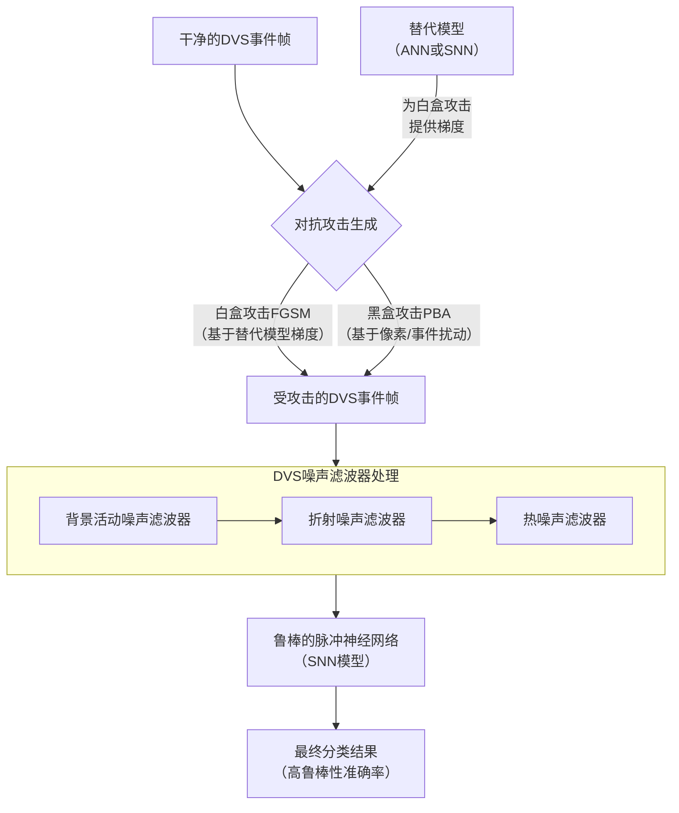
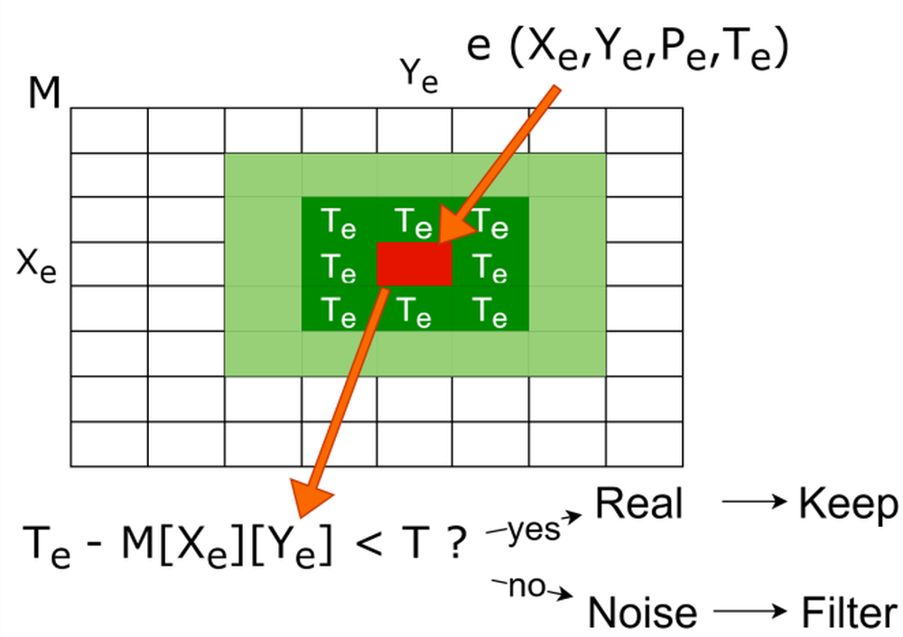
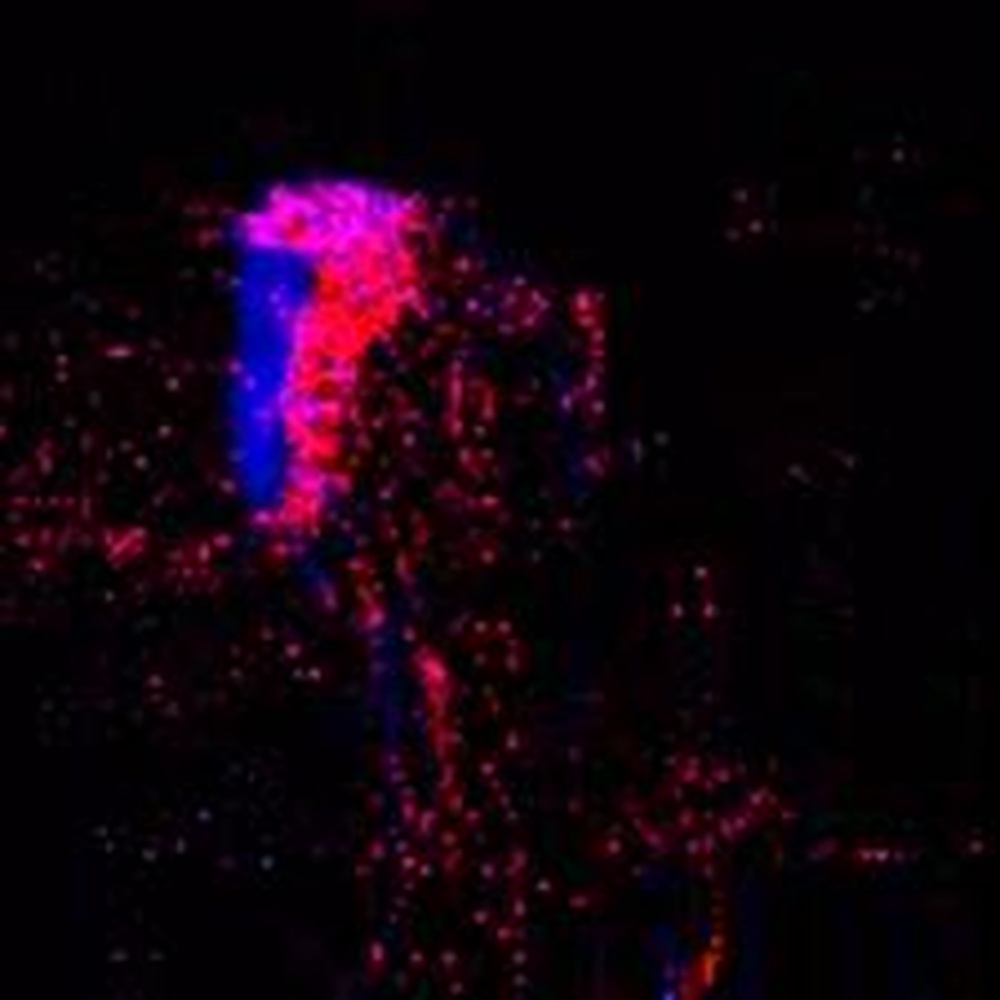
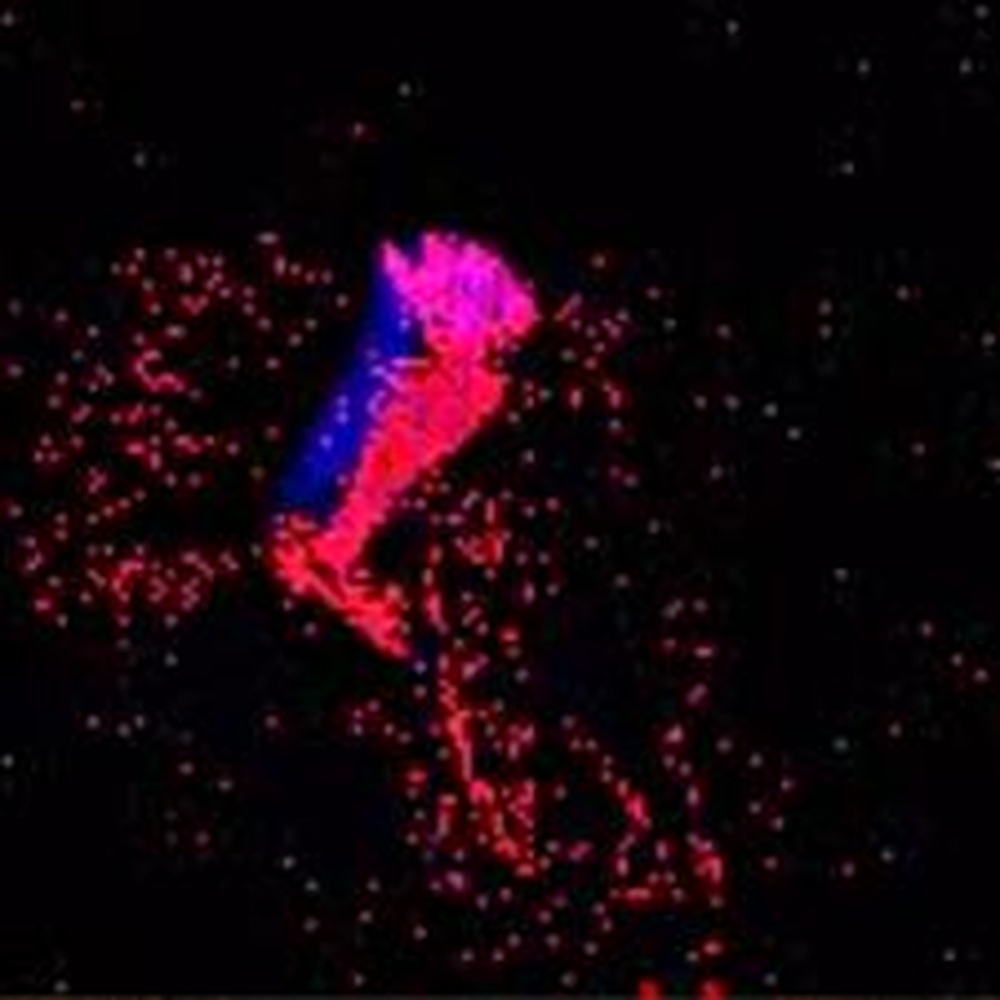
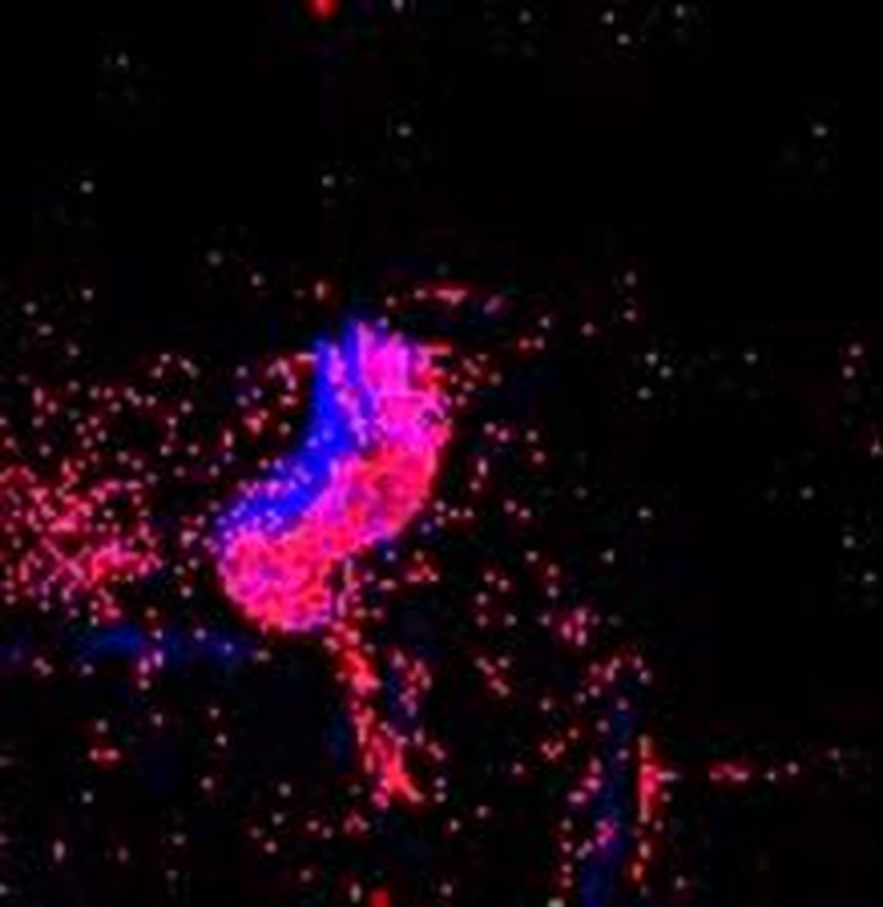
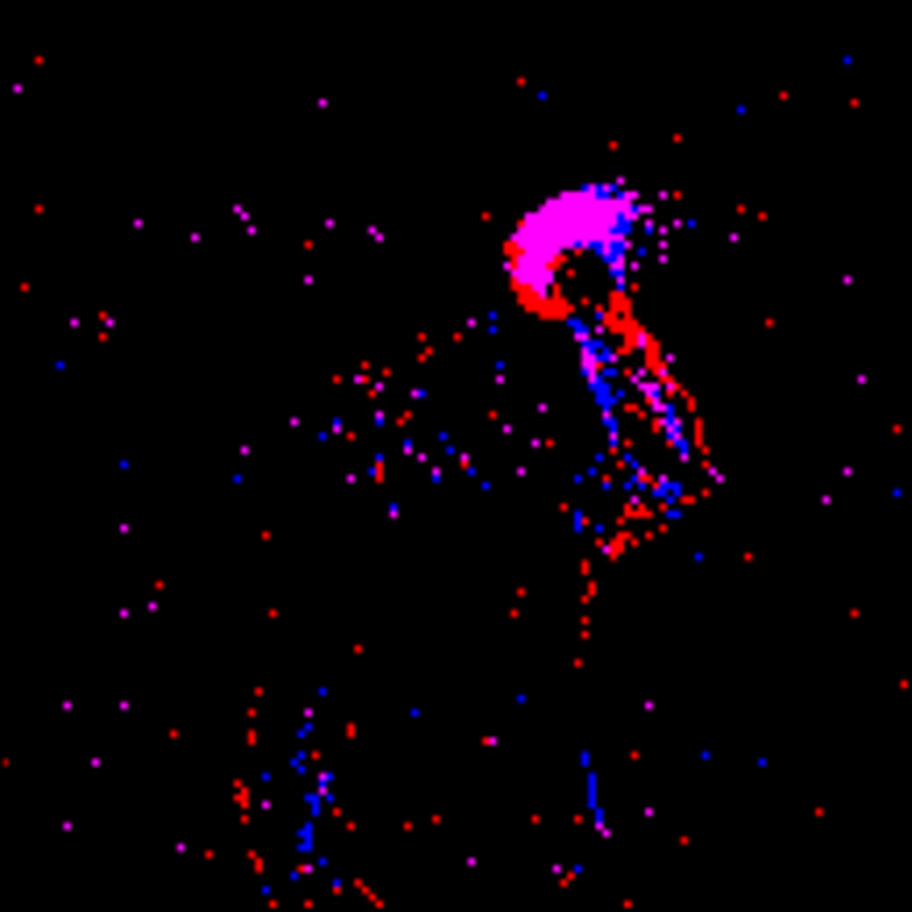
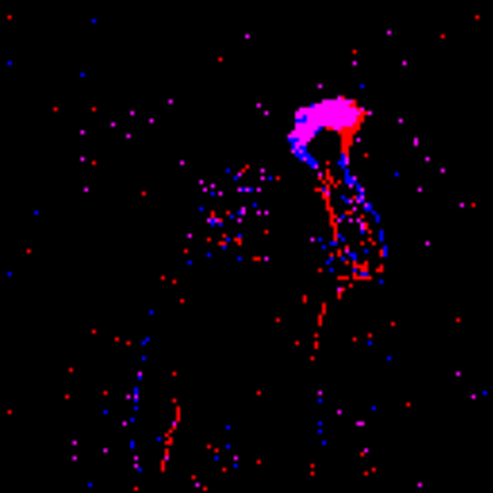
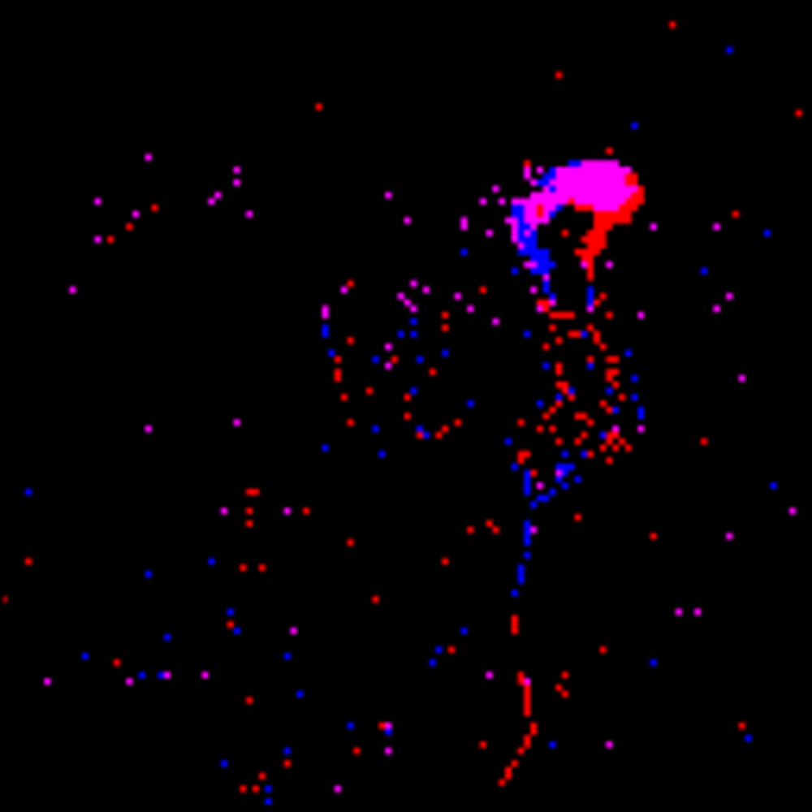
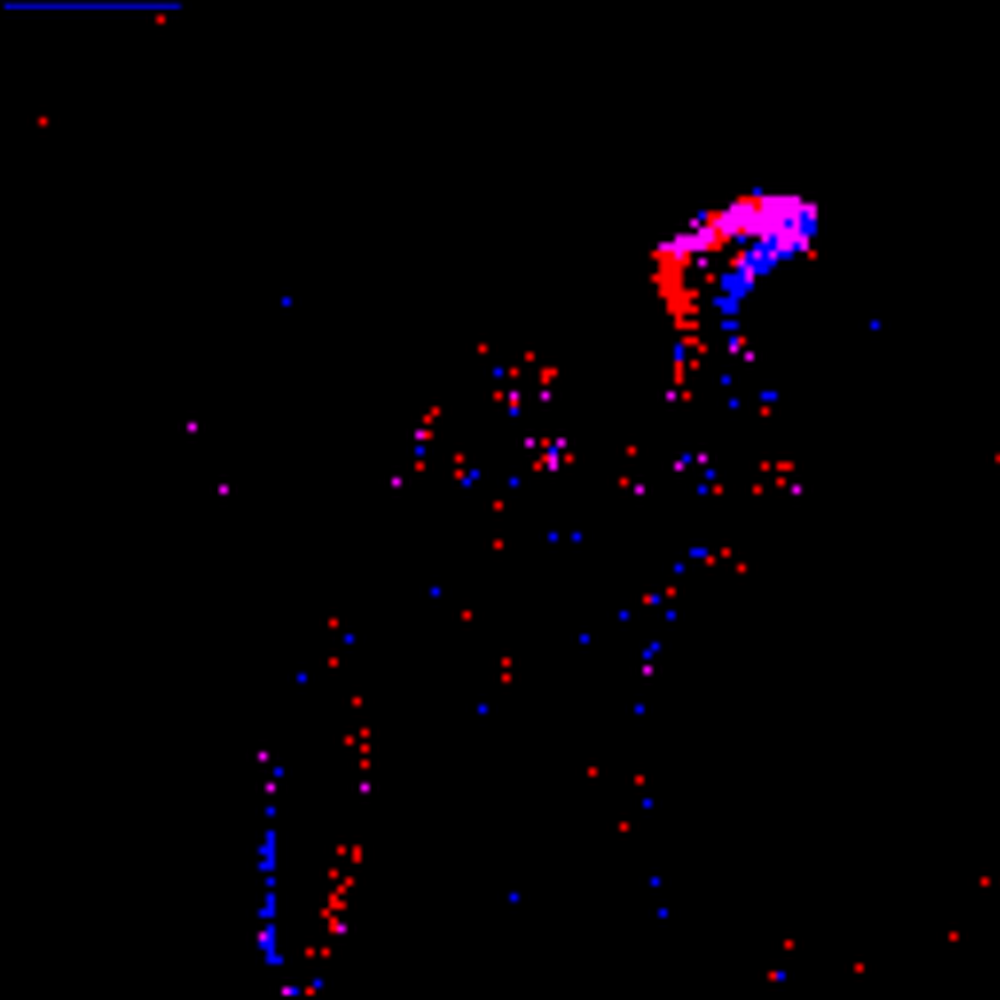
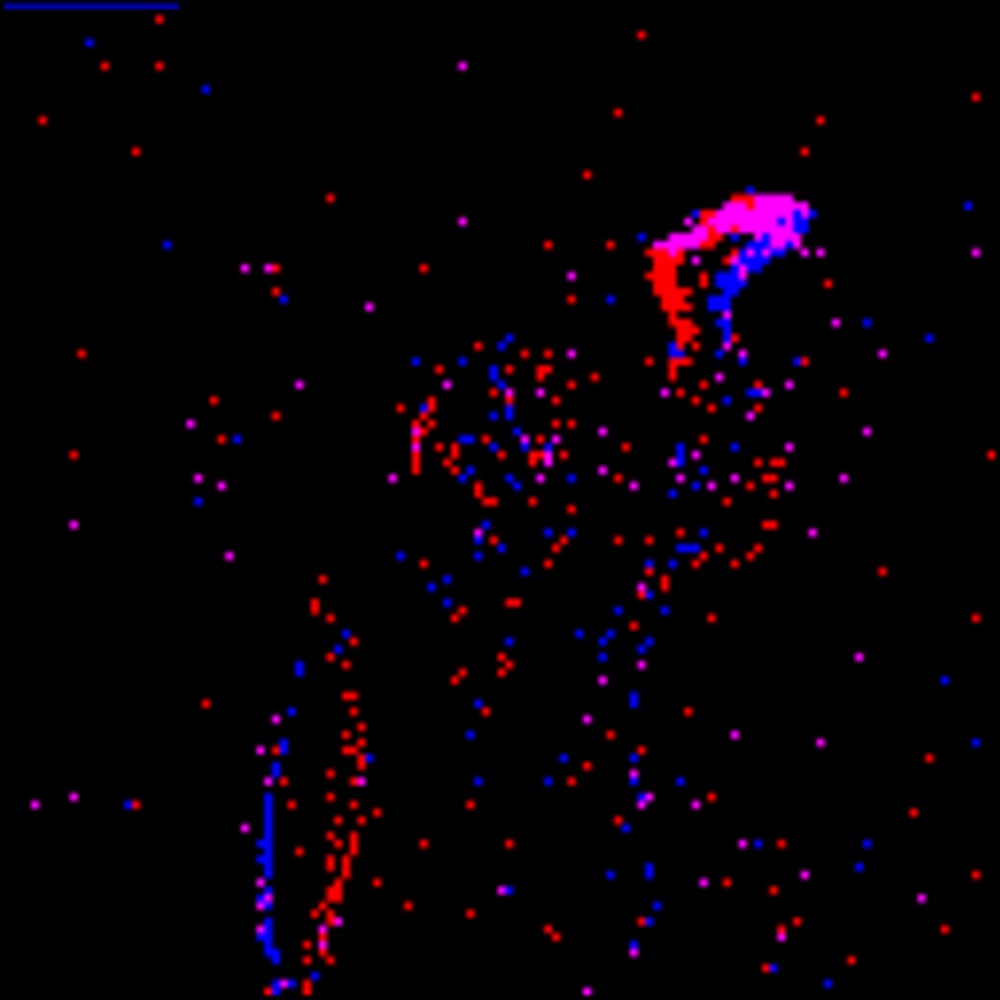

# R-SNN: An Analysis and Design Methodology for Robustifying Spiking Neural Networks against Adversarial Attacks through Noise Filters for Dynamic Vision Sensors

**URL**: https://www.semanticscholar.org/paper/92b5ce455f980ced303c24ccc4d356515c223782
**提交日期**: 2021-09-01
**作者**: Alberto Marchisio; Giacomo Pira; M. Martina; G. Masera; Muhammad Shafique
**引用次数**: 13
使用模型: ep-20251112215738-bz78g

## 1. 核心思想总结
好的，这是一份根据您提供的标题、摘要和引言内容整理的学术论文第一轮总结。

---

### **论文第一轮总结**

**标题：** R-SNN：一种通过动态视觉传感器噪声滤波器增强脉冲神经网络对抗对抗攻击鲁棒性的分析与设计方法

**1. Background (背景)**
脉冲神经网络（SNNs）在基于事件的动态视觉传感器（DVS）和神经形态芯片上运行时，具有高能效的优势，是边缘计算和低功耗场景的理想选择。

**2. Problem (问题)**
尽管SNNs具有优势，但其在基于DVS的系统中的安全性，特别是抵御精心设计的对抗性攻击的鲁棒性，是一个尚未被充分探索的关键问题。当DVS信号（时空域的事件帧）遭到对抗性扰动时，SNNs的性能可能会显著下降。

**3. Method (high-level) (高层次方法)**
本文提出了R-SNN，一种新颖的分析与设计方法。其核心思想是**利用高效的DVS噪声滤波器来增强SNNs的鲁棒性**。该方法开创性地将DVS传感器固有的噪声过滤机制应用于防御对抗攻击。

**4. Contribution (贡献)**
*   **开创性研究：** 据我们所知，这是首项在DVS信号（时空事件帧）上生成对抗攻击，并系统性地应用DVS噪声滤波器进行防御的研究。
*   **有效性验证：** 实验结果表明，所提出的噪声滤波器能有效防止SNNs被欺骗。在DVS-Gesture和NMNIST数据集上，该方法能使SNNs在不同对抗威胁模型下保持超过90%的准确率。
*   **实用方法论：** 提供了一套完整的分析与设计方法论（R-SNN），为构建鲁棒的神经形态视觉系统提供了实践指导。

---

## 2. 方法详解
好的，基于您提供的初步总结和论文方法章节的内容，以下是对该论文方法细节的详细说明。

### **论文方法细节详述**

本论文《R-SNN：一种通过动态视觉传感器噪声滤波器增强脉冲神经网络对抗对抗攻击鲁棒性的分析与设计方法》的核心方法论是 **R-SNN框架**。该框架系统地整合了对抗攻击生成、DVS噪声过滤和SNN评估三个关键环节，其整体流程与创新点如下图所示。

#### **一、 关键创新与核心思想**

该方法最大的关键创新在于**视角的转变**：

*   **传统思路：** 增强模型鲁棒性通常集中在修改和强化模型本身，例如对抗训练、修改模型架构等。
*   **R-SNN创新思路：** 本文独辟蹊径，**不直接修改SNN模型**，而是将防御重心前置于**数据预处理阶段**。它利用DVS传感器本身为处理固有物理噪声（如背景活动、热噪声）而设计的滤波器，来滤除对抗攻击引入的“恶意噪声”。

其核心思想是：**对抗性扰动在时空特性上与DVS的固有物理噪声具有相似性**（例如，都是稀疏、离散的伪事件）。因此，那些被设计用来有效过滤物理噪声的滤波器，同样有潜力识别并移除对抗扰动。

#### **二、 整体流程与关键步骤**

**步骤一：针对DVS事件的对抗攻击生成**
这是评估鲁棒性的前提。论文在时空事件帧上生成了两种威胁模型下的攻击：

1.  **白盒攻击（基于快速梯度符号法FGSM）：**
    *   **关键细节：** 由于SNN的不可微性，直接计算其梯度困难。因此，作者训练了一个**替代模型**（一个可微的ANN，或者一个使用BPTT算法训练的SNN），使其行为与目标SNN相似。
    *   **攻击流程：** 计算替代模型相对于输入事件帧的梯度，然后使用FGSM算法根据梯度方向添加扰动：`x_adv = x + ε * sign(∇_x J(θ, x, y_true))`，其中 `x` 是事件帧（如事件计数或时间表面），`ε` 是扰动强度。

2.  **黑盒攻击（基于像素/事件的扰动攻击PBA）：**
    *   **关键细节：** 该方法不需要模型内部信息，更符合实际场景。它随机选择事件帧中的一定比例的像素点（或事件），并对其值进行随机翻转（例如，在某个时间点有事件变为无事件，或无事件变为有事件）。
    *   **攻击流程：** 这种攻击模拟了对抗噪声的随机性和稀疏性，用于测试滤波器对未知攻击模式的泛化防御能力。

**步骤二：应用DVS噪声滤波器（核心防御机制）**
这是R-SNN方法的精髓。论文系统性地应用了三种经典的DVS噪声滤波器处理被攻击的事件流：

1.  **背景活动噪声滤波器：**
    *   **算法原理：** 该滤波器基于“真实物体运动产生的事件在时空上是连续的，而噪声是孤立的”这一假设。它使用一个**时空邻域** 进行判断。
    *   **关键参数与操作：**
        *   对于一个事件 `e(p, t)`（发生在像素点 `p` 和时间 `t`），检查其在 `Δt` 时间窗口内，在像素 `p` 的 `n x n` 空间邻域内是否有其他事件发生。
        *   如果在该时空邻域内没有其他事件，则判定事件 `e` 为孤立噪声，将其滤除。
        *   **阈值设置：** 时间窗口 `Δt` 和空间邻域大小 `n` 是关键参数，需要根据数据集的事件密度进行调整。

2.  **折射噪声滤波器：**
    *   **算法原理：** 模仿生物神经系统的“不应期”机制。当一个像素点触发了一个事件后，它在接下来的一小段时间内无法再次触发事件。
    *   **关键参数与操作：**
        *   为每个像素点 `p` 维护一个“最后触发时间” `t_last[p]`。
        *   当一个新事件 `e(p, t)` 到来时，如果 `t - t_last[p] < t_refractory`（折射周期），则该事件被视为噪声并被滤除。
        *   否则，事件被保留，并更新 `t_last[p] = t`。
        *   **阈值设置：** `t_refractory` 是关键参数，设置过大会滤除真实事件，过小则滤波效果不佳。

3.  **热噪声滤波器：**
    *   **算法原理：** 也称为“频率驱动滤波器”或“坐标噪声滤波器”。它假设每个像素点在一个时间段内产生事件的频率是有限的，超过该频率的事件很可能是热噪声。
    *   **关键参数与操作：**
        *   统计每个像素点 `p` 在时间窗口 `T` 内产生的事件数量 `count[p]`。
        *   如果 `count[p]` 超过一个预设的阈值 `N_threshold`，则判定该像素点处于过热状态，在此时间窗口内该像素点产生的后续事件将被滤除。
        *   **阈值设置：** `N_threshold` 和窗口 `T` 是关键参数。

**步骤三：SNN模型处理与分类**
*   **SNN架构：** 论文中使用的SNN通常是一个简单的全连接或卷积结构，神经元模型多采用泄漏积分-发放模型。
    *   **输入表示：** 将过滤后的事件流转换为SNN可处理的格式，例如**事件计数帧**（统计每个像素在时间区间内的事件总数）或**时间表面**。
    *   **信息编码：** 采用直接编码方式，将像素的事件计数或时间表面强度转换为输入神经元的注入电流强度或初始膜电压。
    *   **训练与学习：** SNN可以使用无监督的STDP规则进行训练，也可以使用基于反向传播的BPTT算法进行监督训练。论文中为了获得较高基准准确率，很可能采用了BPTT。
*   **输出：** 读取输出层神经元在模拟时间内的脉冲发放次数，发放次数最多的神经元对应的类别即为预测结果。

#### **三、 总结**

R-SNN方法的核心细节在于其**防御机制的间接性和物理启发性**。通过将对抗防御问题转化为一个信号处理问题，它巧妙地利用了DVS领域的先验知识（噪声滤波器），为SNN的鲁棒性研究提供了一个新颖、高效且易于实现的解决方案。整个流程清晰地从攻击生成到滤波防御，再到最终评估，形成了一套完整、系统化的分析与设计方法论。

## 3. 最终评述与分析
好的，这是基于您提供的初步总结、方法详述以及结论部分，对论文《R-SNN：一种通过动态视觉传感器噪声滤波器增强脉冲神经网络对抗对抗攻击鲁棒性的分析与设计方法》的最终综合评估。

### **最终综合评估**

#### **1. Overall Summary (整体总结)**

本论文系统地研究并提出了一种增强脉冲神经网络在动态视觉传感器应用中对对抗攻击鲁棒性的创新方法——R-SNN。该方法的核心理念是进行**防御视角的转移**：不同于主流研究中通过修改模型本身（如对抗训练）来提升鲁棒性，R-SNN**另辟蹊径，将防御重心前置到数据预处理层面**。它创造性地利用DVS传感器为处理固有物理噪声（如背景活动、热噪声）而设计的滤波器，来滤除对抗攻击在时空事件流中引入的恶意扰动。论文通过在白盒和黑盒等多种威胁模型下进行实验，在DVS-Gesture和NMNIST等标准数据集上验证了该方法的有效性，表明其能帮助SNN在遭受攻击时保持极高的分类准确率，为构建安全、可靠的神经形态视觉系统提供了一套完整且实用的分析与设计框架。

#### **2. Strengths (优势)**

*   **创新性强：** 论文的核心贡献在于其独特的思路。将对抗防御问题转化为经典的信号去噪问题，视角新颖，为SNN安全领域开辟了一条不同于传统对抗训练的低成本、高效率的技术路径。
*   **实用价值高：** 所提出的方法不依赖于修改复杂的SNN模型或耗时的对抗训练过程，仅需在传感器数据流后端添加成熟的噪声滤波器模块，**易于实现和部署**，特别适合资源受限的边缘计算和神经形态硬件平台。
*   **系统性强：** 研究框架完整，涵盖了从对抗攻击生成（包括白盒和黑盒模型）、防御机制设计（多种滤波器分析与应用）到全面实验评估的整个流程，论证严谨。
*   **效果显著：** 实验结果表明，该方法防御效果出色。在多种攻击场景下，能将SNN的准确率从遭受攻击后的极低水平恢复并稳定在90%以上，充分证明了其有效性。
*   **物理启发性好：** 方法根植于DVS的物理特性，其基本假设——对抗扰动与物理噪声在时空特征上具有相似性——合理且具有启发性，为后续研究提供了理论基础。

#### **3. Weaknesses / Limitations (弱点/局限性)**

*   **依赖攻击与噪声的相似性：** 该方法的有效性建立在“对抗噪声可被传统噪声滤波器识别”的核心假设上。如果未来出现更高级的对抗攻击，能够生成在时空模式上模拟真实物体运动、从而绕过这些简单阈值规则的非噪声类扰动，此方法的防御效果可能会大打折扣。
*   **滤波器参数敏感性：** 滤波器的性能高度依赖其参数（如时空邻域大小、折射周期、事件计数阈值等）的调优。这些参数可能需要针对**特定的数据集或场景**进行精细调整，其**泛化能力**和自适应能力有待在更复杂、更多样的真实世界场景中进一步验证。
*   **可能误伤真实事件：** 噪声滤波器在去除恶意扰动的同时，不可避免地存在滤除部分真实、微弱但有效的信号事件的风险，这可能会对原始任务的精度产生轻微的负面影响，即在**鲁棒性与清洁数据准确率之间存在权衡**。
*   **攻击模型的局限性：** 论文中主要评估了FGSM和PBA等相对基础的攻击方法。面对更强大、更优化的攻击（如基于投影梯度下降的多步攻击C&W攻击等），该防御机制的极限鲁棒性仍需进一步测试。
*   **理论分析可深化：** 虽然论文提供了实验验证，但对于滤波器为何能有效防御对抗攻击的**理论解释**（例如，从信号处理或动力学的角度进行更严格的数据分析）可以更加深入。

#### **4. Potential Applications / Implications (潜在应用/意义)**

*   **神经形态计算安全：** 直接应用于对安全性要求高的神经形态视觉系统，如自动驾驶汽车的事件相机、无人机导航、低功耗监控设备等，确保其在潜在对抗环境下的可靠运行。
*   **边缘AI安全范式：** 为资源受限的边缘AI设备提供了一种轻量级的安全解决方案范式，即“预处理即防御”，避免了在终端设备上进行复杂模型更新的开销。
*   **启发新的研究方向：**
    1.  **联合优化：** 可以探索将滤波器参数与SNN模型进行端到端的联合优化，以寻求最佳的抗干扰性能。
    2.  **自适应滤波器：** 研究能够根据输入事件流特性动态调整参数的智能自适应滤波器，以提升泛化能力。
    3.  **防御机制组合：** 将R-SNN与其他的轻量级防御策略（如输入变换、检测机制）相结合，构建多层次防御体系。
*   **跨领域应用：** 该思路可能启发其他基于事件数据的模态（如音频、触觉）的对抗防御研究，利用其固有的信号处理技术来增强模型鲁棒性。

**总结而言，** 本论文是一项具有高度创新性和重要实用价值的优秀工作。它提出的R-SNN框架为解决SNN的安全问题提供了一条简单而有效的捷径，虽然存在一定的局限性，但其开创性的思路和显著的实践效果，对神经形态计算和边缘AI安全领域的发展具有积极的推动意义。

---

# 附录：论文图片

## 图 1

## 图 2

## 图 3

## 图 4

## 图 5

## 图 6

## 图 7

## 图 8

## 图 9

## 图 10

