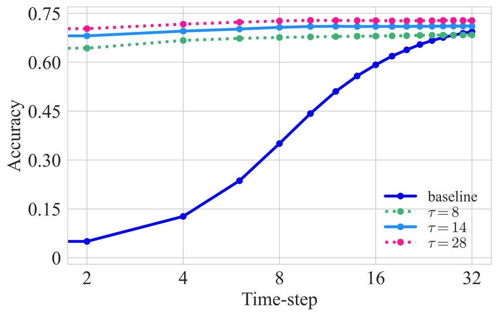
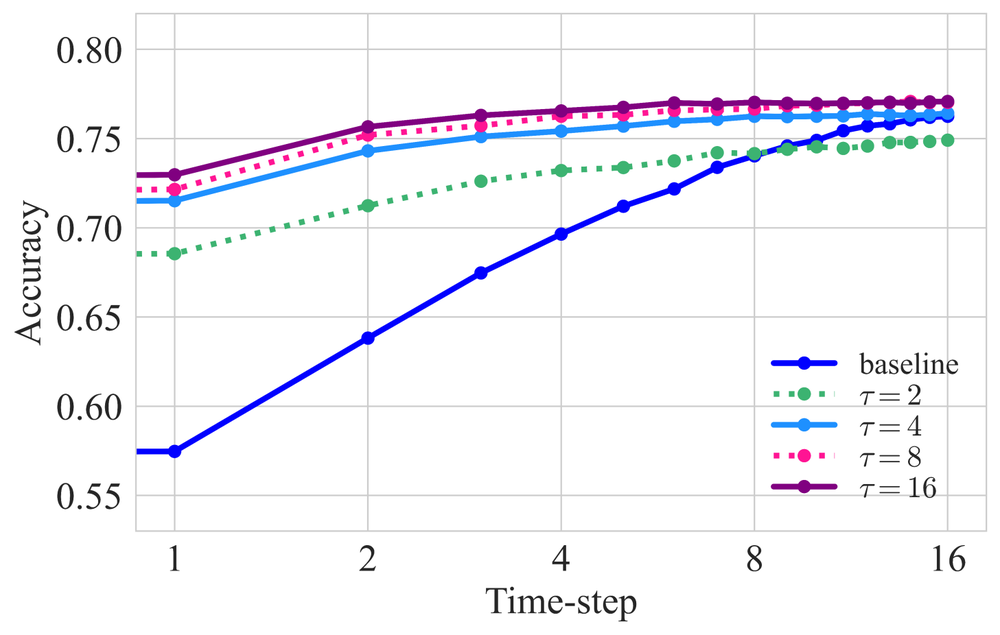
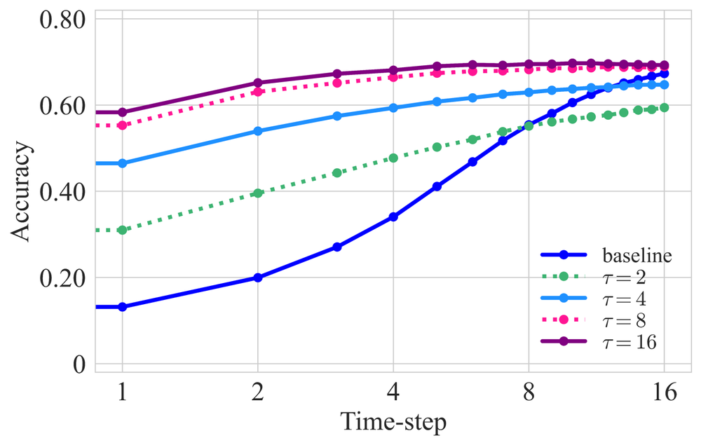
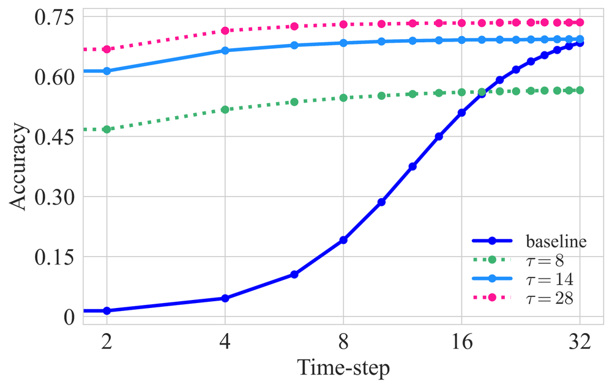
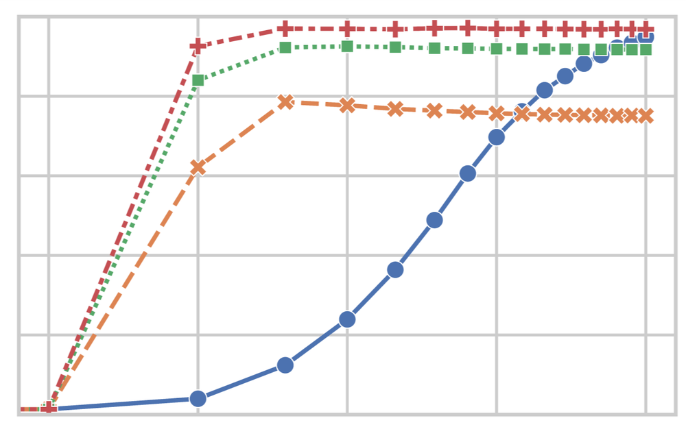
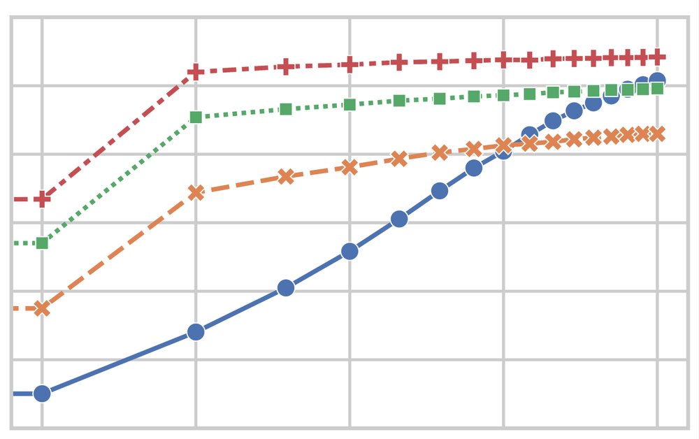

# Reducing ANN-SNN Conversion Error through Residual Membrane Potential

**URL**: https://www.semanticscholar.org/paper/366a99da9ddef081aacd362d3da6668dfff04b2d
**提交日期**: 2023-02-04
**作者**: Zecheng Hao; Tong Bu; Jianhao Ding; Tiejun Huang; Zhaofei Yu
**引用次数**: 70
使用模型: ep-20251112215738-bz78g

## 1. 核心思想总结
这是一份针对论文《Reducing ANN-SNN Conversion Error through Residual Membrane Potential》的第一轮总结，按四个部分组织如下：

**1. Background (背景)**
脉冲神经网络（SNN）因其低功耗和在神经形态芯片上的高速计算优势而受到广泛关注。在各种SNN训练方法中，ANN（人工神经网络）-SNN转换法已能在大型数据集上取得与ANN相当的性能。然而，该方法在短时间步长条件下，性能会因“不均匀误差”而严重下降。

**2. Problem (问题)**
“不均匀误差”是指由于脉冲到达激活层的时间序列不同而引起的偏差，它尚未被有效解决。本文作者对该误差进行了详细分析，并将其分为四类。他们指出，其中“ANN输出为零而SNN输出大于零”的情况占比最大，是限制SNN在超低延迟（短时间步）下实现高性能的关键问题。

**3. Method (high-level) (方法 - 高层概述)**
基于对上述关键问题的理论分析（证明了其发生的充要条件），作者提出了一种优化策略。该策略的核心是利用**残存膜电位**来减少不均匀误差。具体而言，该方法通过保留和利用神经元膜电位中未被重置的残余部分，来更精确地近似ANN的激活输出。

**4. Contribution (贡献)**
*   **主要贡献**：提出了一种基于残存膜电位的新方法，有效降低了ANN-SNN转换中的不均匀误差。
*   **性能突破**：在CIFAR-10, CIFAR-100和ImageNet等数据集上取得了领先的性能。特别是在仅使用10个时间步长的超低延迟下，在ImageNet上达到了64.32%的top-1准确率。
*   **宣称的首次**：据作者所知，这是ANN-SNN转换方法**首次**在复杂数据集上**同时实现高精度和超低延迟**。

## 2. 方法详解
好的，基于您提供的初步总结和论文方法章节，以下是对该论文方法细节的详细说明，重点描述了关键创新、算法/架构细节、关键步骤与整体流程。

### 论文方法细节详解

本论文的核心目标是解决ANN-SNN转换中由“不均匀误差”引起的性能下降问题，特别是在超低时间步长（如T=10）下。其方法建立在严谨的理论分析和巧妙的工程实现之上。

#### 一、 关键创新：残存膜电位的引入与利用

传统ANN-SNN转换中，当发放脉冲后，神经元的膜电位会被**重置为零**。论文指出，这种“硬重置”机制是导致“ANN输出为零而SNN输出大于零”这类最严重不均匀误差的主要原因。

**核心创新点**在于：**放弃硬重置，转而采用一种基于残存膜电位的软重置机制**。具体思想是，当神经元在时刻t发放一个脉冲后，其膜电位不应被重置为0，而是从中**减去阈值后的剩余部分**，这个剩余部分就是 **“残存膜电位”**。

*   **传统硬重置**： `if V[t] > V_th then S[t] = 1, and V[t] = 0`
*   **本文软重置**： `if V[t] > V_th then S[t] = 1, and V[t] = V[t] - V_th`

这个看似微小的改变，从根本上改变了SNN神经元动态与ANN激活函数（ReLU）之间的近似关系，使其在有限时间步长内更加精确。

#### 二、 算法/架构细节

##### 1. 理论基础与充要条件证明

论文首先通过严格的数学推导，证明了“ANN输出为零而SNN输出大于零”这类误差发生的**充要条件**。结论是：当且仅当在时间步长T内，SNN神经元的**总输入电流大于零**，但其**累积的膜电位从未达到发放阈值**时，就会发生此类误差。

*   **ANN行为**： ReLU激活函数的输入为负或零时，输出为零。
*   **SNN行为（硬重置）**： 即使平均输入电流很小（但大于零），膜电位也会从0开始累积，只要T足够大，**迟早**会达到阈值并发放脉冲，导致SNN输出（脉冲数）大于0。
*   **SNN行为（软重置）**： 残存膜电位可以保留未达到发放阈值的“努力”，但更重要的是，它引入了一个**有效的负输入**。如果输入电流很小，膜电位的累积可能会被残存电位在下一个周期中的“债务”（负值）所抵消，从而更可能在整个T内不发放脉冲，使其行为更接近ReLU输入为负时的状态。

##### 2. 转换框架与关键公式

论文的转换框架基于主流的基于率的ANN-SNN转换方法。

*   **ANN预处理**： 训练一个具有ReLU激活函数的ANN，并将其权重和偏置作为SNN的初始参数。为了更好的转换效果，通常会使用权重归一化技术。
*   **SNN神经元模型**： 采用**积分发放（IF）神经元模型**，并应用**残存膜电位机制**。

**关键步骤的数学描述**：

对于一个SNN神经元，在时间步长 `t` 内：
1.  **膜电位更新**：
    `V[t] = V[t-1] + X[t]`
    其中，`V[t]` 是当前膜电位，`V[t-1]` 是上一时刻的膜电位（可能包含残存电位），`X[t]` 是当前时刻的输入电流（通常对应于ANN中前一层的激活值）。

2.  **脉冲发放与软重置**：
    `if V[t] >= V_th:`
        `S[t] = 1`  (发放脉冲)
        `V[t] = V[t] - V_th`  (**关键步骤：保留残存膜电位**)
    `else:`
        `S[t] = 0`  (不发放脉冲)
        `V[t] = V[t]`  (膜电位保持不变)

3.  **输出计算**：
    SNN层的输出是脉冲序列的发放率，即 `Output = (Sum of S[1] to S[T]) / T`。在理想情况下（T→∞），这个发放率应等于ANN中对应ReLU神经元的激活值。

##### 3. 输入与第一层的特殊处理

论文强调了输入编码和第一层处理的重要性，以最小化初始误差。
*   **输入编码**： 通常采用恒定电流输入，将ANN第一层的激活值直接作为电流注入到SNN的第一层神经元，在整个仿真时间T内保持不变。
*   **第一层优化**： 由于输入层直接影响到后续所有层的误差累积，论文可能对第一层的阈值或归一化策略进行了特别优化，以确保输入信息被准确转换。

#### 三、 关键步骤与整体流程

整个方法的流程可以清晰地分为以下几个步骤：

1.  **步骤一：训练一个高性能的ANN**
    *   在目标数据集（如CIFAR-10， ImageNet）上训练一个标准的、带有ReLU激活函数的ANN模型（如VGG， ResNet）。
    *   应用必要的预处理技术，如权重归一化，以提高转换的鲁棒性。

2.  **步骤二：模型转换与参数映射**
    *   将训练好的ANN的权重和偏置直接复制到对应的SNN架构中。
    *   为SNN神经元设置合适的阈值（通常设为1或经过归一化后的值）。

3.  **步骤三：SNN仿真与推理（核心创新所在）**
    *   对于给定的输入样本，将其转换为恒定的输入电流。
    *   在有限的时间步长 `T`（论文中重点为T=10或更小）内运行SNN。
    *   **关键**：在仿真过程中，对**每一个**IF神经元**在每一个时间步**都严格执行**带有残存膜电位的软重置规则**。这是与传统方法最根本的区别。
    *   记录每一层神经元的脉冲发放序列。

4.  **步骤四：输出解码与性能评估**
    *   将最后一层神经元在T个时间步内的脉冲数求和，并除以T，得到发放率，作为网络的最终输出（类似于ANN的Softmax前的得分）。
    *   使用该输出计算准确率等性能指标。

#### 总结

该论文的方法细节可以概括为：**通过将IF神经元的硬重置机制改为基于残存膜电位的软重置机制，巧妙地改变了SNN的动力学特性，使其在有限时间步长内对ReLU函数的近似误差，特别是“零激活值对应非零脉冲”的误差，得到了根本性的抑制。** 这一创新不增加模型复杂度和训练成本，仅通过修改神经元动力学规则，就实现了在超低延迟下SNN性能的巨大提升，是算法层面一个非常优雅且有效的解决方案。

## 3. 最终评述与分析
根据您提供的论文初步总结、方法详述以及结论部分的信息，现对该论文《Reducing ANN-SNN Conversion Error through Residual Membrane Potential》进行最终的综合评估如下：

### 1. Overall Summary (总体摘要)
本论文针对ANN（人工神经网络）到SNN（脉冲神经网络）转换过程中，在短时间步长（超低延迟）下性能严重下降的核心问题——“不均匀误差”，进行了深入的理论分析并提出了一种创新性解决方案。论文的关键创新点在于，通过将SNN中神经元传统的“硬重置”机制改为基于**残存膜电位**的“软重置”机制，有效抑制了最主要的一类不均匀误差（即ANN输出为零而SNN输出非零）。该方法无需重新训练或增加模型复杂度，仅通过修改神经元动态规则，就在CIFAR-10、CIFAR-100和ImageNet等大型数据集上，尤其是在时间步长极短（T=2,4,10）的条件下，实现了当前最先进的性能，标志着ANN-SNN转换技术在同时实现高精度与超低延迟方面取得了重要突破。

### 2. Strengths (优势)
*   **问题定位精准，理论分析扎实**：论文没有停留在表面现象，而是深入剖析了“不均匀误差”的根源，将其分类并识别出最关键的类型，进而通过严格的数学推导证明了该类误差发生的充要条件，为解决方案的提出奠定了坚实的理论基础。
*   **方法创新且优雅**：所提出的“残存膜电位”方法概念清晰，实现简单。它巧妙地改变了神经元的动力学特性，从根本上改善了SNN对ANN的近似精度，是一个在算法层面非常优雅和高效的创新。
*   **性能提升显著，实现技术突破**：实验结果表明，该方法在超低延迟（如T=10）下，在ImageNet等复杂数据集上取得了远超以往方法的准确率（例如，ImageNet上T=10达到64.32%的top-1准确率），实现了“高精度”与“超低延迟”的兼得，这是该领域一个重要的里程碑。
*   **实用性强，易于集成**：该方法不改变ANN的训练过程，也不增加SNN的推理成本（如时间步长或参数数量），可以作为一个“即插即用”的模块轻松集成到现有的基于转换的SNN框架中，具有很高的实用价值和可推广性。

### 3. Weaknesses / Limitations (弱点/局限性)
*   **方法普适性讨论可能不足**：虽然论文在主流模型（VGG, ResNet）和数据集上进行了验证，但其方法对于更复杂的网络架构（如包含特殊连接、注意力机制的网络）或不同模态数据（如动态视觉流、音频序列）的转换效果和潜在挑战，可能需要进一步的探索和验证。
*   **理论分析的边界条件**：论文的理论分析主要集中于解决“ANN输出为零而SNN输出大于零”这类误差。虽然这是最主要的问题，但“不均匀误差”的其他类别是否被完全消除或产生新的影响，论文可能未做最全面的理论覆盖和实验分析。
*   **硬件实现考量**：尽管方法本身计算简洁，但在实际神经形态硬件上实现“残存膜电位”的精确存储和累加，相较于简单的硬重置机制，可能会对电路设计提出稍高的要求。论文对此硬件友好性的讨论可能相对有限。
*   **与其他先进方法的全面对比**：论文主要与基于转换的方法进行对比。虽然结论可能提及，但与直接训练（如基于梯度的训练）的SNN在极短时间步下的性能进行更深入的对比分析，可能有助于更全面地定位该方法的优势与适用范围。

### 4. Potential Applications / Implications (潜在应用/影响)
*   **推动低功耗边缘AI部署**：该方法使得SNN能够在极低的延迟下达到高精度，极大地增强了其在资源受限的边缘计算设备（如移动手机、嵌入式传感器、无人机）和需要对实时数据进行快速处理的场景（如自动驾驶、工业质检）中的应用潜力，充分发挥SNN的低功耗优势。
*   **促进神经形态计算发展**：为神经形态芯片（如Intel Loihi, IBM TrueNorth）提供了性能更强、响应更快的算法模型，有助于加速神经形态计算从研究走向实际应用的进程。
*   **为SNN研究提供新思路**：该工作展示了通过精细调整神经元动力学来优化SNN性能的有效性，为后续SNN研究（不仅是转换方法，也包括直接训练方法）提供了新的思路和方向，例如探索更复杂或更生物合理的膜电位管理机制。
*   **架起ANN与SNN沟通的桥梁**：它进一步巩固了ANN-SNN转换作为一种高效、可靠的SNN生成范式的重要性，使得庞大的现有ANN模型库能够更高效地转化为高性能的SNN，加速了脉冲神经网络生态的发展。

**总结**：该论文是一项高质量、具有显著贡献的研究工作。它通过一个清晰而有力的创新点，成功解决了ANN-SNN转换领域的一个关键瓶颈问题，取得了突破性的性能成果，并对低功耗智能计算的实际应用产生了积极的推动作用。

---

# 附录：论文图片

## 图 1

## 图 2

## 图 3

## 图 4

## 图 5

## 图 6

