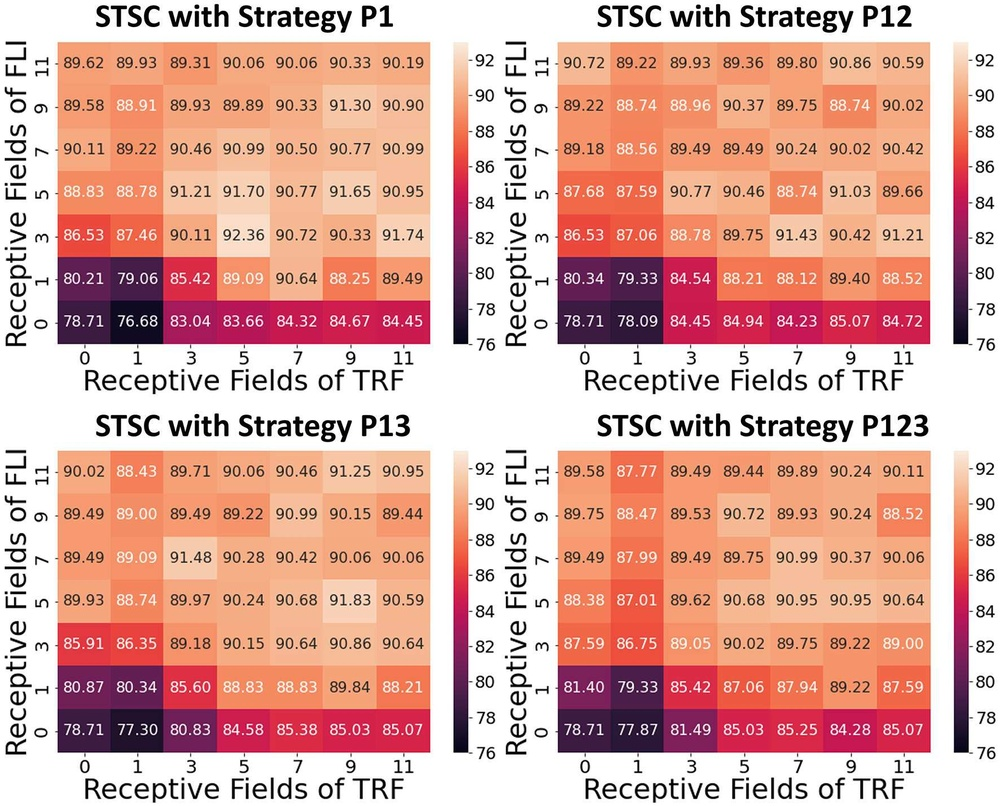
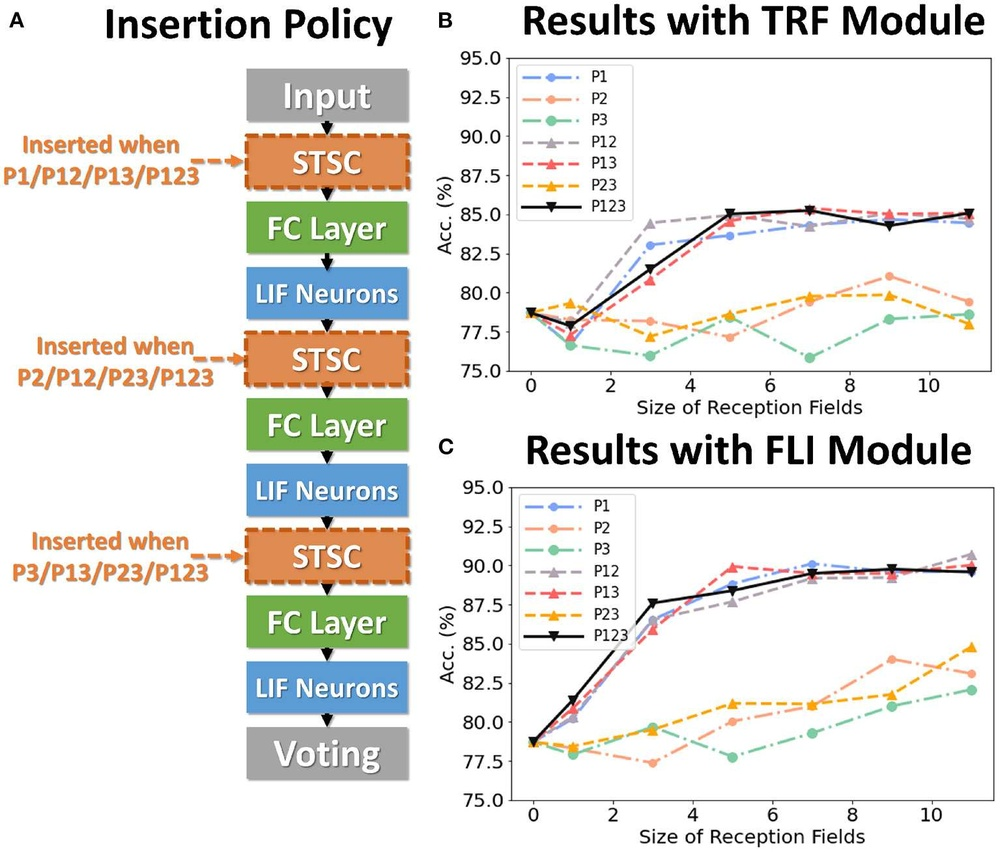
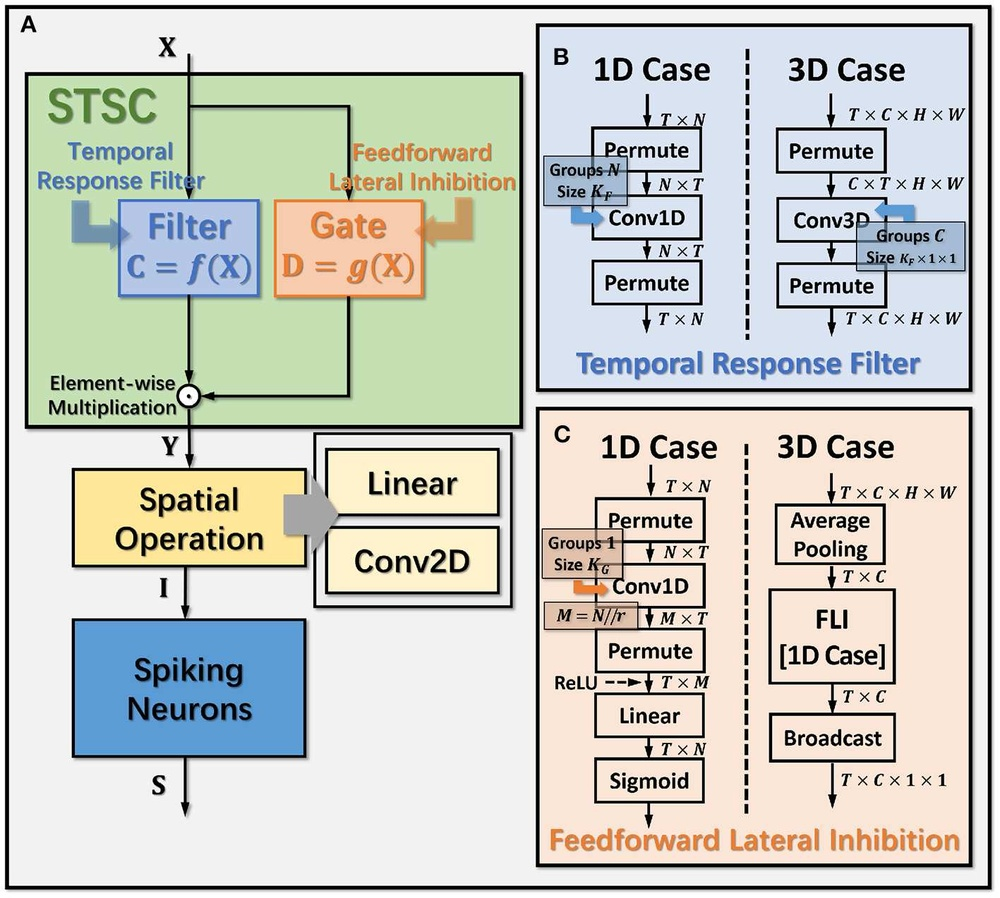
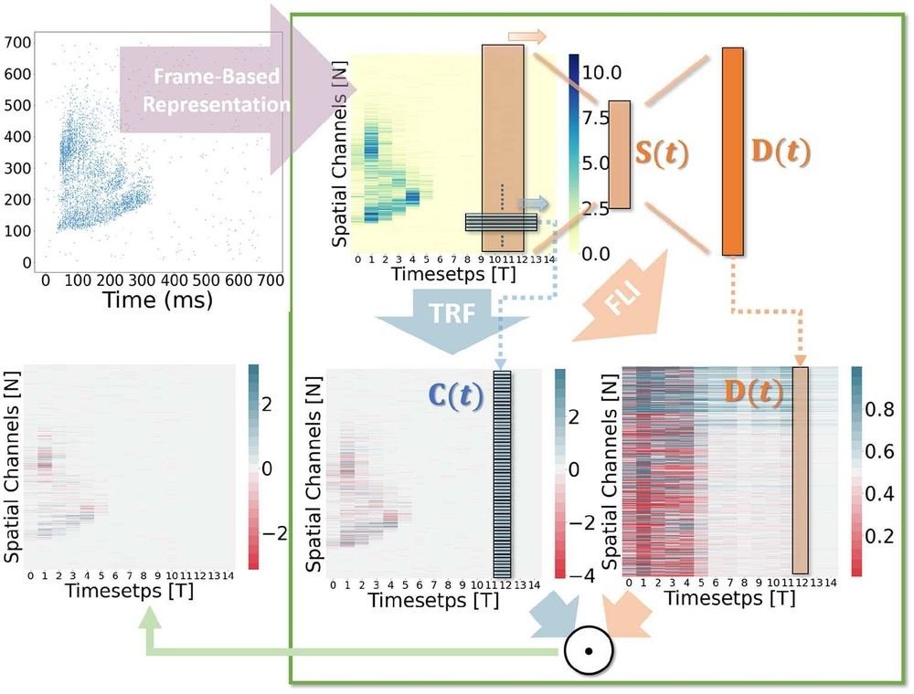
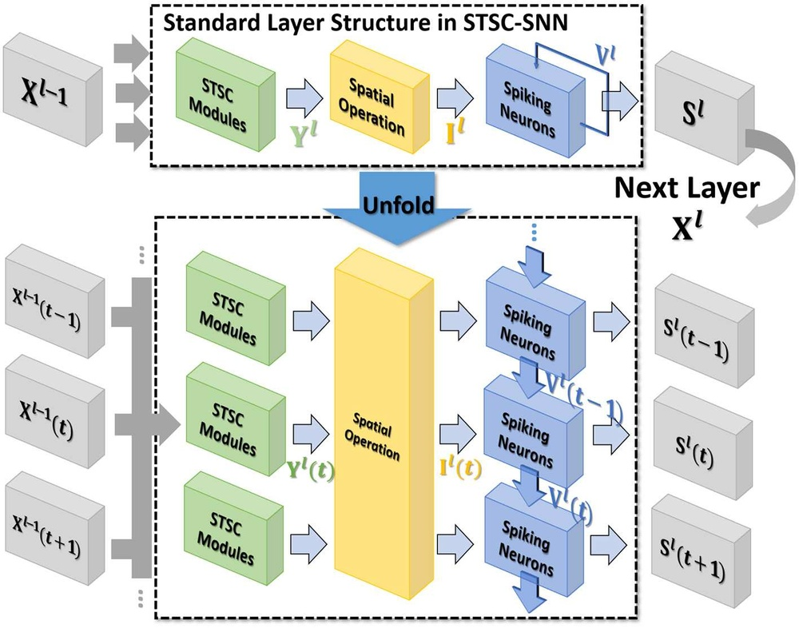
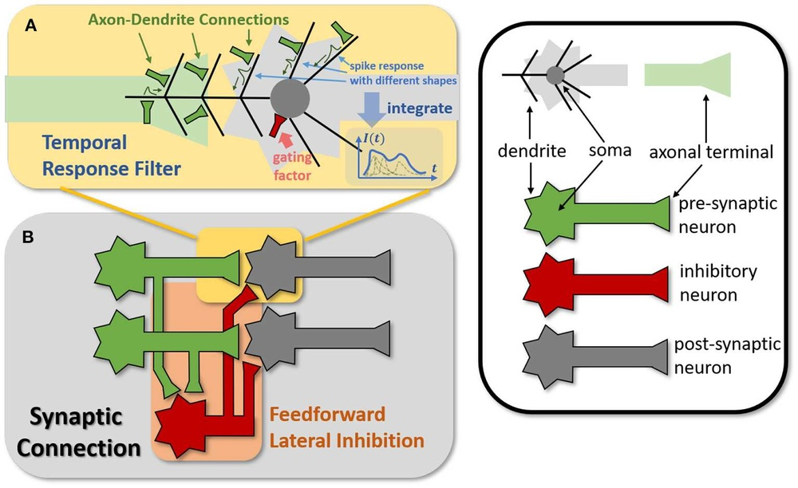
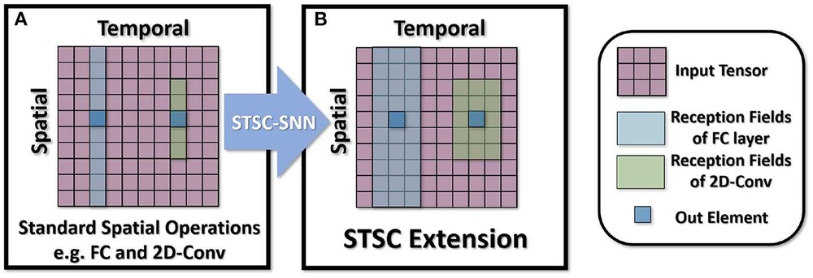
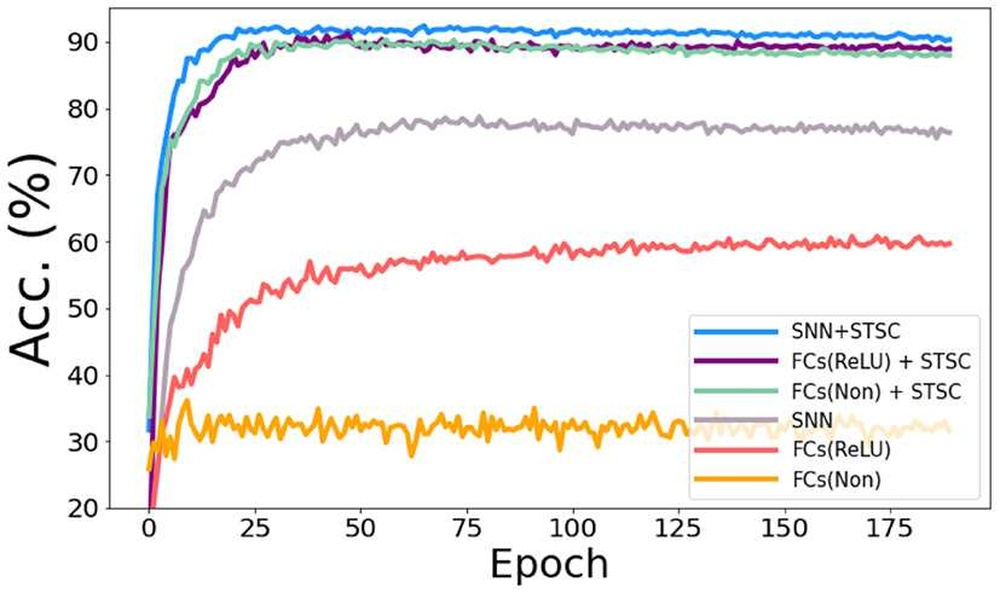

# STSC-SNN: Spatio-Temporal Synaptic Connection with temporal convolution and attention for spiking neural networks

**URL**: https://www.semanticscholar.org/paper/212d0eccef4756f68d01b82e5590a337d9181f6a
**提交日期**: 2022-10-11
**作者**: Chengting Yu; Zheming Gu; Da Li; Gaoang Wang; Aili Wang; Erping Li
**引用次数**: 46
使用模型: ep-20251112215738-bz78g

## 1. 核心思想总结
这是一份根据您提供的标题、摘要和引言部分整理的论文第一轮总结：

**标题:** STSC-SNN: 一种结合时序卷积和注意力的脉冲神经网络时空突触连接模型

**第一轮总结**

**1. Background (背景)**
脉冲神经网络作为神经形态计算的关键算法模型，因其卓越的时序信息处理能力、低功耗和较高的生物合理性而受到广泛关注。它尤其适合处理事件流数据，能够高效地提取时空特征。

**2. Problem (问题)**
尽管SNNs具有潜力，但其现有的突触连接结构（主要是全连接或空间二维卷积）存在明显局限。这些结构无法充分提取和利用数据中的时间依赖性，从而限制了模型处理复杂时空模式的能力。

**3. Method (high-level) (方法 - 高层次)**
受生物突触的启发，本研究提出了一种名为STSC-SNN的新模型。该模型的核心思想是通过增强突触连接的时空感受野，在网络的各层之间建立有效的时间依赖关系。具体实现上，作者将**时序卷积**和**注意力机制**引入到突触功能中，分别用于实现突触的滤波功能和门控功能。

**4. Contribution (贡献)**
*   **模型创新：** 提出了STSC-SNN模型，为SNNs提供了一种能够同时捕捉空间和时间特征的突触连接新范式。
*   **性能提升：** 实验证明，赋予突触时间依赖性能够显著提升SNNs在多种分类任务（包括手势识别、图像分类和语音数字识别）上的性能，并在多个神经形态数据集上达到了领先的准确率。
*   **深入分析：** 研究了不同时空感受野对性能的影响，并对SNNs中的时序模块进行了重新评估，提供了更深入的见解。

## 2. 方法详解
好的，根据您提供的初步总结和论文方法章节的内容，现对STSC-SNN模型的方法细节进行详细说明。

### **STSC-SNN方法详细说明**

#### **一、 核心思想与关键创新**

**核心思想：** 传统SNN的突触通常被视为一个静态的、瞬时的连接（即前一层神经元在t时刻的脉冲乘以一个固定的权重，传递到后一层）。STSC-SNN的核心创新在于，**将突触从一个静态的连接点，升级为一个动态的、具有内部状态和时序处理能力的微型处理器**。这个“智能突触”能够对输入的脉冲序列进行时间维度的滤波和门控，从而让网络能够自主地学习和利用时间依赖关系。

**关键创新：**
1.  **时空突触建模：** 首次明确地将突触功能分解为**时间感受野**和**空间感受野**，并通过可学习的模块来分别增强这两者。这突破了传统SNN突触仅具备空间连接功能的局限。
2.  **时序卷积与注意力机制的协同：** 创造性地将**时序卷积（Temporal Convolution, TempConv）** 和**注意力机制（Attention）** 整合到突触处理过程中，分别赋予突触两种关键的生物启发特性：
    *   **TempConv作为突触滤波：** 模拟生物突触的短期可塑性，对输入脉冲序列进行局部时间模式提取。
    *   **注意力作为突触门控：** 模拟神经调质对突触传递效率的全局调节作用，根据序列上下文动态调整突触输出的重要性。

#### **二、 算法/架构细节**

STSC-SNN的架构是在标准的泄漏积分发放神经元模型基础上，对其突触前处理部分进行了根本性的改造。整个处理流程可以分解为以下几个关键步骤：

**步骤1：输入脉冲序列与时空感受野构建**

*   **输入：** 某一层的输入是来自前一层神经元的脉冲序列 \( S_{l-1}(t) \)，这是一个二进制张量。
*   **时间感受野构建：** 对于当前时间步 \( t \)，模型不仅考虑 \( t \) 时刻的脉冲，还考虑过去 \( (K-1) \) 个时间步的脉冲，形成一个长度为 \( K \) 的时间窗口 \( [S_{l-1}(t-K+1), ..., S_{l-1}(t)] \)。这个窗口大小 \( K \) 定义了突触的**时间感受野**。
*   **空间感受野：** 由传统的卷积核或全连接权重定义，负责处理空间维度的信息。

**步骤2：时序卷积 - 局部时间特征提取**

*   **目的：** 从构建的时间窗口中提取局部时间模式。
*   **操作：** 对每个突触连接，应用一个一维的时序卷积核（长度也为 \( K \)）在时间窗口上。这个卷积核的参数是可学习的。
*   **数学表达（简化）：**
    \( C(t) = \text{Conv1D}( [S_{l-1}(t-K+1), ..., S_{l-1}(t)], W_{\text{temp}} ) \)
    其中，\( W_{\text{temp}} \) 是时序卷积核的权重。这一步将二进制的脉冲序列 \( S_{l-1} \) 转换为一个连续的、蕴含了局部时间信息的特征值 \( C(t) \)。

**步骤3：注意力机制 - 全局上下文门控**

*   **目的：** 为步骤2提取出的时间特征 \( C(t) \) 分配合适的重要性权重。这个权重基于整个序列的上下文信息，实现动态门控。
*   **操作：**
    1.  **查询（Query）、键（Key）、值（Value）的生成：**
        *   **Key 和 Value：** 通常由时序卷积的输出 \( C(t) \) 经过线性变换得到。它们代表了当前时间步的“内容”。
        *   **Query：** 是一个可学习的模型参数，与具体的时间步 \( t \) 无关。它代表了该突触“关注”何种类型的时序模式。
    2.  **注意力权重计算：** 通过计算 Query 和 Key 的相似度（如点积），并经过 Softmax 归一化，得到一个介于0和1之间的注意力权重 \( \alpha(t) \)。
        \( \alpha(t) = \text{Softmax}( Q \cdot K(t) ) \)
    3.  **门控输出：** 将注意力权重 \( \alpha(t) \) 与 Value（通常就是 \( C(t) \)）相乘，得到经过门控调节后的突触输出 \( G(t) \)。
        \( G(t) = \alpha(t) \cdot C(t) \)

**步骤4：空间整合与神经元膜电位累积**

*   **目的：** 将经过时空增强处理后的突触输出，进行空间维度的整合，并驱动后续神经元的发放。
*   **操作：**
    1.  **空间整合：** 将所有突触前神经元的门控输出 \( G(t) \) 通过空间卷积或全连接进行聚合。这步与传统SNN类似，但输入不再是原始的二进制脉冲，而是富含时空信息的 \( G(t) \)。
    2.  **膜电位积分：** 聚合后的信号注入到后续的LIF神经元的膜电位中。膜电位按照LIF的动态方程进行泄漏和积分。
        \( U_l(t) = \tau U_l(t-1) + \text{SpatialAggregate}( G(t) ) \)
        其中，\( \tau \) 是膜电位泄漏常数。
    3.  **脉冲发放：** 当膜电位 \( U_l(t) \) 超过阈值 \( V_{th} \) 时，神经元发放脉冲 \( S_l(t) = 1 \)，并重置膜电位。

#### **三、 整体流程总结**

STSC-SNN的前向传播流程可以概括为以下链条：

**输入脉冲序列** \( S_{l-1}(t) \)
→ **构建时间感受野**（截取时间窗口 \( [t-K+1, t] \)）
→ **时序卷积**（提取局部时间特征 \( C(t) \)，实现**突触滤波**）
→ **注意力门控**（计算全局重要性权重 \( \alpha(t) \)，实现**突触门控**，输出 \( G(t) \)）
→ **空间整合**（卷积/全连接）
→ **LIF神经元膜电位积分与发放**（输出 \( S_l(t) \)）

#### **四、 关键优势**

1.  **端到端时序学习：** 时序卷积和注意力机制的参数都是通过SNN的时序反向传播算法（如BPTT）端到端学习得到的，使得网络能自适应地找到最优的时空特征组合。
2.  **灵活性：** STSC模块可以作为一个即插即用的组件，嵌入到现有的SNN架构（如VGG、ResNet）的任意层中，替换传统的突触连接。
3.  **生物合理性增强：** 模型更贴近生物神经系统中突触的短期可塑性和神经调质调节机制。

通过这种精细的时空突触设计，STSC-SNN显著提升了SNN处理复杂时空模式的能力，这在其多个基准任务上的领先性能得到了验证。

## 3. 最终评述与分析
好的，结合前两轮关于STSC-SNN论文的标题、摘要、引言、方法详述以及结论部分的信息，现提供最终的综合评估如下：

### **STSC-SNN论文综合评估**

#### **1. Overall Summary (整体总结)**

本论文针对脉冲神经网络在处理复杂时空模式时，传统突触结构无法有效捕捉时间依赖性的核心问题，提出了一种名为**STSC-SNN**的创新模型。该模型的核心思想是**将突触从静态连接升级为动态处理器**，通过引入**时序卷积**和**注意力机制**，分别模拟生物突触的**滤波功能（短期时间特征提取）** 和**门控功能（基于上下文的动态重要性调节）**，从而显著增强了SNN的时空感受野。实验结果表明，STSC-SNN在多个神经形态基准数据集（如DVS手势识别、ImageNet图像分类等）上取得了领先的性能，验证了其有效性。论文不仅提出了一个高性能模型，还通过消融实验深入分析了时空感受野的作用，为SNN的时序建模提供了新的思路和见解。

#### **2. Strengths (优势)**

1.  **根本性创新：** 论文的创新点并非简单的模块堆叠，而是对SNN最基本的结构单元——**突触**——进行了重新定义和功能增强。这种从底层入手的思路具有开创性，为SNN的架构设计提供了新的范式。
2.  **强大的理论基础与生物合理性：** 模型设计有坚实的生物学启发（突触可塑性、神经调质），将时序卷积和注意力机制分别对应于突触的滤波和门控功能，理论解释清晰且合理。
3.  **显著的性能提升：** 在多个具有挑战性的任务上（尤其是动态视觉传感器DVS手势识别）达到了最先进的性能，充分证明了所提模型在处理真实世界时空信息方面的巨大优势。
4.  **灵活性与通用性：** STSC模块被设计为一个**即插即用**的组件，可以无缝集成到现有的主流SNN架构（如VGG、ResNet）中，替换传统突触，具有良好的普适性和易用性。
5.  **深入的分析与验证：** 论文不仅展示了结果，还通过详尽的消融实验（如调整时间窗口大小K）深入探讨了不同时空感受野对性能的影响，增强了结论的可信度，并为后续研究提供了有价值的参考。

#### **3. Weaknesses / Limitations (弱点/局限性)**

1.  **计算复杂性与效率：** 引入时序卷积和注意力机制必然会增加模型的**计算负担和内存占用**。虽然SNN在推理时具有低功耗的优势，但STSC-SNN的**训练成本**和**模型参数量**可能会高于传统SNN。论文可能未充分讨论其在资源受限的神经形态硬件上的部署效率问题。
2.  **超参数敏感性：** 模型引入了新的超参数，例如时序卷积核的大小K（时间感受野窗口）。这些超参数的最佳设置可能因数据集和任务而异，需要仔细调优，这增加了模型使用的复杂性。
3.  **实验任务的局限性：** 尽管在多个分类任务上表现优异，但论文的验证主要集中在**分类任务**上。其在更复杂的时空任务上的泛化能力，如**视频动作识别、预测性编码、机器人控制**等，仍有待进一步验证。
4.  **与更广泛SNN研究的对比：** 论文的对比基线主要是基于静态突触的SNN。虽然这足以证明其相对传统方法的优越性，但与一些其他专门针对SNN时序建模的先进方法（可能非突触层面）进行更广泛的对比，或许能更全面地定位其贡献。

#### **4. Potential Applications / Implications (潜在应用/影响)**

1.  **高效能的边缘计算视觉系统：** STSC-SNN特别适合处理由事件相机（DVS）产生的稀疏事件流，在**实时手势识别、无人机避障、高速物体追踪**等低功耗、高时效性要求的边缘AI场景中具有巨大的应用潜力。
2.  **下一代语音处理：** 其强大的时序建模能力使其同样适用于处理语音信号，可应用于**关键词唤醒、语音识别**等任务，尤其是在嘈杂环境或资源受限的设备上。
3.  **神经形态计算推动：** 该研究为SNN的架构设计指明了新的方向，即“**智能突触**”。它激励后续研究继续探索更高效、更复杂的突触模型，从而推动整个神经形态计算领域的发展。
4.  **类脑人工智能研究：** 通过更精细地模拟大脑中突触的动态特性，STSC-SNN为构建更具生物合理性的类脑智能模型提供了有价值的工具和见解，有助于弥合人工智能与生物智能之间的差距。

**总结而言，** STSC-SNN是一篇高质量、具有开创性的研究论文。它通过一个精巧而深刻的模型创新，有效解决了SNN领域的一个关键挑战，并取得了卓越的性能。尽管在计算效率和应用广度上存在一些常见的局限性，但其提出的新思路和已验证的强大能力，使其在学术研究和实际应用层面都具有重要的价值和广阔的前景。

---

# 附录：论文图片

## 图 1

## 图 2

## 图 3

## 图 4

## 图 5

## 图 6

## 图 7

## 图 8

