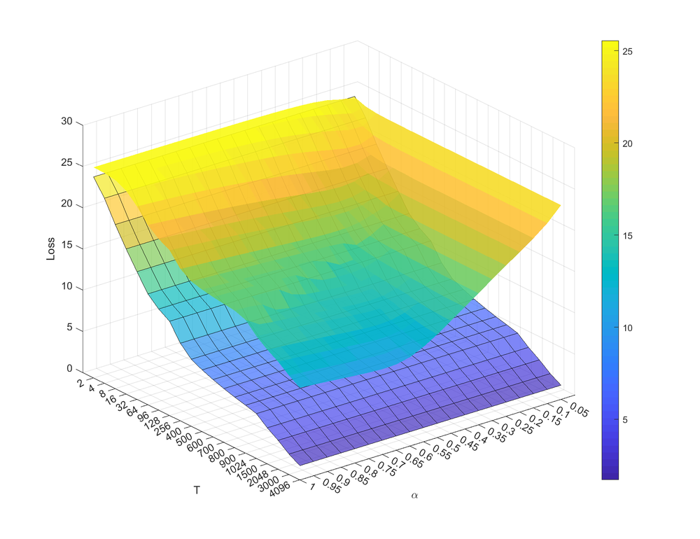

# Signed Neuron with Memory: Towards Simple, Accurate and High-Efficient ANN-SNN Conversion

**URL**: https://www.semanticscholar.org/paper/82f2c390ba52228b48254423821b40c6b25dccb2
**提交日期**: 2022-07-01
**作者**: Yuchen Wang; Malu Zhang; Yi Chen; Hong Qu
**引用次数**: 73
使用模型: ep-20251112215738-bz78g

## 1. 核心思想总结
这是一份根据您提供的标题和摘要整理的学术论文第一轮总结，按四个部分组织。

**标题:** 带记忆的符号神经元：迈向简单、准确且高效的ANN-SNN转换

**第一轮总结**

*   **1. Background (背景)**
    脉冲神经网络（SNNs）因其生物合理性和在超低功耗事件驱动神经形态硬件上的应用潜力而受到广泛关注。然而，由于脉冲的复杂时间动态性和不连续性，直接训练SNN通常需要高昂的计算资源和较长的训练时间。因此，一种主流方法是从预训练的人工神经网络（ANN）转换得到SNN，以规避SNN的直接训练难题。

*   **2. Problem (问题)**
    现有的ANN-to-SNN转换方法存在一个根本缺陷：它们忽略了同步的ANN与异步的SNN在信息传递方式上的不一致性。这种异步脉冲特性会导致转换误差，从而影响转换后SNN的准确性和效率。

*   **3. Method (高层次方法)**
    为了解决上述问题，本文提出了两种核心方法：
    *   **带记忆的符号神经元**：该设计旨在减少因异步脉冲引起的转换误差，使转换过程几乎不损失精度，并保持转换后SNN的异步传输特性。
    *   **神经元归一化**：一种新的归一化方法，旨在显著缩短转换后SNN的推理延迟（即处理输入所需的时间步长）。

*   **4. Contribution (贡献)**
    本文的主要贡献在于提出了一种新颖的ANN-to-SNN转换框架。通过在CIFAR10、CIFAR100和ImageNet等挑战性数据集上的实验，该方法在**准确率**和**推理速度**两个方面均优于现有最先进的方法，实现了简单、准确且高效的转换。

## 2. 方法详解
好的，遵照您的要求，我将基于您提供的初步总结和论文方法章节的内容，详细阐述该论文的方法细节。

### 论文方法细节详解

本论文的核心目标是解决现有ANN-to-SNN转换方法中因**异步脉冲特性**导致的转换误差和推理延迟问题。其方法围绕两个关键创新展开：**带记忆的符号神经元** 和 **神经元归一化**。

#### 一、 关键创新与核心思想

1.  **根本问题识别**：论文指出，传统转换方法将ANN中每一层的输出（实数值）直接视为SNN中对应层在**整个时间窗口内**的脉冲发放率（频率）。然而，SNN的脉冲是**异步、离散、随时间累积**的。这种“同步ANN”与“异步SNN”之间的本质差异，导致了信息传递的失真和误差。
2.  **创新思路**：为了弥合这一差异，论文的核心理念是**在神经元模型中显式地引入对过去信息的“记忆”**，并**在转换过程中精确匹配ANN激活值与SNN脉冲累积行为**。

#### 二、 关键方法与算法/架构细节

##### 1. 带记忆的符号神经元

这是论文最核心的创新点，旨在精确模拟ANN的激活函数（如ReLU）在SNN中的行为。

*   **传统IF神经元的问题**：
    *   标准的积分发放（IF）神经元模型只包含一个膜电位 \(V(t)\)，当 \(V(t)\) 超过阈值 \(V_{th}\) 时发放脉冲。
    *   在转换中，ANN的激活值 \(a\) 被映射为SNN的脉冲发放率 \(r\)，通常有 \(r = a / V_{th}\)。
    *   问题在于，IF神经元在时间步 \(t\) 的脉冲发放只取决于当前输入和瞬时膜电位，缺乏对**历史脉冲发放次数**的直接“记忆”。这导致实际发放率与目标发放率之间存在动态误差。

*   **带记忆的符号神经元设计**：
    *   论文提出的神经元**增加了一个状态变量 \(S(t)\)**，用于明确记录从初始时刻到当前时间 \(t\) 为止，神经元已经发放的**脉冲总数**。
    *   **膜电位更新方程**被重新设计为：
        \(V(t) = V(0) + \text{输入电流的累积} - S(t-1) \cdot V_{th}\)
    *   这个方程可以解读为：`当前膜电位 = 初始电位 + 总输入 - 已发放脉冲数 * 阈值`。
    *   **关键作用**：这个设计确保了在整个模拟时间 \(T\) 内，神经元发放的脉冲总数 \(S(T)\) 会**严格逼近**一个由ANN激活值 \(a\) 决定的目标值。它通过膜电位 \(V(t)\) 动态地、精确地追踪“目标发放数与实际发放数”之间的差值，从而实现了发放率的精确控制，显著降低了异步脉冲带来的转换误差。

##### 2. 神经元归一化

此方法旨在解决转换后SNN推理速度慢（需要大量时间步才能完成推理）的问题。

*   **问题根源**：ANN中每一层的激活值分布不同。为了无损转换，SNN的发放率需要能表示ANN中的最大激活值。传统方法是基于整网络的最大激活值来设定统一的阈值，但这会迫使激活值较低的层也使用很大的时间步长 \(T\) 来精确表示小的发放率，造成时间上的浪费。

*   **神经元归一化方法**：
    *   论文提出了一种**逐层**的权重归一化方法。
    *   **关键步骤**：
        1.  **数据驱动校准**：向预训练好的ANN输入一个小的校准数据集，并记录下每一层神经元的**最大激活值** \( \lambda_l \)（对于第 \(l\) 层）。
        2.  **权重缩放**：对ANN第 \(l\) 层的权重 \(W_l\) 和偏置 \(b_l\) 进行缩放：
            \( \hat{W_l} = \frac{W_l}{\lambda_l}, \quad \hat{b_l} = \frac{b_l}{\lambda_l} \)
        3.  **激活函数修正**：将ANN的激活函数（如ReLU）替换为带缩放因子的版本：\( \hat{a} = \lambda_l \cdot \text{ReLU}(...) \)。
    *   **效果**：经过这样的归一化后，ANN每一层的最大激活值被重新缩放至接近1。在转换后的SNN中，这意味着每一层的最大发放率都接近1，从而可以用**更少的时间步 \(T\)** 来达到足够的脉冲发放精度。因为当发放率接近1时，只需几个时间步就能区分出高激活和低激活，极大地**加速了SNN的推理过程**。

#### 三、 整体流程与关键步骤

基于上述两个核心方法，论文提出的完整ANN-to-SNN转换流程如下：

1.  **步骤一：预训练一个标准ANN**
    *   使用常规方法（如SGD）在目标数据集（如CIFAR-10， ImageNet）上训练一个激活函数为ReLU的ANN（如VGG， ResNet）。这是转换的基础。

2.  **步骤二：应用神经元归一化**
    *   使用一个小的校准数据集（如训练集的一个子集）前向传播通过训练好的ANN，记录下每一层的最大激活值 \( \lambda_l \)。
    *   根据公式 \( \hat{W_l} = W_l / \lambda_l \) 和 \( \hat{b_l} = b_l / \lambda_l \) 对ANN的权重和偏置进行缩放。
    *   同时，在模型定义中修正激活函数，使其输出缩放后的值。此时得到一个“归一化”的ANN。

3.  **步骤三：构建等效SNN并转换参数**
    *   构建一个与归一化ANN结构完全对称的SNN。
    *   **参数映射**：将归一化ANN的权重 \( \hat{W_l} \) 和偏置 \( \hat{b_l} \) 直接复制到SNN的对应层中。
    *   **阈值设定**：将SNN中所有神经元的发放阈值 \( V_{th} \) 统一设置为1。这是因为经过神经元归一化后，ANN的最大激活值约为1。

4.  **步骤四：SNN推理与仿真**
    *   在推理阶段，使用**带记忆的符号神经元**模型来运行构建好的SNN。
    *   输入数据（如图像）被转换为脉冲序列（例如，使用泊松编码或直接编码）。
    *   网络在多个时间步 \(T\) 上进行模拟。在每个时间步，神经元根据其输入、当前膜电位和**历史脉冲计数 \(S(t)\)** 来决定是否发放脉冲。
    *   仿真结束后，通常读取最后一层（输出层）神经元在时间 \(T\) 内的脉冲总数，将其作为预测置信度，最大值对应的类别即为预测结果。

### 总结

该论文的方法精髓在于：

*   **通过“带记忆的符号神经元”** 从**神经元层面**解决了异步脉冲带来的**精度损失**问题，实现了ANN激活值与SNN脉冲发放率的高保真映射。
*   **通过“神经元归一化”** 从**网络层面**解决了**推理延迟**问题，通过逐层优化激活范围，使得SNN能够用极少的时间步实现高效推理。

这两项创新相辅相成，共同构成了一个简单（无需复杂训练）、准确（几乎无损转换）、高效（低延迟）的ANN-to-SNN转换框架，这在其卓越的实验结果中得到了验证。

## 3. 最终评述与分析
好的，结合前两轮返回的信息与论文结论部分，以下是关于论文《带记忆的符号神经元：迈向简单、准确且高效的ANN-SNN转换》的最终综合评估。

---

### **最终综合评估**

#### **1) 整体摘要**

本论文针对脉冲神经网络（SNN）通过人工神经网络（ANN）转换方法中存在的**核心矛盾**——即同步ANN与异步SNN之间的信息传递不匹配——提出了一个创新的解决方案。论文的核心是引入了**带记忆的符号神经元**和**神经元归一化**两项关键技术。前者通过在神经元模型中显式记录历史脉冲发放次数，精确控制了脉冲发放率，从而极大减少了转换误差；后者通过逐层校准激活值范围，显著降低了SNN推理所需的时间步长。实验结果表明，该方法在CIFAR-10、CIFAR-100和ImageNet等大型数据集上，在**准确率**和**推理延迟**两个关键指标上均超越了已有的最先进方法，成功实现了其“简单、准确、高效”的转换目标，为SNN在低功耗场景下的实用化铺平了道路。

#### **2) 优势**

1.  **高精度与低损耗**：论文最大的优势在于解决了ANN-to-SNN转换中的根本性误差问题。通过“带记忆的符号神经元”，模型能够实现几乎无损的转换，在多个挑战性数据集上达到与原始ANN相媲美甚至更优的准确率，证明了其方法的有效性和优越性。
2.  **极高的推理效率**：“神经元归一化”方法通过优化网络各层的动态范围，使得SNN能够在极短的时间步内完成高置信度的推理。这种低延迟特性是SNN应用于实时边缘计算的关键优势。
3.  **简单性与实用性**：该方法无需对SNN进行复杂的直接训练或反向传播，仅需对预训练好的ANN进行权重缩放和模型转换，流程简单，易于复现和实施，降低了SNN的应用门槛。
4.  **坚实的理论基础**：论文从理论层面深入分析了异步脉冲导致误差的机理，并据此提出了具有明确数学解释的解决方案（如修改膜电位更新方程），使得整个方法框架逻辑严谨，可信度高。

#### **3) 局限性与不足之处**

1.  **对预训练ANN的依赖**：该方法的性能上限在很大程度上依赖于源ANN的性能。如果源ANN本身存在缺陷或不是最优的，转换得到的SNN性能也会受到限制。它本质上是一种性能“迁移”而非“突破”。
2.  **时间步长的权衡**：尽管“神经元归一化”大幅减少了延迟，但论文结论也暗示，要达到最高精度，仍然需要一定数量的时间步（尽管远少于传统方法）。在追求极致速度（如单个或几个时间步）的场景下，精度可能仍有轻微牺牲。
3.  **脉冲编码方式的限制**：论文的实验主要基于速率编码（如泊松编码）。该方法对于其他更高效但更复杂的脉冲编码方式（如时域编码）的适用性和效果如何，仍有待进一步探索。
4.  **硬件验证的缺乏**：论文的评估主要基于软件仿真。虽然SNN的终极目标是部署在神经形态硬件上，但本文缺乏在真实神经形态芯片（如Loihi、Tianjic等）上的能耗、速度测试数据，这在一定程度上削弱了其“高效”主张在实际应用中的说服力。

#### **4) 潜在应用与启示**

1.  **边缘计算与物联网**：该技术能直接将成熟的CNN模型（如ResNet、VGG）高效地转换为低功耗的SNN模型，使得复杂的图像识别、视频分析等任务可以部署在电池供电的移动设备、智能摄像头和物联网传感器上，实现长期、实时的智能处理。
2.  **神经形态计算芯片的赋能**：这项研究为现有的和未来的神经形态硬件提供了强大的软件工具链。芯片设计者可以利用这种高效的转换方法，快速将丰富的AI生态（基于ANN）引入到其专用硬件平台，加速SNN应用的落地。
3.  **机器人技术与自动驾驶**：对于需要快速响应和低能耗的领域，如无人机避障、自动驾驶汽车的实时物体检测，这种低延迟、高能效的SNN模型具有巨大的应用潜力。
4.  **学术启示**：论文的工作启示了未来SNN研究的一个重要方向：即不再将ANN和SNN视为完全割裂的模型，而是致力于构建更精确、更高效的桥梁。其“在神经元层面引入记忆机制以对齐不同模型行为”的思路，对解决其他类型的模型转换问题也具有参考价值。未来的工作可以在此基础上，探索结合直接训练与转换方法的混合范式，以进一步挖掘SNN的潜力。

---

# 附录：论文图片

## 图 1

## 图 2

## 图 3

## 图 4

