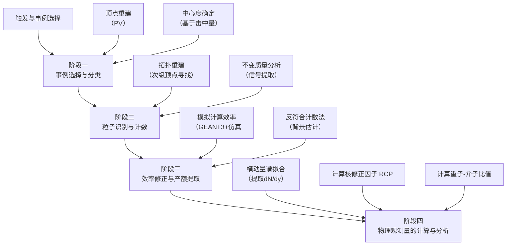

# Strange hadron production in Au+Au collisions at sNN =7.7, 11.5, 19.6, 27, and 39 GeV

**URL**: https://www.semanticscholar.org/paper/d2ba8ee033c87a13cd11866eed2de7a11c16a5e9
**提交日期**: 2019-06-09
**作者**: S. Adam; L. Adamczyk; J. Adams; J. K. Adkins; G. Agakishiev; M. Aggarwal; Z. Ahammed; I. Alekseev; D. Anderson; R. Aoyama; A. Aparin; D. Arkhipkin; E. Aschenauer; M. U. Ashraf; F. Atetalla; A. Attri; G. S. Averichev; V. Bairathi; K. Barish; A. Bassill; A. Behera; R. Bellwied; A. Bhasin; A. Bhati; J. Bielcik; J. Bielčíková; L. Bland; I. Bordyuzhin; J. Brandenburg; A. Brandin; J. Bryslawskyj; I. Bunzarov; J. Butterworth; H. Caines; M. S'anchez; D. Cebra; I. Chakaberia; P. Chaloupka; B. Chan; F. Chang; Z. Chang; N. Chankova-Bunzarova; A. Chatterjee; S. Chattopadhyay; J. Chen; X. Chen; J. Cheng; M. Cherney; W. Christie; H. Crawford; M. Csan'ad; S. Das; T. Dedovich; I. Deppner; A. Derevschikov; L. Didenko; C. Dilks; X. Dong; J. Drachenberg; J. Dunlop; T. Edmonds; N. Elsey; J. Engelage; G. Eppley; R. Esha; S. Esumi; O. Evdokimov; J. Ewigleben; O. Eyser; R. Fatemi; S. Fazio; P. Federic; J. Fedorišin; Y. Feng; P. Filip; E. Finch; Y. Fisyak; L. Fulek; C. Gagliardi; T. Galatyuk; F. Geurts; A. Gibson; K. Gopal; D. Grosnick; A. Gupta; W. Guryn; A. Hamad; Ahmed M. Hamed; J. Harris; L. He; S. Heppelmann; N. Herrmann; L. Holub; Y. Hong; S. Horvat; B. Huang; H. Huang; S. Huang; T. Huang; X. Huang; T. Humanic; P. Huo; G. Igo; W. Jacobs; C. Jena; A. Jentsch; J. Y.; J. Jia; K. Jiang; S. Jowzaee; X. Ju; E. Judd; S. Kabana; S. Kagamaster; D. Kalinkin; K. Kang; D. Kapukchyan; K. Kauder; H. Ke; D. Keane; A. Kechechyan; M. Kelsey; Y. Khyzhniak; D. Kikoła; C. Kim; T. Kinghorn; I. Kisel; A. Kisiel; M. Kocan; L. Kochenda; L. Kosarzewski; L. Kramárik; P. Kravtsov; K. Krueger; N. Mudiyanselage; Lokesh Kumar; R. K. Elayavalli; J. Kwasizur; R. Lacey; J. Landgraf; J. Lauret; A. Lebedev; R. Lednický; J. Lee; C. Li; W. Li; X. Li; Y. Li; Y. Liang; R. Licenik; T. Lin; A. Lipiec; M. Lisa; F. Liu; H. Liu; P. Liu; T. Liu; X. Liu; Y. Liu; Z. Liu; T. Ljubičić; W. Llope; M. Lomnitz; R. Longacre; S. Luo; X. Luo; G. Ma; L. Ma; R. Ma; Y. Ma; N. Magdy; R. Majka; D. Mallick; S. Margetis; C. Markert; H. Matis; O. Matonoha; J. Mazer; K. Meehan; J. Mei; N. Minaev; S. Mioduszewski; D. Mishra; B. Mohanty; M. Mondal; I. Mooney; Z. Moravcova; D. Morozov; M. Nasim; K. Nayak; J. Nelson; D. Nemes; M. Nie; G. Nigmatkulov; T. Niida; L. Nogach; T. Nonaka; G. Odyniec; A. Ogawa; K. Oh; S. Oh; V. Okorokov; B. Page; R. Pak; Y. Panebratsev; B. Pawlik; D. Pawłowska; H. Pei; C. Perkins; R. L. Pint'er; J. Pluta; J. Porter; M. Posik; N. Pruthi; M. Przybycien; J. Putschke; A. Quintero; S. Radhakrishnan; S. Ramachandran; R. Ray; R. Reed; H. Ritter; J. Roberts; O. Rogachevskiy; J. Romero; L. Ruan; J. Rusnak; O. Rusňáková; N. Sahoo; P. Sahu; S. Salur; J. Sandweiss; J. Schambach; W. Schmidke; N. Schmitz; B. Schweid; F. Seck; J. Seger; M. Sergeeva; R. Seto; P. Seyboth; N. Shah; E. Shahaliev; P. Shanmuganathan; M. Shao; F. Shen; W. Shen; S. Shi; Q. Shou; E. Sichtermann; S. Siejka; R. Sikora; M. Simko; J. Singh; S. Singha; D. Smirnov; N. Smirnov; W. Solyst; P. Sorensen; H. Spinka; B. Srivastava; T. Stanislaus; M. Stefaniak; D. Stewart; M. Strikhanov; B. Stringfellow; A. Suaide; T. Sugiura; M. Šumbera; B. Summa; X. Sun; Y. Sun; B. Surrow; D. Svirida; P. Szymanski; A. Tang; Z. Tang; A. Taranenko; T. Tarnowsky; J. Thomas; A. Timmins; D. Tlustý; T. Todoroki; M. Tokarev; C. Tomkiel; S. Trentalange; R. Tribble; P. Tribedy; S. Tripathy; O. Tsai; B. Tu; Z. Tu; T. Ullrich; D. Underwood; I. Upsal; G. Buren; J. Vanek; A. Vasiliev; I. Vassiliev; F. Videbaek; S. Vokál; S. Voloshin; F. Wang; G. Wang; P. Wang; Y. Wang; J. Webb; L. Wen; G. Westfall; H. Wieman; S. Wissink; R. Witt; Y. Wu; Z. Xiao; G. Xie; W. Xie; H. Xu; N. Xu; Q. Xu; Y. Xu; Z. Xu; C. Yang; Q. Yang; S. Yang; Y. Yang; Z. Yang; Z. Ye; L. Yi; K. Yip; I. Yoo; H. Zbroszczyk; W. Zha; D. Zhang; L. Zhang; S. Zhang; X. Zhang; Y. Zhang; Z. Zhang; J. Zhao; C. Zhong; C. Zhou; X. Zhu; Z. Zhu; M. Zurek; M. Zyzak
**引用次数**: 58
使用模型: ep-20251112215738-bz78g

## 1. 核心思想总结
好的，这是一份根据您提供的论文标题、摘要和引言部分整理的第一轮总结。

**论文第一轮总结**

**标题：** 在质心能量为7.7, 11.5, 19.6, 27和39 GeV的Au+Au碰撞中奇异强子的产生

**1. Background (背景)**
本研究隶属于美国布鲁克海文国家实验室相对论重离子对撞机（RHIC）的“束流能量扫描（BES）计划”。该计划的核心科学目标是通过系统性地改变对撞能量，来寻找和研究核物质相图上的关键区域，特别是从退禁闭的夸克胶子等离子体（QGP）相到强子相的相变边界，以及可能存在的临界点。奇异强子的产生被认为是探测QGP形成及其特性的灵敏探针。

**2. Problem (研究问题)**
在BES计划涵盖的低能量区域（sNN = 7.7 - 39 GeV），关于奇异强子产生的系统性实验数据尚不完善。关键的科学问题包括：在什么对撞能量下，QGP特有的集体行为（如高横动量粒子的压低、重子-介子增强等）会开始出现或消失？奇异强子的产生规律是否随对撞能量发生系统性变化，从而揭示出强子物质性质的改变？这些测量对于约束理论模型、确定相图上的关键坐标至关重要。

**3. Method (high-level) (高层次方法)**
实验使用STAR探测器，测量了在不同对撞能量（7.7, 11.5, 19.6, 27, 39 GeV）和不同对撞中心度（从边缘对撞到中心对撞）的Au+Au碰撞中，在中间快度区（|y| < 0.5）产生的多种奇异强子（K0S, Λ, Λ̄, Ξ-, Ξ+, Ω-, Ω+, φ）的产额和运动学分布。分析的核心方法包括：
*   测量横动量谱、平均横质量、总产额。
*   计算反重子/重子比值以检验热统计模型，并提取化学冻出时的热力学参数。
*   计算核修正因子和重子-介子比值，以研究碰撞能量和中心度依赖性的变化。

**4. Contribution (主要贡献)**
*   **关键发现：** 论文提供了BES能量区间内最完整的奇异强子产生数据。最重要的发现是，在低于19.6 GeV的能量下，K0S的核修正因子不再显示压制效应，同时中间横动量区域的重子-介子增强现象也消失了。
*   **核心结论：** 这些观测强烈表明，在对撞能量低于19.6 GeV时，支配奇异夸克动力学的基本机制发生了改变。这为QGP可能不再形成或其特征变得不显著的临界能量区域提供了关键的实验证据。
*   **数据价值：** 所呈现的丰富数据为检验和发展关于强相互作用物质相结构的各种理论模型提供了精确的基准。

## 2. 方法详解
好的，基于您提供的初步总结和论文方法章节的内容，以下是对该论文方法细节的详细说明。

### **论文方法细节详述**

本论文的实验方法是一套在核-核碰撞实验中测量粒子产额的标准化、高精度的分析流程。其核心目标是**从复杂的探测器信号中，准确地识别、统计并归一化各种奇异强子，最终得到其产额随碰撞能量和中心度的变化规律**。

#### **一、 关键创新与核心思路**

本研究的创新性不在于发明全新的算法，而在于**将成熟的粒子物理分析技术系统性地应用于RHIC束流能量扫描（BES）这一独特物理窗口**。其核心思路的独特之处在于：

1.  **能量系统性**： 在五个不同的对撞能量（7.7, 11.5, 19.6, 27, 39 GeV）下执行完全一致的分析流程，确保了数据点的可比性，这对于寻找物理行为的阈值（如QGP形成的临界能量）至关重要。
2.  **粒子系统性**： 同时分析从介子（K⁰S, φ）到单奇异重子（Λ, Λ̄）再到双奇异重子（Ξ⁻, Ξ⁺）和三奇异重子（Ω⁻, Ω⁺）的完整谱系。这允许研究奇异度对粒子产生机制的影响。
3.  **观测量组合**： 不仅测量基本的横动量谱和产额，还通过计算**核修正因子（RCP）** 和**重子-介子比值（如Λ/K⁰S）** 等衍生观测量，来放大和揭示潜在的集体效应和能量损失机制。

#### **二、 算法/架构细节与关键步骤**

整个分析流程可以概括为以下四个关键阶段，其整体架构与流程如下图所示：

接下来，我们对每个阶段进行详细说明：

**阶段一：事例选择与分类**
*   **触发与事例选择**： 实验使用最低偏置触发器，确保采集到的碰撞事例是随机的、无偏的，能够代表整个碰撞过程。
*   **顶点重建**： 首先需要重建每次碰撞的初级顶点（Primary Vertex, PV）。这是通过拟合所有带电粒子径迹的交点来实现的。精确的顶点位置是所有后续粒子径迹重建的基础。分析会筛选顶点在束流方向与探测器中心足够接近的事例，以保证探测器的接受度均匀。
*   **中心度确定**： 这是重离子碰撞分析的关键步骤。**核心算法**是：利用时间投影室（TPC）等探测器在远离碰撞点的区域（即零度量能器）测量的带电粒子多重数或能量。将测量到的分布与蒙特卡洛（Glauber模型）模拟的几何碰撞参数分布进行关联，将实验数据分为不同的中心度等级（如0-5%， 5-10%， ..., 60-80%）。这实质上是将碰撞按“对心”程度从中心（头对头）到边缘（擦边）进行分类。

**阶段二：粒子识别与计数**
这是方法的核心，主要基于**次级顶点重建**和**不变质量分析**。
*   **拓扑重建（针对次级衰变粒子）**： 对于Λ, Ξ, Ω等弱衰变粒子，它们飞行一段距离后才衰变。分析算法会寻找特定的“V0”或“级联”衰变拓扑：
    *   **K⁰S, Λ, Λ̄**： 通过寻找带相反电荷的粒子对（如p + π⁻ 对于Λ），它们的径迹在初级顶点外某点（次级顶点）相交，且该点与初级顶点有显著距离。
    *   **Ξ⁻, Ω⁻**： 采用“级联”衰变重建。例如，Ξ⁻ → Λ + π⁻， 而Λ → p + π⁻。算法先找到一个Λ候选者，然后寻找一个π⁻径迹与该Λ的衰变顶点相交，形成Ξ的次级顶点。
*   **不变质量分析**： 对于每个找到的候选粒子对/组合，根据其动量（通过径迹曲率在磁场中计算）和已知的粒子质量，计算其不变质量。**关键步骤**是：将所有候选者的不变质量进行统计，会得到一个分布图。在目标粒子的已知质量附近会出现一个峰，这就是**信号**；峰下面的平滑背景来自于随机组合的非关联粒子。通过拟合（如多项式拟合背景，高斯函数拟合信号峰）可以精确统计出该粒子的净计数。

**阶段三：效率修正与产额提取**
原始计数远小于实际产生的粒子数，因为探测器存在探测效率、几何接受度以及重建算法效率等问题。
*   **效率计算**： 采用**蒙特卡洛模拟**方法。使用GEANT3等工具模拟整个探测器响应。将大量模拟产生的目标粒子（其种类、动量、产额分布与真实数据相似）嵌入到真实的背景事例中，然后使用与真实数据分析**完全相同的重建算法**进行处理。**效率（ε）** 定义为成功重建的模拟粒子数与注入的模拟粒子数之比。效率是粒子种类、横动量（pT）、快度（y）和碰撞中心度的函数。
*   **背景估计与修正**： 对于不变质量谱中的非物理背景，采用**事件混合**或**旋转**等技术来估计。即从不同的事件中随机抽取粒子径迹进行组合，模拟随机背景的分布，从而更准确地从信号峰中扣除背景。
*   **产额提取**： 最终的单事例微分产额由以下公式给出：
    `(1/N_evt) * d²N / (dy dpT) = (1/(2π pT)) * (1/N_evt) * d²N / (dy dpT) = (1 / (2π pT)) * (1/N_evt) * (Raw Counts / (ε * ∆y * ∆pT))`
    其中，N_evt是对应中心度下的事例数，Raw Counts是净计数，ε是总效率，∆y和∆pT是快度和横动量的区间宽度。

**阶段四：物理观测量的计算与分析**
*   **横动量谱拟合**： 将测量到的微分产额dN/(2π pT dpT dy)与理论模型（如Blast-Wave模型）进行拟合，可以提取平均横动量（〈pT〉）和总产额dN/dy等物理量。
*   **核修正因子（RCP）**： 这是一个关键的观测量，用于研究碰撞介质效应。其定义为：
    `RCP = [ (d²N / (N_evt dpT dy) )^{Central} / (N_coll^{Central}) ] / [ (d²N / (N_evt dpT dy) )^{Peripheral} / (N_coll^{Peripheral}) ]`
    其中，N_coll是平均核子-核子碰撞数，由Glauber模型计算得到。RCP ≈ 1 表示没有核介质效应；RCP > 1 表示增强；RCP < 1 表示压制。
*   **粒子比值**： 如Λ̄/Λ（用于研究重子数密度）、Ξ⁻/Ξ⁺（用于研究奇异度输运）、Ω⁻/Ω⁺以及Λ/K⁰S, Ξ⁻/π⁻等。这些比值可以与热统计模型（如THERMUS）的预言进行比较，以提取化学冻出温度、重子化学势等热力学参数。

#### **三、 整体流程总结**

整个方法流程是一个严谨的“数据还原-物理提取”管道：从**原始信号**（探测器击中）出发，通过**事例筛选**和**顶点重建**确定分析对象，利用**拓扑识别和不变质量分析**从海量背景中提取出稀有的奇异粒子信号，再经过**全面的效率与背景修正**得到真实的物理产额，最后通过计算**核修正因子和粒子比值**等衍生观测量，揭示出碰撞能量和中心度依赖的深刻物理规律，最终为回答QGP的相变边界这一核心科学问题提供了坚实的数据基础。

## 3. 最终评述与分析
好的，基于您提供的论文标题、摘要、引言、方法细节以及结论部分，以下是这份论文的最终综合评估。

### **关于Au+Au碰撞中奇异强子产生的综合评估**

**1. Overall Summary (总体摘要)**

本论文系统地报告了在美国RHIC相对论重离子对撞机的束流能量扫描（BES）计划中，利用STAR探测器在质心能量为7.7、11.5、19.6、27和39 GeV的Au+Au碰撞中，测量多种奇异强子（K⁰S, Λ, Λ̄, Ξ⁻, Ξ⁺, Ω⁻, Ω⁺, φ）产生的实验结果。研究的核心目标是探寻从退禁闭的夸克胶子等离子体（QGP）相到强子相的相变边界。论文通过分析粒子的横动量谱、核修正因子（RCP）以及重子-介子比值等关键观测量，发现**在能量低于19.6 GeV时，与QGP形成相关的高横动量粒子压制效应和重子-介子增强现象显著减弱或消失**。这一发现强烈表明，**在√sNN = 19.6 GeV附近可能存在一个临界能量点，标志着QGP特有的集体行为不再占据主导地位**，为绘制核物质相图提供了至关重要的实验依据。

**2. Strengths (优势)**

*   **系统性与完整性**： 论文最大的优势在于其无与伦比的系统性。它覆盖了BES关键能量区间的五个离散能量点，并分析了从介子到三奇异重子的完整粒子谱，提供了该领域迄今为止最全面、一致的数据集。
*   **物理观测量选择的敏锐性**： 所选择的观测量（如中心度依赖的RCP和Λ/K⁰S比值）极具物理洞察力。这些量能有效放大和揭示集体效应和能量损失机制，而非简单地呈现粒子产额，使能量阈值的判断更为清晰和具有说服力。
*   **方法论严谨可靠**： 分析方法基于高能核物理实验的成熟、标准流程（如拓扑重建、不变质量分析、全面的效率与背景修正），确保了数据的可靠性和高精度。这为与理论模型进行定量比较奠定了坚实可信的基础。
*   **明确的物理结论**： 论文没有停留在数据展示层面，而是基于清晰的物理图像（QGP特征信号的消失）得出了强有力的结论，直接回应了BES计划的核心科学问题，具有很高的科学价值。

**3. Weaknesses / Limitations (弱点/局限性)**

*   **观测的间接性**： 论文的结论建立在“QGP特征信号”的消失这一间接证据上。它并未直接探测或证明一种新的物质形态（如强子相）的存在，而是通过已知效应的衰减来推断QGP的不存在或性质改变。这需要与其他观测量（如集体流、涨落等）结合才能构成更完整的证据链。
*   **能量点覆盖的局限性**： 尽管覆盖了关键能量区域，但五个能量点仍然相对稀疏。在19.6 GeV以下仅有7.7和11.5 GeV两个点，这虽然足以指示趋势，但更精确地确定临界能量可能需要更密集的能量扫描数据。
*   **理论模型依赖**： 对结果的解释在一定程度上依赖于理论框架。例如，RCP的基准值（=1）是基于初态核效应（如Cronin增强）和末态强子散射等模型假设。虽然Glauber模型被广泛接受，但其在极低能量下的适用性仍存在不确定性。
*   **探测器的接受度和效率限制**： 尽管经过了仔细修正，但在极低横动量（pT）区域，探测器的接受度和重建效率较低，数据精度会下降。此外，对于像Ω这样产额极低的粒子，统计误差较大，限制了其在低能区进行精细区分的能力。

**4. Potential Applications / Implications (潜在应用/意义)**

*   **约束QCD相图与理论模型**： 本论文提供的精确、系统数据是检验和发展各种理论模型（如流体动力学模型、输运模型、统计模型）的“试金石”。理论家可以利用这些数据来校准模型参数，特别是重子化学势（μB）区域的物态方程，从而精确确定相变边界和可能存在的临界点。
*   **指引未来实验方向**： 该研究明确指出了√sNN ~ 20 GeV是物理性质发生变化的关键区域。这为未来实验（如RHIC的BES-II阶段、FAIR和NICA等装置）的重点扫描能量区间提供了明确的实验依据，鼓励在这些能量点进行更深入、更全面的测量。
*   **深化对强相互作用物质的理解**： 研究结果不仅关乎相变，还揭示了在核物质密度极高的条件下，奇异夸克的产生和输运机制如何随能量演化。这对于理解QCD物质在非微扰区域的性质具有重要意义。
*   **为天体物理提供参考**： 高重子密度下的核物质性质与中子星内部等极端天体环境密切相关。本研究在有限温度和高重子化学势区域获得的数据，可以为理解中子星的结构、状态方程等天体物理问题提供实验室层面的约束和参考。

**总结论**： 本论文是一项高质量、高影响力的实验研究。它通过严谨的方法和系统的测量，为理解高重子密度区QCD相结构提供了关键的实验证据，是BES计划中的里程碑式成果。其数据将成为该领域未来多年理论研究和实验分析的重要基准。

