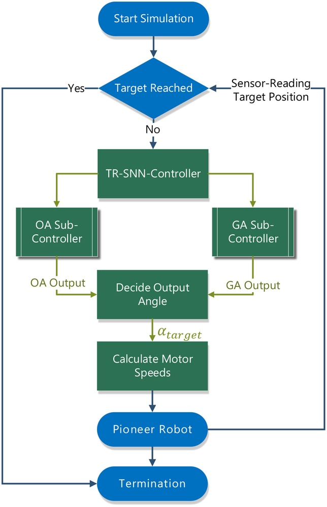
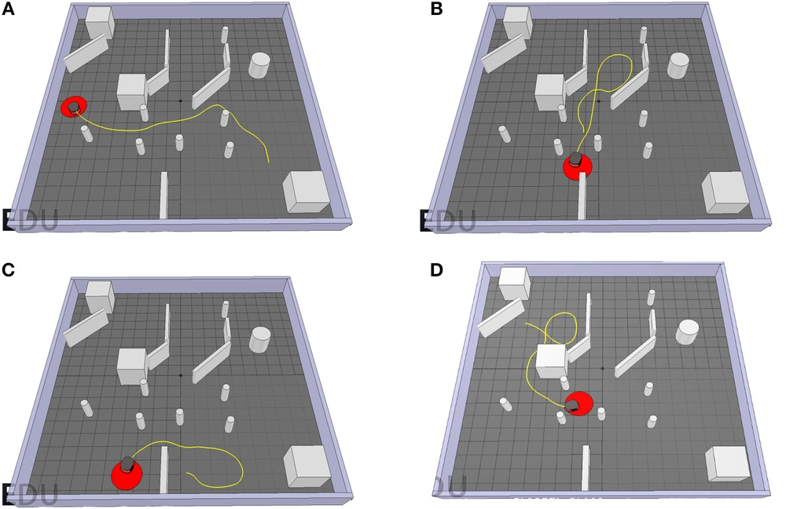
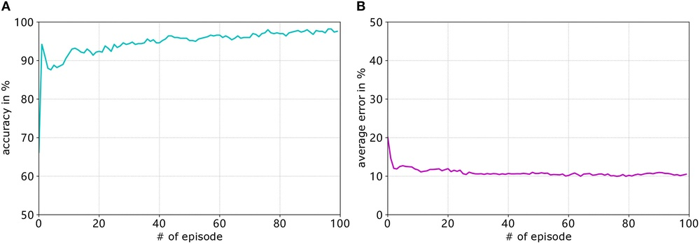
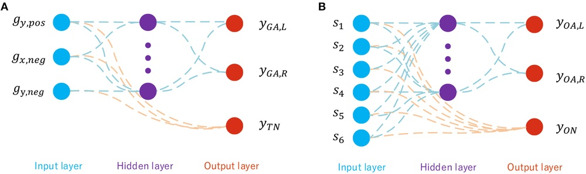
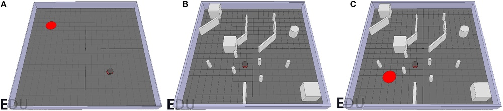
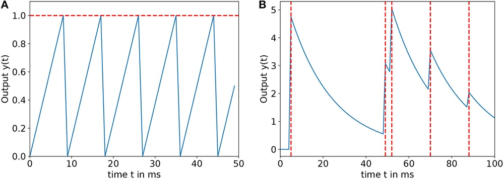
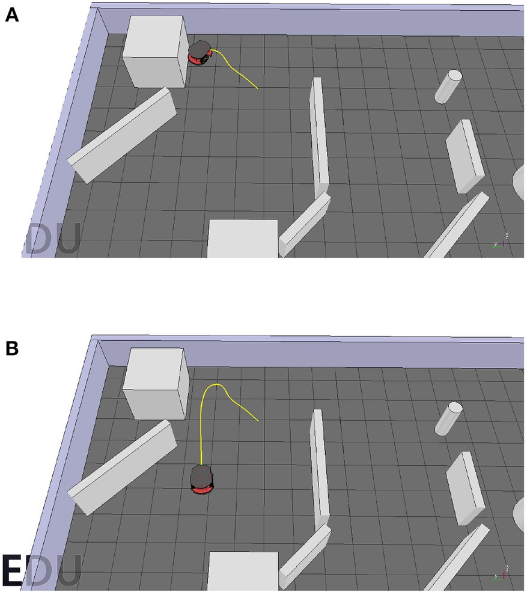
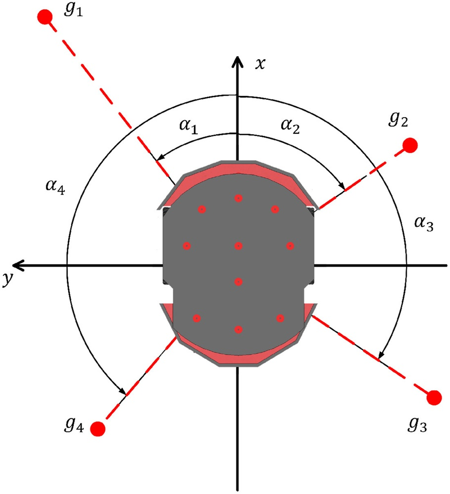
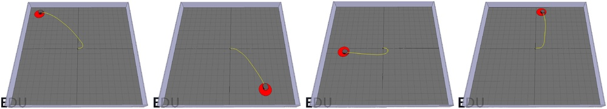
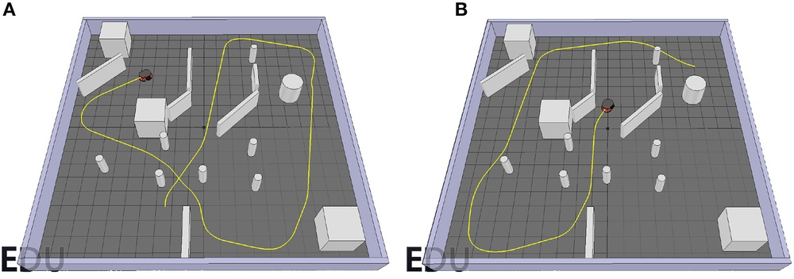

# Supervised Learning in SNN via Reward-Modulated Spike-Timing-Dependent Plasticity for a Target Reaching Vehicle

**URL**: https://www.semanticscholar.org/paper/effe5bd4e2d78249f982090860dbda152ad43e5a
**提交日期**: 2019-05-03
**作者**: Zhenshan Bing; Ivan Baumann; Zhuangyi Jiang; Kai Huang; Caixia Cai; A. Knoll
**引用次数**: 36
使用模型: ep-20251112215738-bz78g

## 1. 核心思想总结
这是一份根据您提供的标题、摘要和引言信息整理的第一轮总结：

**标题：** 基于奖赏调制脉冲时序依赖可塑性的监督学习在SNN中实现目标到达车辆控制

**第一轮总结**

*   **1. Background**
    脉冲神经网络（SNN）相比传统人工神经网络（ANN）具有生物合理性、信息处理速度快和能量效率高等优势。SNN常利用脉冲时序依赖可塑性（STDP）规则解决各种控制任务。然而，现有的SNN解决方案通常采用针对特定任务硬编码的网络架构，缺乏通用性。

*   **2. Problem**
    现有基于SNN的解决方案往往为特定任务定制网络结构，这忽略了ANN的一个主要优点：即由于其简单的标准架构（通常为输入层、隐藏层和输出层）而具备的通用性和易用性。因此，需要一种更通用的、端到端的SNN学习方法来解决不同类型的任务。

*   **3. Method (high-level)**
    本文提出了一种端到端的SNN学习框架。该网络采用标准的三层全连接架构（一个隐藏层）。学习方法上，采用了**监督式的奖赏调制STDP（R-STDP）** 规则。具体而言，该方法训练了两个基于SNN的子控制器，通过模仿预生成数据集中的行为，分别学习避障和目标接近。这两个控制器最终组合成一个目标到达控制器，用于驱动机器人仿真模型。

*   **4. Contribution**
    本文的主要贡献在于提出并验证了一个基于标准三层架构和R-STDP学习规则的、通用的SNN端到端监督学习框架。实验结果表明，该方法训练出的SNN控制器能够有效地在未知场景中完成目标到达任务（同时实现避障和目标接近）。

## 2. 方法详解
根据您提供的初步总结和论文方法章节内容，以下是该论文方法的详细说明，重点描述了关键创新、算法/架构细节、关键步骤与整体流程。

### 方法详细说明

本论文提出了一种用于脉冲神经网络（SNN）的通用端到端监督学习框架，旨在解决车辆控制中的目标到达任务。该方法的核心创新在于将**监督学习**与**奖赏调制脉冲时序依赖可塑性（R-STDP）** 相结合，并采用标准的三层网络架构，以实现通用性和高效学习。

#### 一、 关键创新

1.  **监督式R-STDP学习规则**：这是本方法最核心的创新点。传统的R-STDP通常用于强化学习场景，通过全局奖赏信号来调制STDP的权重更新方向。本文将其改造用于监督学习。具体做法是，**将期望输出与实际输出之间的误差转化为一个模拟的“奖赏”信号**。这个奖赏信号进而调制STDP的更新过程，使得网络权重朝着减少误差的方向演化，从而实现了基于误差反馈的监督学习机制。
2.  **标准化的通用网络架构**：与许多为特定任务定制结构的SNN研究不同，本文坚持使用简单的标准三层全连接架构（输入层-隐藏层-输出层）。这证明了即使是简单的SNN结构，在搭配先进的学习规则后，也能解决复杂的端到端控制任务（从感知到动作），提升了SNN的通用性和易用性。
3.  **分治式的训练策略**：将复杂的目标到达任务分解为两个更基础的子任务——**避障** 和**目标接近**。分别为这两个子任务训练独立的SNN子控制器，最后将它们集成一个统一的控制器。这种策略降低了单个网络的学习难度，提高了训练效率和稳定性。

#### 二、 算法/架构细节

**1. 网络架构**
*   **拓扑结构**：标准的三层全连接网络。
    *   **输入层**：神经元数量由预处理后的传感器数据维度决定。例如，激光雷达数据被编码为脉冲序列。
    *   **隐藏层**：使用泄漏积分发放（LIF）神经元模型，负责处理输入脉冲并提取特征。
    *   **输出层**：同样使用LIF神经元。对于目标接近控制器，输出层可能只有2个神经元，分别控制车辆的前进和转向（或左转/右转）；对于避障控制器，输出可能也是类似的运动控制命令。
*   **编码方式**：采用**频率编码**，即输入信息的强度（如障碍物距离的远近、目标方向的角度）被转换为输入神经元发放脉冲的频率。信息越强，脉冲频率越高。

**2. 核心学习算法：监督式R-STDP**
STDP规则是SNN无监督学习的基础，它根据突触前和突触后神经元脉冲的时序来调整连接权重。其基本形式可简化为：
*   如果突触前神经元脉冲早于突触后神经元脉冲（因果关系），则权重增强（长时程增强，LTP）。
*   如果突触前神经元脉冲晚于突触后神经元脉冲（反因果关系），则权重减弱（长时程抑制，LTD）。

本文的**监督式R-STDP**在此基础上引入了一个调制信号 `R(t)`（奖赏），其权重更新公式可以概括为：
`ΔW = R(t) * STDP(Pre_spike, Post_spike)`

关键在于 `R(t)` 的生成：
*   **监督信号来源**：在训练每个子控制器时，会有一个预生成的专家数据集（例如，由传统算法或人工演示生成的{传感器输入，理想控制输出}对）。
*   **奖赏计算**：在每个训练时间步，将SNN的实际输出与数据集中对应的期望输出进行比较，计算误差（如均方误差）。然后，将该误差映射为一个奖赏值 `R(t)`。一种常见的映射是：当实际输出接近期望输出时，`R(t)` 为正数（鼓励当前的STDP更新）；当误差很大时，`R(t)` 为负数（抑制或反转当前的STDP更新）。

通过这种方式，误差信号指导了STDP的“好坏”，使网络学习模仿专家的行为。

#### 三、 关键步骤与整体流程

整个方法的流程可以分为三个阶段：**数据准备与预处理**、**子控制器训练**、**集成与控制**。

**阶段一：数据准备与预处理**
1.  **专家数据生成**：为两个子任务分别生成训练数据集。
    *   **避障数据集**：在多种有障碍物的仿真环境中，记录传感器读数（如激光雷达点云）以及此时能成功避开障碍物的最优控制命令。
    *   **目标接近数据集**：在无障碍物的环境中，记录传感器读数以及能高效朝向目标移动的控制命令。
2.  **数据编码**：将数据集中的连续值传感器数据和控-制命令转换为适合SNN输入的脉冲序列（使用频率编码等方式）。

**阶段二：子控制器训练（并行或顺序进行）**
1.  **训练避障控制器**：
    *   将避障数据集中的传感器脉冲序列输入到**一个独立的三层SNN**中。
    *   使用监督式R-STDP规则进行训练。将网络输出的控制脉冲序列与数据集中的专家控制命令进行比较，生成奖赏信号 `R(t)`，进而调制STDP更新网络权重。
    *   训练目标是使SNN在遇到障碍物时，能产生与专家数据相似的避障动作。
2.  **训练目标接近控制器**：
    *   过程与避障控制器训练完全相同，但使用目标接近数据集。
    *   训练目标是使SNN能够引导车辆朝向目标移动。

**阶段三：集成与控制**
1.  **控制器集成**：将训练好的两个SNN子控制器集成到一个统一的框架中。集成策略通常是**加权融合**或**仲裁机制**。例如：
    *   当车辆前方近距离内没有障碍物时，主要听从目标接近控制器的指令。
    *   当检测到障碍物时，避障控制器的输出权重增大，优先执行避障动作。
2.  **在线运行**：将集成后的控制器部署到车辆仿真模型上。车辆实时读取环境传感器数据，编码为脉冲，输入到集成控制器中。两个子网络同时处理输入，并根据集成策略产生最终的控制脉冲序列。这些脉冲序列再被解码为具体的车辆控制指令（如速度、转向角），驱动车辆在未知场景中完成目标到达任务。

### 总结
该方法通过将监督学习与生物可塑性规则R-STDP巧妙结合，并采用分治策略和标准网络架构，成功实现了一个高效、通用的SNN端到端学习框架。其核心在于利用误差信号来调制STDP的更新方向，使SNN能够模仿专家行为，从而解决了复杂的车辆控制问题。

## 3. 最终评述与分析
好的，结合前两轮提供的初步总结、方法详述以及最终的结论部分，现为您提供该论文的最终综合评估。

---

### **最终综合评估**

**论文标题：** 基于奖赏调制脉冲时序依赖可塑性的监督学习在SNN中实现目标到达车辆控制

#### 1) 整体总结
本论文提出并验证了一种用于脉冲神经网络（SNN）的通用端到端监督学习框架，旨在解决自主车辆在未知环境中的目标到达任务。该研究的核心创新在于将**监督学习**与生物可塑性规则**奖赏调制STDP（R-STDP）** 相结合，创造性地使用**输出误差作为调制信号**，从而引导SNN学习预定义的专家行为。该方法采用标准的三层全连接网络架构，并通过“分而治之”的策略，先分别训练避障和目标接近两个独立的子控制器，最后将其集成。仿真实验结果表明，该框架能够成功训练出高效的SNN控制器，使车辆在复杂、未知的仿真环境中实现同时避障和目标接近，展现了SNN在解决复杂控制任务上的潜力与通用性。

#### 2) 优势
*   **生物合理性与计算效率的结合**：该方法扎根于SNN和STDP的生物合理性，同时通过引入监督信号，显著提高了学习效率，比纯粹的强化学习或无监督学习更具针对性。
*   **通用性与简单性**：坚持使用标准的三层网络架构，避免了针对特定任务的复杂结构设计，证明了简单SNN模型在强大学习规则下解决复杂任务的潜力，提升了SNN的易用性和通用性。
*   **创新的学习机制**：将R-STDP从强化学习领域成功迁移到监督学习场景，是利用SNN内在特性解决工程问题的一次巧妙实践，为SNN的监督学习提供了新的思路。
*   **有效的分治策略**：将复杂的导航任务分解为避障和目标接近两个子问题，降低了学习难度，提高了训练的稳定性和成功率，并使系统模块化，易于理解和扩展。
*   **良好的仿真性能**：论文结论表明，训练出的控制器在未知环境中表现出色，验证了该框架的有效性和鲁棒性。

#### 3) 劣势 / 局限性
*   **对专家数据的依赖性**：该监督学习框架的性能上限在很大程度上依赖于预生成的专家数据集的质量和完备性。如果专家数据本身存在偏差或未能覆盖所有可能场景，控制器的泛化能力将受到限制。
*   **仿真环境的局限性**：目前的工作仅在仿真环境中进行验证。仿真环境与真实世界存在差距，未考虑真实的传感器噪声、动力学延迟、复杂地形等不确定因素，其在实际机器人平台上的有效性有待进一步检验。
*   **可能存在的集成挑战**：虽然论文提到了控制器集成，但对于两个子控制器输出的融合或仲裁机制（如权重选择逻辑）的具体细节和鲁棒性未深入探讨。在复杂场景下（如目标被障碍物遮挡），集成策略可能面临挑战。
*   **SNN固有挑战**：与其他SNN研究一样，该方法也面临脉冲编码方式选择、超参数（如STDP时间常数、奖赏映射函数）调试敏感等问题，这些因素会影响最终性能，但优化过程可能缺乏理论指导。

#### 4) 潜在应用 / 意义
*   **机器人自主导航**：该框架可直接应用于移动机器人、无人机、自动驾驶车辆等平台的端到端运动控制和导航系统，使其具备在动态未知环境中智能避障和路径规划的能力。
*   **神经形态工程**：由于该方法基于事件驱动的SNN和STDP规则，它非常适合在低功耗的神经形态芯片（如英特尔的Loihi、脑启发的类脑计算硬件）上实现，为开发超低功耗的嵌入式智能控制系统指明了方向。
*   **SNN算法研究**：所提出的“监督式R-STDP”学习规则为SNN社区提供了一种新颖且有效的学习范式，可以激励后续研究将其应用于更广泛的任务中，如图像识别、语音处理等。
*   **脑启发人工智能**：该工作是从脑科学中汲取灵感（SNN、STDP）并将其成功应用于解决实际工程问题的典范，推动了脑科学与人工智能的跨学科融合，为开发新一代受大脑启发的智能算法做出了贡献。

---

# 附录：论文图片

## 图 1

## 图 2

## 图 3

## 图 4

## 图 5

## 图 6

## 图 7

## 图 8

## 图 9

## 图 10

