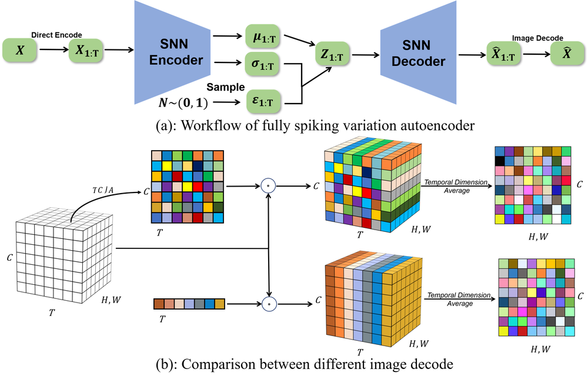
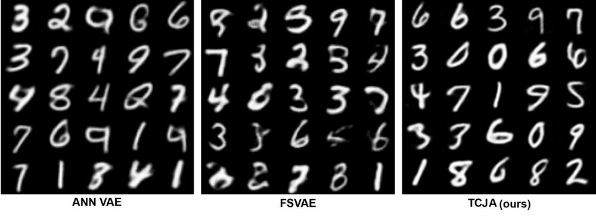
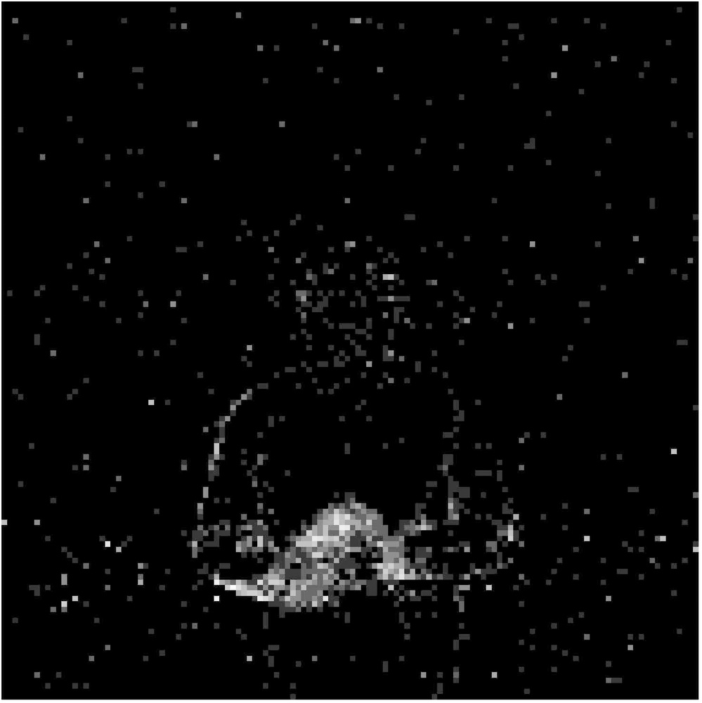
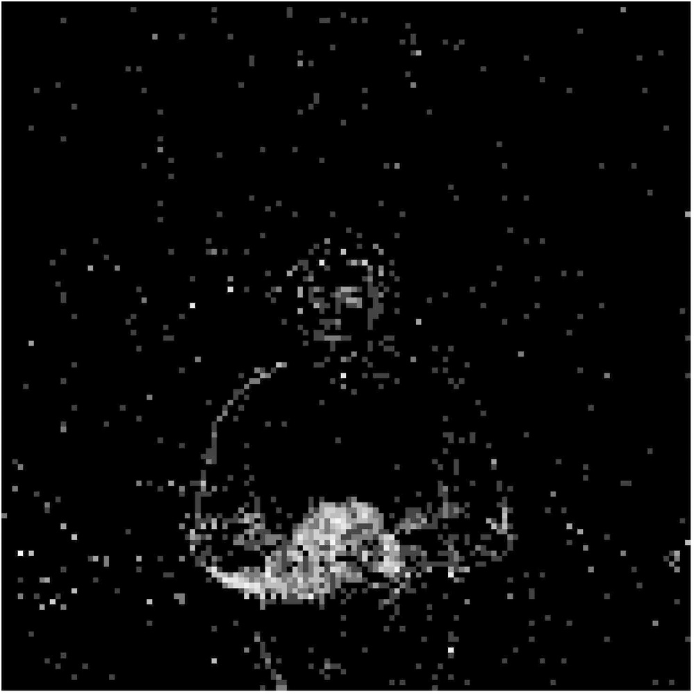
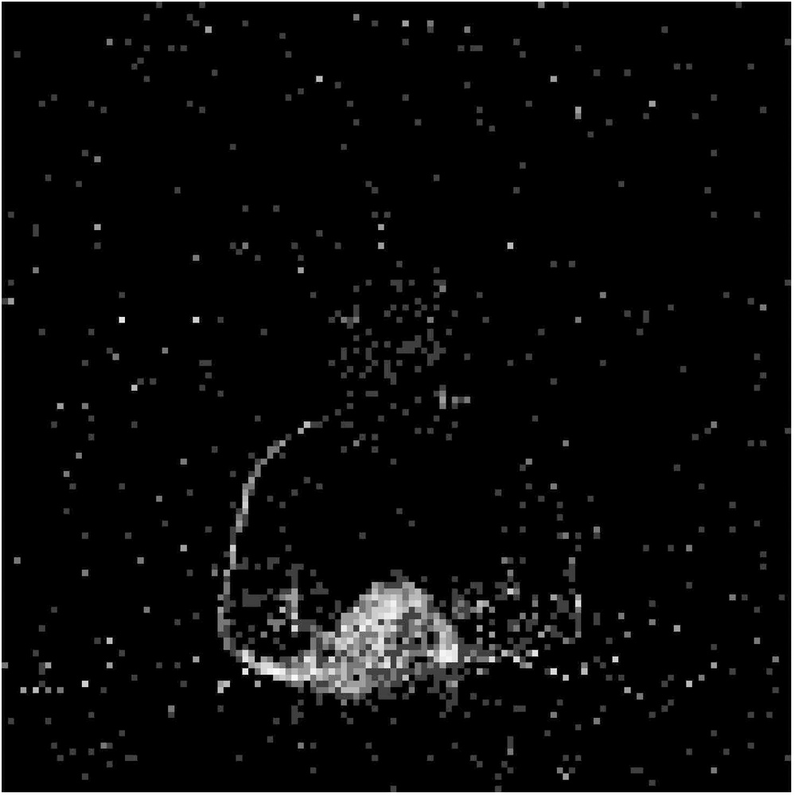
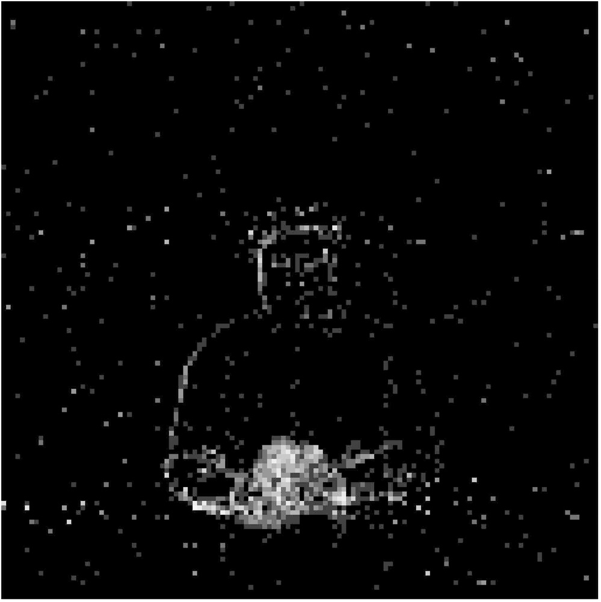
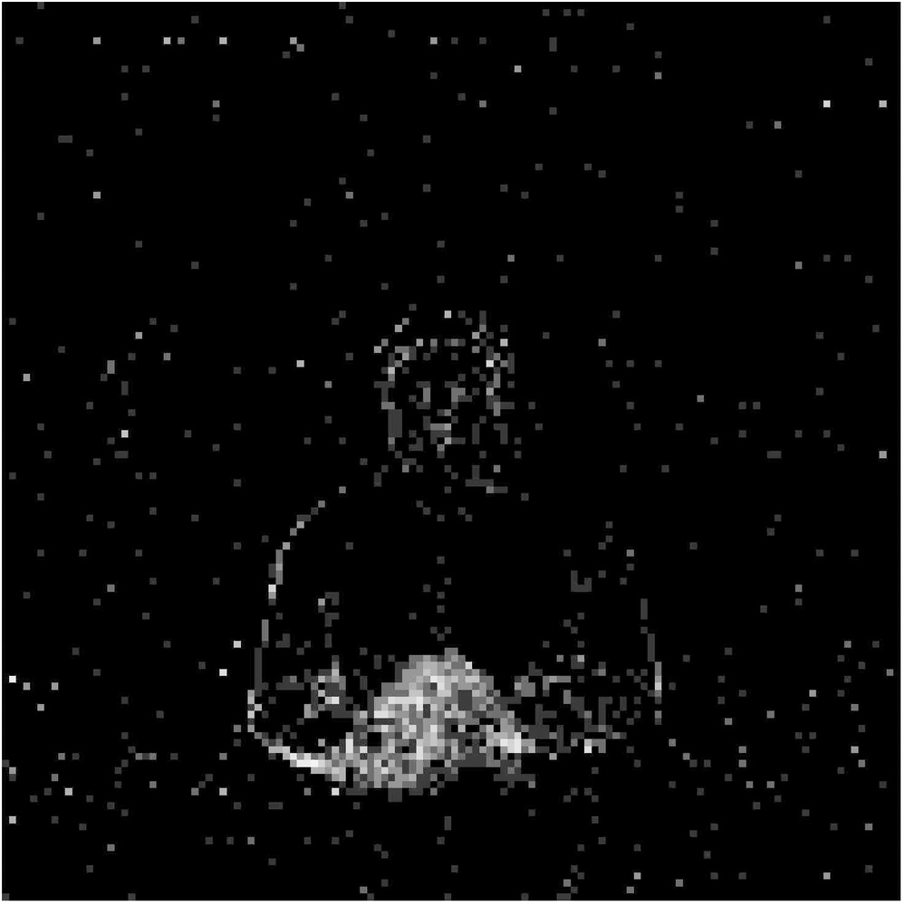

# TCJA-SNN: Temporal-Channel Joint Attention for Spiking Neural Networks

**URL**: https://www.semanticscholar.org/paper/2307cc54494e7738bf5082ebb447ec41b548b9fc
**提交日期**: 2022-06-21
**作者**: Rui Zhu; Qihang Zhao; Tian-Jing Zhang; Haoyu Deng; Yule Duan; Malu Zhang; Liang-Jian Deng
**引用次数**: 74
使用模型: ep-20251112215738-bz78g

## 1. 核心思想总结
好的，这是一份根据您提供的标题、摘要和引言内容整理的第一轮总结，严格遵循四个部分的结构。

### **关于《TCJA-SNN：面向脉冲神经网络的时序-通道联合注意力机制》的第一轮总结**

**1. Background (背景)**
脉冲神经网络因其生物合理性、高能效和强大的时空信息处理能力而受到广泛关注。注意力机制已被证明能有效提升神经网络性能，因此，将注意力机制与SNN结合，有望构建能效与性能俱佳的计算范式。

**2. Problem (问题)**
尽管SNN与注意力机制的结合潜力巨大，但现有的方法在如何有效、统一地建模SNN脉冲序列中时空维度的联合依赖性方面存在不足。具体而言，时序和通道维度特征的处理通常是独立的，缺乏交互，这限制了注意力机制对SNN特征的全面利用。

**3. Method (高层级方法)**
本文提出了一种新颖的时序-通道联合注意力机制，称为TCJA-SNN。其核心方法分为两步：
*   **独立特征提取**：首先使用压缩操作处理脉冲流，然后分别利用基于一维卷积的局部注意力机制，从时序和通道两个维度独立地提取关键特征。
*   **跨维度交互**：引入一个创新的**跨卷积融合层**，该层旨在打破时序和通道维度特征处理的独立性，建模二者之间的相互依赖关系，实现特征间的有效交互。

**4. Contribution (贡献)**
*   **核心贡献**：提出了首个针对SNN的时序-通道联合注意力框架TCJA-SNN，通过跨卷积融合层实现了时空维度的深度交互。
*   **性能优势**：实验表明，TCJA-SNN在多个静态和神经形态数据集上均达到了最先进的性能。
*   **应用拓展**：成功将TCJA-SNN应用于图像生成任务，这是首次将SNN-注意力机制同时用于高级别分类和低级别生成任务，展示了其广泛适用性。

## 2. 方法详解
好的，基于您提供的初步总结和论文方法章节内容，以下是对《TCJA-SNN：面向脉冲神经网络的时序-通道联合注意力机制》一文中方法细节的详细说明。

### **TCJA-SNN 方法细节详解**

TCJA-SNN 的核心创新在于设计了一个统一的、能够显式建模时序与通道维度间相互依赖关系的注意力模块。其整体流程、关键步骤与算法细节如下所述。

#### **一、 整体流程与架构**

TCJA-SNN 模块可以被插入到任何基于循环连接（如PLIF）的脉冲神经网络层之后。其整体工作流程是一个**“分-治-合”** 的过程，如下图所示（图示请根据文字描述理解）：

1.  **输入**： 来自前一层SNN的脉冲序列张量 \( X \in \mathbb{R}^{T \times C \times H \times W} \)，其中 \( T \) 是时间步长，\( C \) 是通道数，\( H \) 和 \( W \) 是空间高度和宽度。
2.  **分治 - 独立特征提取**： 将输入张量分别沿**时序维度**和**通道维度**进行压缩，并利用两个并行的、结构相似的局部注意力分支（时序注意力分支、通道注意力分支）来独立提取各自维度的显著性特征。
3.  **合 - 跨维度交互与融合**： 将两个分支提取的特征通过一个创新的**跨卷积融合层**进行交互，生成一个统一的、包含跨维度依赖关系的注意力图。
4.  **输出**： 将生成的联合注意力图与原始输入 \( X \) 进行逐元素乘法（加权），得到增强后的特征张量，再输入到下一层SNN。

---

#### **二、 关键步骤与算法细节**

##### **步骤一： 独立特征提取（时序与通道分支）**

此步骤旨在从原始脉冲序列中分别提炼出“何时重要”和“何通道重要”的初步信息。

1.  **输入压缩**：
    *   **时序压缩**： 对输入 \( X \) 沿通道维度进行全局平均池化，将形状从 \( [T, C, H, W] \) 压缩为 \( [T, 1, H, W] \)。这一步聚合了所有通道的信息，得到一个代表每个时间步整体活跃度的二维图。
    *   **通道压缩**： 对输入 \( X \) 沿时间维度进行全局平均池化，将形状从 \( [T, C, H, W] \) 压缩为 \( [1, C, H, W] \)。这一步聚合了所有时间步的信息，得到一个代表每个通道整体重要性的二维图。

2.  **局部注意力提取（关键创新之一）**：
    *   **目的**： 传统的全局注意力（如SENet中的全连接层）可能会忽略局部上下文信息。TCJA-SNN采用**一维卷积**来捕获时序/通道维度上的**局部关联性**。
    *   **时序注意力分支**：
        *   将时序压缩后的特征 \( [T, 1, H, W] \) 的每个空间位置 \( (H, W) \) 视为一个独立的、长度为 \( T \) 的一维信号。
        *   应用一个一维卷积层（卷积核大小为 \( k_t \)，填充以保持长度 \( T \)）进行处理。这个卷积操作能够捕捉**时间上的局部模式**（例如，某物体出现是由连续几个时间步的脉冲共同表征的，而非孤立的某一刻）。
        *   输出一个初步的时序注意力图 \( A_t \in \mathbb{R}^{T \times 1 \times H \times W} \)。
    *   **通道注意力分支**：
        *   将通道压缩后的特征 \( [1, C, H, W] \) 的每个空间位置 \( (H, W) \) 视为一个独立的、长度为 \( C \) 的一维信号。
        *   应用一个一维卷积层（卷积核大小为 \( k_c \)，填充以保持长度 \( C \)）进行处理。这个卷积操作能够捕捉**通道间的局部依赖**（例如，某些功能相似的通道其重要性是相关的）。
        *   输出一个初步的通道注意力图 \( A_c \in \mathbb{R}^{1 \times C \times H \times W} \)。
    *   **优势**： 一维卷积比全连接层参数更少，效率更高，且能更好地保持局部相关性。

##### **步骤二： 跨维度交互与融合（核心创新）**

这是TCJA-SNN最具创新性的部分，旨在解决时序和通道注意力被孤立处理的问题。

1.  **问题**： 步骤一中得到的 \( A_t \) 和 \( A_c \) 是独立的，它们分别只反映了单一维度的信息。但实际中，“某个特定通道的重要性可能只在某几个关键时间步才凸显”（例如，一个用于检测“猫胡须”的通道，只在猫脸出现的几个时间步内重要）。
2.  **解决方案：跨卷积融合层**：
    *   **交互操作**：
        *   将时序注意力图 \( A_t \in \mathbb{R}^{T \times 1 \times H \times W} \) 和通道注意力图 \( A_c \in \mathbb{R}^{1 \times C \times H \times W} \) 进行**逐元素相加**，得到一个初步融合的特征图 \( F \in \mathbb{R}^{T \times C \times H \times W} \)。
        *   **然而，简单的相加不足以建模复杂的交互关系。**
    *   **核心创新：跨维度卷积**：
        *   对融合后的特征图 \( F \)，应用一个特殊的**二维卷积**层，其卷积核尺寸为 \( (k_{ct}, k_{cc}) \)。
        *   **此处的关键**： 这个卷积核**同时在时序（T）和通道（C）两个维度上进行滑动和计算**。这意味着，对于特征图 \( F \) 中的每一个点，其新值的计算会同时考虑其**邻近的几个时间步**和**邻近的几个通道**的特征。
        *   **物理意义**： 这个操作显式地建立了一个“时序-通道”联合空间中的局部模型。卷积核学习到的权重，本质上就是**时序和通道维度间相互依赖关系的参数化表示**。例如，它可以学习到“当时间步t-1, t, t+1的脉冲都很活跃时，通道c的重要性会显著增加”这样的复杂模式。
    *   **输出**： 经过跨卷积融合层和非线性激活函数（如Sigmoid）后，生成最终的**时序-通道联合注意力图** \( A_{joint} \in \mathbb{R}^{T \times C \times H \times W} \)。这个图每个元素的值在0到1之间，表示对应时间、通道、空间位置的综合重要性权重。

##### **步骤三： 注意力加权输出**

将联合注意力图 \( A_{joint} \) 与原始输入脉冲序列 \( X \) 进行逐元素相乘：
\[
Y = A_{joint} \odot X
\]
其中 \( \odot \) 表示逐元素乘法。这一操作相当于对原始的脉冲发放进行了一次**软加权**，增强了重要特征（在关键时间、由关键通道传递的脉冲），抑制了无关或噪声特征。加权后的特征 \( Y \) 被送入后续的SNN层进行进一步处理。

#### **三、 关键创新总结**

1.  **统一的联合注意力框架**： 首次为SNN提出了一个端到端的、同时处理时序和通道维度的注意力机制，避免了以往方法中维度处理孤立的问题。
2.  **基于一维卷积的局部注意力**： 使用时序和通道上的一维卷积替代全连接层，更高效地捕获了维度内的局部上下文信息，减少了参数量。
3.  **跨卷积融合层（核心创新）**： 这是本文最核心的贡献。通过一个在“时序-通道”二维平面上操作的卷积层，显式地建模了两个维度特征间的复杂、非线性相互依赖关系，实现了真正意义上的“联合”注意力。
4.  **通用性与灵活性**： TCJA模块是一个轻量级的即插即用单元，可以无缝集成到各种现有的SNN架构中，用于提升分类和生成等不同任务的性能。

## 3. 最终评述与分析
好的，基于您提供的初步总结、方法详述以及论文结论部分，以下是对《TCJA-SNN：面向脉冲神经网络的时序-通道联合注意力机制》的最终综合评估。

### **关于《TCJA-SNN：面向脉冲神经网络的时序-通道联合注意力机制》的最终综合评估**

#### **1. 整体摘要**

本论文针对脉冲神经网络中时空特征依赖关系建模不充分的问题，提出了一种创新的时序-通道联合注意力机制（TCJA-SNN）。该机制的核心在于一个“分-治-合”的流程：首先通过一维卷积独立提取时序和通道维度的局部注意力特征，然后利用一个创新的**跨卷积融合层**，显式地建模时序与通道维度之间的复杂交互与相互依赖关系，最终生成一个统一的联合注意力图来增强SNN的特征表示。实验验证表明，TCJA-SNN在静态图像分类（如CIFAR-10, CIFAR-100, ImageNet）和神经形态数据集（如DVS-CIFAR10）上均取得了领先的性能，并成功拓展至图像生成任务，证明了其强大的通用性和有效性。

#### **2. 优势**

*   **核心创新性强**：提出的**跨卷积融合层**是本文最突出的贡献，它突破了以往方法中时序和通道注意力被孤立处理的局限，首次在SNN中实现了真正意义上的时空维度联合注意力建模。
*   **方法高效且合理**：采用一维卷积而非全连接层来提取维度内注意力，不仅参数量更少、计算效率更高，而且能更好地捕捉时序上的局部模式与通道间的局部关联，更符合生物启发的局部性原理。
*   **性能卓越**：在多个主流数据集上达到了最先进的分类精度，充分证明了所提方法的有效性和优越性。其低功耗特性与高性能结合，强化了SNN作为高效能计算范式的潜力。
*   **通用性与拓展性突出**：TCJA模块被设计为轻量级的即插即用单元，可灵活嵌入不同SNN架构。更重要的是，论文成功将其应用于图像生成任务，这是SNN-注意力模型在**高级别判别任务**和**低级别生成任务**上的首次协同验证，展现了该机制广泛的应用前景。

#### **3. 局限性与不足**

*   **计算复杂度分析不足**：尽管论文强调其高效性，但并未提供与基线模型或其他注意力SNN在参数量、FLOPs或实际能耗上的详细对比数据，这使得其“高效”的结论缺乏坚实的量化支撑。
*   **模块插入策略的探索有限**：论文可能只探讨了在固定位置（如每个PLIF层后）插入TCJA模块的效果。对于在深层/浅层网络的不同位置插入该模块，或者插入多个模块是否会带来性能增益或效率损失，缺乏系统性的消融研究。
*   **跨卷积核的超参数影响**：跨卷积融合层中卷积核大小（\(k_{ct}, k_{cc}\)）是关键超参数，它决定了交互的邻域范围。论文可能未充分讨论不同核尺寸对性能的影响，其最优值的选取可能依赖于具体任务和数据集，泛化能力有待进一步验证。
*   **理论解释深度有限**：对于跨卷积层所学习到的“时序-通道依赖关系”的具体含义和可解释性，论文可能缺乏深入的可视化或理论分析。我们难以直观理解模型究竟学习到了何种复杂的跨维度模式。

#### **4. 潜在应用与启示**

*   **应用前景**：
    *   **边缘智能计算**：结合SNN的低功耗优势和TCJA-SNN的高性能，该技术非常适合部署在对能耗敏感的边缘设备上，用于实时视频分析、自动驾驶中的事件相机数据处理等。
    *   **神经形态工程**：为下一代神经形态芯片和硬件的算法设计提供了强有力的候选方案，有助于实现更接近大脑高效工作方式的智能系统。
    *   **多模态脉冲数据处理**：其强大的时空特征提取能力可拓展至处理更复杂的脉冲信号，如音频、雷达点云等时序性强的多模态数据。
    *   **生成式AI与SNN结合**：成功应用于图像生成任务为脉冲神经网络在AIGC领域（如视频生成、脉冲序列生成）的发展开辟了新的道路。

*   **研究启示**：
    *   **范式转变**：本工作启示SNN研究者，在处理时空数据时，应更注重维度间的**联合建模**而非独立处理，这可能是提升性能的关键。
    *   **架构设计**：TCJA模块的成功表明，为SNN设计专用的、轻量化的注意力机制具有巨大价值，可以激励后续研究开发更多样化的SNN特定注意力结构。
    *   **任务拓展**：它证明了经过良好设计的SNN模型不仅能胜任分类任务，也能在生成式任务中表现优异，鼓励社区探索SNN在更广泛任务中的应用边界。

---

# 附录：论文图片

## 图 1

## 图 2

## 图 3

## 图 4

## 图 5

## 图 6

## 图 7

## 图 8

## 图 9

## 图 10

