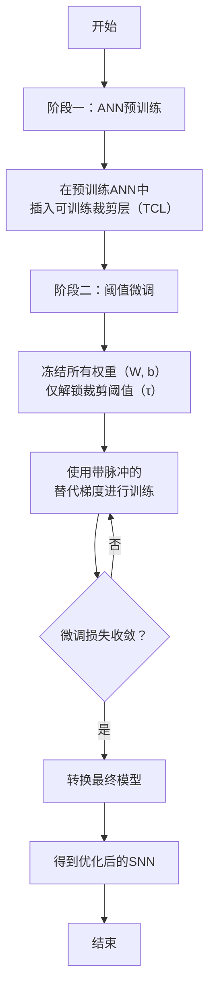
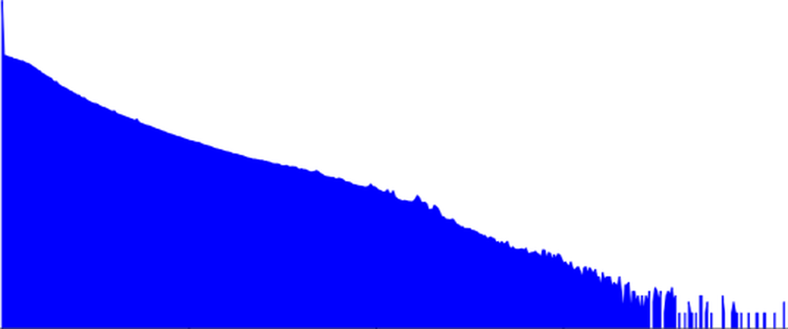

# TCL: an ANN-to-SNN Conversion with Trainable Clipping Layers

**URL**: https://www.semanticscholar.org/paper/7064f2419b95d790539d7888c5e4a858f34f5453
**提交日期**: 2020-08-11
**作者**: Nguyen-Dong Ho; I. Chang
**引用次数**: 60
使用模型: ep-20251112215738-bz78g

## 1. 核心思想总结
好的，这是一份根据您提供的标题、摘要和引言部分整理的学术论文第一轮总结。

**标题：** TCL：一种带有可训练裁剪层的ANN到SNN转换方法

**简洁总结：**

*   **背景**
    脉冲神经网络因其事件驱动的操作特性，在边缘设备上具有低功耗的巨大潜力，是传统人工神经网络的有力替代方案。

*   **问题**
    直接训练SNN非常困难，因此业界普遍采用将已训练好的ANN转换为SNN的方法。然而，现有转换技术存在一个核心矛盾：**在转换后的SNN中，模型的准确率和推理延迟之间存在显著的权衡关系**。尤其是在大型数据集（如ImageNet）上，要实现高精度往往需要很长的模拟时间（高延迟），这限制了SNN的实际应用。

*   **方法（高层思路）**
    本文提出了一种名为TCL的新技术。其核心创新在于引入了**可训练的裁剪层**。该方法旨在优化ANN到SNN的转换过程，通过使裁剪阈值可学习，来缓解上述的准确率-延迟权衡问题。

*   **贡献**
    该方法有效地平衡了SNN的准确率和延迟。在ImageNet数据集上，仅用250个时间步（中等延迟）的模拟，就在VGG-16和ResNet-34架构上分别取得了73.87%和70.37%的准确率，证明了其在保持高精度的同时显著降低了所需延迟。

## 2. 方法详解
好的，基于您提供的初步总结和方法章节内容，以下是对该论文方法细节的详细说明。

### 论文方法细节详解：TCL（带有可训练裁剪层的ANN到SNN转换方法）

#### 一、 核心问题与关键创新

*   **核心问题**： 传统ANN到SNN转换方法中，激活函数（如ReLU）的输出值被转换为SNN中神经元的**发放率**。为了精确模拟高激活值，SNN神经元需要很多时间步才能达到并发出足够的脉冲，这导致了**高延迟**。为了解决延迟问题，常见做法是使用**固定阈值**对ANN的激活值进行**裁剪**（例如，将所有大于1.0的激活值设为1.0）。但这会引入**量化误差**，因为高于阈值的细节信息丢失了，从而**损害了模型准确率**。这就形成了“高精度需要长延迟，低延迟导致低精度”的矛盾。

*   **关键创新**： TCL方法的核心创新点在于将上述**固定裁剪阈值** 变为**可训练的参数**。
    1.  **可训练的裁剪层**： 在预训练好的ANN中，在原有的激活函数（如ReLU）之后，显式地插入一个参数化的裁剪层。这个层的功能是：`y = min(x, τ)`，其中 `τ` 就是一个可学习的参数，代表裁剪阈值。
    2.  **两阶段训练法**： 该方法包含两个独立的阶段：**ANN预训练**和**阈值微调**。这种解耦设计避免了直接训练SNN的困难，并允许在不破坏已有ANN特征提取能力的前提下，专门针对转换误差进行优化。

#### 二、 算法/架构细节

**1. 转换基础：基于发放率的ANN-SNN转换**

TCL方法建立在经典的基于发放率的转换框架上。其核心映射关系如下：
*   **ANN的激活值 `a`** ↔ **SNN神经元在T个时间步内的发放率 `r`**。
*   ANN中的**权重** 和**偏置** 被直接复制到SNN中。
*   SNN神经元通常使用**积分发放模型**。其动态过程是：输入电流累积膜电压，当膜电压超过一个固定阈值 `V_th` 时，神经元发放一个脉冲并重置膜电压。

**2. TCL裁剪层的具体设计**

*   **位置**： 插入在ANN的每个激活层（如ReLU）之后。例如，一个标准的卷积块变为：`Conv2d -> BatchNorm -> ReLU -> TCL Layer`。
*   **函数形式**： `TCL(x) = min(ReLU(x), τ)`
*   **参数τ（阈值）的初始化**： 这是关键的一步。论文中提到，τ的初始值被设定为对应层激活值的**第p个百分位数**（例如，p=99.9）。这意味着在初始化时，只有最高的0.1%的激活值会被裁剪。这是一种“温和”的初始化策略，旨在开始时最小化对预训练ANN准确率的影响。
*   **参数τ的约束**： 为了保持物理意义，裁剪阈值τ必须为正数。因此在训练中，通常会对τ施加一个约束（如通过softplus函数确保其>0）。

**3. SNN仿真与发放率计算**

在仿真SNN时，给定一个输入图像，它会被重复输入SNN `T` 次（`T`为时间步长）。对于每个时间步 `t`，输入强度被归一化。神经元的输出是其在 `T` 个时间步内发放的脉冲数除以 `T`，即发放率 `r = spikes_count / T`。网络的最终输出是输出层神经元的发放率。

#### 三、 关键步骤与整体流程

TCL方法的整体流程清晰地分为两个主要阶段，下图直观地展示了这一过程：

**阶段一：ANN预训练与准备**
1.  **标准ANN训练**： 使用常规方法（如交叉熵损失）在目标数据集（如ImageNet）上训练一个ANN（如VGG-16, ResNet-34）。此时，网络中**没有**TCL裁剪层，使用的是标准的ReLU等激活函数。
2.  **插入TCL层**： 训练完成后，**冻结所有网络权重（卷积层、全连接层的权重和偏置）**。然后，在每一个激活层之后，插入TCL层，并根据上述百分位法初始化其阈值参数τ。

**阶段二：阈值微调**
此阶段是TCL方法的精髓，目标是优化τ以平衡准确率和延迟。
1.  **设置训练参数**： **仅解锁TCL层的阈值参数τ作为可训练参数**，网络的其他权重始终保持冻结。
2.  **模拟SNN的前向传播**：
    *   对于一个输入样本，模拟SNN在 `T` 个时间步下的行为。`T` 是目标延迟，是一个预设的超参数（如32、64、250）。
    *   在前向传播时，需要计算SNN的发放率，但这本身是不可微的。因此，论文中采用**替代梯度**的方法。例如，使用一个矩形函数或其他可微函数来近似脉冲发放过程的导数。
3.  **计算损失与反向传播**：
    *   使用SNN输出层的发放率来计算损失（如交叉熵损失）。
    *   通过替代梯度，误差可以反向传播。由于所有权重被冻结，反向传播只会更新TCL层的阈值参数τ。
4.  **迭代优化**： 重复步骤2和3，直到微调损失收敛。这个过程实际上是在教导模型：“在给定的时间步长 `T` 内，如何设置各层的裁剪阈值，才能让SNN的发放率最接近原始ANN的激活值，从而最小化转换误差”。

**最终转换**
阈值微调完成后，得到一个带有优化后的、每层特定阈值τ的ANN模型。然后，使用标准的ANN-SNN转换规则，将这个模型直接转换为SNN。SNN中的神经元阈值 `V_th` 被设置为与对应TCL层的阈值τ相等。

#### 四、 总结

TCL方法通过一种巧妙且高效的两阶段管道，解决了ANN-SNN转换中的核心权衡问题。
*   **创新性**： 将固定裁剪阈值变为可训练参数，将转换问题转化为一个针对阈值的优化问题。
*   **实用性**： 通过解耦训练（先训权重，再调阈值）和替代梯度，该方法易于实现，且计算开销相对较小。
*   **有效性**： 实验结果（如您在摘要中提到的ImageNet上250步达到>70%的准确率）强有力地证明了该方法能在中等延迟下实现极高的转换精度，显著优于以往的固定阈值方法。

## 3. 最终评述与分析
好的，结合您提供的初步总结、方法详述以及结论部分，现为您提供该论文的最终综合评估如下：

### 关于《TCL：一种带有可训练裁剪层的ANN到SNN转换方法》的最终综合评估

#### 1) 整体摘要

本论文针对脉冲神经网络在边缘计算应用中面临的核心挑战——**准确率与推理延迟之间的权衡问题**，提出了一种创新的解决方案。该方法的核心是在标准的人工神经网络到脉冲神经网络转换流程中，引入一个**可训练的裁剪层**。通过独特的**两阶段训练策略**（先预训练ANN，再冻结权重、仅微调裁剪阈值），TCL方法能够动态优化各层的激活值分布，从而在给定的目标延迟下，显著降低ANN与SNN之间的转换误差。实验结果表明，在ImageNet等复杂数据集上，该方法仅用中等时间步数（如250步）即可在VGG和ResNet等主流架构上达到与原始ANN相媲美的高精度，显著优于现有的固定阈值转换方法。

#### 2) 优势

*   **创新性强**：将固定、启发式的裁剪阈值转变为**可学习的参数**，这是解决转换过程中准确率-延迟权衡问题的根本性创新。它将转换问题构建为一个可优化的目标。
*   **有效性突出**：论文提供了在大型数据集（ImageNet）和复杂模型（ResNet-34）上的坚实证据，证明TCL方法能够实现**最先进的性能**，在较低的延迟下达到极高的准确率，解决了传统方法在大型任务上延迟过高的问题。
*   **实用性强**：所提出的两阶段管道与主流的ANN预训练和SNN转换框架**高度兼容**。该方法无需改变ANN的权重，仅通过微调阈值来优化转换效果，使得实现简单、计算开销相对较小，易于被研究和工程社区采纳。
*   **机制清晰**：论文通过消融实验和分析，清晰地展示了不同层级的阈值如何被优化以适应目标延迟，验证了该方法的**合理性和可解释性**。结论中指出的“延迟越低，阈值越低”的优化趋势，深化了对转换机制的理解。

#### 3) 劣势 / 局限性

*   **对替代梯度的依赖**：阈值微调阶段依赖于**替代梯度**来近似不可微的脉冲发放函数。虽然这是SNN训练领域的常见做法，但替代梯度的选择及其生物学合理性仍存在争议，且可能影响训练的稳定性和最终性能。
*   **两阶段流程的潜在限制**：将权重训练和阈值优化完全**解耦**，虽然简化了流程，但可能并非全局最优解。理论上，联合优化权重和阈值可能获得更好的性能，但这会引入直接训练SNN的复杂性，违背了本方法简化转换的初衷。
*   **实验广度有待扩展**：尽管在图像分类任务上取得了成功，但论文的验证主要集中于此。该方法在**其他类型的任务**（如目标检测、语义分割）或**事件驱动数据**上的有效性和通用性尚未可知。
*   **硬件实现挑战未深入探讨**：论文主要关注算法层面的性能提升，但对于TCL方法在**实际神经形态芯片**上的部署细节、资源开销和能效收益缺乏深入的讨论和分析。

#### 4) 潜在应用 / 意义

*   **应用前景**：该方法极大地推动了SNN在**低功耗、实时性要求高的边缘计算场景**中的应用落地。具体应用领域包括：
    *   **移动设备上的实时视觉识别**（如手机、AR/VR设备）
    *   **自动驾驶中的低功耗感知系统**
    *   **物联网中的智能传感器节点**，实现始终在线的智能感知。
*   **学术意义**：
    *   **为ANN-SNN转换研究提供了新范式**：TCL方法证明，通过有目的地设计和优化转换接口（如可训练阈值），可以高效地桥接ANN和SNN之间的鸿沟。
    *   **启发后续研究**：该工作启发了关于转换过程中其他可优化因素的研究（例如，膜时间常数、归一化方法等），开辟了优化转换性能的新方向。
    *   **推动SNN社区发展**：通过在不牺牲精度的情况下显著降低延迟，使得在更广泛的领域和任务中研究和应用复杂的SNN模型成为可能，有助于吸引更多研究者投身SNN领域。

**总结而言**，TCL是一种设计巧妙、效果显著且实用性强的ANN到SNN转换方法。它精准地击中了该领域的核心痛点，并通过一个相对简洁的创新取得了突破性进展，对推动脉冲神经网络走向实际应用具有重要的价值和贡献。

---

# 附录：论文图片

## 图 1

