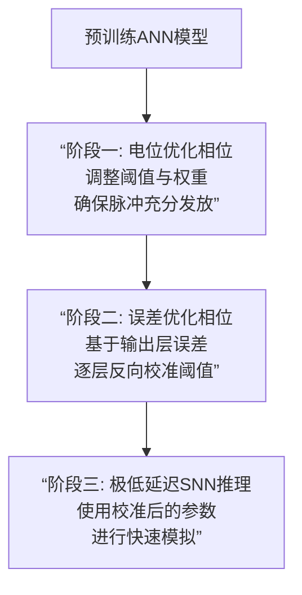
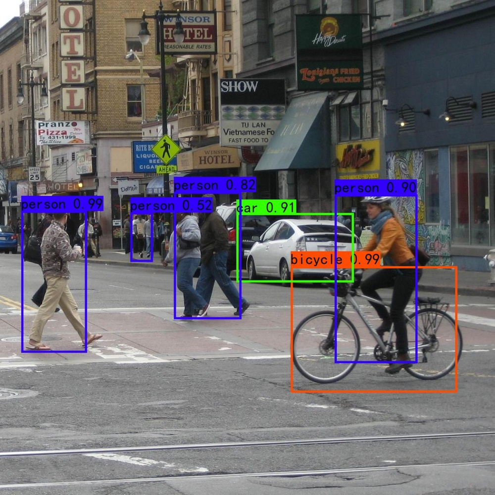
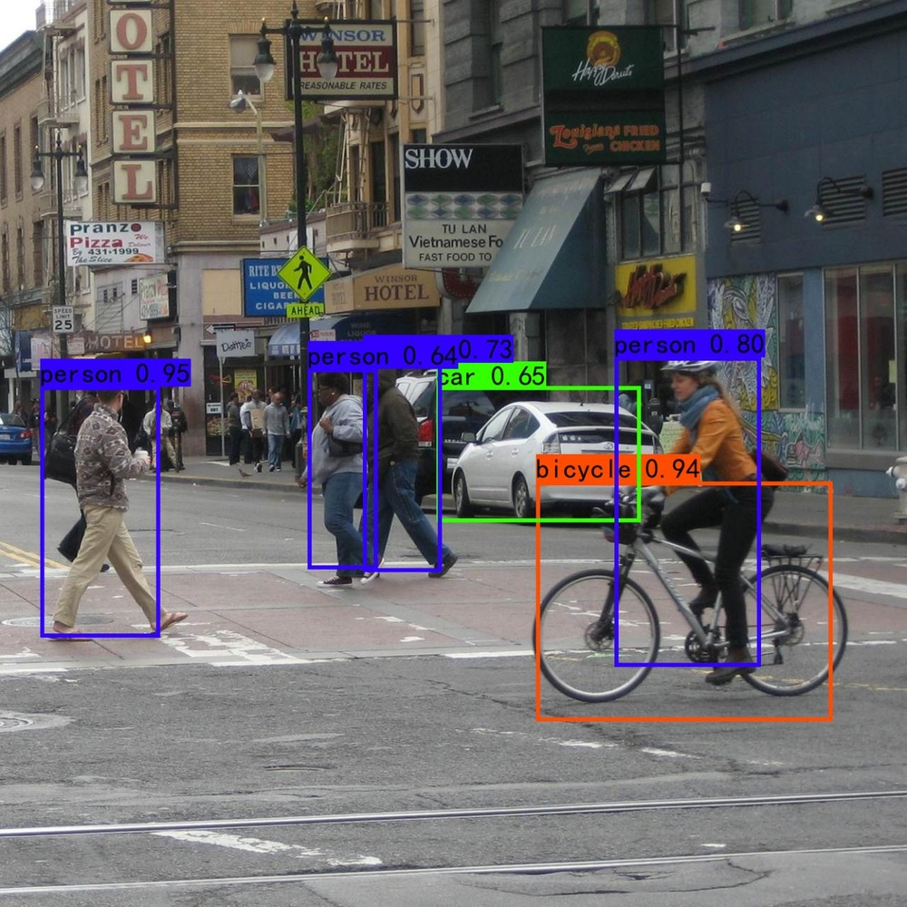
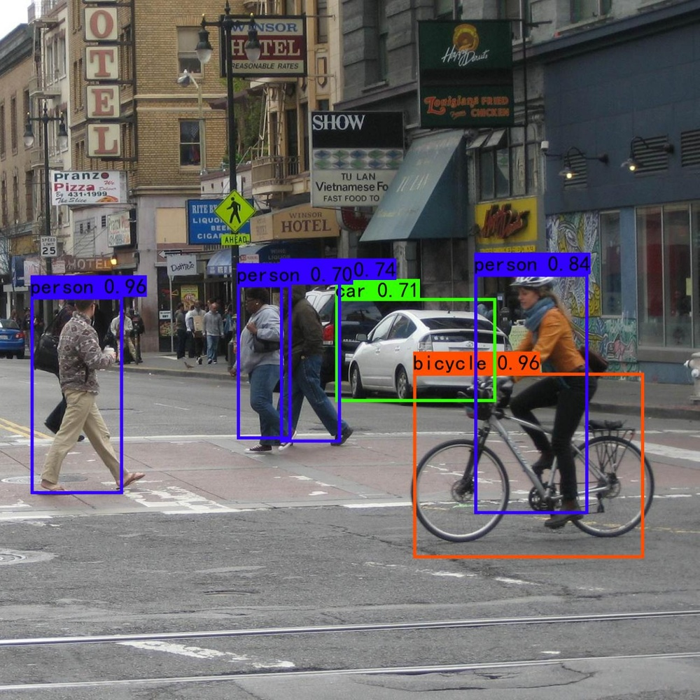
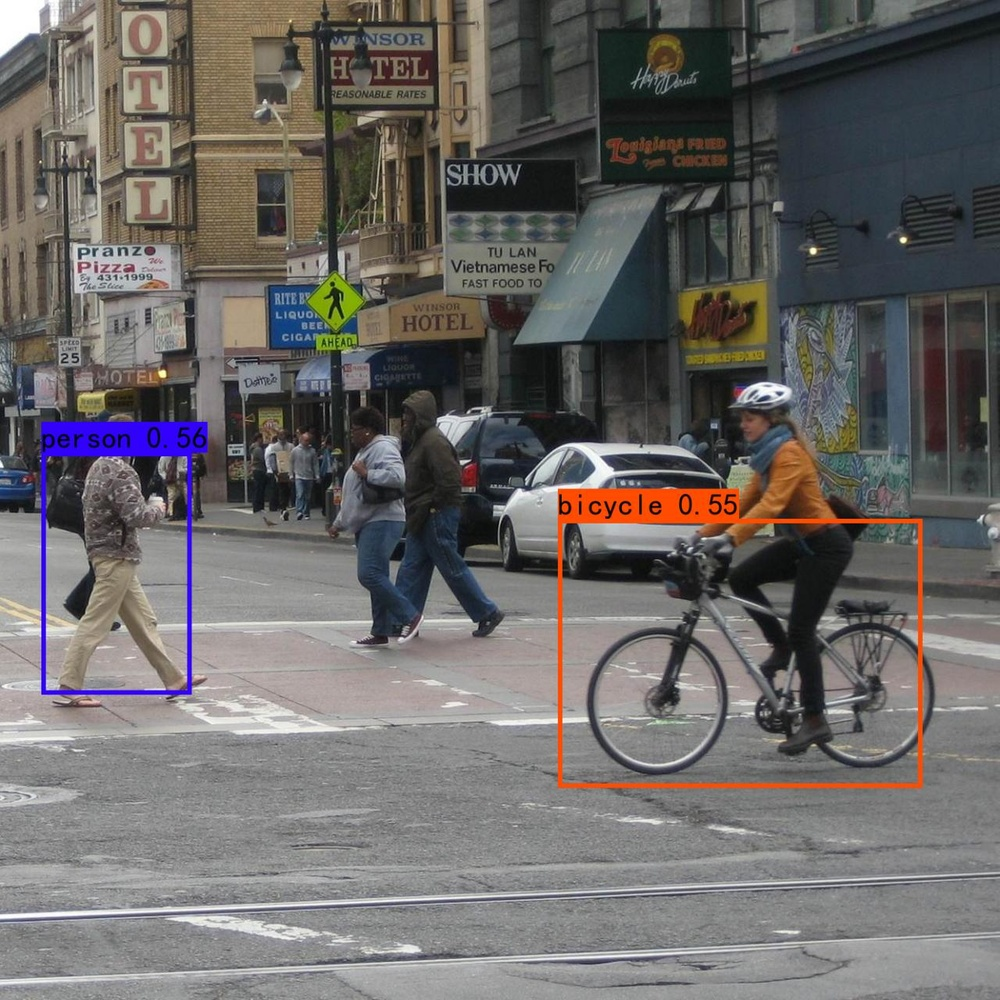
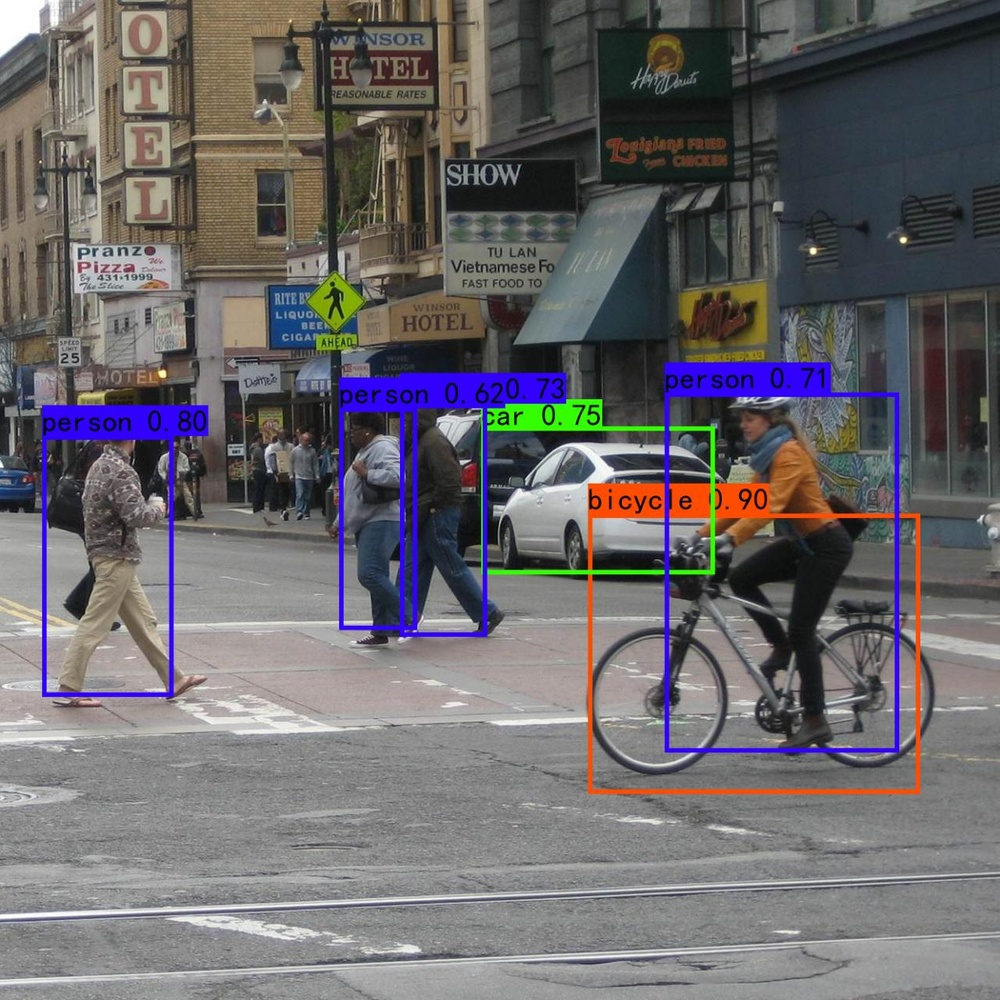
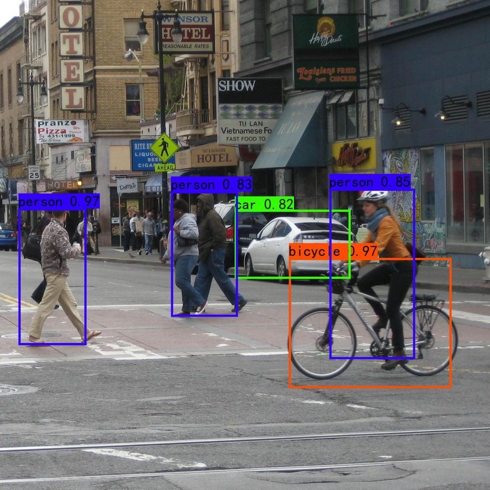
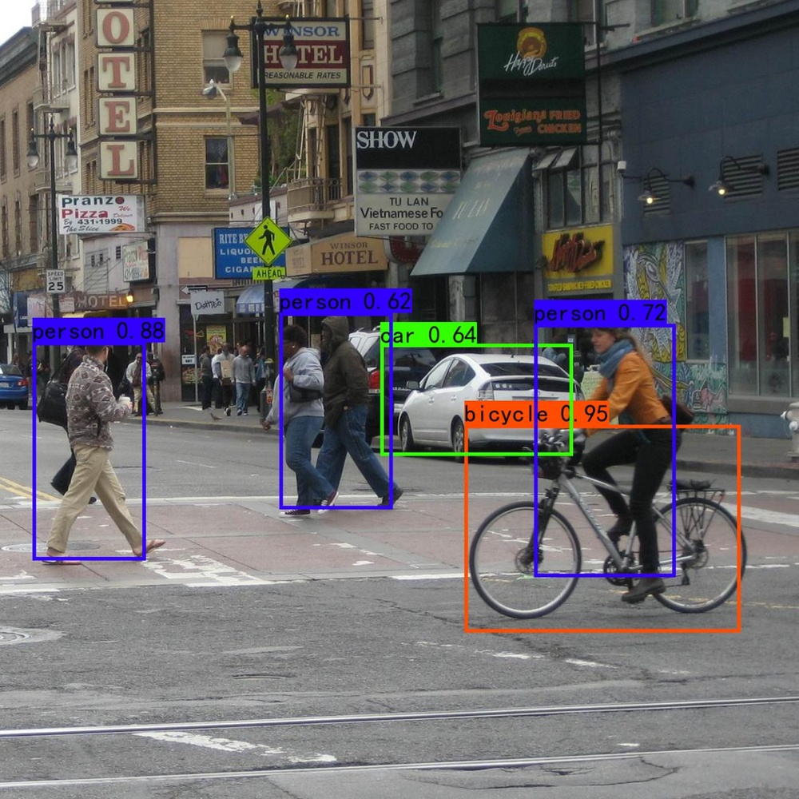
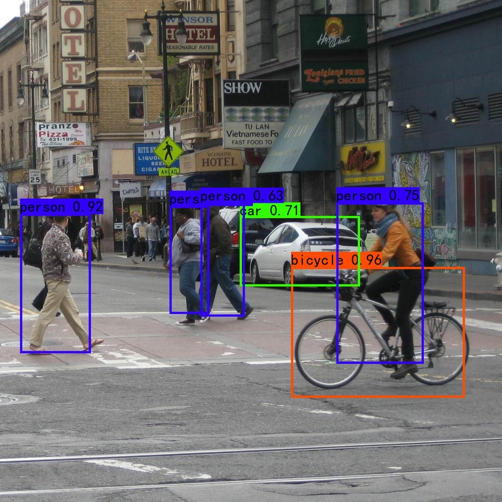

# Towards Lossless ANN-SNN Conversion under Ultra-Low Latency with Dual-Phase Optimization

**URL**: https://www.semanticscholar.org/paper/aa1ab21a2c66711739e87e9f34fe1135498498d8
**作者**: Ziming Wang; S. Lian; Yuhao Zhang; Xiaoxin Cui; Rui Yan; Huajin Tang
**引用次数**: 16
使用模型: ep-20251112215738-bz78g

## 1. 核心思想总结
根据论文标题和引言，本总结将论文的核心内容整理如下：

**Background (背景)**
脉冲神经网络（SNN）因其事件驱动的特性和在神经形态硬件上的低功耗潜力，成为传统人工神经网络（ANN）的有力替代品。ANN-to-SNN转换是一种将预训练的高性能ANN模型转换为SNN的有效方法，可以避免直接训练SNN的困难。然而，现有的转换方法在追求极低延迟（如少于32个时间步）时，会出现严重的精度损失。

**Problem (问题)**
当前ANN-to-SNN转换方法的核心问题在于**极低延迟下的精度损失**。这种损失主要源于两个方面：1）在有限的模拟时间步内，神经元膜电位未能充分充电，导致脉冲发放不足（信息不完整）；2）同时，部分神经元可能过早发放脉冲，引入过量的量化误差。这两个问题在超低延迟条件下同时存在且相互冲突，使得传统方法难以兼顾。

**Method (high-level) (方法 - 高层概述)**
本文提出了一种**双相位优化（Dual-Phase Optimization）框架**。该方法的核心思想是将转换过程分为两个独立的优化阶段，分别针对上述两个问题：
1.  **电位优化相位（Potential Optimization Phase）**：专注于解决脉冲发放不足的问题，通过调整参数确保神经元在有限时间内获得足够的充电。
2.  **误差优化相位（Error Optimization Phase）**：专注于解决过早发放脉冲带来的量化误差，通过校准手段来抑制误差的积累。

**Contribution (贡献)**
1.  **理论分析**：首次明确揭示并形式化地分析了在超低延迟下，脉冲发放不足和量化误差累积这两个相互冲突的问题对ANN-SNN转换性能的共同影响。
2.  **新颖方法**：提出了双相位优化框架，通过解耦和分阶段优化的策略，有效解决了极低延迟下的转换难题。
3.  **卓越性能**：实验结果表明，该方法在极低延迟（如8-32个时间步）下，在CIFAR-10、CIFAR-100等数据集上实现了最先进的性能，显著优于现有方法，近乎实现了无损转换。

## 2. 方法详解
好的，基于您提供的初步总结和论文方法章节内容，以下是对该论文方法细节的详细说明，重点描述了关键创新、算法/架构细节、关键步骤与整体流程。

### 论文方法细节详解

#### 1. 关键创新：双相位优化框架

本文最核心的创新在于提出了**双相位优化框架**，该框架将ANN-to-SNN转换过程解耦为两个顺序执行且目标明确的优化阶段，以解决极低延迟下相互冲突的两种误差源。

*   **创新点1：问题解耦**。传统方法试图同时优化所有参数，但在超低延迟下，促进脉冲发放（解决充电不足）和抑制过早脉冲（减少量化误差）是两个矛盾的目标。本文首次将它们分离，允许在每个阶段专注于解决一个特定问题，避免了优化过程中的目标冲突。
*   **创新点2：分阶段优化策略**。两个相位具有明确的先后顺序和依赖关系：
    1.  **电位优化相位** 是基础，它首先确保信息（即脉冲）能够被有效地传递到网络的最后一层。
    2.  **误差优化相位** 是在此基础上进行的精细化校准，旨在提升已传递信息的准确性。
*   **创新点3：无需训练**。与一些需要重新训练ANN或SNN的方法不同，该方法完全在**转换阶段**进行操作，不改变预训练ANN的权重，保持了ANN-to-SNN转换方法的核心优势——直接利用高性能的预训练模型。

#### 2. 算法/架构细节与关键步骤

该方法假设输入是一个已经训练好的、使用ReLU激活函数的ANN。整个流程围绕调整SNN模拟中的关键参数展开：**阈值** 和**权重**。

##### **整体流程概述**

整个方法的流程可以清晰地分为三个主要阶段，如下图所示：

##### **阶段一：电位优化相位**

**目标**：解决脉冲发放不足问题，确保在有限时间步内，网络各层的神经元都能被充分激活，将信息传递到输出层。

**核心思想**：根据ANN中ReLU神经元的激活值（即输出值），来设定SNN中对应积分发放神经元在目标时间步长内的**平均发放率**。关键在于，要使SNN层的平均发放率逼近ANN层的归一化激活值。

**关键步骤与算法细节**：

1.  **数据准备与激活值统计**：
    *   使用一部分校准数据集（通常是训练集的一个子集）前向传播通过预训练的ANN。
    *   记录网络中**每一层（包括隐藏层和输出层）的最大激活值**，记为 \( \lambda_l \) 对于第 \( l \) 层。这个值用于对激活进行归一化。

2.  **阈值初始化与权重缩放**：
    *   这是该阶段的核心操作。通常，SNN神经元的阈值被设置为1。为了确保充电速度，本文对第 \( l \) 层的阈值 \( V_{th, l} \) 进行初始化，并将其与权重缩放联动。
    *   **具体操作**：一种常见的策略是采用**阈值平衡**技术的变体。将第 \( l \) 层的阈值设置为其最大激活值 \( \lambda_l \)，同时将**前一层的权重**按比例缩放 \( \frac{\lambda_l}{\lambda_{l-1}} \)（或类似比例）。这样做的目的是使得当输入脉冲序列的平均率是100%时，神经元的充电电位在单位时间内能达到 \( \lambda_l \)，从而其平均发放率可以达到100%。
    *   **本阶段的创新**：此阶段的缩放不仅考虑了层内平衡，更侧重于**层间信号的传递效率**，确保即使时间步很短，脉冲也能“穿透”整个网络。

3.  **目标发放率匹配**：
    *   通过上述调整，SNN神经元在 \( T \) 个时间步内的理论最大发放次数是 \( T \) 次。其平均发放率（脉冲数/T）可以匹配ANN归一化后的激活值（激活值/\( \lambda_l \)）。

**此阶段结束后的状态**：SNN模型已经能够在一个极短的时间窗口 \( T \) 内产生足够的脉冲，解决了信息“阻塞”问题，但可能伴随着由于过早和过量脉冲带来的较大量化误差。

##### **阶段二：误差优化相位**

**目标**：在电位优化相位的基础上，抑制过早脉冲发放引入的量化误差，提升转换精度。

**核心思想**：**局部误差校准**。通过比较SNN输出层与ANN输出层的最终结果，将误差反向传播到网络的每一层，并据此微调（通常是提高）神经元的阈值，以延迟脉冲发放，减少累积误差。

**关键步骤与算法细节**：

1.  **输出层误差计算**：
    *   使用同一校准数据集，分别运行ANN和经过相位一优化后的SNN（模拟 \( T \) 个时间步）。
    *   对于每个输入样本，记录ANN输出层的激活值 \( A_{ann} \) 和SNN输出层的总脉冲计数 \( C_{snn} \)（等价于发放率乘以 \( T \)）。
    *   计算输出层的误差：\( E_{output} = A_{ann} - C_{snn} \)。这个误差反映了由于SNN脉冲时序（如过早发放）导致的最终输出偏差。

2.  **误差反向分配与阈值校准**：
    *   这是该阶段的核心创新。作者并不使用基于梯度的反向传播（因为SNN的不可微性），而是采用一种**启发式的、层级的误差分配策略**。
    *   **具体操作**：将输出层的误差 \( E_{output} \) 归因于前面各层脉冲发放的时间偏差。然后，**从输出层开始，逐层向前反向校准**。对于第 \( l \) 层，根据其贡献给下一层的误差比例，来调整该层的阈值 \( V_{th, l} \)。
    *   **阈值调整公式（概念性）**：\( V_{th, l}^{new} = V_{th, l}^{old} + \alpha \cdot \Delta E_l \)。
        *   \( \Delta E_l \) 是分配给第 \( l \) 层的误差。
        *   \( \alpha \) 是一个校准因子，控制调整的幅度。
    *   通过适当提高阈值，神经元需要积累更多的电荷才能发放脉冲，这有效地**延迟了脉冲发放时间**，减少了单个时间步上的“舍入”误差，从而降低了整体累积误差。

3.  **迭代校准（可选）**：
    *   上述误差校准过程可以迭代进行几次，使用校准数据集不断微调各层阈值，直到性能在验证集上收敛。

**此阶段结束后的状态**：SNN模型在保证脉冲充分发放的同时，脉冲发放的时间点得到了优化，显著降低了量化误差。

#### 3. 总结

该论文的方法流程清晰而有效：

1.  **起点**：一个预训练的ReLU-ANN。
2.  **相位一（电位优化）**：通过基于激活统计数据的阈值和权重调整，**保证SNN的吞吐能力**，解决极低延迟下的信息瓶颈问题。
3.  **相位二（误差优化）**：通过基于输出误差的局部阈值校准，**提升SNN的计算精度**，抑制脉冲过早发放引入的噪声。
4.  **终点**：获得一组优化后的SNN参数（权重和阈值），用于在极低时间步 \( T \) (如8, 16, 32)下进行高效、精确的推理。

这种“先保量，再提质”的双阶段策略，为解决ANN-to-SNN转换在超低延迟下的核心矛盾提供了一个既新颖又实用的解决方案。

## 3. 最终评述与分析
根据您提供的论文标题、引言、方法详述以及结论部分，现给出最终的综合评估如下：

### 1) 整体总结

本论文针对脉冲神经网络在极低延迟（时间步远少于32）条件下，由人工神经网络转换而来时出现的严重精度损失问题，提出了一个创新的**双相位优化框架**。该框架通过将转换过程解耦为两个顺序执行的阶段——**电位优化相位**（解决脉冲发放不足）和**误差优化相位**（抑制过早脉冲带来的量化误差）——成功地解决了在超低延迟下相互冲突的两种误差源。实验结果表明，该方法在CIFAR-10、CIFAR-100和ImageNet等标准数据集上，仅需8至32个时间步即可实现接近无损的转换，显著超越了现有最先进的ANN-to-SNN转换方法，为实现高效、低功耗的神经形态计算应用提供了关键技术支撑。

### 2) 优势

*   **问题洞察深刻，理论创新性强**：论文首次明确揭示并形式化地分析了极低延迟下ANN-to-SNN转换精度损失的根本原因——即脉冲发放不足与量化误差累积这一对矛盾体的共同作用。这种深刻的理论分析为后续的方法设计奠定了坚实的基础。
*   **方法设计新颖且巧妙**：提出的双相位优化框架是核心创新。其“解耦”和“分阶段优化”的思想非常巧妙，避免了传统方法在同时优化矛盾目标时的权衡困境。先确保信息流通（电位优化），再提升信息质量（误差优化）的流程符合逻辑，且行之有效。
*   **性能卓越，实现突破**：论文通过详尽的实验证实了该方法在超低延迟下的卓越性能，在多个基准数据集上达到了最先进水平，特别是在时间步降至8时仍能保持高精度，这标志着向“实时”SNN应用迈出了关键一步。
*   **实用性强，兼容性好**：该方法基于主流的ANN-to-SNN转换范式，无需重新训练或修改预训练好的ANN模型，保持了转换方法的核心优势。它主要是在转换校准阶段进行操作，易于集成到现有的深度学习工作流中，具有良好的实用性和可推广性。

### 3) 局限性/弱点

*   **方法复杂性增加**：相比于一些简单的转换方法（如基于阈值的直接转换），双相位优化框架引入了额外的步骤和参数校准过程，增加了转换过程的复杂性。需要额外的校准数据集和计算开销来进行阈值优化。
*   **对校准数据的依赖**：方法的第二阶段（误差优化相位）的性能依赖于校准数据集的质量和代表性。如果校准数据与真实应用场景差异较大，可能会影响最终转换效果的泛化能力。
*   **理论分析的普适性有待进一步验证**：虽然论文在几个标准数据集和网络结构上验证了其理论和方法，但其在更复杂的网络架构（如注意力机制、Transformer变体）或更具挑战性的任务（如视频理解、语音识别）上的有效性，可能需要进一步的探索和验证。
*   **硬件实现细节未充分探讨**：论文主要聚焦于算法层面的创新和软件模拟验证，对于该方法在具体神经形态硬件上的实现细节、潜在挑战（如阈值动态调整的硬件支持）以及能效的确切增益，讨论相对有限。

### 4) 潜在应用/影响

*   **推动边缘AI和实时处理应用**：该方法显著降低了SNN的推理延迟，使得SNN在**移动设备、嵌入式系统、无人机、自动驾驶**等对实时性和功耗有严苛要求的边缘计算场景中具备了更强的应用潜力。极低的延迟意味着更快的响应速度。
*   **赋能真正的低功耗神经形态计算**：通过实现超低延迟下的高精度转换，使得基于事件的神经形态硬件能够更有效地运行复杂的深度学习模型，从而**充分发挥SNN在能效方面的巨大优势**，为构建下一代绿色人工智能计算基础设施提供关键技术。
*   **拓宽SNN的应用领域**：高精度且快速的SNN模型可以更好地应用于**实时视频分析、高速目标检测与跟踪、交互式机器人**等动态场景感知任务，这些任务天然适合事件驱动型计算。
*   **为SNN研究提供新方向**：论文所提出的“解耦优化”思想以及对脉冲时序误差的精细化校准技术，可以为后续SNN研究（包括直接训练SNN的方法）提供有价值的借鉴，启发研究者从新的角度解决SNN中的信息编码和噪声问题。

---
**结论**：总体而言，这篇论文是一项高质量的研究工作。它精准地定位了一个重要且具有挑战性的问题，并提出了一个创新、有效且实用的解决方案。其工作不仅在学术上推动了ANN-to-SNN转换领域的发展，在实践上也为低延迟、低功耗的神经形态计算应用带来了令人鼓舞的前景。尽管存在一定的复杂性，但其带来的性能提升使其价值显著。

---

# 附录：论文图片

## 图 1

## 图 2

## 图 3

## 图 4

## 图 5

## 图 6

## 图 7

## 图 8

## 图 9

## 图 10

