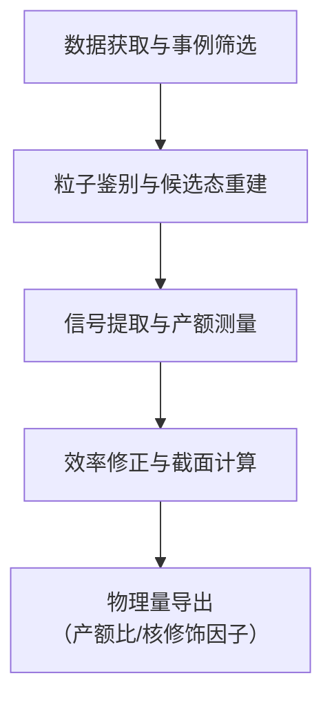

# Λ c + production in pp collisions at √s=7 TeV and in p-Pb collisions at √sNN=5.02 TeV

**URL**: https://www.semanticscholar.org/paper/01ba397c5ff18deb261d2de4cdba1f813aa4886c
**提交日期**: 2017-12-27
**作者**: S. Acharya; Yosuke Watanabe; G. Bíró; M. Varga-Kofarago; R. Majka; S. Weber; M. Bregant; G. Neskovic; M. Marchisone; P. Vyvre; K. Graham; P. Gasik; M. Planinić; V. Pozdniakov; E. Bartsch; M. Girard; F. Soramel; A. Shangaraev; T. Alt; R. Raniwala; F. Meddi; C. Schiaua; K. S. Diaz; Xiaoming Zhang; C. Kuhn; C. Kouzinopoulos; G. Paic; R. Preghenella; C. H. Christensen; P. Dupieux; M. Krzewicki; C. Deplano; J. Wilkinson; A. Calivà; M. Lupi; L. Doremalen; K. Roeed; L. Aphecetche; Sandun Pahula Hewage; E. Gauger; C. Oppedisano; K. Munning; S. Gotovac; S. Kushpil; P. Stankus; H. Ljunggren; Z. C. Valle; V. Kovalenko; R. P. Pezzi; S. Delsanto; Y. C. Morales; E. Hellbar; F. Cindolo; J. Oleniacz; M. Faggin; M. Leeuwen; Z. Vilakazi; A. Vodopyanov; V. Feuillard; S. Buitron; M. Nicassio; D. Budnikov; L. Altenkamper; P. Antonioli; E. C. Villar; N. Mohammadi; M. Malaev; S. Prasad; W. Riegler; S. Trogolo; U. Frankenfeld; R. Arnaldi; D. Silvermyr; J. Bhom; A. Herghelegiu; P. Luettig; F. Lehas; R. Lávička; R. Ilkaev; A. Morreale; N. Bastid; S. Bagnasco; P. Dhankher; K. Ullaland; H. Zanoli; Antonio Carlos Oliveira da Silva; A. Pop; R. Rui; E. Masson; Z. Ahammed; D. Kim; M. Puccio; T. Snellman; M. Angeletti; D. Berényi; N. Hussain; S. Kiselev; Z. Chunhui; M. Guittiere; R. Haque; D. Hutter; S. De; J. Yoon; Se Yong Kim; M. Janik; R. Guernane; K. Garg; Xinye Peng; S. Limon; P. Sarma; K. Redlich; Y. Baek; S. Sambyal; J. Putschke; L. Méndez; A. Toia; C. Petta; S. Gorbunov; V. Barret; K. Yamakawa; Andrés S. González; L. Oláh; M. Colocci; R. Langoy; R. Keidel; A. Grigoryan; M. Šuljić; O. Djuvsland; T. Tveter; M. Kruger; J. Adolfsson; P. Sett; B. Batyunya; R. Grosso; L. Moreno; A. Chauvin; A. Kubera; A. Barbano; M. Sitta; L. Musa; S. Dudi; J. Mares; B. Hippolyte; G. Batigne; S. Kar; F. Herrmann; M. Lisa; Jorge Mercado-perez; A. Reshetin; F. Antinori; R. Haake; P. Lévai; A. Wegrzynek; B. Ruzza; L. Ducroux; H. S. Scheid; K. Terasaki; Jiyoung Kim; J. V. D. Maarel; C. Ristea; E. Z. Buthelezi; R. Sultanov; S. Moretto; A. Francisco; A. Liu; E. Scapparone; M. Bombara; C. Cheshkov; K. Schweda; V. Yurchenko; G. Barnafoldi; Y. Kwon; Jinsook Kim; A. Mastroserio; K. Shigaki; V. Vislavicius; G. Rinella; J. Alme; Eulogio Serradilla Rodriguez; A. Nobuhiro; J. Niedziela; Hyeonjoong Kim; O. Pinazza; A. Deloff; T. Peitzmann; A. Mischke; R. Munzer; Supriya Das; B. Haller; I. B. Guzman; G. Usai; D. Andreou; A. Furs; J. V. Hoorne; C. Pruneau; J. Musinsky; P. Loncar; K. Voloshin; P. Pagano; M. Dukhishyam; P. Reichelt; M. Krivda; H. Hamagaki; J. Bielcik; C. Blume; M. Tarzila; J. Rak; M. Meres; A. Collu; B. Hohlweger; Eun Joo Kim; M. Slupecki; P. Pareek; M. D. Azmi; C. Zampolli; J. Jadlovský; L. Leardini; E. Rogochaya; S. Sorensen; J. Grosse-Oetringhaus; M. Kowalski; C. Cicalò; G. Trombetta; B. Teyssier; N. Bianchi; C. Mayer; Jianhui Zhu; M. Borri; H. F. Degenhardt; D. Finogeev; S. Shirinkin; P. Chochula; C. Bianchin; J. Faivre; O. V. Rueda; B. Skaali; R. Hosokawa; P. Rocca; V. Anguelov; J. Vrláková; I. Sputowska; B. Schaefer; D. Keijdener; A. Maevskaya; S. Evdokimov; H. Murakami; A. Khuntia; S. Basu; A. Deisting; B. Jacak; E. Meninno; M. Suleymanov; S. Ghosh; P. Sahoo; C. Andrei; A. Kuryakin; B. Wagner; A. Festanti; F. Reidt; S. Rajput; Y. Ryabov; R. Bailhache; Peter G. Jones; F. Guber; Y. Pestov; S. Senyukov; E. Kondratyuk; T. Sinha; S. Filchagin; F. Barile; A. Mohanty; S. Voloshin; E. L. Torres; B. Audurier; V. Litichevskyi; M. Mieskolainen; G. Feofilov; I. Das; C. Hills; M. Hernández; H. Hushnud; S. Yalcin; G. C. Balbastre; C. Bourjau; C. D. Galván; E. Gladysz-dziadus; E. Stenlund; Ejiro Naomi Umaka; M. Schmidt; R. Divià; A. Narayan; M. Gallio; J. Onderwaater; X. Ren; C. E. Martinez; O. Karavichev; K. Lapidus; J. R. Luhder; I. R. Bhat; I. Belikov; D. Vranić; D. Hořák; G. Cataldo; V. Grabski; J. Harris; C. Bedda; M. Poghosyan; O. Kovalenko; V. Zaccolo; M. Šefčík; G. Zinovjev; R. Sahoo; P. Jacobs; A. O. Velasquez; F. Colamaria; G. Willems; P. Pillot; Taesoo Kim; J. Zmeskal; R. Bala; O. Dordic; M. Arslandok; S. Beolè; S. Bufalino; P. Rokita; M. Concas; G. Scioli; D. Varga; I. Szarka; R. Souza; C. C. Sanchez; R. Bellwied; S. R. Torres; P. Dillenseger; R. Nayak; G. Volpe; E. P. Lezama; M. Ball; H. Hassan; M. Vasileiou; G. Bruno; M. Inaba; P. Larionov; A. Alici; S. Pasquale; M. Ippolitov; S. Lindal; R. A. N. D. Oliveira; B. Kileng; D. Elia; E. Willsher; L. Pinsky; L. Malinina; Y. Melikyan; C. Nattrass; S. Khan; A. Pandey; Yury Sibiryak; J. Myrcha; V. Belyaev; P. Ghosh; B. Alessandro; S. Parmar; A. Margotti; V. Kondratev; I. Ravasenga; S. Silaeva; H. Beck; V. Petráček; J. Pluta; P. Riedler; R. Rogalev; U. Westerhoff; E. Garcia-Solis; L. Vermunt; L. Betev; M. Habib; Hongkai Wang; S. Murray; S. Jaelani; M. Zhalov; R. Shahoyan; L. Bianchi; G. Margagliotti; F. Roukoutakis; D. Adamová; Haitao Zhang; B. Mohanty; V. Punin; Y. Pachmayer; A. Capon; T. Richert; V. Singhal; H. A. Andrews; S. Hornung; S. Nikulin; J. Saini; K. Nayak; V. Riabov; A. Kisiel; M. Saleh; A. Dainese; L. Barnby; S. Hayashi; M. Tariq; E. Mudnić; T. Cormier; Crispin Williams; F. Manso; You Zhou; C. Hadjidakis; P. G. Zamora; A. Danu; O. Baillie; I. Yoo; P. Ganoti; A. Sandoval; D. Stocco; A. Marin; R. Xu; N. Martin; A. Akindinov; M. Köhler; A. Khanzadeev; A. Harton; J. Schukraft; K. Sielewicz; A. Fantoni; P. Foka; L. Tropp; I. Selyuzhenkov; Xingguo Li; T. Anticic; M. Munhoz; N. Zhigareva; H. Oeschler; N. Apadula; A. Dubla; R. S. Camacho; I. Pshenichnov; G. Simatović; T. Sugitate; J. Norman; Samsul Islam; K. Gulbrandsen; N. Tanaka; D. Gruttola; P. Christiansen; S. Mahmood; G. Fronzé; M. Chojnacki; E. Flores; C. Furget; A. Vasiliev; T. Virgili; S. Mhlanga; Michael F. Weber; P. Gianotti; G. Nooren; G. Wilk; K. Reygers; M. Schmidt; A. Passfeld; W. Llope; S. Aiola; X. Lopez; G. Eulisse; F. Carnesecchi; M. Al-turany; A. Maire; E. Scomparin; W. Witt; P. Glassel; J. Takahashi; P. Lønne; M. Jakubowska; W. Chang; A. Bianchi; Ranbir Singh; Xiaomei Li; A. Tauro; J. Klein; V. Manzari; O. Arnold; S. Kundu; M. Ivanov; R. Diaz; A. Utrobicic; A. Knospe; A. Andronic; A. Rossi; R. Varma; L. Vinogradov; C. Lippmann; L. Cifarelli; K. Rosłon; N. Zardoshti; R. Tieulent; H. Caines; Anjali Sharma
**引用次数**: 164
使用模型: ep-20251112215738-bz78g

## 1. 核心思想总结
好的，这是一份根据您提供的论文标题和摘要整理的简洁第一轮总结，按四个部分组织。

**标题：** Λc+在√s=7 TeV的pp碰撞和√sNN=5.02 TeV的p-Pb碰撞中的产生

**第一轮总结**

*   **1. Background (背景)**
    理解粲夸克（c夸克）如何通过强相互作用形成强子（即强子化过程）是高能物理中的一个重要课题。特别是，粲重子（如Λc+）的产生机制相较于粲介子（如D0）而言，在理论上尚未被充分理解。大型强子对撞机（LHC）上的ALICE探测器为在不同碰撞系统（如pp和p-Pb）中研究这一过程提供了条件。

*   **2. Problem (问题)**
    此前在不同对撞系统、质心能量和动量区间内的实验测量表明，Λc+的产生率（通常以Λc+/D0产额比表示）存在差异，暗示其产生机制可能很复杂。现有的理论模型，包括微扰量子色动力学（pQCD）计算和蒙特卡洛事件生成器，是否能够准确描述Λc+的产生，尤其是在LHC的能量下，是一个悬而未决的问题。此外，Λc+在核物质环境（如p-Pb碰撞）中是否会受到核修饰效应的影响也尚属首次在LHC上探索。

*   **3. Method (high-level) (方法 - 高层概述)**
    本研究利用ALICE探测器，在LHC上分别采集了质心能量为7 TeV的质子-质子（pp）碰撞数据和每核子对质心能量为5.02 TeV的质子-铅（p-Pb）碰撞数据。在中间快度区间，通过多个衰变道（Λc+ → pK−π+, Λc+ → pKS0 和 Λc+ → e+νeΛ）重建了Λc+重子，并测量了其横动量（pT）微分产生截面。

*   **4. Contribution (贡献)**
    本研究的核心贡献有两点：
    *   **对强子化机制的新认识：** 测量得到的Λc+/D0产额比显著高于以往大多数实验测量值，并且现有的pQCD计算和蒙特卡洛模型均无法重现这一结果。这强有力地表明，当前理论对重味重子（特别是Λc+）的碎裂或强子化过程的描述存在严重不足。
    *   **首次测量核修饰因子：** 首次在LHC上报告了Λc+在p-Pb碰撞中的核修饰因子RpPb。该因子被发现与1一致，且与D介子的RpPb在误差范围内相符，表明Λc+在碰撞初态受到的冷核物质效应与D介子相似，并且没有观察到强烈的热介质效应迹象。这一结果为理解重味强子与核环境相互作用提供了新的基准。

## 2. 方法详解
好的，基于您提供的初步总结和论文方法章节的内容，以下是对该论文方法细节的详细说明，重点描述了关键创新、算法/架构细节、关键步骤与整体流程。

---

### **论文方法细节详细说明**

本论文的核心目标是精确测量Λc+重子在pp和p-Pb碰撞中的产生截面，并计算其与D0介子的产额比以及核修饰因子。为实现这一目标，研究方法围绕**数据获取、事例重建、信号提取、效率修正与系统误差评估**等一系列精密步骤展开。

#### **一、 关键创新与总体策略**

论文的方法学创新主要体现在以下几个方面：

1.  **多衰变道组合分析：** 这是最关键的创新之一。论文没有依赖单一的衰变道，而是同时利用了三个独立的衰变道：
    *   **强子衰变道 (1)：** `Λc+ → pK-π+` （分支比最高，~6.28%）
    *   **强子衰变道 (2)：** `Λc+ → pK_S0` （通过`K_S0 → π+π-`重建，背景不同）
    *   **半轻子衰变道：** `Λc+ → e+νeΛ` （通过`Λ → pπ-`重建，提供完全独立的重建方法）
    这种多通道分析策略极大地增强了结果的**稳健性**和**可信度**。不同道具有不同的系统误差来源，其结果的一致性是对测量正确性的最强有力证明。

2.  **在复杂环境下的高精度顶点重建：** 特别是在p-Pb碰撞的高多重数环境中，ALICE探测器卓越的顶点ing和粒子鉴别能力是关键。其核心的**内径迹系统** 提供了极高的空间分辨率，使得在极小的衰变长度内（`cτ ≈ 60 μm`）重建Λc+的次级顶点成为可能，从而有效地区分信号和来自初级顶点的大量组合背景。

3.  **首次在LHC能量下进行p-Pb碰撞中的Λc+核修饰因子测量：** 该方法涉及将p-Pb数据与按亮度标定的pp参考数据进行严格比较，并考虑核子数的几何尺度因子，这是一套完整的、标准化的核-核碰撞物理分析流程的首次应用于Λc+重子。

#### **二、 算法/架构细节与关键步骤**

**整体流程可分为四个主要阶段，如下图所示：**

下面我们详细展开每个阶段的具体内容：

**阶段一：数据获取与事例筛选**

1.  **数据样本：**
    *   **pp碰撞：** 使用LHC在√s = 7 TeV运行期采集的数据。
    *   **p-Pb碰撞：** 使用LHC在√sNN = 5.02 TeV运行期采集的数据（包含p朝不同方向飞行的两种配置以覆盖不同的快度区间）。
    *   数据均通过ALICE中心触发子系统进行采集，并施加了针对最小偏置碰撞的触发条件。

2.  **事例预筛选：**
    *   首先选择具有良好重建的初级顶点的事例（通常要求顶点在束流方向的位置在一定范围内），以排除背景和探测器边缘效应。
    *   对每个碰撞事件进行重建，并记录其中的带电粒子轨迹。

**阶段二：粒子鉴别与候选态重建**

这是方法的核心环节，依赖于ALICE探测器的多种子探测器信息。

1.  **轨迹重建：**
    *   利用**内径迹系统** 的硅像素探测器、漂移器和条带探测器信息，将带电粒子在磁场中的径迹精确地重建出来，并外推至初级顶点。

2.  **粒子鉴别：**
    *   这是区分质子、Kaon、π介子的关键。论文主要结合两种技术：
        *   **电离能损：** 利用**时间投影室** 测量粒子在气体中的电离能损。不同质量的粒子在相同动量下速度不同，其dE/dx也不同，从而可以在`dE/dx vs. p`图上进行鉴别。
        *   **飞行时间：** 利用**飞行时间探测器** 直接测量粒子从对撞点到探测器的飞行时间，从而计算其速度和质量。

3.  **次级顶点重建：**
    *   对于`Λc+ → pK-π+`道：
        *   将经过PID筛选的质子、Kaon、π介子轨迹组合在一起，不要求它们起源于初级顶点。
        *   使用**顶点约束拟合算法**，将这三条轨迹的延长线拟合到一个共同的点，即推测的Λc+衰变顶点（次级顶点）。
        *   计算次级顶点与初级顶点之间的**衰变长度** 和其不确定性，并由此得到**显著性**。高显著性的候选态更可能是真实衰变。
    *   对于`Λc+ → pK_S0`道：
        *   先重建`K_S0 → π+π-`。由于`K_S0`寿命较长，其衰变顶点（二级顶点）易于识别。
        *   然后将`K_S0`候选粒子和一个质子轨迹组合，拟合到`Λc+`的衰变顶点（三级顶点）。
    *   对于半轻子道`Λc+ → e+νeΛ`：
        *   由于中微子未被探测，存在缺失横动量。先重建`Λ → pπ-`，然后将其与一个电子组合。通过分析缺失动量来约束Λc+的质量。

**阶段三：信号提取与产额测量**

1.  **不变质量分布：**
    *   对于每个衰变道，在每个横动量区间内，将所有候选态的不变质量`m(pKπ)`、`m(pK_S0)`或`m(eΛ)`进行分布，得到不变质量谱。

2.  **信号产额提取：**
    *   不变质量谱中包含一个信号峰（位于Λc+已知质量~2286 MeV/c²附近）和一个连续的本底分布。
    *   论文采用**拟合方法**来提取信号产额：
        *   **信号形状：** 通常用高斯函数或双高斯函数来描述。
        *   **本底形状：** 使用复杂的函数形式来模拟组合本底，例如指数函数、多项式函数等。
        *   通过对不变质量谱进行全局拟合，得到信号峰下的候选事例数，即**原始产额**。

**阶段四：效率修正与截面计算**

1.  **效率修正：**
    *   原始产额需要除以总的探测效率才能得到物理上的产生产额。总效率 `ε_total` 是多个独立效率的乘积：
        *   **几何接受度：** 由探测器的孔径决定。
        *   **重建效率：** 粒子轨迹被成功重建的概率。
        *   **选择效率：** 包括顶点拟合概率、粒子鉴别选择效率、衰变长度显著性选择效率等。
        *   **触发效率：** 对于最小偏置触发，此项效率接近100%。
    *   这些效率通过**蒙特卡洛模拟** 来估计。论文会使用PYTHIA等事件生成器模拟大量的Λc+产生事例，然后让模拟事例通过一个尽可能真实模拟ALICE探测器响应的软件框架，最后分析这些模拟事例的重建效率。

2.  **微分产生截面计算：**
    *   对于pp碰撞，Λc+的微分产生截面由以下公式计算：
        `d²σ/(dpTdy) = (1/N_evt) * (1/ΔpT) * (1/BR) * (1/ε_total) * (d²N/(dpTdy))`
        *   `N_evt`: 分析所用的事例总数。
        *   `ΔpT`: pT区间的宽度。
        *   `BR`: 该衰变道的分支比。
        *   `ε_total`: 总效率。
        *   `d²N/(dpTdy)`: 修正后的产额。

3.  **物理量导出：**
    *   **Λc+/D0产额比：** 将Λc+的产生截面与在**相同碰撞系统、相同快度区间内**测量的D0介子产生截面相除。这消除了许多共同的系统不确定性（如亮度），使比值更加精确。
    *   **核修饰因子 RpPb：**
        `RpPb(pT) = [dN_pPb/dpT] / [<T_pPb> * dσ_pp/dpT]`
        *   `dN_pPb/dpT`: p-Pb碰撞中测量到的Λc+产额。
        *   `dσ_pp/dpT`: pp碰撞参考截面的测量值。
        *   `<T_pPb>`: 核重叠函数，与核子的几何分布有关，是一个理论计算值。若`RpPb = 1`，则表示p-Pb碰撞中的产生与pp碰撞简单标度后的结果无差异。

#### **三、 系统误差评估**

论文对每个测量值都给出了详细的系统误差。系统误差来源包括：
*   **信号提取方法：** 改变本底拟合函数形式、信号函数形式等。
*   **粒子鉴别：** 改变PID选择标准带来的变化。
*   **轨迹质量选择：** 改变对粒子轨迹重建质量的要求。
*   **蒙特卡洛模拟中的输入：** 例如改变Λc+的产额和pT谱模型。
*   **分支比的不确定性。**
*   **对于p-Pb数据，还有与核重叠函数`<T_pPb>`相关的不确定性。**

通过系统地改变分析中的每一个选择和处理步骤，并观察最终结果的变化量，来量化这些系统误差。

---
综上所述，该论文的方法是一套极其严谨和完整的高能核物理实验分析流程，其创新性和可靠性建立在ALICE探测器的卓越性能、多衰变道交叉验证、以及细致的蒙特卡洛模拟和系统误差控制之上，从而得出了对理论模型具有强约束力的重要物理结果。

## 3. 最终评述与分析
好的，基于您提供的论文标题、摘要、初步总结、详细方法说明以及结论部分，我为您整理出一份最终的综合评估。

### **关于Λc+重子在pp和p-Pb碰撞中产生的综合评估**

**标题：** Λc+在√s=7 TeV的pp碰撞和√sNN=5.02 TeV的p-Pb碰撞中的产生

---

#### **1. 整体总结**

本研究利用LHC上ALICE探测器在7 TeV质子-质子碰撞和5.02 TeV质子-铅碰撞中采集的数据，对粲重子Λc+的产生进行了高精度的测量。研究通过组合分析多个独立的衰变道，首次在LHC能量下系统测量了Λc+的横动量谱、其与D0介子的产额比（Λc+/D0），以及在p-Pb碰撞中的核修饰因子（RpPb）。核心发现是：Λc+的产生率（Λc+/D0产额比）显著高于传统理论模型（如微扰QCD计算和常用蒙特卡洛事件生成器）的预测，这强烈挑战了当前对粲夸克强子化过程，特别是重子形成机制的理解。同时，Λc+在p-Pb碰撞中的核修饰因子与1相符，且与D介子的行为一致，表明其在核环境中未表现出超出冷核物质效应之外的显著修饰。

#### **2. 优势**

*   **物理结果的突破性：** 研究提供了对重味重子产生机制前所未有的深刻见解。高精度的Λc+/D0比值数据为理论家提供了关键的实验基准，直接揭示了现有强子化模型的不足，推动了理论的发展。
*   **方法的高度稳健与可靠：** 最大的优势在于采用了**多衰变道交叉验证**的策略。同时利用强子衰变道（`pK-π+`和`pK_S0`）和半轻子衰变道（`e+νeΛ`）进行分析，不同道的系统误差来源独立，而最终结果高度一致，极大地增强了测量结果的**可信度和说服力**。
*   **技术的先进性与严谨性：** 充分发挥了ALICE探测器在顶点重建和粒子鉴别方面的卓越性能，成功在具有挑战性的高多重数环境中精确重建了短寿命的Λc+。分析流程完整严谨，包含了详尽的蒙特卡洛模拟进行效率修正，并对所有重要的系统误差来源进行了全面且量化的评估。
*   **研究的全面性与首创性：** 工作首次将完整的核物理分析流程（包括核修饰因子的测量）应用于LHC能量下的Λc+重子，填补了该领域的重要空白，为研究重味强子与核物质相互作用提供了全新的、关键的实验数据。

#### **3. 局限性与不足**

*   **统计精度限制：** 尽管多衰变道分析是强有力的手段，但某些道（尤其是半轻子道和`pK_S0`道）由于分支比较低或重建复杂，**统计误差仍然较大**，特别是在高横动量区域。这限制了在更精细的pT区间内进行更深入的微分研究。
*   **理论对比的定性多于定量：** 论文明确指出主流理论模型与数据存在显著差异，但主要是定性的“无法描述”。由于Λc+强子化机制本身的复杂性，目前尚缺乏一个公认的、可进行精确定量比较的成熟理论框架，使得深入的模型鉴别工作变得困难。
*   **系统误差的主导性：** 在某些测量中（如绝对截面的测量），**系统误差成为总误差的主要贡献者**。虽然这些误差已被仔细评估，但它们仍然限制了测量的最终精度。例如，粒子鉴别和跟踪效率的不确定性是系统误差的主要来源。
*   **碰撞系统与能量的覆盖范围：** 当前分析仅限于pp和p-Pb碰撞系统。要全面理解产生机制，未来需要扩展到Pb-Pb碰撞中，以探究在高温高密的夸克-胶子等离子体中的行为，但这超出了本工作的范围。

#### **4. 潜在应用与影响**

*   **对理论模型的强约束与指引：** 本研究提供的精确数据将**直接挑战并推动强子化理论的发展**。它强烈暗示了重味重子产生中存在非微扰的、可能超出传统碎裂函数模型的机制（如颜色弦的聚合、双部分子散射等）。理论家必须修改或提出新的模型来重现如此高的Λc+/D0比值。
*   **作为重离子碰撞研究的基准：** 在p-Pb碰撞中测得的RpPb为1的结果，确立了Λc+在“冷核物质”环境下的行为基线。这对于未来在**Pb-Pb碰撞中寻找由夸克-胶子等离子体引起的“热核物质”效应**至关重要。任何观测到的与当前基线的偏离，都可能被视为QGP存在的信号。
*   **提升蒙特卡洛事件生成器的真实性：** 主流的高能物理模拟软件（如PYTHIA）需要根据这些LHC能量下的新发现进行**调参和更新**，使其对重味强子，特别是重子的模拟更接近真实实验数据，从而为其他物理分析提供更可靠的背景估计。
*   **启发新的实验测量：** 该研究成功证明了在LHC上测量粲重子的可行性，将激励对其他粲重子（如Ξc, Ωc）和底重子进行类似的精密测量，以探究重子产生机制是否具有普适性。

---
**结论：** 本论文是一项高质量的实验物理研究，其通过严谨的方法和创新的多道分析，获得了具有里程碑意义的物理结果。这些结果不仅精确描绘了Λc+重子的产生特性，更重要的是对基础理论构成了严峻挑战，指明了未来理论和实验研究的重要方向。

---

# 附录：论文图片

## 图 1

