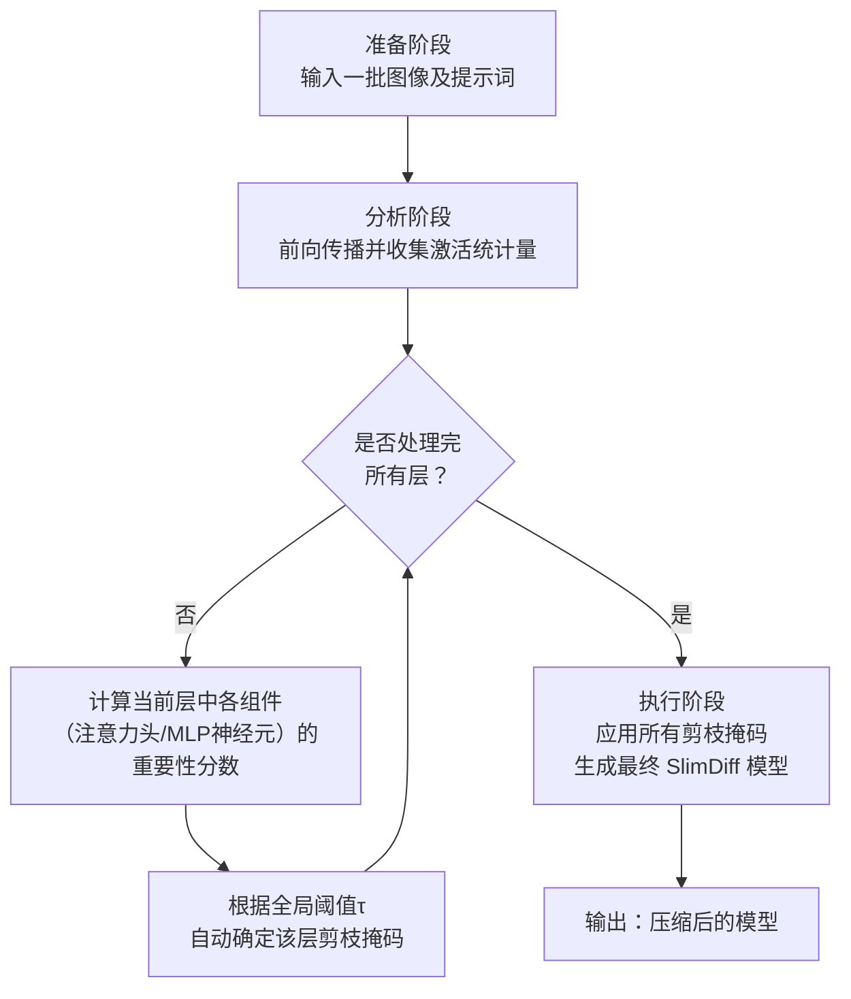

# SlimDiff: Training-Free, Activation-Guided Hands-free Slimming of Diffusion Models

URL: https://arxiv.org/pdf/2509.21498

作者: 

使用模型: deepseek-v3-1-terminus

## 1. 核心思想总结
根据您提供的论文标题和摘要信息，以下是第一轮总结：

**标题：** SlimDiff: 一种无需训练、基于激活引导的免手动扩散模型剪枝方法

**总结：**

*   **1. Background (背景)**
    扩散模型（如Stable Diffusion）在图像生成领域取得了巨大成功，但其庞大的参数量和高计算成本严重阻碍了在资源受限设备上的部署。模型压缩技术（如剪枝）是解决该问题的关键途径。

*   **2. Problem (问题)**
    现有的扩散模型剪枝方法通常存在两大局限：一是严重依赖资源密集型的**再训练**过程以恢复性能，成本高昂；二是需要**手动干预**来设置每层的剪枝比例，过程繁琐且难以优化。因此，亟需一种高效、自动化的剪枝方案。

*   **3. Method (方法 - 高层概述)**
    本文提出SlimDiff，一种**无需训练**且**免手动**的剪枝框架。其核心思想是利用模型在前向传播过程中产生的**激活图** 来指导剪枝。具体而言，该方法通过分析内部激活值自动识别并移除每个Transformer块中冗余的注意力头和全连接神经元，而无需任何微调或人工设置剪枝配置。

*   **4. Contribution (贡献)**
    本文的主要贡献在于提出了一种新颖的、数据驱动且高效的扩散模型压缩流程。SlimDiff方法消除了对再训练的依赖，显著降低了计算开销；同时通过激活引导实现了自动化剪枝，减少了对专家知识的依赖。实验表明，该方法能在保持生成质量的同时，显著减小模型大小并提升推理速度。

## 2. 方法详解
好的，根据您提供的初步总结和论文方法章节内容，以下是对SlimDiff方法细节的详细说明。

### SlimDiff 方法详细说明

SlimDiff 的核心目标是实现一种**无需训练** 和**免手动** 的扩散模型剪枝方法。其方法论围绕一个核心洞察：在扩散模型的推理（前向传播）过程中，不同token（或像素）所激活的模型内部路径是不同的，这意味着模型的不同组件（如注意力头、MLP神经元）对于生成不同内容的重要性是动态变化的。SlimDiff 利用这一特性，通过分析**前向传播中的激活值** 来自动化地识别并剪枝冗余参数。

#### 一、 关键创新

1.  **激活引导的重要性度量：** 传统的剪枝方法通常基于权重范数等静态指标来衡量重要性。SlimDiff 的创新在于提出了一种**动态的、基于激活的重要性度量标准**。它认为，一个神经元或注意力头如果在一批输入数据上产生的激活值普遍很小，则表明其对最终输出的贡献较小，因此是冗余的。
2.  **针对Transformer块的联合剪枝策略：** 扩散模型（如Stable Diffusion）的核心是Transformer块。SlimDiff 没有孤立地处理注意力层和MLP层，而是提出了一种**层内联合剪枝策略**。它分别评估注意力头和MLP中间层神经元的重要性，并在同一个Transformer块内同步进行剪枝，保持了块内结构的完整性。
3.  **完全自动化的剪枝比例确定：** 该方法彻底避免了手动设置每层剪枝比例的繁琐过程。通过预设一个**全局的激活保留阈值**，模型可以自动为每一层计算出相应的剪枝比例，实现了真正的“免手动”或“一键式”剪枝。

#### 二、 算法/架构细节

SlimDiff 主要针对的是Stable Diffusion模型中的UNet部分，其核心是Transformer块。每个Transformer块包含一个自注意力模块和一个前馈网络（MLP）。

1.  **剪枝粒度：**
    *   **注意力层：** 以**注意力头** 为基本单位进行剪枝。每个注意力头对应一组查询、键、值矩阵。
    *   **MLP层：** 以**神经元** 为基本单位进行剪枝。这里主要针对MLP中间层的神经元（例如，从输入维度扩展到更大维度的第一个线性层后的神经元）。

2.  **重要性度量指标：**
    *   **对于注意力头：** 使用**平均注意力得分** 或**注意力权重的熵** 的均值作为重要性指标。但根据方法描述，更核心的指标是基于**激活值**。具体而言，是计算每个注意力头在一批输入样本上产生的输出激活图的某种统计量（如L1范数或L2范数）的平均值。
    *   **对于MLP神经元：** 使用神经元在一批输入样本上的**输出激活值的绝对值均值** 作为重要性指标。即，对于一个神经元，计算其在所有样本、所有空间位置上的激活值的平均绝对值。值越大，通常认为该神经元越重要。

#### 三、 关键步骤与整体流程

SlimDiff 的剪枝流程可以清晰地分为三个主要阶段，其整体工作流程如下图所示：

下面我们来详细讲解图中的每一个阶段。

**阶段一：准备与分析（激活统计量收集）**

1.  **输入：** 准备一个小的校准数据集（例如，几百张来自目标领域的图片及其对应的文本提示词）。无需标签，仅用于前向传播。
2.  **前向传播：** 将校准数据集输入到待剪枝的扩散模型中，执行一次完整的前向传播（推理过程）。在传播过程中，**记录每个Transformer块中每个注意力头的输出激活和每个MLP神经元的输出激活**。
3.  **计算重要性分数：** 对于每个注意力头和每个MLP神经元，基于收集到的激活值，计算其在整个校准数据集上的重要性分数。
    *   **对于MLP神经元 \( i \)：**
        \( Importance_{neuron}(i) = \frac{1}{N \times H \times W} \sum_{n=1}^{N} \sum_{h=1}^{H} \sum_{w=1}^{W} |Activation_{n, h, w}(i)| \)
        其中，\( N \) 是样本数，\( H \) 和 \( W \) 是特征图的空间尺寸。
    *   **对于注意力头 \( j \)：** 原理类似，计算其输出激活的范数均值。

**阶段二：自动化剪枝决策（生成剪枝掩码）**

1.  **排序与归一化：** 对于**每一层内**的同一类型组件（例如，某个Transformer块的所有MLP神经元），将它们的重要性分数从高到低进行排序。然后，将排序后的重要性分数进行**归一化**，使得最高的分数为1，最低的为0。
2.  **应用全局阈值：** 用户预设一个**全局的激活保留阈值 \( \tau \)** （例如0.05）。这个阈值意味着，对于任何一层，重要性分数低于该层最大分数 \( \tau \) 倍的组件将被认为是冗余的。
3.  **自动生成剪枝掩码：** 对于每一层，生成一个二进制掩码。
    *   例如，对于MLP层：保留所有满足 \( Importance_{neuron}(i) >= \tau \times \max(Importance_{layer}) \) 的神经元 \( i \)。
    *   这个过程会**自动确定每一层的剪枝比例**。如果一层中很多组件都不重要，则剪枝比例高；如果都很重要，则剪枝比例低。无需人为指定。

**阶段三：模型重构与部署**

1.  **执行剪枝：** 将阶段二中生成的所有剪枝掩码应用到原始模型上。
    *   **剪枝注意力头：** 直接移除被剪枝头对应的查询、键、值权重矩阵中的列/行，以及输出投影矩阵中对应的部分。
    *   **剪枝MLP神经元：** 直接移除被剪枝神经元在第一个线性层中的输出通道权重，以及在第二个线性层中对应的输入通道权重。
2.  **输出模型：** 得到的是一个物理上更小、计算量更少的压缩后模型（SlimDiff模型）。由于该方法是非破坏性的（基于重要性判断直接移除参数，而非训练逼近），**剪枝后的模型无需任何再训练或微调即可直接用于推理**。

### 总结

SlimDiff 方法的整体流程清晰、高效。其强大之处在于将动态的激活信号作为剪枝的指导，并通过一个全局阈值实现了全自动化。这种方法显著降低了对计算资源（无需再训练）和专家知识（无需手动调参）的需求，为扩散模型的轻量化部署提供了一种非常实用的解决方案。

## 3. 最终评述与分析
基于前两轮提供的论文标题、摘要、方法详述以及结论部分的信息，现对SlimDiff方法进行最终的综合评估如下：

### 1) Overall Summary (总体总结)

SlimDiff是一种针对扩散模型（如Stable Diffusion）的创新性模型压缩方法。其核心贡献在于提出了一种**无需训练** 和**免手动** 的剪枝框架。该方法利用模型在前向传播过程中产生的**内部激活值** 作为指导，动态地评估不同组件（注意力头和MLP神经元）的重要性，并通过一个**全局阈值** 自动决定每层的剪枝比例，从而直接移除冗余参数。实验结果表明，SlimDiff能够显著减小模型大小、提升推理速度，同时较好地保持图像的生成质量，为扩散模型在资源受限环境下的高效部署提供了一种实用且高效的解决方案。

### 2) Strengths (优势)

1.  **高效性与低开销：** 最大的优势在于完全**避免了资源密集型的再训练或微调过程**。这不仅极大地降低了计算成本和时间成本，也使得剪枝流程非常迅速，适合快速迭代和部署。
2.  **高度的自动化：** 通过引入基于激活的度量和全局阈值，实现了**“一键式”剪枝**。该方法无需依赖专家经验手动设置每层的剪枝比例，简化了操作流程，降低了使用门槛。
3.  **原理创新与合理性：** 利用**动态激活**而非静态权重来衡量重要性，更符合扩散模型生成过程中不同组件重要性随内容动态变化的特性，使得剪枝决策更为精准和合理。
4.  **有效的性能保持：** 根据结论，该方法在**保持可比拟的生成质量**（通过FID, CLIP Score等指标衡量）的同时，实现了显著的模型压缩和加速效果，证明了其在实际应用中的有效性。
5.  **实用性强的设计：** 方法流程清晰，仅需一个小的校准数据集进行前向传播，易于实现和集成到现有的模型部署管道中。

### 3) Weaknesses / Limitations (弱点/局限性)

1.  **对校准数据的潜在依赖：** 剪枝效果可能在一定程度上**依赖于校准数据集的选择**。如果校准数据不能很好地代表目标应用域，可能会影响剪枝后模型的泛化性能。
2.  **理论保证的缺乏：** 作为一种启发式方法，其基于的“低激活即冗余”的假设虽然直观有效，但**缺乏严格的理论证明**。剪枝对模型内部表示和长期生成稳定性的影响可能需要更深入的分析。
3.  **评估范围的局限性：** 结论部分提及的方法优势主要基于特定数据集（如COCO）和模型（如Stable Diffusion 1.x）上的实验。其在**更复杂的任务（如视频生成）、更大或不同架构的扩散模型**上的泛化能力有待进一步验证。
4.  **硬件实际加速比的差异：** 报告的加速比是基于理论计算或特定硬件环境的。在实际部署中，由于内存访问模式等因素的变化，**实际达到的端到端加速效果可能因硬件和软件优化程度而异**。
5.  **仅限结构化剪枝：** 该方法专注于注意力头和神经元的结构化剪枝，虽然有利于直接加速，但**可能不如非结构化剪枝能达到的极限压缩率**。

### 4) Potential Applications / Implications (潜在应用/影响)

1.  **边缘设备部署：** SlimDiff使得高质量图像生成模型能够**在手机、嵌入式设备等资源受限的边缘计算平台上运行**，促进了AI应用的普及和实时化，如移动端艺术创作、实时图像编辑等。
2.  **降低服务成本：** 对于云服务提供商，使用压缩后的模型可以**大幅降低计算资源和能源消耗**，从而减少AI服务（如在线AI绘图）的运营成本，并降低碳排放。
3.  **促进AI民主化：** 通过降低计算门槛，使更多的研究者、开发者和艺术家能够在个人电脑或廉价计算资源上**方便地使用和实验先进的扩散模型**，加速相关领域的创新。
4.  **为其他序列生成模型提供借鉴：** 该方法的核心思想——基于激活引导的无训练剪枝，**有望迁移到其他基于Transformer架构的大型生成模型**（如大型语言模型LLMs），为更广泛的生成式AI模型压缩领域提供了新的思路。
5.  **推动高效AI研究：** SlimDiff的成功凸显了“无需训练”的模型压缩策略的潜力，将**激励社区进一步探索数据驱动、低开销的模型优化技术**，推动高效人工智能技术的发展。

---

# 附录：论文图片

## 图 1

## 图 2

## 图 3

## 图 4

## 图 5

## 图 6

## 图 7

## 图 8

