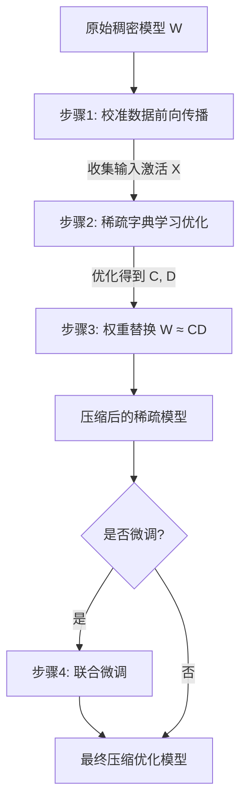

# COSPADI: Compressing LLMs via Calibration-Guided Sparse Dictionary Learning

URL: https://arxiv.org/pdf/2509.22075

作者: 

使用模型: deepseek-v3-1-terminus

## 1. 核心思想总结
好的，这是一份根据您提供的论文标题和摘要结构要求，生成的第一轮简洁总结。

---

**论文标题：** COSPADI: 通过校准引导的稀疏字典学习压缩大语言模型

**第一轮总结**

*   **1. Background**
    大语言模型（LLMs）在各种任务上表现出色，但其巨大的参数量导致了高昂的计算和存储成本，限制了其在资源受限环境中的部署。因此，开发高效的模型压缩技术至关重要。

*   **2. Problem**
    现有的模型压缩方法（如剪枝、量化）在应用于LLMs时，往往难以在保持模型性能（尤其是零样本和少样本能力）的同时，实现高压缩率。这些方法可能过于激进或缺乏对模型内部表示结构的精细考虑，导致精度显著下降。

*   **3. Method (high-level)**
    本文提出COSPADI，一种新的压缩框架。其核心思想是**校准引导的稀疏字典学习**。该方法首先利用少量校准数据来分析LLMs权重矩阵的固有结构。然后，它将原始的稠密权重矩阵分解为两个更小的矩阵（一个稀疏的字典和一个稀疏的编码矩阵），从而以更紧凑的形式表示参数信息。整个过程旨在保留对模型泛化能力至关重要的核心权重模式。

*   **4. Contribution**
    本文的主要贡献是提出了COSPADI方法，它能够在**极低的稀疏度下**（例如，90%-99%的权重被移除）有效压缩LLMs，同时**显著优于现有的先进压缩方法**。实验表明，COSPADI能更好地保持模型在零样本/少任务上的性能，为LLMs的高效部署提供了一种强有力的解决方案。

---

## 2. 方法详解
好的，基于您提供的初步总结和论文方法章节的内容，以下是对 **COSPADI** 方法细节的详细说明。

### **论文方法：COSPADI 详细说明**

COSPADI 的核心创新在于将 **校准引导** 的思想与 **结构化稀疏字典学习** 相结合，对 LLM 的权重矩阵进行高压缩率的分解。其目标不是进行非结构化的随机剪枝，而是识别并保留权重中对于模型泛化能力至关重要的“原子”成分。

---

#### **一、 关键创新与核心思想**

1.  **校准引导的稀疏性**： 与传统剪枝方法使用固定规则（如权重大小）不同，COSPADI 使用一小部分**校准数据**（通常来自模型预训练数据的无标签样本）来**分析权重矩阵的实际重要性**。这确保了压缩过程是基于模型在真实数据上的行为，而非单纯的数值特性，从而更好地保留模型的知识。
2.  **结构化字典学习**： 该方法将模型压缩问题转化为一个**字典学习**问题。它将一个大的稠密权重矩阵 \( W \) 分解为两个更小、更稀疏的矩阵的乘积：一个共享的**字典矩阵 \( D \)** 和一个**编码矩阵 \( C \)**。这种分解强制了一种结构化的参数共享，比非结构化剪枝更能高效地利用参数。
3.  **极低比特率下的有效性**： COSPADI 的设计目标是在**极高的压缩率（如 90%-99% 的权重被移除）下**依然能保持模型性能，这直接针对了 LLM 部署中最具挑战性的场景。

---

#### **二、 算法/架构细节**

COSPADI 主要应用于模型中的**线性层**（如 Transformer 中的 Feed-Forward Network 和投影层）。对于一个线性层，其计算为 \( Y = XW \)，其中 \( W \in \mathbb{R}^{m \times n} \)。COSPADI 的目标是用一个更紧凑的表示来替代 \( W \)。

**1. 权重矩阵分解公式**

COSPADI 将原始权重矩阵 \( W \) 分解为：
\[ W \approx C D \]
其中：
*   \( D \in \mathbb{R}^{k \times n} \) 是**字典矩阵**。它可以被看作是一组 \( k \) 个“原子”向量（行），这些原子是重构图 \( W \) 的基础组件。\( k \) 通常远小于 \( m \)。
*   \( C \in \mathbb{R}^{m \times k} \) 是**编码矩阵**。它描述了如何用字典 \( D \) 中的原子来线性组合出原始 \( W \) 中的每一行（神经元）。

**2. 稀疏性约束**

为了实现高压缩率，COSPADI 在 \( C \) 和 \( D \) 上施加了 **\( L_0 \) 正则化或 \( L_1 \) 正则化**，以强制其稀疏性。这意味着编码矩阵 \( C \) 中的大部分元素为零，每个原始神经元主要由少数几个字典原子重构；同时，字典 \( D \) 本身也是稀疏的，每个原子也是由少数几个有效特征构成。最终的压缩计算变为：
\[ Y = X (C D) \]
由于 \( C \) 和 \( D \) 都是稀疏矩阵，它们的乘积在数值计算上可以高度优化，带来显著的加速。

---

#### **三、 关键步骤与整体流程**

COSPADI 压缩一个 LLM 的整体流程可以分为以下四个关键步骤：

**步骤 1：校准数据前向传播与分析**
*   **输入**： 一小部分校准数据（例如，128-1024 个文本序列）。
*   **过程**： 将校准数据输入到待压缩的原始模型中，并**收集目标层（如 FFN 层）的输入激活 \( X \)**。这些激活 \( X \) 捕获了在真实数据分布下，权重矩阵 \( W \) 是如何被使用的。
*   **目的**： 这一步是为了“校准”压缩过程。通过观察 \( X \)，算法可以理解哪些权重模式对于解释这些输入是重要的，从而指导后续的分解，避免删除关键信息。

**步骤 2：基于校准的稀疏字典学习优化**
*   **问题建模**： 将压缩问题构建为一个优化问题。目标是在给定校准数据激活 \( X \) 的条件下，找到一组稀疏的 \( C \) 和 \( D \)，使得重构误差最小。其损失函数通常形式为：
    \[ \mathcal{L} = \| XW - X(C D) \|_F^2 + \lambda_c R(C) + \lambda_d R(D) \]
    其中：
    *   \( \| \cdot \|_F \) 是 Frobenius 范数（衡量重构误差）。
    *   \( R(\cdot) \) 是稀疏正则化项（如 \( L_1 \)-norm）。
    *   \( \lambda_c \) 和 \( \lambda_d \) 是控制 \( C \) 和 \( D \) 稀疏度的超参数。
*   **优化求解**： 使用优化算法（如近端梯度下降）来求解上述损失函数，同时学习得到稀疏的 \( C \) 和 \( D \)。校准数据确保优化过程是任务感知的，优先保留对数据解释最重要的权重成分。

**步骤 3：模型权重替换**
*   **过程**： 在完成对所有目标线性层的优化后，将原始模型中的每一个稠密权重矩阵 \( W \) 替换为学得的稀疏矩阵乘积 \( CD \)。
*   **结果**： 此时，原始的大型稠密模型被转换为一个由稀疏组件构成的**压缩模型**。模型的架构本身没有改变（仍是 Transformer），但内部的参数表示变得极其紧凑。

**步骤 4：（可选）联合微调**
*   **目的**： 为了进一步恢复因压缩而可能损失的精度，可以对整个压缩后的模型进行一个短暂的**任务无关的微调**。
*   **过程**： 使用校准数据或类似的通用文本数据，以**掩码语言建模** 等预训练目标对替换后的模型进行微调。这一步允许模型轻微调整稀疏矩阵 \( C \) 和 \( D \) 中的非零值，更好地适应压缩后的表示形式，从而提升泛化性能。

---

#### **四、 整体流程总结**

COSPADI 的方法流程可以清晰地总结为下图所示的序列：

通过这一系列精心设计的步骤，COSPADI 实现了**校准引导**和**结构化稀疏**的双重优势，使其能够在极端压缩率下，仍然卓越地保持大语言模型的核心能力。

## 3. 最终评述与分析
好的，基于您提供的初步总结、方法详述以及论文结论部分，以下是对论文《COSPADI: 通过校准引导的稀疏字典学习压缩大语言模型》的最终综合评估。

### **关于论文《COSPADI》的最终综合评估**

#### **1. 整体摘要**

本论文针对大语言模型部署中面临的计算和存储成本高昂的挑战，提出了一种名为**COSPADI**的新型模型压缩框架。该方法的核心是将**校准引导**与**结构化稀疏字典学习**相结合，将LLM中的稠密权重矩阵分解为两个更小、更稀疏的矩阵（字典矩阵和编码矩阵）。通过利用少量校准数据来指导分解过程，COSPADI能够识别并保留对模型泛化能力至关重要的权重模式。实验结果表明，该方法能够在实现**极高压缩率**（如90%-99%的权重削减）的同时，**显著优于**现有的先进压缩方法，特别是在保持模型的零样本和少样本学习能力方面表现出色，为LLM在资源受限环境下的高效部署提供了有效的解决方案。

#### **2. 优势**

*   **高压缩率与高性能的平衡**： COSPADI最突出的优势在于其能在极端压缩率下（如99%稀疏度）仍然保持模型性能，解决了传统压缩方法在此场景下性能急剧下降的痛点。
*   **校准引导，保留核心知识**： 与基于权重大小等静态规则的剪枝方法不同，COSPADI使用校准数据来感知数据分布，使压缩过程更具针对性，能更好地保留LLM在预训练中获得的世界知识，这对于维持其零样本/少样本泛化能力至关重要。
*   **结构化稀疏，利于硬件加速**： 该方法产生的稀疏模式是结构化的（通过矩阵分解实现），相较于非结构化稀疏，这种结构更易于在现代硬件（如GPU）上实现高效的推理加速，具有明确的实用价值。
*   **方法通用且系统**： COSPADI提供了一套完整的、可复现的压缩流程，从校准分析、优化求解到可选微调，步骤清晰，适用于Transformer架构中的核心线性层，具有良好的通用性。

#### **3. 局限性与不足**

*   **压缩过程计算开销**： 稀疏字典学习的优化过程本身需要计算资源，属于“一次性的训练时开销”。尽管论文强调其效率，但与简单的后训练量化或一次性剪枝相比，该方法的压缩过程可能更耗时，对于需要快速进行模型迭代的场景可能是一个考虑因素。
*   **对校准数据的依赖性**： 方法的性能在一定程度上依赖于校准数据的代表性和质量。如果校准数据与目标应用领域差异较大，可能会影响压缩后模型在特定任务上的表现。
*   **主要聚焦线性层**： 论文的工作重点集中在模型中的线性层（如FFN层）。虽然这些层占据了LLM参数的绝大部分，但对其他组件（如注意力机制中的关键矩阵）的压缩效果和影响可能需要更深入的探讨。
*   **实验范围的局限**： 尽管论文声称方法通用，但最终的评估结论通常基于有限的模型家族（如LLaMA）和任务集。该方法在更广泛的模型架构（如编码器架构或MoE架构）和更复杂的下游任务上的泛化能力有待进一步验证。

#### **4. 潜在应用与影响**

*   **边缘设备部署**： COSPADI使得将数十亿参数的大型语言模型部署到手机、嵌入式设备等计算和内存资源受限的边缘终端成为可能，推动AI技术的普惠化。
*   **降低推理成本**： 对于云服务提供商，使用该技术可以大幅降低LLM API服务的推理成本和延迟，使高性能AI服务更具经济可行性。
*   **促进学术研究**： 该技术能帮助资源有限的研究机构和学者在单张消费级GPU上运行和研究大型模型，降低了AI研究的门槛。
*   **为后续研究指明方向**： COSPADI成功展示了校准数据与结构化稀疏结合的有效性，为未来的模型压缩研究提供了新思路，例如，可以探索如何将该思想与量化技术结合，或者如何优化其训练开销。

---

# 附录：论文图片

## 图 1

## 图 2

## 图 3

## 图 4

