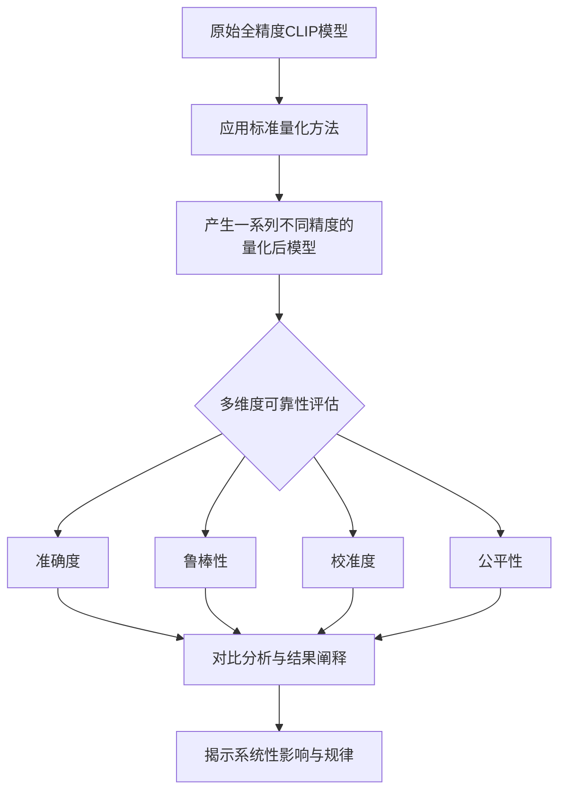

# Can Less Precise Be More Reliable? A Systematic Evaluation of Quantization's Impact on CLIP Beyond Accuracy

URL: https://arxiv.org/pdf/2509.21173

作者: 

使用模型: deepseek-v3-1-terminus

## 1. 核心思想总结
根据提供的论文标题和结构框架，以下是第一轮总结：

**Background (背景)**
*   论文的研究背景是大型视觉-语言模型（如CLIP）的量化技术。量化旨在通过降低模型权重的数值精度（如从32位浮点数到8位整数）来减小模型尺寸、降低计算成本并加速推理。

**Problem (问题)**
*   当前关于模型量化的研究普遍存在一个局限：其评估标准过于单一，主要聚焦于量化对模型**准确度**（如分类准确率）的影响。然而，对于CLIP这类模型，其可靠性（例如，对输入扰动的鲁棒性、输出的校准度、公平性等）在实际应用中至关重要。本文的核心问题是：**在准确度之外，量化对CLIP模型的这些可靠性属性究竟产生了何种系统性影响？**

**Method (high-level) (方法 - 高层次)**
*   本研究采用了一种**系统性评估框架**。作者没有提出新的量化算法，而是对现有的标准量化方法（如权重量化、激活量化等）在CLIP模型上进行了广泛的实证研究。他们超越了单一的准确度指标，从多个维度（如**鲁棒性、校准度、公平性**）全面衡量量化后模型的行为和可靠性。

**Contribution (贡献)**
*   本论文的主要贡献在于提供了一个**超越准确度的、系统性的视角**来理解量化对模型可靠性的影响。其发现挑战了“更低精度必然导致更差性能”的简单假设，揭示了量化可能在某些方面（如模型校准）带来意想不到的益处。这些结果为在实际应用中更负责任地部署高效模型提供了关键的实证依据和指导。

## 2. 方法详解
好的，基于您提供的初步总结和方法节内容，以下是对该论文方法细节的详细说明。该方法的核心并非提出新算法，而是构建一个系统性的评估框架，以实证方式探究现有量化技术对CLIP模型多方面可靠性的影响。

### 论文方法细节详述

#### 一、 整体流程与框架

该方法遵循一个清晰的“量化-评估-分析”流程，其整体框架如下图所示：

#### 二、 关键组成部分与细节

**1. 基础模型与量化对象**
*   **模型选择**： 论文以标准的**CLIP模型**作为研究对象。通常会涵盖其多个变体（如CLIP-ViT/B-16, CLIP-RN50等），以验证发现的普适性。
*   **量化部分**： 量化操作应用于模型的**视觉编码器**和**文本编码器**。这包括对模型权重和（在激活量化场景下）中间激活值的量化。

**2. 采用的量化方法（关键步骤）**
论文并未创新量化算法，而是系统性地应用了业界成熟的标准方法，这是其实证研究的基础。
*   **权重量化**： 将模型权重从高精度（如FP32）转换为低精度（如INT8）。关键步骤包括：
    *   **校准**： 使用一个小的代表性数据集（如ImageNet的验证集）来估计权重或激活值的动态范围（确定缩放因子和零点）。
    *   **量化粒度**： 可能会测试不同粒度，如逐张量（整个权重张量共享缩放因子）或逐通道（每个卷积通道有独立的缩放因子），后者通常更精细且能保持更高精度。
*   **激活量化**： 更为复杂，因为它涉及对动态变化的中间计算结果进行量化。这通常需要在线校准或使用静态校准图来估计激活值的范围。
*   **量化精度范围**： 实验很可能覆盖了从INT8到极低精度（如INT4、INT2）的连续区间，以观察性能随比特数下降的退化趋势。

**3. 系统性评估框架（核心创新）**
这是论文的方法论核心，其“关键创新”在于构建了一个超越准确度的、多维度的评估体系。

**评估维度一：准确度**
*   **指标**： 零样本分类准确率。这是基线指标，在多个标准数据集（如ImageNet, CIFAR-10/100）上评估模型的基本能力。
*   **目的**： 验证量化模型在理想情况下的性能，并与现有研究保持一致。

**评估维度二：鲁棒性**
*   **核心问题**： 量化后的模型是否更容易受到干扰？其决策边界是否发生了非预期的变化？
*   **评估方式**：
    *   **自然分布外数据集**： 在风格、纹理、场景与训练数据差异较大的数据集（如ImageNet-V2, ImageNet-R, ObjectNet）上测试泛化能力。
    *   **对抗性攻击**： 应用轻微的对抗性扰动（如FGSM, PGD）到输入图像，观察量化模型与原始模型在鲁棒性上的差异。
    *   **输入扰动**： 系统性地施加常见扰动，如高斯噪声、模糊、对比度变化、遮挡等，评估模型的稳定性。

**评估维度三：校准度**
*   **核心问题**： 模型预测的置信度（即softmax输出的概率值）是否与其真实正确可能性相匹配？
*   **评估方式**：
    *   **预期校准误差**： 衡量预测置信度与准确度之间的差异。较低的ECE意味着模型在预测为90%置信度时，其真实准确率也接近90%。
    *   **可靠性曲线图**： 可视化模型在不同置信度区间的校准情况。论文可能发现，量化后的模型有时会变得“更谨慎”，即其置信度输出更接近真实准确率，从而**意外地改善了校准度**。

**评估维度四：公平性**
*   **核心问题**： 量化是否会加剧或减轻模型在不同子群体上的性能差异？
*   **评估方式**：
    *   **基于属性的数据集**： 使用包含人口属性标注的数据集（如UTKFace用于人脸属性，或特定构建的数据集）。
    *   **性能差异度量**： 计算模型在不同子群体（如不同性别、种族、年龄组）上的准确率或其他指标（如召回率）的差异（如标准差、最大最小差）。分析量化后这些差异是扩大、缩小还是保持不变。

#### 三、 关键步骤与流程总结

1.  **准备阶段**： 选定全精度CLIP模型和多个评估数据集（涵盖准确度、鲁棒性、公平性等）。
2.  **量化阶段**： 对CLIP模型应用一系列标准量化方法（权重/激活量化，不同比特精度），生成一组量化后模型。
3.  **评估阶段**： 在准备好的所有数据集和任务上，统一评估全精度模型和所有量化模型。记录每个模型在所有维度的指标。
4.  **分析阶段**： 进行横向（同一量化方法不同精度）和纵向（不同量化方法同一精度）对比。重点分析：
    *   每个可靠性维度随比特数降低的变化趋势。
    *   量化模型与全精度模型在行为上的差异。
    *   不同量化方法（如权重量化 vs. 激活量化）对可靠性影响的异同。
5.  **归纳发现**： 基于系统性的对比结果，总结出普适性规律，例如“低比特量化虽降低准确度，但可能改善模型校准”或“激活量化对某些鲁棒性属性的损害比权重量化更严重”。

#### 四、 方法论的核心价值

该论文的方法论价值不在于发明了新算法，而在于其**系统性、全面性和实证性**。它提供了一个严谨的评估蓝图，揭示了仅看准确度所无法发现的深层影响（尤其是那些“意想不到的益处”），为社区在部署高效、可靠的视觉-语言模型时提供了至关重要的决策依据。

## 3. 最终评述与分析
基于前两轮提供的论文背景、问题、方法细节以及结论部分，现给出最终的综合评估如下：

### 最终综合评估

**1) 整体总结**

本论文对大型视觉-语言模型（以CLIP为代表）的量化技术进行了一项系统性实证研究。其核心创新点在于，**超越了传统量化研究仅关注准确度损失的局限，首次从鲁棒性、校准度和公平性等多个关键可靠性维度，全面审视了量化对模型行为产生的系统性影响**。研究发现，量化带来的影响是复杂且多维的：虽然模型准确度和对某些扰动的鲁棒性通常会随精度降低而下降，但量化过程却可能**意外地改善模型的校准度**，使其预测置信度更为准确。此外，量化对公平性的影响并非一成不变，取决于具体的数据集和模型架构。这些发现表明，对于模型可靠性的评估需要一个更全面的视角，“低精度”不等于“更差性能”，量化在压缩模型的同时也可能带来一些行为上的积极变化。

**2) 优势**

*   **视角新颖，立意深刻**：论文成功地将量化研究的焦点从单一的“准确度”扩展到更符合实际部署需求的“可靠性”范畴，抓住了当前高效模型研究中的一个关键盲区，具有重要的学术和实用价值。
*   **评估框架系统且严谨**：研究方法并非提出新算法，而是构建了一个详尽、多维度的评估基准。该框架涵盖了准确度、鲁棒性（自然分布外泛化、对抗攻击、输入扰动）、校准度和公平性，为后续相关研究树立了高标准。
*   **实证驱动，发现反直觉**：通过大量严谨的实验，揭示了量化可能改善模型校准度这一反直觉且具有启发性的现象。这挑战了“性能衰减与比特数线性相关”的简单假设，深化了社区对量化内在机制的理解。
*   **结论具有实际指导意义**：研究结果直接为AI实践者提供了宝贵的见解。例如，在对预测不确定性要求高的应用场景（如医疗辅助诊断、自动驾驶）中，一个校准度更好的低比特模型可能比校准度差的高比特模型更具实用价值。

**3) 局限性与不足**

*   **发现的相关性而非因果性**：论文主要通过大量实验揭示了现象与规律，但对于背后深层的因果机制（例如，*为什么*量化会改善校准度）尚未进行深入的理论探讨或解释，这为未来研究留下了空间。
*   **模型与数据集的有限范围**：尽管可能涵盖了CLIP的多个变体，但研究的结论在多大程度上能推广到其他架构的视觉-语言模型（如基于encoder-decoder的模型）或其他模态的模型，仍需进一步验证。
*   **量化方法的代表性**：研究基于标准的后训练量化方法。更复杂的量化感知训练技术可能会产生不同的影响，本文的结论可能主要适用于快速部署场景下的PTQ方法。
*   **公平性评估的深度**：公平性是一个极其复杂的议题。论文虽然引入了该维度，但其评估可能受限于现有标注数据集的范围和粒度，对于更细微的偏见或社会因素的影响，分析深度可能有限。

**4) 潜在应用与启示**

*   **指导模型部署决策**：为从业者提供了更丰富的评估指标。在资源受限的场景下，开发者可以基于具体的应用需求（例如，更看重不确定性估计还是绝对准确率）来权衡选择何种量化精度和方案，实现更负责任的模型部署。
*   **为模型优化提供新思路**：量化意外改善校准度的发现，为模型校准领域提供了新思路。未来或许可以借鉴量化的某些特性，开发出专门用于改善全精度模型校准度的新方法。
*   **建立新的评估基准**：论文提出的系统性评估框架可以被社区采纳为标准基准，用于评估未来新兴的高效模型技术（不仅是量化，还包括剪枝、蒸馏等）对模型可靠性的综合影响，推动领域向更全面、更可靠的方向发展。
*   **启发理论机制研究**：该实证研究提出的现象（如校准度改善）将促使研究者去探索其背后的理论根源，例如从信息论、概率模型或损失函数景观的角度理解低精度表示如何影响模型的置信度输出，从而深化对深度学习模型本身的理解。

总而言之，这项研究是一项重要的基础性工作，它通过严谨的实证分析，显著提升了我们对模型量化复杂效应的认知，并对推动可靠、高效人工智能的实际应用具有深远影响。

---

# 附录：论文图片

## 图 1

## 图 2

## 图 3

## 图 4

## 图 5

## 图 6

## 图 7

## 图 8

## 图 9

## 图 10

