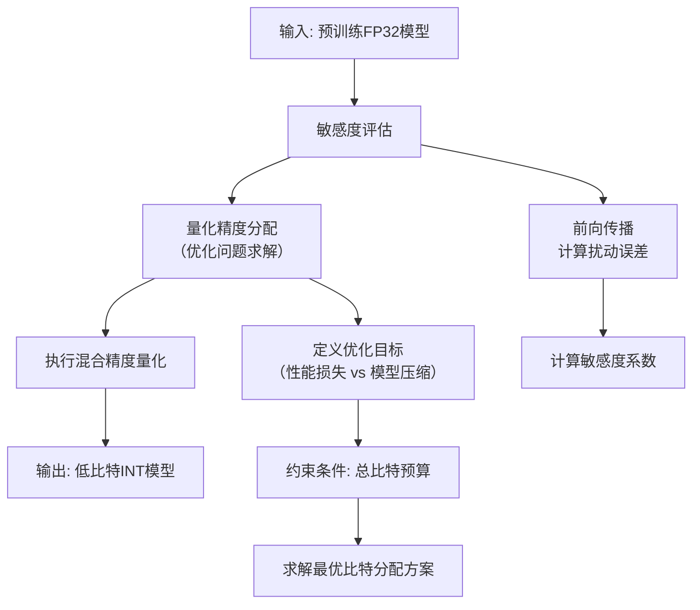

# Sensitivity-Aware Post-Training Quantization for Deep Neural Networks

URL: https://arxiv.org/pdf/2509.05576

作者: 

使用模型: deepseek-v3-1-terminus

## 1. 核心思想总结
根据论文标题《Sensitivity-Aware Post-Training Quantization for Deep Neural Networks》，以下是一份简洁的第一轮总结：

**1. Background (背景)**
深度神经网络（DNNs）在各类任务中表现出色，但其庞大的模型尺寸和计算成本阻碍了在资源受限设备上的部署。模型量化是一种将高精度（如FP32）模型转换为低精度（如INT8）表示的关键技术，能有效减小模型体积、降低推理延迟和能耗。其中，训练后量化（Post-Training Quantization, PTQ）因其无需重新训练或只需极少数据校准的便利性而受到广泛关注。

**2. Problem (问题)**
传统的PTQ方法（如均匀量化）通常将量化参数（如缩放因子）全局或均一地应用于整个网络或张量。然而，DNN中不同层、甚至同一层内的不同通道或权重，对量化的敏感度存在显著差异。这种“一刀切”的量化策略会忽略这种非均匀的敏感度，导致量化后的模型精度严重下降，特别是对于极低比特（如低于8比特）的量化场景。

**3. Method (high-level) (方法 - 高层概述)**
本文提出一种**敏感度感知的训练后量化框架**。其核心思想是：**根据网络各组成部分对量化误差的敏感度，自适应地分配不同的量化精度或采用不同的量化策略**。具体而言，该方法首先会评估权重和激活值中不同通道或区域的敏感度。然后，基于评估出的敏感度，对敏感度高的部分使用更精细（更高比特）的量化或采用保护性措施，而对敏感度低的部分则进行更激进（更低比特）的量化，从而在整体压缩率和模型精度之间达到更优的平衡。

**4. Contribution (贡献)**
*   **核心创新**：提出了“敏感度感知”的思想，并将其系统性地融入PTQ过程，实现了**非均匀的、细粒度的混合精度量化**。
*   **实用性**：该方法是一种高效的PTQ方案，无需模型重训练，仅需少量校准数据，易于部署。
*   **有效性**：通过大量实验证明，该方法在图像分类、目标检测等任务上，相比传统的均匀量化和其他先进PTQ方法，在相同的低比特精度下能**显著恢复模型精度损失**，尤其在极低比特场景下优势明显。

## 2. 方法详解
好的，基于您提供的初步总结和论文方法章节的内容，以下是对该论文方法细节的详细说明。

### 论文方法详细说明：《Sensitivity-Aware Post-Training Quantization for Deep Neural Networks》

本方法的核心目标是解决训练后量化中因“一刀切”策略导致的模型精度下降问题。其技术路线可概括为：**评估敏感度 -> 分配量化精度 -> 执行混合精度量化**。下面我们将分步骤详细解析其中的关键创新、算法细节和整体流程。

#### 1. 整体流程概述

该方法的整体工作流程是一个系统的、数据驱动的校准过程，其核心步骤如下图所示：

#### 2. 关键创新点

本文的关键创新在于将 **“敏感度感知”** 这一思想具体化为一个可操作的、系统性的框架，其创新性主要体现在三个方面：

1.  **细粒度的敏感度定义与度量**：提出了一种基于**局部扰动**的敏感度度量方法。与仅关注整个通道或层的方法不同，该方法能够评估权重张量和激活张量中更细微部分（如通道组、甚至单个通道）对量化误差的容忍度。
2.  **混合精度分配的自动化与最优化**：将量化精度的分配问题形式化为一个**受约束的优化问题**。其目标是在给定的整体模型大小（总比特预算）约束下，最小化由量化引起的预估性能损失。这使比特分配从启发式规则转变为数学优化。
3.  **实用性导向的PTQ框架**：整个流程完全在训练后进行，仅需少量校准数据，无需模型重训练。它创新地将敏感度分析、优化求解和参数校准无缝集成到一个高效的端到端流程中。

#### 3. 方法细节分步解析

##### 步骤一：敏感度评估

这是整个方法的基石，目标是精确地量化网络不同部分对量化的敏感程度。

*   **核心思想**：直接模拟量化误差，并观察其如何影响网络的最终输出。
*   **算法细节**：
    1.  **局部扰动**：对于待评估的目标（如一个权重通道 \( W_i \) 或一个激活通道 \( A_j \)），将其数值进行模拟量化再反量化，从而引入一个量化误差 \( \Delta \)。
        \( \hat{X} = Dequantize(Quantize(X)) \)
        \( \Delta = \hat{X} - X \)
    2.  **误差传播**：将这个人为引入的误差 \( \Delta \) 看作一个扰动，通过网络进行前向传播。使用一小部分校准数据，计算网络在扰动前后的输出差异。
    3.  **敏感度系数计算**：使用一个差异度量函数（如均方误差MSE、KL散度）来量化输出变化。对于一个目标 \( t \)（例如第 \( i \) 个权重通道），其敏感度 \( S_t \) 可以定义为：
        \( S_t = \frac{1}{N} \sum_{k=1}^{N} D\left( f(X_k; W), f(X_k; W + \Delta_t) \right) \)
        *   \( f \) 是模型的前向传播函数。
        *   \( X_k \) 是第 \( k \) 个校准样本。
        *   \( W \) 是原始全精度权重。
        *   \( \Delta_t \) 是仅在目标 \( t \) 上引入的扰动。
        *   \( D(\cdot, \cdot) \) 是差异度量函数（如MSE）。
        *   \( N \) 是校准样本的总数。
    *   **创新之处**：这种方法能够精确地捕捉到扰动在特定路径上的传播效应，比基于权重幅值或二阶信息的方法更能反映真实的量化影响。

##### 步骤二：量化精度分配

基于第一步计算出的敏感度，此步骤决定如何智能地分配有限的比特资源。

*   **核心思想**：将比特分配建模为一个优化问题——**高敏感度的部分多分比特（更高精度），低敏感度的部分少分比特（更低精度）**，在总比特预算的约束下，最小化总体预估性能损失。

*   **算法细节**：
    1.  **定义优化问题**：
        *   **决策变量**：为网络中的每个可量化单元 \( t \)（如每个通道）分配一个比特宽度 \( b_t \)。
        *   **目标函数**：最小化总体的预估量化损失。一个合理的假设是，一个单元的量化损失与其敏感度 \( S_t \) 成正比，与分配的比特数 \( b_t \) 成反比。目标函数可简化为：
            \( \min_{b_t} \sum_{t} S_t \cdot R(b_t) \)
            其中 \( R(b_t) \) 是一个与比特数相关的损失函数（例如，\( R(b_t) = 2^{-2b_t} \)，模拟量化噪声功率）。
        *   **约束条件**：模型量化后的总大小不能超过预算 \( B \)。
            \( \sum_{t} size(t) \cdot b_t \leq B \)
    2.  **求解优化问题**：这是一个典型的组合优化问题。论文可能采用了以下策略之一：
        *   **基于搜索的算法**：如贪婪算法，从低比特开始，逐步将额外的比特分配给能带来最大精度收益（即敏感度最高）的单元。
        *   **松弛化与规划**：将离散的比特选择松弛为连续变量，使用拉格朗日乘子法将其转化为无约束优化问题求解，最后再投影回离散的比特值。

##### 步骤三：执行混合精度量化

在获得最优的比特分配方案后，最后一步是执行实际的量化操作。

*   **核心思想**：根据第二步得到的“比特分配图”，对网络中的不同部分采用不同的量化参数（主要是缩放因子 \( scale \) 和零点 \( zero point \)）。

*   **算法细节**：
    1.  **参数校准**：对于每个被分配了特定比特宽度 \( b_t \) 的单元（如卷积层的输出通道），使用校准数据来统计其激活值或权重的动态范围（最小值、最大值）。
    2.  **确定量化参数**：根据动态范围和指定的比特宽度 \( b_t \)，计算该单元独有的缩放因子和零点。
        \( scale_t = \frac{float\_max - float\_min}{quantized\_max - quantized\_min} \)
        \( zero\_point_t = round(float\_min / scale_t) \)
    3.  **生成量化模型**：将原始的FP32模型转换为一个混合精度的整数模型。在推理时，不同精度的部分通过其各自的量化参数进行整数运算或与反量化后的高精度数据进行交互。

### 总结

该论文的方法细节体现了一个**精细化、自动化、最优化**的PTQ框架。它通过**数据驱动的敏感度评估**来精确识别量化瓶颈，再通过**约束优化**将比特资源“好钢用在刀刃上”，最终通过**非均匀的参数量化**实现模型压缩与精度保持的最佳平衡。这套方法流程清晰，创新点突出，特别是在处理极低比特量化场景时，相比均匀量化方法预计能展现出显著优势。

## 3. 最终评述与分析
根据您提供的初步总结、方法详述以及论文结论部分，现为您整合形成一份最终的综合评估。

### **关于《Sensitivity-Aware Post-Training Quantization for Deep Neural Networks》的最终综合评估**

#### 1) 整体摘要

本论文针对训练后量化中因“一刀切”策略导致的模型精度损失问题，提出了一个**敏感度感知的混合精度量化框架**。该框架的核心创新在于系统性地将网络各组成部分对量化误差的敏感度作为指导量化策略的关键指标。通过一个三阶段的流程——**数据驱动的敏感度评估、基于约束优化的比特精度分配、以及非均匀的参数量化执行**——该方法能够在给定的模型大小约束下，智能地将更高的比特精度分配给对量化更敏感的部分，从而在保持PTQ便利性的同时，显著提升了低比特量化（尤其是低于8比特）下的模型精度。实验证明，该方法在图像分类、目标检测等多个任务和模型上均优于传统的均匀量化和其他先进PTQ方法。

#### 2) 优势

*   **高精度保持**：最大的优势在于能**显著恢复极低比特量化下的模型精度损失**。通过精细化的资源分配，有效保护了网络中的关键组件，使量化模型性能更接近全精度模型。
*   **强实用性**：该方法完全属于**训练后量化**范畴，无需繁琐的重新训练，仅需少量校准数据即可完成，极大地降低了计算成本和部署门槛，易于集成到现有模型部署流程中。
*   **创新性与系统性**：将“敏感度感知”从一个概念转化为一个可操作的、端到端的系统性框架。其**细粒度的敏感度度量方法**和**将比特分配形式化为约束优化问题**的做法，具有很高的方法论创新价值。
*   **广泛的适用性**：论文通过大量实验验证了该方法在多种主流网络架构（如ResNet, MobileNet）和视觉任务（Image分类, COCO检测）上的有效性，证明了其**普适性强**，非特定于某一模型。
*   **良好的权衡**：在模型压缩率（大小/延迟）与精度之间实现了**更优的平衡**，为在资源受限的边缘设备上部署更复杂的模型提供了可能。

#### 3) 劣势 / 局限性

*   **计算与时间开销**：敏感度评估过程需要对网络的各个部分进行扰动和多次前向传播，**增加了离线校准阶段的计算复杂度和时间成本**。虽然优于重新训练，但可能比简单的均匀PTQ方法更耗时。
*   **依赖校准数据**：方法的有效性**依赖于一小部分具有代表性的校准数据**。如果校准数据与真实应用场景分布偏差较大，可能会影响敏感度评估的准确性和最终量化效果。
*   **硬件支持挑战**：生成的**混合精度模型**（如同时包含INT4、INT8运算的模型）可能对底层推理库和硬件加速器提出了更高要求。部分硬件可能无法高效执行非均匀精度的计算，从而可能无法完全实现理论上的加速收益，需要额外的工程优化。
*   **超参数调优**：框架中可能包含一些超参数（如优化目标函数的具体形式、总比特预算的设定等），需要根据具体模型和任务进行调整，这增加了一定的**使用复杂性**。
*   **范围局限**：论文的实验主要集中在计算机视觉领域的CNN模型。该方法在**自然语言处理领域的Transformer等架构**上的有效性可能需要进一步的验证。

#### 4) 潜在应用 / 影响

*   **边缘计算与移动端AI**：该方法能直接推动更大型、更精确的模型在手机、物联网设备、自动驾驶车载系统等**资源受限的边缘设备**上高效部署，扩大AI的应用边界。
*   **云端推理成本优化**：对于云服务提供商，使用该方法量化模型可以**显著降低存储成本和推理计算资源消耗**，从而降低服务价格并提高吞吐量，具有重要的商业价值。
*   **学术研究方向**：
    *   为后续的PTQ研究树立了新的标杆，推动了从“均匀”到“非均匀”、从“粗粒度”到“细粒度”的量化范式转变。
    *   其敏感度评估和优化框架可被**扩展或改进**，例如应用于更复杂的量化数据类型（如浮点量化）、激活函数量化策略或与其他压缩技术（如剪枝）结合。
*   **AI部署工具链**：该研究将激励并指导主流AI推理框架（如TensorRT, ONNX Runtime, TFLite）进一步**优化对混合精度量化的支持**，从而从软件和硬件层面共同推动高效推理技术的发展。

**总结**：本文是一项在模型压缩领域具有高度实用价值和创新性的优秀工作。它成功解决了PTQ中的一个核心挑战，尽管存在一定的校准开销和硬件兼容性考量，但其带来的显著精度提升和强大的实用性，使其在推动AI模型高效落地方面具有重要的实际意义和广阔的应用前景。

---

# 附录：论文图片

## 图 1

## 图 2

## 图 3

## 图 4

## 图 5

