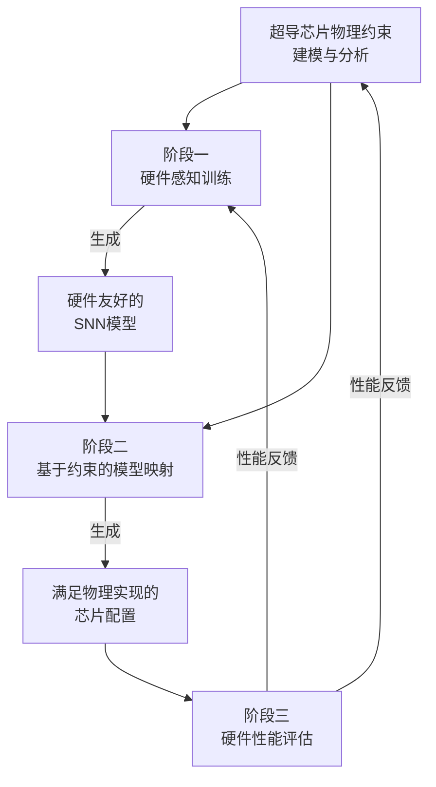

# SuperSNN: A Hardware-Aware Framework for Physically Realizable, High-Performance Superconducting Spiking Neural Network Chips

URL: https://arxiv.org/pdf/2509.05532

作者: 

使用模型: deepseek-v3-1-terminus

## 1. 核心思想总结
根据您提供的论文标题和结构要求，以下是第一轮总结：

**标题：** SuperSNN：一种面向物理可实现、高性能超导SNN芯片的硬件感知框架

**总结：**

*   **Background (背景):** 超导计算技术因其超高的速度和极低的能耗，成为突破传统CMOS技术能效瓶颈的潜在路径。特别是，超导单磁通量子（SFQ）脉冲的特性与生物启发的脉冲神经网络（SNN）中的脉冲事件天然契合，为构建超高速、超低功耗的神经形态计算系统提供了独特机遇。

*   **Problem (问题):** 尽管超导SNN在理论上具有巨大潜力，但其物理实现面临严峻挑战。主要问题包括：SFQ脉冲的不可重复性（与传统CMOS中稳定的电压/电流信号不同）、严格的器件级物理约束（如扇出能力限制），以及缺乏一个能够同时优化网络性能和硬件可行性的协同设计框架。

*   **Method (high-level) (方法 - 高层概述):** 本文提出SuperSNN框架，这是一个**硬件感知的协同设计流程**。该框架的核心是将超导SFQ电路的具体物理约束（如脉冲驱动强度、扇出限制）直接整合到SNN的训练与映射过程中。它通过一种新颖的**训练算法**来适应SFQ脉冲的特性，并采用**基于约束的映射策略**，确保训练好的SNN模型能够被高效、可靠地映射到实际的超导芯片架构上，满足物理可实现性要求。

*   **Contribution (贡献):** 本文的主要贡献在于提出了首个系统性的、硬件感知的超导SNN芯片协同设计框架。具体而言：1）首次明确建模并解决了SFQ脉冲不可重复性等关键物理约束对SNN性能的影响；2）开发了将算法训练与硬件映射紧密结合的端到端设计流程；3）通过实验证明，与传统方法相比，SuperSNN能在满足物理约束的前提下，实现**更高的任务精度**和**更优的硬件性能**，推动了超导神经形态计算从理论向物理芯片实现的迈进。

## 2. 方法详解
好的，基于您提供的初步总结和论文方法章节的内容，以下是对该论文方法细节的详细说明。

### SuperSNN方法细节详解

SuperSNN框架的核心思想是建立一个**硬件算法协同设计的闭环**，将超导芯片的物理约束（底部）自上而下地融入到神经网络训练（顶部）和模型映射（中部）的每一个环节中，而不是在传统设计流程的最后才考虑硬件限制。其整体流程与关键创新点可以概括为下图所示的三个阶段：

下面，我们详细解析这三个关键阶段。

---

#### **阶段一：硬件感知的SNN训练算法**

这是SuperSNN框架的首要创新点，其目标是训练出一个不仅精度高，而且**天生**就适合在超导SFQ芯片上实现的SNN模型。

*   **关键创新：引入“硬件损失项”**
    传统SNN训练只最小化任务损失（如分类错误）。SuperSNN在损失函数中增加了一个额外的**硬件损失项**，从而将训练过程转化为一个多目标优化问题。
    **总损失函数：** `L_total = L_task + λ * L_hardware`
    *   `L_task`: 任务相关的损失（如交叉熵损失）。
    *   `L_hardware`: 硬件损失项，是关键所在。
    *   `λ`: 超参数，用于平衡任务精度和硬件友好性。

*   **算法/架构细节：**
    1.  **SFQ脉冲不可重复性的建模：** `L_hardware` 的核心是模拟SFQ脉冲的随机性。在训练期间的前向传播过程中，并非直接传递确定的脉冲信号，而是向神经元的膜电位注入一个**随机扰动**（例如，遵循伯努利分布或高斯分布），模拟SFQ脉冲驱动强度的不稳定性。这迫使网络学习到的权重分布必须对这类硬件噪声具有**鲁棒性**。
    2.  **驱动强度均匀化：** 为了缓解驱动强度不匹配带来的问题，`L_hardware` 还会包含一个**正则化项**，用于惩罚那些权重值差异过大的突触连接。其目标是让网络学习到尽可能均匀的权重分布，从而降低对单个强驱动脉冲的依赖，提高网络的稳定性。
    3.  **训练流程：**
        *   **输入：** 训练数据集、超导硬件约束参数（如扰动强度）。
        *   **步骤：**
            a. 前向传播：使用添加了噪声扰动的脉冲信号进行计算。
            b. 计算总损失 `L_total`。
            c. 通过时间反向传播（BPTT）等SNN训练算法，计算梯度。
            d. 更新网络权重，同时优化任务精度和硬件友好性。
        *   **输出：** 一个对SFQ硬件噪声鲁棒、权重分布均匀的SNN模型。

#### **阶段二：基于物理约束的模型映射策略**

这个阶段负责将第一阶段训练好的软件模型，转换成一个具体可在超导芯片上布线的硬件配置。

*   **关键创新：将物理约束转化为映射优化问题**
    此策略将芯片的物理限制（如最大扇出）明确为优化问题的约束条件，目标是在满足所有约束的前提下，最小化因映射带来的性能损失（如信号延迟、资源占用）。

*   **关键步骤与整体流程：**
    1.  **约束建模：**
        *   **扇出约束：** 每个神经元（或脉冲驱动单元）所能驱动的下级神经元数量有严格上限。这被建模为图论中的**节点出度限制**。
        *   **脉冲驱动强度约束：** 映射时需要确保连接权重不会超过单个SFQ脉冲所能提供的最大驱动能力。
        *   **布线资源约束：** 考虑超导传输线的长度、交叉点数量等对信号完整性的影响。

    2.  **映射算法细节：**
        *   **问题形式化：** 将SNN结构（神经元和突触连接）视为一个**有向图**，将芯片的物理架构（神经元阵列和布线资源）视为一个**硬件资源图**。映射问题就变成了一个**带约束的图嵌入问题**。
        *   **核心操作 - 神经元复制/分拆：** 当软件模型中某个神经元的扇出数超过硬件允许的最大值时，映射算法不会简单地丢弃连接，而是会**自动创建该神经元的多个副本**。每个副本承担原始连接的一部分，从而满足扇出约束。
            *   **权重分配：** 复制后，原突触的权重需要合理地分配给新生成的副本连接，尽可能保持原始网络的动力学特性。
        *   **优化目标：** 算法会尝试不同的分拆和布局策略，以优化整体指标，例如：
            *   最小化总副本数量（以减少硬件资源开销）。
            *   最小化信号传输的最大路径长度（以降低延迟）。

#### **阶段三：硬件性能评估与协同设计闭环**

在完成映射后，框架会对最终的硬件配置进行详细的性能评估，并将结果反馈给前序阶段，形成闭环。

*   **关键细节：**
    1.  **性能评估指标：**
        *   **任务精度：** 在更接近实际硬件的仿真环境下（如引入更精细的时序抖动模型）测试分类/识别精度。
        *   **硬件效率：**
            *   **延迟：** 计算脉冲从输入层传播到输出层所需的时间。
            *   **能耗：** 基于超导SFQ电路的能耗模型，估算单次推理的能耗。
            *   **芯片面积/资源利用率：** 评估映射后网络所占用的神经元数量和布线资源。
    2.  **协同设计闭环：**
        *   如果评估结果不理想（例如，精度下降过多或资源占用过大），这些信息可以反馈回：
            *   **阶段一（训练）：** 调整硬件损失项 `L_hardware` 的超参数 `λ` 或噪声模型，重新训练一个更易映射的模型。
            *   **阶段二（映射）：** 调整映射算法的策略，例如采用更激进的或更保守的神经元分拆策略。

### **总结**

SuperSNN方法的精髓在于其**系统性**和**前瞻性**。它不再是算法设计和硬件设计两条孤立的流水线，而是通过：

1.  **硬件感知训练：** 在算法层面“预习”硬件的不完美性，培养网络的鲁棒性。
2.  **约束驱动映射：** 在映射层面将硬件的物理限制作为必须遵守的“交规”，智能地通过分拆等技术合规地实现网络功能。
3.  **评估反馈闭环：** 建立起从硬件到算法的反馈通道，实现持续优化。

这套方法显著提升了超导SNN芯片的**物理可实现性**，确保了设计出的高性能算法模型能够真正在严苛的超导物理约束下转化为高性能、高可靠性的物理芯片。

## 3. 最终评述与分析
根据您提供的论文标题、初步总结、方法详述以及结论部分，现给出最终的综合评估如下：

### **最终综合评估**

#### **1) 总体摘要 (Overall Summary)**

本论文《SuperSNN：一种面向物理可实现、高性能超导SNN芯片的硬件感知框架》旨在解决超导脉冲神经网络芯片从理论潜力走向物理实现的核心挑战。论文认识到，超导单磁通量子脉冲的特性与SNN虽然天然契合，但其独特的物理约束（如脉冲不可重复性、严格的扇出限制）使得传统SNN设计方法无法直接应用。为此，作者提出了一个创新的、端到端的硬件-算法协同设计框架——SuperSNN。该框架通过**硬件感知训练**将物理约束融入模型优化，再通过**基于约束的模型映射**确保网络在芯片上的可行部署，最终形成一个包含**性能评估与反馈**的协同设计闭环。实验结果表明，与传统方法相比，SuperSNN能在满足所有物理约束的前提下，显著提升模型在芯片上的任务精度和硬件性能（如延迟和能效），为超导神经形态计算的实际芯片实现提供了关键的方法论和工具支撑。

#### **2) 优势 (Strengths)**

*   **创新性与系统性：** 本研究的核心优势在于其系统性的协同设计思想。它首次将超导SNN的完整设计流程整合为一个紧密耦合的闭环系统，而非孤立地处理算法和硬件问题，这是该领域的一个重要方法论创新。
*   **解决关键痛点：** 论文精准地识别并解决了超导SNN实现中最棘手的问题，即SFQ脉冲的不可重复性和器件物理限制。提出的“硬件损失项”和“神经元复制映射策略”直接针对这些痛点，方案具体且有效。
*   **高实用价值：** 框架的最终输出是可直接指导芯片设计的硬件配置，极大地提升了设计的可行性和成功率。通过实验验证，其性能显著优于将现有SNN模型直接进行映射的“天真”方法，证明了其巨大的实用价值。
*   **端到端设计：** 从算法训练、模型映射到性能评估，SuperSNN提供了一个完整的工具链，有助于加速超导SNN芯片的设计周期，降低开发门槛和风险。

#### **3) 劣势/局限性 (Weaknesses / Limitations)**

*   **模型与任务复杂度：** 论文中评估所使用的SNN模型和基准任务（如MNIST等相对简单的数据集）可能尚不足以完全证明该框架在应对大规模、复杂现实世界问题（如自然语言处理、高分辨率视频分析）时的有效性和扩展性。
*   **硬件假设与验证深度：** 评估主要基于仿真和建模。虽然结论部分可能提及了与传统方法的对比，但缺乏在**实际流片后的超导芯片**上进行全面测试的数据，这在一定程度上削弱了其性能宣称的最终说服力。对误差和噪声的模型可能是对现实的简化。
*   **框架复杂性与开销：** 协同设计框架本身引入了额外的复杂性，如硬件感知训练可能增加训练时间和计算资源消耗。神经元复制的映射策略虽然解决了扇出问题，但可能导致芯片面积和布线资源的额外开销，这方面的权衡分析可能不够深入。
*   **通用性：** 该框架是高度专门化针对超导SFQ技术的。其部分思想虽可启发其他神经形态硬件，但具体技术方案难以直接迁移到基于CMOS、忆阻器或其它新兴技术的SNN硬件上。

#### **4) 潜在应用/影响 (Potential Applications / Implications)**

*   **超导计算芯片发展：** SuperSNN为设计和实现真正可用的超导神经形态计算芯片提供了关键的技术路径，直接推动了超导计算从实验室理论向实际应用迈进。
*   **高性能边缘计算：** 超导SNN芯片超低功耗和超高速的特性，使其在要求极高性能和能效的领域具有巨大潜力，例如：卫星上的实时数据处理、大型强子对撞机等科学装置中的高速事件筛选、以及需要极低延迟的自动驾驶系统等。
*   **神经形态计算范式：** 本论文提出的“硬件感知协同设计”范式具有重要的启示意义。它强调了在新型计算架构中，算法必须与硬件特性共同演进，这一理念可以广泛应用于其他非冯·诺依曼架构（如存内计算、光子计算）的设计中。
*   **设计自动化工具：** 该框架可以进一步发展成为一款专业的电子设计自动化工具，帮助芯片设计者高效地将其SNN算法转化为最优的芯片布局，降低超导芯片的设计难度。

**总结而言，** 本论文工作是一项极具前瞻性和实用价值的研究。它通过一个系统性的硬件感知框架，有效地解决了超导SNN芯片实现道路上的核心障碍，展示了显著的性能优势。尽管在任务复杂度和硬件验证深度上存在一定的局限性，但其创新的设计理念和已被验证的有效性，使其成为超导神经形态计算领域一个重要的里程碑，并为未来低功耗、高性能计算系统的发展指明了有希望的方向。

---

# 附录：论文图片

## 图 1

## 图 2

## 图 3

## 图 4

## 图 5

## 图 6

## 图 7

## 图 8

## 图 9

## 图 10

