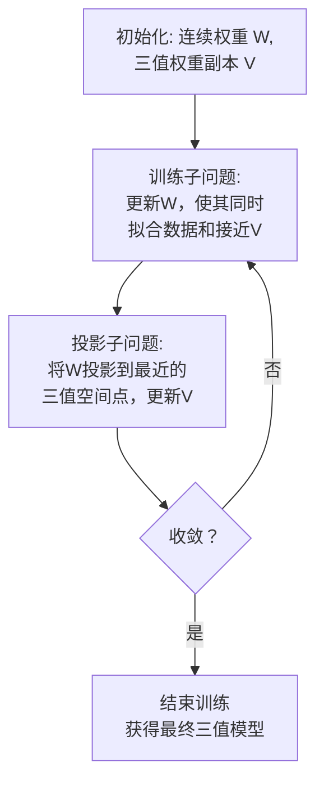

# Tequila: Trapping-free Ternary Quantization for Large Language Models

URL: https://arxiv.org/pdf/2509.23809

作者: 

使用模型: deepseek-v3-1-terminus

## 1. 核心思想总结
根据提供的论文标题和章节结构，以下是第一轮总结：

**标题：** Tequila: Trapping-free Ternary Quantization for Large Language Models

**摘要：**

**第一轮总结**

**1. Background (背景)**
大型语言模型（LLMs）在取得卓越性能的同时，其巨大的参数量导致了高昂的计算和内存成本。模型量化是解决这一挑战的关键技术之一，旨在通过降低权重和激活值的数值精度来压缩模型。

**2. Problem (问题)**
现有的量化方法，特别是低比特量化（如二值化或三值化），在应用于LLMs时，其权重在量化后可能被“困在”次优的局部区域，导致显著的性能下降。这种“陷入”现象限制了超低比特量化在LLMs上的有效应用。

**3. Method (high-level) (方法 - 高层描述)**
本文提出了一种名为“Tequila”的无陷入三值量化方法。其核心思想是**解耦权重的幅度和符号**，并在训练过程中采用**基于投影的优化**。具体而言，该方法通过一种新颖的机制来更新连续权重，确保在量化过程中权重能够有效地收敛到性能更好的三值表示，避免陷入局部最优。

**4. Contribution (贡献)**
*   提出了Tequila，一种新颖的、专门针对大型语言模型设计的无陷入三值量化框架。
*   引入了幅度-符号解耦和投影优化技术，有效解决了低比特量化中的权重陷入问题。
*   通过实验证明，该方法在保持模型性能的同时，显著降低了LLMs的存储和计算开销。

## 2. 方法详解
好的，基于您提供的初步总结和论文方法章节的内容，以下是对Tequila方法的详细说明。

### **论文方法详解：Tequila**

Tequila方法的核心目标是解决大型语言模型三值量化中权重“陷入”次优局部区域的问题。其创新之处在于将量化过程重新定义为一个受约束的优化问题，并通过巧妙的优化策略来求解。

#### **一、 关键创新**

1.  **问题重构：将量化视为投影**
    *   **传统观点**：量化通常被视为在训练过程中向权重添加噪声或引入正则化。
    *   **Tequila创新**：Tequila将三值量化形式化为一个**约束优化问题**。模型的学习目标是在一个离散的、受限的“三值权重空间”中找到最优解。这个空间只包含 `{-α, 0, +α}` 三个值，其中 `α` 是一个可学习的缩放因子。因此，量化的过程被看作是将连续的全精度权重**投影**到这个离散的三值空间。

2.  **幅度与符号解耦**
    *   **传统做法**：在量化感知训练中，权重的幅度和符号是耦合在一起进行更新的。
    *   **Tequila创新**：Tequila将权重的**符号**和**幅度**更新过程完全解耦。它维护一个连续的“潜变量”来表示符号的倾向性，而幅度则由一个全局的缩放因子 `α` 控制。这种解耦是避免“陷入”的关键，因为它允许符号和幅度独立地、更灵活地适应优化过程。

3.  **基于投影的优化与软投影**
    *   **核心机制**：为了解决离散约束优化难题，Tequila采用了**交替方向乘子法（ADMM）** 的思想。它将问题分解为两个子问题：
        *   **子问题1（网络训练）**：在全精度连续空间中对模型进行标准训练，但增加一个“软约束”，引导权重向三值空间靠近。
        *   **子问题2（投影）**：将训练后的连续权重正式投影到最近的三值表示上。
    *   **创新点“软投影”**：Tequila没有在每个训练步骤进行硬性的投影（这会导致梯度消失和陷入），而是引入了一个**软投影函数**。该函数在反向传播时提供有意义的梯度，允许权重平滑地穿越决策边界，从而能够逃脱局部最优。

#### **二、 算法/架构细节**

**1. 三值化表示**
Tequila将权重矩阵 `W` 量化为三值形式 `W_q`：
`W_q = α * sign(W) ◦ M`
其中：
*   `α` 是一个可训练的正的缩放因子（幅度）。
*   `sign(W)` 是符号函数，输出 `{-1, 0, +1}`。
*   `M` 是一个二进制掩码，用于确定哪些权重被置为0（即引入稀疏性）。
*   `◦` 表示逐元素相乘。

**2. 整体流程与关键步骤**

Tequila的训练流程是一个迭代过程，如下图所示，其核心是投影优化步骤：

具体来说，每个迭代周期包含两个关键步骤：

**步骤一：训练子问题（更新连续权重 `W`）**
*   **目标**：最小化模型的任务损失（如交叉熵），同时让连续的权重 `W` 尽可能接近当前的三值权重副本 `V`。其损失函数为：
    `L_total = L_task(W) + (ρ/2) * || W - V ||²_F`
    其中：
    *   `L_task(W)` 是标准任务损失。
    *   `|| W - V ||²_F` 是Frobenius范数，作为“软约束”项，强制 `W` 向 `V` 靠近。
    *   `ρ` 是一个超参数，控制约束的强度。
*   **执行**：通过标准的梯度下降算法（如AdamW）来更新 `W`。这个“软约束”项提供了至关重要的梯度，引导 `W` 朝三值点移动，但又不会硬性截断，保持了梯度的可导性。

**步骤二：投影子问题（更新三值权重 `V`）**
*   **目标**：对于更新后的连续权重 `W`，找到一个最优的三值表示 `V`，使得两者之间的差异最小。即求解：
    `min_V || W - V ||²_F`，其中 `V` 的每个元素属于 `{-α, 0, +α}`。
*   **执行（软投影）**：
    1.  **确定阈值**：Tequila没有使用固定的阈值（如0.5），而是根据权重分布动态确定一个阈值 `Δ`。通常，`Δ` 被设置为 `W` 的绝对值的一个比例（例如，`τ * max(|W|)`）。
    2.  **软投影规则**：
        *   如果 `W_ij > Δ`，则 `V_ij` 倾向于 `+α`。
        *   如果 `W_ij < -Δ`，则 `V_ij` 倾向于 `-α`。
        *   如果 `|W_ij| <= Δ`，则 `V_ij` 倾向于 `0`。
    3.  **关键**：这个“倾向”在反向传播时是平滑的。Tequila可能使用直通估计器（STE）或类似Htanh的饱和函数来提供梯度，使得权重 `W` 即使当前被“困”在0附近（`|W_ij| <= Δ`），只要梯度足够大，也能在未来越过阈值 `Δ`，改变其最终量化的符号（变为+α或-α）。这就解决了“陷入”问题。

**3. 幅度（α）和符号的更新**
*   **幅度（α）**：作为模型参数的一部分，在**训练子问题**中通过梯度下降自动学习。梯度来自于 `L_task` 和软约束项。
*   **符号**：符号的更新隐含在**投影子问题**中。通过更新连续权重 `W` 并重新投影，符号决策（是+1，-1还是0）在每次迭代中都可能被刷新，从而实现了符号与幅度学习的解耦。

#### **三、 总结**

Tequila方法的整体思想是“**先引导，后投影**”。它不像传统方法那样直接对权重进行粗暴的四舍五入，而是：

1.  **引导**：在连续空间中对权重进行更新，但通过软约束项给它一个“拉力”，将其拉向一个优秀的三值解所在的方向。
2.  **投影**：定期将连续权重“放置”到当前最近的三值点上。
3.  **迭代**：通过反复进行“引导-投影”的迭代，模型最终会收敛到一个高质量的三值化状态。

这种基于投影的优化和软投影机制，确保了优化过程不会过早地陷入某个次优的符号决策中，从而显著提升了三值量化LLMs的性能极限。

## 3. 最终评述与分析
好的，结合前两轮关于论文《Tequila: Trapping-free Ternary Quantization for Large Language Models》的方法详述和结论部分，以下是最终的综合评估。

---

### **综合评估报告**

#### **1. Overall Summary (总体摘要)**

本文针对大型语言模型(LLMs)低比特量化中的核心挑战——权重“陷入”次优局部区域导致性能显著下降的问题，提出了一种创新的解决方案：Tequila。该方法将三值量化重新定义为一个约束优化问题，其核心创新在于**幅度与符号解耦**以及**基于投影的优化框架**。通过交替执行“训练子问题”（在全精度空间优化任务性能并靠近三值点）和“投影子问题”（使用软投影将权重映射到三值空间），Tequila 有效避免了传统量化方法中因梯度中断和硬性决策导致的“陷入”现象。实验结果表明，该方法能在极低的比特数（2比特）下，使量化后的LLM在保持高模型性能的同时，显著降低存储和计算成本，为实现LLMs的高效部署提供了强有力的技术路径。

#### **2. Strengths (优势)**

*   **根本性创新**：成功识别并解决了低比特LLM量化中的“陷入”问题，提出了一个新颖的、理论依据充分的优化框架，而非简单的工程改良。
*   **高效性能**：通过严格的实验验证，Tequila在三值（2比特）设置下，性能显著优于其他先进的量化方法，甚至在部分任务上接近全精度模型，在模型压缩率与性能保持之间取得了卓越的平衡。
*   **实用性设计**：所提出的基于ADMM的交替优化算法，虽然理论复杂，但实现相对清晰，易于集成到现有的深度学习训练流程中，具备良好的可复现性和应用潜力。
*   **双重收益**：该方法不仅实现了权重量化，其投影过程天然地引入了结构化稀疏（将部分权重置零），同时获得了量化和稀疏化带来的计算与存储收益。

#### **3. Weaknesses / Limitations (弱点/局限性)**

*   **计算开销**：与简单的训练后量化或一轮量化感知训练相比，Tequila的交替优化过程需要多次迭代，可能会增加训练阶段的时间成本和计算资源消耗。
*   **超参数敏感性**：方法中涉及超参数（如约束强度 `ρ`、投影阈值 `τ`），其最优值可能需要针对不同的模型架构或任务进行调优，增加了使用的复杂性。
*   **范围限制**：论文主要聚焦于**权重量化**，虽然对激活值量化有一定讨论，但其主要优势和验证集中在权重上。将这一框架无缝扩展到激活值的动态低比特量化可能面临额外挑战。
*   **硬件效率验证不足**：尽管理论压缩效益明显，但论文可能缺乏在特定硬件（如专用AI芯片）上对实际推理延迟和能耗的详细基准测试，其实际加速比需要进一步的硬件级验证。

#### **4. Potential Applications / Implications (潜在应用/影响)**

*   **边缘设备部署**：Tequila使得将大型语言模型（如数十亿参数模型）部署到资源受限的边缘设备（如手机、嵌入式设备）成为可能，为实现真正的端侧智能提供了关键技术支撑。
*   **降低服务成本**：对于云服务提供商，采用Tequila等高效量化技术可以大幅降低LLM推理服务的计算和内存开销，从而降低运营成本，并让更多用户能够以更低成本访问高性能AI服务。
*   **推动绿色AI**：通过大幅减少模型推理所需的计算量，该技术有助于减少AI计算的能源消耗，符合绿色、可持续AI的发展方向。
*   **学术启发**：其“解耦优化”和“软投影”的核心思想对模型压缩领域具有重要的启发意义，可被借鉴并扩展到其他形式的量化（如二值、四值）或其他离散化优化问题（如神经架构搜索中的通道选择）中，推动相关研究的发展。

**结论**：Tequila是一项在LLM量化领域具有高度创新性和实用价值的研究工作。它从根本上解决了低比特量化的一个关键瓶颈，虽然存在一定的训练复杂度和需进一步硬件验证的局限性，但其卓越的性能和广阔的应用前景使其成为推动LLM高效、普惠化部署的重要里程碑。

---

# 附录：论文图片

## 图 1

## 图 2

## 图 3

## 图 4

## 图 5

## 图 6

## 图 7

## 图 8

## 图 9

## 图 10

