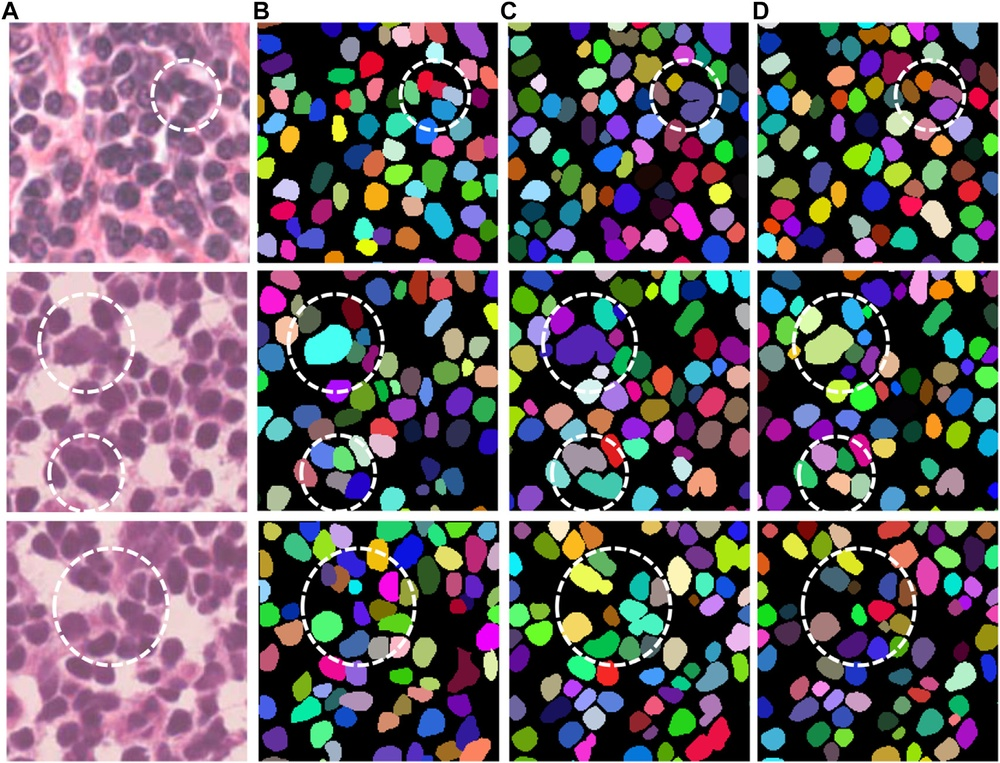
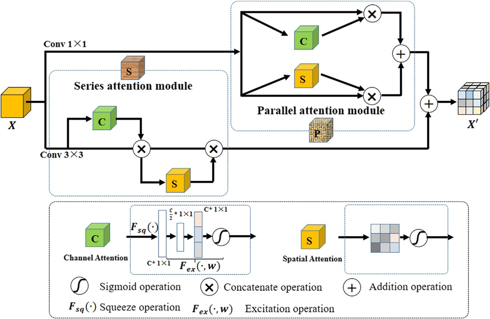
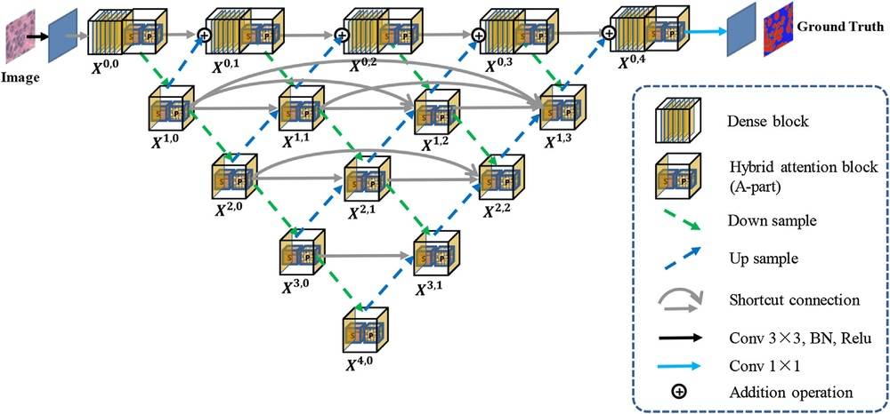
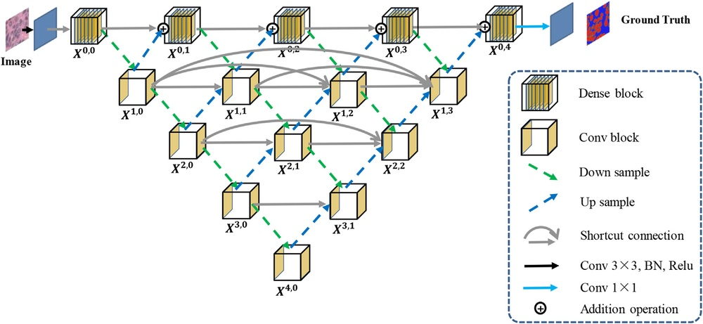

# A Hybrid-Attention Nested UNet for Nuclear Segmentation in Histopathological Images

**URL**: https://www.semanticscholar.org/paper/92713358f5748548b03c3130336b04b5f9028561
**提交日期**: 2021-02-17
**作者**: Hong-Ju He; Chi Zhang; Jie Chen; Ruizhe Geng; Luyang Chen; Yongsheng Liang; Yanchang Lu; Jihua Wu; Yongjie Xu
**引用次数**: 38
使用模型: deepseek-v3-1-terminus

## 1. 核心思想总结
这是一份关于论文《A Hybrid-Attention Nested UNet for Nuclear Segmentation in Histopathological Images》的第一轮总结，按四个部分组织如下：

**1. Background (背景)**
核分割是组织病理学图像计算机辅助分析中的关键步骤。准确的核分割对于疾病诊断、预后评估等具有重要意义。

**2. Problem (问题)**
组织病理学图像中的细胞核具有复杂性、多样性、高密度性，甚至存在重叠现象。这些因素使得精确分割细胞核，尤其是其边界以及小而密集的细胞核，成为一个极具挑战性的任务。

**3. Method (高层次方法)**
本文提出了一种名为Han-Net的混合注意力嵌套UNet模型。该模型包含两个核心模块：
*   **混合嵌套U型网络**：结合了嵌套多深度U型网络和全分辨率密集连接网络，旨在捕获更有效的特征。
*   **混合注意力模块**：用于探索注意力信息，并建立不同像素之间的相关性。
通过这两个模块，模型能够提取更具判别力的特征。

**4. Contribution (贡献)**
所提出的Han-Net模型在公开的多器官数据集上进行了测试，结果表明其性能超越了其他对比模型，达到了当前最先进的水平，能够有效分割复杂、多样以及小而密集的细胞核边界。

## 2. 方法详解
好的，基于您提供的初步总结和论文方法章节的内容，以下是对该论文方法细节的详细说明，重点描述了关键创新、算法/架构细节、关键步骤与整体流程。

### 论文方法详细说明

本论文提出的方法名为 **Han-Net**，其核心思想是通过一个精心设计的编码器-解码器架构，并结合强大的注意力机制，来解决组织病理学图像中细胞核分割的挑战。其整体架构可以分解为三个关键组成部分。

#### 一、整体架构：混合嵌套U型网络

Han-Net的整体骨架是一个**嵌套的、密集连接的U-Net变体**。它继承了U-Net的编码器-解码器结构，但进行了深度增强和连接优化。

**1. 关键创新与细节：**
*   **嵌套的跳跃连接**：与标准U-Net简单的跳跃连接不同，Han-Net引入了**嵌套的、密集的跳跃连接**。具体来说，解码器的每一层不仅接收来自编码器同等级的特征图，还接收来自**所有更深编码器层**（即更底层，具有更高语义信息）的上采样后的特征图。
*   **全分辨率保留**：网络在解码过程中，通过上采样和拼接操作，始终维持一条**全分辨率的信息流**。这确保了即使在深层的网络阶段，模型也不会丢失对分割至关重要的细微边界信息，这对于分割小而密集的细胞核至关重要。
*   **深度监督**：在解码器的每一层输出端，都连接了一个辅助的**1x1卷积层和Sigmoid激活函数**，用于产生该分辨率下的分割图。这种设计带来了两个好处：
    *   **缓解梯度消失**：通过多个输出点的损失计算，梯度可以更直接地反向传播到浅层网络，加速训练并提高稳定性。
    *   **多尺度特征融合**：最终的分割结果是所有尺度输出上采样到原图尺寸后的**加权平均或拼接再卷积**。这有效地融合了从粗到细的多尺度预测信息，提升了边界定位的准确性。

**整体流程（前向传播）如下：**
1.  **输入**：组织病理学图像块。
2.  **编码**：图像经过一系列下采样操作（如卷积+池化），特征图尺寸逐渐减小，通道数增加，从而捕获图像的上下文信息。
3.  **嵌套连接**：在解码器部分进行上采样时，每一层都会与编码路径上**所有对应及更深的层**进行特征拼接。
4.  **解码与输出**：解码器通过上采样和特征融合，逐步恢复空间分辨率。同时，每一解码层都会产生一个该分辨率下的初步分割图。
5.  **最终预测**：所有初步分割图上采样至输入尺寸，进行融合，生成最终的高精度核分割图。

#### 二、核心模块一：空间注意力模块

该模块被嵌入在**编码器和解码器之间的连接处**（即跳跃连接路径上），其目标是增强对细胞核**空间位置和边界**的关注。

**1. 关键创新与细节：**
*   **目的**：抑制图像中无关的背景区域，突出前景（细胞核）区域，尤其强化细胞核的边界响应。
*   **结构**：该模块是一个轻量级的子网络，通常包含以下步骤：
    1.  输入来自编码器的特征图。
    2.  通过一系列操作（如全局池化、卷积等）生成一个**空间注意力图**。这个图是一个单通道的、与输入特征图同宽高的矩阵，每个像素的值在0到1之间，表示该空间位置的重要性。
    3.  将这张注意力图与原始输入特征图进行**逐元素相乘**，从而对特征图的每个空间位置进行加权。重要的区域（如细胞核边界）被增强，不重要的区域（如均匀的细胞质）被抑制。
    4.  加权后的特征图再通过一个残差连接与原始输入相加，以确保信息不会丢失。

**2. 关键作用**：此模块使模型能够“学会”聚焦于那些难以分割的区域，如相互接触的细胞核边界，从而改善分割的精确度。

#### 三、核心模块二：通道注意力模块

该模块通常被放置在**编码路径的末端**（即瓶颈层附近），其目标是评估并强调特征图中哪些**通道（特征）** 对于细胞核分割任务是最具判别力的。

**1. 关键创新与细节：**
*   **目的**：不同的卷积核会提取不同类型的特征（如边缘、纹理、形状）。通道注意力机制能够自适应地重新校准通道维度上的特征响应，让模型更关注于对当前任务有用的特征。
*   **结构**：经典实现（如SENet）通常包括：
    1.  输入特征图经过全局平均池化，将每个通道的空间信息压缩为一个标量。
    2.  通过一个小的全连接网络（或1D卷积）来学习各个通道之间的非线性关系，并输出每个通道的权重。
    3.  将这些权重与原始特征图的对应通道进行**逐元素相乘**，放大重要通道的贡献，减弱次要通道的贡献。

**2. 关键作用**：由于细胞核的形态、染色深浅多样（复杂性、多样性），通道注意力机制可以帮助模型动态地选择对于识别特定类型细胞核最有效的特征，提升模型的泛化能力。

### 总结：Han-Net的工作流程与创新核心

1.  **输入**：病理图像进入混合嵌套U-Net架构。
2.  **特征提取与优化**：
    *   在**编码路径**上，特征被不断提取和压缩，并在路径末端由**通道注意力模块**优化，突出任务相关的特征通道。
    *   在连接到解码器之前，特征图经过**空间注意力模块**优化，突出细胞核的空间位置和边界。
3.  **特征融合与重建**：通过**嵌套的密集连接**，解码器融合了来自不同深度和分辨率的、已经过注意力机制优化的特征，逐步重建出精确的分割图。
4.  **输出**：结合多尺度的深度监督输出，得到最终的分割结果。

**关键创新核心**：本文的方法并非简单堆砌先进模块，而是**将“混合嵌套U-Net”的强大特征提取/融合能力，与“混合注意力机制”的精准特征筛选/增强能力进行了有机的结合**。嵌套结构保证了多尺度信息的有效流动，而混合注意力机制则像一双“慧眼”，引导网络在空间和通道维度上聚焦于最关键的信息，从而协同攻克了细胞核分割中的复杂性、高密度性和边界模糊等核心难题。

## 3. 最终评述与分析
根据您提供的初步总结、方法详述以及论文结论部分，现对该论文《A Hybrid-Attention Nested UNet for Nuclear Segmentation in Histopathological Images》进行最终的综合评估。

---

### **最终综合评估**

#### 1) Overall Summary (总体摘要)
本论文针对组织病理学图像中细胞核分割所面临的挑战（如细胞核形态复杂、尺寸多样、分布密集且常出现重叠），提出了一种新颖的深度学习模型——Han-Net。该模型的核心创新在于将**混合嵌套U型网络**与**混合注意力机制**进行深度融合。通过嵌套密集连接保留多尺度全分辨率信息，并结合空间与通道注意力模块动态聚焦于关键的细胞核边界和判别性特征，最终实现了高精度的细胞核实例分割。实验结果表明，Han-Net在公开的多器官数据集上超越了其他对比模型，达到了当前最先进的性能水平。

#### 2) Strengths (优势)
*   **架构设计精巧**：模型并非简单堆砌现有模块，而是有机地结合了嵌套UNet和注意力机制的优势，形成了协同效应。嵌套结构确保了细节和上下文信息的有效融合，而注意力机制则实现了对关键区域的精准聚焦。
*   **针对性强，解决核心难题**：方法设计直指细胞核分割的痛点，如**边界模糊**（通过空间注意力和全分辨率流解决）、**小目标检测**（通过深度监督和多尺度预测解决）和**特征判别力**（通过通道注意力解决）。
*   **性能卓越**：在公开数据集上的系统性实验充分证明了其有效性，性能达到SOTA水平，具有较强的说服力。
*   **技术细节扎实**：采用了**深度监督**等训练策略，有助于稳定训练过程并改善梯度流动，体现了方法实现的完备性。

#### 3) Weaknesses / Limitations (弱点/局限性)
*   **计算复杂度与效率**：模型集成了嵌套连接、密集连接和多个注意力模块，这可能导致模型参数量较大、计算成本较高，在计算资源受限的环境（如临床实时诊断系统）中的部署可能面临挑战。论文可能未充分讨论其推理速度。
*   **泛化能力的全面验证**：尽管在公开数据集上表现优异，但其在更大范围、更多样化的临床数据集（如来自不同医院、不同染色 protocol、不同器官或罕见疾病）上的泛化能力仍需进一步验证。模型对于训练数据未涵盖的细胞核形态或伪影的鲁棒性可能存疑。
*   **对超参数的敏感性**：复杂的模型通常包含较多超参数（如注意力模块的具体结构、嵌套连接的权重、损失函数中各部分损失的平衡等），模型的最终性能可能对这些超参数的选择比较敏感，其调优过程可能较为繁琐。
*   **可解释性**：虽然注意力图可以提供一定的可视化解释，但整体模型的决策过程仍然是一个复杂的“黑箱”，在要求高可信度的医疗应用中，这有时会被视为一个潜在的限制。

#### 4) Potential Applications / Implications (潜在应用/意义)
*   **数字化病理与精准医疗**：该技术可集成到计算机辅助诊断系统中，为病理医生提供定量、客观的细胞核分析工具（如核计数、形态测量、异型性评分），辅助进行癌症分级、预后预测和治疗反应评估，推动精准医疗的发展。
*   **生物医学研究**：在药物研发、基因组学关联研究等领域，高通量、自动化的细胞核分析可以极大地提升研究效率，帮助研究人员发现新的生物标志物。
*   **算法研究的启示**：所提出的“混合注意力”与“嵌套结构”相结合的思想，为其他密集预测型的医学图像分析任务（如腺体分割、血管分割、病变区域分割）提供了有价值的架构设计参考，具有重要的方法论意义。
*   **临床工作流优化**：通过自动化繁琐的手动分割任务，可以减轻病理医生的工作负担，提高诊断的一致性和效率，有望在未来改变传统病理学的工作模式。

---
**总结**：该论文提出了一种高效且创新的细胞核分割解决方案，在技术上具有显著优势并取得了领先的性能。其主要挑战在于模型的复杂性和在实际临床场景中的泛化与部署。然而，其成功实践对推动计算病理学的发展和相关算法研究具有重要的积极意义。

---

# 附录：论文图片

## 图 1

## 图 2

## 图 3

## 图 4

