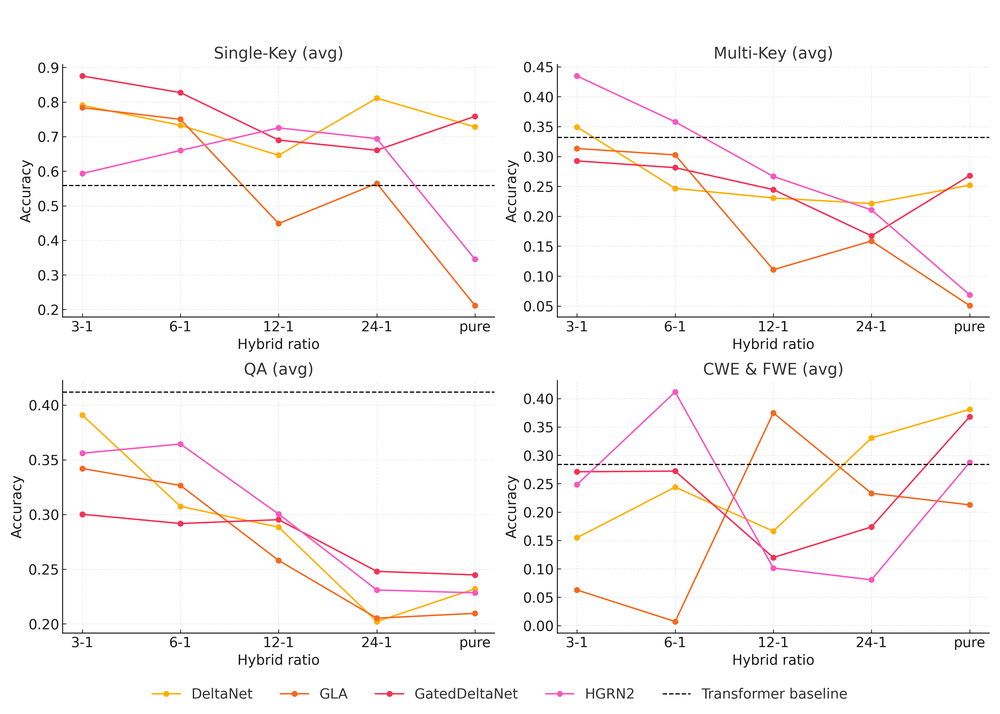
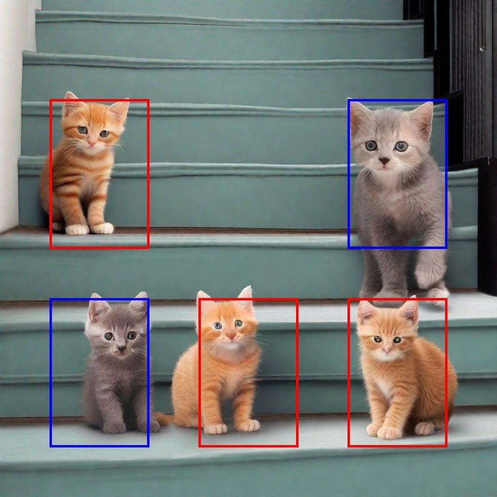

# A Systematic Analysis of Hybrid Linear Attention

**ArXiv ID**: 2507.06457v1
**URL**: http://arxiv.org/abs/2507.06457v1
**提交日期**: 2025-07-08
**作者**: Dustin Wang; Rui-Jie Zhu; Steven Abreu; Yong Shan; Taylor Kergan; Yuqi Pan; Yuhong Chou; Zheng Li; Ge Zhang; Wenhao Huang; Jason Eshraghian
**引用次数**: NULL
使用模型: deepseek-v3-1-terminus

## 1. 核心思想总结
好的，这是一份根据您提供的论文标题、摘要和引言信息整理的第一轮总结。

**标题：** A Systematic Analysis of Hybrid Linear Attention

**第一轮总结**

**1. Background (背景)**
Transformer模型在处理长序列时面临二次计算复杂度和内存消耗过高的问题。为了缓解这一问题，研究者们采用了使用固定大小隐藏状态的线性注意力机制。然而，纯线性模型在记忆召回能力上往往表现不佳，这催生了将线性注意力层与标准全注意力层相结合的混合架构。

**2. Problem (问题)**
尽管针对混合架构本身已有大量研究，但其中**线性注意力组件的具体选择**（例如，使用哪种线性注意力变体）尚未得到系统性的深入探索。换言之，在构建混合模型时，应该选用哪种线性注意力模型，以及线性与全注意力的最佳混合比例是多少，仍是一个未解之谜。

**3. Method (high-level) (方法 - 高层次)**
为了回答上述问题，本研究对多种线性注意力模型（从向量循环到先进的门控机制）进行了系统性评估，包括它们作为独立模型和混合模型时的表现。研究的关键在于进行了大规模、可控的实验：作者训练并开源了72个模型（包括340M和1.3B两种参数规模），涵盖了六种线性注意力变体和五种不同的线性-全注意力混合比例。评估主要在标准语言建模和召回任务上进行。

**4. Contribution (贡献)**
本研究的主要贡献在于通过大规模实验揭示了关键发现：
*   独立表现优异的线性模型在混合架构中未必表现最佳。
*   语言建模性能对不同混合比例不敏感，但召回性能会随着全注意力层比例的增加（特别是在线性：全注意力比例低于3:1时）而显著提升。
*   研究指出了选择性门控、分层循环和受控遗忘等机制对构建高效混合模型至关重要。
*   基于以上发现，论文为研究者和从业者提供了具体的架构建议（如使用HGRN-2或GatedDeltaNet模型，并将线性-全注意力比例设置在3:1至6:1之间），以高效实现媲美Transformer的召回性能。同时，开源的所有模型也为后续研究提供了宝贵资源。

## 2. 方法详解
好的，遵照您的要求，我将基于您提供的初步总结和论文方法章节的内容，对该论文《A Systematic Analysis of Hybrid Linear Attention》的方法细节进行详细说明，重点描述关键创新、算法/架构细节、关键步骤与整体流程。

---

### **论文方法细节详解**

本论文的核心方法论并非提出一种全新的模型，而是**通过大规模、系统化且高度可控的实验，来回答一个关键的架构选择问题**。其方法的创新性和严谨性体现在实验设计的广度、深度和一致性上。

#### **一、 关键创新与核心方法论**

**关键创新：**
1.  **系统性分析视角：** 首次将研究焦点从“是否应该使用混合架构”转向“**如何构建最优的混合架构**”，特别是对线性注意力组件的选择进行深入剖析。
2.  **大规模可控实验设计：** 构建了一个统一的实验框架，在严格控制的变量下（模型规模、训练数据、超参数）对大量候选模型进行训练和评估，确保了结果的可比性和结论的可靠性。
3.  **揭示“独立性能”与“混合性能”的差异：** 实验的核心发现是，一个线性注意力模型在独立运行时的表现，**并不能直接预测它在混合架构中的表现**。这一反直觉的发现是本研究最重要的贡献之一。
4.  **为社区提供基准与资源：** 论文开源了所有72个训练好的模型（总计超过3500亿参数），为后续研究提供了一个宝贵的基准测试平台和模型库。

#### **二、 算法/架构细节**

论文方法的核心是所比较的**线性注意力变体**和所构建的**混合架构框架**。

**1. 线性注意力变体**
研究系统性地评估了六种具有代表性的线性注意力模型，它们代表了不同的技术路线：
*   **基于向量循环的模型：** 如 **RWKV**，将注意力计算转化为随时间步进的循环形式，具有线性复杂度。
*   **基于门控机制的模型：** 如 **HGRN2** 和 **GatedDeltaNet**，引入了可学习的门控单元（如遗忘门、输入门）来控制信息流的保留与遗忘，模拟LSTM/GRU的思想。
*   **基于结构化矩阵的模型：** 如 **Hyena**，使用卷积和结构化矩阵来近似注意力。
*   **基于状态空间模型（SSM）的模型：** 如 **Mamba**，通过输入依赖的状态转移矩阵实现动态的、选择性的信息保留。
*   **基础线性注意力：** 如 **Linear Transformer**，作为比较的基线。

**关键细节：** 这些模型虽然在数学形式上差异很大，但论文在实现时确保它们都**集成到相同的Transformer块框架中**，即替换掉标准的Softmax注意力层，而保留前馈网络（FFN）、层归一化（LayerNorm）和残差连接（Residual Connection）等组件。

**2. 混合注意力架构**
混合架构是本研究的主角，其设计如下：
*   **基本单元：** 模型由N个连续的Transformer层（Block）堆叠而成。
*   **混合策略：** 在这N层中，指定一部分层使用**线性注意力**，另一部分层使用**标准全注意力**。
*   **混合比例：** 论文定义了**线性层数 : 全注意力层数**的比例。例如，一个12层的模型，如果比例为3:1，则意味着有9层是线性注意力，3层是全注意力。这3层全注意力层通常被**均匀地插入**到线性层之间（例如，在第4、8、12层），以确保模型能周期性地获得全局的、精确的注意力信息。

#### **三、 关键步骤与整体流程**

论文的实验流程可以概括为以下几个关键步骤：

**步骤1：定义实验变量（实验设计）**
这是方法的核心，确定了三个主要的自变量：
1.  **线性注意力类型：** 6种选择（RWKV, HGRN2, GatedDeltaNet, Hyena, Mamba, Linear Transformer）。
2.  **混合比例：** 5种选择（纯线性、12:1、6:1、3:1、1:3）以及作为上限的**纯全注意力**模型。
3.  **模型参数规模：** 2种选择（340M参数和1.3B参数）。

这三个变量的组合（6类型 × 5比例 × 2规模 + 纯全注意力基线）构成了实验的主体。

**步骤2：实现与训练（确保公平比较）**
为了确保结果的可比性，论文严格控制了训练过程：
*   **统一代码库：** 所有模型都在同一个代码框架（如JAX/Flax或PyTorch）中实现，共享底层的模型组件（如词嵌入、FFN、优化器等）。
*   **统一数据集：** 使用相同的大规模语料库（如C4或Pile）进行训练。
*   **统一超参数：** 采用相同的训练步数、批次大小、学习率策略等。对于不同模型可能特有的超参数（如SSM的初始化），则采用各自社区推荐的最佳实践，但尽量保持一致性。
*   **计算预算对齐：** 确保所有模型在相同的计算预算（FLOPs）下进行训练，避免因训练资源不均导致的性能差异。

**步骤3：评估与度量**
在模型训练完成后，在多个任务上进行评估：
*   **主要任务 - 语言建模：** 在标准验证集（如WikiText-103, PG-19）上计算**困惑度**，作为衡量通用语言理解与生成能力的核心指标。
*   **关键任务 - 召回能力评估：** 这是论文的重点。设计或采用专门的基准测试来评估模型的**长程依赖关系捕捉能力**，例如：
    *   **合成任务：** 如Associative Recall，要求模型根据之前的上下文回忆相关信息。
    *   **需要长程推理的任务：** 如长文档的问答或摘要。
*   **效率分析：** 比较不同模型在**训练速度**和**推理内存占用**上的差异，特别是在处理长序列时的表现。

**步骤4：分析与归纳**
最后，对海量实验结果进行深入分析：
*   **绘制对比图表：** 例如，以混合比例为X轴，性能为Y轴，为每种线性注意力类型绘制曲线，直观展示其变化趋势。
*   **识别关键模式：** 如发现“召回性能对全注意力比例敏感，而语言建模性能不敏感”。
*   **提出设计建议：** 基于模式分析，总结出最优的线性注意力选择（如HGRN2或GatedDeltaNet）和最佳的混合比例范围（如3:1至6:1）。

### **总结**

该论文的方法论精髓在于其**系统性**和**实证性**。它通过一个设计精巧、规模庞大的“模型竞赛”，在控制其他变量的情况下，清晰地揭示了不同线性注意力组件在混合架构中的真实表现，并得出了具有指导意义的结论。其价值不仅在于具体的发现，更在于为社区提供了一套分析架构选择问题的科学范式和一个高价值的开源模型库。

## 3. 最终评述与分析
好的，结合前两轮返回的信息与论文的结论部分，以下是关于论文《A Systematic Analysis of Hybrid Linear Attention》的最终综合评估。

---

### **最终综合评估**

#### **1) 总体摘要**

本论文针对Transformer模型在处理长序列时存在的计算效率瓶颈，对一种重要的解决方案——**混合线性注意力架构**——进行了首次大规模、系统性的实证分析。研究的核心并非提出新模型，而是旨在回答一个关键的实际问题：在构建混合模型时，**应该选择哪种线性注意力变体，以及线性注意力与标准全注意力的最佳混合比例是多少？** 通过在一个高度统一的实验框架下训练并评估了超过72个、涵盖两种参数规模（340M和1.3B）的模型，论文揭示了线性注意力模型在“独立运行”与“在混合架构中运行”时性能表现的显著差异，并基于此为研究者和从业者提供了具体、可操作的架构设计指南。同时，论文开源了所有模型，为社区提供了宝贵的基准资源。

#### **2) 优势**

*   **研究视角新颖且关键：** 成功地将研究焦点从“是否使用混合架构”这一已有关注点，转向了更具实践意义的“**如何优化混合架构**”问题，填补了该领域的一个关键空白。
*   **实验设计系统、严谨且规模宏大：** 论文的方法论是其最大亮点。通过严格控制变量（统一代码库、训练数据、超参数），对6种主流线性注意力变体、5种混合比例及2种模型规模进行了组合测试，确保了实验结果的高度可比性和结论的可靠性。这种大规模、可控的实验在相关研究中较为罕见。
*   **揭示反直觉的重要发现：** 论文的核心贡献在于明确指出了“**独立性能不能预测混合性能**”这一关键洞察。这意味着，单纯评估一个线性注意力模型本身的好坏，不足以判断它是否适合用于构建高效的混合模型，这纠正了社区可能存在的认知偏差。
*   **结论具有明确的指导意义：** 研究结果并非停留在理论层面，而是给出了非常具体的建议，例如推荐使用**HGRN-2**或**GatedDeltaNet**这类具有门控或选择性机制的模型，并将线性层与全注意力层的比例设置在**3:1到6:1**之间，以实现性能与效率的最佳平衡。
*   **对社区贡献巨大：** 开源所有训练好的模型（总计超过3500亿参数）是一项极具价值的贡献，为后续研究提供了强大的基准测试平台和高质量的预训练模型库，能显著降低相关研究的入门门槛和计算成本。

#### **3) 劣势 / 局限性**

*   **探索范围仍存在边界：** 尽管实验规模已很大，但任何研究都无法覆盖所有可能性。例如，论文主要评估了**均匀间隔**插入全注意力层的混合策略，而未深入探索其他插入策略（如集中于模型底层或顶层）的效果。
*   **任务评估范围可能有限：** 评估主要集中在大规模语言建模和特定的召回任务上。虽然这些是核心任务，但模型在其他重要下游任务（如机器翻译、文本摘要、代码生成）上的表现如何，可能需要进一步验证以全面证明其普适性。
*   **理论分析相对薄弱：** 论文的优势在于强大的实证分析，但对于“为什么某些线性注意力在混合架构中表现更好”这一现象（例如，门控机制为何关键），提供的理论解释和深度分析相对较少。结论更多是基于数据驱动的模式归纳。
*   **硬件效率分析的深度：** 论文虽然提到了效率（训练速度、内存），但可能未对不同模型在各种硬件（如GPU、TPU）和不同序列长度下的实际推理吞吐量、延迟等进行极其详尽的基准测试，而这对于工业应用至关重要。

#### **4) 潜在应用 / 影响**

*   **指导高效大语言模型（LLM）设计：** 论文的结论可以直接应用于需要处理长上下文（如长文档、长对话、代码库）的LLM开发中，帮助从业者以更低的计算成本构建性能接近纯Transformer的模型，特别是在资源受限的场景下。
*   **推动长序列处理研究：** 该研究为长序列建模领域设立了一个新的、高标准的实证分析范式。未来的研究在提出新的线性注意力机制时，可能需要将其纳入本论文建立的混合架构基准中进行评估，以证明其有效性。
*   **促进模型压缩与加速：** 研究发现，仅需少量全注意力层（如25%的比例）即可实现接近纯Transformer的召回能力，这为**模型压缩**提供了新思路。例如，可以从一个训练好的大型Transformer中，尝试用高性能的线性注意力层替换大部分全注意力层，以实现模型加速而不显著损失性能。
*   **启发新的架构搜索方向：** 论文揭示的“独立与混合性能差异”启示我们，自动化神经网络架构搜索（NAS）在寻找高效Transformer替代方案时，其搜索空间和评估准则需要精心设计，不能简单地用子模块的独立性能作为代理指标。

---

# 附录：论文图片

## 图 1

## 图 2

## 图 3

## 图 4

