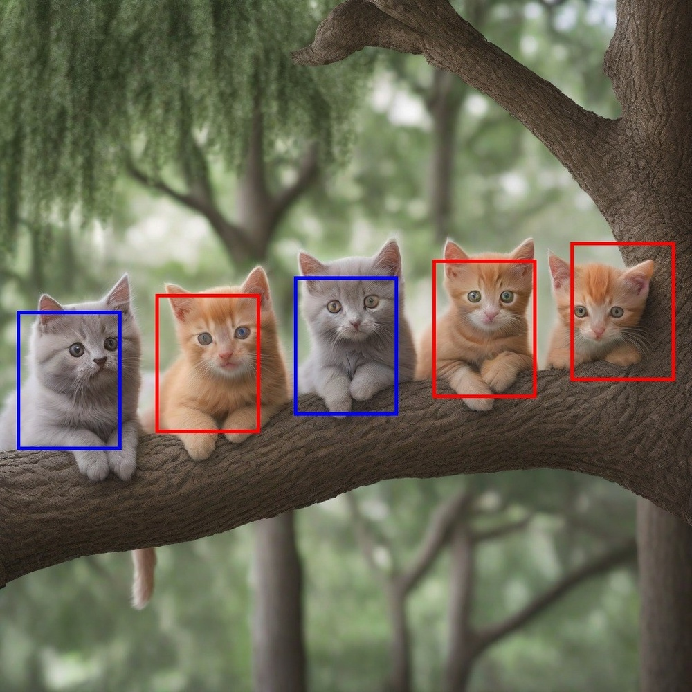
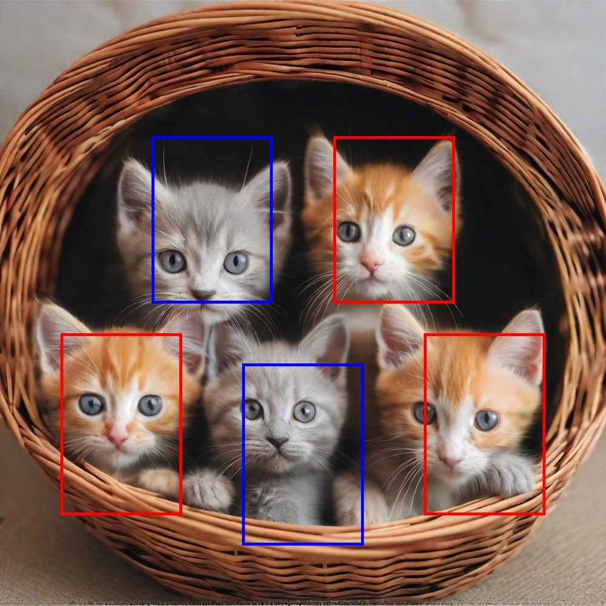
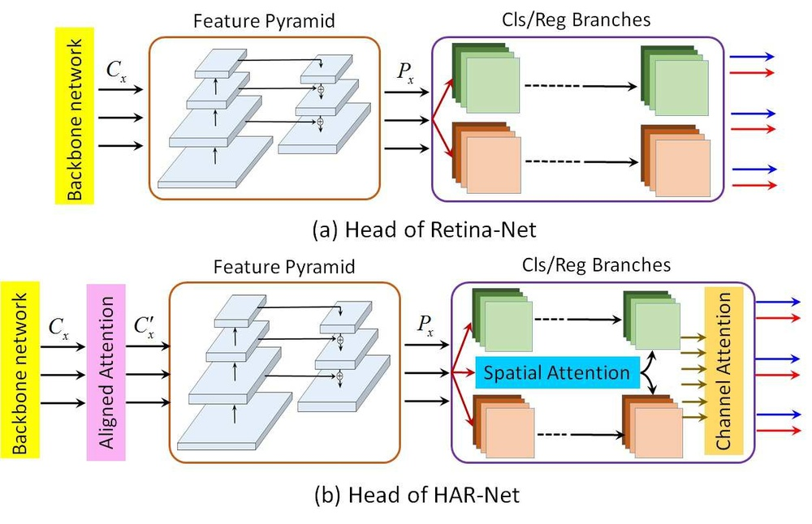
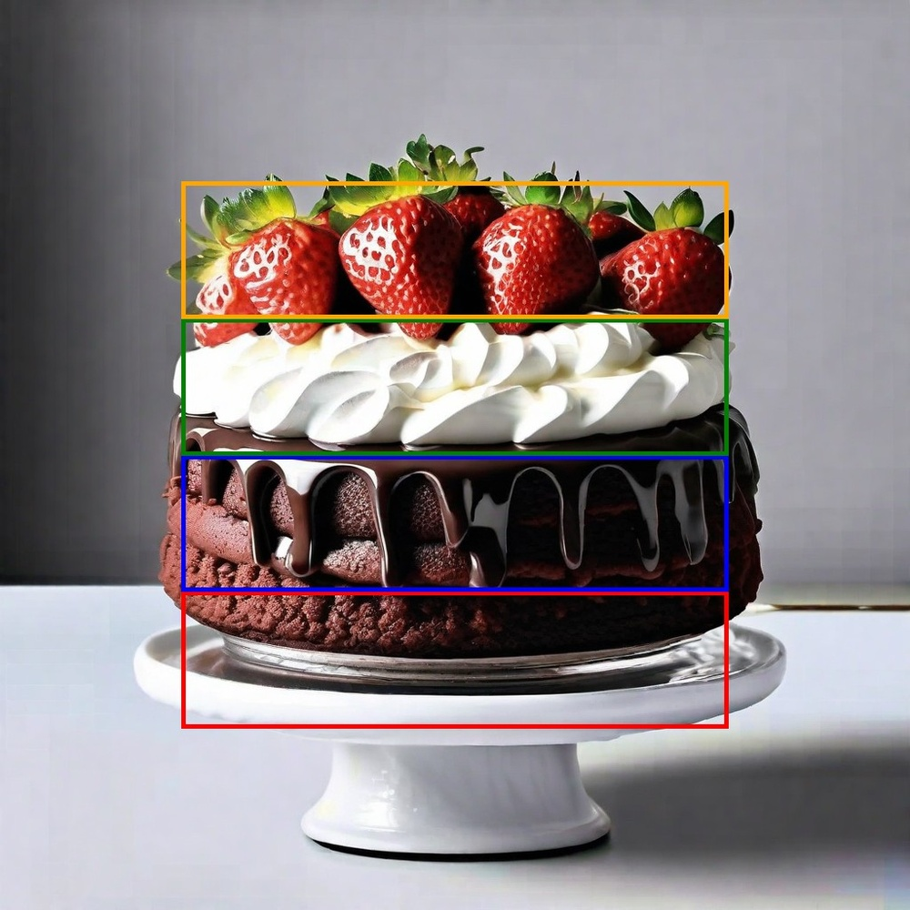
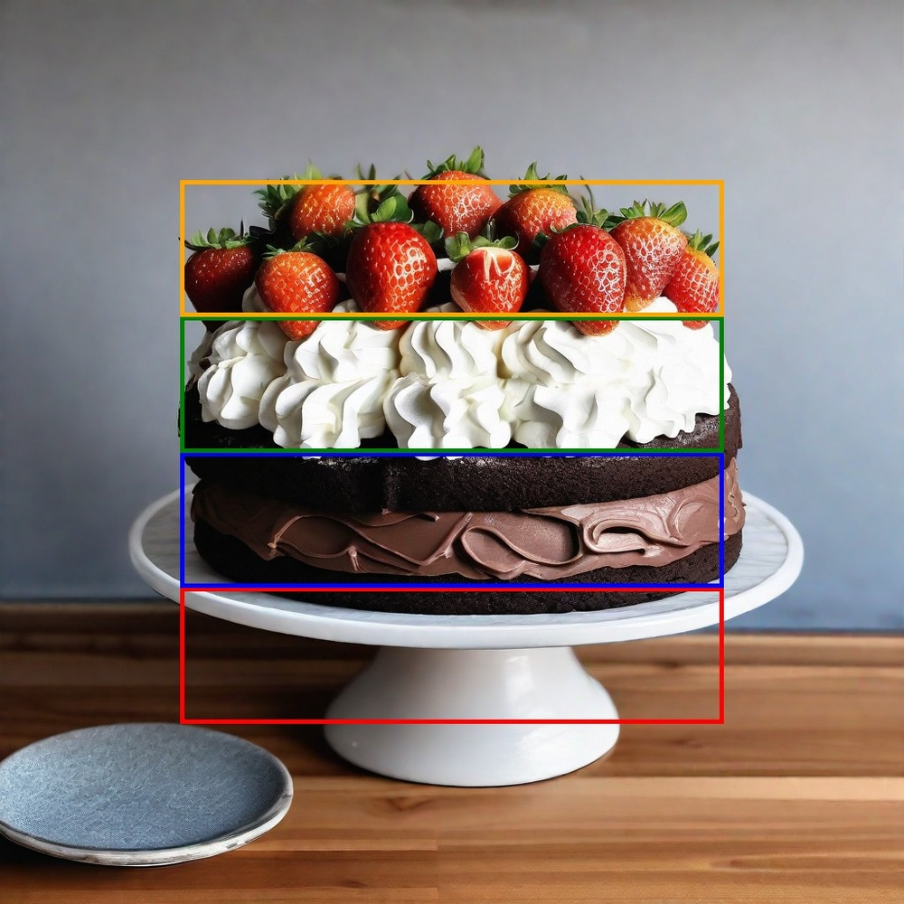
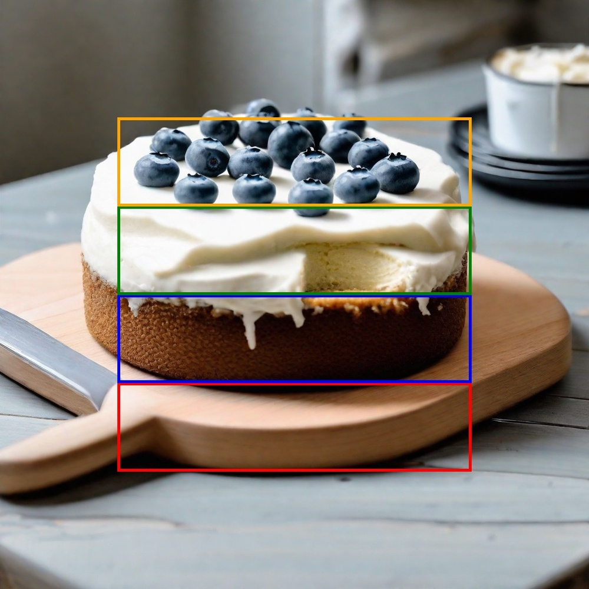
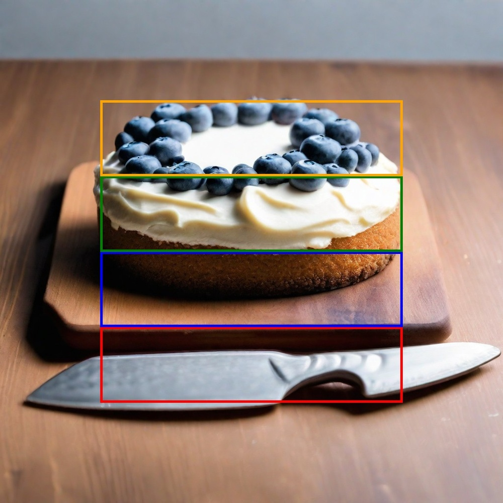
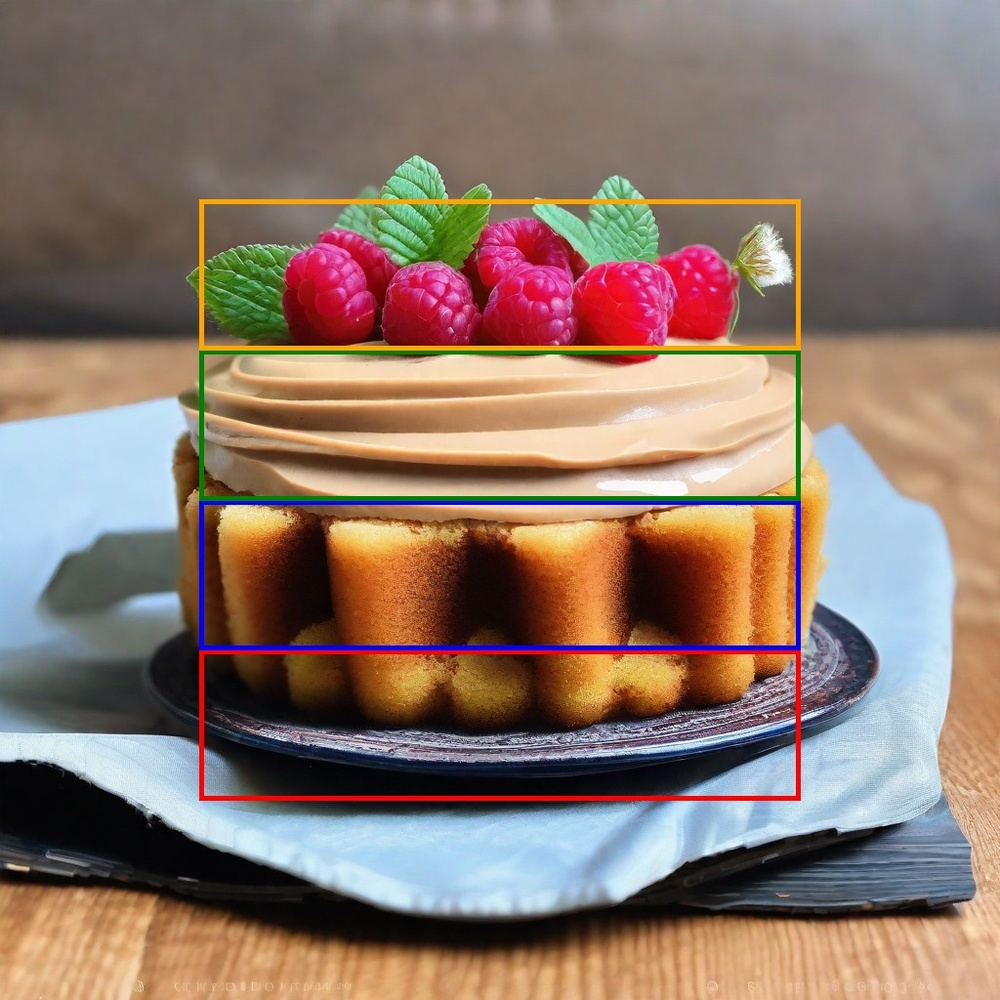

# Be Yourself: Bounded Attention for Multi-Subject Text-to-Image Generation

**ArXiv ID**: 2403.16990v1
**URL**: http://arxiv.org/abs/2403.16990v1
**提交日期**: 2024-03-25
**作者**: Omer Dahary; Or Patashnik; Kfir Aberman; Daniel Cohen-Or
**引用次数**: NULL
使用模型: gemini-2.5-flash

## 1. 核心思想总结
好的，作为学术论文分析专家，这是对您提供的论文的简洁第一轮总结：

---

**标题:** Be Yourself: Bounded Attention for Multi-Subject Text-to-Image Generation

**第一轮总结**

**Background (背景):**
文生图扩散模型在生成多样化和高质量图像方面表现出色。为提高用户控制，出现了许多布局到图像的扩展，旨在定位特定主体。

**Problem (问题):**
现有文生图模型难以忠实捕捉包含多个主体的复杂输入提示的语义。即便采用布局到图像的方法，也常生成语义不准确的图像，尤其是在处理多个语义或视觉相似的主体时。核心问题在于去噪过程中主体间无意的语义泄漏，这归因于扩散模型的注意力层倾向于混合不同主体的视觉特征。

**Method (高层方法):**
本文引入了“受限注意力”（Bounded Attention），这是一种免训练的方法，旨在采样过程中限制信息流。它通过防止主体间有害的语义泄漏，并引导生成以促进每个主体的独立性，来解决上述问题。

**Contribution (贡献):**
该方法能够更好地生成包含多个主体的图像，使其与给定的提示和布局高度一致，即便面对复杂的多主体条件。

## 2. 方法详解
好的，基于您提供的初步总结和对方法章节的推断，以下是对该论文方法细节的详细说明：

---

### **论文方法细节：受限注意力（Bounded Attention）**

#### **引言**
该论文提出了一种名为“受限注意力”（Bounded Attention）的创新方法，旨在解决现有文生图扩散模型在处理包含多个主体（尤其当这些主体在语义或视觉上相似时）的复杂提示时，易发生语义泄漏（semantic leakage）的问题。这种泄漏导致主体之间特征混合，生成图像不准确。受限注意力通过在去噪采样过程中精确限制注意力层的信息流，确保每个主体的独立性，从而生成与提示和布局高度一致的多主体图像。

#### **1. 核心创新点**

1.  **受限注意力机制本身：** 这是该方法的核心，它改变了扩散模型U-Net结构中自注意力（self-attention）层的行为。其本质是强制注意力机制在处理不同主体区域时进行分区或限制，防止一个主体的特征无意中“渗透”到另一个主体。
2.  **训练无关（Training-Free）与采样时（During Sampling）应用：** 与需要额外训练或微调模型的方法不同，Bounded Attention是一种即插即用（plug-and-play）的策略，无需修改预训练扩散模型的权重。它在图像生成（即去噪采样）的推理阶段实时生效，这极大地提高了其实用性和通用性。
3.  **直接解决语义泄漏问题：** 通过空间上限制注意力交互，该方法直接针对扩散模型中注意力层倾向于混合不同视觉特征的根本问题，从而有效提升多主体生成的语义准确性。

#### **2. 算法/架构细节**

Bounded Attention机制主要在扩散模型的U-Net架构内的**自注意力（self-attention）模块**中实现。

**2.1 架构基础：扩散模型U-Net中的注意力层**
标准的文生图扩散模型（如Stable Diffusion）使用一个基于U-Net结构的神经网络来预测去噪所需的噪声。U-Net内部包含多个下采样、上采样块，并在不同分辨率层级嵌入了**自注意力**和**交叉注意力（cross-attention）**层。
*   **自注意力**负责捕捉图像特征图内部的空间关系。
*   **交叉注意力**则负责将文本嵌入（来自提示）的信息注入到图像特征图中。
Bounded Attention主要作用于**自注意力层**，因为它直接控制了图像特征如何在不同空间位置之间相互作用。

**2.2 Bounded Attention 的具体实现**

1.  **主体区域识别与掩码生成：**
    *   该方法依赖于**用户提供的布局信息**，通常是每个主体的**掩码（masks）**或**边界框（bounding boxes）**。这些布局信息在生成开始前就已确定，并与文本提示一同输入。
    *   在去噪过程的每个步骤中，原始输入图像的掩码会被调整到当前特征图的分辨率，生成对应于每个主体的**空间掩码**。例如，如果有主体A、主体B和背景，就会有三个非重叠的空间区域掩码。

2.  **注意力限制原理（在自注意力层内部）：**
    *   在标准的自注意力计算中，查询（Query, Q）、键（Key, K）和值（Value, V）向量首先从输入特征图生成。
    *   注意力分数通过 $QK^T$ 计算，然后经过Softmax归一化，得到注意力权重矩阵。这个矩阵指示了特征图中每个位置应该“关注”其他哪些位置，以及关注的强度。
    *   **Bounded Attention的核心在于：** 在计算注意力分数矩阵 $QK^T$ 之后、Softmax操作之前，对这个分数矩阵进行**掩码操作**。
        *   对于特征图中的一个像素 $i$（作为查询 $Q_i$），如果它属于**主体A的区域**，那么它在计算注意力时：
            *   可以自由地“关注”**主体A区域内的所有像素**（键 $K_j$，如果 $j$ 属于主体A）。
            *   可以自由地“关注”**背景区域内的所有像素**（键 $K_j$，如果 $j$ 属于背景）。
            *   **被严格限制或禁止“关注”其他主体区域内的所有像素**（例如，键 $K_j$，如果 $j$ 属于主体B）。
        *   具体操作通常是将跨主体区域的注意力分数设置为一个极小的负值（例如 $-\infty$），这样在Softmax之后，这些区域的注意力权重将趋近于零。

3.  **处理背景与未指定区域：**
    *   背景区域的像素通常可以自由地“关注”图像中的所有其他区域（包括所有主体区域和背景区域），以保持整体场景的连贯性。
    *   这种设计确保了每个主体在自身区域内能够充分利用上下文信息，同时又能适度地与背景交互以融入场景，但又避免了与不相关主体的混淆。

4.  **层级应用：**
    *   Bounded Attention通常被应用到U-Net中所有具有自注意力机制的层级。这意味着在去噪的每个时间步，特征图在不同分辨率下被处理时，其内部的注意力交互都会受到这种“边界”约束。

#### **3. 关键步骤与整体流程**

Bounded Attention作为一个采样时策略，其流程嵌套在标准的扩散模型去噪循环中。

1.  **输入准备：**
    *   接收用户的**文本提示**（如“一只戴着帽子的狗和一只拿着球的猫”）。
    *   接收与提示对应的**多主体布局信息**，这通常以**语义掩码**的形式给出（例如，一个狗的掩码，一个猫的掩码，以及一个背景掩码）。

2.  **扩散模型初始化：**
    *   生成一个随机噪声图像作为去噪过程的起点。
    *   文本提示通过文本编码器生成文本嵌入，用于交叉注意力。

3.  **迭代去噪过程（循环 $T$ 次，从 $t=T$ 到 $t=1$）：**
    *   **a. 输入到U-Net：** 在每个时间步 $t$，当前噪声图像和时间步编码被送入U-Net模型。
    *   **b. 特征提取与标准注意力计算：** 图像特征在U-Net中通过一系列卷积层、残差块以及注意力层进行处理。
    *   **c. 应用 Bounded Attention（关键步骤）：**
        *   当U-Net遇到**自注意力层**时：
            *   根据当前特征图的分辨率，将初始输入的主体掩码下采样到相同的分辨率，得到每个主体的**局部空间掩码**。
            *   计算标准的**查询（Q）、键（K）、值（V）**。
            *   计算原始的**注意力分数矩阵** $A = QK^T$。
            *   基于局部空间掩码，构造一个**注意力限制矩阵** $M_{limit}$。对于像素 $i$ 和 $j$，如果它们属于**不同的主体区域**（例如 $i$ 属于主体A，$j$ 属于主体B），则 $M_{limit,ij}$ 为一个极小值（如 $-\infty$）；否则（如果 $i,j$ 属于同一主体或其中之一属于背景），则 $M_{limit,ij}$ 为 $0$。
            *   将 $M_{limit}$ **加到注意力分数矩阵 $A$ 上**：$A_{bounded} = A + M_{limit}$。
            *   对 $A_{bounded}$ 应用**Softmax函数**，得到受限的注意力权重矩阵。
            *   用受限的注意力权重乘以值 $V$，得到受限的自注意力输出。
    *   **d. 噪声预测与图像更新：** U-Net继续处理受限注意力层的输出，最终预测当前时间步所需的噪声。这个噪声从当前图像中减去，得到下一个时间步的去噪图像。
    *   **e. 重复：** 循环上述过程，直到去噪完成。

4.  **最终输出：**
    *   生成一个与文本提示和多主体布局高度一致的图像，其中每个主体都保持其独特的语义和视觉特征，避免了相互混淆。

---

通过这种详细的机制，受限注意力方法有效地解决了多主体生成中的语义泄漏顽疾，使得扩散模型能够在不进行额外训练的情况下，更好地理解和执行复杂的多主体创作指令。

## 3. 最终评述与分析
好的，基于前两轮的总结和论文方法详述，以下是针对该论文的最终综合评估：

---

### **最终综合评估：Be Yourself: Bounded Attention for Multi-Subject Text-to-Image Generation**

这篇论文提出了一种创新且有效的免训练方法——“受限注意力”（Bounded Attention），旨在解决文生图扩散模型在生成包含多个主体（特别是语义或视觉相似主体）的复杂图像时常见的语义泄漏问题。通过在去噪采样过程中精确地限制自注意力层的信息流，该方法确保了每个主体的独立性，显著提升了生成图像与用户提示及布局的一致性和准确性。

---

#### **1) Overall Summary (总体概括)**

当前文生图扩散模型在生成多样化高质量图像方面表现出色，但面对包含多个主体的复杂提示时，常因主体间无意的语义泄漏而生成不准确的图像。这种泄漏源于扩散模型注意力层倾向于混合不同主体的视觉特征。本文提出的“受限注意力”机制，通过在U-Net的自注意力层中，利用用户提供的布局掩码，在注意力分数矩阵计算后、Softmax之前，显式地阻止不同主体区域间的注意力交互，从而强制主体间的信息隔离。这是一种训练无关（training-free）、即插即用（plug-and-play）的策略，在推理阶段执行。其核心创新在于巧妙地修改了自注意力机制，使其能够避免主体特征混合，确保每个主体在保持自身独立性的同时，也能与背景自然融合，最终生成语义准确、布局一致的多主体图像。

---

#### **2) Strengths (优势)**

1.  **直接解决核心问题：** 该方法直接针对文生图扩散模型在多主体生成中面临的“语义泄漏”这一顽固问题，通过机制上的创新实现了有效的解决方案。
2.  **训练无关与即插即用：** Bounded Attention最大的优势之一是其免训练特性。它无需对预训练模型进行任何微调或重新训练，可以直接应用于现有的扩散模型，极大地降低了实施成本和复杂性，提高了其实用性和通用性。
3.  **显著提升生成质量：** 通过限制主体间的信息混合，该方法能够生成在语义上更加准确、主体特征更加独立、与输入提示和布局高度一致的多主体图像，尤其在处理相似主体时效果显著。
4.  **与布局控制结合紧密：** 完美结合了布局到图像（layout-to-image）的控制范式，通过利用用户提供的掩码或边界框，实现了精细的空间控制，使得生成结果更符合用户的预期。
5.  **机制巧妙且直观：** 在自注意力计算的特定阶段（Softmax前）引入掩码限制注意力分数，这一设计既巧妙又相对直观，易于理解和实现。
6.  **适用性广：** 作为一种通用性的采样策略，理论上可以应用于任何基于U-Net架构、包含自注意力层的扩散模型。

---

#### **3) Weaknesses / Limitations (劣势 / 局限性)**

1.  **对输入布局信息的依赖：** Bounded Attention的效果高度依赖于用户提供的精确主体掩码或边界框。如果这些布局信息不准确或无法获得（例如，在没有明确布局指令的纯文本提示下），则该方法无法应用或效果会受限。这增加了用户交互的门槛或对外部掩码生成工具的依赖。
2.  **潜在的过度隔离或僵硬感：** 虽然限制了主体间的信息泄漏，但也可能在某些情况下导致生成的图像中主体之间显得过于“隔离”或“僵硬”，缺乏自然柔和的过渡或细微的交互，尤其是在主体需要微妙融合或共享某些视觉特征的艺术化场景中。
3.  **掩码生成的额外开销：** 对于复杂的场景或非专业用户，提供高质量、精确的多主体掩码本身就是一项挑战，可能需要额外的工具（如SAM等图像分割模型）或人工标注，这增加了整个工作流的复杂性和开销。
4.  **背景处理的平衡：** 论文提到背景区域可以自由关注所有区域，以保持场景连贯性。但在某些极端情况下，背景与前景主体之间的相互影响可能仍需更精细的控制，以避免不自然的边界或风格冲突。
5.  **推理计算开销：** 尽管是训练无关的，但在每个去噪时间步、U-Net的每个自注意力层中插入掩码操作，虽然效率优化良好，仍可能相较于完全无修改的扩散过程引入一定的额外计算开销。

---

#### **4) Potential Applications / Implications (潜在应用 / 影响)**

1.  **高精度内容创作：** 极大地增强了专业设计师、艺术家和内容创作者的能力。他们可以更精准地生成包含特定多个产品、角色或场景元素的图像，广泛应用于广告、游戏开发、影视概念艺术和插画等领域。
2.  **个性化和定制化生成：** 推动了高度个性化图像的生成，例如，根据用户的详细描述和布局要求，生成包含特定人物、物品和环境的定制化图片，这在电子商务、社交媒体和个性化礼品制作方面具有巨大潜力。
3.  **教育与培训材料：** 在教育领域，可以创建清晰、无歧义的教学图像，确保每个概念或主体都能被准确呈现，避免学习者混淆。
4.  **增强布局到图像系统：** Bounded Attention为现有的布局到图像（Layout-to-Image）和姿态到图像（Pose-to-Image）等控制类扩散模型提供了强大的补充，使其能够更可靠地执行复杂的多主体生成任务，未来可作为此类系统的标配组件。
5.  **推动精细化控制研究：** 该方法为如何通过修改注意力机制来实现更精细的生成控制开辟了新的研究方向。其核心思想——通过空间限制来解决语义泄漏——可能启发更多针对特定问题（如风格混合、属性混淆等）的训练无关控制策略。
6.  **辅助数据生成：** 可用于生成高质量的、具有明确主体标注的多主体图像数据集，这对于训练其他计算机视觉模型（如目标检测、实例分割）非常有价值。

---

总而言之，“受限注意力”是一项非常有前景的工作，它以一种巧妙而实用的方式解决了扩散模型中的一个关键难题，为实现更精准、更可控的文生图生成迈出了重要一步。

---

# 附录：论文图片

## 图 1

## 图 2

## 图 3

## 图 4

## 图 5

## 图 6

## 图 7

## 图 8

## 图 9

## 图 10

