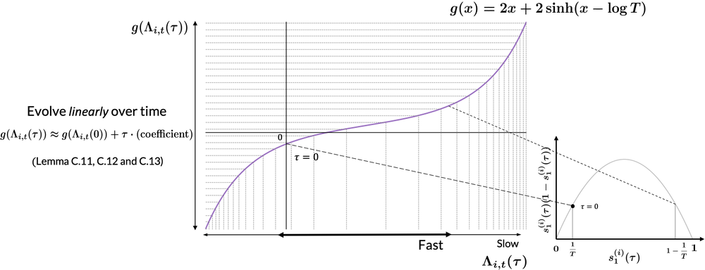
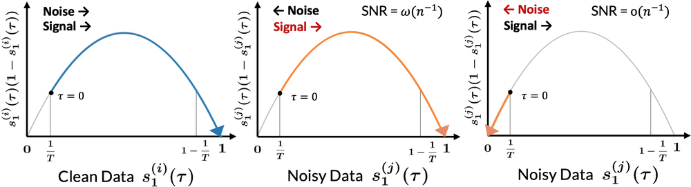
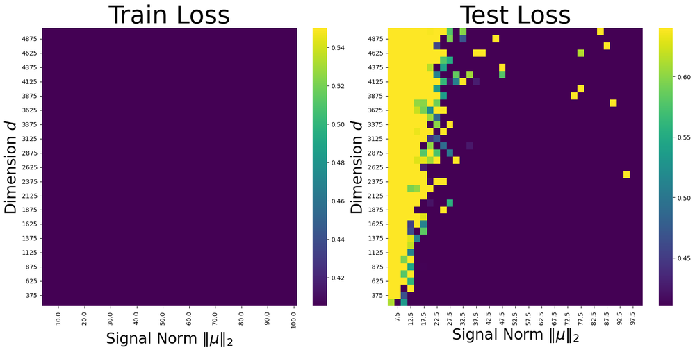
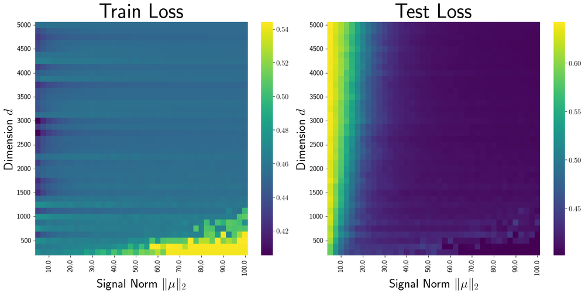
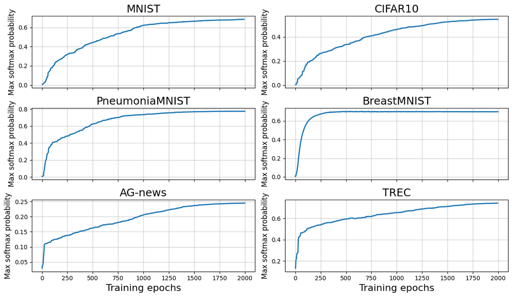
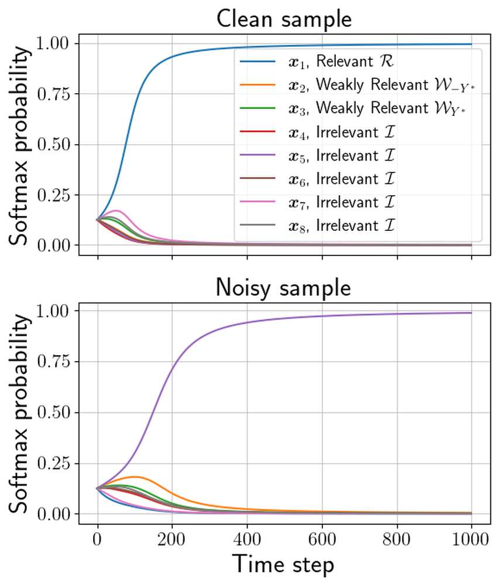
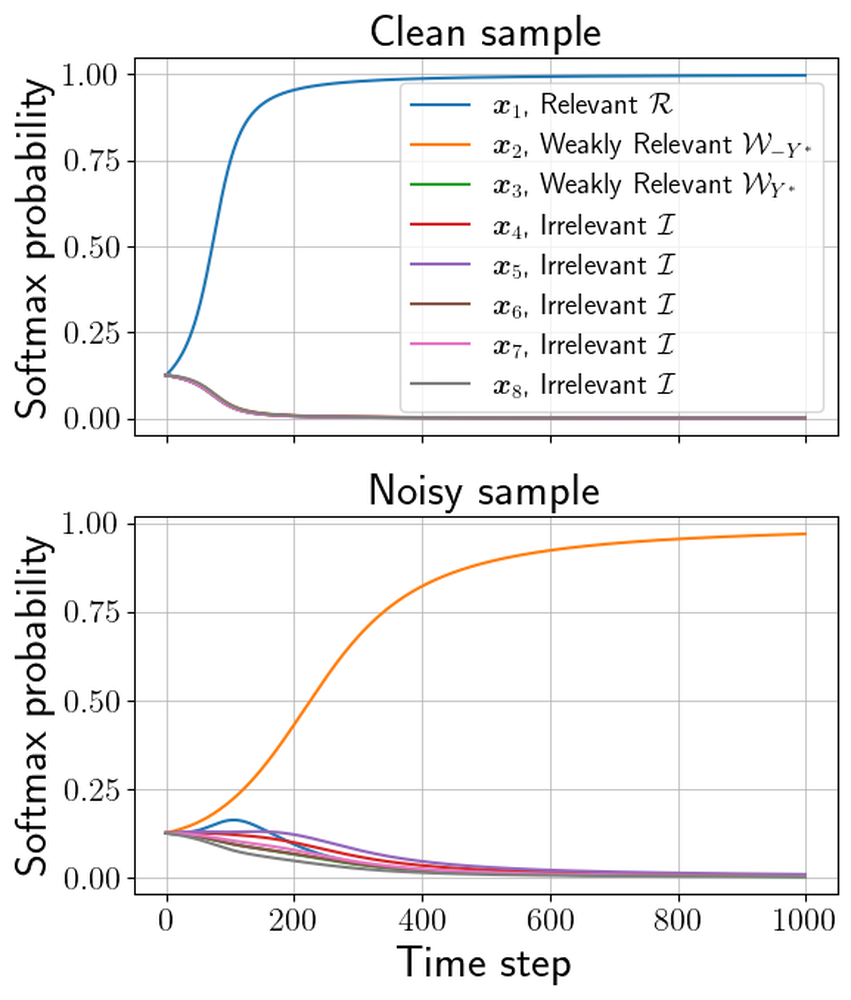
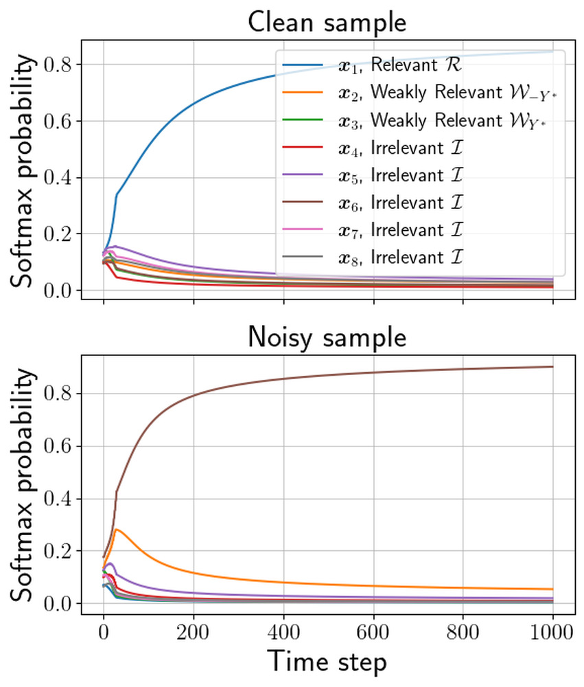

# Benign Overfitting in Token Selection of Attention Mechanism

**ArXiv ID**: 2409.17625v3
**URL**: http://arxiv.org/abs/2409.17625v3
**提交日期**: 2024-09-26
**作者**: Keitaro Sakamoto; Issei Sato
**引用次数**: NULL
使用模型: deepseek-v3-1-terminus

## 1. 核心思想总结
这是一份关于论文《Benign Overfitting in Token Selection of Attention Mechanism》的第一轮总结，按照您要求的四个部分组织。

**第一轮总结**

*   **1. Background (背景)**
    *   注意力机制是Transformer模型的核心组成部分，对其成功至关重要。
    *   然而，关于注意力机制如何学习选择令牌（token）的理论理解仍然是一个新兴的研究领域。

*   **2. Problem (问题)**
    *   本研究旨在探究在**存在标签噪声的分类问题**中，注意力机制的训练动态和泛化能力。
    *   核心问题是：当注意力机制在训练过程中拟合了有噪声的标签时，其泛化性能会受到怎样的影响？

*   **3. Method (high-level) (方法 - 高层概述)**
    *   作者通过**理论分析**来刻画注意力机制的学习过程，关键工具是**信噪比（Signal-to-Noise Ratio, SNR）** 的概念。
    *   他们利用合成数据集和真实世界数据集进行了**实验**，以支持其理论分析结果。

*   **4. Contribution (贡献)**
    *   理论贡献：证明了注意力机制的令牌选择过程能够实现**良性过拟合**。即，即使在拟合了标签噪声的情况下，模型仍能保持很高的泛化性能。
    *   现象发现：揭示了一个有趣的**延迟泛化获取**现象，即模型在经历一个初始的过拟合阶段后，其泛化能力才得以显著提升。
    *   分析工具：引入了信噪比（SNR）作为分析注意力机制学习动态的关键指标。

## 2. 方法详解
好的，基于您提供的初步总结和论文方法章节的内容，以下是对该论文方法细节的详细说明。

### 论文方法细节详解

本论文的核心方法是**理论分析与实验验证相结合**，旨在揭示注意力机制在存在标签噪声的环境下，其令牌选择过程如何实现“良性过拟合”。方法流程可以概括为：首先构建一个简化的理论模型进行分析，然后设计合成与真实实验来验证理论结论。

#### 一、 关键创新与核心思想

论文最关键的理论创新在于引入了**信噪比** 作为分析注意力权重学习动态的**核心指标**。

*   **创新点**：传统分析往往关注损失或准确率等宏观指标。本文则深入到注意力机制内部，通过定义和追踪每个输入令牌（Token）对应注意力权重的信噪比，来精确刻画模型是如何“学会”区分有用信息（信号）和噪声的。
*   **核心思想**：良性过拟合的实现，并非因为模型没有过拟合噪声，而是因为模型在过拟合的同时，能够以一种**非均匀**的方式分配其拟合能力。具体表现为，模型分配给**有用令牌（信号令牌）** 的注意力权重的“信噪比”会远高于分配给**无用/噪声令牌**的权重。最终，在预测时，高信噪比的信号令牌主导了决策过程，从而保证了泛化性能。

#### 二、 理论分析框架与算法细节

理论分析部分构建了一个简化的数学模型，使其易于理论推导，同时又能捕捉到注意力机制的本质。

**1. 问题设定与模型架构：**
*   **任务**：一个多类分类问题。
*   **数据构造**：每个输入序列 `x` 由多个令牌构成，其中包含：
    *   **信号令牌**：与真实标签 `y` 有确定关系的令牌，是分类的关键。
    *   **噪声令牌**：与标签 `y` 无关的令牌，其存在会干扰模型学习。
*   **标签噪声**：训练集中的一部分样本的标签被随机翻转，引入了标签噪声。
*   **模型**：采用一个**单层注意力架构**后接一个线性分类器。这个简化模型排除了深层网络等其他因素的干扰，可以集中分析注意力层的行为。其数学形式如下：
    *   注意力权重计算：`α_i = softmax(<q, k_i>)`，其中 `q` 是查询向量，`k_i` 是第 `i` 个令牌的键向量。
    *   上下文向量：`c = Σ (α_i * v_i)`，其中 `v_i` 是第 `i` 个令牌的值向量。
    *   最终预测：由 `c` 经过线性分类器得到。

**2. 关键分析步骤与算法动态：**
理论分析的核心是推导注意力权重 `α_i` 在训练过程中的演化。

*   **信噪比的定义**：对于一个特定的令牌 `i`，其注意力权重的信噪比被定义为该权重对**模型预测正确部分**的贡献（信号）与对**预测错误部分**的贡献（噪声）的比值。在数学上，这可以通过分析损失函数对 `α_i` 的梯度来间接体现。
*   **训练动态分析**：
    1.  **初始化阶段**：模型刚开始训练时，所有令牌的注意力权重相近，信噪比很低。
    2.  **过拟合阶段**：由于模型具有很强的拟合能力（例如，过参数化），它会开始拟合训练数据中的噪声。此时，**一些噪声令牌的注意力权重会迅速增大**，导致训练损失下降，但验证损失可能上升或持平。这是经典的过拟合现象。
    3.  **良性过拟合与延迟泛化阶段（关键发现）**：
        *   论文证明，尽管模型拟合了噪声，但梯度下降优化的动态特性会导致一个关键现象：**信号令牌权重的信噪比增长速率最终会超过噪声令牌**。
        *   原因在于，信号令牌提供的梯度方向是**一致且稳定**的（因为它们与真实标签有真实关联），而噪声令牌提供的梯度方向是**随机且相互冲突**的。随着训练的进行，这种累积效应使得信号令牌的权重学习得更“扎实”，其信噪比持续提升。
        *   因此，即使噪声令牌的绝对值权重可能也不小，但其信噪比很低。在最终的预测中，**高信噪比的信号令牌占据了主导地位**，从而使模型表现出良好的泛化性能。这个信噪比优势建立起来的过程，就是观察到的“延迟泛化获取”现象。

#### 三、 实验验证的整体流程与关键步骤

实验部分旨在为理论分析提供实证支持，并展示其在更复杂场景下的适用性。

**1. 合成数据实验：**
*   **目的**：在完全可控的环境下验证理论，特别是“延迟泛化”和信噪比变化的关键论断。
*   **数据生成**：按照理论设定，人工生成包含明确信号令牌和噪声令牌的数据集，并人工注入一定比例的标签噪声。
*   **关键步骤与度量**：
    1.  训练简化注意力模型。
    2.  **绘制学习曲线**：同时绘制训练损失/准确率和测试损失/准确率曲线，预期会观察到测试准确率在训练后期才快速上升的“延迟泛化”现象。
    3.  **追踪信噪比**：计算并绘制不同类别令牌（如信号令牌 vs. 噪声令牌）的注意力权重的信噪比随时间的变化曲线。**这是验证论文核心论点的最关键步骤**。理论预测的“信号令牌信噪比最终远高于噪声令牌”的现象应被清晰展示。

**2. 真实世界数据实验：**
*   **目的**：证明理论发现不仅存在于理想化的合成数据中，也适用于实际任务和模型（如Transformer）。
*   **数据集**：选用标准的文本分类数据集（如AGNews， IMDb等），并通过随机翻转一部分训练样本的标签来引入标签噪声。
*   **模型**：使用完整的Transformer模型（如BERT）或论文中设计的简化模型。
*   **关键步骤与度量**：
    1.  在带噪声标签的数据上训练模型。
    2.  **评估泛化性能**：在干净的测试集上评估准确率，展示模型最终能达到很高的性能，即实现“良性过拟合”。
    3.  **验证信噪比分析**：虽然真实数据中无法明确界定每个令牌是“信号”还是“噪声”，但论文可以通过一些代理方法来估算信噪比。例如，可以将与分类任务高度相关的关键词（如评论中的“精彩”、“糟糕”）视为信号令牌，而将常见停用词或无关词视为噪声令牌，然后计算它们注意力权重的统计特性，观察其信噪比差异是否与理论预测一致。

### 总结：整体方法流程

该论文的方法遵循一个清晰的逻辑闭环：

1.  **提出问题**：注意力机制在标签噪声下如何泛化？
2.  **构建理论模型**：简化问题，建立单层注意力模型的理论分析框架。
3.  **理论推导**：以**信噪比**为核心分析工具，推导出训练动态，并理论证明存在**良性过拟合**和**延迟泛化**现象。
4.  **实验验证**：
    *   **合成实验**：在可控环境中精确复现理论预测的现象，尤其是信噪比的变化轨迹，为理论提供坚实证据。
    *   **真实实验**：将结论推广到更复杂的现实场景，证明理论的实际意义和普遍性。

通过这一系列方法，论文令人信服地阐明了注意力机制令牌选择中良性过拟合的内在机理。

## 3. 最终评述与分析
好的，结合前两轮返回的初步总结、方法详述以及论文结论部分的信息，现为您提供对该论文《Benign Overfitting in Token Selection of Attention Mechanism》的最终综合评估。

---

### **关于《注意力机制令牌选择中的良性过拟合》的最终综合评估**

#### 1) **整体摘要**
本论文针对Transformer核心组件——注意力机制，深入研究了其在**存在标签噪声的分类任务**中的学习动态与泛化行为。论文通过理论分析与实验验证相结合的方法，提出了一个核心论点：注意力机制在令牌选择过程中能够实现**良性过拟合**。具体表现为，尽管模型在训练初期会过拟合噪声标签，导致测试性能停滞甚至下降（即**延迟泛化获取**现象），但随着训练的持续，模型能够学会非均匀地分配其拟合能力。其关键在于，模型分配给**信息令牌（信号）** 的注意力权重的**信噪比**会显著超越分配给**噪声令牌**的权重。最终，高信噪比的信号令牌在预测中占据主导，从而使模型在完全拟合训练数据（包括噪声）后，仍能展现出卓越的泛化性能。

#### 2) **优势**
*   **理论创新性强**：论文首次将“良性过拟合”这一现象系统地引入到对注意力机制内部动态的分析中，为理解Transformer的鲁棒性提供了新颖的理论视角。
*   **分析工具精巧**：引入**信噪比**作为核心分析指标是一个关键创新。它使得研究者能够深入到注意力权重层面，定量地刻画模型如何区分信号与噪声，超越了仅关注最终准确率的传统方法。
*   **方法论严谨**：采用了“理论先行，实验验证”的稳健研究路径。首先在简化的单层注意力模型上进行严格的理论推导，得出可验证的结论，再通过合成实验进行精确验证，最后在真实数据集上展示其普遍性，形成了完整的证据链。
*   **解释力深刻**：成功解释了实践中常见的“延迟泛化”现象（即模型需要训练更长时间才能达到最佳性能），将其归因于信号令牌信噪比需要时间积累以超越噪声令牌的内在动力学过程。
*   **潜在影响广泛**：研究结论不仅适用于简化的理论模型，在BERT等标准Transformer模型上的实验也显示了其适用性，增强了结论的实际相关性。

#### 3) **局限性与不足**
*   **理论模型的简化性**：为了数学上的可处理性，理论分析基于高度简化的模型（如单层注意力、特定的数据生成假设）。这虽然有助于抓住本质，但可能与最先进的、深度且复杂的Transformer架构存在差距，其结论在更复杂场景下的普适性需要进一步验证。
*   **“信号”与“噪声”定义的挑战**：在真实世界数据实验中，精确界定每个令牌是“信号”还是“噪声”是困难且带有主观性的。论文采用的代理方法（如依赖关键词）虽然合理，但可能无法完全捕捉真实数据的复杂性，这在一定程度上削弱了信噪比度量在实践中的精确性。
*   **问题设定的特定性**：研究聚焦于**标签噪声**这一特定类型的噪声。对于其他常见的噪声或分布外泛化问题（如上下文噪声、对抗性攻击、领域偏移等），该良性过拟合机制是否依然成立，是未经验证的开环问题。
*   **实验广度有待扩展**：实验部分可以进一步扩展到更多样化的任务（如问答、自然语言推理）、更大规模的模型以及更高程度的标签噪声，以更全面地测试理论的边界和鲁棒性。

#### 4) **潜在应用与启示**
*   **指导模型训练实践**：该研究为训练大型Transformer模型提供了重要启示。例如，当观察到验证集性能出现平台期或暂时下降时（延迟泛化），不应过早停止训练或降低模型容量，而应给予足够的训练时间让模型自行完成信号筛选过程。
*   **为模型设计提供依据**：理解注意力机制的内在鲁棒性，可以鼓励设计者更自信地使用过参数化模型，并可能启发新的**正则化技术**或**优化算法**，旨在主动加速信噪比分离的过程，从而提升训练效率。
*   **推动理论理解**：这项工作为“为什么过参数化的深度学习模型仍然能够泛化”这一核心理论问题提供了来自注意力机制视角的新证据，将激励更多研究从模型内部动态（而不仅仅是泛化边界）去探索其奥秘。
*   **应用于数据清洗与标注**：研究结果表明，即使在标注数据存在一定噪声的情况下，强大的模型仍能取得良好性能。这可能会降低对完美标注数据的依赖，为在“弱监督”或“含噪声标注”的大规模数据上训练模型提供理论信心，对于降低标注成本具有重要意义。

---
**总结**：该论文是一项理论深刻、方法严谨且具有重要启示意义的研究。它成功地揭示了注意力机制在噪声环境中实现卓越性能的内在机理，即通过信噪比分离实现的良性过拟合。尽管存在模型简化等局限性，但其核心思想和分析框架为理解和优化基于注意力机制的模型提供了有力的新工具和方向。

---

# 附录：论文图片

## 图 1

## 图 2

## 图 3

## 图 4

## 图 5

## 图 6

## 图 7

## 图 8

## 图 9

## 图 10

